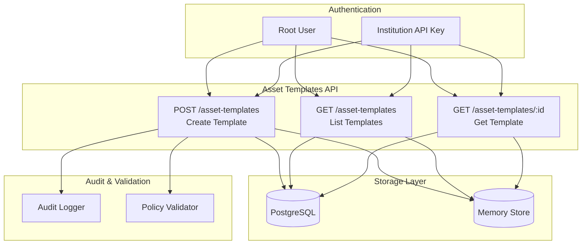
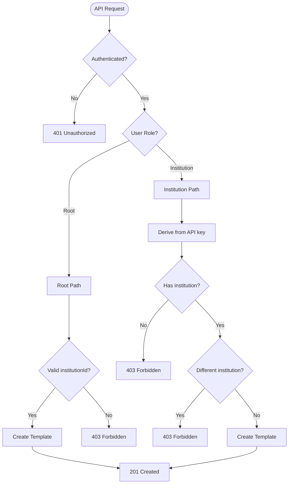

# Asset Templates API

<cite>
**Referenced Files in This Document**
- [src/api/assetTemplates.ts](file://src/api/assetTemplates.ts)
- [src/domain/types.ts](file://src/domain/types.ts)
- [src/domain/verticals.ts](file://src/domain/verticals.ts)
- [src/domain/policy.ts](file://src/domain/policy.ts)
- [src/domain/audit.ts](file://src/domain/audit.ts)
- [src/infra/auditLogger.ts](file://src/infra/auditLogger.ts)
- [src/middleware/auth.ts](file://src/middleware/auth.ts)
- [src/store/postgresStore.ts](file://src/store/postgresStore.ts)
- [src/store/memoryStore.ts](file://src/store/memoryStore.ts)
- [src/server.ts](file://src/server.ts)
- [src/openapi.ts](file://src/openapi.ts)
- [db/schema.sql](file://db/schema.sql)
</cite>

## Table of Contents
1. [Introduction](#introduction)
2. [API Overview](#api-overview)
3. [Authentication & Authorization](#authentication--authorization)
4. [Endpoint Reference](#endpoint-reference)
5. [Request Body Schema](#request-body-schema)
6. [Response Formats](#response-formats)
7. [Validation Rules](#validation-rules)
8. [Institution Scoping Logic](#institution-scoping-logic)
9. [Template Configuration Examples](#template-configuration-examples)
10. [Integration with Audit Logging](#integration-with-audit-logging)
11. [Error Handling](#error-handling)
12. [Client Implementation Examples](#client-implementation-examples)
13. [Best Practices](#best-practices)

## Introduction

The Asset Templates API provides endpoints for managing asset templates in the EscrowGrid Tokenization-as-a-Service (TAAS) platform. Asset templates serve as blueprints for creating assets, defining compliance rules, and enforcing vertical-specific configurations for financial instruments.

Templates define the structure and constraints for assets within specific verticals (CONSTRUCTION, TRADE_FINANCE) and regions (US, EU_UK, SG, UAE). They enable institutions to standardize asset creation processes while maintaining regulatory compliance through configurable validation rules.

## API Overview

The Asset Templates API consists of three primary endpoints under the `/asset-templates` path:

- **POST /asset-templates** - Create new asset templates
- **GET /asset-templates** - List asset templates for an institution
- **GET /asset-templates/:id** - Retrieve a specific asset template by ID



**Diagram sources**
- [src/api/assetTemplates.ts](file://src/api/assetTemplates.ts#L19-L146)
- [src/store/postgresStore.ts](file://src/store/postgresStore.ts#L127-L167)

## Authentication & Authorization

The Asset Templates API requires API key authentication with different permission levels:

### Root Users
- Can specify any institution ID
- Full write access to all institutions
- No institution scoping restrictions

### Institutional API Keys
- Restricted to their own institution
- Cannot create templates for other institutions
- Derived institution ID from API key context

### Access Control Rules
- Write operations require `admin` role
- Read operations accessible to both `admin` and `read_only` roles
- Template access is institution-scoped

**Section sources**
- [src/middleware/auth.ts](file://src/middleware/auth.ts#L1-L95)
- [src/api/assetTemplates.ts](file://src/api/assetTemplates.ts#L28-L63)

## Endpoint Reference

### POST /asset-templates

Creates a new asset template with the specified configuration.

**Authentication**: Requires API key with `admin` role  
**Rate Limiting**: Applied based on API key  
**CORS**: Enabled  

#### Request Headers
- `Content-Type: application/json`
- `X-API-KEY` or `Authorization: Bearer <token>`

#### Request Body Schema

| Field | Type | Required | Description |
|-------|------|----------|-------------|
| `institutionId` | string | Conditional | Required for root users, ignored for institutional keys |
| `code` | string | Yes | Unique template identifier (e.g., "CONSTR_ESCROW") |
| `name` | string | Yes | Human-readable template name |
| `vertical` | Vertical | Yes | Business vertical: "CONSTRUCTION" or "TRADE_FINANCE" |
| `region` | Region | Yes | Geographic region: "US", "EU_UK", "SG", or "UAE" |
| `config` | object | No | Template-specific configuration object |

#### Response Status Codes

| Code | Description |
|------|-------------|
| 201 | Template created successfully |
| 400 | Invalid request body or validation failure |
| 401 | Unauthenticated |
| 403 | Forbidden access |

#### Example Request
```javascript
fetch('https://api.escrowgrid.io/asset-templates', {
  method: 'POST',
  headers: {
    'Content-Type': 'application/json',
    'X-API-KEY': 'your-api-key-here'
  },
  body: JSON.stringify({
    code: 'CONSTR_ESCROW',
    name: 'Construction Escrow Account',
    vertical: 'CONSTRUCTION',
    region: 'US',
    config: {
      currency: 'USD',
      minAmount: 10000,
      maxAmount: 1000000
    }
  })
})
```

### GET /asset-templates

Lists asset templates for an institution.

**Authentication**: Required  
**Rate Limiting**: Applied based on API key  

#### Query Parameters

| Parameter | Type | Description |
|-----------|------|-------------|
| `institutionId` | string | Optional. Filter by specific institution (root only) |

#### Response Format

Returns an array of asset templates:

```json
[
  {
    "id": "tmpl_abc123",
    "institutionId": "inst_xyz789",
    "code": "CONSTR_ESCROW",
    "name": "Construction Escrow Account",
    "vertical": "CONSTRUCTION",
    "region": "US",
    "config": {
      "currency": "USD",
      "minAmount": 10000,
      "maxAmount": 1000000
    },
    "createdAt": "2024-01-15T10:30:00Z",
    "updatedAt": "2024-01-15T10:30:00Z"
  }
]
```

### GET /asset-templates/:id

Retrieves a specific asset template by ID.

**Authentication**: Required  
**Rate Limiting**: Applied based on API key  

#### Path Parameters

| Parameter | Type | Description |
|-----------|------|-------------|
| `id` | string | Asset template ID |

#### Response Status Codes

| Code | Description |
|------|-------------|
| 200 | Template found |
| 401 | Unauthenticated |
| 403 | Forbidden to access this template |
| 404 | Template not found |

**Section sources**
- [src/api/assetTemplates.ts](file://src/api/assetTemplates.ts#L19-L146)
- [src/openapi.ts](file://src/openapi.ts#L505-L608)

## Request Body Schema

### Core Fields

#### institutionId
- **Type**: string
- **Purpose**: Identifies the owning institution
- **Root Users**: Must specify (cannot be derived from API key)
- **Institution Keys**: Ignored, automatically set to API key's institution

#### code
- **Type**: string
- **Pattern**: Alphanumeric with underscores (e.g., "CONSTR_ESCROW", "TF_LC")
- **Uniqueness**: Must be unique within the institution
- **Examples**: "CONSTR_ESCROW", "CONSTR_RETAINAGE", "TF_INVOICE", "TF_LC"

#### name
- **Type**: string
- **Purpose**: Human-readable display name
- **Length**: Minimum 1 character, maximum 100 characters
- **Example**: "Construction Escrow Account"

#### vertical
- **Type**: Vertical enum
- **Values**: "CONSTRUCTION" | "TRADE_FINANCE"
- **Purpose**: Defines the business domain
- **Relationship**: Determines available template configurations

#### region
- **Type**: Region enum
- **Values**: "US" | "EU_UK" | "SG" | "UAE"
- **Purpose**: Geographic compliance jurisdiction
- **Constraint**: Must match the institution's authorized regions

#### config
- **Type**: object
- **Purpose**: Template-specific configuration
- **Validation**: Depends on vertical and code combination
- **Format**: JSON object with vertical-specific schema

### Required Fields

All endpoints require the following fields in the request body:
- `code`: Template identifier
- `name`: Display name
- `vertical`: Business vertical
- `region`: Geographic region

**Section sources**
- [src/api/assetTemplates.ts](file://src/api/assetTemplates.ts#L10-L17)
- [src/domain/types.ts](file://src/domain/types.ts#L1-L85)

## Response Formats

### Successful Creation (201)

Returns the created asset template with generated ID and timestamps:

```json
{
  "id": "tmpl_abc123def456",
  "institutionId": "inst_xyz789",
  "code": "CONSTR_ESCROW",
  "name": "Construction Escrow Account",
  "vertical": "CONSTRUCTION",
  "region": "US",
  "config": {
    "currency": "USD",
    "minAmount": 10000,
    "maxAmount": 1000000
  },
  "createdAt": "2024-01-15T10:30:00.000Z",
  "updatedAt": "2024-01-15T10:30:00.000Z"
}
```

### List Response (200)

Returns an array of asset templates:

```json
[
  {
    "id": "tmpl_abc123",
    "institutionId": "inst_xyz789",
    "code": "CONSTR_ESCROW",
    "name": "Construction Escrow Account",
    "vertical": "CONSTRUCTION",
    "region": "US",
    "config": {...},
    "createdAt": "2024-01-15T10:30:00.000Z",
    "updatedAt": "2024-01-15T10:30:00.000Z"
  }
]
```

### Error Responses (4xx)

Standard error format with error message and optional details:

```json
{
  "error": "Invalid request body",
  "details": "code, name, vertical, and region are required"
}
```

**Section sources**
- [src/api/assetTemplates.ts](file://src/api/assetTemplates.ts#L89-L96)
- [src/domain/types.ts](file://src/domain/types.ts#L16-L26)

## Validation Rules

### Basic Field Validation

#### Required Fields Check
All four core fields (`code`, `name`, `vertical`, `region`) must be present and non-empty.

#### Field Type Validation
- `code`: string, non-empty
- `name`: string, non-empty
- `vertical`: must be valid enum value
- `region`: must be valid enum value
- `config`: optional object, defaults to empty object

### Institution Context Validation

#### Root User Validation
- Must provide `institutionId` in request body
- Institution must exist in system
- No automatic derivation from API key

#### Institutional Key Validation
- Automatic institution derivation from API key
- Cannot specify different institution ID
- Must have institution associated with API key

### Template Configuration Validation

The `config` field undergoes vertical-specific validation:

#### Construction Templates
- **CONSTR_ESCROW**: Validates currency, region, minAmount, maxAmount
- **CONSTR_RETAINAGE**: Validates currency and retainage percentage (0-100%)

#### Trade Finance Templates
- **TF_INVOICE**: Validates currency, maxTenorDays, country
- **TF_LC**: Validates currency, issuingBankCountry, maxTenorDays

### Regional Constraints

#### Region Matching
For construction templates, the `config.region` must match the template's `region`.

#### Currency Validation
Currency codes must be valid ISO 4217 codes.

**Section sources**
- [src/api/assetTemplates.ts](file://src/api/assetTemplates.ts#L35-L63)
- [src/domain/verticals.ts](file://src/domain/verticals.ts#L32-L124)

## Institution Scoping Logic

The Asset Templates API implements a hierarchical access control system:

### Root User Access
- **Scope**: All institutions in the system
- **Behavior**: Can specify any `institutionId` in requests
- **Restrictions**: None (except validation rules)
- **Use Case**: Administrative operations across institutions

### Institutional API Key Access
- **Scope**: Single institution only
- **Behavior**: Automatically derives `institutionId` from API key
- **Restrictions**: Cannot create templates for other institutions
- **Use Case**: Normal operational access

### Access Control Flow



**Diagram sources**
- [src/api/assetTemplates.ts](file://src/api/assetTemplates.ts#L43-L63)
- [src/middleware/auth.ts](file://src/middleware/auth.ts#L84-L95)

### Scoping Implementation

The effective institution ID is determined by:

```typescript
const effectiveInstitutionId = 
  auth.role === 'root'
    ? institutionId  // Root can specify any institution
    : auth.institutionId; // Institutional keys use their own
```

**Section sources**
- [src/api/assetTemplates.ts](file://src/api/assetTemplates.ts#L43-L63)
- [src/middleware/auth.ts](file://src/middleware/auth.ts#L1-L95)

## Template Configuration Examples

### Construction Templates

#### CONSTR_ESCROW Template
Used for construction escrow accounts:

```json
{
  "code": "CONSTR_ESCROW",
  "name": "Construction Escrow Account",
  "vertical": "CONSTRUCTION",
  "region": "US",
  "config": {
    "currency": "USD",
    "region": "US",
    "minAmount": 10000,
    "maxAmount": 1000000
  }
}
```

**Configuration Schema**:
- `currency`: ISO 4217 currency code (required)
- `region`: Must match template region (required)
- `minAmount`: Minimum escrow amount (optional)
- `maxAmount`: Maximum escrow amount (optional)

#### CONSTR_RETAINAGE Template
Used for construction retainage arrangements:

```json
{
  "code": "CONSTR_RETAINAGE",
  "name": "Construction Retainage Account",
  "vertical": "CONSTRUCTION",
  "region": "US",
  "config": {
    "currency": "USD",
    "retainagePercentage": 10
  }
}
```

**Configuration Schema**:
- `currency`: ISO 4217 currency code (required)
- `retainagePercentage`: Percentage (0-100) (required)

### Trade Finance Templates

#### TF_INVOICE Template
Used for trade finance invoice financing:

```json
{
  "code": "TF_INVOICE",
  "name": "Trade Finance Invoice",
  "vertical": "TRADE_FINANCE",
  "region": "SG",
  "config": {
    "currency": "USD",
    "maxTenorDays": 90,
    "country": "US"
  }
}
```

**Configuration Schema**:
- `currency`: ISO 4217 currency code (required)
- `maxTenorDays`: Maximum payment term (required, positive number)
- `country`: Issuing country (required)

#### TF_LC Template
Used for trade finance letters of credit:

```json
{
  "code": "TF_LC",
  "name": "Trade Finance Letter of Credit",
  "vertical": "TRADE_FINANCE",
  "region": "UAE",
  "config": {
    "currency": "EUR",
    "maxTenorDays": 180,
    "issuingBankCountry": "DE"
  }
}
```

**Configuration Schema**:
- `currency`: ISO 4217 currency code (required)
- `maxTenorDays`: Maximum LC term (required, positive number)
- `issuingBankCountry`: Country of issuing bank (required)

**Section sources**
- [src/domain/verticals.ts](file://src/domain/verticals.ts#L8-L124)

## Integration with Audit Logging

The Asset Templates API integrates with the audit logging system to track template creation events:

### Audit Event Details

When a template is successfully created, the following audit event is recorded:

```json
{
  "action": "ASSET_TEMPLATE_CREATED",
  "method": "POST",
  "path": "/asset-templates",
  "resourceType": "asset_template",
  "resourceId": "tmpl_abc123def456",
  "payload": {
    "institutionId": "inst_xyz789",
    "code": "CONSTR_ESCROW",
    "name": "Construction Escrow Account",
    "vertical": "CONSTRUCTION",
    "region": "US"
  },
  "auth": {
    "role": "admin",
    "institutionId": "inst_xyz789",
    "apiKeyId": "key_123abc"
  }
}
```

### Audit Logger Implementation

The audit logger supports both storage backends:

#### PostgreSQL Backend
Stores audit events in the `audit_events` table with JSONB payload storage.

#### Memory Backend
Maintains in-memory event history for testing and development.

### Audit Event Schema

| Field | Type | Description |
|-------|------|-------------|
| `id` | string | Unique audit event ID |
| `occurredAt` | string | ISO timestamp of event |
| `method` | string | HTTP method used |
| `path` | string | Request path |
| `action` | string | Audit action type |
| `resourceType` | string | Resource category |
| `resourceId` | string | Resource identifier |
| `payload` | object | Event-specific data |
| `auth` | object | Authentication context |

**Section sources**
- [src/api/assetTemplates.ts](file://src/api/assetTemplates.ts#L74-L88)
- [src/infra/auditLogger.ts](file://src/infra/auditLogger.ts#L1-L109)
- [src/domain/audit.ts](file://src/domain/audit.ts#L1-L34)

## Error Handling

### Standard Error Response Format

All error responses follow a consistent structure:

```json
{
  "error": "Error description",
  "details": "Additional context (optional)"
}
```

### HTTP Status Codes

| Status Code | Scenario | Response Body |
|-------------|----------|---------------|
| 400 | Invalid request body or validation failure | `{ "error": "Invalid request body", "details": "Specific validation message" }` |
| 401 | Missing or invalid API key | `{ "error": "Unauthenticated" }` |
| 403 | Forbidden access | `{ "error": "Forbidden", "details": "Access restriction message" }` |
| 404 | Template not found | `{ "error": "Asset template not found" }` |
| 500 | Internal server error | `{ "error": "Internal server error", "details": "Error details" }` |

### Common Error Scenarios

#### Validation Errors
```json
{
  "error": "Invalid request body",
  "details": "code, name, vertical, and region are required"
}
```

#### Institution Context Errors
```json
{
  "error": "Invalid institution context",
  "details": "Institution must be specified or derived from API key"
}
```

#### Access Violation Errors
```json
{
  "error": "Forbidden",
  "details": "Cannot create templates for a different institution"
}
```

#### Template Creation Failures
```json
{
  "error": "Failed to create asset template",
  "details": "Template configuration validation failed"
}
```

### Error Recovery Strategies

#### Client-Side Handling
```javascript
async function createTemplate(templateData) {
  try {
    const response = await fetch('/asset-templates', {
      method: 'POST',
      headers: { 'Content-Type': 'application/json' },
      body: JSON.stringify(templateData)
    });
    
    if (!response.ok) {
      const error = await response.json();
      throw new Error(error.details || error.error);
    }
    
    return await response.json();
  } catch (error) {
    console.error('Template creation failed:', error.message);
    // Implement retry logic or fallback
  }
}
```

**Section sources**
- [src/api/assetTemplates.ts](file://src/api/assetTemplates.ts#L35-L41)
- [src/api/assetTemplates.ts](file://src/api/assetTemplates.ts#L91-L96)

## Client Implementation Examples

### JavaScript/TypeScript Implementation

#### Basic Template Creation
```typescript
interface AssetTemplate {
  id?: string;
  institutionId?: string;
  code: string;
  name: string;
  vertical: 'CONSTRUCTION' | 'TRADE_FINANCE';
  region: 'US' | 'EU_UK' | 'SG' | 'UAE';
  config: Record<string, unknown>;
}

async function createAssetTemplate(
  template: Omit<AssetTemplate, 'id'>,
  apiKey: string
): Promise<AssetTemplate> {
  const response = await fetch('/asset-templates', {
    method: 'POST',
    headers: {
      'Content-Type': 'application/json',
      'X-API-KEY': apiKey
    },
    body: JSON.stringify(template)
  });
  
  if (!response.ok) {
    const errorData = await response.json();
    throw new Error(errorData.details || errorData.error);
  }
  
  return await response.json();
}
```

#### Advanced Implementation with Retry Logic
```typescript
class AssetTemplateClient {
  private baseUrl: string;
  private apiKey: string;
  
  constructor(baseUrl: string, apiKey: string) {
    this.baseUrl = baseUrl;
    this.apiKey = apiKey;
  }
  
  async createTemplate(template: Omit<AssetTemplate, 'id'>): Promise<AssetTemplate> {
    const maxRetries = 3;
    let lastError: Error;
    
    for (let attempt = 1; attempt <= maxRetries; attempt++) {
      try {
        const response = await this.request('/asset-templates', {
          method: 'POST',
          body: JSON.stringify(template)
        });
        
        if (response.status === 400) {
          const errorData = await response.json();
          throw new Error(`Validation error: ${errorData.details}`);
        }
        
        if (response.status === 403) {
          const errorData = await response.json();
          throw new Error(`Access denied: ${errorData.error}`);
        }
        
        if (!response.ok) {
          throw new Error(`HTTP ${response.status}: ${response.statusText}`);
        }
        
        return await response.json();
        
      } catch (error) {
        lastError = error as Error;
        
        if (attempt === maxRetries) break;
        
        // Exponential backoff
        await new Promise(resolve => 
          setTimeout(resolve, Math.pow(2, attempt) * 1000)
        );
      }
    }
    
    throw lastError!;
  }
  
  private async request(path: string, options: RequestInit = {}): Promise<Response> {
    const headers = {
      'Content-Type': 'application/json',
      'X-API-KEY': this.apiKey,
      ...options.headers
    };
    
    return await fetch(`${this.baseUrl}${path}`, {
      ...options,
      headers
    });
  }
}
```

#### Template Listing with Pagination
```typescript
interface ListParams {
  institutionId?: string;
  page?: number;
  pageSize?: number;
}

async function listAssetTemplates(params: ListParams = {}): Promise<AssetTemplate[]> {
  const queryParams = new URLSearchParams();
  
  if (params.institutionId) {
    queryParams.set('institutionId', params.institutionId);
  }
  
  if (params.page !== undefined) {
    queryParams.set('page', params.page.toString());
  }
  
  if (params.pageSize !== undefined) {
    queryParams.set('pageSize', params.pageSize.toString());
  }
  
  const response = await fetch(`/asset-templates?${queryParams.toString()}`, {
    headers: { 'X-API-KEY': apiKey }
  });
  
  if (!response.ok) {
    throw new Error(`Failed to list templates: ${response.statusText}`);
  }
  
  return await response.json();
}
```

### Edge Case Handling

#### Duplicate Template Codes
```typescript
async function createUniqueTemplate(template: AssetTemplate): Promise<AssetTemplate> {
  try {
    return await createAssetTemplate(template);
  } catch (error) {
    if (error.message.includes('duplicate')) {
      // Append timestamp to make unique
      const uniqueTemplate = {
        ...template,
        code: `${template.code}_${Date.now()}`
      };
      return await createAssetTemplate(uniqueTemplate);
    }
    throw error;
  }
}
```

#### Invalid Region Handling
```typescript
async function validateTemplate(template: AssetTemplate): Promise<boolean> {
  // Check if region is supported by institution
  const institutionResponse = await fetch(`/institutions/${template.institutionId}`, {
    headers: { 'X-API-KEY': apiKey }
  });
  
  if (!institutionResponse.ok) {
    throw new Error('Failed to validate institution');
  }
  
  const institution = await institutionResponse.json();
  
  if (!institution.regions.includes(template.region)) {
    throw new Error(`Region "${template.region}" not supported by institution`);
  }
  
  return true;
}
```

**Section sources**
- [src/api/assetTemplates.ts](file://src/api/assetTemplates.ts#L19-L146)

## Best Practices

### Template Design Guidelines

#### Naming Conventions
- Use descriptive, hierarchical naming: `VERTICAL_SUBTYPE`
- Examples: `CONSTR_ESCROW`, `CONSTR_RETAINAGE`, `TF_INVOICE`, `TF_LC`
- Avoid special characters except underscores

#### Configuration Standards
- Define minimum and maximum values for numeric fields
- Use ISO standards for currencies and countries
- Include regional compliance information

#### Security Considerations
- Validate all configuration parameters
- Implement proper access controls
- Log all template creation activities

### Performance Optimization

#### Caching Strategies
- Cache frequently accessed templates
- Implement template versioning for updates
- Use appropriate indexing in database

#### Batch Operations
- Group related template creations
- Use bulk operations when available
- Minimize API round trips

### Monitoring and Observability

#### Key Metrics
- Template creation rates
- Validation failure rates
- Access pattern analysis
- Audit event volumes

#### Alerting
- Template creation failures
- Unauthorized access attempts
- Performance degradation

### Compliance and Governance

#### Regulatory Requirements
- Ensure template configurations comply with regional regulations
- Maintain audit trails for all changes
- Implement approval workflows for sensitive templates

#### Data Protection
- Secure API key storage
- Encrypt sensitive configuration data
- Implement proper data retention policies

**Section sources**
- [src/domain/verticals.ts](file://src/domain/verticals.ts#L32-L124)
- [src/infra/auditLogger.ts](file://src/infra/auditLogger.ts#L1-L109)