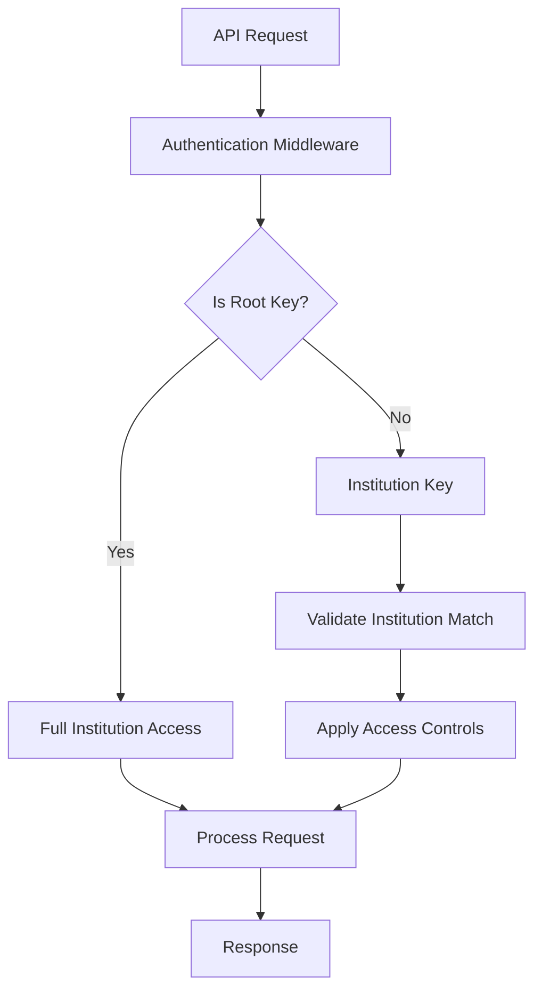
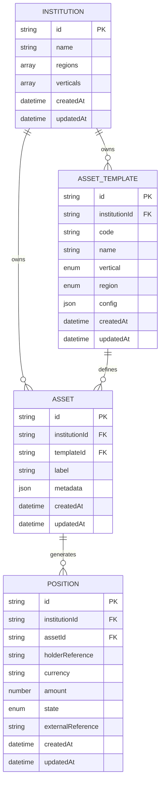
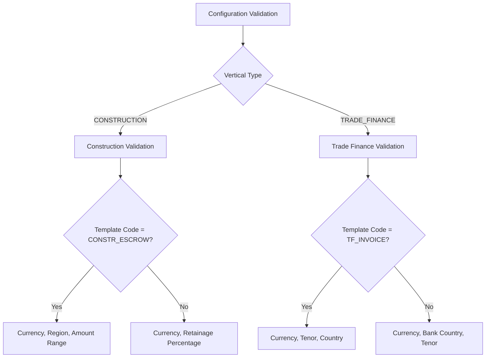
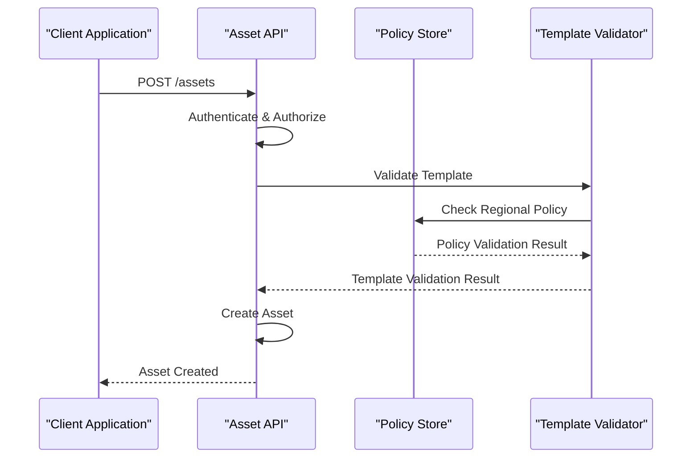
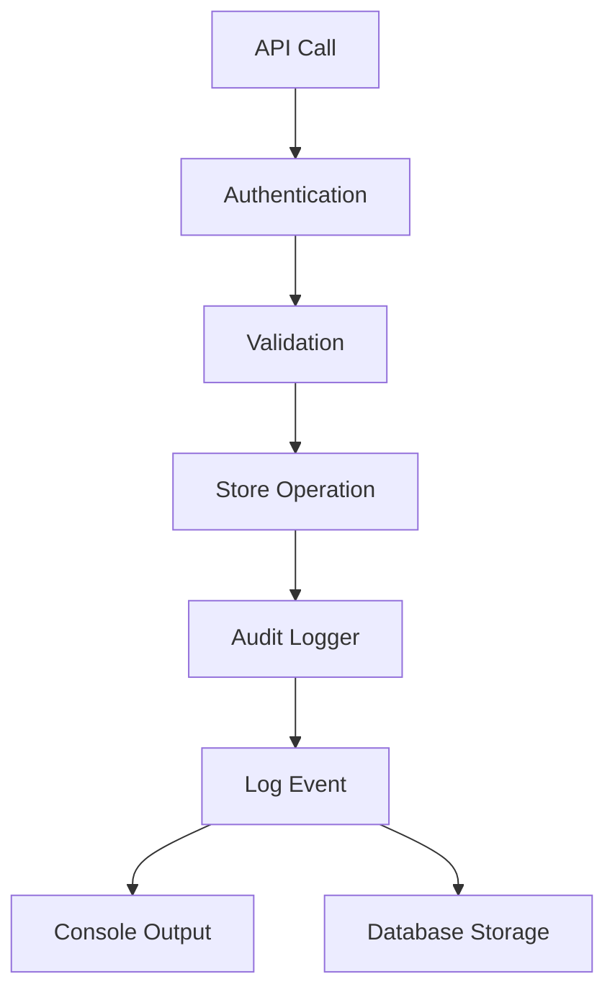
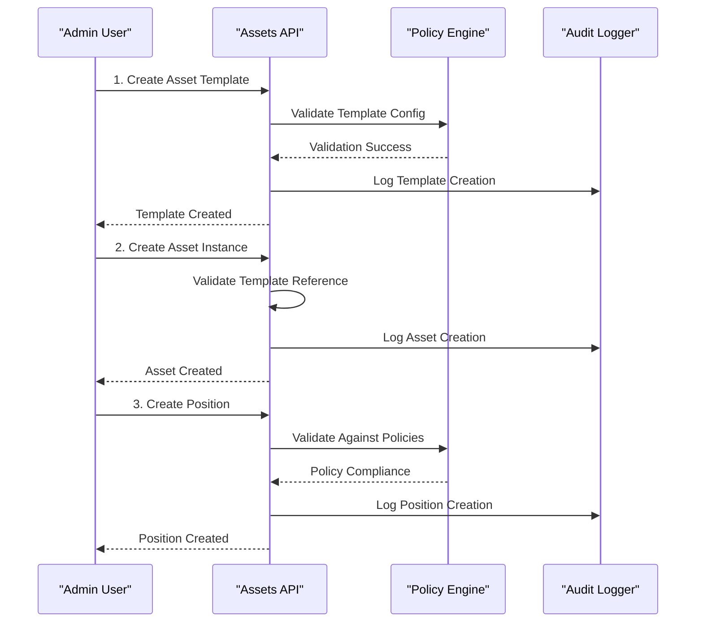

# Assets & Asset Templates API

<cite>
**Referenced Files in This Document**
- [src/api/assetTemplates.ts](file://src/api/assetTemplates.ts)
- [src/api/assets.ts](file://src/api/assets.ts)
- [src/domain/types.ts](file://src/domain/types.ts)
- [src/domain/verticals.ts](file://src/domain/verticals.ts)
- [src/middleware/auth.ts](file://src/middleware/auth.ts)
- [src/store/postgresStore.ts](file://src/store/postgresStore.ts)
- [src/openapi.ts](file://src/openapi.ts)
- [src/infra/auditLogger.ts](file://src/infra/auditLogger.ts)
- [src/domain/audit.ts](file://src/domain/audit.ts)
- [src/api/policies.ts](file://src/api/policies.ts)
- [src/infra/policyStore.ts](file://src/infra/policyStore.ts)
- [src/server.ts](file://src/server.ts)
</cite>

## Table of Contents
1. [Introduction](#introduction)
2. [Authentication & Authorization](#authentication--authorization)
3. [Asset Templates API](#asset-templates-api)
4. [Assets API](#assets-api)
5. [Domain Model](#domain-model)
6. [Template Configuration Schema](#template-configuration-schema)
7. [Policy Integration](#policy-integration)
8. [Audit Logging](#audit-logging)
9. [Error Handling](#error-handling)
10. [Usage Patterns](#usage-patterns)
11. [Best Practices](#best-practices)

## Introduction

The Assets and Asset Templates API provides comprehensive functionality for managing financial instrument templates and their instances within the EscrowGrid Tokenization-as-a-Service (TAAS) platform. This system enables institutions to define standardized templates for different financial instruments across various verticals and regions, then create asset instances based on these templates.

The API follows RESTful principles and implements role-based access control with support for both root-level administration and institution-scoped operations. All operations are audited and integrated with policy enforcement mechanisms.

## Authentication & Authorization

### API Key Authentication

All API endpoints require authentication via API keys passed in the `X-API-KEY` header or as a Bearer token in the `Authorization` header.

```http
GET /asset-templates
X-API-KEY: your-api-key-here
```

### Role-Based Permissions

The system supports two API key roles with different permission levels:

| Role | Description | Allowed Operations |
|------|-------------|-------------------|
| `admin` | Full administrative access | Create, read, update, delete all resources |
| `read_only` | Read-only access | Read operations only |

### Institution-Level Access Control

- **Root Keys**: Can access all institutions and perform any operation
- **Institution Keys**: Restricted to their own institution's data
- **Cross-Institution Access**: Forbidden except for root keys



**Diagram sources**
- [src/middleware/auth.ts](file://src/middleware/auth.ts#L35-L95)

**Section sources**
- [src/middleware/auth.ts](file://src/middleware/auth.ts#L1-L95)

## Asset Templates API

### POST /asset-templates

Creates a new asset template for an institution.

#### Request Headers
- `X-API-KEY`: API key for authentication
- `Content-Type: application/json`

#### Request Body Schema

| Field | Type | Required | Description |
|-------|------|----------|-------------|
| `institutionId` | string | No (root only) | Target institution ID (root keys only) |
| `code` | string | Yes | Unique template identifier (e.g., "CONSTR_ESCROW") |
| `name` | string | Yes | Human-readable template name |
| `vertical` | Vertical | Yes | Business vertical ("CONSTRUCTION" or "TRADE_FINANCE") |
| `region` | Region | Yes | Geographic region ("US", "EU_UK", "SG", "UAE") |
| `config` | object | No | Template-specific configuration (see schema below) |

#### Response

**Success Response (201 Created)**
```json
{
  "id": "tmpl_abc123",
  "institutionId": "inst_xyz789",
  "code": "CONSTR_ESCROW",
  "name": "Construction Escrow",
  "vertical": "CONSTRUCTION",
  "region": "EU_UK",
  "config": {
    "currency": "USD",
    "minAmount": 1000,
    "maxAmount": 1000000
  },
  "createdAt": "2024-01-15T10:30:00Z",
  "updatedAt": "2024-01-15T10:30:00Z"
}
```

#### Validation Rules

- `code`, `name`, `vertical`, and `region` are required
- Template configuration must pass vertical-specific validation
- Institution must exist and match authentication context
- Cross-institution creation forbidden for non-root keys

#### Error Responses

| Status | Error | Description |
|--------|-------|-------------|
| 400 | Invalid request body | Missing required fields |
| 400 | Invalid request body | Validation failure |
| 401 | Unauthenticated | Missing or invalid API key |
| 403 | Forbidden | Insufficient permissions |
| 403 | Forbidden | Cannot create templates for different institution |

### GET /asset-templates

Lists asset templates for an institution.

#### Query Parameters

| Parameter | Type | Description |
|-----------|------|-------------|
| `institutionId` | string | Filter by institution ID (root only) |

#### Response

**Success Response (200 OK)**
```json
[
  {
    "id": "tmpl_abc123",
    "institutionId": "inst_xyz789",
    "code": "CONSTR_ESCROW",
    "name": "Construction Escrow",
    "vertical": "CONSTRUCTION",
    "region": "EU_UK",
    "config": { /* template config */ },
    "createdAt": "2024-01-15T10:30:00Z",
    "updatedAt": "2024-01-15T10:30:00Z"
  }
]
```

### GET /asset-templates/{id}

Retrieves a specific asset template by ID.

#### Path Parameters

| Parameter | Type | Description |
|-----------|------|-------------|
| `id` | string | Asset template ID |

#### Response

**Success Response (200 OK)**
```json
{
  "id": "tmpl_abc123",
  "institutionId": "inst_xyz789",
  "code": "CONSTR_ESCRO",
  "name": "Construction Escrow",
  "vertical": "CONSTRUCTION",
  "region": "EU_UK",
  "config": { /* template config */ },
  "createdAt": "2024-01-15T10:30:00Z",
  "updatedAt": "2024-01-15T10:30:00Z"
}
```

**Section sources**
- [src/api/assetTemplates.ts](file://src/api/assetTemplates.ts#L1-L147)

## Assets API

### POST /assets

Creates a new asset based on an existing template.

#### Request Headers
- `X-API-KEY`: API key for authentication
- `Content-Type: application/json`

#### Request Body Schema

| Field | Type | Required | Description |
|-------|------|----------|-------------|
| `institutionId` | string | No (root only) | Target institution ID (root keys only) |
| `templateId` | string | Yes | Reference to asset template |
| `label` | string | Yes | Human-readable asset identifier |
| `metadata` | object | No | Arbitrary JSON metadata |

#### Response

**Success Response (201 Created)**
```json
{
  "id": "asset_def456",
  "institutionId": "inst_xyz789",
  "templateId": "tmpl_abc123",
  "label": "Project Alpha Escrow",
  "metadata": {
    "projectCode": "ALPHA-001",
    "contractValue": 500000
  },
  "createdAt": "2024-01-15T11:15:00Z",
  "updatedAt": "2024-01-15T11:15:00Z"
}
```

#### Validation Rules

- `templateId` and `label` are required
- Template must exist and belong to the institution
- Institution context validated against API key
- Cross-institution creation forbidden for non-root keys

#### Error Responses

| Status | Error | Description |
|--------|-------|-------------|
| 400 | Invalid request body | Missing required fields |
| 400 | Asset template not found for asset | Template not accessible |
| 401 | Unauthenticated | Missing or invalid API key |
| 403 | Forbidden | Insufficient permissions |
| 403 | Forbidden | Cannot create assets for different institution |

### GET /assets

Lists assets with optional filtering.

#### Query Parameters

| Parameter | Type | Description |
|-----------|------|-------------|
| `institutionId` | string | Filter by institution ID (root only) |
| `templateId` | string | Filter by template ID |

#### Response

**Success Response (200 OK)**
```json
[
  {
    "id": "asset_def456",
    "institutionId": "inst_xyz789",
    "templateId": "tmpl_abc123",
    "label": "Project Alpha Escrow",
    "metadata": { /* asset metadata */ },
    "createdAt": "2024-01-15T11:15:00Z",
    "updatedAt": "2024-01-15T11:15:00Z"
  }
]
```

### GET /assets/{id}

Retrieves a specific asset by ID.

#### Path Parameters

| Parameter | Type | Description |
|-----------|------|-------------|
| `id` | string | Asset ID |

#### Response

**Success Response (200 OK)**
```json
{
  "id": "asset_def456",
  "institutionId": "inst_xyz789",
  "templateId": "tmpl_abc123",
  "label": "Project Alpha Escrow",
  "metadata": { /* asset metadata */ },
  "createdAt": "2024-01-15T11:15:00Z",
  "updatedAt": "2024-01-15T11:15:00Z"
}
```

**Section sources**
- [src/api/assets.ts](file://src/api/assets.ts#L1-L147)

## Domain Model

### Core Entities



**Diagram sources**
- [src/domain/types.ts](file://src/domain/types.ts#L16-L68)

### Types Definition

#### Region Enumeration
- `US`: United States
- `EU_UK`: European Union / United Kingdom
- `SG`: Singapore
- `UAE`: United Arab Emirates

#### Vertical Enumeration
- `CONSTRUCTION`: Construction industry escrow products
- `TRADE_FINANCE`: Trade finance instruments

#### Asset Template Structure
```typescript
interface AssetTemplate {
  id: string;
  institutionId: string;
  code: string;
  name: string;
  vertical: Vertical;
  region: Region;
  config: Record<string, unknown>;
  createdAt: string;
  updatedAt: string;
}
```

#### Asset Structure
```typescript
interface Asset {
  id: string;
  institutionId: string;
  templateId: string;
  label: string;
  metadata: Record<string, unknown>;
  createdAt: string;
  updatedAt: string;
}
```

**Section sources**
- [src/domain/types.ts](file://src/domain/types.ts#L1-L85)

## Template Configuration Schema

### Construction Vertical Templates

#### CONSTR_ESCROW (Construction Escrow)
Used for construction project escrow arrangements.

**Configuration Schema**
```typescript
interface ConstructionEscrowConfig {
  currency: string;           // Required: Currency code (e.g., "USD")
  region: Region;            // Required: Must match template region
  minAmount?: number;        // Optional: Minimum escrow amount
  maxAmount?: number;        // Optional: Maximum escrow amount
}
```

**Example Configuration**
```json
{
  "currency": "USD",
  "region": "EU_UK",
  "minAmount": 10000,
  "maxAmount": 1000000
}
```

#### CONSTR_RETAINAGE (Construction Retainage)
Handles construction retainage payment structures.

**Configuration Schema**
```typescript
interface ConstructionRetainageConfig {
  currency: string;           // Required: Currency code
  retainagePercentage: number; // Required: Percentage (0-100)
}
```

**Example Configuration**
```json
{
  "currency": "USD",
  "retainagePercentage": 10
}
```

### Trade Finance Vertical Templates

#### TF_INVOICE (Invoice Financing)
Supports invoice-based financing arrangements.

**Configuration Schema**
```typescript
interface TradeFinanceInvoiceConfig {
  currency: string;           // Required: Currency code
  maxTenorDays: number;      // Required: Maximum term in days (> 0)
  country: string;           // Required: Country code
}
```

**Example Configuration**
```json
{
  "currency": "USD",
  "maxTenorDays": 90,
  "country": "US"
}
```

#### TF_LC (Letter of Credit)
Manages letter of credit-based trade finance.

**Configuration Schema**
```typescript
interface TradeFinanceLcConfig {
  currency: string;           // Required: Currency code
  issuingBankCountry: string; // Required: Issuing bank country
  maxTenorDays: number;      // Required: Maximum term in days (> 0)
}
```

**Example Configuration**
```json
{
  "currency": "USD",
  "issuingBankCountry": "UK",
  "maxTenorDays": 180
}
```

### Validation Rules

Template configurations are validated based on the combination of `vertical`, `code`, and `region`:



**Diagram sources**
- [src/domain/verticals.ts](file://src/domain/verticals.ts#L32-L125)

**Section sources**
- [src/domain/verticals.ts](file://src/domain/verticals.ts#L1-L125)

## Policy Integration

### Policy Enforcement During Creation

The system integrates with policy enforcement mechanisms to validate asset and template creation against institutional and regional policies.

#### Policy Configuration Structure

```typescript
interface InstitutionPolicyConfig {
  region: Region;
  position: {
    minAmount?: number;
    maxAmount?: number;
    allowedCurrencies?: string[];
  };
}
```

#### Policy Validation Flow



**Diagram sources**
- [src/store/postgresStore.ts](file://src/store/postgresStore.ts#L191-L204)
- [src/api/policies.ts](file://src/api/policies.ts#L1-L129)

### Policy Management Endpoints

#### Get Institution Policies
```http
GET /institutions/{id}/policies
```

#### Get Regional Policy
```http
GET /institutions/{id}/policies/{region}
```

#### Update Regional Policy
```http
PUT /institutions/{id}/policies/{region}
```

**Section sources**
- [src/api/policies.ts](file://src/api/policies.ts#L1-L129)
- [src/infra/policyStore.ts](file://src/infra/policyStore.ts#L1-L131)

## Audit Logging

### Audit Events

All asset and template operations are automatically logged with comprehensive audit trails.

#### Supported Audit Actions

| Action | Description |
|--------|-------------|
| `ASSET_TEMPLATE_CREATED` | New asset template creation |
| `ASSET_CREATED` | New asset instantiation |

#### Audit Event Structure

```typescript
interface AuditEvent {
  id: string;
  occurredAt: string;
  createdAt: string;
  apiKeyId?: string;
  institutionId?: string;
  method: string;
  path: string;
  action: AuditAction;
  resourceType?: string;
  resourceId?: string;
  payload?: Record<string, unknown>;
}
```

### Audit Logging Implementation



**Diagram sources**
- [src/infra/auditLogger.ts](file://src/infra/auditLogger.ts#L1-L109)

### Example Audit Log Entry

```json
{
  "type": "audit",
  "id": "aud_abc123",
  "occurredAt": "2024-01-15T11:30:00Z",
  "createdAt": "2024-01-15T11:30:00Z",
  "apiKeyId": "key_xyz789",
  "institutionId": "inst_xyz789",
  "method": "POST",
  "path": "/assets",
  "action": "ASSET_CREATED",
  "resourceType": "asset",
  "resourceId": "asset_def456",
  "payload": {
    "institutionId": "inst_xyz789",
    "templateId": "tmpl_abc123",
    "label": "Project Alpha Escrow"
  }
}
```

**Section sources**
- [src/infra/auditLogger.ts](file://src/infra/auditLogger.ts#L1-L109)
- [src/domain/audit.ts](file://src/domain/audit.ts#L1-L36)

## Error Handling

### Standard Error Response Format

```json
{
  "error": "Error description",
  "details": "Additional context or validation messages"
}
```

### Common Error Scenarios

#### Authentication Errors
```json
{
  "error": "Unauthenticated",
  "details": "Missing or invalid API key"
}
```

#### Authorization Errors
```json
{
  "error": "Forbidden",
  "details": "Insufficient permissions"
}
```

#### Validation Errors
```json
{
  "error": "Invalid request body",
  "details": "code, name, vertical, and region are required"
}
```

#### Resource Not Found
```json
{
  "error": "Asset template not found"
}
```

### HTTP Status Codes

| Status Code | Scenario |
|-------------|----------|
| 200 | Successful GET operations |
| 201 | Successful POST operations |
| 400 | Bad request / validation failure |
| 401 | Authentication required |
| 403 | Authorization denied |
| 404 | Resource not found |

## Usage Patterns

### Typical Workflow



**Diagram sources**
- [src/api/assetTemplates.ts](file://src/api/assetTemplates.ts#L19-L97)
- [src/api/assets.ts](file://src/api/assets.ts#L17-L89)

### Asset Lifecycle Management

#### Template Creation Pattern
1. Define institutional requirements
2. Create vertical-specific templates
3. Configure region-specific parameters
4. Validate template configurations
5. Deploy templates for asset creation

#### Asset Instance Pattern
1. Select appropriate template
2. Create asset with meaningful label
3. Attach relevant metadata
4. Monitor asset lifecycle through positions

### Integration Examples

#### Construction Escrow Setup
```bash
# Create construction escrow template
curl -X POST https://api.escrowgrid.io/asset-templates \
  -H "X-API-KEY: $API_KEY" \
  -H "Content-Type: application/json" \
  -d '{
    "code": "CONSTR_ESCROW",
    "name": "Construction Escrow",
    "vertical": "CONSTRUCTION",
    "region": "EU_UK",
    "config": {
      "currency": "EUR",
      "minAmount": 5000,
      "maxAmount": 500000
    }
  }'

# Create construction asset
curl -X POST https://api.escrowgrid.io/assets \
  -H "X-API-KEY: $API_KEY" \
  -H "Content-Type: application/json" \
  -d '{
    "templateId": "tmpl_constr_escrow",
    "label": "Bridge Construction Project",
    "metadata": {
      "projectCode": "BRIDGE-2024",
      "contractValue": 250000
    }
  }'
```

#### Trade Finance Setup
```bash
# Create invoice financing template
curl -X POST https://api.escrowgrid.io/asset-templates \
  -H "X-API-KEY: $API_KEY" \
  -H "Content-Type: application/json" \
  -d '{
    "code": "TF_INVOICE",
    "name": "Invoice Financing",
    "vertical": "TRADE_FINANCE",
    "region": "US",
    "config": {
      "currency": "USD",
      "maxTenorDays": 60,
      "country": "US"
    }
  }'
```

## Best Practices

### Template Design Guidelines

#### 1. Naming Conventions
- Use descriptive, hierarchical names
- Include vertical and region indicators
- Maintain consistency across templates

#### 2. Configuration Standards
- Define minimum and maximum values where applicable
- Include currency restrictions for financial instruments
- Specify geographic limitations

#### 3. Metadata Organization
- Use consistent field naming
- Provide clear documentation for custom fields
- Implement validation for critical metadata

### Security Considerations

#### 1. API Key Management
- Rotate keys regularly
- Use least-privilege principle
- Monitor key usage patterns

#### 2. Access Control
- Implement proper institution scoping
- Validate cross-institution access attempts
- Audit all administrative operations

#### 3. Data Protection
- Encrypt sensitive metadata
- Implement data retention policies
- Secure audit logs

### Performance Optimization

#### 1. Template Caching
- Cache frequently accessed templates
- Implement template versioning
- Use efficient query patterns

#### 2. Bulk Operations
- Batch asset creation when possible
- Use pagination for large datasets
- Implement asynchronous processing for heavy operations

#### 3. Monitoring
- Track API response times
- Monitor error rates
- Implement capacity planning

### Client Implementation Recommendations

#### 1. Error Handling
```javascript
// Example error handling pattern
try {
  const response = await fetch('/assets', {
    method: 'POST',
    headers: { 'X-API-KEY': apiKey },
    body: JSON.stringify(assetData)
  });
  
  if (!response.ok) {
    const errorData = await response.json();
    throw new Error(`API Error: ${errorData.error}`);
  }
  
  return await response.json();
} catch (error) {
  console.error('Asset creation failed:', error);
  // Implement retry logic or fallback
}
```

#### 2. Rate Limiting
- Implement exponential backoff
- Use request queuing for bulk operations
- Monitor API quotas

#### 3. Validation
- Validate data before API calls
- Handle partial failures gracefully
- Implement local caching for templates

### Testing Strategies

#### 1. Unit Testing
- Test template validation logic
- Verify API endpoint responses
- Mock external dependencies

#### 2. Integration Testing
- Test complete workflows
- Validate policy enforcement
- Verify audit logging

#### 3. Load Testing
- Test API scalability
- Validate concurrent operations
- Monitor resource utilization

This comprehensive API documentation provides developers with all necessary information to effectively integrate with the Assets and Asset Templates functionality in the EscrowGrid platform. The system's robust validation, audit logging, and policy enforcement mechanisms ensure secure and compliant financial instrument management.