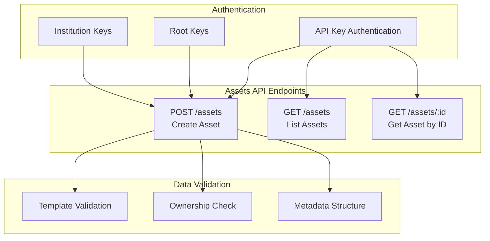
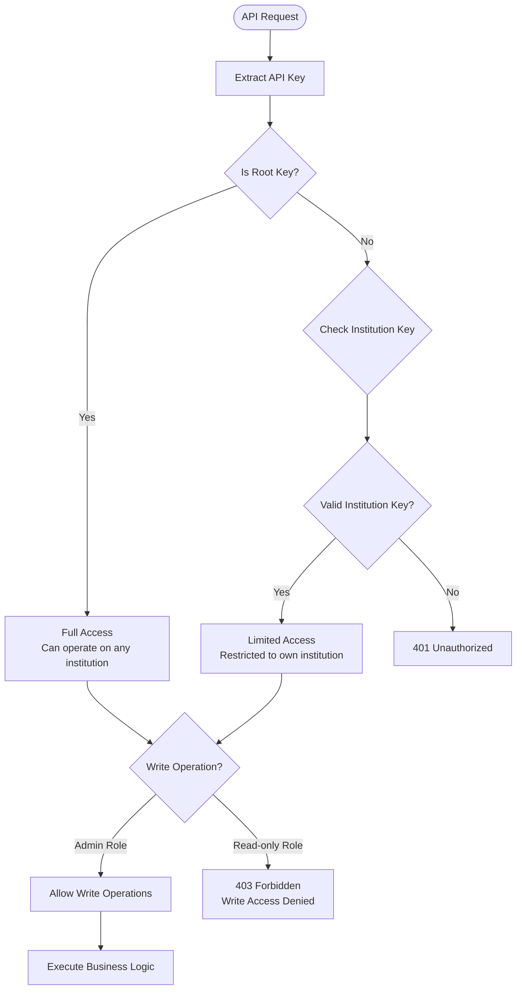
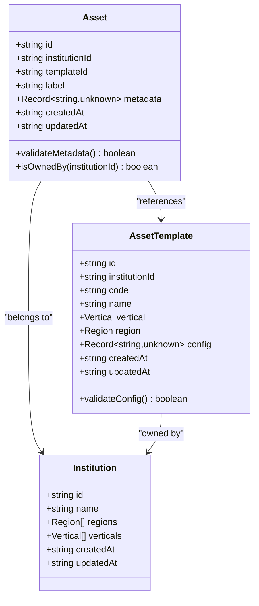
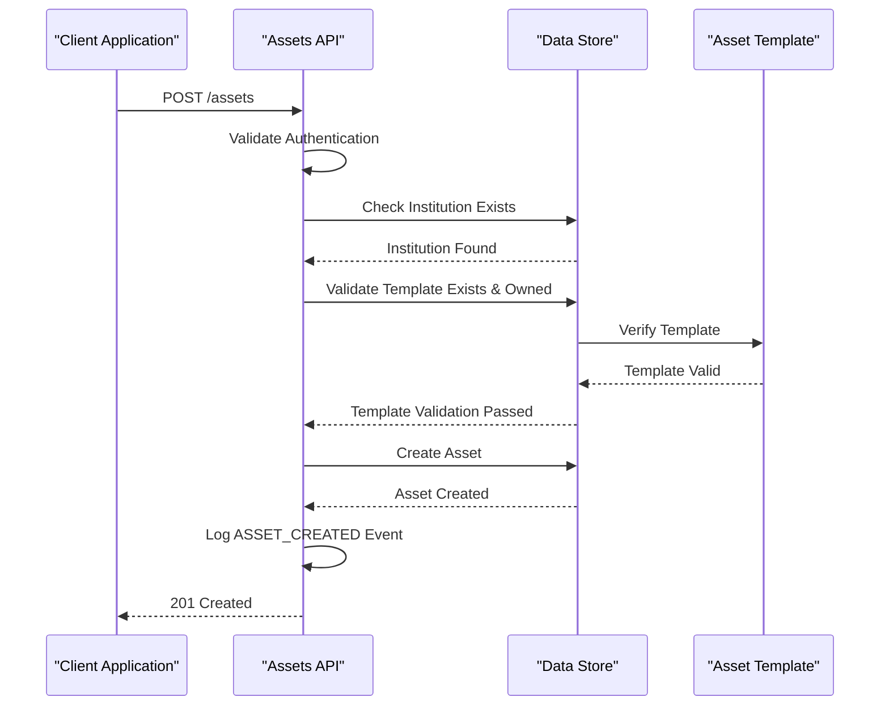
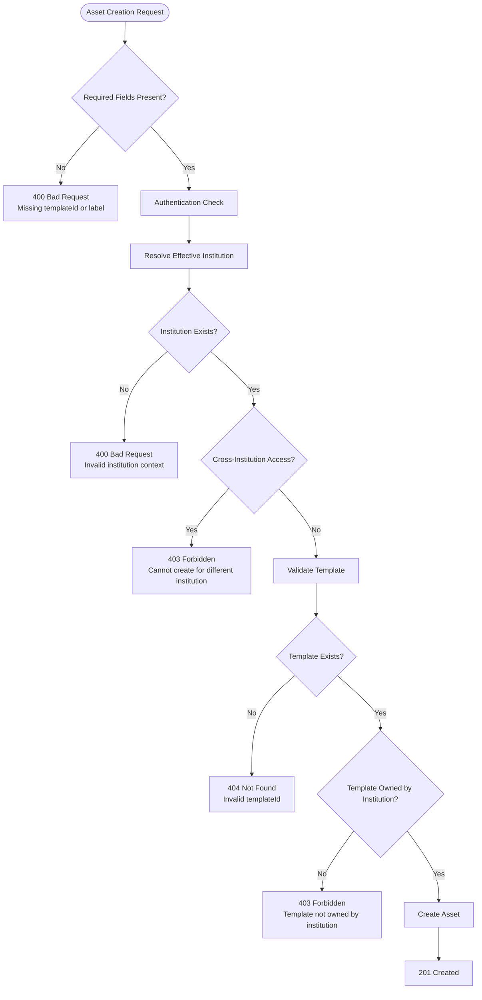
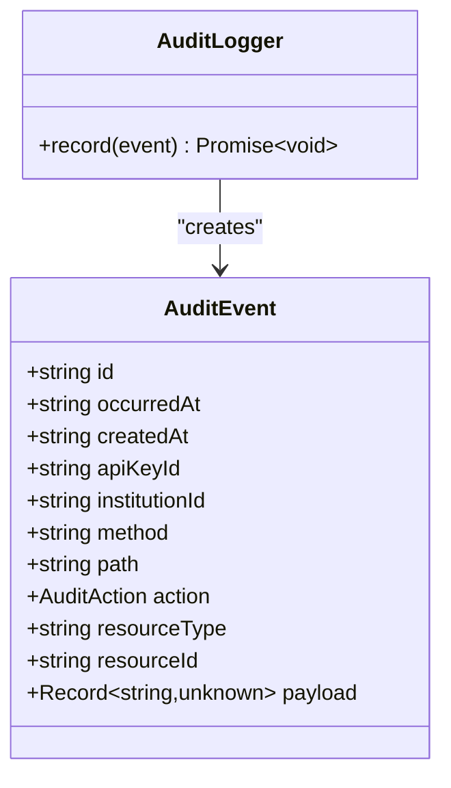
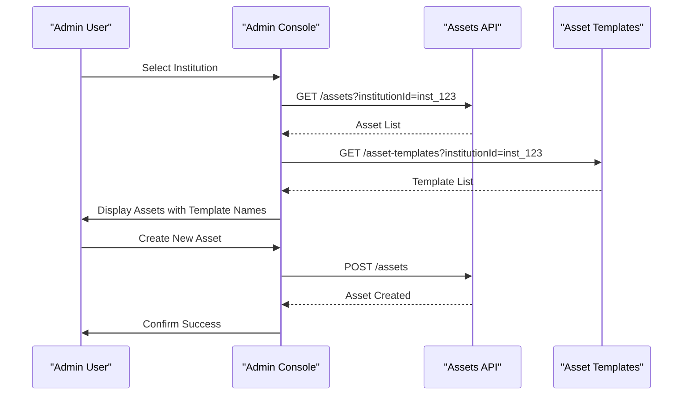

# Assets API

<cite>
**Referenced Files in This Document**
- [src/api/assets.ts](file://src/api/assets.ts)
- [src/domain/types.ts](file://src/domain/types.ts)
- [src/domain/audit.ts](file://src/domain/audit.ts)
- [src/infra/auditLogger.ts](file://src/infra/auditLogger.ts)
- [src/middleware/auth.ts](file://src/middleware/auth.ts)
- [src/store/store.ts](file://src/store/store.ts)
- [src/store/postgresStore.ts](file://src/store/postgresStore.ts)
- [src/store/memoryStore.ts](file://src/store/memoryStore.ts)
- [src/openapi.ts](file://src/openapi.ts)
- [db/schema.sql](file://db/schema.sql)
- [admin-console/src/App.tsx](file://admin-console/src/App.tsx)
</cite>

## Table of Contents
1. [Introduction](#introduction)
2. [API Overview](#api-overview)
3. [Authentication and Authorization](#authentication-and-authorization)
4. [Endpoint Specifications](#endpoint-specifications)
5. [Data Models](#data-models)
6. [Validation and Business Rules](#validation-and-business-rules)
7. [Audit Logging](#audit-logging)
8. [Error Handling](#error-handling)
9. [Practical Usage Patterns](#practical-usage-patterns)
10. [Integration Examples](#integration-examples)

## Introduction

The Assets API provides comprehensive functionality for managing digital assets within the escrowgrid platform. Assets represent financial instruments or escrow accounts that are configured using predefined templates. The API supports creating, retrieving, and listing assets while maintaining strict institutional boundaries and comprehensive audit trails.

Assets serve as containers for financial positions and are linked to specific asset templates that define their structure, validation rules, and operational characteristics. The system enforces institutional ownership and provides robust validation to ensure data integrity.

## API Overview

The Assets API consists of three primary endpoints under the `/assets` path:



**Diagram sources**
- [src/api/assets.ts](file://src/api/assets.ts#L17-L147)
- [src/middleware/auth.ts](file://src/middleware/auth.ts#L35-L95)

## Authentication and Authorization

The Assets API implements a hierarchical authentication system with different permission levels:

### Authentication Methods

The API accepts authentication through two mechanisms:
- **X-API-Key Header**: Primary authentication method
- **Authorization Bearer Token**: Alternative authentication method

### Authorization Levels



**Diagram sources**
- [src/middleware/auth.ts](file://src/middleware/auth.ts#L35-L95)

### Institution Context Resolution

The system resolves the effective institution context differently based on the authentication level:

| Authentication Type | Institution Resolution |
|-------------------|----------------------|
| Root API Key | Uses explicit `institutionId` from request body or query parameters |
| Institution API Key | Automatically derives institution from the API key's association |

**Section sources**
- [src/api/assets.ts](file://src/api/assets.ts#L40-L60)
- [src/middleware/auth.ts](file://src/middleware/auth.ts#L8-L12)

## Endpoint Specifications

### POST /assets - Create Asset

Creates a new asset linked to a valid asset template.

#### Request Schema

```typescript
interface CreateAssetBody {
  institutionId?: string;    // Required for root keys, ignored for institution keys
  templateId: string;        // Required - Must reference existing template
  label: string;             // Required - Human-readable identifier
  metadata?: Record<string, unknown>;  // Optional - Arbitrary JSON metadata
}
```

#### Request Headers
- `Content-Type: application/json`
- `X-API-Key: <your-api-key>`

#### Query Parameters
None

#### Request Body Example
```json
{
  "institutionId": "inst_123",
  "templateId": "tmpl_constr_escrow_001",
  "label": "Construction Project Alpha Escrow",
  "metadata": {
    "projectCode": "ALPHA-001",
    "contractValue": 1000000,
    "startDate": "2024-01-15",
    "completionDate": "2024-12-31"
  }
}
```

#### Response Status Codes

| Status | Description | Conditions |
|--------|-------------|------------|
| 201 | Created | Asset successfully created |
| 400 | Bad Request | Invalid request body, missing required fields, or validation failure |
| 401 | Unauthorized | Missing or invalid API key |
| 403 | Forbidden | Insufficient permissions or cross-institution access |
| 404 | Not Found | Template ID does not exist or is not owned by institution |

#### Response Body Schema
```json
{
  "id": "ast_abc123def456",
  "institutionId": "inst_123",
  "templateId": "tmpl_constr_escrow_001",
  "label": "Construction Project Alpha Escrow",
  "metadata": {
    "projectCode": "ALPHA-001",
    "contractValue": 1000000
  },
  "createdAt": "2024-01-15T10:30:00.000Z",
  "updatedAt": "2024-01-15T10:30:00.000Z"
}
```

**Section sources**
- [src/api/assets.ts](file://src/api/assets.ts#L17-L89)
- [src/openapi.ts](file://src/openapi.ts#L611-L658)

### GET /assets - List Assets

Retrieves a list of assets with optional filtering capabilities.

#### Query Parameters

| Parameter | Type | Description |
|-----------|------|-------------|
| institutionId | string | Filter by specific institution (root keys only) |
| templateId | string | Filter by specific asset template |

#### Request Headers
- `X-API-Key: <your-api-key>`

#### Response Status Codes

| Status | Description | Conditions |
|--------|-------------|------------|
| 200 | OK | Successfully retrieved asset list |
| 401 | Unauthorized | Missing or invalid API key |
| 403 | Forbidden | No institution associated with API key (non-root) |

#### Response Body Schema
```json
[
  {
    "id": "ast_abc123def456",
    "institutionId": "inst_123",
    "templateId": "tmpl_constr_escrow_001",
    "label": "Construction Project Alpha Escrow",
    "metadata": {},
    "createdAt": "2024-01-15T10:30:00.000Z",
    "updatedAt": "2024-01-15T10:30:00.000Z"
  }
]
```

**Section sources**
- [src/api/assets.ts](file://src/api/assets.ts#L91-L122)

### GET /assets/:id - Get Asset by ID

Retrieves a specific asset by its unique identifier.

#### Path Parameters

| Parameter | Type | Description |
|-----------|------|-------------|
| id | string | Asset identifier (required) |

#### Request Headers
- `X-API-Key: <your-api-key>`

#### Response Status Codes

| Status | Description | Conditions |
|--------|-------------|------------|
| 200 | OK | Asset successfully retrieved |
| 401 | Unauthorized | Missing or invalid API key |
| 403 | Forbidden | Access denied to asset (cross-institution) |
| 404 | Not Found | Asset not found |

#### Response Body Schema
```json
{
  "id": "ast_abc123def456",
  "institutionId": "inst_123",
  "templateId": "tmpl_constr_escrow_001",
  "label": "Construction Project Alpha Escrow",
  "metadata": {
    "projectCode": "ALPHA-001",
    "contractValue": 1000000
  },
  "createdAt": "2024-01-15T10:30:00.000Z",
  "updatedAt": "2024-01-15T10:30:00.000Z"
}
```

**Section sources**
- [src/api/assets.ts](file://src/api/assets.ts#L125-L143)

## Data Models

### Asset Entity

The Asset model represents a financial instrument or escrow account within the system.



**Diagram sources**
- [src/domain/types.ts](file://src/domain/types.ts#L28-L36)
- [src/domain/types.ts](file://src/domain/types.ts#L16-L26)

### Asset Template Relationship

Assets are always linked to validated asset templates that define their structure and behavior:



**Diagram sources**
- [src/api/assets.ts](file://src/api/assets.ts#L17-L89)
- [src/store/postgresStore.ts](file://src/store/postgresStore.ts#L185-L204)

**Section sources**
- [src/domain/types.ts](file://src/domain/types.ts#L28-L36)

## Validation and Business Rules

### Template Validation Flow

The system implements a comprehensive validation pipeline for asset creation:



**Diagram sources**
- [src/api/assets.ts](file://src/api/assets.ts#L40-L89)

### Metadata Structure Validation

The metadata field accepts arbitrary JSON data but follows these guidelines:

| Aspect | Requirement | Example |
|--------|-------------|---------|
| Type | JSON object | `{ "key": "value" }` |
| Size | No enforced limits | Up to database JSONB capacity |
| Content | Application-specific | Project codes, contract details, custom fields |
| Validation | Runtime only | Depends on template configuration |

### Template Reference Requirements

The `templateId` field is mandatory and must reference an existing, institution-owned asset template:

- **Existence**: Template must exist in the database
- **Ownership**: Template must belong to the requesting institution
- **Active Status**: Template must not be deleted or revoked
- **Compatibility**: Template must be appropriate for the institution's verticals and regions

**Section sources**
- [src/api/assets.ts](file://src/api/assets.ts#L32-L38)
- [src/store/postgresStore.ts](file://src/store/postgresStore.ts#L185-L204)

## Audit Logging

The Assets API integrates with the platform's comprehensive audit logging system, automatically recording all asset creation activities.

### Audit Event Structure



**Diagram sources**
- [src/domain/audit.ts](file://src/domain/audit.ts#L22-L35)
- [src/infra/auditLogger.ts](file://src/infra/auditLogger.ts#L13-L16)

### ASSET_CREATED Events

Every successful asset creation generates an `ASSET_CREATED` audit event with the following payload:

```json
{
  "action": "ASSET_CREATED",
  "method": "POST",
  "path": "/assets",
  "resourceType": "asset",
  "resourceId": "ast_abc123def456",
  "payload": {
    "institutionId": "inst_123",
    "templateId": "tmpl_constr_escrow_001",
    "label": "Construction Project Alpha Escrow"
  },
  "auth": {
    "role": "admin",
    "institutionId": "inst_123",
    "apiKeyId": "key_xyz789"
  }
}
```

### Audit Storage Options

The system supports multiple audit storage backends:

| Backend | Use Case | Features |
|---------|----------|----------|
| In-Memory | Development/testing | Fast, ephemeral logging |
| PostgreSQL | Production | Persistent, searchable, scalable |

**Section sources**
- [src/api/assets.ts](file://src/api/assets.ts#L68-L80)
- [src/infra/auditLogger.ts](file://src/infra/auditLogger.ts#L50-L107)

## Error Handling

### Standard Error Response Format

All error responses follow a consistent structure:

```json
{
  "error": "Error description",
  "details": "Additional context or validation messages"
}
```

### Common Error Scenarios

#### Authentication Errors

```json
{
  "error": "Unauthenticated",
  "details": "Missing API key"
}
```

#### Authorization Errors

```json
{
  "error": "Forbidden",
  "details": "Cannot create assets for a different institution"
}
```

#### Validation Errors

```json
{
  "error": "Invalid request body",
  "details": "templateId and label are required"
}
```

#### Business Logic Errors

```json
{
  "error": "Failed to create asset",
  "details": "Asset template not found for institution"
}
```

### HTTP Status Code Reference

| Status Code | Scenario | Response Body |
|-------------|----------|---------------|
| 201 | Asset created successfully | Created asset object |
| 400 | Bad request | Validation errors |
| 401 | Unauthorized | Authentication required |
| 403 | Forbidden | Access denied |
| 404 | Not found | Resource not found |
| 500 | Internal server error | Generic error |

**Section sources**
- [src/api/assets.ts](file://src/api/assets.ts#L32-L38)
- [src/api/assets.ts](file://src/api/assets.ts#L83-L88)

## Practical Usage Patterns

### Bulk Asset Creation

For applications requiring multiple asset creation, implement batch processing with proper error handling:

```javascript
async function createAssetsBatch(assetDataArray) {
  const results = [];
  
  for (const assetData of assetDataArray) {
    try {
      const response = await fetch('/assets', {
        method: 'POST',
        headers: {
          'Content-Type': 'application/json',
          'X-API-Key': apiKey
        },
        body: JSON.stringify(assetData)
      });
      
      if (response.ok) {
        results.push({ success: true, data: await response.json() });
      } else {
        results.push({ success: false, error: await response.json() });
      }
    } catch (error) {
      results.push({ success: false, error: { error: 'Network error' } });
    }
  }
  
  return results;
}
```

### Lookup Strategies for Frontend Applications

#### Asset Discovery Pattern

```javascript
// Pattern 1: Filter by template for specific asset types
const constructionEscrows = await fetch('/assets?templateId=tmpl_constr_escrow_001')
  .then(res => res.json());

// Pattern 2: Comprehensive asset listing with pagination
const allAssets = await fetch('/assets?page=1&limit=100')
  .then(res => res.json());

// Pattern 3: Cross-reference with templates for display
const assetsWithTemplates = await Promise.all(
  assets.map(async asset => ({
    ...asset,
    template: await fetch(`/asset-templates/${asset.templateId}`)
      .then(res => res.json())
  }))
);
```

### Administrative Workflows

#### Asset Management Dashboard

The admin console demonstrates practical asset management patterns:



**Diagram sources**
- [admin-console/src/App.tsx](file://admin-console/src/App.tsx#L517-L536)

**Section sources**
- [admin-console/src/App.tsx](file://admin-console/src/App.tsx#L500-L538)

## Integration Examples

### Construction Escrow Asset Creation

For construction projects requiring escrow arrangements:

```javascript
const constructionEscrowAsset = {
  templateId: "tmpl_constr_escrow_001",
  label: "Alpha Construction Project Escrow",
  metadata: {
    projectCode: "ALPHA-001",
    contractorName: "Alpha Builders Inc.",
    totalContractValue: 1500000,
    paymentSchedule: [
      { milestone: "Foundation Complete", percentage: 20 },
      { milestone: "Framing Complete", percentage: 30 },
      { milestone: "Final Inspection", percentage: 50 }
    ]
  }
};

const response = await fetch('/assets', {
  method: 'POST',
  headers: {
    'Content-Type': 'application/json',
    'X-API-Key': 'your-api-key'
  },
  body: JSON.stringify(constructionEscrowAsset)
});
```

### Trade Finance Asset Creation

For international trade financing scenarios:

```javascript
const tradeFinanceAsset = {
  templateId: "tmpl_tf_invoice_001",
  label: "Export Invoice Financing",
  metadata: {
    invoiceNumber: "INV-2024-001",
    buyerCountry: "Germany",
    shipmentDate: "2024-02-15",
    deliveryTerms: "FOB Hamburg",
    insurancePolicy: "POL-2024-001"
  }
};
```

### Cross-Institution Considerations

When using root API keys for multi-institution operations:

```javascript
// Root key allows specifying target institution
const crossInstitutionAsset = {
  institutionId: "inst_target_456",  // Explicitly specify target institution
  templateId: "tmpl_constr_escrow_001",
  label: "Partner Institution Project",
  metadata: {}
};
```

### Template-Based Asset Configuration

Different template types support various asset configurations:

| Template Type | Purpose | Key Metadata Fields |
|---------------|---------|-------------------|
| CONSTR_ESCROW | Construction project escrow | `currency`, `minAmount`, `maxAmount` |
| CONSTR_RETAINAGE | Retention payment escrow | `retainagePercentage` |
| TF_INVOICE | Trade finance invoice | `maxTenorDays`, `country` |
| TF_LC | Letter of credit | `issuingBankCountry`, `maxTenorDays` |

**Section sources**
- [src/domain/verticals.ts](file://src/domain/verticals.ts#L47-L123)