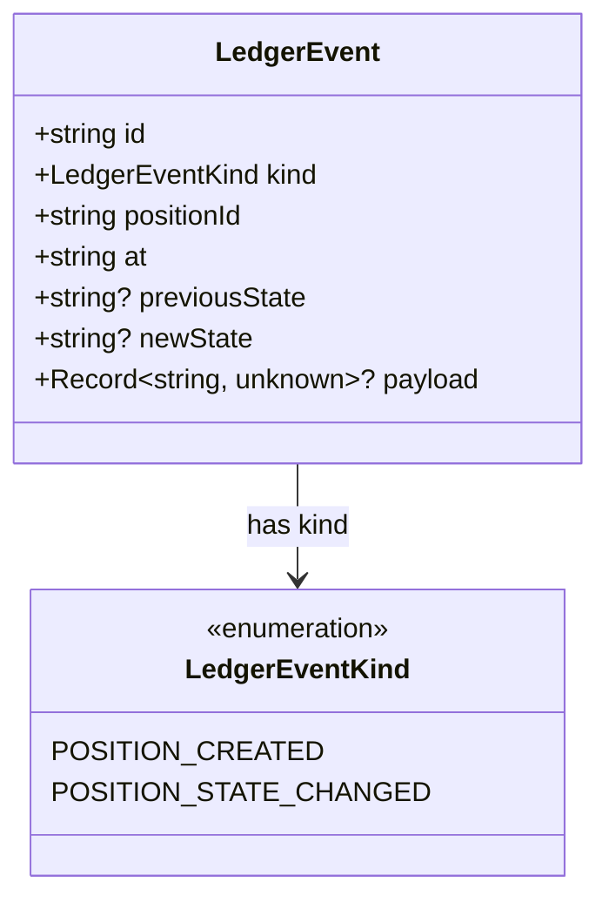
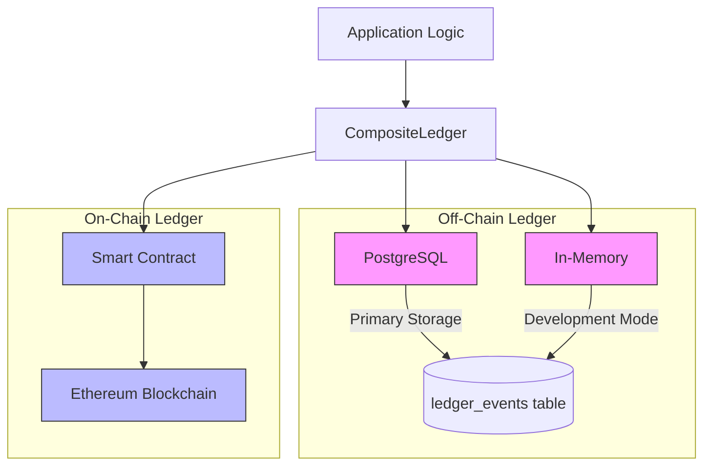
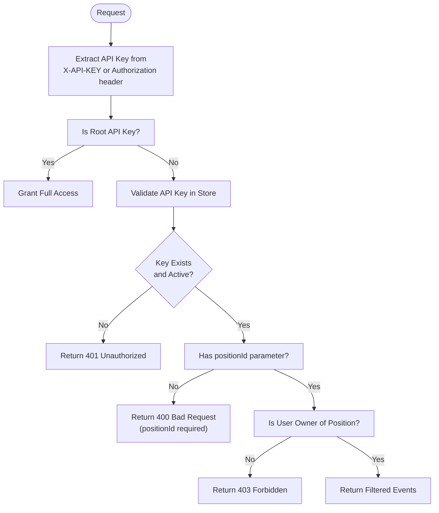
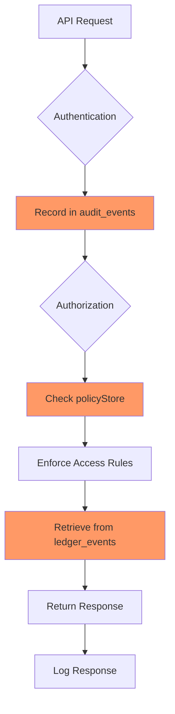

# Ledger API

<cite>
**Referenced Files in This Document**   
- [ledger.ts](file://src/api/ledger.ts)
- [ledgerClient.ts](file://src/infra/ledgerClient.ts)
- [postgresLedger.ts](file://src/infra/postgresLedger.ts)
- [inMemoryLedger.ts](file://src/infra/inMemoryLedger.ts)
- [onchainLedger.ts](file://src/infra/onchainLedger.ts)
- [types.ts](file://src/domain/types.ts)
- [config.ts](file://src/config.ts)
- [schema.sql](file://db/schema.sql)
- [auth.ts](file://src/middleware/auth.ts)
- [auditLogger.ts](file://src/infra/auditLogger.ts)
- [policyStore.ts](file://src/infra/policyStore.ts)
</cite>

## Table of Contents
1. [Introduction](#introduction)
2. [API Endpoint: GET /ledger-events](#api-endpoint-get-ledger-events)
3. [Query Parameters](#query-parameters)
4. [Response Structure](#response-structure)
5. [Dual Ledger Architecture](#dual-ledger-architecture)
6. [Authentication and Access Control](#authentication-and-access-control)
7. [Usage Examples](#usage-examples)
8. [Performance Considerations](#performance-considerations)
9. [Compliance and Auditing](#compliance-and-auditing)
10. [Error Handling](#error-handling)

## Introduction
The Ledger API in escrowgrid provides read-only access to financial transaction events and position lifecycle changes within the platform. It serves as a critical tool for reconciliation, auditing, and monitoring settlement activities across both off-chain and on-chain systems. The API exposes a unified view of events while maintaining data integrity through a dual ledger design that records transactions in both traditional databases and blockchain networks.

**Section sources**
- [ledger.ts](file://src/api/ledger.ts#L1-L43)
- [domain/ledger.ts](file://src/domain/ledger.ts#L1-L24)

## API Endpoint: GET /ledger-events
The primary endpoint for retrieving ledger events is `GET /ledger-events`, which returns a chronological list of events related to positions in the system. This endpoint supports filtering by position ID and provides different access patterns based on user roles.

```mermaid
sequenceDiagram
participant Client
participant Auth as authMiddleware
participant Ledger as ledgerRouter
participant Client->>Auth : Request with API Key
Auth->>Auth : Validate authentication
Auth->>Ledger : Forward authenticated request
Ledger->>Ledger : Check positionId parameter
alt Root User
Ledger->>Ledger : Retrieve all events
else Non-Root User
Ledger->>Ledger : Validate institution ownership
Ledger->>Ledger : Filter by positionId
end
Ledger-->>Client : Return ledger events
```

**Diagram sources**
- [src/api/ledger.ts](file://src/api/ledger.ts#L8-L39)
- [src/middleware/auth.ts](file://src/middleware/auth.ts#L35-L95)

**Section sources**
- [src/api/ledger.ts](file://src/api/ledger.ts#L8-L39)
- [src/server.ts](file://src/server.ts#L84)

## Query Parameters
The GET /ledger-events endpoint accepts the following query parameters:

| Parameter | Type | Required | Description |
|---------|------|----------|-------------|
| positionId | string | Conditional | Filters events to a specific position. Required for non-root users. |
| institutionId | string | No | Not directly supported in current implementation; access is controlled by API key scope. |
| assetId | string | No | Not directly supported; must filter by positionId which is associated with an asset. |
| from | string | No | Not implemented; all events are returned in chronological order. |
| to | string | No | Not implemented; all events are returned in chronological order. |
| limit | number | No | Not implemented; pagination is not currently supported. |
| offset | number | No | Not implemented; pagination is not currently supported. |

For non-root users, the `positionId` parameter is mandatory to prevent unauthorized access to ledger data across institutions.

**Section sources**
- [src/api/ledger.ts](file://src/api/ledger.ts#L10-L37)
- [src/domain/ledger.ts](file://src/domain/ledger.ts#L21)

## Response Structure
The API returns an array of ledger events with the following structure:



**Diagram sources**
- [src/domain/ledger.ts](file://src/domain/ledger.ts#L5-L13)

Each ledger event contains:
- **id**: Unique identifier for the event
- **kind**: Type of event (POSITION_CREATED or POSITION_STATE_CHANGED)
- **positionId**: Identifier of the position affected
- **at**: ISO 8601 timestamp when the event occurred
- **previousState**: Previous state of the position (for state changes)
- **newState**: New state of the position
- **payload**: Additional context-specific data in JSON format

The payload structure varies by event type:
- For `POSITION_CREATED`: Contains institutionId, assetId, currency, amount, and externalReference
- For `POSITION_STATE_CHANGED`: Contains reason for change and metadata

**Section sources**
- [src/domain/ledger.ts](file://src/domain/ledger.ts#L5-L13)
- [src/infra/postgresLedger.ts](file://src/infra/postgresLedger.ts#L74-L101)

## Dual Ledger Architecture
The escrowgrid platform implements a dual ledger design that maintains records in both off-chain and on-chain systems to ensure data integrity, availability, and immutability.



**Diagram sources**
- [src/infra/ledgerClient.ts](file://src/infra/ledgerClient.ts#L8-L37)
- [src/infra/postgresLedger.ts](file://src/infra/postgresLedger.ts#L14-L108)
- [src/infra/onchainLedger.ts](file://src/infra/onchainLedger.ts#L11-L221)

### Off-Chain Ledger
The off-chain ledger stores events in PostgreSQL (production) or in-memory storage (development), providing:
- High-performance read/write operations
- Complex querying capabilities
- Standard database backup and recovery
- Support for indexing and optimization

The schema is defined in `db/schema.sql` with the `ledger_events` table containing all necessary fields for event storage.

### On-Chain Ledger
The on-chain ledger records critical events to Ethereum via smart contracts, providing:
- Immutability and tamper-evidence
- Decentralized verification
- Cryptographic proof of existence
- Integration with blockchain ecosystems

On-chain recording is configurable per asset template and can be enabled/disabled based on business requirements and regulatory needs.

**Section sources**
- [src/infra/ledgerClient.ts](file://src/infra/ledgerClient.ts#L39-L63)
- [src/infra/postgresLedger.ts](file://src/infra/postgresLedger.ts#L14-L108)
- [src/infra/onchainLedger.ts](file://src/infra/onchainLedger.ts#L11-L221)
- [db/schema.sql](file://db/schema.sql#L79-L92)

## Authentication and Access Control
The Ledger API enforces strict authentication and authorization controls using institution-scoped API keys with role-based access.



**Diagram sources**
- [src/middleware/auth.ts](file://src/middleware/auth.ts#L23-L82)
- [src/api/ledger.ts](file://src/api/ledger.ts#L10-L37)

Access rules:
- **Root users**: Can access all ledger events across institutions when using the root API key
- **Institution users**: Can only access events for positions within their own institution
- **Position-level access**: Non-root users must specify a positionId to retrieve events
- **Forbidden access**: Attempts to access events for positions in other institutions are denied with 403 status

Authentication is handled by the `authMiddleware` which validates API keys against the `apiKeyStore` and establishes the user's role and institution context.

**Section sources**
- [src/middleware/auth.ts](file://src/middleware/auth.ts#L35-L95)
- [src/api/ledger.ts](file://src/api/ledger.ts#L10-L37)
- [src/infra/apiKeyStore.ts](file://src/infra/apiKeyStore.ts#L13-L184)

## Usage Examples
### Retrieving Position Lifecycle Events
To retrieve all events for a specific position:

```http
GET /ledger-events?positionId=pos_1234567890
Authorization: Bearer ak_0987654321abcdef
```

This returns a chronological list of events showing the complete lifecycle of the position, including creation and all state transitions.

### Monitoring Settlement Activities
Root users can monitor settlement activities across the platform:

```http
GET /ledger-events
X-API-KEY: root_1234567890
```

This returns all ledger events, allowing root users to audit system-wide activities and identify patterns in settlement workflows.

### Reconciliation Process
For reconciliation purposes, clients can:
1. Retrieve all events for a position
2. Verify the sequence of state transitions
3. Confirm amounts and timestamps match expected values
4. Cross-reference with on-chain transactions when applicable

**Section sources**
- [src/api/ledger.ts](file://src/api/ledger.ts#L10-L37)
- [src/infra/ledgerClient.ts](file://src/infra/ledgerClient.ts#L34-L36)

## Performance Considerations
Large ledger queries can impact performance, especially when retrieving extensive event histories. The following recommendations optimize query performance:

### Database Indexing
The `ledger_events` table includes a critical index on the position_id column:

```sql
CREATE INDEX IF NOT EXISTS idx_ledger_events_position 
  ON ledger_events (position_id);
```

This index ensures efficient filtering by positionId, which is the primary access pattern for non-root users.

### Query Optimization
- Always specify positionId when possible to limit result sets
- Implement client-side pagination for positions with extensive event histories
- Consider caching frequently accessed position ledgers
- Use root access sparingly as it retrieves all events without filtering

### System Configuration
Performance can be tuned through configuration settings in `config.ts`:
- `storeBackend`: Choose 'postgres' for production workloads
- `onchainLedgerEnabled`: Disable on-chain recording when not required
- Rate limiting parameters to prevent abuse

**Section sources**
- [db/schema.sql](file://db/schema.sql#L90-L92)
- [src/config.ts](file://src/config.ts#L1-L47)
- [src/infra/postgresLedger.ts](file://src/infra/postgresLedger.ts#L74-L101)

## Compliance and Auditing
The Ledger API integrates with compliance systems to support regulatory requirements and internal auditing processes.

### Audit Logging
All API access is recorded in the audit system through `auditLogger`, capturing:
- Timestamp of access
- API key used
- Institution context
- Request method and path
- Action performed

This creates a complete audit trail of who accessed what data and when.

### Policy Enforcement
The system references `policyStore` to ensure that ledger access complies with institutional policies, particularly around:
- Data retention requirements
- Access control policies
- Regional compliance regulations

Policies are stored in the `institution_policies` table and can restrict access based on region-specific regulations.



**Diagram sources**
- [src/infra/auditLogger.ts](file://src/infra/auditLogger.ts#L50-L107)
- [src/infra/policyStore.ts](file://src/infra/policyStore.ts#L1-L131)
- [db/schema.sql](file://db/schema.sql#L106-L138)

**Section sources**
- [src/infra/auditLogger.ts](file://src/infra/auditLogger.ts#L1-L107)
- [src/infra/policyStore.ts](file://src/infra/policyStore.ts#L1-L131)
- [db/schema.sql](file://db/schema.sql#L106-L138)

## Error Handling
The Ledger API returns standardized error responses for various failure scenarios:

| Status Code | Error Response | Condition |
|------------|----------------|---------|
| 401 | `{ "error": "Unauthenticated" }` | Missing or invalid API key |
| 403 | `{ "error": "Forbidden to access ledger events for this position" }` | User lacks access to the specified position |
| 400 | `{ "error": "positionId is required for non-root ledger queries" }` | Non-root user omitted positionId parameter |

Error handling follows a consistent pattern:
1. Authentication validation
2. Authorization checks
3. Parameter validation
4. Resource existence verification
5. Permission enforcement

The system prioritizes security by defaulting to deny access when authorization cannot be confirmed.

**Section sources**
- [src/api/ledger.ts](file://src/api/ledger.ts#L13-L34)
- [src/middleware/auth.ts](file://src/middleware/auth.ts#L54-L81)
- [src/domain/types.ts](file://src/domain/types.ts#L80-L85)