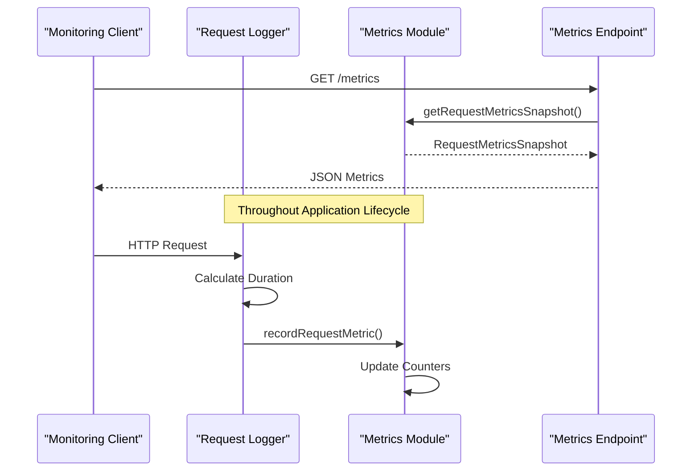

# Metrics API

<cite>
**Referenced Files in This Document**
- [src/api/metrics.ts](file://src/api/metrics.ts)
- [src/infra/metrics.ts](file://src/infra/metrics.ts)
- [src/middleware/requestLogger.ts](file://src/middleware/requestLogger.ts)
- [src/server.ts](file://src/server.ts)
- [src/openapi.ts](file://src/openapi.ts)
- [src/config.ts](file://src/config.ts)
- [README.md](file://README.md)
</cite>

## Table of Contents
1. [Introduction](#introduction)
2. [API Endpoint Overview](#api-endpoint-overview)
3. [Authentication and Access Control](#authentication-and-access-control)
4. [Metrics Collection Architecture](#metrics-collection-architecture)
5. [Available Metrics](#available-metrics)
6. [Integration with Monitoring Systems](#integration-with-monitoring-systems)
7. [Security Considerations](#security-considerations)
8. [Performance and Scalability](#performance-and-scalability)
9. [Alerting and Monitoring](#alerting-and-monitoring)
10. [Troubleshooting](#troubleshooting)

## Introduction

The Metrics API endpoint in EscrowGrid provides system telemetry for monitoring and observability purposes. This endpoint exposes HTTP request metrics in JSON format, offering insights into API usage patterns, performance characteristics, and system health. The metrics are collected via the `infra/metrics.ts` module and updated across key operations including authentication, position transitions, and database interactions.

The Metrics API serves as a lightweight observability solution for tracking request volumes, response times, error rates, and other operational indicators. While not Prometheus-native, the data structure is designed to be compatible with various monitoring systems and can be adapted for Prometheus-compatible scraping.

## API Endpoint Overview

### Endpoint Details

| Property | Value |
|----------|-------|
| **URL** | `/metrics` |
| **HTTP Method** | `GET` |
| **Content Type** | `application/json` |
| **Authentication Required** | Yes (root-only) |
| **Rate Limiting** | No (but subject to underlying system limits) |

### Request Format

```http
GET /metrics
Host: api.escrowgrid.io
X-API-KEY: <root-api-key>
Accept: application/json
```

### Response Format

The endpoint returns a JSON object containing comprehensive request metrics:

```json
{
  "totalRequests": 1250,
  "totalErrors": 15,
  "requestsByStatus": {
    "200": 1100,
    "400": 80,
    "401": 30,
    "403": 25,
    "500": 15
  },
  "requestsByMethod": {
    "GET": 800,
    "POST": 350,
    "PUT": 50,
    "DELETE": 50
  },
  "averageDurationMs": 125.75
}
```

**Section sources**
- [src/api/metrics.ts](file://src/api/metrics.ts#L7-L14)
- [src/openapi.ts](file://src/openapi.ts#L233-L282)

## Authentication and Access Control

### Root-Only Access

The Metrics API implements strict access control requiring root-level privileges:

```typescript
router.get('/', (req: AuthedRequest, res: Response) => {
  const auth = req.auth;
  if (!auth || auth.role !== 'root') {
    return res.status(403).json({ error: 'Forbidden: metrics are root-only' });
  }
  // ...
});
```

### API Key Requirements

- **Root API Key**: Must be configured via `ROOT_API_KEY` environment variable
- **Role Validation**: Only requests with `role: 'root'` are authorized
- **No Rate Limiting**: Access is not subject to standard rate limiting
- **No Caching**: Metrics are generated fresh for each request

### Recommended Security Practices

1. **Use Dedicated Root Key**: Create a separate root API key specifically for monitoring
2. **Network Isolation**: Restrict access to monitoring networks only
3. **Audit Logging**: Monitor access to the metrics endpoint
4. **VPN/Proxy Access**: Consider routing metrics requests through secure channels

**Section sources**
- [src/api/metrics.ts](file://src/api/metrics.ts#L8-L11)
- [src/middleware/auth.ts](file://src/middleware/auth.ts#L58-L60)

## Metrics Collection Architecture

### Data Collection Flow

The metrics system operates through a centralized collection mechanism that tracks HTTP request characteristics across the entire application:



**Diagram sources**
- [src/middleware/requestLogger.ts](file://src/middleware/requestLogger.ts#L6-L27)
- [src/infra/metrics.ts](file://src/infra/metrics.ts#L17-L26)

### Core Metrics Components

The metrics system maintains several key data structures:

| Metric Type | Description | Update Trigger |
|-------------|-------------|----------------|
| **Total Requests** | Cumulative count of all HTTP requests | Every request completion |
| **Error Count** | Requests with 5xx status codes | Status code >= 500 |
| **Status Distribution** | Breakdown by HTTP status code | Every request completion |
| **Method Distribution** | Breakdown by HTTP method | Every request completion |
| **Response Times** | Total duration for all requests | Every request completion |

### Collection Mechanism

Metrics are collected through the request logging middleware, which instruments every HTTP request:

```typescript
export function requestLogger(req: AuthedRequest, res: Response, next: NextFunction): void {
  const start = process.hrtime.bigint();
  const { method, path } = req;

  res.on('finish', () => {
    const durationNs = Number(process.hrtime.bigint() - start);
    const durationMs = durationNs / 1e6;
    const auth = req.auth;
    const logPayload = {
      type: 'request',
      method,
      path,
      status: res.statusCode,
      durationMs,
      apiKeyId: auth?.apiKeyId ?? null,
      institutionId: auth?.institutionId ?? null,
    };
    console.log(JSON.stringify(logPayload));
    recordRequestMetric(method, res.statusCode, durationMs);
  });

  next();
}
```

**Section sources**
- [src/middleware/requestLogger.ts](file://src/middleware/requestLogger.ts#L6-L27)
- [src/infra/metrics.ts](file://src/infra/metrics.ts#L17-L37)

## Available Metrics

### Core Request Metrics

#### Total Request Count
- **Metric Name**: `totalRequests`
- **Type**: Integer
- **Description**: Cumulative count of all HTTP requests processed
- **Calculation**: Incremented for every request completion

#### Error Request Count  
- **Metric Name**: `totalErrors`
- **Type**: Integer
- **Description**: Count of requests resulting in 5xx server errors
- **Threshold**: Status codes >= 500
- **Purpose**: Identifies system reliability issues

#### Status Code Distribution
- **Metric Name**: `requestsByStatus`
- **Type**: Object with status codes as keys
- **Values**: Integer counts
- **Examples**: `200: 1100`, `400: 80`, `500: 15`
- **Use Case**: Analyze success/failure patterns

#### HTTP Method Distribution
- **Metric Name**: `requestsByMethod`
- **Type**: Object with HTTP methods as keys
- **Values**: Integer counts
- **Examples**: `GET: 800`, `POST: 350`, `PUT: 50`
- **Use Case**: Understand API usage patterns

#### Average Response Time
- **Metric Name**: `averageDurationMs`
- **Type**: Float
- **Unit**: Milliseconds
- **Calculation**: `totalDurationMs / totalRequests`
- **Purpose**: Monitor performance trends

### Advanced Metrics Features

#### Granular Timing Information
While the primary metrics provide aggregate statistics, the underlying system captures detailed timing information for each request, enabling:

- **Percentile Calculations**: 95th, 99th, and custom percentiles
- **Burst Analysis**: Short-term performance spikes
- **Trend Detection**: Long-term performance patterns

#### Request Context
Each metric includes contextual information for enhanced analysis:

- **API Key ID**: Identifies the requesting entity
- **Institution ID**: Links metrics to organizational context
- **Request Path**: Enables endpoint-specific analysis

**Section sources**
- [src/infra/metrics.ts](file://src/infra/metrics.ts#L3-L16)
- [src/middleware/requestLogger.ts](file://src/middleware/requestLogger.ts#L10-L16)

## Integration with Monitoring Systems

### Prometheus Compatibility

While the Metrics API returns JSON, the data structure is designed for easy adaptation to Prometheus metrics format:

```yaml
# Example Prometheus metrics conversion
http_requests_total{status="200"} 1100
http_requests_total{status="400"} 80
http_requests_total{status="500"} 15
http_request_duration_ms_sum 157187.5
http_request_duration_ms_count 1250
```

### Grafana Dashboard Integration

Recommended dashboard panels for metrics visualization:

#### Request Volume Panel
```promql
sum(rate(http_requests_total[5m])) by (status)
```

#### Error Rate Panel
```promql
sum(rate(http_requests_total{status=~"5.."}[5m])) / sum(rate(http_requests_total[5m]))
```

#### Response Time Panel
```promql
histogram_quantile(0.95, sum(rate(http_request_duration_ms_bucket[5m])) by (le))
```

### External Monitoring System Setup

#### Prometheus Configuration
```yaml
scrape_configs:
  - job_name: 'escrowgrid-metrics'
    metrics_path: /metrics
    static_configs:
      - targets: ['api.escrowgrid.io:4000']
    scheme: https
    scrape_interval: 30s
    scrape_timeout: 10s
    tls_config:
      insecure_skip_verify: false
    authorization:
      type: Bearer
      credentials_file: /etc/prometheus/escrowgrid-token
```

#### Alertmanager Configuration
```yaml
groups:
  - name: escrowgrid-alerts
    rules:
      - alert: HighErrorRate
        expr: |
          (
            sum(rate(http_requests_total{status=~"5.."}[5m])) by (instance)
            /
            sum(rate(http_requests_total[5m])) by (instance)
          ) > 0.05
        for: 5m
        labels:
          severity: warning
        annotations:
          summary: "High error rate detected"
          description: "Error rate is {{ $value }}%"
```

**Section sources**
- [README.md](file://README.md#L355-L377)

## Security Considerations

### Access Control Implementation

#### Root-Only Authorization
The metrics endpoint enforces strict root-level access:

```typescript
if (!auth || auth.role !== 'root') {
  return res.status(403).json({ error: 'Forbidden: metrics are root-only' });
}
```

#### Security Best Practices

1. **Dedicated Monitoring Keys**
   - Create separate root API keys for monitoring
   - Rotate keys regularly
   - Monitor key usage patterns

2. **Network Security**
   - Restrict access to internal monitoring networks
   - Use VPN or proxy for external monitoring
   - Implement IP whitelisting where appropriate

3. **Audit and Monitoring**
   - Log all metrics endpoint access
   - Monitor for unusual access patterns
   - Implement alerting for unauthorized access attempts

### Data Privacy Considerations

#### Information Exposure
The metrics endpoint exposes:
- **Request Counts**: Aggregate usage statistics
- **Error Rates**: System reliability indicators
- **Response Times**: Performance characteristics
- **Status Codes**: HTTP-level error patterns

#### Sensitive Data Protection
- **No Request Bodies**: Metrics do not include request payload data
- **No Response Bodies**: Metrics do not include response payload data
- **Minimal Context**: Only essential metadata is captured

### Network Exposure Recommendations

#### Internal Deployment
- Deploy metrics endpoint behind reverse proxies
- Use HTTPS for all communications
- Implement proper TLS certificates
- Configure appropriate CORS policies

#### External Access
- Use dedicated monitoring infrastructure
- Implement strong authentication mechanisms
- Monitor external access patterns
- Consider rate limiting for external clients

**Section sources**
- [src/api/metrics.ts](file://src/api/metrics.ts#L8-L11)
- [src/config.ts](file://src/config.ts#L27)

## Performance and Scalability

### Memory Efficiency

The metrics system is designed for minimal memory overhead:

#### In-Memory Storage
- **Counter Variables**: Primitive integer storage
- **Object References**: Minimal object allocation
- **Garbage Collection**: Automatic cleanup of temporary objects

#### Memory Footprint
- **Base Memory**: ~1KB for counter variables
- **Status Distribution**: ~2 bytes per unique status code
- **Method Distribution**: ~2 bytes per unique HTTP method

### Scalability Characteristics

#### Horizontal Scaling
- **Stateless Design**: Metrics are stored in-process
- **No Database Dependencies**: Eliminates scaling concerns
- **Shared Nothing Architecture**: Each instance maintains independent metrics

#### Throughput Capacity
- **Request Processing**: Sub-millisecond overhead per request
- **Metrics Generation**: Instantaneous response generation
- **Concurrent Access**: Thread-safe counter updates

### Performance Optimization

#### Counter Updates
```typescript
export function recordRequestMetric(method: Method, status: number, durationMs: number): void {
  totalRequests += 1;                    // Atomic increment
  if (status >= 500) totalErrors += 1;   // Conditional increment
  requestsByStatus[status] = (requestsByStatus[status] ?? 0) + 1;
  requestsByMethod[normalizedMethod] = (requestsByMethod[normalizedMethod] ?? 0) + 1;
  totalDurationMs += durationMs;
}
```

#### Snapshot Generation
```typescript
export function getRequestMetricsSnapshot(): RequestMetricsSnapshot {
  const averageDurationMs = totalRequests > 0 ? totalDurationMs / totalRequests : 0;
  return {
    totalRequests,
    totalErrors,
    requestsByStatus: { ...requestsByStatus },  // Shallow copy
    requestsByMethod: { ...requestsByMethod },  // Shallow copy
    averageDurationMs,
  };
}
```

### High-Cardinality Risks

#### Potential Issues
- **Unique Status Codes**: Excessive custom status codes
- **Dynamic Paths**: High cardinality in request paths
- **Parameter Variants**: Many unique parameter combinations

#### Mitigation Strategies
1. **Status Code Normalization**: Use standard HTTP status codes
2. **Path Parameterization**: Normalize dynamic path segments
3. **Sampling**: Implement sampling for high-volume endpoints
4. **Labeling Strategy**: Use meaningful but bounded labels

**Section sources**
- [src/infra/metrics.ts](file://src/infra/metrics.ts#L11-L16)
- [src/infra/metrics.ts](file://src/infra/metrics.ts#L28-L37)

## Alerting and Monitoring

### Essential Alerting Rules

#### Error Rate Monitoring
```yaml
groups:
  - name: metrics-alerts
    rules:
      - alert: HighErrorRate
        expr: |
          (
            sum(rate(http_requests_total{status=~"5.."}[5m])) by (instance)
            /
            sum(rate(http_requests_total[5m])) by (instance)
          ) > 0.05
        for: 5m
        labels:
          severity: warning
        annotations:
          summary: "High error rate detected"
          description: "Error rate is {{ $value }}%"
```

#### Performance Degradation
```yaml
      - alert: HighLatency
        expr: |
          histogram_quantile(0.95, 
            sum(rate(http_request_duration_ms_bucket[5m])) by (le, instance)
          ) > 300
        for: 10m
        labels:
          severity: warning
        annotations:
          summary: "High latency detected"
          description: "95th percentile latency is {{ $value }}ms"
```

#### Request Volume Anomalies
```yaml
      - alert: UnexpectedTrafficPattern
        expr: |
          change(sum(rate(http_requests_total[1h])) by (instance)[3h:1h]) == 0
          and
          sum(rate(http_requests_total[1h])) by (instance) > 100
        for: 15m
        labels:
          severity: warning
        annotations:
          summary: "Unexpected traffic pattern"
          description: "No traffic change for 3 hours despite expected volume"
```

### Recommended Scraping Intervals

| Environment | Interval | Retention | Resolution |
|-------------|----------|-----------|------------|
| **Development** | 15s | 1 day | High |
| **Staging** | 30s | 7 days | Medium |
| **Production** | 60s | 30 days | Medium |
| **Critical** | 15s | 90 days | High |

### Query Examples for Alerting

#### Error Rate Calculation
```promql
# 5-minute window error rate
sum(rate(http_requests_total{status=~"5.."}[5m])) 
/ 
sum(rate(http_requests_total[5m]))

# Rolling 24-hour error rate
increase(http_requests_total{status=~"5.."})[24h] 
/ 
increase(http_requests_total[24h])
```

#### Latency Analysis
```promql
# 95th percentile response time
histogram_quantile(0.95, 
  sum(rate(http_request_duration_ms_bucket[5m])) by (le))

# Average response time by endpoint
avg(http_request_duration_ms_sum) by (path) 
/ 
avg(http_request_duration_ms_count) by (path)
```

#### Resource Utilization
```promql
# Requests per second by method
rate(http_requests_total[5m])

# Error rate by status code
rate(http_requests_total{status=~"5.."}[5m])
/ 
rate(http_requests_total[5m])
```

**Section sources**
- [README.md](file://README.md#L373-L377)

## Troubleshooting

### Common Issues and Solutions

#### 403 Forbidden Errors
**Symptoms**: 
- `{"error":"Forbidden: metrics are root-only"}`
- Access denied to metrics endpoint

**Causes**:
- Non-root API key used
- Missing or invalid API key
- Incorrect authentication header

**Solutions**:
1. Verify API key role is `root`
2. Use proper authentication header format
3. Check API key validity
4. Ensure root API key is properly configured

#### Empty or Zero Metrics
**Symptoms**:
- All counters show zero values
- No recent activity detected

**Causes**:
- Metrics endpoint accessed before any requests
- Application recently restarted
- Insufficient request volume

**Solutions**:
1. Wait for normal application usage
2. Verify application is receiving requests
3. Check application logs for startup issues
4. Confirm metrics middleware is loaded

#### High Memory Usage
**Symptoms**:
- Unexpected memory consumption
- Performance degradation

**Causes**:
- High cardinality in metrics
- Memory leaks in application
- Large number of unique status codes

**Solutions**:
1. Review metrics collection patterns
2. Implement cardinality controls
3. Monitor memory usage trends
4. Consider metrics sampling

### Debugging Techniques

#### Enable Verbose Logging
```bash
DEBUG=metrics* npm run dev
```

#### Test Endpoint Accessibility
```bash
curl -H "X-API-KEY: $ROOT_API_KEY" \
     https://api.escrowgrid.io/metrics
```

#### Validate Authentication
```bash
curl -v -H "X-API-KEY: $ROOT_API_KEY" \
     https://api.escrowgrid.io/metrics
```

### Performance Tuning

#### Optimize Scraping Frequency
- **High-frequency alerts**: 15-30 seconds
- **Standard monitoring**: 60 seconds
- **Long-term trends**: 5 minutes+

#### Reduce Cardinality
- Normalize status codes
- Use consistent endpoint naming
- Implement request filtering

#### Monitor System Resources
- CPU utilization during scraping
- Memory usage patterns
- Network bandwidth consumption

**Section sources**
- [src/api/metrics.ts](file://src/api/metrics.ts#L8-L11)
- [src/middleware/auth.ts](file://src/middleware/auth.ts#L58-L60)