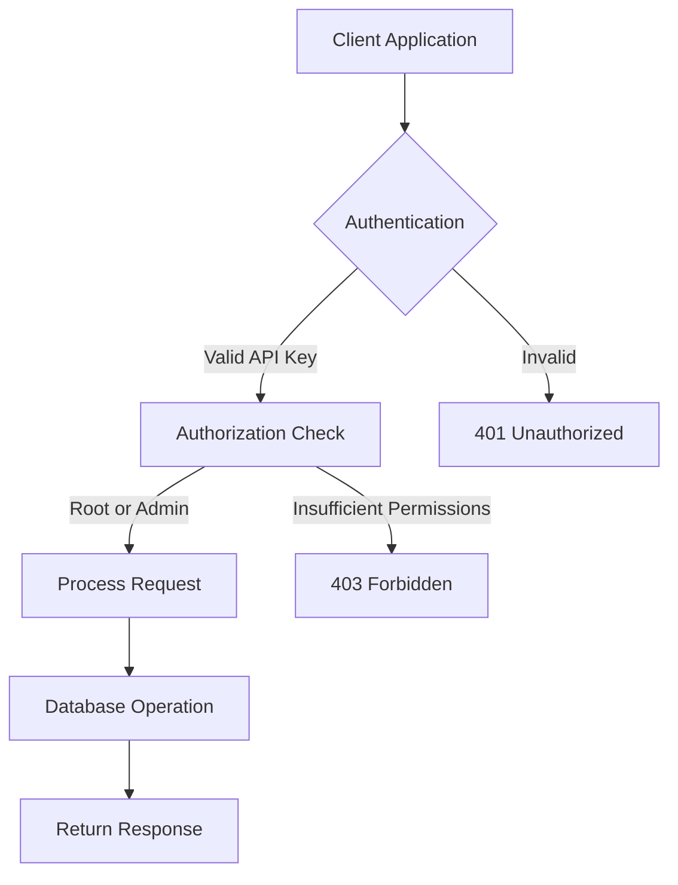
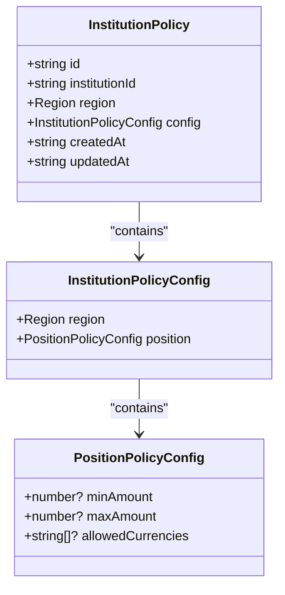
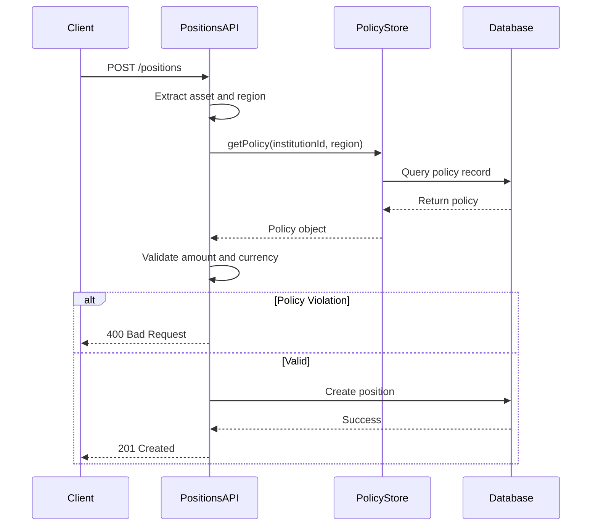
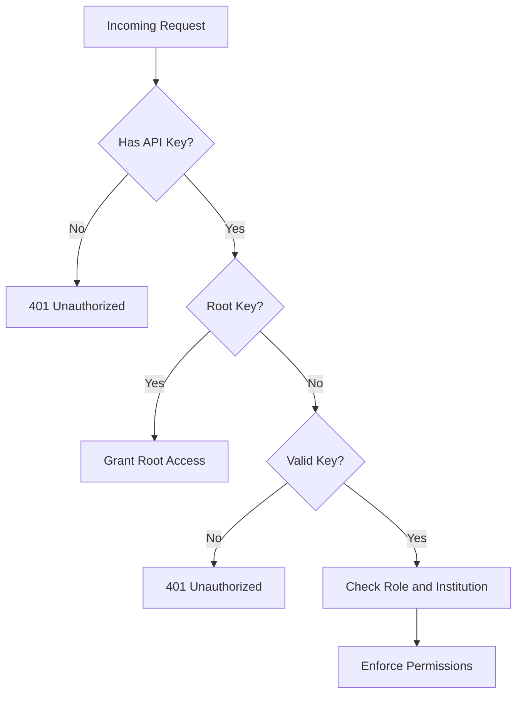
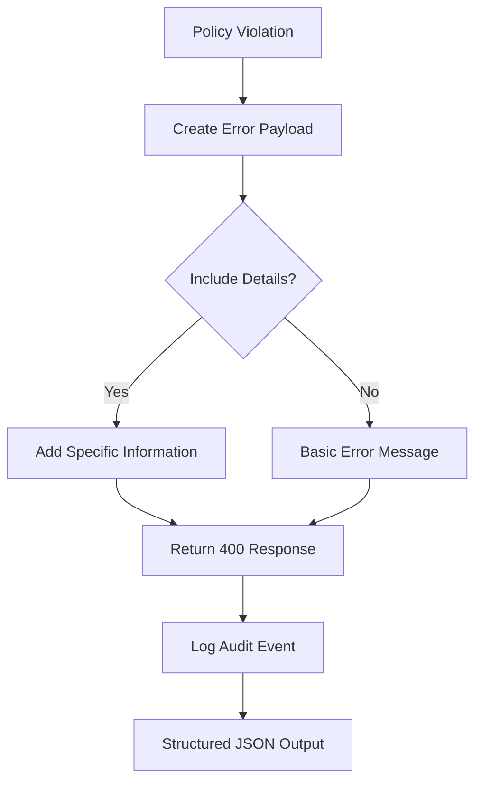
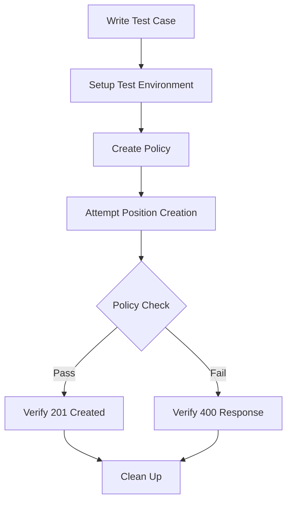
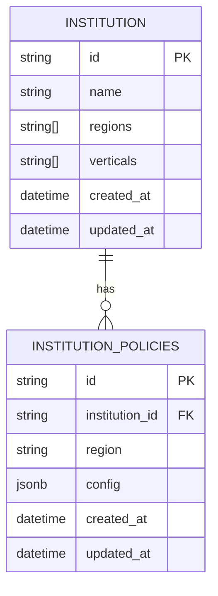

# Policies API

<cite>
**Referenced Files in This Document**   
- [policies.ts](file://src/api/policies.ts)
- [policy.ts](file://src/domain/policy.ts)
- [policyStore.ts](file://src/infra/policyStore.ts)
- [positions.ts](file://src/api/positions.ts)
- [auth.ts](file://src/middleware/auth.ts)
- [types.ts](file://src/domain/types.ts)
- [openapi.ts](file://src/openapi.ts)
- [schema.sql](file://db/schema.sql)
</cite>

## Table of Contents
1. [Introduction](#introduction)
2. [API Endpoints](#api-endpoints)
3. [Policy Configuration Schema](#policy-configuration-schema)
4. [Policy Evaluation Process](#policy-evaluation-process)
5. [Authentication and Authorization](#authentication-and-authorization)
6. [Error Handling and Audit Logging](#error-handling-and-audit-logging)
7. [Testing Policy Logic](#testing-policy-logic)
8. [Common Policy Use Cases](#common-policy-use-cases)
9. [Data Storage and Persistence](#data-storage-and-persistence)

## Introduction
The Policies API in EscrowGrid enables dynamic rule configuration for financial operations, allowing institutions to define governance rules for asset and position behaviors based on geographic regions. Policies are scoped to specific institutions and regions, providing a flexible framework for enforcing business rules across different regulatory environments. The system supports creating, listing, and deleting policies that govern critical operations like position creation and state transitions.

The policy system is designed to ensure compliance with institutional requirements and regulatory constraints by validating operations against defined rules before execution. When policy checks fail, the system returns appropriate error responses and records audit events for compliance tracking.

**Section sources**
- [policies.ts](file://src/api/policies.ts#L1-L180)
- [README.md](file://README.md#L220-L237)

## API Endpoints
The Policies API provides RESTful endpoints for managing institution-specific policies across different regions. These endpoints enable CRUD operations for policy configuration and support integration with the broader EscrowGrid platform.

### List Policies for Institution
Retrieves all policies configured for a specific institution.

**Endpoint**: `GET /institutions/{id}/policies`  
**Authentication**: Required (root or institution admin)  
**Response**: Array of policy objects

### Get Policy by Institution and Region
Retrieves a specific policy for an institution in a particular region.

**Endpoint**: `GET /institutions/{id}/policies/{region}`  
**Authentication**: Required (root or same institution)  
**Response**: Single policy object or 404 if not found

### Create or Update Policy
Creates a new policy or updates an existing policy for an institution in a specific region.

**Endpoint**: `PUT /institutions/{id}/policies/{region}`  
**Authentication**: Required (root or institution admin)  
**Request Body**: Policy configuration object  
**Response**: Updated policy object with metadata

The API follows REST conventions with appropriate HTTP status codes for success and error conditions. All endpoints require authentication via API keys, with authorization determined by the caller's role and institution affiliation.



**Diagram sources**
- [policies.ts](file://src/api/policies.ts#L23-L178)

**Section sources**
- [policies.ts](file://src/api/policies.ts#L23-L178)
- [openapi.ts](file://src/openapi.ts#L914-L963)

## Policy Configuration Schema
The policy configuration schema defines the structure of rules that govern asset and position behaviors. Policies are organized hierarchically with institution and region as primary scoping dimensions.

### Policy Structure
A policy consists of the following components:

- **id**: Unique identifier for the policy
- **institutionId**: Identifier of the institution to which the policy applies
- **region**: Geographic region to which the policy applies
- **config**: Configuration object containing rule definitions
- **createdAt**: Timestamp of policy creation
- **updatedAt**: Timestamp of last policy modification

### Position Policy Configuration
The position configuration block contains rules that govern position creation and management:

- **minAmount** (number, optional): Minimum allowed position amount
- **maxAmount** (number, optional): Maximum allowed position amount
- **allowedCurrencies** (string[], optional): List of allowed currency codes



**Diagram sources**
- [policy.ts](file://src/domain/policy.ts#L3-L23)
- [types.ts](file://src/domain/types.ts#L1)

**Section sources**
- [policy.ts](file://src/domain/policy.ts#L3-L23)
- [policies.ts](file://src/api/policies.ts#L15-L21)

## Policy Evaluation Process
The policy evaluation process is triggered during critical operations, particularly position creation. The system validates operations against applicable policies before allowing them to proceed.

### Position Creation Workflow
When creating a new position, the system follows this evaluation process:

1. Retrieve the asset associated with the position
2. Obtain the asset template to determine the region
3. Look up the institution's policy for that region
4. Validate position parameters against policy rules
5. Reject the operation if any policy conditions are violated

### Rule Validation
The system evaluates the following conditions during policy checks:

- **Amount validation**: Ensures the position amount falls within the allowed range (minAmount ≤ amount ≤ maxAmount)
- **Currency validation**: Verifies that the position currency is included in the allowed currencies list
- **Region validation**: Confirms the region is valid and supported

If a policy exists for the institution and region, all defined constraints must be satisfied for the operation to succeed. If no policy exists, the operation proceeds without policy-based restrictions.



**Diagram sources**
- [positions.ts](file://src/api/positions.ts#L91-L118)
- [policyStore.ts](file://src/infra/policyStore.ts#L21-L24)

**Section sources**
- [positions.ts](file://src/api/positions.ts#L76-L118)
- [policyStore.ts](file://src/infra/policyStore.ts#L21-L24)

## Authentication and Authorization
The Policies API implements a robust authentication and authorization system to ensure only authorized users can manage policies.

### Authentication Methods
The system supports two authentication methods:

- **X-API-KEY header**: Direct API key in the request header
- **Authorization header**: Bearer token format (Authorization: Bearer <token>)

### Role-Based Access Control
Access to policy operations is governed by API key roles:

- **root**: Full system access, can manage policies for any institution
- **admin**: Institutional administrator, can manage policies for their own institution
- **read_only**: Cannot modify policies (write access forbidden)

### Authorization Rules
The system enforces the following authorization rules:

- **Listing policies**: Allowed for root users or users from the same institution
- **Modifying policies**: Restricted to root users or admin users from the same institution
- **Region validation**: Ensures the specified region is valid (US, EU_UK, SG, UAE)

The authentication middleware processes API keys and establishes the caller's identity and permissions before request handling. Root API keys have override capabilities, allowing them to bypass certain institutional restrictions.



**Diagram sources**
- [auth.ts](file://src/middleware/auth.ts#L23-L95)
- [policies.ts](file://src/api/policies.ts#L111-L117)

**Section sources**
- [auth.ts](file://src/middleware/auth.ts#L23-L95)
- [policies.ts](file://src/api/policies.ts#L33-L37)

## Error Handling and Audit Logging
The Policies API implements comprehensive error handling and audit logging to ensure system reliability and compliance.

### Error Responses
When policy checks fail, the system returns standardized error responses with descriptive messages:

- **400 Bad Request**: Policy validation failure with specific details
- **401 Unauthorized**: Missing or invalid authentication
- **403 Forbidden**: Insufficient permissions for the operation
- **404 Not Found**: Resource not found (institution or policy)

Error payloads include both a human-readable error message and machine-readable details to facilitate troubleshooting.

### Audit Logging
All policy-related operations are recorded in the audit log with the following information:

- **Action type**: Specific operation performed (e.g., POSITION_CREATED)
- **Authentication context**: API key ID and institution ID
- **Request metadata**: HTTP method, path, and timestamp
- **Resource information**: Affected resource type and ID
- **Payload**: Relevant operation details

Audit events are stored in the database and emitted as structured JSON logs for integration with external monitoring and compliance systems.



**Diagram sources**
- [positions.ts](file://src/api/positions.ts#L95-L116)
- [auditLogger.ts](file://src/infra/auditLogger.ts#L50-L107)

**Section sources**
- [positions.ts](file://src/api/positions.ts#L95-L116)
- [auditLogger.ts](file://src/infra/auditLogger.ts#L50-L107)

## Testing Policy Logic
The EscrowGrid platform includes a comprehensive testing framework for validating policy logic using Vitest.

### Test Configuration
The testing environment is configured in `vitest.config.ts` to run API tests with a Node.js environment. Tests are located in the `src/__tests__` directory and include both in-memory and PostgreSQL-backed test suites.

### Integration Testing
Integration tests validate policy enforcement during position creation:

- **Policy-free conditions**: Verify position creation without policies
- **Policy enforcement**: Test rejection of positions that violate policy rules
- **Boundary conditions**: Validate behavior at minimum and maximum allowed values

The test suite uses supertest to make HTTP requests to the API endpoints and validate responses. Test cases cover both successful operations and various error conditions.

### Load Testing
The platform includes k6 load tests in the `load/positions-k6.js` file that simulate concurrent position creation requests. These tests verify policy enforcement under load and check for proper error handling when policy checks fail.



**Section sources**
- [vitest.config.ts](file://vitest.config.ts#L1-L10)
- [api.test.ts](file://src/__tests__/api.test.ts#L88-L124)
- [positions-k6.js](file://load/positions-k6.js#L56-L86)

## Common Policy Use Cases
The Policies API supports various common use cases for financial governance and compliance.

### Transaction Limits
Institutions can set minimum and maximum transaction amounts for different regions:

```json
{
  "position": {
    "minAmount": 1000,
    "maxAmount": 1000000
  }
}
```

This prevents unusually small or large transactions that might indicate errors or fraudulent activity.

### Geographic Restrictions
Currency restrictions can be applied based on regional regulations:

```json
{
  "position": {
    "allowedCurrencies": ["USD", "EUR", "GBP"]
  }
}
```

This ensures compliance with local financial regulations and reduces currency conversion risks.

### Approval Workflows
While not directly implemented in the current policy schema, the framework supports extension for approval workflows by integrating with external systems. Policies can be configured to require additional validation steps for certain transaction types or amounts.

### Regional Compliance
Different regions have different regulatory requirements. Institutions can configure region-specific policies to ensure compliance:

- **US**: Specific reporting requirements and transaction limits
- **EU_UK**: GDPR compliance and financial regulations
- **SG**: Monetary Authority of Singapore guidelines
- **UAE**: Central Bank of UAE regulations

These use cases demonstrate the flexibility of the policy system in addressing various financial governance requirements.

**Section sources**
- [README.md](file://README.md#L220-L237)
- [policies.ts](file://src/api/policies.ts#L15-L21)

## Data Storage and Persistence
The policy data storage system supports both in-memory and PostgreSQL persistence options.

### Database Schema
The `institution_policies` table stores policy configurations with the following structure:

- **id**: Primary key (text)
- **institution_id**: Foreign key to institutions table
- **region**: Geographic region (text)
- **config**: JSONB field storing policy configuration
- **created_at**: Timestamp of creation
- **updated_at**: Timestamp of last update

The table has a unique constraint on the combination of institution_id and region, ensuring only one policy per institution-region pair.

### Storage Implementation
The system implements a storage abstraction with two concrete implementations:

- **InMemoryPolicyStore**: For development and testing
- **PostgresPolicyStore**: For production with durable storage

The policy store interface provides methods for upserting, retrieving, and listing policies. The upsert operation uses PostgreSQL's ON CONFLICT clause to handle both insert and update operations efficiently.

### Data Access Patterns
The system follows these data access patterns:

- **Write operations**: Use upsert semantics to create or update policies
- **Read operations**: Retrieve policies by institution and region
- **List operations**: Fetch all policies for a specific institution

The storage layer abstracts database-specific details, allowing the application logic to remain database-agnostic.



**Diagram sources**
- [schema.sql](file://db/schema.sql)
- [policyStore.ts](file://src/infra/policyStore.ts#L63-L121)

**Section sources**
- [schema.sql](file://db/schema.sql)
- [policyStore.ts](file://src/infra/policyStore.ts#L63-L121)