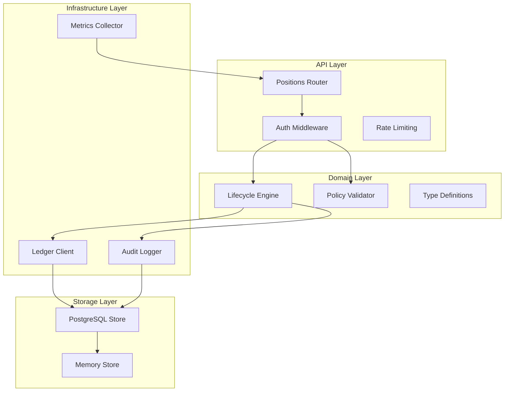
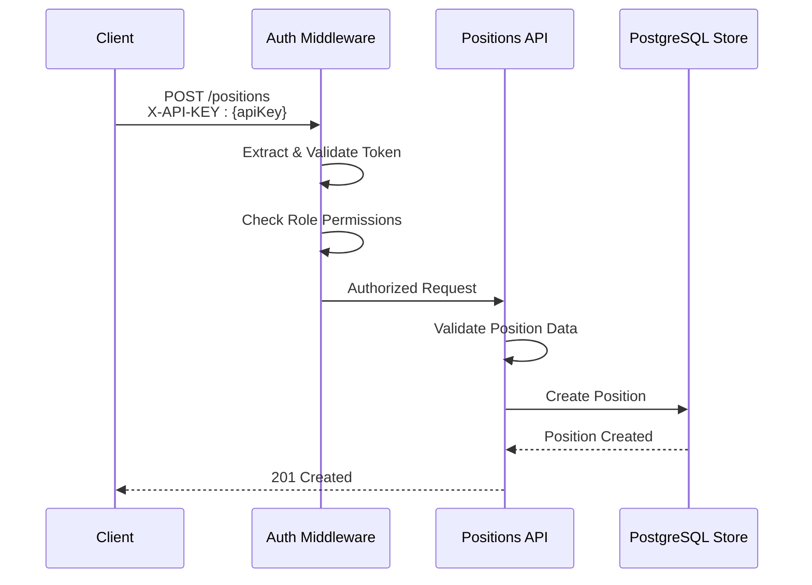
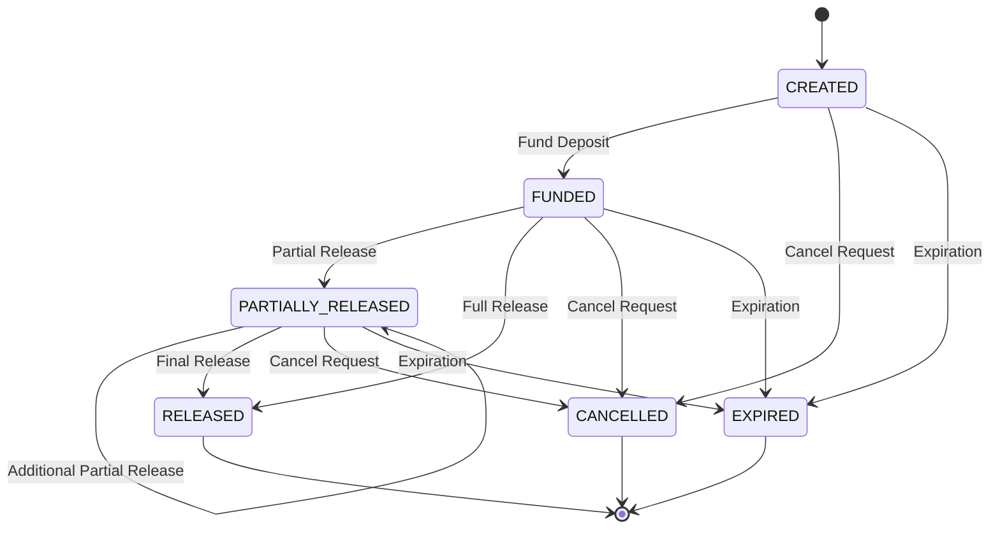
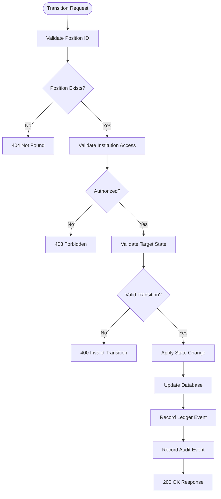
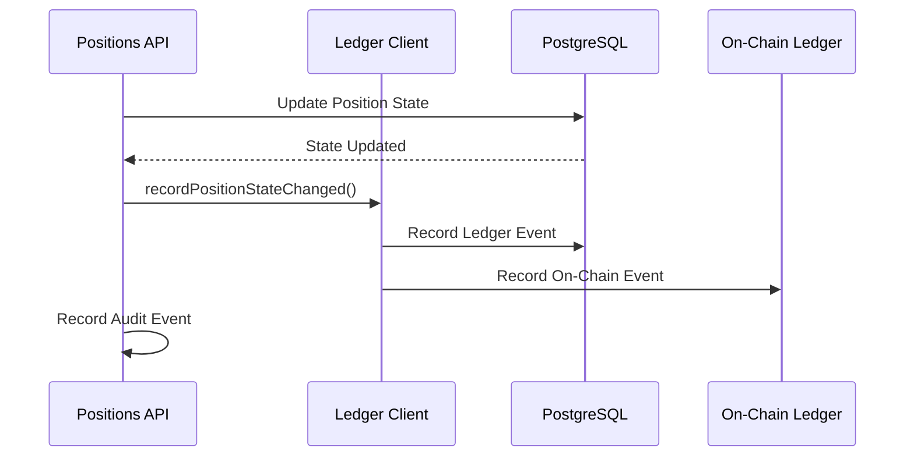

# Positions API

<cite>
**Referenced Files in This Document**
- [src/api/positions.ts](file://src/api/positions.ts)
- [src/domain/lifecycle.ts](file://src/domain/lifecycle.ts)
- [src/domain/types.ts](file://src/domain/types.ts)
- [src/domain/policy.ts](file://src/domain/policy.ts)
- [src/middleware/auth.ts](file://src/middleware/auth.ts)
- [src/store/postgresStore.ts](file://src/store/postgresStore.ts)
- [src/infra/ledgerClient.ts](file://src/infra/ledgerClient.ts)
- [src/infra/auditLogger.ts](file://src/infra/auditLogger.ts)
- [src/infra/metrics.ts](file://src/infra/metrics.ts)
- [src/infra/onchainLedger.ts](file://src/infra/onchainLedger.ts)
- [src/openapi.ts](file://src/openapi.ts)
- [src/server.ts](file://src/server.ts)
- [src/__tests__/api.test.ts](file://src/__tests__/api.test.ts)
</cite>

## Table of Contents
1. [Introduction](#introduction)
2. [API Overview](#api-overview)
3. [Authentication and Authorization](#authentication-and-authorization)
4. [Position Lifecycle States](#position-lifecycle-states)
5. [Core Endpoints](#core-endpoints)
6. [State Transitions and Validation](#state-transitions-and-validation)
7. [Response Structures](#response-structures)
8. [Error Handling](#error-handling)
9. [Ledger and Audit Integration](#ledger-and-audit-integration)
10. [Performance Considerations](#performance-considerations)
11. [Real-World Examples](#real-world-examples)
12. [Integration Guidelines](#integration-guidelines)

## Introduction

The Positions API manages financial position lifecycles in the escrowgrid system, providing comprehensive endpoints for creating, retrieving, and transitioning positions through defined states. Positions represent escrow arrangements with specific assets, holders, currencies, and amounts, undergoing controlled state transitions from creation to closure.

The API enforces strict domain logic for state transitions, institutional policies, and regulatory compliance while maintaining dual-ledger synchronization (off-chain and on-chain) and comprehensive audit trails.

## API Overview

The Positions API operates as part of the broader EscrowGrid Tokenization-as-a-Service (TAAS) platform, managing financial instruments through a well-defined lifecycle model. The system supports multiple regions and verticals with region-specific policies and regulatory requirements.



**Diagram sources**
- [src/api/positions.ts](file://src/api/positions.ts#L1-L298)
- [src/middleware/auth.ts](file://src/middleware/auth.ts#L1-L95)
- [src/store/postgresStore.ts](file://src/store/postgresStore.ts#L1-L417)

**Section sources**
- [src/api/positions.ts](file://src/api/positions.ts#L1-L298)
- [src/server.ts](file://src/server.ts#L1-L100)

## Authentication and Authorization

The Positions API implements institution-scoped access control using API keys with role-based permissions. Authentication occurs via the `X-API-KEY` header or Bearer token authentication.

### Authentication Methods

| Method | Header | Description |
|--------|--------|-------------|
| API Key | `X-API-KEY` | Primary authentication method using hashed API keys |
| Bearer Token | `Authorization: Bearer <token>` | Alternative authentication method |

### Role-Based Access Control

| Role | Permissions | Allowed Operations |
|------|-------------|-------------------|
| `root` | Full administrative access | Create, read, update, delete all positions |
| `admin` | Institution-scoped write access | Create, update positions within institution |
| `read_only` | Institution-scoped read access | Read positions within institution |

### Authorization Rules

- **Root Keys**: Can access all institutions and positions globally
- **Institution Keys**: Restricted to their own institution's data
- **Cross-Institution Access**: Forbidden except for root keys
- **Position Access**: Must match institution ownership or be root



**Diagram sources**
- [src/middleware/auth.ts](file://src/middleware/auth.ts#L35-L95)
- [src/api/positions.ts](file://src/api/positions.ts#L22-L151)

**Section sources**
- [src/middleware/auth.ts](file://src/middleware/auth.ts#L1-L95)
- [src/api/positions.ts](file://src/api/positions.ts#L22-L151)

## Position Lifecycle States

Positions progress through a well-defined set of states representing different stages of the escrow lifecycle. State transitions are governed by strict business rules and can only occur in predefined sequences.

### Available States

| State | Description | Terminal? | Allowed Transitions From |
|-------|-------------|-----------|-------------------------|
| `CREATED` | Position initialized but not funded | No | `FUNDED`, `CANCELLED`, `EXPIRED` |
| `FUNDED` | Funds deposited into escrow | No | `PARTIALLY_RELEASED`, `RELEASED`, `CANCELLED`, `EXPIRED` |
| `PARTIALLY_RELEASED` | Partial release of funds occurred | No | `PARTIALLY_RELEASED`, `RELEASED`, `CANCELLED`, `EXPIRED` |
| `RELEASED` | All funds released | Yes | None |
| `CANCELLED` | Position cancelled | Yes | None |
| `EXPIRED` | Position expired | Yes | None |

### State Transition Matrix



**Diagram sources**
- [src/domain/lifecycle.ts](file://src/domain/lifecycle.ts#L3-L10)

**Section sources**
- [src/domain/lifecycle.ts](file://src/domain/lifecycle.ts#L1-L51)
- [src/domain/types.ts](file://src/domain/types.ts#L38-L44)

## Core Endpoints

### Create Position

Creates a new escrow position under an asset with specified parameters.

**Endpoint**: `POST /positions`

**Request Body**:
```typescript
interface CreatePositionBody {
  institutionId?: string;        // Required for root keys
  assetId: string;               // Asset identifier
  holderReference: string;       // Unique holder identifier
  currency: string;              // Currency code (ISO 4217)
  amount: number;                // Position amount (> 0)
  externalReference?: string;    // Optional external reference
}
```

**Validation Rules**:
- `assetId`: Must reference a valid asset within the institution
- `holderReference`: Must be unique within the asset
- `currency`: Must be supported by asset template
- `amount`: Must be positive number
- `institutionId`: Required for root keys, derived from API key otherwise

**Response**: `201 Created` with full position object including initial state `CREATED`.

### List Positions

Retrieves positions with optional filtering by institution, asset, or holder reference.

**Endpoint**: `GET /positions`

**Query Parameters**:
- `institutionId`: Filter by institution (root only)
- `assetId`: Filter by specific asset
- `holderReference`: Filter by holder reference

**Response**: `200 OK` with array of position objects.

### Get Position

Retrieves a specific position by ID.

**Endpoint**: `GET /positions/{id}`

**Response**: `200 OK` with position object or `404 Not Found`.

### Transition Position

Applies a state transition to an existing position.

**Endpoint**: `POST /positions/{id}/transition`

**Request Body**:
```typescript
interface TransitionBody {
  toState: PositionState;        // Target state
  reason?: string;               // Transition reason
  metadata?: Record<string, unknown>; // Additional metadata
}
```

**Validation Rules**:
- Position must exist and belong to requesting institution
- Target state must be valid for current position state
- Write access permission required

**Response**: `200 OK` with updated position including new state and transition event.

**Section sources**
- [src/api/positions.ts](file://src/api/positions.ts#L13-L298)
- [src/openapi.ts](file://src/openapi.ts#L718-L884)

## State Transitions and Validation

### Domain-Level Validation

The lifecycle engine enforces strict business rules for state transitions:



**Diagram sources**
- [src/api/positions.ts](file://src/api/positions.ts#L220-L296)
- [src/domain/lifecycle.ts](file://src/domain/lifecycle.ts#L16-L51)

### Policy Enforcement

Position creation validates against institutional policies:

| Policy Type | Validation | Error Response |
|-------------|------------|----------------|
| Minimum Amount | `amount >= minAmount` | `400 Amount below minimum for policy` |
| Maximum Amount | `amount <= maxAmount` | `400 Amount above maximum for policy` |
| Allowed Currencies | `currency in allowedCurrencies` | `400 Currency not allowed by policy` |

**Section sources**
- [src/api/positions.ts](file://src/api/positions.ts#L91-L118)
- [src/domain/lifecycle.ts](file://src/domain/lifecycle.ts#L12-L14)

## Response Structures

### Position Object

```typescript
interface Position {
  id: string;                    // Unique position identifier
  institutionId: string;         // Owning institution
  assetId: string;               // Associated asset
  holderReference: string;       // Holder identifier
  currency: string;              // Currency code
  amount: number;                // Position amount
  state: PositionState;          // Current state
  externalReference?: string;    // External reference
  createdAt: string;             // Creation timestamp
  updatedAt: string;             // Last update timestamp
  events: PositionLifecycleEvent[]; // State history
}
```

### Position Lifecycle Event

```typescript
interface PositionLifecycleEvent {
  id: string;                    // Event identifier
  positionId: string;            // Related position
  fromState: PositionState | null; // Previous state (null for creation)
  toState: PositionState;        // New state
  reason?: string;               // Transition reason
  at: string;                    // Event timestamp
  metadata?: Record<string, unknown>; // Additional metadata
}
```

### Error Response

```typescript
interface ApiErrorPayload {
  error: string;                 // Error description
  details?: unknown;             // Additional error details
}
```

**Section sources**
- [src/domain/types.ts](file://src/domain/types.ts#L56-L85)
- [src/api/positions.ts](file://src/api/positions.ts#L38-L42)

## Error Handling

### Common Error Responses

| Status Code | Error Type | Description |
|-------------|------------|-------------|
| 400 | Bad Request | Invalid request body, policy violation, or invalid transition |
| 401 | Unauthorized | Missing or invalid API key |
| 403 | Forbidden | Insufficient permissions or cross-institution access |
| 404 | Not Found | Position or resource not found |
| 500 | Internal Error | Server-side processing failure |

### Error Scenarios

#### Invalid Position Creation
```json
{
  "error": "Invalid request body",
  "details": "assetId, holderReference, currency, and numeric amount are required"
}
```

#### Policy Violation
```json
{
  "error": "Amount below minimum for policy",
  "details": "minAmount=1000"
}
```

#### Invalid State Transition
```json
{
  "error": "Invalid transition from FUNDED to CREATED",
  "details": "Invalid transition from FUNDED to CREATED"
}
```

#### Cross-Institution Access
```json
{
  "error": "Forbidden",
  "details": "Cannot create positions for a different institution"
}
```

**Section sources**
- [src/api/positions.ts](file://src/api/positions.ts#L38-L42)
- [src/api/positions.ts](file://src/api/positions.ts#L91-L118)
- [src/api/positions.ts](file://src/api/positions.ts#L286-L292)

## Ledger and Audit Integration

### Off-Chain Ledger Updates

Each position state change triggers automatic ledger recording for both off-chain and on-chain systems:



**Diagram sources**
- [src/api/positions.ts](file://src/api/positions.ts#L268-L271)
- [src/infra/ledgerClient.ts](file://src/infra/ledgerClient.ts#L24-L31)

### Audit Logging

All position operations are recorded with comprehensive audit trails:

| Event Type | Triggers | Logged Information |
|------------|----------|-------------------|
| `POSITION_CREATED` | Position creation | Institution, asset, amount, currency |
| `POSITION_TRANSITIONED` | State changes | From state, to state, reason, metadata |

### On-Chain Synchronization

Optional on-chain ledger integration provides immutable audit trails:

- **Template Configuration**: Per-asset-template on-chain enablement
- **Chain Validation**: Automatic chain ID verification
- **Event Recording**: Immutable position state changes
- **Failure Handling**: Graceful degradation on blockchain errors

**Section sources**
- [src/api/positions.ts](file://src/api/positions.ts#L128-L143)
- [src/api/positions.ts](file://src/api/positions.ts#L272-L284)
- [src/infra/ledgerClient.ts](file://src/infra/ledgerClient.ts#L1-L64)
- [src/infra/onchainLedger.ts](file://src/infra/onchainLedger.ts#L1-L221)

## Performance Considerations

### High-Frequency Updates

The Positions API is designed for high-throughput scenarios with several optimization strategies:

#### Database Optimizations
- **Connection Pooling**: PostgreSQL connection pooling for concurrent access
- **Transaction Management**: Atomic updates with rollback support
- **Indexing**: Strategic indexing on frequently queried fields
- **Batch Operations**: Efficient bulk operations for bulk updates

#### Memory Management
- **In-Memory Caching**: Redis caching for frequently accessed assets and templates
- **Connection Reuse**: Persistent connections to reduce overhead
- **Resource Cleanup**: Proper connection release and garbage collection

#### Rate Limiting
- **Per-IP Limits**: Configurable limits per client IP address
- **Per-Key Limits**: Institution-level rate limiting
- **Burst Protection**: Sliding window rate limiting

### Metrics Collection

Built-in metrics provide insights into API performance:

```typescript
interface RequestMetricsSnapshot {
  totalRequests: number;         // Total requests processed
  totalErrors: number;           // Error count
  requestsByStatus: Record<number, number>; // Status distribution
  requestsByMethod: Record<string, number>; // Method distribution
  averageDurationMs: number;     // Average response time
}
```

**Section sources**
- [src/infra/metrics.ts](file://src/infra/metrics.ts#L1-L39)
- [src/store/postgresStore.ts](file://src/store/postgresStore.ts#L356-L410)

## Real-World Examples

### Example 1: Creating a Construction Escrow Position

```bash
curl -X POST https://api.escrowgrid.io/positions \
  -H "X-API-KEY: your-api-key" \
  -H "Content-Type: application/json" \
  -d '{
    "institutionId": "inst_abc123",
    "assetId": "ast_xyz789",
    "holderReference": "SUBCONTRACTOR_123",
    "currency": "USD",
    "amount": 100000,
    "externalReference": "PROJECT_ALPHA_001"
  }'
```

**Response**:
```json
{
  "id": "pos_def456",
  "institutionId": "inst_abc123",
  "assetId": "ast_xyz789",
  "holderReference": "SUBCONTRACTOR_123",
  "currency": "USD",
  "amount": 100000,
  "state": "CREATED",
  "externalReference": "PROJECT_ALPHA_001",
  "createdAt": "2024-01-15T10:30:00Z",
  "updatedAt": "2024-01-15T10:30:00Z",
  "events": [
    {
      "id": "ple_abc123",
      "positionId": "pos_def456",
      "fromState": null,
      "toState": "CREATED",
      "reason": null,
      "at": "2024-01-15T10:30:00Z",
      "metadata": null
    }
  ]
}
```

### Example 2: Funding the Position

```bash
curl -X POST https://api.escrowgrid.io/positions/pos_def456/transition \
  -H "X-API-KEY: your-api-key" \
  -H "Content-Type: application/json" \
  -d '{
    "toState": "FUNDED",
    "reason": "Bank transfer completed",
    "metadata": {
      "bankReference": "BANK_TX_123456",
      "fundingDate": "2024-01-15"
    }
  }'
```

### Example 3: Partial Release

```bash
curl -X POST https://api.escrowgrid.io/positions/pos_def456/transition \
  -H "X-API-KEY: your-api-key" \
  -H "Content-Type: application/json" \
  -d '{
    "toState": "PARTIALLY_RELEASED",
    "reason": "Partial payment for milestone completion",
    "metadata": {
      "releaseAmount": 50000,
      "milestone": "FOUNDATION_COMPLETION"
    }
  }'
```

### Example 4: Complete Release

```bash
curl -X POST https://api.escrowgrid.io/positions/pos_def456/transition \
  -H "X-API-KEY: your-api-key" \
  -H "Content-Type: application/json" \
  -d '{
    "toState": "RELEASED",
    "reason": "Final payment after project completion",
    "metadata": {
      "finalRelease": true,
      "completionDate": "2024-03-15"
    }
  }'
```

**Section sources**
- [src/__tests__/api.test.ts](file://src/__tests__/api.test.ts#L88-L125)

## Integration Guidelines

### Best Practices

#### Error Handling
- Implement retry logic for transient failures
- Log all API responses for debugging
- Handle rate limiting gracefully
- Validate responses before processing

#### Security
- Store API keys securely
- Use HTTPS in production
- Implement proper authentication
- Monitor for unauthorized access

#### Performance
- Batch related operations
- Use appropriate filtering parameters
- Implement client-side caching
- Monitor API response times

#### Compliance
- Maintain audit logs locally
- Ensure data retention policies
- Implement proper access controls
- Regular security audits

### SDK Integration

For production deployments, consider using the official SDKs or implementing client libraries with:

- Automatic retry mechanisms
- Request/response logging
- Configuration management
- Environment-specific endpoints

### Monitoring and Alerting

Set up monitoring for:

- API response times
- Error rates by endpoint
- Authentication failures
- Policy violations
- Ledger synchronization status

**Section sources**
- [src/api/positions.ts](file://src/api/positions.ts#L1-L298)
- [src/openapi.ts](file://src/openapi.ts#L1-L1038)