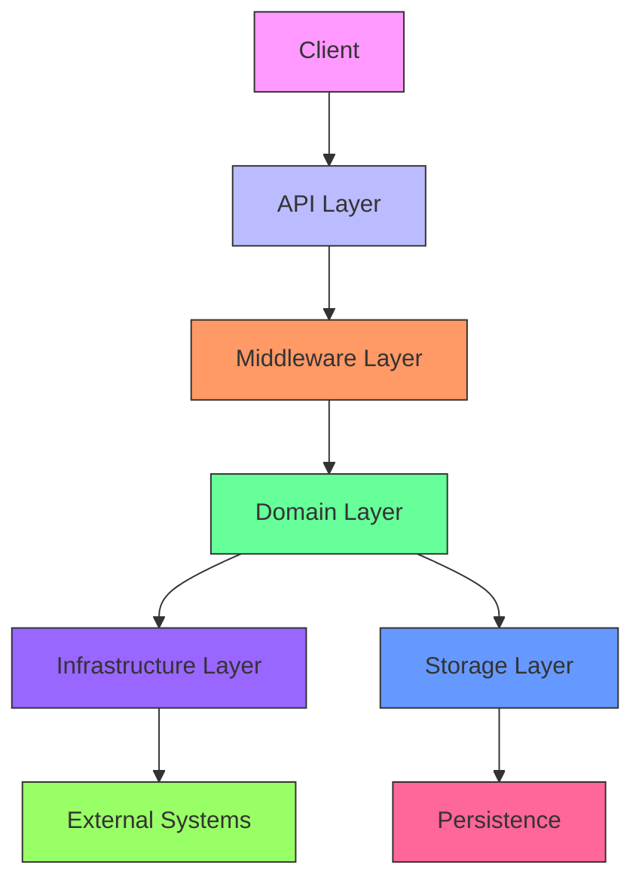
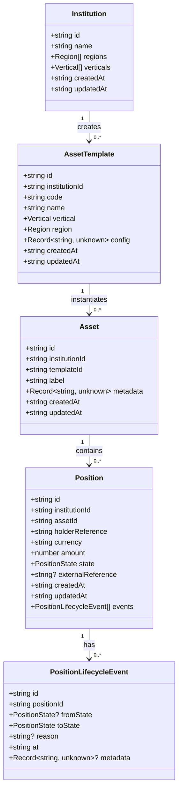
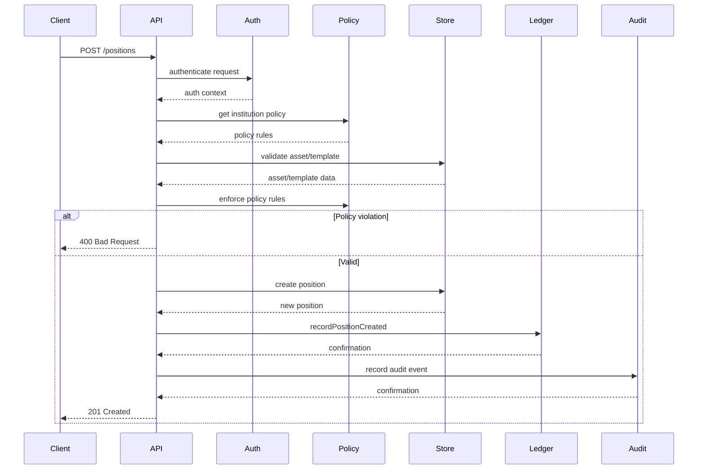
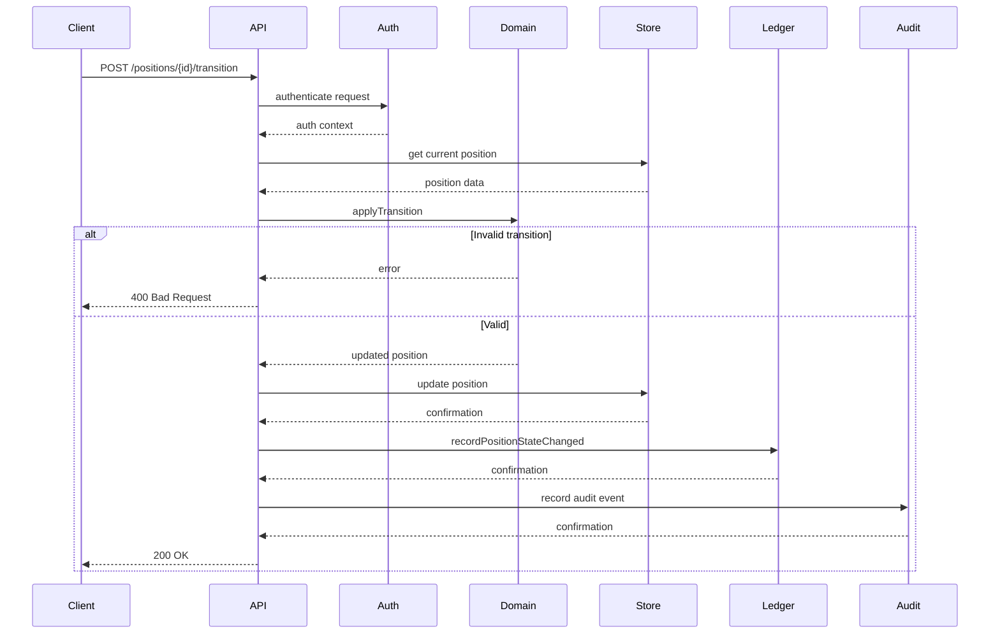

# Architecture

<cite>
**Referenced Files in This Document**   
- [server.ts](file://src/server.ts)
- [config.ts](file://src/config.ts)
- [openapi.ts](file://src/openapi.ts)
- [types.ts](file://src/domain/types.ts)
- [lifecycle.ts](file://src/domain/lifecycle.ts)
- [policy.ts](file://src/domain/policy.ts)
- [store.ts](file://src/store/store.ts)
- [memoryStore.ts](file://src/store/memoryStore.ts)
- [postgresStore.ts](file://src/store/postgresStore.ts)
- [auth.ts](file://src/middleware/auth.ts)
- [positions.ts](file://src/api/positions.ts)
- [postgresLedger.ts](file://src/infra/postgresLedger.ts)
- [onchainLedger.ts](file://src/infra/onchainLedger.ts)
- [health.ts](file://src/infra/health.ts)
- [schema.sql](file://db/schema.sql)
</cite>

## Table of Contents
1. [Introduction](#introduction)
2. [Layered Architecture Overview](#layered-architecture-overview)
3. [API Layer](#api-layer)
4. [Domain Layer](#domain-layer)
5. [Infrastructure Layer](#infrastructure-layer)
6. [Storage Layer](#storage-layer)
7. [Middleware Layer](#middleware-layer)
8. [Component Interactions](#component-interactions)
9. [Key Architectural Patterns](#key-architectural-patterns)
10. [System Boundaries and Service Responsibilities](#system-boundaries-and-service-responsibilities)
11. [Integration Points](#integration-points)
12. [Scalability Considerations](#scalability-considerations)
13. [Fault Tolerance](#fault-tolerance)
14. [Deployment Topology](#deployment-topology)
15. [Cross-Cutting Concerns](#cross-cutting-concerns)
16. [Technology Stack Implications](#technology-stack-implications)

## Introduction
The EscrowGrid platform is a Tokenization-as-a-Service (TAAS) infrastructure designed for institutions to manage escrowable assets in construction and trade finance. The system provides a layered architecture with clear separation between API, domain, infrastructure, middleware, and storage components. This documentation details the architectural design, component interactions, key patterns, and operational characteristics of the platform.

The platform supports both in-memory and PostgreSQL persistence, with pluggable storage implementations. It features a policy-based authorization model, event-sourced position lifecycle management, and optional on-chain ledger integration for blockchain recording. The architecture emphasizes separation of concerns, testability, and extensibility while maintaining performance and reliability.

**Section sources**
- [README.md](file://README.md#L1-L378)

## Layered Architecture Overview
The EscrowGrid platform follows a clean, layered architecture with well-defined boundaries between components. The architecture consists of five primary layers:

1. **API Layer**: Handles HTTP request routing, validation, and response formatting
2. **Domain Layer**: Contains business logic, entities, and core domain rules
3. **Infrastructure Layer**: Provides technical capabilities like logging, monitoring, and external integrations
4. **Middleware Layer**: Implements cross-cutting concerns like authentication and rate limiting
5. **Storage Layer**: Manages data persistence with pluggable implementations

This layered approach ensures separation of concerns, making the system more maintainable, testable, and extensible. Each layer has specific responsibilities and dependencies flow in one direction from higher-level layers to lower-level layers.



**Diagram sources**
- [server.ts](file://src/server.ts#L1-L100)
- [config.ts](file://src/config.ts#L1-L47)

## API Layer
The API layer serves as the entry point for all external interactions with the EscrowGrid platform. Built on Express.js, this layer handles HTTP request routing, parameter validation, and response formatting. The API exposes RESTful endpoints for managing institutions, asset templates, assets, positions, policies, and ledger events.

The API layer is organized into modular routers that correspond to different resource types, including institutions, asset templates, assets, positions, and ledger events. Each router handles specific HTTP methods (GET, POST, PUT, DELETE) for its corresponding resource. The layer leverages OpenAPI 3.0 specification for API documentation, providing interactive documentation through Swagger UI and ReDoc.

Key endpoints include:
- `/institutions`: Management of financial institutions using the platform
- `/asset-templates`: Definition of tokenizable asset types
- `/assets`: Creation of specific asset instances
- `/positions`: Management of holder-specific claims on assets
- `/ledger-events`: Querying of immutable ledger events
- `/health` and `/ready`: Liveness and readiness probes

The API layer enforces authentication through API keys and implements rate limiting to prevent abuse. It also provides comprehensive error handling with standardized error responses.

**Section sources**
- [server.ts](file://src/server.ts#L1-L100)
- [openapi.ts](file://src/openapi.ts#L1-L800)
- [positions.ts](file://src/api/positions.ts#L1-L298)

## Domain Layer
The domain layer contains the core business logic and entities of the EscrowGrid platform. This layer defines the fundamental concepts of the system including institutions, asset templates, assets, positions, and their relationships. The domain model is implemented using TypeScript interfaces and functions that encapsulate business rules.

Key domain entities include:
- **Institution**: A bank, fund, or enterprise using the platform
- **Asset Template**: Describes a tokenizable asset type (e.g., construction escrow, invoice claim)
- **Asset**: A specific instance under an asset template
- **Position**: A holder-specific claim on an asset with a lifecycle

The domain layer implements critical business rules such as position lifecycle management, where positions transition through states like CREATED, FUNDED, RELEASED, and CANCELLED according to predefined rules. The layer also handles policy enforcement, ensuring that position creation adheres to institution-specific rules regarding minimum/maximum amounts and allowed currencies.



**Diagram sources**
- [types.ts](file://src/domain/types.ts#L1-L85)
- [lifecycle.ts](file://src/domain/lifecycle.ts#L1-L51)
- [policy.ts](file://src/domain/policy.ts#L1-L23)

**Section sources**
- [types.ts](file://src/domain/types.ts#L1-L85)
- [lifecycle.ts](file://src/domain/lifecycle.ts#L1-L51)
- [policy.ts](file://src/domain/policy.ts#L1-L23)

## Infrastructure Layer
The infrastructure layer provides technical capabilities that support the core functionality of the EscrowGrid platform. This layer handles cross-cutting concerns such as authentication, logging, monitoring, and external integrations. It acts as a bridge between the domain logic and external systems.

Key components in the infrastructure layer include:
- **Authentication**: API key-based authentication with role-based access control
- **Audit Logging**: Recording of critical operations for compliance and debugging
- **Health Checks**: Liveness and readiness probes for container orchestration
- **Metrics Collection**: In-memory request metrics for monitoring
- **On-chain Integration**: Optional blockchain recording of position events
- **Ledger Services**: Immutable event recording for audit trails

The infrastructure layer implements dependency injection, allowing different implementations to be swapped based on configuration. For example, the ledger service can be configured to write to PostgreSQL, memory, or an on-chain blockchain contract depending on the environment and requirements.

```mermaid
classDiagram
class AuthContext {
+AuthRole role
+string? institutionId
+string? apiKeyId
}
class AuditLogger {
+record(event : AuditEvent) : Promise~void~
}
class LedgerClient {
+recordPositionCreated(position : Position) : Promise~void~
+recordPositionStateChanged(position : Position, event : PositionLifecycleEvent) : Promise~void~
+listEvents(params? : { positionId? : string }) : Promise~LedgerEvent[]~
}
class OnchainLedger {
+recordPositionCreated(position : Position) : Promise~void~
+recordPositionStateChanged(position : Position, event : PositionLifecycleEvent) : Promise~void~
}
class PostgresLedger {
+recordPositionCreated(position : Position) : Promise~void~
+recordPositionStateChanged(position : Position, event : PositionLifecycleEvent) : Promise~void~
+listEvents(params? : { positionId? : string }) : Promise~LedgerEvent[]~
}
class ReadinessStatus {
+boolean ok
+string storeBackend
+DBStatus? db
}
LedgerClient <|-- OnchainLedger
LedgerClient <|-- PostgresLedger
AuditLogger ..> console : logs to
OnchainLedger ..> ethers : uses
PostgresLedger ..> pg : uses
```

**Diagram sources**
- [auth.ts](file://src/middleware/auth.ts#L1-L95)
- [auditLogger.ts](file://src/infra/auditLogger.ts)
- [postgresLedger.ts](file://src/infra/postgresLedger.ts#L1-L108)
- [onchainLedger.ts](file://src/infra/onchainLedger.ts#L1-L221)
- [health.ts](file://src/infra/health.ts#L1-L47)

**Section sources**
- [auth.ts](file://src/middleware/auth.ts#L1-L95)
- [postgresLedger.ts](file://src/infra/postgresLedger.ts#L1-L108)
- [onchainLedger.ts](file://src/infra/onchainLedger.ts#L1-L221)
- [health.ts](file://src/infra/health.ts#L1-L47)

## Storage Layer
The storage layer provides data persistence capabilities for the EscrowGrid platform with pluggable implementations. The architecture supports both in-memory and PostgreSQL storage backends, allowing for flexibility in deployment scenarios from development to production.

The storage layer is defined by a `Store` interface that specifies the contract for data operations, including CRUD operations for institutions, asset templates, assets, and positions. This interface-based design enables the pluggable storage pattern, where different implementations can be injected based on configuration.

Two primary implementations are provided:
- **MemoryStore**: An in-memory implementation using JavaScript Maps for fast, ephemeral storage suitable for development and testing
- **PostgresStore**: A persistent implementation using PostgreSQL for production workloads with data durability requirements

The storage layer handles data access patterns and ensures data consistency within the constraints of the chosen backend. It also manages database connections and transactions when using the PostgreSQL implementation.

```mermaid
classDiagram
class Store {
<<interface>>
+createInstitution(input : InstitutionInput) : Promise~Institution~
+listInstitutions() : Promise~Institution[]~
+getInstitution(id : string) : Promise~Institution | undefined~
+createAssetTemplate(input : AssetTemplateInput) : Promise~AssetTemplate~
+listAssetTemplates(params? : { institutionId? : string }) : Promise~AssetTemplate[]~
+getAssetTemplate(id : string) : Promise~AssetTemplate | undefined~
+createAsset(input : AssetInput) : Promise~Asset~
+getAsset(id : string) : Promise~Asset | undefined~
+listAssets(params? : { institutionId? : string; templateId? : string }) : Promise~Asset[]~
+createPosition(input : PositionInput) : Promise~Position~
+getPosition(id : string) : Promise~Position | undefined~
+listPositions(params? : { institutionId? : string; assetId? : string; holderReference? : string }) : Promise~Position[]~
+updatePosition(position : Position, latestEvent? : PositionLifecycleEvent) : Promise~Position~
}
class MemoryStore {
-Map~string, Institution~ institutions
-Map~string, AssetTemplate~ assetTemplates
-Map~string, Asset~ assets
-Map~string, Position~ positions
}
class PostgresStore {
-Pool pool
}
Store <|.. MemoryStore
Store <|.. PostgresStore
MemoryStore ..> Map : uses
PostgresStore ..> pg : uses
```

**Diagram sources**
- [store.ts](file://src/store/store.ts#L1-L59)
- [memoryStore.ts](file://src/store/memoryStore.ts#L1-L218)
- [postgresStore.ts](file://src/store/postgresStore.ts)

**Section sources**
- [store.ts](file://src/store/store.ts#L1-L59)
- [memoryStore.ts](file://src/store/memoryStore.ts#L1-L218)

## Middleware Layer
The middleware layer implements cross-cutting concerns that apply to multiple API endpoints. Built on Express.js middleware patterns, this layer handles authentication, rate limiting, request logging, and other shared functionality.

Key middleware components include:
- **Authentication Middleware**: Validates API keys and establishes the authentication context for each request
- **Request Logging Middleware**: Logs incoming requests for monitoring and debugging
- **Rate Limiting Middleware**: Prevents abuse by limiting the number of requests from a single client
- **CORS Middleware**: Handles cross-origin resource sharing policies

The authentication middleware implements a hierarchical access model with root API keys that have full system access and institution API keys with scoped access based on their role (admin or read_only). The middleware extracts API keys from headers and validates them against the configured authentication store.

Rate limiting is configurable through environment variables, allowing operators to adjust limits based on deployment requirements. The middleware uses in-memory storage for rate limit counters, which is suitable for single-instance deployments.

**Section sources**
- [auth.ts](file://src/middleware/auth.ts#L1-L95)
- [rateLimit.ts](file://src/middleware/rateLimit.ts)
- [requestLogger.ts](file://src/middleware/requestLogger.ts)

## Component Interactions
The EscrowGrid platform components interact through well-defined interfaces and patterns. The following sequence diagrams illustrate key workflows in the system.

### Position Creation Workflow
This sequence shows the flow when a new position is created through the API:



**Diagram sources**
- [positions.ts](file://src/api/positions.ts#L1-L298)
- [policy.ts](file://src/domain/policy.ts#L1-L23)
- [store.ts](file://src/store/store.ts#L1-L59)

### Position State Transition
This sequence shows the flow when a position transitions between states:



**Diagram sources**
- [positions.ts](file://src/api/positions.ts#L1-L298)
- [lifecycle.ts](file://src/domain/lifecycle.ts#L1-L51)
- [store.ts](file://src/store/store.ts#L1-L59)

## Key Architectural Patterns
The EscrowGrid platform implements several key architectural patterns to achieve its design goals of flexibility, maintainability, and reliability.

### Dependency Injection
The platform uses dependency injection to decouple components and enable testability. Services and repositories are injected into consumers rather than being instantiated directly. This pattern is evident in the configuration of storage and ledger implementations based on environment variables.

For example, the storage backend is selected at runtime based on the `STORE_BACKEND` environment variable, with the appropriate implementation injected into the API handlers. Similarly, the ledger service can be configured to use different implementations (PostgreSQL, on-chain, etc.) based on configuration.

### Policy Pattern
The policy pattern is used to implement institution-specific business rules, particularly for position creation. Policies are configured per institution and region, governing constraints such as minimum/maximum position amounts and allowed currencies.

The policy enforcement occurs in the API layer before position creation, where the system looks up the relevant policy and validates the position against its rules. This pattern allows for flexible, configurable business rules without hardcoding them into the core logic.

### Event Sourcing for Position Lifecycle
The position lifecycle is implemented using an event sourcing pattern, where each state transition is recorded as an immutable event. The current state of a position is derived by replaying its event history.

Each position maintains a list of `PositionLifecycleEvent` objects that capture transitions between states. This approach provides a complete audit trail of all changes to a position and enables features like temporal queries and change analysis.

### Pluggable Storage
The storage layer implements a pluggable architecture with a common interface (`Store`) that can be satisfied by different implementations. This pattern allows the platform to support multiple persistence strategies (in-memory, PostgreSQL) without changing the business logic.

The pluggable storage pattern is enabled by dependency injection and interface-based design, where components depend on the `Store` interface rather than concrete implementations. This separation allows for easy testing with in-memory storage and production deployment with persistent storage.

**Section sources**
- [config.ts](file://src/config.ts#L1-L47)
- [policy.ts](file://src/domain/policy.ts#L1-L23)
- [lifecycle.ts](file://src/domain/lifecycle.ts#L1-L51)
- [store.ts](file://src/store/store.ts#L1-L59)

## System Boundaries and Service Responsibilities
The EscrowGrid platform has well-defined system boundaries and clear service responsibilities. The platform acts as a backend service for institutions to manage tokenized assets, with defined interfaces for external interaction.

### Service Responsibilities
- **Institution Management**: Create and manage financial institutions using the platform
- **Asset Template Management**: Define reusable templates for tokenizable assets
- **Asset Management**: Create specific instances of assets based on templates
- **Position Management**: Create and manage holder-specific claims on assets
- **Policy Management**: Configure institution-specific business rules
- **Ledger Services**: Provide immutable recording of position events
- **Authentication**: Manage API keys and access control

### System Boundaries
The platform exposes a RESTful API over HTTP/HTTPS as its primary interface. External systems interact with the platform through this API using API key authentication. The platform does not expose direct database access or other lower-level interfaces.

Internally, the platform may integrate with external systems such as blockchain networks for on-chain ledger recording. These integrations are encapsulated within the infrastructure layer and do not expose their complexity to the domain or API layers.

The platform's data model is designed to be self-contained, with all necessary information stored within its own persistence layer. External systems are expected to interact with the platform through its API rather than directly accessing its data store.

**Section sources**
- [README.md](file://README.md#L1-L378)
- [openapi.ts](file://src/openapi.ts#L1-L800)
- [server.ts](file://src/server.ts#L1-L100)

## Integration Points
The EscrowGrid platform has several integration points with external systems:

### API Integration
The primary integration point is the RESTful API, which uses JSON over HTTP/HTTPS. The API follows REST principles with resource-oriented URLs and standard HTTP methods. Authentication is performed using API keys sent in headers.

The API is documented using OpenAPI 3.0 specification, enabling automatic client generation and interactive documentation. The platform serves the OpenAPI document at `/openapi.json` and provides interactive explorers at `/docs` and `/docs/redoc`.

### Database Integration
When configured to use PostgreSQL, the platform integrates with a relational database using the `pg` library. The database schema is defined in `db/schema.sql` and includes tables for institutions, asset templates, assets, positions, API keys, and ledger events.

The platform uses environment variables (`DATABASE_URL`) to configure the database connection, allowing for flexible deployment in different environments.

### Blockchain Integration
The platform can integrate with Ethereum-compatible blockchain networks for on-chain ledger recording. This integration is controlled by environment variables (`ONCHAIN_LEDGER_ENABLED`, `ONCHAIN_RPC_URL`, etc.) and is implemented in the `OnchainLedger` class.

The blockchain integration uses the `ethers` library to interact with smart contracts. Position creation and state transitions can trigger on-chain events that are recorded in a blockchain contract.

### Monitoring Integration
The platform exposes metrics and health endpoints that can be integrated with monitoring systems:

- `/health`: Liveness probe that checks basic service health
- `/ready`: Readiness probe that checks database connectivity (when using PostgreSQL)
- `/metrics`: JSON metrics snapshot for monitoring request patterns

These endpoints enable integration with container orchestration platforms like Kubernetes and monitoring tools like Prometheus.

**Section sources**
- [config.ts](file://src/config.ts#L1-L47)
- [postgresLedger.ts](file://src/infra/postgresLedger.ts#L1-L108)
- [onchainLedger.ts](file://src/infra/onchainLedger.ts#L1-L221)
- [health.ts](file://src/infra/health.ts#L1-L47)
- [schema.sql](file://db/schema.sql)

## Scalability Considerations
The EscrowGrid platform has several scalability characteristics and considerations:

### Current Architecture Scalability
The current architecture is designed as a monolithic service with in-memory state for certain components. This design is suitable for small to medium workloads but has limitations for horizontal scaling:

- **Stateful Components**: The in-memory storage option and rate limiting middleware maintain state within the process, preventing easy horizontal scaling
- **Database Bottlenecks**: The PostgreSQL implementation could become a bottleneck under high load, especially for write-heavy workloads
- **Single Instance**: The current design assumes a single instance deployment

### Scalability Enhancements
Several enhancements could improve scalability:

- **Distributed Caching**: Implement Redis or similar for shared state across instances
- **Database Optimization**: Add indexing, query optimization, and potentially sharding for high-volume deployments
- **Message Queue**: Introduce a message queue for asynchronous processing of ledger updates and on-chain transactions
- **Service Decomposition**: Break the monolith into microservices (e.g., separate services for positions, assets, institutions)

### Performance Characteristics
The platform's performance varies based on the storage backend:
- **In-memory**: Fast operations with O(1) or O(n) complexity depending on the operation
- **PostgreSQL**: Performance depends on database indexing, connection pooling, and query optimization

The API layer adds minimal overhead, with most operations completing in under 100ms in development environments.

**Section sources**
- [config.ts](file://src/config.ts#L1-L47)
- [memoryStore.ts](file://src/store/memoryStore.ts#L1-L218)
- [postgresStore.ts](file://src/store/postgresStore.ts)
- [rateLimit.ts](file://src/middleware/rateLimit.ts)

## Fault Tolerance
The EscrowGrid platform implements several fault tolerance mechanisms:

### Error Handling
The platform uses comprehensive error handling throughout its layers:
- **API Layer**: Validates input and returns appropriate HTTP status codes
- **Domain Layer**: Validates business rules and throws descriptive errors
- **Infrastructure Layer**: Handles external system failures gracefully
- **Storage Layer**: Manages database connection failures and retries

### Resilience Patterns
- **Circuit Breaker**: Not explicitly implemented but could be added for external dependencies
- **Retry Logic**: Basic retry logic for database operations
- **Graceful Degradation**: The on-chain ledger component logs errors but does not fail the primary operation if blockchain integration fails

### Data Durability
Data durability depends on the storage backend:
- **In-memory**: Data is lost on process restart
- **PostgreSQL**: Data is durable and can be backed up using standard PostgreSQL tools

The platform provides backup and restore scripts (`db/backup.sh`, `db/restore.sh`) for PostgreSQL deployments, enabling disaster recovery.

### Monitoring and Alerting
The platform exposes health and metrics endpoints that can be used for monitoring:
- **Liveness Probe**: `/health` endpoint for basic health check
- **Readiness Probe**: `/ready` endpoint that checks database connectivity
- **Metrics Endpoint**: `/metrics` provides request statistics

These endpoints enable integration with monitoring systems for proactive issue detection.

**Section sources**
- [health.ts](file://src/infra/health.ts#L1-L47)
- [postgresLedger.ts](file://src/infra/postgresLedger.ts#L1-L108)
- [onchainLedger.ts](file://src/infra/onchainLedger.ts#L1-L221)
- [backup.sh](file://db/backup.sh)
- [restore.sh](file://db/restore.sh)

## Deployment Topology
The EscrowGrid platform can be deployed in several configurations:

### Development Deployment
For development, the platform can be run with in-memory storage using the `npm run dev` command. This configuration requires no external dependencies and is suitable for local development and testing.

### Production Deployment
For production, the platform is typically deployed with PostgreSQL persistence and can be orchestrated using Docker Compose. The `docker-compose.yml` file defines a multi-container setup with:
- **API Service**: The main EscrowGrid application
- **Database Service**: PostgreSQL database with schema initialization
- **Admin Console**: Web interface for administration

The API service is configured to use environment variables for connection details and feature flags.

### High Availability Deployment
For high availability, the platform could be deployed with:
- **Multiple API Instances**: Behind a load balancer
- **PostgreSQL High Availability**: Using replication and failover
- **Externalized Session State**: Using Redis or similar for shared state
- **Monitoring and Alerting**: Integrated with observability platforms

The current architecture would require modifications to support true high availability, particularly for stateful components.

**Section sources**
- [docker-compose.yml](file://docker-compose.yml)
- [config.ts](file://src/config.ts#L1-L47)
- [README.md](file://README.md#L1-L378)

## Cross-Cutting Concerns
The EscrowGrid platform addresses several cross-cutting concerns through dedicated components and patterns.

### Logging
The platform implements structured logging for audit and debugging purposes:
- **Audit Logging**: Records critical operations like position creation and state transitions
- **Error Logging**: Logs errors with context for debugging
- **On-chain Logging**: Logs blockchain integration events and errors
- **Request Logging**: Logs incoming requests for monitoring

Logs are written to standard output in JSON format, making them easy to collect and analyze with log management systems.

### Monitoring
The platform provides several monitoring capabilities:
- **Health Checks**: `/health` and `/ready` endpoints for container orchestration
- **Metrics**: `/metrics` endpoint provides request statistics
- **Structured Logs**: JSON-formatted logs for analysis
- **SLO Monitoring**: Suggested service level objectives for availability and latency

These monitoring points enable integration with observability platforms for performance tracking and alerting.

### Configuration Management
Configuration is managed through environment variables, following the twelve-factor app methodology:
- **Storage Backend**: `STORE_BACKEND` determines persistence strategy
- **Database Connection**: `DATABASE_URL` for PostgreSQL
- **Authentication**: `ROOT_API_KEY` for root access
- **On-chain Integration**: Various `ONCHAIN_*` variables
- **Rate Limiting**: Configurable window and request limits

This approach allows for environment-specific configuration without code changes.

**Section sources**
- [config.ts](file://src/config.ts#L1-L47)
- [auditLogger.ts](file://src/infra/auditLogger.ts)
- [metrics.ts](file://src/infra/metrics.ts)
- [health.ts](file://src/infra/health.ts#L1-L47)

## Technology Stack Implications
The technology stack choices have significant implications for the EscrowGrid platform's architecture and capabilities.

### TypeScript and Node.js
Using TypeScript provides strong typing and improved developer experience, reducing runtime errors and improving code maintainability. Node.js enables high concurrency with its event-driven, non-blocking I/O model, making it suitable for I/O-intensive applications like APIs.

The choice of TypeScript also enables better tooling support, including IDE integration, refactoring capabilities, and static analysis.

### Express.js Framework
Express.js provides a minimal, flexible foundation for building the API layer. Its middleware pattern enables the implementation of cross-cutting concerns like authentication and logging. The framework's simplicity allows for straightforward routing and request handling.

### PostgreSQL Database
PostgreSQL offers a robust, ACID-compliant relational database with advanced features like JSON support, which is useful for storing flexible configuration data. Its reliability and maturity make it suitable for financial applications requiring data integrity.

### Ethers.js for Blockchain Integration
The use of ethers.js enables integration with Ethereum-compatible blockchain networks. This library provides a comprehensive interface for interacting with smart contracts and managing blockchain transactions.

### Architectural Constraints
The technology stack imposes certain constraints:
- **Single-threaded JavaScript**: Limits CPU-intensive operations
- **Memory Management**: Requires careful handling of memory usage in long-running processes
- **Callback/Async Patterns**: Requires disciplined use of async/await to avoid callback hell
- **TypeScript Compilation**: Adds a build step to the deployment process

These constraints are mitigated through architectural choices like offloading heavy processing, using connection pooling, and following async/await best practices.

**Section sources**
- [package.json](file://package.json#L1-L37)
- [config.ts](file://src/config.ts#L1-L47)
- [server.ts](file://src/server.ts#L1-L100)