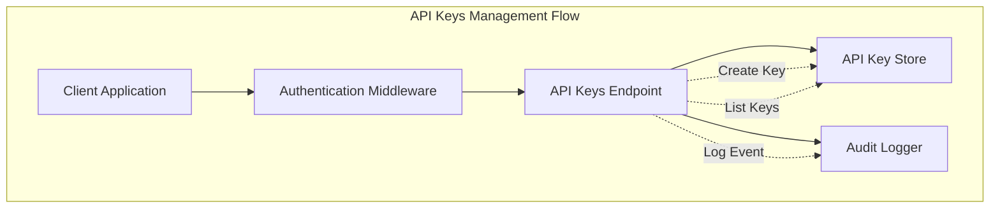
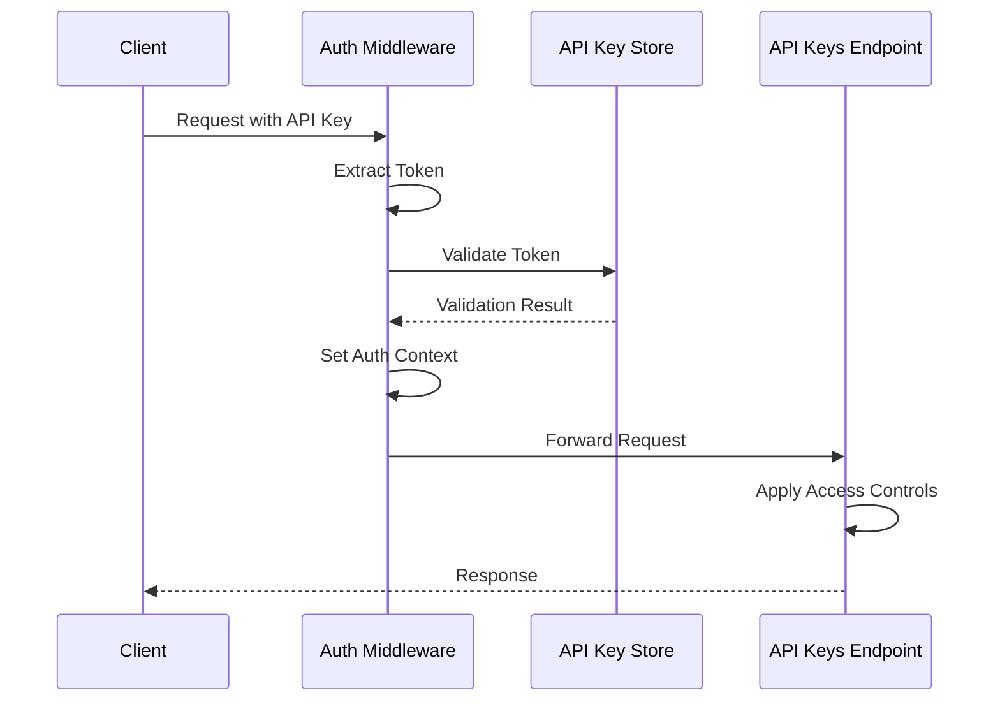
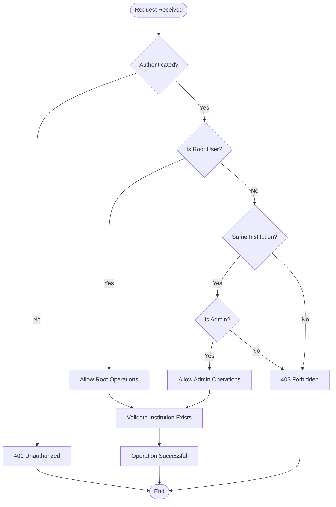
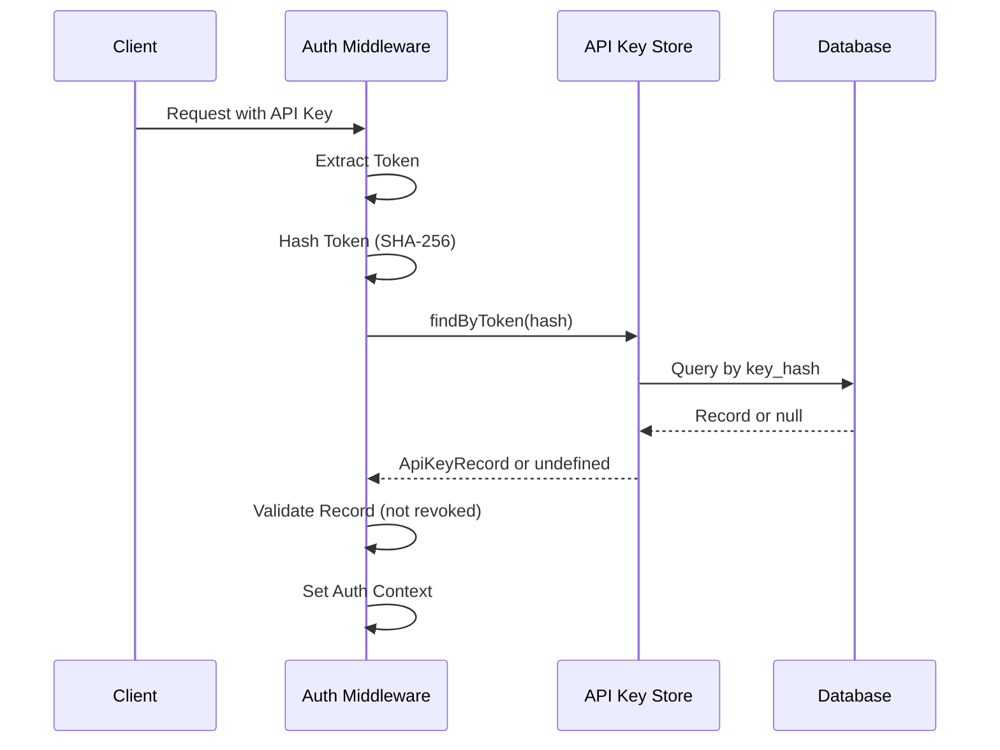
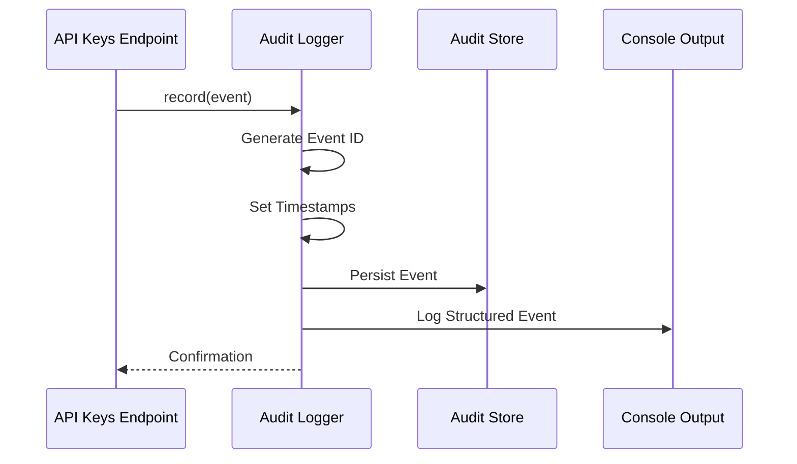
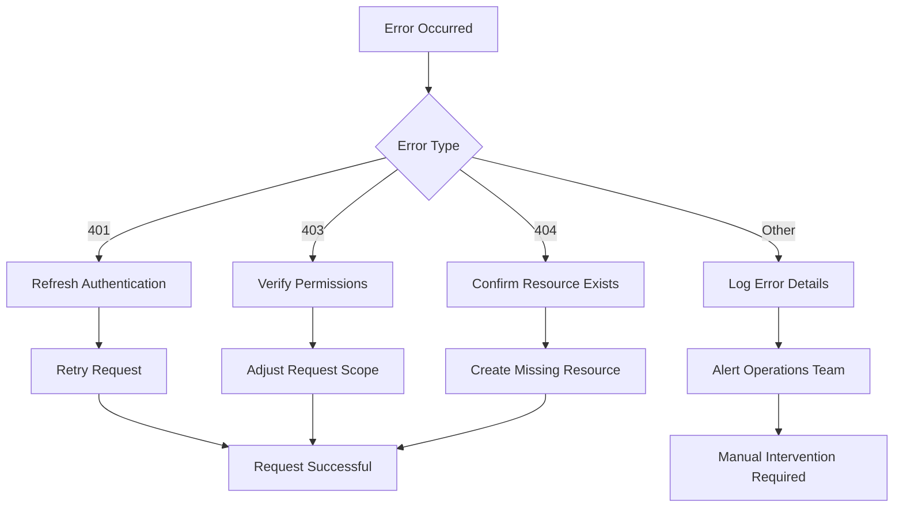

# API Keys API

<cite>
**Referenced Files in This Document**
- [src/api/apiKeys.ts](file://src/api/apiKeys.ts)
- [src/infra/apiKeyStore.ts](file://src/infra/apiKeyStore.ts)
- [src/middleware/auth.ts](file://src/middleware/auth.ts)
- [src/domain/types.ts](file://src/domain/types.ts)
- [src/infra/auditLogger.ts](file://src/infra/auditLogger.ts)
- [src/server.ts](file://src/server.ts)
- [src/openapi.ts](file://src/openapi.ts)
</cite>

## Table of Contents
1. [Introduction](#introduction)
2. [API Overview](#api-overview)
3. [Authentication Requirements](#authentication-requirements)
4. [Endpoint Specifications](#endpoint-specifications)
5. [Data Models](#data-models)
6. [Access Control Rules](#access-control-rules)
7. [Security Implementation](#security-implementation)
8. [Audit Logging](#audit-logging)
9. [Integration Examples](#integration-examples)
10. [Error Handling](#error-handling)

## Introduction

The API Keys API provides secure management capabilities for institutional API keys within the EscrowGrid platform. This API enables authorized users to create, list, and manage API keys that grant programmatic access to institutional resources. The system implements robust security controls with role-based access permissions and comprehensive audit logging.

## API Overview

The API Keys API consists of two primary endpoints that handle the complete lifecycle of API keys:

- **POST /institutions/:id/api-keys** - Creates new API keys for an institution
- **GET /institutions/:id/api-keys** - Lists existing API keys for an institution

Both endpoints support both administrative and read-only roles, with appropriate access controls and security measures.



**Diagram sources**
- [src/api/apiKeys.ts](file://src/api/apiKeys.ts#L15-L108)
- [src/middleware/auth.ts](file://src/middleware/auth.ts#L35-L95)
- [src/infra/apiKeyStore.ts](file://src/infra/apiKeyStore.ts#L13-L23)

## Authentication Requirements

All API Keys endpoints require authentication through API keys. The system supports multiple authentication mechanisms:

### Supported Authentication Methods

1. **X-API-KEY Header**: Direct API key header
2. **Authorization Bearer Token**: Standard Bearer token format

### Authentication Flow



**Diagram sources**
- [src/middleware/auth.ts](file://src/middleware/auth.ts#L35-L95)

**Section sources**
- [src/middleware/auth.ts](file://src/middleware/auth.ts#L23-L33)
- [src/middleware/auth.ts](file://src/middleware/auth.ts#L58-L76)

## Endpoint Specifications

### POST /institutions/:id/api-keys

Creates a new API key for the specified institution with configurable roles and labels.

#### HTTP Method & Path
- **Method**: `POST`
- **Path**: `/institutions/:id/api-keys`

#### Request Parameters

| Parameter | Type | Location | Required | Description |
|-----------|------|----------|----------|-------------|
| `id` | string | Path | Yes | Institution identifier |

#### Request Body Schema

```typescript
interface CreateApiKeyBody {
  label?: string;           // Optional: Key label (default: 'default')
  role?: ApiKeyRole;        // Optional: Key role ('admin' or 'read_only', default: 'admin')
}
```

#### Response Schema

**Success Response (201 Created)**:
```typescript
interface ApiKeyCreated {
  id: string;               // Unique key identifier
  institutionId: string;    // Associated institution ID
  label: string;            // Key label
  role: ApiKeyRole;         // Key role
  createdAt: string;        // Creation timestamp (ISO 8601)
  apiKey: string;           // Actual API key token (returned only on creation)
}
```

#### Security-Sensitive Response

The response includes the actual API key token only during creation. Subsequent requests will not expose the secret token for security reasons.

#### Example Request
```bash
curl -X POST https://api.escrowgrid.io/institutions/inst_123/api-keys \
  -H "Content-Type: application/json" \
  -H "X-API-KEY: root_api_key_here" \
  -d '{
    "label": "Trading Bot v1",
    "role": "admin"
  }'
```

#### Example Response
```json
{
  "id": "ak_abc123def456",
  "institutionId": "inst_123",
  "label": "Trading Bot v1",
  "role": "admin",
  "createdAt": "2024-01-15T10:30:00.000Z",
  "apiKey": "ak_5f4dcc3b5aa765d61d8327deb882cf99"
}
```

### GET /institutions/:id/api-keys

Lists all active API keys for the specified institution.

#### HTTP Method & Path
- **Method**: `GET`
- **Path**: `/institutions/:id/api-keys`

#### Request Parameters

| Parameter | Type | Location | Required | Description |
|-----------|------|----------|----------|-------------|
| `id` | string | Path | Yes | Institution identifier |

#### Response Schema

**Success Response (200 OK)**:
```typescript
interface ApiKeyPublic[] {
  id: string;               // Unique key identifier
  institutionId: string;    // Associated institution ID
  label: string;            // Key label
  role: ApiKeyRole;         // Key role
  createdAt: string;        // Creation timestamp (ISO 8601)
  revokedAt?: string;       // Revocation timestamp if revoked
}
```

#### Example Request
```bash
curl -X GET https://api.escrowgrid.io/institutions/inst_123/api-keys \
  -H "X-API-KEY: inst_admin_api_key_here"
```

#### Example Response
```json
[
  {
    "id": "ak_abc123def456",
    "institutionId": "inst_123",
    "label": "Trading Bot v1",
    "role": "admin",
    "createdAt": "2024-01-15T10:30:00.000Z"
  },
  {
    "id": "ak_xyz789uvw012",
    "institutionId": "inst_123",
    "label": "Monitoring Service",
    "role": "read_only",
    "createdAt": "2024-01-16T08:15:00.000Z",
    "revokedAt": "2024-01-20T14:00:00.000Z"
  }
]
```

**Section sources**
- [src/api/apiKeys.ts](file://src/api/apiKeys.ts#L15-L108)

## Data Models

### ApiKey Role Types

The API supports two distinct roles with different permission levels:

| Role | Permissions | Description |
|------|-------------|-------------|
| `admin` | Full CRUD operations | Complete access to institutional resources |
| `read_only` | Read-only access | View-only access to institutional resources |

### ApiKey Record Structure

```typescript
interface ApiKey {
  id: string;               // Unique key identifier
  institutionId: string;    // Associated institution ID
  keyHash: string;          // SHA-256 hash of the API key token
  label: string;            // Human-readable key label
  role: ApiKeyRole;         // Key role assignment
  createdAt: string;        // Creation timestamp (ISO 8601)
  revokedAt?: string;       // Revocation timestamp if revoked
}
```

### Storage Implementation

The system supports multiple storage backends:

#### In-Memory Storage
- **Use Case**: Development and testing environments
- **Features**: Fast access, ephemeral data
- **Implementation**: `InMemoryApiKeyStore`

#### PostgreSQL Storage  
- **Use Case**: Production environments
- **Features**: Persistent storage, ACID compliance
- **Implementation**: `PostgresApiKeyStore`

**Section sources**
- [src/domain/types.ts](file://src/domain/types.ts#L70-L78)
- [src/infra/apiKeyStore.ts](file://src/infra/apiKeyStore.ts#L13-L23)

## Access Control Rules

The API implements strict access control based on user roles and institutional relationships:

### Authorization Matrix

| Caller Role | Target Institution | Action | Permission |
|-------------|-------------------|--------|------------|
| Root | Any | Create API Key | ✅ Allowed |
| Root | Any | List API Keys | ✅ Allowed |
| Institution Admin | Same Institution | Create API Key | ✅ Allowed |
| Institution Admin | Same Institution | List API Keys | ✅ Allowed |
| Institution Admin | Other Institution | Create API Key | ❌ Forbidden |
| Institution Admin | Other Institution | List API Keys | ❌ Forbidden |
| Regular User | Any | Create API Key | ❌ Forbidden |
| Regular User | Any | List API Keys | ❌ Forbidden |

### Access Control Flow



**Diagram sources**
- [src/api/apiKeys.ts](file://src/api/apiKeys.ts#L25-L30)
- [src/api/apiKeys.ts](file://src/api/apiKeys.ts#L82-L87)

### Implementation Details

Access control is enforced through middleware that validates:
1. **Authentication**: Valid API key present
2. **Authorization**: Proper role and institutional relationship
3. **Resource Existence**: Target institution exists

**Section sources**
- [src/api/apiKeys.ts](file://src/api/apiKeys.ts#L25-L30)
- [src/api/apiKeys.ts](file://src/api/apiKeys.ts#L82-L87)

## Security Implementation

### Token Generation

API keys are generated using cryptographically secure random token generation:

#### Token Format
- **Prefix**: `ak_`
- **Entropy**: 24 bytes of cryptographically secure random data
- **Encoding**: Hexadecimal representation
- **Example**: `ak_5f4dcc3b5aa765d61d8327deb882cf99`

#### Hashing Implementation
- **Algorithm**: SHA-256
- **Purpose**: Secure storage and comparison without exposing plaintext tokens
- **Storage**: Only hashed tokens are stored in the database

### Token Validation



**Diagram sources**
- [src/infra/apiKeyStore.ts](file://src/infra/apiKeyStore.ts#L68-L79)
- [src/middleware/auth.ts](file://src/middleware/auth.ts#L63-L76)

### Security Measures

1. **Token Exposure Prevention**: API keys are only returned during creation
2. **Hash-Based Storage**: Plaintext tokens never stored in databases
3. **Revocation Support**: Ability to revoke keys without removing from system
4. **Rate Limiting**: Built-in rate limiting prevents brute force attacks
5. **HTTPS Only**: All communications encrypted in transit

**Section sources**
- [src/infra/apiKeyStore.ts](file://src/infra/apiKeyStore.ts#L33-L39)
- [src/infra/apiKeyStore.ts](file://src/infra/apiKeyStore.ts#L68-L79)

## Audit Logging

The API integrates with a comprehensive audit logging system that tracks all API key operations:

### Audit Events

#### API_KEY_CREATED Event
Triggered when a new API key is created:

```typescript
interface AuditEventInput {
  action: 'API_KEY_CREATED';
  method: string;           // HTTP method used
  path: string;             // Request path
  resourceType: 'api_key';  // Resource type
  resourceId: string;       // New key ID
  payload: {
    institutionId: string;  // Target institution
    label: string;          // Key label
    role: ApiKeyRole;       // Key role
  };
  auth: AuthContext;        // Authentication context
}
```

### Audit Logging Flow



**Diagram sources**
- [src/api/apiKeys.ts](file://src/api/apiKeys.ts#L47-L59)
- [src/infra/auditLogger.ts](file://src/infra/auditLogger.ts#L20-L44)

### Audit Event Structure

Each audit event includes comprehensive metadata for security monitoring:

| Field | Description | Example |
|-------|-------------|---------|
| `id` | Unique event identifier | `aud_abc123def456` |
| `occurredAt` | Event timestamp | `2024-01-15T10:30:00.000Z` |
| `method` | HTTP method | `POST` |
| `path` | Request path | `/institutions/inst_123/api-keys` |
| `action` | Event action | `API_KEY_CREATED` |
| `resourceType` | Resource type | `api_key` |
| `resourceId` | Resource identifier | `ak_abc123def456` |
| `institutionId` | Associated institution | `inst_123` |
| `apiKeyId` | Authenticating API key | `ak_root123` |

**Section sources**
- [src/api/apiKeys.ts](file://src/api/apiKeys.ts#L47-L59)
- [src/infra/auditLogger.ts](file://src/infra/auditLogger.ts#L20-L44)

## Integration Examples

### Creating a New API Key

#### cURL Example
```bash
# Create admin API key
curl -X POST https://api.escrowgrid.io/institutions/inst_123/api-keys \
  -H "Content-Type: application/json" \
  -H "X-API-KEY: root_or_admin_api_key_here" \
  -d '{
    "label": "Trading Bot v1",
    "role": "admin"
  }'

# Create read-only API key
curl -X POST https://api.escrowgrid.io/institutions/inst_123/api-keys \
  -H "Content-Type: application/json" \
  -H "X-API-KEY: root_or_admin_api_key_here" \
  -d '{
    "label": "Monitoring Service",
    "role": "read_only"
  }'
```

#### JavaScript Example
```javascript
async function createApiKey(institutionId, label, role = 'admin') {
  const response = await fetch(`/institutions/${institutionId}/api-keys`, {
    method: 'POST',
    headers: {
      'Content-Type': 'application/json',
      'X-API-KEY': process.env.API_KEY
    },
    body: JSON.stringify({ label, role })
  });
  
  if (!response.ok) {
    throw new Error(`Failed to create API key: ${response.statusText}`);
  }
  
  const data = await response.json();
  console.log('Created API key:', data.apiKey); // Store securely!
  return data;
}
```

### Listing API Keys

#### cURL Example
```bash
curl -X GET https://api.escrowgrid.io/institutions/inst_123/api-keys \
  -H "X-API-KEY: root_or_admin_api_key_here"
```

#### JavaScript Example
```javascript
async function listApiKeys(institutionId) {
  const response = await fetch(`/institutions/${institutionId}/api-keys`, {
    headers: {
      'X-API-KEY': process.env.API_KEY
    }
  });
  
  if (!response.ok) {
    throw new Error(`Failed to list API keys: ${response.statusText}`);
  }
  
  return await response.json();
}
```

### Using API Keys for Authentication

#### Making Requests with API Keys
```javascript
async function makeAuthenticatedRequest(url, options = {}) {
  const response = await fetch(url, {
    ...options,
    headers: {
      ...options.headers,
      'X-API-KEY': process.env.API_KEY
    }
  });
  
  if (response.status === 401) {
    throw new Error('Authentication failed - invalid or expired API key');
  }
  
  if (response.status === 403) {
    throw new Error('Access denied - insufficient permissions');
  }
  
  return response;
}
```

## Error Handling

### Common Error Responses

#### 401 Unauthorized
```json
{
  "error": "Unauthenticated",
  "details": "Missing or invalid API key"
}
```

#### 403 Forbidden
```json
{
  "error": "Forbidden to create/list API keys for this institution",
  "details": "Insufficient permissions or unauthorized access"
}
```

#### 404 Not Found
```json
{
  "error": "Institution not found",
  "details": "The specified institution ID does not exist"
}
```

#### 400 Bad Request
```json
{
  "error": "Invalid request body",
  "details": "Validation failed for provided parameters"
}
```

### Error Handling Best Practices

1. **Secure Error Messages**: Never expose sensitive information in error responses
2. **Consistent Status Codes**: Use standard HTTP status codes for different error types
3. **Descriptive Messages**: Provide helpful error messages for debugging
4. **Logging**: All errors are logged for security monitoring
5. **Rate Limiting**: Prevent abuse through automatic rate limiting

### Error Recovery Strategies



**Section sources**
- [src/api/apiKeys.ts](file://src/api/apiKeys.ts#L21-L30)
- [src/api/apiKeys.ts](file://src/api/apiKeys.ts#L78-L87)
- [src/api/apiKeys.ts](file://src/api/apiKeys.ts#L90-L93)