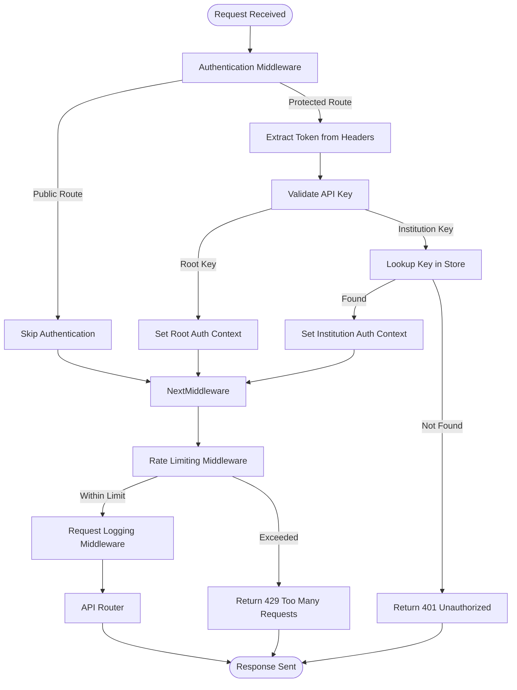
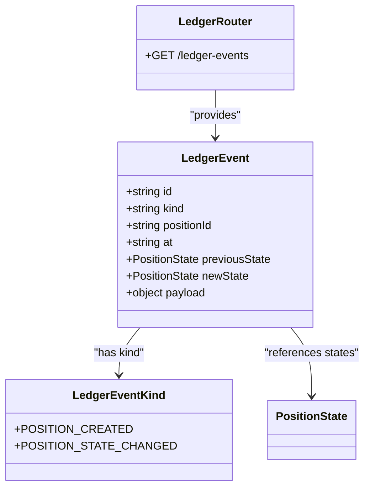
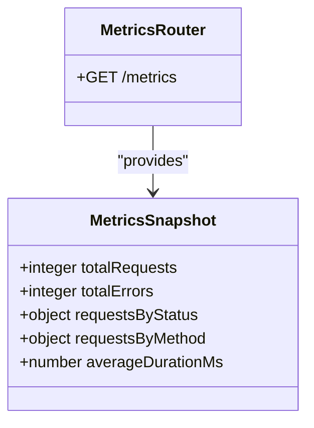
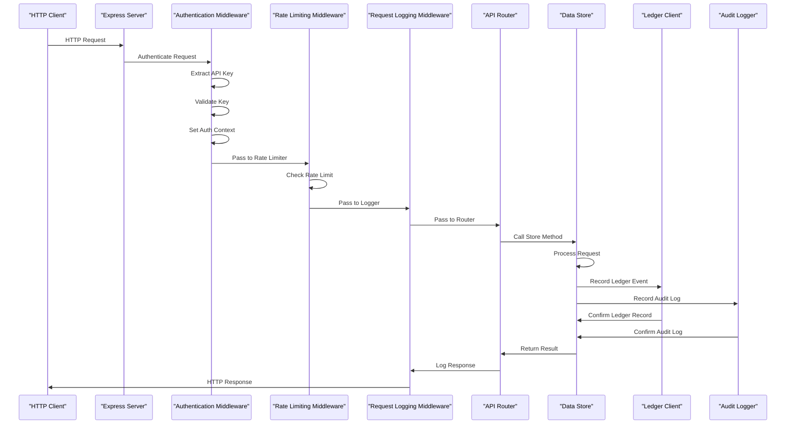
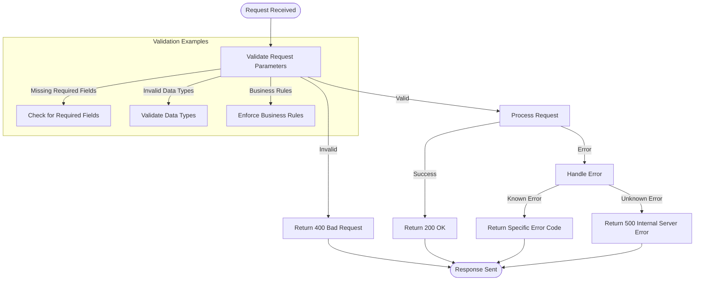
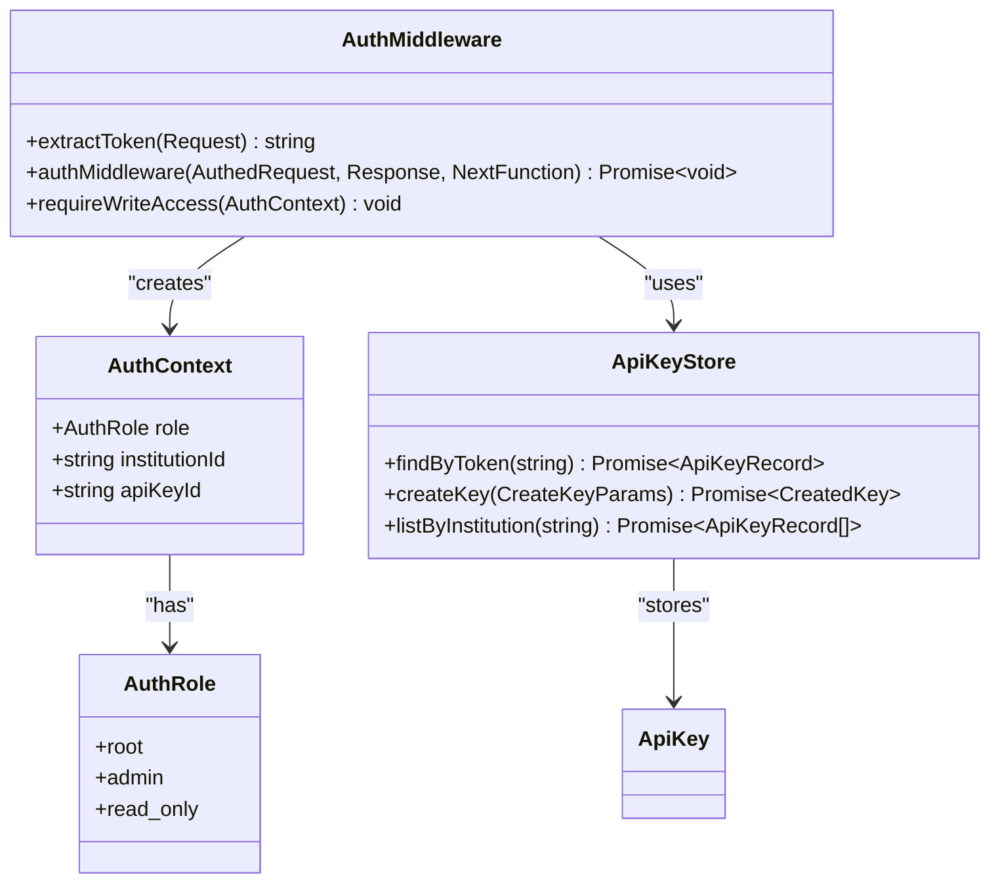
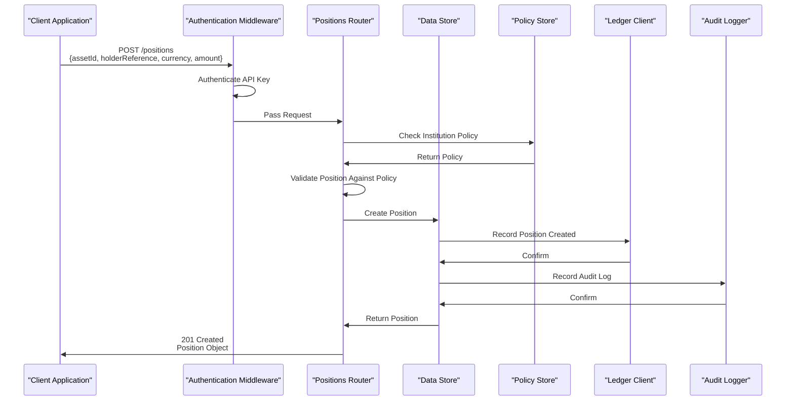
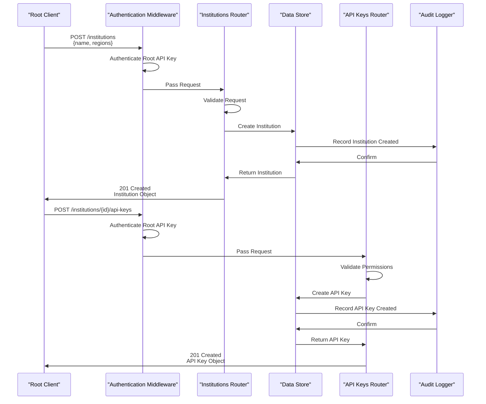

# API Layer

<cite>
**Referenced Files in This Document**   
- [server.ts](file://src/server.ts)
- [openapi.ts](file://src/openapi.ts)
- [auth.ts](file://src/middleware/auth.ts)
- [institutions.ts](file://src/api/institutions.ts)
- [assets.ts](file://src/api/assets.ts)
- [positions.ts](file://src/api/positions.ts)
- [policies.ts](file://src/api/policies.ts)
- [ledger.ts](file://src/api/ledger.ts)
- [apiKeys.ts](file://src/api/apiKeys.ts)
- [metrics.ts](file://src/api/metrics.ts)
- [assetTemplates.ts](file://src/api/assetTemplates.ts)
- [types.ts](file://src/domain/types.ts)
- [requestLogger.ts](file://src/middleware/requestLogger.ts)
- [rateLimit.ts](file://src/middleware/rateLimit.ts)
</cite>

## Table of Contents
1. [Introduction](#introduction)
2. [API Architecture Overview](#api-architecture-overview)
3. [Middleware Integration](#middleware-integration)
4. [Router Endpoints and Functionality](#router-endpoints-and-functionality)
5. [Data Flow and Processing](#data-flow-and-processing)
6. [Error Handling and Validation](#error-handling-and-validation)
7. [Authentication and Authorization](#authentication-and-authorization)
8. [OpenAPI Documentation](#openapi-documentation)
9. [Practical Usage Examples](#practical-usage-examples)
10. [Conclusion](#conclusion)

## Introduction

The API layer of escrowgrid serves as the primary interface for institutions to manage tokenization-as-a-service (TAAS) infrastructure for escrowable real-world assets. This layer handles HTTP requests and responses, routing, and integrates with middleware and domain logic to provide a secure and scalable platform. The API exposes endpoints for managing institutions, API keys, asset templates, assets, positions, policies, and ledgers.

Authentication is performed via API keys, with most endpoints requiring either an `X-API-KEY` header or `Authorization: Bearer <token>` header. Only health, readiness, and documentation endpoints are publicly accessible. The API follows RESTful principles and provides comprehensive OpenAPI/Swagger documentation for easy integration and testing.

**Section sources**
- [server.ts](file://src/server.ts#L1-L100)
- [openapi.ts](file://src/openapi.ts#L1-L1038)

## API Architecture Overview

The escrowgrid API architecture is built on Express.js and follows a modular router pattern. The main server file (`server.ts`) sets up the Express application, configures middleware, and mounts individual routers for different resource types. The architecture is designed to be extensible, with clear separation of concerns between routing, business logic, and data storage.

```mermaid
graph TB
Client[HTTP Client] --> Server[Express Server]
Server --> Auth[Authentication Middleware]
Server --> RateLimit[Rate Limiting Middleware]
Server --> Logger[Request Logging Middleware]
Server --> Routers[API Routers]
Routers --> BusinessLogic[Domain Logic]
BusinessLogic --> Store[Data Store]
Store --> Postgres[(PostgreSQL)]
Store --> Memory[(In-Memory)]
subgraph "API Routers"
InstitutionsRouter[/institutions]
AssetsRouter[/assets]
PositionsRouter[/positions]
PoliciesRouter[/policies]
LedgerRouter[/ledger-events]
ApiKeysRouter[/api-keys]
MetricsRouter[/metrics]
TemplatesRouter[/asset-templates]
end
subgraph "Middleware"
Auth
RateLimit
Logger
end
```

**Diagram sources**
- [server.ts](file://src/server.ts#L1-L100)
- [middleware/auth.ts](file://src/middleware/auth.ts#L1-L95)
- [middleware/rateLimit.ts](file://src/middleware/rateLimit.ts#L1-L67)
- [middleware/requestLogger.ts](file://src/middleware/requestLogger.ts#L1-L29)

**Section sources**
- [server.ts](file://src/server.ts#L1-L100)
- [openapi.ts](file://src/openapi.ts#L1-L1038)

## Middleware Integration

The escrowgrid API layer integrates several middleware components to handle cross-cutting concerns such as authentication, rate limiting, and request logging. These middleware functions are executed in sequence for each incoming request, providing a consistent and secure processing pipeline.

The authentication middleware (`auth.ts`) validates API keys and establishes the authentication context for each request. It checks for the presence of an API key in either the `X-API-KEY` header or the `Authorization: Bearer <token>` header. For certain public endpoints like `/health`, `/ready`, and documentation routes, authentication is bypassed.



**Diagram sources**
- [middleware/auth.ts](file://src/middleware/auth.ts#L1-L95)
- [middleware/rateLimit.ts](file://src/middleware/rateLimit.ts#L1-L67)
- [middleware/requestLogger.ts](file://src/middleware/requestLogger.ts#L1-L29)

**Section sources**
- [middleware/auth.ts](file://src/middleware/auth.ts#L1-L95)
- [middleware/rateLimit.ts](file://src/middleware/rateLimit.ts#L1-L67)
- [middleware/requestLogger.ts](file://src/middleware/requestLogger.ts#L1-L29)

## Router Endpoints and Functionality

The escrowgrid API is organized into several routers, each responsible for a specific domain entity. These routers are mounted on the Express application in `server.ts` and provide RESTful endpoints for CRUD operations and specialized functionality.

### Institutions Router

The institutions router handles operations related to financial institutions within the escrowgrid ecosystem. It provides endpoints for creating, retrieving, and listing institutions.

```mermaid
classDiagram
class InstitutionsRouter {
+POST /institutions
+GET /institutions
+GET /institutions/{id}
+POST /institutions/{id}/api-keys
+GET /institutions/{id}/api-keys
}
class Institution {
+string id
+string name
+Region[] regions
+Vertical[] verticals
+string createdAt
+string updatedAt
}
class ApiKey {
+string id
+string institutionId
+string label
+ApiKeyRole role
+string createdAt
+string revokedAt
}
InstitutionsRouter --> Institution : "creates"
InstitutionsRouter --> ApiKey : "manages"
```

**Diagram sources**
- [api/institutions.ts](file://src/api/institutions.ts#L1-L115)
- [domain/types.ts](file://src/domain/types.ts#L7-L14)

**Section sources**
- [api/institutions.ts](file://src/api/institutions.ts#L1-L115)

### Assets Router

The assets router manages asset resources, which represent tokenized real-world assets within the system. It provides endpoints for creating, retrieving, and listing assets.

```mermaid
classDiagram
class AssetsRouter {
+POST /assets
+GET /assets
+GET /assets/{id}
}
class Asset {
+string id
+string institutionId
+string templateId
+string label
+object metadata
+string createdAt
+string updatedAt
}
class AssetTemplate {
+string id
+string institutionId
+string code
+string name
+Vertical vertical
+Region region
+object config
+string createdAt
+string updatedAt
}
AssetsRouter --> Asset : "creates"
Asset --> AssetTemplate : "references"
```

**Diagram sources**
- [api/assets.ts](file://src/api/assets.ts#L1-L147)
- [domain/types.ts](file://src/domain/types.ts#L28-L36)

**Section sources**
- [api/assets.ts](file://src/api/assets.ts#L1-L147)

### Positions Router

The positions router handles escrow positions, which represent funds held in escrow for specific assets. It provides endpoints for creating, retrieving, and transitioning positions through their lifecycle.

```mermaid
classDiagram
class PositionsRouter {
+POST /positions
+GET /positions
+GET /positions/{id}
+POST /positions/{id}/transition
}
class Position {
+string id
+string institutionId
+string assetId
+string holderReference
+string currency
+number amount
+PositionState state
+string externalReference
+string createdAt
+string updatedAt
+PositionLifecycleEvent[] events
}
class PositionLifecycleEvent {
+string id
+string positionId
+PositionState fromState
+PositionState toState
+string reason
+string at
+object metadata
}
class PositionState {
+CREATED
+FUNDED
+PARTIALLY_RELEASED
+RELEASED
+CANCELLED
+EXPIRED
}
PositionsRouter --> Position : "creates"
Position --> PositionLifecycleEvent : "contains"
Position --> PositionState : "has state"
```

**Diagram sources**
- [api/positions.ts](file://src/api/positions.ts#L1-L298)
- [domain/types.ts](file://src/domain/types.ts#L56-L68)

**Section sources**
- [api/positions.ts](file://src/api/positions.ts#L1-L298)

### Policies Router

The policies router manages institution-specific policies that govern the creation and management of positions. These policies enforce business rules based on region and institution.

```mermaid
classDiagram
class PoliciesRouter {
+GET /institutions/{id}/policies
+GET /institutions/{id}/policies/{region}
+PUT /institutions/{id}/policies/{region}
}
class InstitutionPolicy {
+string id
+string institutionId
+Region region
+PolicyConfig config
+string createdAt
+string updatedAt
}
class PolicyConfig {
+Region region
+PositionPolicy position
}
class PositionPolicy {
+number minAmount
+number maxAmount
+string[] allowedCurrencies
}
PoliciesRouter --> InstitutionPolicy : "manages"
InstitutionPolicy --> PolicyConfig : "has"
PolicyConfig --> PositionPolicy : "contains"
```

**Diagram sources**
- [api/policies.ts](file://src/api/policies.ts#L1-L180)
- [domain/types.ts](file://src/domain/types.ts#L211-L222)

**Section sources**
- [api/policies.ts](file://src/api/policies.ts#L1-L180)

### Ledger Router

The ledger router provides access to the immutable ledger of events that track changes to positions and other resources. This serves as an audit trail for all significant operations within the system.



**Diagram sources**
- [api/ledger.ts](file://src/api/ledger.ts#L1-L43)
- [domain/types.ts](file://src/domain/types.ts#L223-L238)

**Section sources**
- [api/ledger.ts](file://src/api/ledger.ts#L1-L43)

### API Keys Router

The API keys router manages API key creation and listing for institutions. API keys are used for authentication and can have different roles with varying levels of access.

```mermaid
classDiagram
class ApiKeysRouter {
+POST /institutions/{id}/api-keys
+GET /institutions/{id}/api-keys
}
class ApiKey {
+string id
+string institutionId
+string keyHash
+string label
+ApiKeyRole role
+string createdAt
+string revokedAt
}
class ApiKeyRole {
+admin
+read_only
}
ApiKeysRouter --> ApiKey : "manages"
ApiKey --> ApiKeyRole : "has role"
```

**Diagram sources**
- [api/apiKeys.ts](file://src/api/apiKeys.ts#L1-L110)
- [domain/types.ts](file://src/domain/types.ts#L70-L78)

**Section sources**
- [api/apiKeys.ts](file://src/api/apiKeys.ts#L1-L110)

### Metrics Router

The metrics router provides access to request metrics for monitoring and observability. This endpoint is restricted to root access only.



**Diagram sources**
- [api/metrics.ts](file://src/api/metrics.ts#L1-L18)
- [domain/types.ts](file://src/domain/types.ts#L239-L255)

**Section sources**
- [api/metrics.ts](file://src/api/metrics.ts#L1-L18)

### Asset Templates Router

The asset templates router manages templates that define the structure and configuration of assets. These templates are used as blueprints for creating actual assets.

```mermaid
classDiagram
class AssetTemplatesRouter {
+POST /asset-templates
+GET /asset-templates
+GET /asset-templates/{id}
}
class AssetTemplate {
+string id
+string institutionId
+string code
+string name
+Vertical vertical
+Region region
+object config
+string createdAt
+string updatedAt
}
AssetTemplatesRouter --> AssetTemplate : "manages"
```

**Diagram sources**
- [api/assetTemplates.ts](file://src/api/assetTemplates.ts#L1-L147)
- [domain/types.ts](file://src/domain/types.ts#L16-L26)

**Section sources**
- [api/assetTemplates.ts](file://src/api/assetTemplates.ts#L1-L147)

## Data Flow and Processing

The data flow in the escrowgrid API layer follows a consistent pattern from incoming request to response. Each request passes through the middleware pipeline before reaching the appropriate router and business logic.



**Diagram sources**
- [server.ts](file://src/server.ts#L1-L100)
- [middleware/auth.ts](file://src/middleware/auth.ts#L1-L95)
- [middleware/rateLimit.ts](file://src/middleware/rateLimit.ts#L1-L67)
- [middleware/requestLogger.ts](file://src/middleware/requestLogger.ts#L1-L29)
- [api/positions.ts](file://src/api/positions.ts#L1-L298)

**Section sources**
- [server.ts](file://src/server.ts#L1-L100)
- [middleware/auth.ts](file://src/middleware/auth.ts#L1-L95)
- [middleware/rateLimit.ts](file://src/middleware/rateLimit.ts#L1-L67)
- [middleware/requestLogger.ts](file://src/middleware/requestLogger.ts#L1-L29)

## Error Handling and Validation

The escrowgrid API implements comprehensive error handling and validation strategies to ensure robust and predictable behavior. Each endpoint validates input parameters and handles errors gracefully, returning appropriate HTTP status codes and error payloads.

The API uses a consistent error response format defined by the `ApiErrorPayload` interface, which includes an error message and optional details. This standardization makes it easier for clients to handle errors programmatically.



**Diagram sources**
- [openapi.ts](file://src/openapi.ts#L256-L263)
- [domain/types.ts](file://src/domain/types.ts#L80-L83)
- [api/positions.ts](file://src/api/positions.ts#L37-L52)

**Section sources**
- [openapi.ts](file://src/openapi.ts#L256-L263)
- [domain/types.ts](file://src/domain/types.ts#L80-L83)
- [api/positions.ts](file://src/api/positions.ts#L37-L52)

## Authentication and Authorization

The escrowgrid API implements a robust authentication and authorization system based on API keys. The system supports different roles with varying levels of access, ensuring that sensitive operations are protected.

The authentication middleware establishes an authentication context for each request, which includes the role, institution ID, and API key ID. This context is then used by individual routers to enforce authorization rules.



**Diagram sources**
- [middleware/auth.ts](file://src/middleware/auth.ts#L1-L95)
- [domain/types.ts](file://src/domain/types.ts#L6-L7)
- [infra/apiKeyStore.ts](file://src/infra/apiKeyStore.ts)

**Section sources**
- [middleware/auth.ts](file://src/middleware/auth.ts#L1-L95)

## OpenAPI Documentation

The escrowgrid API includes comprehensive OpenAPI/Swagger documentation generated from the `openapi.ts` file. This documentation is automatically served at `/openapi.json` and provides an interactive API explorer at `/docs`.

The OpenAPI specification is hand-authored to stay in sync with the actual Express routes and domain types. It includes detailed descriptions of all endpoints, request/response schemas, authentication requirements, and error responses.

```mermaid
graph TB
OpenAPI[openapi.ts] --> Specification[OpenAPI 3.0 Specification]
Specification --> JSONEndpoint[/openapi.json]
Specification --> SwaggerUI[Swagger UI]
SwaggerUI --> DocsEndpoint[/docs]
Specification --> Redoc[ReDoc]
Redoc --> RedocEndpoint[/docs/redoc]
Client1[API Client] --> JSONEndpoint
Client2[Developer] --> DocsEndpoint
Client3[Developer] --> RedocEndpoint
subgraph "Documentation Features"
Specification --> Security[Security Schemes]
Specification --> Schemas[Data Schemas]
Specification --> Paths[Endpoint Paths]
Specification --> Servers[Server URLs]
end
```

**Diagram sources**
- [openapi.ts](file://src/openapi.ts#L1-L1038)
- [server.ts](file://src/server.ts#L40-L77)

**Section sources**
- [openapi.ts](file://src/openapi.ts#L1-L1038)

## Practical Usage Examples

The escrowgrid API provides several practical examples of usage patterns for common operations. These examples demonstrate how to create positions, manage institutions, and interact with other resources.

### Position Creation Example

Creating a position involves making a POST request to the `/positions` endpoint with the required parameters. The API validates the request against institution policies before creating the position.



**Diagram sources**
- [api/positions.ts](file://src/api/positions.ts#L22-L145)
- [api/policies.ts](file://src/api/policies.ts#L91-L118)
- [infra/policyStore.ts](file://src/infra/policyStore.ts)

**Section sources**
- [api/positions.ts](file://src/api/positions.ts#L22-L145)

### Institution Management Example

Managing institutions involves creating new institutions and API keys for them. This is typically performed by root users with administrative privileges.



**Diagram sources**
- [api/institutions.ts](file://src/api/institutions.ts#L9-L67)
- [api/apiKeys.ts](file://src/api/apiKeys.ts#L15-L70)
- [infra/auditLogger.ts](file://src/infra/auditLogger.ts)

**Section sources**
- [api/institutions.ts](file://src/api/institutions.ts#L9-L67)
- [api/apiKeys.ts](file://src/api/apiKeys.ts#L15-L70)

## Conclusion

The API layer of escrowgrid provides a comprehensive and secure interface for managing tokenization-as-a-service infrastructure. It follows RESTful principles and implements robust authentication, authorization, and error handling mechanisms. The modular router architecture allows for clear separation of concerns and easy extensibility.

The integration with middleware components ensures consistent handling of cross-cutting concerns such as authentication, rate limiting, and request logging. The comprehensive OpenAPI documentation makes it easy for developers to understand and integrate with the API.

The data flow from incoming request to response is well-defined and consistent across all endpoints, ensuring predictable behavior. The validation and error handling strategies provide clear feedback to clients, making it easier to debug and resolve issues.

Overall, the escrowgrid API layer is designed to be reliable, secure, and developer-friendly, providing a solid foundation for building applications that manage escrowable real-world assets.