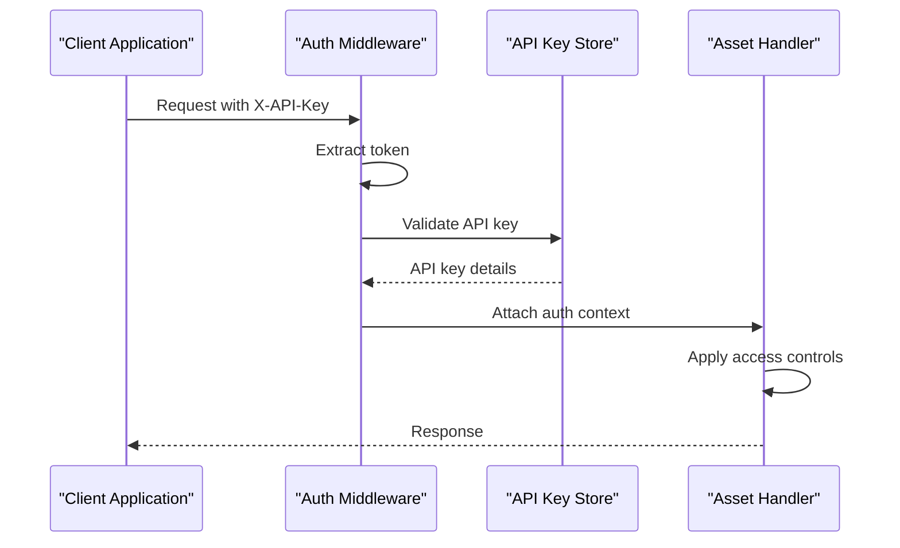
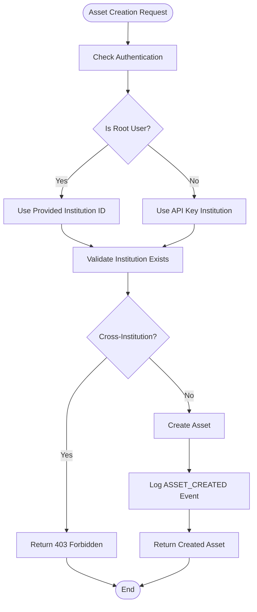
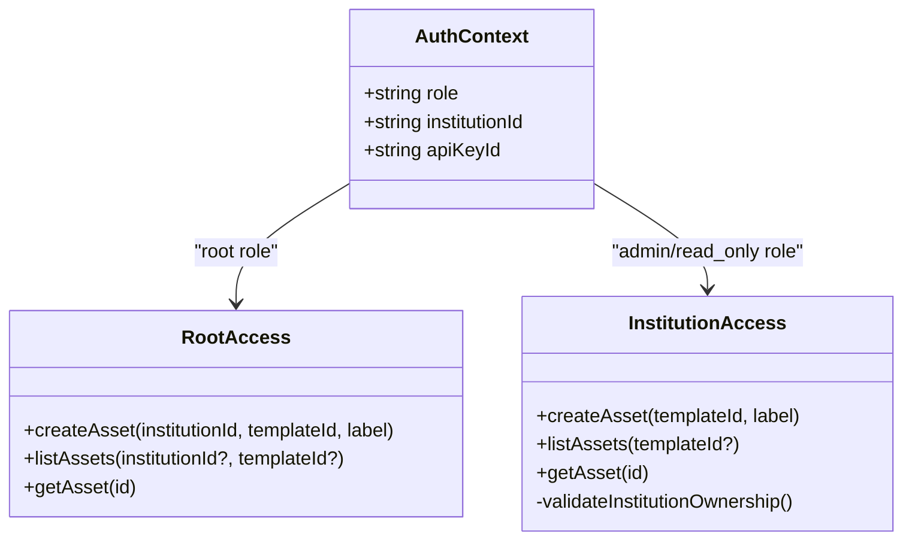
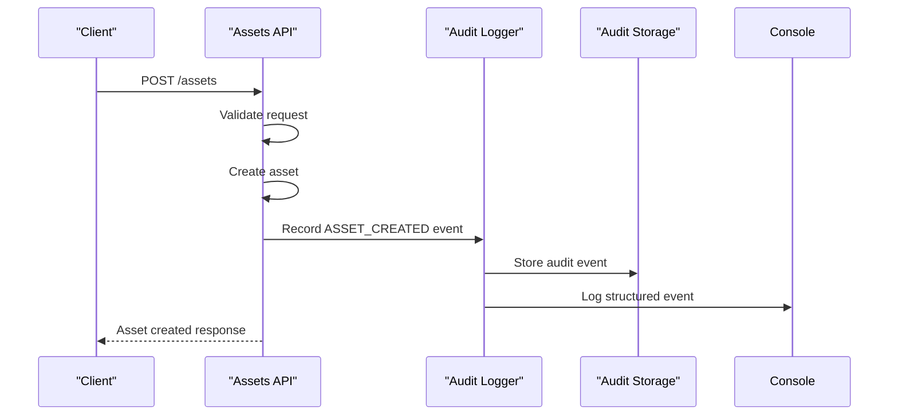
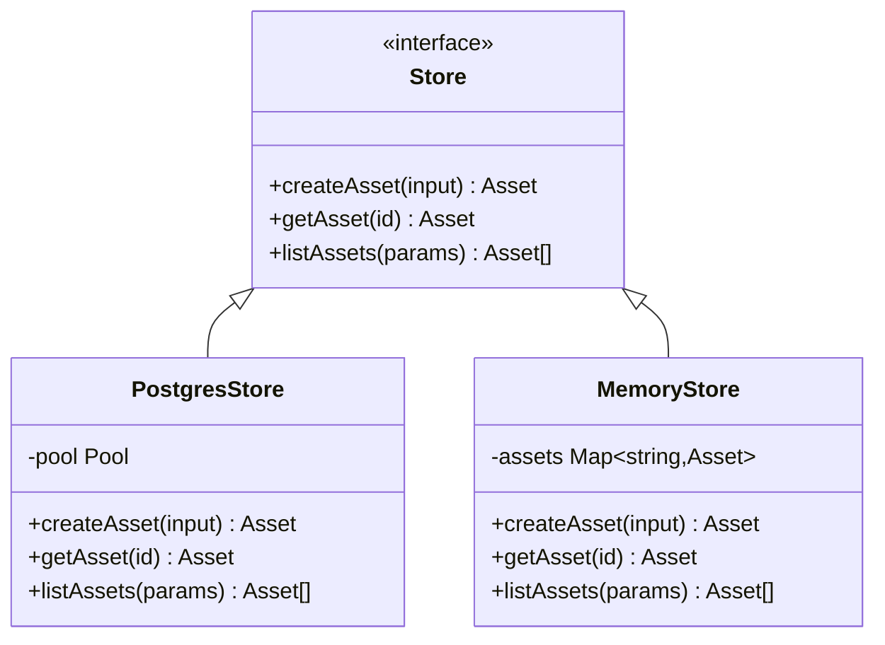
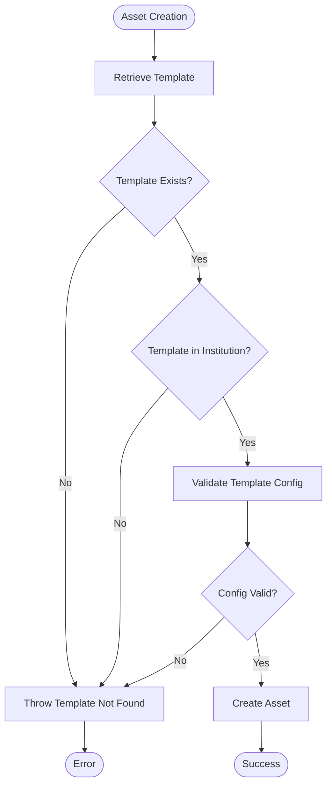

# Assets API

<cite>
**Referenced Files in This Document**
- [src/api/assets.ts](file://src/api/assets.ts)
- [src/domain/types.ts](file://src/domain/types.ts)
- [src/store/store.ts](file://src/store/store.ts)
- [src/store/postgresStore.ts](file://src/store/postgresStore.ts)
- [src/store/memoryStore.ts](file://src/store/memoryStore.ts)
- [src/middleware/auth.ts](file://src/middleware/auth.ts)
- [src/infra/auditLogger.ts](file://src/infra/auditLogger.ts)
- [src/server.ts](file://src/server.ts)
- [src/openapi.ts](file://src/openapi.ts)
</cite>

## Table of Contents
1. [Introduction](#introduction)
2. [API Overview](#api-overview)
3. [Authentication and Authorization](#authentication-and-authorization)
4. [Asset Creation Endpoint](#asset-creation-endpoint)
5. [Asset Listing Endpoint](#asset-listing-endpoint)
6. [Asset Retrieval Endpoint](#asset-retrieval-endpoint)
7. [Access Control Rules](#access-control-rules)
8. [Error Conditions](#error-conditions)
9. [Integration with Audit Logging](#integration-with-audit-logging)
10. [Store Interface Implementation](#store-interface-implementation)
11. [Asset Template Relationship](#asset-template-relationship)
12. [Practical Examples](#practical-examples)

## Introduction

The Assets API provides endpoints for managing digital assets within the EscrowGrid Tokenization-as-a-Service (TAAS) platform. Assets represent escrowable real-world assets that can be tokenized and managed through the platform. The API supports creating, listing, and retrieving assets while enforcing strict access controls and maintaining audit trails.

Assets are always associated with a specific institution and must be created using a valid asset template. The API ensures data integrity through validation rules and provides comprehensive audit logging for all asset-related operations.

## API Overview

The Assets API consists of three primary endpoints:

| Method | Endpoint | Description |
|--------|----------|-------------|
| POST | `/assets` | Create a new asset |
| GET | `/assets` | List assets with optional filtering |
| GET | `/assets/:id` | Retrieve a specific asset by ID |

All endpoints require authentication and implement role-based access control. The API supports both root and institution-level access patterns.

**Section sources**
- [src/api/assets.ts](file://src/api/assets.ts#L17-L146)

## Authentication and Authorization

The Assets API implements a hierarchical authentication system with two distinct access levels:

### Root Access
- **Role**: `root`
- **Scope**: Full system-wide access
- **API Key Requirement**: Configured root API key
- **Capabilities**: Create assets for any institution, bypass institution restrictions

### Institution Access
- **Role**: `admin` or `read_only`
- **Scope**: Access limited to associated institution
- **API Key Requirement**: Institution-specific API key
- **Capabilities**: Create assets within own institution, access own assets

### Authentication Flow



**Diagram sources**
- [src/middleware/auth.ts](file://src/middleware/auth.ts#L35-L82)

**Section sources**
- [src/middleware/auth.ts](file://src/middleware/auth.ts#L1-L95)

## Asset Creation Endpoint

### POST /assets

Creates a new asset within the platform. Requires `write` access permissions.

#### Request Schema

| Field | Type | Required | Description |
|-------|------|----------|-------------|
| `institutionId` | string | No* | Institution ID (root only) |
| `templateId` | string | Yes | Asset template identifier |
| `label` | string | Yes | Human-readable asset label |
| `metadata` | object | No | Arbitrary JSON metadata |

*Required only when using root API key; otherwise derived from API key context.

#### Response Schema

Returns the created asset with all fields populated:

| Field | Type | Description |
|-------|------|-------------|
| `id` | string | Unique asset identifier |
| `institutionId` | string | Associated institution |
| `templateId` | string | Asset template reference |
| `label` | string | Asset label |
| `metadata` | object | Asset metadata |
| `createdAt` | string | Creation timestamp |
| `updatedAt` | string | Last update timestamp |

#### HTTP Status Codes

| Code | Description |
|------|-------------|
| 201 | Asset created successfully |
| 400 | Invalid request body or validation failure |
| 401 | Unauthenticated |
| 403 | Forbidden access |

**Section sources**
- [src/api/assets.ts](file://src/api/assets.ts#L17-L88)

### Institution Context Derivation

The API automatically derives the institution context based on the authentication level:



**Diagram sources**
- [src/api/assets.ts](file://src/api/assets.ts#L40-L60)

## Asset Listing Endpoint

### GET /assets

Retrieves a list of assets with optional filtering capabilities.

#### Query Parameters

| Parameter | Type | Description |
|-----------|------|-------------|
| `institutionId` | string | Filter by institution ID |
| `templateId` | string | Filter by asset template ID |

#### Access Control

- **Root users**: Can list assets across all institutions
- **Institution users**: Can only list assets within their own institution

#### Response Format

Returns an array of asset objects matching the query criteria.

**Section sources**
- [src/api/assets.ts](file://src/api/assets.ts#L91-L122)

## Asset Retrieval Endpoint

### GET /assets/:id

Retrieves a specific asset by its unique identifier.

#### Path Parameters

| Parameter | Type | Description |
|-----------|------|-------------|
| `id` | string | Asset identifier |

#### Access Control

- **Root users**: Can access any asset
- **Institution users**: Can only access assets within their own institution

#### Response Schema

Returns the complete asset object if found, or a 404 error if not found.

**Section sources**
- [src/api/assets.ts](file://src/api/assets.ts#L125-L143)

## Access Control Rules

The Assets API implements a multi-layered access control system:

### Role-Based Permissions



**Diagram sources**
- [src/middleware/auth.ts](file://src/middleware/auth.ts#L8-L12)

### Cross-Institution Restrictions

Non-root users are prohibited from creating assets for different institutions:

- **Root users**: Can specify any `institutionId`
- **Institution users**: Must use their own `institutionId` or omit it (auto-derived)
- **Forbidden**: Institution users attempting to create assets for another institution receive a 403 Forbidden response

**Section sources**
- [src/api/assets.ts](file://src/api/assets.ts#L54-L59)

## Error Conditions

The Assets API handles various error scenarios with appropriate HTTP status codes and detailed error messages:

### Validation Errors

| Error Condition | HTTP Status | Error Message |
|-----------------|-------------|---------------|
| Missing required fields | 400 | "Invalid request body: templateId and label are required" |
| Invalid institution context | 400 | "Invalid institution context: Institution must be specified or derived from API key" |
| Cross-institution access | 403 | "Forbidden: Cannot create assets for a different institution" |

### Resource Errors

| Error Condition | HTTP Status | Error Message |
|-----------------|-------------|---------------|
| Asset not found | 404 | "Asset not found" |
| Unauthorized access | 403 | "Forbidden to access this asset" |

### Authentication Errors

| Error Condition | HTTP Status | Error Message |
|-----------------|-------------|---------------|
| Missing API key | 401 | "Missing API key" |
| Invalid API key | 401 | "Invalid API key" |
| Unauthenticated | 401 | "Unauthenticated" |

### General Errors

| Error Condition | HTTP Status | Error Message |
|-----------------|-------------|---------------|
| Internal server error | 500 | "Authentication failed" |
| Failed to create asset | 400 | "Failed to create asset" |

**Section sources**
- [src/api/assets.ts](file://src/api/assets.ts#L21-L38)
- [src/api/assets.ts](file://src/api/assets.ts#L131-L136)

## Integration with Audit Logging

The Assets API integrates with the audit logging system to track all asset-related operations:

### Audit Event: ASSET_CREATED

When an asset is successfully created, the system records an `ASSET_CREATED` audit event:



**Diagram sources**
- [src/api/assets.ts](file://src/api/assets.ts#L68-L80)
- [src/infra/auditLogger.ts](file://src/infra/auditLogger.ts#L20-L44)

### Audit Event Structure

The audit logger captures comprehensive information about asset operations:

| Field | Type | Description |
|-------|------|-------------|
| `action` | string | "ASSET_CREATED" |
| `method` | string | HTTP method ("POST") |
| `path` | string | Request path ("/assets") |
| `resourceType` | string | "asset" |
| `resourceId` | string | Created asset ID |
| `payload` | object | Asset creation details |
| `auth` | object | Authentication context |

**Section sources**
- [src/api/assets.ts](file://src/api/assets.ts#L68-L80)
- [src/infra/auditLogger.ts](file://src/infra/auditLogger.ts#L13-L109)

## Store Interface Implementation

The Assets API utilizes a pluggable store interface for persistence, supporting both PostgreSQL and in-memory storage backends:

### Store Interface Contract



**Diagram sources**
- [src/store/store.ts](file://src/store/store.ts#L4-L59)
- [src/store/postgresStore.ts](file://src/store/postgresStore.ts#L89-L224)
- [src/store/memoryStore.ts](file://src/store/memoryStore.ts#L13-L123)

### Persistence Layer Features

- **Atomic Operations**: Both stores support atomic asset creation
- **Validation**: Template and institution validation occurs before persistence
- **Timestamp Management**: Automatic creation and update timestamps
- **Indexing**: Efficient querying by institution and template IDs

**Section sources**
- [src/store/store.ts](file://src/store/store.ts#L28-L33)
- [src/store/postgresStore.ts](file://src/store/postgresStore.ts#L191-L224)
- [src/store/memoryStore.ts](file://src/store/memoryStore.ts#L95-L123)

## Asset Template Relationship

Assets are intrinsically linked to asset templates, which define the structure and validation rules:

### Template Validation Process



**Diagram sources**
- [src/store/postgresStore.ts](file://src/store/postgresStore.ts#L197-L204)
- [src/store/memoryStore.ts](file://src/store/memoryStore.ts#L101-L108)

### Template Constraints

Each asset template defines:
- **Vertical**: Business domain (CONSTRUCTION, TRADE_FINANCE)
- **Region**: Geographic jurisdiction (US, EU_UK, SG, UAE)
- **Code**: Template identifier
- **Name**: Human-readable template name
- **Configuration**: Domain-specific validation rules

**Section sources**
- [src/domain/types.ts](file://src/domain/types.ts#L16-L26)

## Practical Examples

### Creating an Asset

**Request:**
```http
POST /assets
Content-Type: application/json
X-API-KEY: your-api-key-here

{
  "templateId": "tmpl_abc123",
  "label": "Construction Equipment - Excavator",
  "metadata": {
    "serialNumber": "EX123456",
    "purchaseDate": "2024-01-15",
    "manufacturer": "HeavyMachinery Inc."
  }
}
```

**Response:**
```json
{
  "id": "ast_def456",
  "institutionId": "inst_xyz789",
  "templateId": "tmpl_abc123",
  "label": "Construction Equipment - Excavator",
  "metadata": {
    "serialNumber": "EX123456",
    "purchaseDate": "2024-01-15",
    "manufacturer": "HeavyMachinery Inc."
  },
  "createdAt": "2024-01-20T10:30:00.000Z",
  "updatedAt": "2024-01-20T10:30:00.000Z"
}
```

### Listing Assets by Institution

**Request:**
```http
GET /assets?institutionId=inst_xyz789
X-API-KEY: your-api-key-here
```

**Response:**
```json
[
  {
    "id": "ast_def456",
    "institutionId": "inst_xyz789",
    "templateId": "tmpl_abc123",
    "label": "Construction Equipment - Excavator",
    "metadata": {},
    "createdAt": "2024-01-20T10:30:00.000Z",
    "updatedAt": "2024-01-20T10:30:00.000Z"
  },
  {
    "id": "ast_ghi789",
    "institutionId": "inst_xyz789",
    "templateId": "tmpl_def456",
    "label": "Trade Finance - Invoice",
    "metadata": {},
    "createdAt": "2024-01-21T09:15:00.000Z",
    "updatedAt": "2024-01-21T09:15:00.000Z"
  }
]
```

### Querying Assets by Template

**Request:**
```http
GET /assets?templateId=tmpl_abc123
X-API-KEY: root-api-key-here
```

**Response:**
```json
[
  {
    "id": "ast_def456",
    "institutionId": "inst_xyz789",
    "templateId": "tmpl_abc123",
    "label": "Construction Equipment - Excavator",
    "metadata": {},
    "createdAt": "2024-01-20T10:30:00.000Z",
    "updatedAt": "2024-01-20T10:30:00.000Z"
  }
]
```

### Error Example: Missing Required Fields

**Request:**
```http
POST /assets
Content-Type: application/json
X-API-KEY: your-api-key-here

{
  "label": "Incomplete Asset"
}
```

**Response:**
```json
{
  "error": "Invalid request body",
  "details": "templateId and label are required"
}
```

### Error Example: Unauthorized Access

**Request:**
```http
POST /assets
Content-Type: application/json
X-API-KEY: institution-api-key-here

{
  "institutionId": "inst_other123",
  "templateId": "tmpl_abc123",
  "label": "Unauthorized Asset"
}
```

**Response:**
```json
{
  "error": "Forbidden",
  "details": "Cannot create assets for a different institution"
}
```

**Section sources**
- [src/api/assets.ts](file://src/api/assets.ts#L17-L88)
- [src/openapi.ts](file://src/openapi.ts#L611-L658)