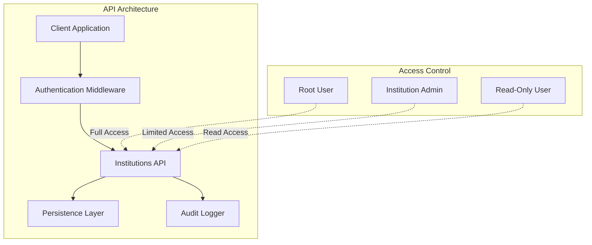
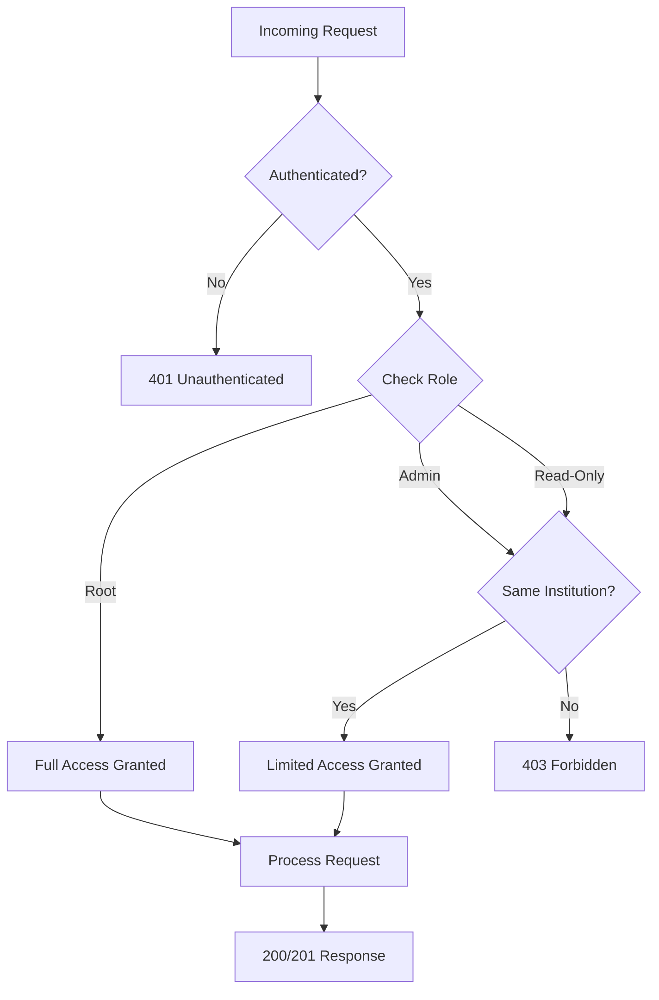
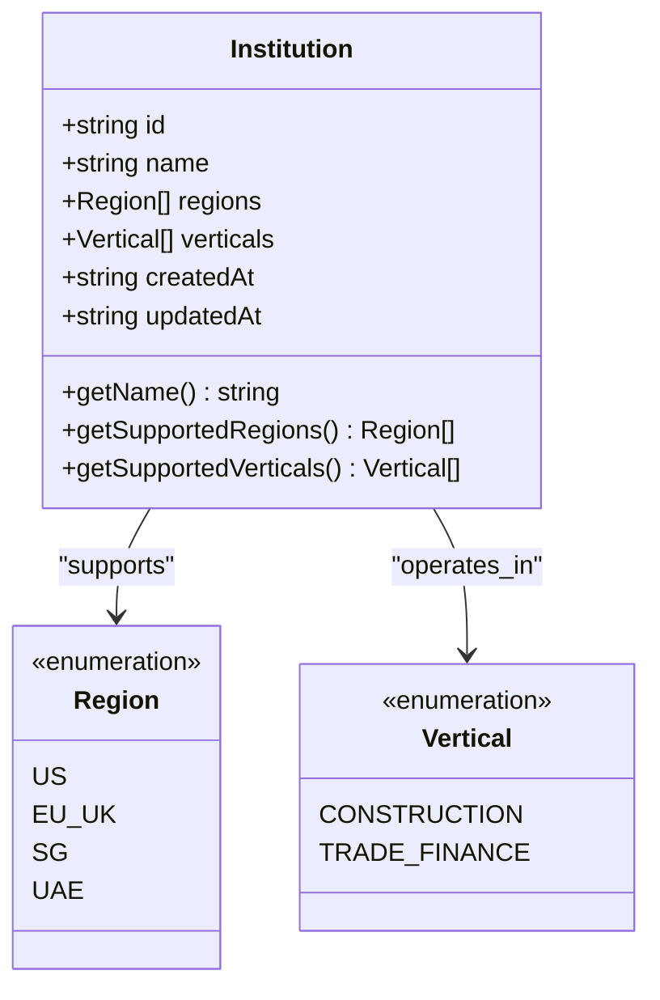
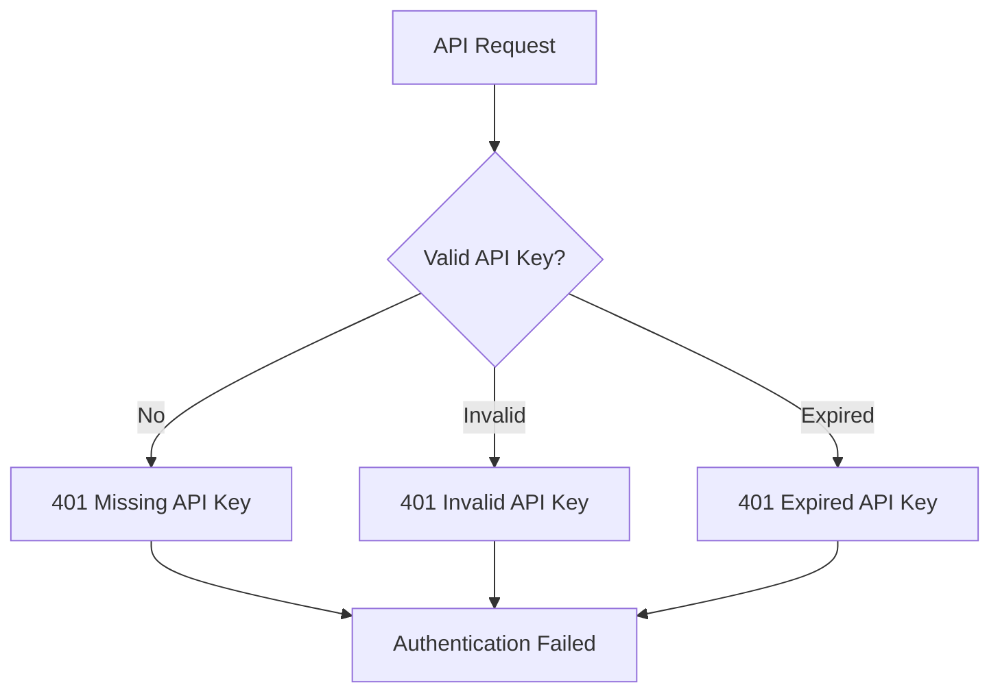
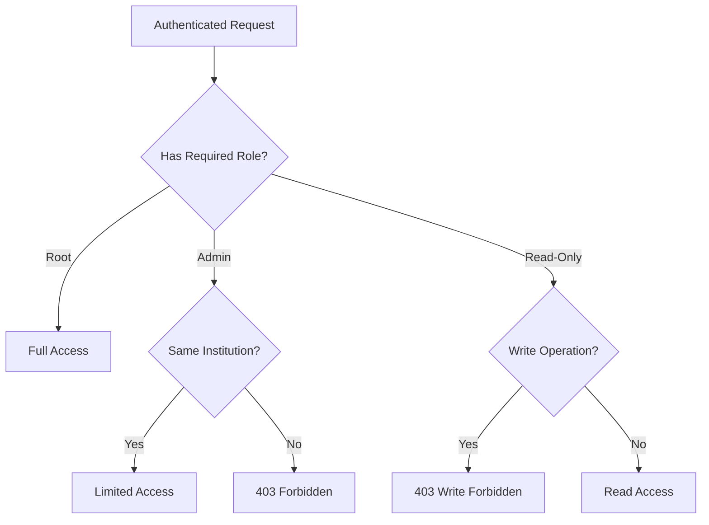
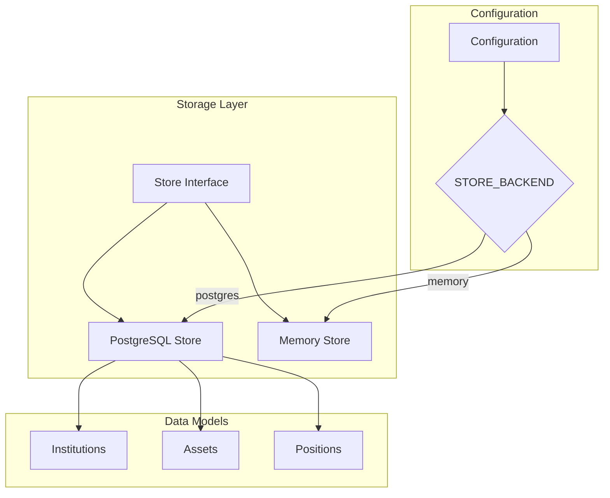
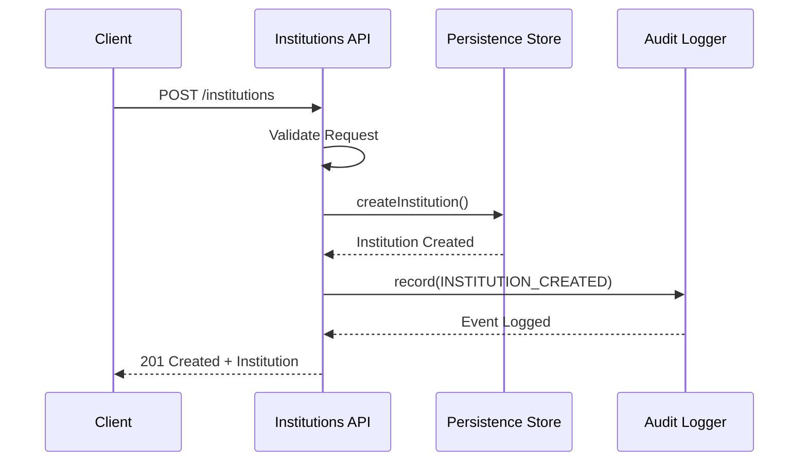

# Institutions API

<cite>
**Referenced Files in This Document**
- [src/api/institutions.ts](file://src/api/institutions.ts)
- [src/store/store.ts](file://src/store/store.ts)
- [src/store/postgresStore.ts](file://src/store/postgresStore.ts)
- [src/store/memoryStore.ts](file://src/store/memoryStore.ts)
- [src/store/index.ts](file://src/store/index.ts)
- [src/domain/types.ts](file://src/domain/types.ts)
- [src/middleware/auth.ts](file://src/middleware/auth.ts)
- [src/infra/auditLogger.ts](file://src/infra/auditLogger.ts)
- [src/server.ts](file://src/server.ts)
- [src/openapi.ts](file://src/openapi.ts)
- [src/config.ts](file://src/config.ts)
</cite>

## Table of Contents
1. [Introduction](#introduction)
2. [API Overview](#api-overview)
3. [Authentication and Access Control](#authentication-and-access-control)
4. [API Endpoints](#api-endpoints)
5. [Data Models](#data-models)
6. [Error Handling](#error-handling)
7. [Multi-Tenancy and Persistence](#multi-tenancy-and-persistence)
8. [Integration with Audit Logging](#integration-with-audit-logging)
9. [Examples](#examples)
10. [Troubleshooting](#troubleshooting)

## Introduction

The Institutions API provides endpoints for managing institutional accounts within the EscrowGrid Tokenization-as-a-Service (TAAS) platform. Institutions serve as the primary organizational units that own and manage assets, positions, and other resources within the system. The API supports both root-level administration and institution-specific operations with appropriate access controls.

## API Overview

The Institutions API consists of three main endpoints:

- **POST /**: Create a new institution (root-only operation)
- **GET /**: List institutions (root can see all, institution keys see only their own)
- **GET /:id**: Retrieve a specific institution by ID

All endpoints require authentication and enforce strict access control based on the user's role and associated institution.



**Diagram sources**
- [src/api/institutions.ts](file://src/api/institutions.ts#L1-L115)
- [src/middleware/auth.ts](file://src/middleware/auth.ts#L1-L95)

## Authentication and Access Control

The API implements a hierarchical access control system with three distinct roles:

### Role-Based Access Control

| Role | Description | Access Level |
|------|-------------|--------------|
| **Root** | System administrator with full privileges | Can create institutions, view all institutions, manage all resources |
| **Admin** | Institution administrator | Can manage resources within their institution only |
| **Read-Only** | Limited access user | Can only read resources within their institution |

### Authentication Methods

The API accepts authentication tokens through two methods:

1. **X-API-KEY Header**: Preferred method for API clients
2. **Authorization Bearer Token**: Alternative method for web applications

### Access Control Rules



**Diagram sources**
- [src/middleware/auth.ts](file://src/middleware/auth.ts#L35-L95)
- [src/api/institutions.ts](file://src/api/institutions.ts#L70-L111)

**Section sources**
- [src/middleware/auth.ts](file://src/middleware/auth.ts#L1-L95)
- [src/api/institutions.ts](file://src/api/institutions.ts#L22-L28)

## API Endpoints

### POST /

Creates a new institution in the system.

#### HTTP Method
- **POST** `/institutions`

#### Authentication Requirements
- **Root role only**: Only root users can create new institutions
- **API key required**: Must provide valid API key in X-API-KEY header

#### Request Schema

| Field | Type | Required | Description |
|-------|------|----------|-------------|
| `name` | string | Yes | Unique name for the institution |
| `regions` | Region[] | Yes | Array of supported regions (US, EU_UK, SG, UAE) |
| `verticals` | Vertical[] | No | Supported verticals (CONSTRUCTION, TRADE_FINANCE) |

#### Response Schemas

**Success Response (201 Created)**
```json
{
  "id": "inst_abc123",
  "name": "Example Institution",
  "regions": ["US", "EU_UK"],
  "verticals": ["CONSTRUCTION", "TRADE_FINANCE"],
  "createdAt": "2024-01-01T00:00:00Z",
  "updatedAt": "2024-01-01T00:00:00Z"
}
```

**Error Responses**

| Status Code | Error Type | Description |
|-------------|------------|-------------|
| 400 | Invalid request body | Missing required fields or invalid data format |
| 403 | Forbidden | Non-root user attempting to create institution |
| 500 | Internal server error | Database or system error during creation |

#### Validation Rules

- **Name**: Required string, must be unique
- **Regions**: Required array, must contain at least one region
- **Verticals**: Optional array, defaults to all supported verticals if not provided

**Section sources**
- [src/api/institutions.ts](file://src/api/institutions.ts#L9-L67)
- [src/openapi.ts](file://src/openapi.ts#L365-L408)

### GET /

Retrieves a list of institutions based on the user's access level.

#### HTTP Method
- **GET** `/institutions`

#### Authentication Requirements
- **API key required**: Must provide valid API key
- **Root access**: Can see all institutions
- **Institution access**: Can only see their own institution

#### Response Schemas

**Root User Response (200 OK)**
```json
[
  {
    "id": "inst_abc123",
    "name": "First Institution",
    "regions": ["US"],
    "verticals": ["CONSTRUCTION"],
    "createdAt": "2024-01-01T00:00:00Z",
    "updatedAt": "2024-01-01T00:00:00Z"
  },
  {
    "id": "inst_def456",
    "name": "Second Institution",
    "regions": ["EU_UK", "SG"],
    "verticals": ["TRADE_FINANCE"],
    "createdAt": "2024-01-02T00:00:00Z",
    "updatedAt": "2024-01-02T00:00:00Z"
  }
]
```

**Institution User Response (200 OK)**
```json
[
  {
    "id": "inst_abc123",
    "name": "My Institution",
    "regions": ["US"],
    "verticals": ["CONSTRUCTION"],
    "createdAt": "2024-01-01T00:00:00Z",
    "updatedAt": "2024-01-01T00:00:00Z"
  }
]
```

#### Error Responses

| Status Code | Error Type | Description |
|-------------|------------|-------------|
| 401 | Unauthenticated | Missing or invalid API key |
| 403 | Forbidden | Institution key without associated institution |
| 404 | Not Found | Specified institution not found |

**Section sources**
- [src/api/institutions.ts](file://src/api/institutions.ts#L70-L90)
- [src/openapi.ts](file://src/openapi.ts#L346-L364)

### GET /:id

Retrieves details for a specific institution.

#### HTTP Method
- **GET** `/institutions/:id`

#### Path Parameters

| Parameter | Type | Required | Description |
|-----------|------|----------|-------------|
| `id` | string | Yes | Institution identifier |

#### Authentication Requirements
- **API key required**: Must provide valid API key
- **Root access**: Can access any institution
- **Institution access**: Can only access their own institution

#### Response Schemas

**Success Response (200 OK)**
```json
{
  "id": "inst_abc123",
  "name": "Example Institution",
  "regions": ["US", "EU_UK"],
  "verticals": ["CONSTRUCTION", "TRADE_FINANCE"],
  "createdAt": "2024-01-01T00:00:00Z",
  "updatedAt": "2024-01-01T00:00:00Z"
}
```

#### Error Responses

| Status Code | Error Type | Description |
|-------------|------------|-------------|
| 401 | Unauthenticated | Missing or invalid API key |
| 403 | Forbidden | Accessing another institution without root privileges |
| 404 | Not Found | Institution not found |

**Section sources**
- [src/api/institutions.ts](file://src/api/institutions.ts#L92-L111)
- [src/openapi.ts](file://src/openapi.ts#L410-L434)

## Data Models

### Institution Model

The Institution entity represents an organizational unit within the system.



**Diagram sources**
- [src/domain/types.ts](file://src/domain/types.ts#L7-L14)

#### Fields

| Field | Type | Description |
|-------|------|-------------|
| `id` | string | Unique identifier for the institution |
| `name` | string | Human-readable name of the institution |
| `regions` | Region[] | Geographic regions where the institution operates |
| `verticals` | Vertical[] | Business verticals supported by the institution |
| `createdAt` | string | ISO 8601 timestamp of creation |
| `updatedAt` | string | ISO 8601 timestamp of last modification |

#### Region Values

- **US**: United States
- **EU_UK**: European Union and United Kingdom
- **SG**: Singapore
- **UAE**: United Arab Emirates

#### Vertical Values

- **CONSTRUCTION**: Construction industry projects
- **TRADE_FINANCE**: Trade finance operations

**Section sources**
- [src/domain/types.ts](file://src/domain/types.ts#L1-L14)

## Error Handling

The API implements comprehensive error handling with standardized response formats.

### Standard Error Response

```json
{
  "error": "Error Type",
  "details": "Detailed error message or additional context"
}
```

### Common Error Scenarios

#### Authentication Errors



#### Authorization Errors



#### Validation Errors

| Error Type | HTTP Status | Description |
|------------|-------------|-------------|
| `Invalid request body` | 400 | Missing required fields or invalid data format |
| `Institution not found` | 404 | Specified institution ID does not exist |
| `Forbidden` | 403 | Insufficient permissions for the requested operation |

#### System Errors

| Error Type | HTTP Status | Description |
|------------|-------------|-------------|
| `Failed to create institution` | 500 | Database or system error during creation |
| `Authentication failed` | 500 | Internal authentication system error |

**Section sources**
- [src/api/institutions.ts](file://src/api/institutions.ts#L22-L67)
- [src/domain/types.ts](file://src/domain/types.ts#L80-L85)

## Multi-Tenancy and Persistence

The system implements multi-tenancy through a flexible persistence layer that supports both in-memory and PostgreSQL storage backends.

### Storage Architecture



**Diagram sources**
- [src/store/index.ts](file://src/store/index.ts#L1-L16)
- [src/store/store.ts](file://src/store/store.ts#L1-L59)

### Multi-Tenancy Implementation

The multi-tenancy model ensures data isolation between institutions:

1. **Resource Ownership**: All resources (assets, positions) belong to specific institutions
2. **Access Filtering**: Queries automatically filter results by the requesting institution
3. **Cross-Institution Prevention**: Users cannot access resources belonging to other institutions

### Persistence Backends

#### PostgreSQL Backend

- **Production Ready**: Full-featured, persistent storage
- **ACID Compliance**: Ensures data consistency and reliability
- **Scalability**: Supports large-scale deployments
- **Audit Trail**: Built-in support for audit logging

#### Memory Backend

- **Development**: Fast, in-memory storage for testing
- **Temporary**: Data lost on restart
- **Performance**: Excellent for development and testing

**Section sources**
- [src/store/index.ts](file://src/store/index.ts#L1-L16)
- [src/store/postgresStore.ts](file://src/store/postgresStore.ts#L1-L417)
- [src/store/memoryStore.ts](file://src/store/memoryStore.ts#L1-L218)
- [src/config.ts](file://src/config.ts#L1-L47)

## Integration with Audit Logging

The Institutions API integrates with the audit logging system to track all institutional operations.

### Audit Event Types

The system logs the following events for institutions:

- **INSTITUTION_CREATED**: When a new institution is created
- **INSTITUTION_UPDATED**: When an institution's properties are modified
- **INSTITUTION_DELETED**: When an institution is removed (not currently implemented)

### Audit Logging Flow



**Diagram sources**
- [src/api/institutions.ts](file://src/api/institutions.ts#L45-L57)
- [src/infra/auditLogger.ts](file://src/infra/auditLogger.ts#L17-L109)

### Audit Event Structure

Each audit event contains:

| Field | Type | Description |
|-------|------|-------------|
| `id` | string | Unique audit event identifier |
| `occurredAt` | string | Timestamp when the event occurred |
| `method` | string | HTTP method used |
| `path` | string | API endpoint accessed |
| `action` | string | Action performed (INSTITUTION_CREATED) |
| `resourceType` | string | Resource type (institution) |
| `resourceId` | string | Institution identifier |
| `payload` | object | Request payload data |
| `auth` | object | Authentication context |

**Section sources**
- [src/api/institutions.ts](file://src/api/institutions.ts#L45-L57)
- [src/infra/auditLogger.ts](file://src/infra/auditLogger.ts#L17-L109)

## Examples

### Creating a New Institution

```bash
curl -X POST https://api.escrowgrid.io/institutions \
  -H "Content-Type: application/json" \
  -H "X-API-KEY: root_api_key_here" \
  -d '{
    "name": "Global Construction Co.",
    "regions": ["US", "EU_UK"],
    "verticals": ["CONSTRUCTION"]
  }'
```

**Response:**
```json
{
  "id": "inst_global_construction",
  "name": "Global Construction Co.",
  "regions": ["US", "EU_UK"],
  "verticals": ["CONSTRUCTION"],
  "createdAt": "2024-01-15T10:30:00Z",
  "updatedAt": "2024-01-15T10:30:00Z"
}
```

### Listing Institutions

```bash
# Root user - see all institutions
curl -H "X-API-KEY: root_api_key_here" \
  https://api.escrowgrid.io/institutions

# Institution user - see only their own
curl -H "X-API-KEY: institution_admin_key_here" \
  https://api.escrowgrid.io/institutions
```

### Retrieving Specific Institution

```bash
curl -H "X-API-KEY: institution_admin_key_here" \
  https://api.escrowgrid.io/institutions/inst_global_construction
```

### Error Scenario: Forbidden Access

```bash
curl -X POST https://api.escrowgrid.io/institutions \
  -H "Content-Type: application/json" \
  -H "X-API-KEY: institution_read_only_key_here" \
  -d '{"name": "New Institution", "regions": ["US"]}'
```

**Response:**
```json
{
  "error": "Forbidden",
  "details": "Only root can create institutions"
}
```

### Error Scenario: Invalid Request Body

```bash
curl -X POST https://api.escrowgrid.io/institutions \
  -H "Content-Type: application/json" \
  -H "X-API-KEY: root_api_key_here" \
  -d '{}'
```

**Response:**
```json
{
  "error": "Invalid request body",
  "details": "name and regions are required"
}
```

## Troubleshooting

### Common Issues and Solutions

#### Authentication Problems

**Issue**: Getting 401 Unauthorized responses
**Solution**: 
- Verify API key is included in X-API-KEY header
- Check API key format and validity
- Ensure root API key is configured correctly

#### Access Control Issues

**Issue**: Getting 403 Forbidden responses
**Solution**:
- Root users can access all institutions
- Institution users can only access their own institution
- Verify API key is associated with the correct institution

#### Validation Errors

**Issue**: Getting 400 Bad Request responses
**Solution**:
- Ensure required fields (name, regions) are provided
- Verify regions array contains valid region values
- Check for proper JSON formatting

#### Database Connectivity

**Issue**: Getting 500 Internal Server errors
**Solution**:
- Verify PostgreSQL connection string if using postgres backend
- Check database availability and credentials
- Review application logs for detailed error messages

### Debugging Tips

1. **Enable Request Logging**: The middleware logs all incoming requests
2. **Check Audit Events**: Review audit logs for operation history
3. **Verify Configuration**: Ensure STORE_BACKEND and DATABASE_URL are properly set
4. **Test with Root Key**: Use root API key for troubleshooting access issues

**Section sources**
- [src/middleware/auth.ts](file://src/middleware/auth.ts#L35-L95)
- [src/api/institutions.ts](file://src/api/institutions.ts#L22-L67)