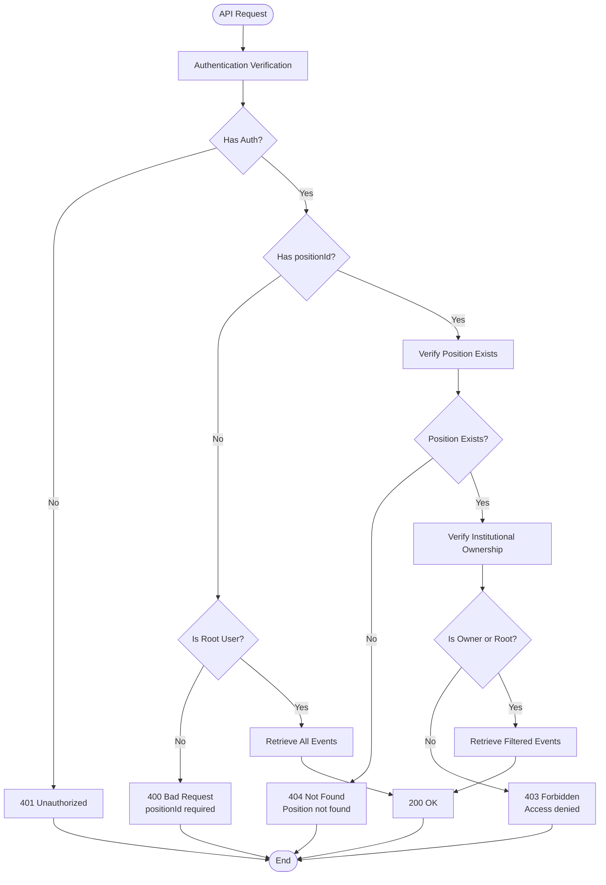
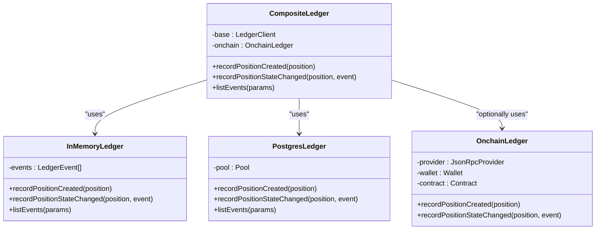
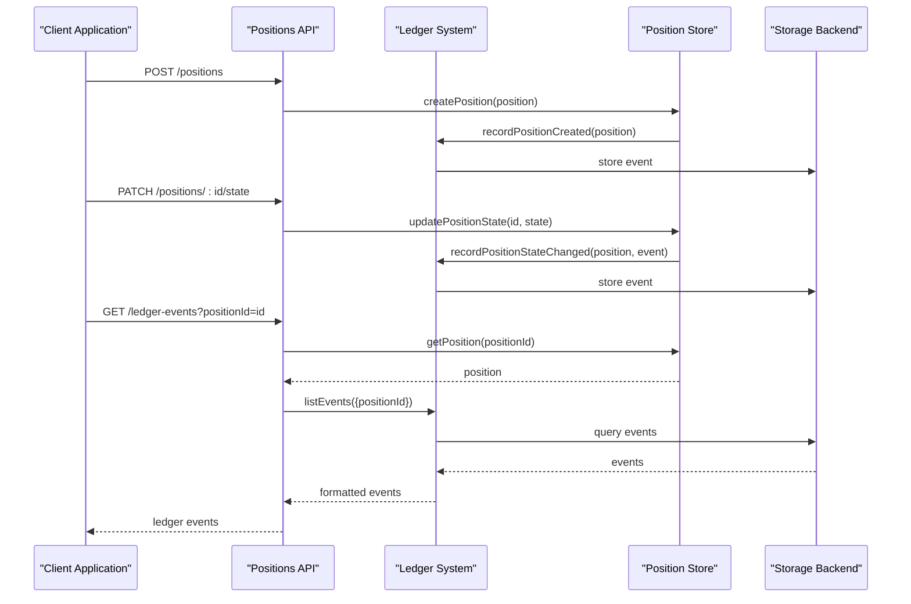

# Ledger API Documentation

<cite>
**Referenced Files in This Document**
- [src/api/ledger.ts](file://src/api/ledger.ts)
- [src/domain/ledger.ts](file://src/domain/ledger.ts)
- [src/domain/types.ts](file://src/domain/types.ts)
- [src/infra/ledgerClient.ts](file://src/infra/ledgerClient.ts)
- [src/infra/inMemoryLedger.ts](file://src/infra/inMemoryLedger.ts)
- [src/infra/postgresLedger.ts](file://src/infra/postgresLedger.ts)
- [src/infra/onchainLedger.ts](file://src/infra/onchainLedger.ts)
- [src/middleware/auth.ts](file://src/middleware/auth.ts)
- [src/store/index.ts](file://src/store/index.ts)
- [src/server.ts](file://src/server.ts)
- [src/openapi.ts](file://src/openapi.ts)
- [src/config.ts](file://src/config.ts)
</cite>

## Table of Contents
1. [Introduction](#introduction)
2. [API Endpoint Overview](#api-endpoint-overview)
3. [Authentication Requirements](#authentication-requirements)
4. [Query Parameter Details](#query-parameter-details)
5. [Response Schema](#response-schema)
6. [Access Control Rules](#access-control-rules)
7. [Backend Integration](#backend-integration)
8. [Error Handling](#error-handling)
9. [Position Lifecycle Integration](#position-lifecycle-integration)
10. [Usage Examples](#usage-examples)
11. [Troubleshooting](#troubleshooting)

## Introduction

The Ledger API provides comprehensive audit trail functionality for tracking position lifecycle events across the EscrowGrid platform. This endpoint serves as the primary interface for retrieving historical records of position state transitions, enabling compliance monitoring, auditing, and operational oversight.

The ledger system maintains a chronological record of all significant position events, capturing both system-generated state changes and manual interventions. These events form a complete audit trail that supports regulatory compliance, internal governance, and operational transparency.

## API Endpoint Overview

### Base URL
```
GET /ledger-events
```

### Endpoint Description
Retrieves ledger events representing position lifecycle activities. Events are timestamp-ordered chronologically and provide visibility into position state transitions, creation activities, and system interventions.

### Path Parameters
None

### Query Parameters
| Parameter | Type | Required | Description |
|-----------|------|----------|-------------|
| `positionId` | string | No | Filter events by specific position ID |

**Section sources**
- [src/api/ledger.ts](file://src/api/ledger.ts#L8-L38)
- [src/openapi.ts](file://src/openapi.ts#L887-L917)

## Authentication Requirements

The Ledger API implements a hierarchical authentication system with role-based access controls:

### Authentication Methods
- **API Key Header**: `X-API-KEY: <your-api-key>`
- **Bearer Token**: `Authorization: Bearer <your-token>`

### Authentication Levels
1. **Root Access**: Full system-wide ledger access
2. **Institution Member**: Position-specific access within assigned institution
3. **Read-Only Access**: Limited access for monitoring purposes

### Root User Access
Root users can query all ledger events regardless of position ownership or institutional affiliation. This capability is essential for system administrators and compliance officers requiring comprehensive audit visibility.

### Institution Member Access
Institution members can only access ledger events for positions belonging to their assigned institution. This restriction ensures data isolation while maintaining operational visibility within organizational boundaries.

**Section sources**
- [src/middleware/auth.ts](file://src/middleware/auth.ts#L35-L95)
- [src/api/ledger.ts](file://src/api/ledger.ts#L10-L38)

## Query Parameter Details

### positionId Parameter

The `positionId` query parameter enables filtered ledger event retrieval:

#### Without positionId
- **Root Users**: Retrieves all ledger events across the entire system
- **Institution Members**: Returns 400 Bad Request with message "positionId is required for non-root ledger queries"

#### With positionId
- **Root Users**: Retrieves all events for the specified position
- **Institution Members**: Retrieves events only if the position belongs to their institution
- **Unauthorized Access**: Returns 403 Forbidden with message "Forbidden to access ledger events for this position"

### Parameter Validation
The API validates the presence and format of the `positionId` parameter, ensuring proper filtering semantics and preventing unauthorized access patterns.

**Section sources**
- [src/api/ledger.ts](file://src/api/ledger.ts#L17-L37)

## Response Schema

### Response Format
The API returns an array of ledger events in JSON format, ordered chronologically by timestamp.

### Ledger Event Structure

```typescript
interface LedgerEvent {
  id: string;           // Unique event identifier
  kind: string;         // Event type (POSITION_CREATED, POSITION_STATE_CHANGED)
  positionId: string;   // Associated position identifier
  at: string;           // ISO 8601 timestamp
  previousState?: string; // Previous state (for state changes)
  newState?: string;    // New state (for state changes)
  payload: object;      // Event-specific metadata
}
```

### Event Types

#### POSITION_CREATED
Represents the creation of a new position:
- **Kind**: `"POSITION_CREATED"`
- **Payload Fields**:
  - `institutionId`: Creating institution identifier
  - `assetId`: Associated asset identifier
  - `currency`: Position currency
  - `amount`: Position amount
  - `externalReference`: Optional external reference

#### POSITION_STATE_CHANGED
Represents a position state transition:
- **Kind**: `"POSITION_STATE_CHANGED"`
- **Previous State**: State before transition (nullable)
- **New State**: State after transition
- **Payload Fields**:
  - `reason`: Reason for state change
  - `metadata`: Additional transition context

### Response Status Codes
- **200 OK**: Successful retrieval of ledger events
- **400 Bad Request**: Invalid query parameters or missing required fields
- **401 Unauthorized**: Missing or invalid authentication credentials
- **403 Forbidden**: Insufficient permissions for requested operation
- **404 Not Found**: Specified position does not exist

**Section sources**
- [src/domain/ledger.ts](file://src/domain/ledger.ts#L5-L23)
- [src/openapi.ts](file://src/openapi.ts#L223-L237)

## Access Control Rules

### Hierarchical Permission Model

The Ledger API implements a multi-tiered access control system:

#### Root User Privileges
- **System-Wide Access**: Query all ledger events across all positions
- **No Restrictions**: No filtering limitations based on institution or position ownership
- **Administrative Functions**: Full audit capabilities for system oversight

#### Institution Member Privileges
- **Position Ownership**: Access to positions owned by their institution
- **Filtered Queries**: Can only retrieve events for positions within their institutional scope
- **Data Isolation**: Cannot access events for positions outside their institutional boundary

#### Cross-Institutional Restrictions
- **Strict Isolation**: Institution members cannot access positions from other institutions
- **Validation Layer**: API enforces institutional ownership verification
- **Audit Trail**: Access attempts are logged for security monitoring

### Permission Enforcement Flow



**Diagram sources**
- [src/api/ledger.ts](file://src/api/ledger.ts#L10-L38)

**Section sources**
- [src/api/ledger.ts](file://src/api/ledger.ts#L17-L37)
- [src/middleware/auth.ts](file://src/middleware/auth.ts#L8-L12)

## Backend Integration

### Multi-Backend Architecture

The Ledger API integrates with multiple storage backends through a composite client pattern:

#### Available Backends
1. **In-Memory Storage**: Development and testing environments
2. **PostgreSQL Storage**: Production persistent storage
3. **On-Chain Storage**: Blockchain-based immutable ledger (optional)

### Backend Selection Logic



**Diagram sources**
- [src/infra/ledgerClient.ts](file://src/infra/ledgerClient.ts#L8-L62)
- [src/infra/inMemoryLedger.ts](file://src/infra/inMemoryLedger.ts#L12-L61)
- [src/infra/postgresLedger.ts](file://src/infra/postgresLedger.ts#L14-L107)

### Backend Configuration

#### Environment Variables
- `STORE_BACKEND`: Determines primary storage backend (`memory` or `postgres`)
- `ONCHAIN_LEDGER_ENABLED`: Enables blockchain integration
- `DATABASE_URL`: PostgreSQL connection string (required for postgres backend)

#### Backend Initialization
The system automatically selects the appropriate backend based on configuration, with fallback to in-memory storage for development environments.

**Section sources**
- [src/infra/ledgerClient.ts](file://src/infra/ledgerClient.ts#L39-L62)
- [src/config.ts](file://src/config.ts#L23-L46)

## Error Handling

### Standard Error Responses

#### Authentication Errors
- **401 Unauthorized**: Missing or invalid API key
- **401 Unauthorized**: Invalid bearer token format

#### Authorization Errors
- **403 Forbidden**: Insufficient permissions for requested operation
- **403 Forbidden**: Attempting to access events for unauthorized positions

#### Resource Errors
- **404 Not Found**: Specified position does not exist
- **404 Not Found**: Position not found in ledger records

#### Validation Errors
- **400 Bad Request**: Missing required `positionId` for non-root queries
- **400 Bad Request**: Invalid query parameter format

### Error Response Format

```json
{
  "error": "Error description",
  "details": "Additional context (optional)"
}
```

### Error Scenarios

#### Non-Existent Positions
When attempting to query ledger events for a position that doesn't exist:
- **Response**: 404 Not Found
- **Message**: "Position not found"
- **Cause**: Position ID doesn't correspond to any existing position

#### Unauthorized Access
When attempting to access events for positions outside institutional scope:
- **Response**: 403 Forbidden
- **Message**: "Forbidden to access ledger events for this position"
- **Cause**: Institution member trying to access foreign position events

#### Missing Position ID (Non-Root)
When root users omit the `positionId` parameter:
- **Response**: 400 Bad Request
- **Message**: "positionId is required for non-root ledger queries"
- **Cause**: Root users must specify position for targeted queries

**Section sources**
- [src/api/ledger.ts](file://src/api/ledger.ts#L13-L37)

## Position Lifecycle Integration

### Event Generation Workflow

The ledger system maintains tight integration with the positions API through automated event recording:



**Diagram sources**
- [src/api/ledger.ts](file://src/api/ledger.ts#L10-L38)
- [src/domain/ledger.ts](file://src/domain/ledger.ts#L15-L22)

### State Transition Tracking

Each position state change generates a corresponding ledger event containing:
- **Timestamp**: Exact moment of state transition
- **Source Position**: Complete position context at transition time
- **Transition Metadata**: Reason and additional context for the change
- **State History**: Previous and new state values

### Audit Trail Completeness

The ledger system ensures comprehensive audit coverage:
- **Automatic Recording**: All state transitions trigger event creation
- **Immutable History**: Events cannot be modified or deleted
- **Complete Context**: Each event includes full position and transition details
- **Chronological Ordering**: Events maintain strict temporal ordering

**Section sources**
- [src/domain/ledger.ts](file://src/domain/ledger.ts#L15-L22)
- [src/infra/inMemoryLedger.ts](file://src/infra/inMemoryLedger.ts#L15-L49)

## Usage Examples

### Example 1: Root User - Query All Ledger Events

```bash
curl -H "X-API-KEY: root_api_key_here" \
     https://api.escrowgrid.io/ledger-events
```

**Response:**
```json
[
  {
    "id": "led_a1b2c3d4e5f6",
    "kind": "POSITION_CREATED",
    "positionId": "pos_123456789",
    "at": "2024-01-15T10:30:00.000Z",
    "payload": {
      "institutionId": "inst_987654321",
      "assetId": "asset_xyz",
      "currency": "USD",
      "amount": 100000,
      "externalReference": "EXT-2024-001"
    }
  },
  {
    "id": "led_f6e5d4c3b2a1",
    "kind": "POSITION_STATE_CHANGED",
    "positionId": "pos_123456789",
    "at": "2024-01-15T11:15:00.000Z",
    "previousState": "CREATED",
    "newState": "FUNDED",
    "payload": {
      "reason": "Funds received into escrow",
      "metadata": {
        "transactionId": "tx_abc123",
        "sourceAccount": "acct_456"
      }
    }
  }
]
```

### Example 2: Institution Member - Query Specific Position

```bash
curl -H "X-API-KEY: institution_api_key_here" \
     https://api.escrowgrid.io/ledger-events?positionId=pos_123456789
```

**Response:**
```json
[
  {
    "id": "led_a1b2c3d4e5f6",
    "kind": "POSITION_CREATED",
    "positionId": "pos_123456789",
    "at": "2024-01-15T10:30:00.000Z",
    "payload": {
      "institutionId": "inst_987654321",
      "assetId": "asset_xyz",
      "currency": "USD",
      "amount": 100000,
      "externalReference": "EXT-2024-001"
    }
  }
]
```

### Example 3: Error - Missing Position ID (Non-Root)

```bash
curl -H "X-API-KEY: institution_api_key_here" \
     https://api.escrowgrid.io/ledger-events
```

**Response:**
```json
{
  "error": "positionId is required for non-root ledger queries"
}
```

### Example 4: Error - Position Not Found

```bash
curl -H "X-API-KEY: root_api_key_here" \
     https://api.escrowgrid.io/ledger-events?positionId=nonexistent_pos
```

**Response:**
```json
{
  "error": "Position not found"
}
```

### Example 5: Error - Unauthorized Access

```bash
curl -H "X-API-KEY: institution_api_key_here" \
     https://api.escrowgrid.io/ledger-events?positionId=foreign_pos
```

**Response:**
```json
{
  "error": "Forbidden to access ledger events for this position"
}
```

## Troubleshooting

### Common Issues and Solutions

#### Issue: "positionId is required for non-root ledger queries"
**Cause**: Root users must specify position ID when querying ledger events
**Solution**: Include the `positionId` query parameter in your request

#### Issue: "Position not found"
**Cause**: Specified position ID doesn't correspond to any existing position
**Solution**: Verify the position ID exists by querying the positions API first

#### Issue: "Forbidden to access ledger events for this position"
**Cause**: Institution member trying to access events for positions outside their institution
**Solution**: Ensure you're only accessing positions owned by your institution

#### Issue: Unexpected empty response
**Cause**: No ledger events exist for the specified position or time period
**Solution**: Verify the position has undergone state transitions and events were recorded

#### Issue: Authentication failures
**Cause**: Invalid or missing API key
**Solution**: Verify your API key is correct and included in the request headers

### Debugging Tips

1. **Verify Authentication**: Test with a known valid API key
2. **Check Position Existence**: Confirm the position exists before querying ledger events
3. **Validate Permissions**: Ensure your API key has appropriate institutional access
4. **Review Query Parameters**: Double-check parameter formats and required fields
5. **Monitor Rate Limits**: Respect API rate limiting to avoid temporary blocks

### Performance Considerations

- **Large Datasets**: Root queries may return extensive event histories
- **Pagination**: Consider implementing client-side pagination for large result sets
- **Caching**: Cache frequently accessed ledger data to reduce API calls
- **Filtering**: Use position-specific queries to minimize response sizes

**Section sources**
- [src/api/ledger.ts](file://src/api/ledger.ts#L13-L37)