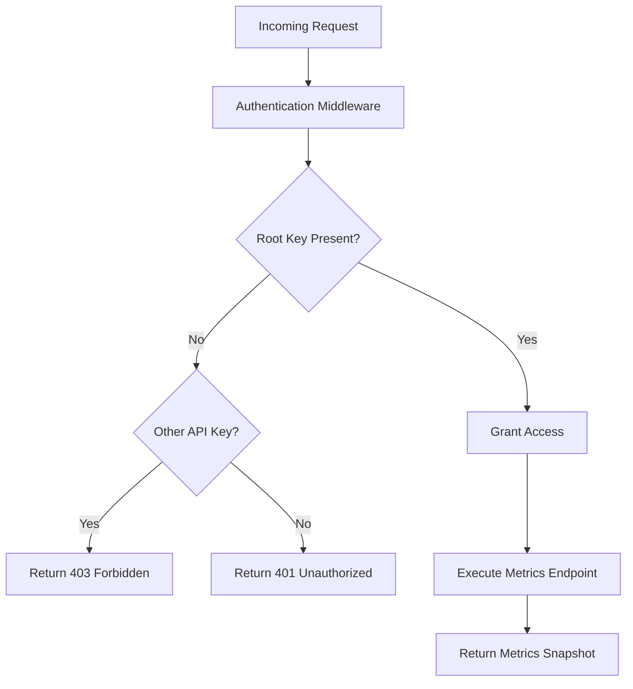
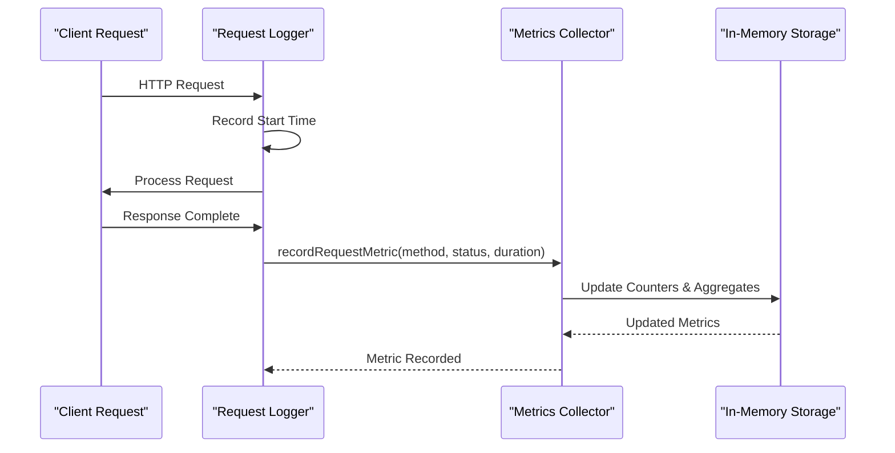
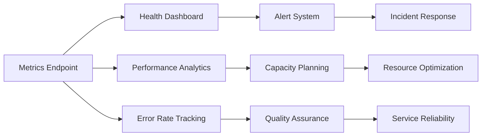
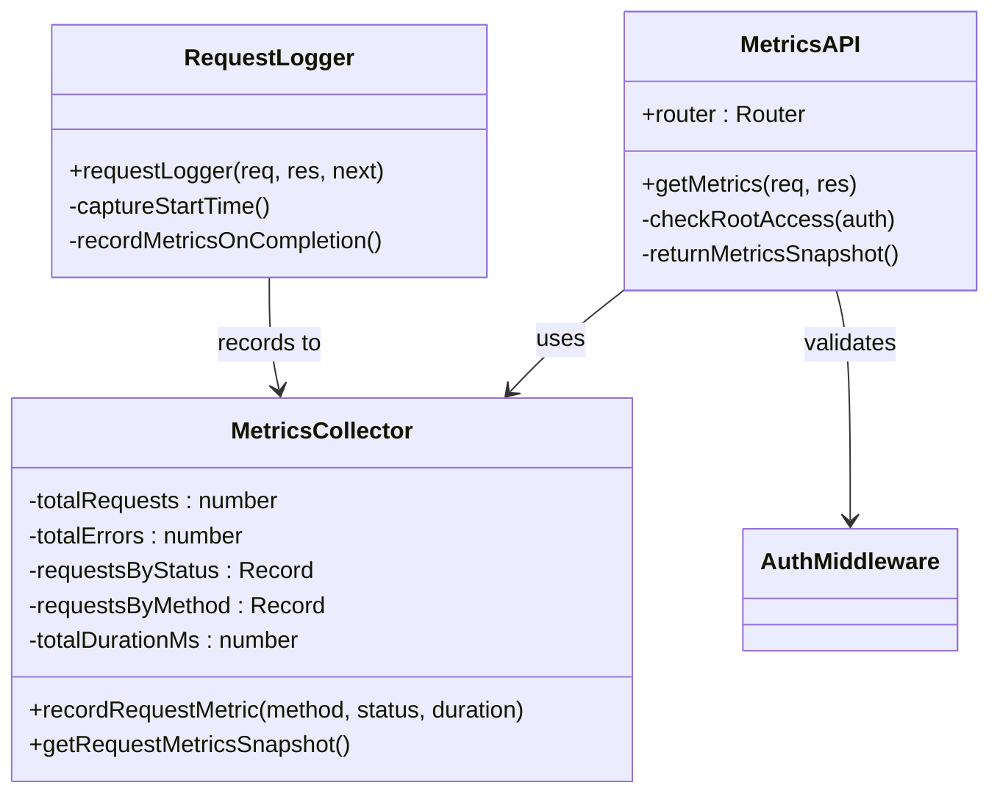

# Metrics API

<cite>
**Referenced Files in This Document**
- [src/api/metrics.ts](file://src/api/metrics.ts)
- [src/infra/metrics.ts](file://src/infra/metrics.ts)
- [src/middleware/auth.ts](file://src/middleware/auth.ts)
- [src/middleware/requestLogger.ts](file://src/middleware/requestLogger.ts)
- [src/server.ts](file://src/server.ts)
- [src/config.ts](file://src/config.ts)
- [src/openapi.ts](file://src/openapi.ts)
- [src/__tests__/api.test.ts](file://src/__tests__/api.test.ts)
</cite>

## Table of Contents
1. [Introduction](#introduction)
2. [Endpoint Overview](#endpoint-overview)
3. [Authentication Requirements](#authentication-requirements)
4. [Response Schema](#response-schema)
5. [Metrics Collection Architecture](#metrics-collection-architecture)
6. [Security Rationale](#security-rationale)
7. [Operational Monitoring Use Cases](#operational-monitoring-use-cases)
8. [Implementation Details](#implementation-details)
9. [Example Usage](#example-usage)
10. [Troubleshooting](#troubleshooting)

## Introduction

The Metrics API provides real-time insights into request performance and system behavior through comprehensive request metrics collection. This endpoint offers a snapshot of all HTTP requests processed by the escrowgrid platform, enabling operational teams to monitor system health, track performance trends, and identify potential issues.

The metrics endpoint serves as a critical component for system monitoring and operational visibility, delivering essential data about request volumes, response times, error rates, and method distribution across the entire platform.

## Endpoint Overview

### GET /metrics

Returns a comprehensive snapshot of request metrics collected during the current runtime session.

**Base URL:** `https://api.escrowgrid.io/metrics`  
**Authentication:** Root-only access required  
**Content Type:** `application/json`  
**Rate Limiting:** Subject to global rate limiting rules

**HTTP Status Codes:**
- `200 OK`: Metrics successfully retrieved
- `401 Unauthorized`: Missing or invalid API key
- `403 Forbidden`: API key does not have root privileges

**Section sources**
- [src/api/metrics.ts](file://src/api/metrics.ts#L7-L14)
- [src/openapi.ts](file://src/openapi.ts#L328-L344)

## Authentication Requirements

The metrics endpoint enforces strict root-only access to protect sensitive operational data and prevent unauthorized access to system performance information.

### Root API Key Requirement

Access to the metrics endpoint is exclusively granted to root API keys, which possess elevated privileges across the entire platform. Root keys are configured via the `ROOT_API_KEY` environment variable and provide unrestricted access to administrative functions.



**Diagram sources**
- [src/middleware/auth.ts](file://src/middleware/auth.ts#L58-L60)
- [src/api/metrics.ts](file://src/api/metrics.ts#L8-L11)

### Authentication Flow

The authentication process follows the standard escrowgrid authentication model with specialized handling for metrics access:

1. **Token Extraction**: Extracts API key from either `X-API-KEY` header or `Authorization: Bearer` header
2. **Root Validation**: Checks if the provided key matches the configured root API key
3. **Access Decision**: Grants access only if the key is verified as root

**Section sources**
- [src/middleware/auth.ts](file://src/middleware/auth.ts#L23-L60)
- [src/api/metrics.ts](file://src/api/metrics.ts#L8-L11)

## Response Schema

The metrics endpoint returns a structured snapshot containing comprehensive request performance data.

### RequestMetricsSnapshot Interface

| Field | Type | Description |
|-------|------|-------------|
| `totalRequests` | `number` | Total number of HTTP requests processed |
| `totalErrors` | `number` | Total number of requests resulting in 5xx errors |
| `requestsByStatus` | `Record<number, number>` | Count of requests grouped by HTTP status code |
| `requestsByMethod` | `Record<string, number>` | Count of requests grouped by HTTP method |
| `averageDurationMs` | `number` | Average request duration in milliseconds |

### Example Response

```json
{
  "totalRequests": 12456,
  "totalErrors": 12,
  "requestsByStatus": {
    "200": 11890,
    "201": 234,
    "400": 12,
    "401": 2,
    "403": 1,
    "500": 3
  },
  "requestsByMethod": {
    "GET": 8765,
    "POST": 2345,
    "PUT": 1234,
    "DELETE": 112
  },
  "averageDurationMs": 145.78
}
```

**Section sources**
- [src/infra/metrics.ts](file://src/infra/metrics.ts#L3-L9)
- [src/infra/metrics.ts](file://src/infra/metrics.ts#L28-L37)
- [src/openapi.ts](file://src/openapi.ts#L239-L255)

## Metrics Collection Architecture

The metrics system operates through a centralized collection mechanism that tracks request characteristics in-memory across the entire application lifecycle.

### Collection Mechanism



**Diagram sources**
- [src/middleware/requestLogger.ts](file://src/middleware/requestLogger.ts#L5-L28)
- [src/infra/metrics.ts](file://src/infra/metrics.ts#L17-L26)

### Data Collection Process

The metrics collection follows a systematic approach to capture comprehensive request information:

1. **Request Timing**: Captures request start time using high-resolution timestamps
2. **Response Tracking**: Records response completion with status code and duration
3. **Metric Recording**: Updates internal counters and aggregates with collected data
4. **State Management**: Maintains cumulative statistics across all requests

### Internal Data Structures

The metrics system maintains several key data structures for efficient aggregation:

- **Total Requests Counter**: Tracks cumulative request count
- **Error Counter**: Monitors 5xx error occurrences
- **Status Distribution**: Maps HTTP status codes to request counts
- **Method Distribution**: Tracks HTTP method usage patterns
- **Duration Accumulator**: Sums request durations for average calculation

**Section sources**
- [src/infra/metrics.ts](file://src/infra/metrics.ts#L11-L16)
- [src/middleware/requestLogger.ts](file://src/middleware/requestLogger.ts#L5-L28)

## Security Rationale

The root-only access restriction for the metrics endpoint serves multiple critical security and operational purposes:

### Information Sensitivity

Request metrics contain valuable operational intelligence including:
- **Request Patterns**: Reveals usage patterns and peak times
- **Error Distribution**: Exposes system weaknesses and failure modes
- **Performance Trends**: Provides insight into system bottlenecks
- **Resource Utilization**: Indicates load patterns and capacity planning needs

### Privilege Separation

Root-only access ensures:
- **Administrative Control**: Only authorized administrators can access metrics
- **Operational Security**: Prevents misuse of operational data
- **Compliance Protection**: Maintains data governance standards
- **System Integrity**: Protects against metric manipulation or abuse

### Risk Mitigation

Access restrictions mitigate several potential risks:
- **Information Disclosure**: Prevents exposure of internal system characteristics
- **Denial of Service**: Limits potential abuse through excessive metric queries
- **Data Correlation**: Reduces ability to correlate metrics with specific operations
- **Operational Intelligence**: Prevents competitive advantage through metric analysis

## Operational Monitoring Use Cases

The metrics endpoint supports various operational monitoring scenarios essential for maintaining system health and performance.

### System Health Monitoring



### Key Monitoring Scenarios

| Use Case | Metrics Tracked | Purpose |
|----------|----------------|---------|
| **Performance Monitoring** | `averageDurationMs`, `requestsByMethod` | Track response times and method usage patterns |
| **Error Rate Analysis** | `totalErrors`, `requestsByStatus[5xx]` | Identify and resolve system failures |
| **Load Balancing** | `totalRequests`, `requestsByStatus` | Distribute traffic based on demand patterns |
| **Capacity Planning** | `totalRequests`, `requestsByMethod` | Plan resource allocation and scaling |
| **Security Monitoring** | `requestsByStatus[4xx]`, `requestsByStatus[401/403]` | Detect unauthorized access attempts |
| **Service Level Monitoring** | `requestsByStatus[2xx]`, `averageDurationMs` | Measure SLA compliance |

### Real-Time Alerting

The metrics endpoint enables real-time alerting for:
- **Performance Degradation**: Sudden increases in average response times
- **Error Spike Detection**: Unusual patterns in error rates
- **Traffic Anomalies**: Unexpected changes in request patterns
- **Resource Exhaustion**: Indicators of system stress or overload

## Implementation Details

The metrics implementation follows a modular architecture that integrates seamlessly with the existing request processing pipeline.

### Core Components



**Diagram sources**
- [src/api/metrics.ts](file://src/api/metrics.ts#L1-L18)
- [src/infra/metrics.ts](file://src/infra/metrics.ts#L17-L37)
- [src/middleware/requestLogger.ts](file://src/middleware/requestLogger.ts#L5-L28)

### Request Processing Integration

The metrics system integrates with the request processing pipeline through the request logger middleware:

1. **Timing Capture**: Starts high-resolution timer at request inception
2. **Completion Tracking**: Records metrics when response completes
3. **Data Aggregation**: Updates internal counters with collected data
4. **Snapshot Generation**: Provides read-only access to current metrics

### Thread Safety Considerations

The in-memory metrics storage maintains thread safety through:
- **Atomic Operations**: Counter updates use atomic increment operations
- **Immutable Snapshots**: Snapshot generation creates defensive copies
- **Concurrent Access**: Safe concurrent reads while metrics are being updated

**Section sources**
- [src/api/metrics.ts](file://src/api/metrics.ts#L1-L18)
- [src/infra/metrics.ts](file://src/infra/metrics.ts#L17-L37)
- [src/middleware/requestLogger.ts](file://src/middleware/requestLogger.ts#L5-L28)

## Example Usage

### Basic Metrics Retrieval

```bash
curl -H "X-API-KEY: your-root-api-key" \
     https://api.escrowgrid.io/metrics
```

### Programmatic Access

```typescript
interface MetricsResponse {
  totalRequests: number;
  totalErrors: number;
  requestsByStatus: Record<number, number>;
  requestsByMethod: Record<string, number>;
  averageDurationMs: number;
}

async function fetchMetrics(apiKey: string): Promise<MetricsResponse> {
  const response = await fetch('https://api.escrowgrid.io/metrics', {
    headers: {
      'X-API-KEY': apiKey
    }
  });
  
  if (!response.ok) {
    throw new Error(`HTTP ${response.status}: ${response.statusText}`);
  }
  
  return response.json();
}
```

### Integration with Monitoring Systems

```javascript
// Example Prometheus metrics exporter
const express = require('express');
const { fetchMetrics } = require('./metrics-client');

const app = express();

app.get('/metrics', async (req, res) => {
  try {
    const metrics = await fetchMetrics(process.env.ROOT_API_KEY);
    
    // Export to Prometheus format
    const prometheusMetrics = `
      # HELP escrowgrid_total_requests Total number of requests
      # TYPE escrowgrid_total_requests counter
      escrowgrid_total_requests ${metrics.totalRequests}
      
      # HELP escrowgrid_error_rate Error rate percentage
      # TYPE escrowgrid_error_rate gauge
      escrowgrid_error_rate ${(metrics.totalErrors / metrics.totalRequests * 100).toFixed(2)}
      
      # HELP escrowgrid_average_duration Average request duration in ms
      # TYPE escrowgrid_average_duration gauge
      escrowgrid_average_duration ${metrics.averageDurationMs.toFixed(2)}
    `;
    
    res.setHeader('Content-Type', 'text/plain');
    res.send(prometheusMetrics);
  } catch (error) {
    res.status(500).send(error.message);
  }
});
```

## Troubleshooting

### Common Issues and Solutions

| Issue | Symptoms | Solution |
|-------|----------|----------|
| **401 Unauthorized** | Missing or invalid API key | Verify ROOT_API_KEY configuration and authentication header format |
| **403 Forbidden** | Valid API key but insufficient permissions | Use root API key instead of institution API key |
| **Empty Metrics** | Zero values in response | Ensure sufficient request volume or check metrics collection |
| **High Latency** | Slow response from metrics endpoint | Monitor system performance and check for resource constraints |

### Debugging Metrics Collection

To verify metrics collection is functioning correctly:

1. **Generate Traffic**: Make several API requests to establish baseline metrics
2. **Verify Counts**: Check that `totalRequests` increments with each request
3. **Monitor Patterns**: Ensure `requestsByMethod` reflects actual request patterns
4. **Check Durations**: Verify `averageDurationMs` provides reasonable values

### Performance Considerations

The metrics endpoint is designed for low-latency access:
- **In-Memory Storage**: Metrics stored in RAM for fast access
- **Minimal Processing**: Snapshot generation involves simple calculations
- **No Database Queries**: No persistence overhead for metrics retrieval
- **Thread-Safe Operations**: Concurrent access without locking mechanisms

**Section sources**
- [src/api/metrics.ts](file://src/api/metrics.ts#L8-L11)
- [src/infra/metrics.ts](file://src/infra/metrics.ts#L28-L37)