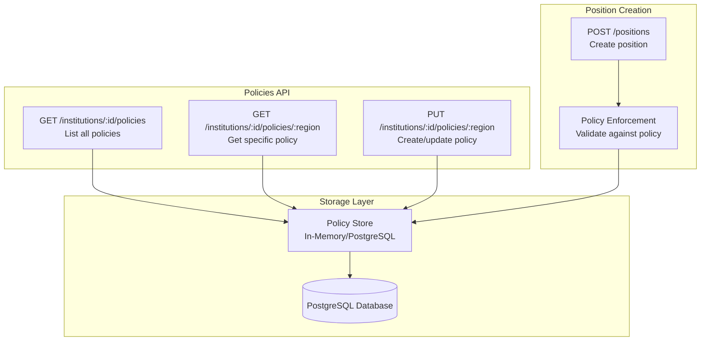
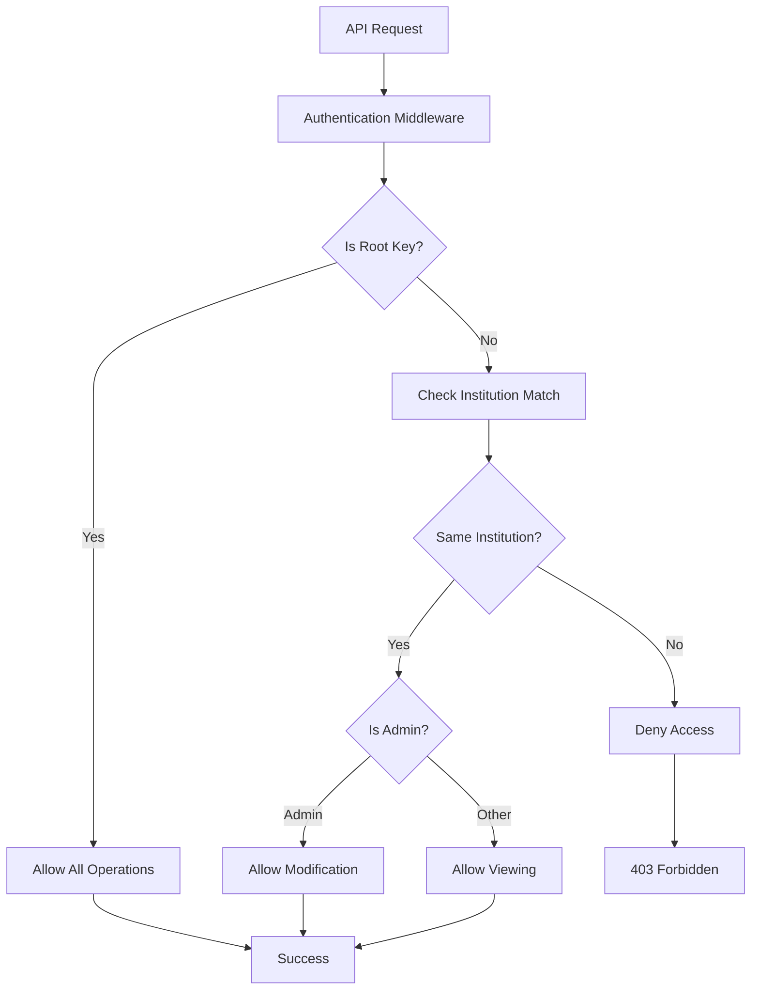
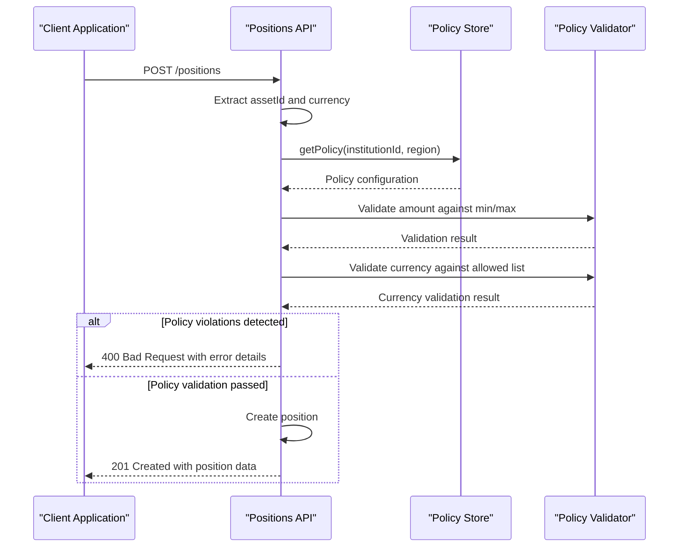
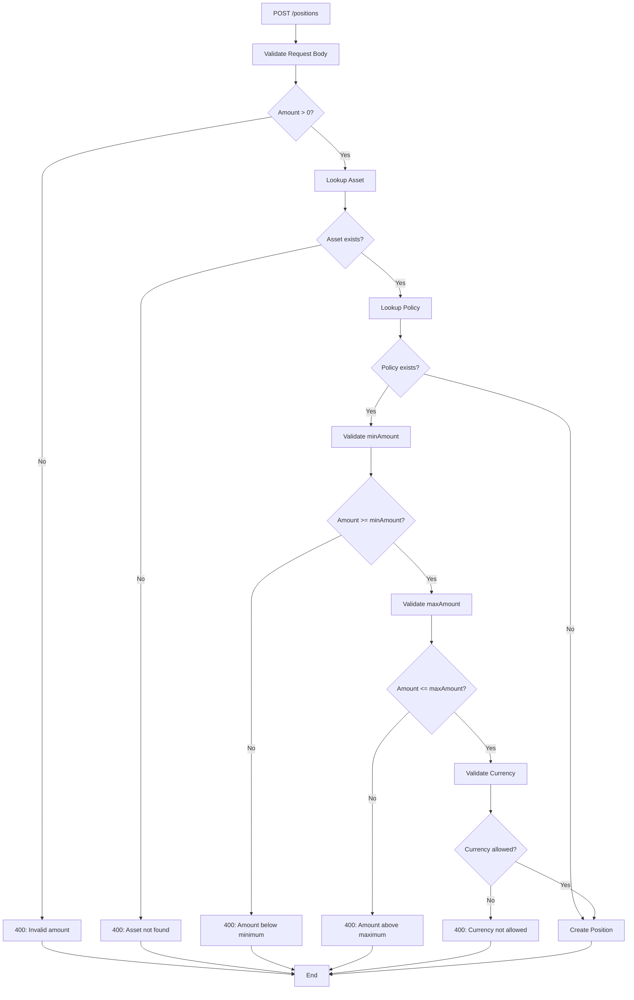
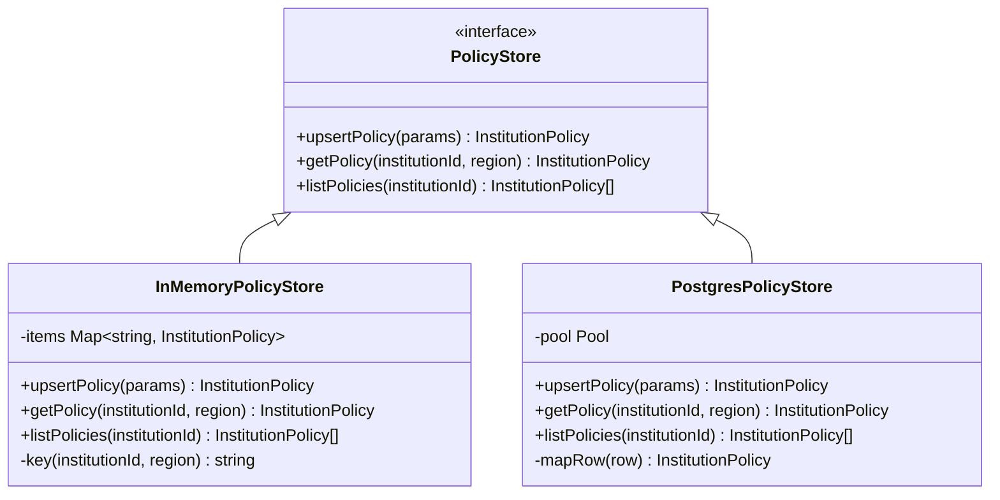

# Policies API

<cite>
**Referenced Files in This Document**
- [src/api/policies.ts](file://src/api/policies.ts)
- [src/domain/policy.ts](file://src/domain/policy.ts)
- [src/domain/types.ts](file://src/domain/types.ts)
- [src/infra/policyStore.ts](file://src/infra/policyStore.ts)
- [src/api/positions.ts](file://src/api/positions.ts)
- [src/middleware/auth.ts](file://src/middleware/auth.ts)
- [src/server.ts](file://src/server.ts)
- [src/openapi.ts](file://src/openapi.ts)
- [db/schema.sql](file://db/schema.sql)
</cite>

## Table of Contents
1. [Introduction](#introduction)
2. [API Endpoints Overview](#api-endpoints-overview)
3. [Authentication and Authorization](#authentication-and-authorization)
4. [Policy Model and Regions](#policy-model-and-regions)
5. [Endpoint Specifications](#endpoint-specifications)
6. [Policy Enforcement in Position Creation](#policy-enforcement-in-position-creation)
7. [Persistence Layer](#persistence-layer)
8. [Error Handling](#error-handling)
9. [Examples](#examples)
10. [Best Practices](#best-practices)

## Introduction

The Policies API provides institutional administrators with the ability to configure and manage position creation constraints for different geographic regions. Policies are scoped to institutions and regions (US, EU_UK, SG, UAE) and enforce minimum/maximum amounts and allowed currencies during position creation.

Policies serve as a regulatory compliance mechanism, allowing institutions to define region-specific trading limits and currency restrictions. These policies are automatically enforced during position creation in the Positions API, ensuring compliance with institutional risk management requirements.

## API Endpoints Overview

The Policies API consists of three primary endpoints:

| Endpoint | Method | Purpose |
|----------|--------|---------|
| `/institutions/:id/policies` | GET | Retrieve all policies for an institution |
| `/institutions/:id/policies/:region` | GET | Retrieve policy for a specific institution and region |
| `/institutions/:id/policies/:region` | PUT | Create or update policy for a specific institution and region |



**Diagram sources**
- [src/api/policies.ts](file://src/api/policies.ts#L23-L178)
- [src/api/positions.ts](file://src/api/positions.ts#L22-L144)
- [src/infra/policyStore.ts](file://src/infra/policyStore.ts#L14-L24)

## Authentication and Authorization

The Policies API implements a hierarchical access control system:

### Authentication Methods
- **API Key Authentication**: Uses `X-API-KEY` header or `Authorization: Bearer <token>` header
- **Root Access**: Special root API key grants unrestricted access to all institutions
- **Institution Access**: Regular API keys are scoped to specific institutions

### Authorization Rules

| Role | Access Level | Actions Allowed |
|------|-------------|-----------------|
| Root | Full Access | View and modify policies for any institution |
| Institution Admin | Scoped Access | View and modify policies for own institution |
| Institution User | Restricted | View policies for own institution |
| Other Institutions | No Access | Cannot access policies for other institutions |



**Diagram sources**
- [src/middleware/auth.ts](file://src/middleware/auth.ts#L35-L95)
- [src/api/policies.ts](file://src/api/policies.ts#L25-L45)

**Section sources**
- [src/middleware/auth.ts](file://src/middleware/auth.ts#L1-L95)
- [src/api/policies.ts](file://src/api/policies.ts#L25-L45)

## Policy Model and Regions

### Supported Regions

The system supports four geographic regions for policy scoping:

| Region Code | Description | Geographic Scope |
|-------------|-------------|------------------|
| `US` | United States | North America |
| `EU_UK` | European Union and United Kingdom | Europe |
| `SG` | Singapore | Southeast Asia |
| `UAE` | United Arab Emirates | Middle East |

### Policy Configuration Structure

```typescript
interface InstitutionPolicy {
  id: string;
  institutionId: string;
  region: Region;           // US | EU_UK | SG | UAE
  config: InstitutionPolicyConfig;
  createdAt: string;       // ISO timestamp
  updatedAt: string;       // ISO timestamp
}

interface InstitutionPolicyConfig {
  region: Region;
  position: PositionPolicyConfig;
}

interface PositionPolicyConfig {
  minAmount?: number;      // Minimum allowed amount
  maxAmount?: number;      // Maximum allowed amount  
  allowedCurrencies?: string[]; // List of allowed currency codes
}
```

### Policy Enforcement Logic

During position creation, the system enforces policies by:

1. **Retrieving the policy**: Fetches the policy for the institution's region
2. **Validating amount**: Checks against `minAmount` and `maxAmount` constraints
3. **Validating currency**: Ensures currency is in the `allowedCurrencies` list



**Diagram sources**
- [src/api/positions.ts](file://src/api/positions.ts#L91-L118)
- [src/infra/policyStore.ts](file://src/infra/policyStore.ts#L100-L110)

**Section sources**
- [src/domain/policy.ts](file://src/domain/policy.ts#L1-L23)
- [src/domain/types.ts](file://src/domain/types.ts#L1-L2)
- [src/api/positions.ts](file://src/api/positions.ts#L91-L118)

## Endpoint Specifications

### GET /institutions/:id/policies

Retrieves all policies configured for a specific institution.

#### Path Parameters
- `id` (string, required): Institution identifier

#### Authentication Requirements
- Must be authenticated
- Root users: Can access any institution
- Institution users: Can only access their own institution

#### Response Schema
```json
{
  "id": "string",
  "institutionId": "string",
  "region": "US | EU_UK | SG | UAE",
  "config": {
    "region": "US | EU_UK | SG | UAE",
    "position": {
      "minAmount": "number | null",
      "maxAmount": "number | null",
      "allowedCurrencies": "string[] | null"
    }
  },
  "createdAt": "string",
  "updatedAt": "string"
}
```

#### Status Codes
- `200 OK`: Successfully retrieved policies
- `401 Unauthorized`: Missing or invalid authentication
- `403 Forbidden`: Insufficient permissions
- `404 Not Found`: Institution not found

### GET /institutions/:id/policies/:region

Retrieves the policy for a specific institution and region combination.

#### Path Parameters
- `id` (string, required): Institution identifier
- `region` (string, required): Region code (US, EU_UK, SG, UAE)

#### Authentication Requirements
- Must be authenticated
- Root users: Can access any institution-region pair
- Institution users: Can only access their own institution-region pair

#### Response Schema
Same as GET /institutions/:id/policies endpoint.

#### Status Codes
- `200 OK`: Successfully retrieved policy
- `400 Bad Request`: Invalid region specified
- `401 Unauthorized`: Missing or invalid authentication
- `403 Forbidden`: Insufficient permissions
- `404 Not Found`: Institution or policy not found

### PUT /institutions/:id/policies/:region

Creates or updates a policy for a specific institution and region.

#### Path Parameters
- `id` (string, required): Institution identifier
- `region` (string, required): Region code (US, EU_UK, SG, UAE)

#### Request Body Schema
```json
{
  "position": {
    "minAmount": "number | null",
    "maxAmount": "number | null",
    "allowedCurrencies": "string[] | null"
  }
}
```

#### Authentication Requirements
- Must be authenticated
- Root users: Can modify any institution-region policy
- Institution admins: Can modify policies for their own institution

#### Response Schema
```json
{
  "id": "string",
  "institutionId": "string",
  "region": "US | EU_UK | SG | UAE",
  "config": {
    "region": "US | EU_UK | SG | UAE",
    "position": {
      "minAmount": "number | null",
      "maxAmount": "number | null",
      "allowedCurrencies": "string[] | null"
    }
  },
  "createdAt": "string",
  "updatedAt": "string"
}
```

#### Status Codes
- `200 OK`: Successfully created/updated policy
- `400 Bad Request`: Invalid region, malformed request body, or validation errors
- `401 Unauthorized`: Missing or invalid authentication
- `403 Forbidden`: Insufficient permissions
- `404 Not Found`: Institution not found

**Section sources**
- [src/api/policies.ts](file://src/api/policies.ts#L23-L178)
- [src/openapi.ts](file://src/openapi.ts#L918-L1034)

## Policy Enforcement in Position Creation

Policies are automatically enforced during position creation through the Positions API. The enforcement process follows these steps:

### Enforcement Workflow



**Diagram sources**
- [src/api/positions.ts](file://src/api/positions.ts#L91-L118)

### Policy Validation Rules

| Constraint Type | Validation Logic | Error Response |
|----------------|------------------|----------------|
| **Minimum Amount** | `amount < minAmount` | `"Amount below minimum for policy"` with `minAmount` details |
| **Maximum Amount** | `amount > maxAmount` | `"Amount above maximum for policy"` with `maxAmount` details |
| **Allowed Currencies** | `!allowedCurrencies.includes(currency)` | `"Currency not allowed by policy"` with `allowedCurrencies` and `currency` details |

### Example Policy Scenarios

#### Scenario 1: No Policy Exists
- **Policy**: None configured for region
- **Behavior**: Position creation proceeds normally
- **Result**: Position created successfully

#### Scenario 2: Policy with Amount Constraints
- **Policy**: `minAmount: 1000, maxAmount: 100000`
- **Attempt**: Create position with `amount: 500`
- **Result**: 400 Bad Request with `"Amount below minimum for policy"`

#### Scenario 3: Policy with Currency Restrictions
- **Policy**: `allowedCurrencies: ["USD", "EUR"]`
- **Attempt**: Create position with `currency: "GBP"`
- **Result**: 400 Bad Request with `"Currency not allowed by policy"`

**Section sources**
- [src/api/positions.ts](file://src/api/positions.ts#L91-L118)

## Persistence Layer

The Policies API uses a pluggable storage backend that supports both in-memory and PostgreSQL persistence.

### Storage Architecture



**Diagram sources**
- [src/infra/policyStore.ts](file://src/infra/policyStore.ts#L14-L133)

### Database Schema

The PostgreSQL implementation uses the `institution_policies` table:

```sql
CREATE TABLE institution_policies (
  id TEXT PRIMARY KEY,
  institution_id TEXT NOT NULL REFERENCES institutions(id) ON DELETE CASCADE,
  region TEXT NOT NULL,
  config JSONB NOT NULL,
  created_at TIMESTAMPTZ NOT NULL,
  updated_at TIMESTAMPTZ NOT NULL,
  UNIQUE (institution_id, region)
);
```

### Storage Backend Selection

The system automatically selects the appropriate storage backend based on configuration:

- **PostgreSQL**: Production environment with persistent storage
- **In-Memory**: Development and testing environments for temporary storage

**Section sources**
- [src/infra/policyStore.ts](file://src/infra/policyStore.ts#L1-L133)
- [db/schema.sql](file://db/schema.sql#L126-L138)

## Error Handling

The Policies API implements comprehensive error handling with specific error codes and messages for different failure scenarios.

### Common Error Responses

| Error Condition | HTTP Status | Error Message | Details |
|----------------|-------------|---------------|---------|
| **Unauthenticated** | 401 | `"Unauthenticated"` | Missing or invalid API key |
| **Forbidden** | 403 | `"Forbidden to access policies for this institution"` | Insufficient permissions |
| **Not Found** | 404 | `"Institution not found"` | Specified institution doesn't exist |
| **Invalid Region** | 400 | `"Invalid region"` | Region parameter doesn't match supported regions |
| **Invalid Request Body** | 400 | Various | Malformed JSON or missing required fields |
| **Policy Not Found** | 404 | `"Policy not found"` | No policy configured for institution-region |

### Validation Error Details

#### PUT /institutions/:id/policies/:region Validation Errors

| Field | Validation Rule | Error Message |
|-------|----------------|---------------|
| `position.minAmount` | Must be number when provided | `"position.minAmount must be a number when provided"` |
| `position.maxAmount` | Must be number when provided | `"position.maxAmount must be a number when provided"` |
| `position.allowedCurrencies` | Must be array when provided | `"position.allowedCurrencies must be an array of strings when provided"` |

### Error Response Format

All error responses follow a consistent format:

```json
{
  "error": "string",
  "details": "optional additional information"
}
```

**Section sources**
- [src/api/policies.ts](file://src/api/policies.ts#L29-L178)

## Examples

### Retrieving All Policies for an Institution

```bash
curl -X GET \
  https://api.escrowgrid.io/institutions/inst_123/policies \
  -H 'X-API-KEY: your-api-key-here'
```

**Response:**
```json
[
  {
    "id": "pol_abc123",
    "institutionId": "inst_123",
    "region": "US",
    "config": {
      "region": "US",
      "position": {
        "minAmount": 1000,
        "maxAmount": 100000,
        "allowedCurrencies": ["USD", "EUR"]
      }
    },
    "createdAt": "2024-01-15T10:30:00Z",
    "updatedAt": "2024-01-15T10:30:00Z"
  },
  {
    "id": "pol_def456",
    "institutionId": "inst_123",
    "region": "EU_UK",
    "config": {
      "region": "EU_UK",
      "position": {
        "minAmount": 500,
        "maxAmount": 50000,
        "allowedCurrencies": ["EUR", "GBP"]
      }
    },
    "createdAt": "2024-01-15T10:30:00Z",
    "updatedAt": "2024-01-15T10:30:00Z"
  }
]
```

### Retrieving a Specific Policy

```bash
curl -X GET \
  https://api.escrowgrid.io/institutions/inst_123/policies/US \
  -H 'X-API-KEY: your-api-key-here'
```

**Response:**
```json
{
  "id": "pol_abc123",
  "institutionId": "inst_123",
  "region": "US",
  "config": {
    "region": "US",
    "position": {
      "minAmount": 1000,
      "maxAmount": 100000,
      "allowedCurrencies": ["USD", "EUR"]
    }
  },
  "createdAt": "2024-01-15T10:30:00Z",
  "updatedAt": "2024-01-15T10:30:00Z"
}
```

### Creating/Updating a Policy

```bash
curl -X PUT \
  https://api.escrowgrid.io/institutions/inst_123/policies/US \
  -H 'X-API-KEY: your-api-key-here' \
  -H 'Content-Type: application/json' \
  -d '{
    "position": {
      "minAmount": 500,
      "maxAmount": 500000,
      "allowedCurrencies": ["USD", "CAD", "AUD"]
    }
  }'
```

**Response:**
```json
{
  "id": "pol_new789",
  "institutionId": "inst_123",
  "region": "US",
  "config": {
    "region": "US",
    "position": {
      "minAmount": 500,
      "maxAmount": 500000,
      "allowedCurrencies": ["USD", "CAD", "AUD"]
    }
  },
  "createdAt": "2024-01-15T11:00:00Z",
  "updatedAt": "2024-01-15T11:00:00Z"
}
```

### Policy Violation Example

```bash
curl -X POST \
  https://api.escrowgrid.io/positions \
  -H 'X-API-KEY: your-api-key-here' \
  -H 'Content-Type: application/json' \
  -d '{
    "assetId": "asset_xyz",
    "holderReference": "contract_001",
    "currency": "GBP",
    "amount": 10000
  }'
```

**Response (Policy Violation):**
```json
{
  "error": "Currency not allowed by policy",
  "details": {
    "allowedCurrencies": ["USD", "EUR"],
    "currency": "GBP"
  }
}
```

## Best Practices

### Policy Design Guidelines

1. **Granular Regional Control**: Configure separate policies for each region where different regulations apply
2. **Reasonable Amount Ranges**: Set min/max amounts based on typical transaction volumes and regulatory requirements
3. **Currency Alignment**: Only allow currencies commonly used in the target region
4. **Documentation**: Maintain clear documentation of policy rationale for compliance purposes

### Security Considerations

1. **Principle of Least Privilege**: Grant minimal necessary permissions for policy management
2. **Audit Logging**: Enable audit logging for all policy modifications
3. **Regular Review**: Periodically review and update policies to reflect regulatory changes
4. **Backup Policies**: Maintain backups of policy configurations for disaster recovery

### Operational Recommendations

1. **Testing**: Test policy changes in staging environments before production deployment
2. **Monitoring**: Monitor position creation failures to identify policy-related issues
3. **Validation**: Implement client-side validation to reduce API round trips
4. **Versioning**: Consider policy versioning for complex regulatory environments

### Performance Optimization

1. **Caching**: Implement caching for frequently accessed policies
2. **Batch Operations**: Use batch operations for bulk policy updates
3. **Indexing**: Ensure proper database indexing for policy lookups
4. **Connection Pooling**: Use connection pooling for PostgreSQL backend