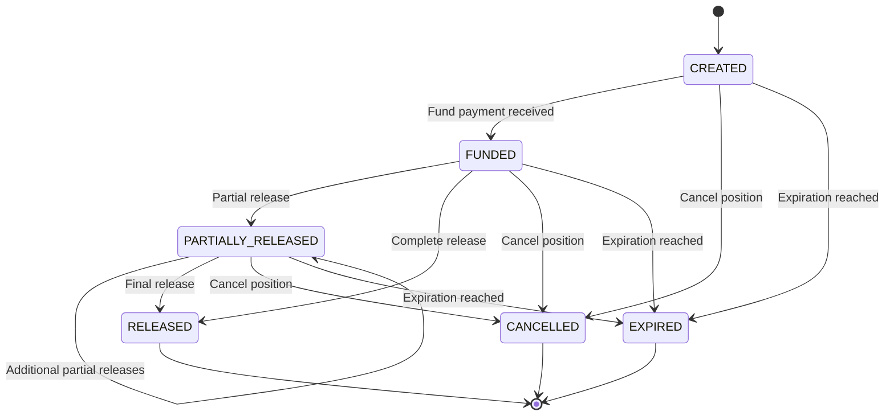
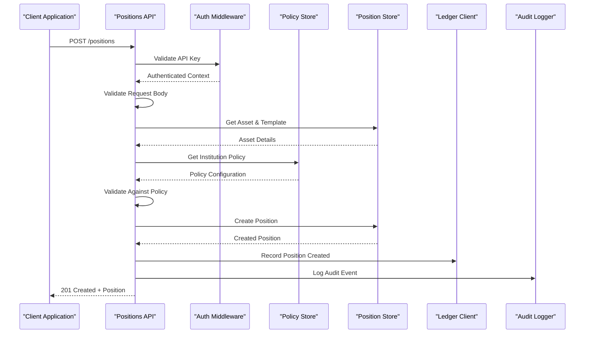
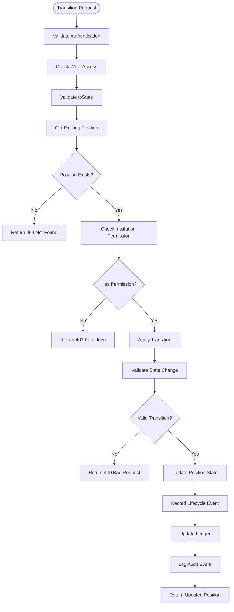
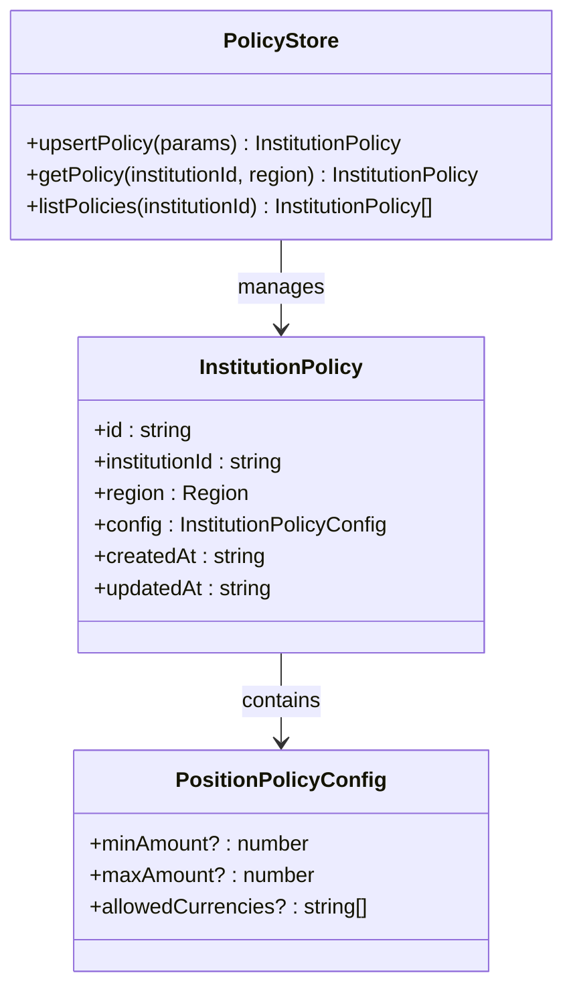
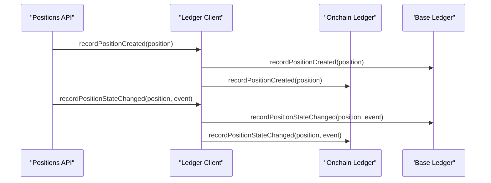
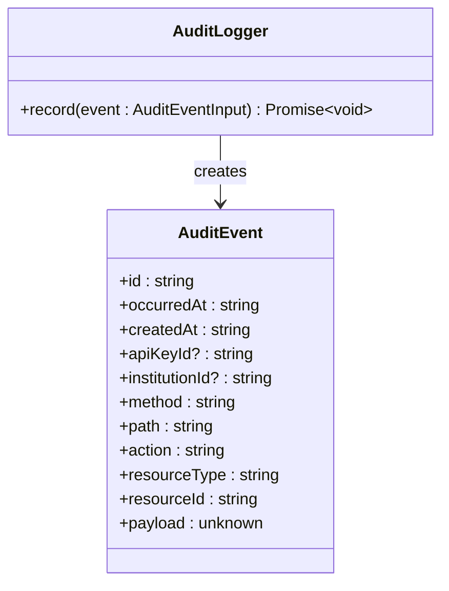
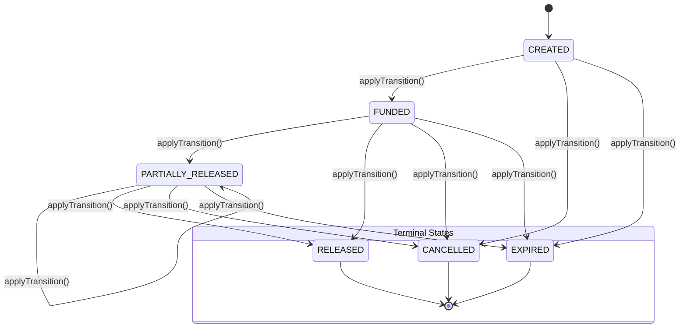

# Positions API

<cite>
**Referenced Files in This Document**
- [src/api/positions.ts](file://src/api/positions.ts)
- [src/domain/types.ts](file://src/domain/types.ts)
- [src/domain/lifecycle.ts](file://src/domain/lifecycle.ts)
- [src/domain/policy.ts](file://src/domain/policy.ts)
- [src/infra/policyStore.ts](file://src/infra/policyStore.ts)
- [src/infra/ledgerClient.ts](file://src/infra/ledgerClient.ts)
- [src/infra/auditLogger.ts](file://src/infra/auditLogger.ts)
- [src/store/postgresStore.ts](file://src/store/postgresStore.ts)
- [src/middleware/auth.ts](file://src/middleware/auth.ts)
- [src/server.ts](file://src/server.ts)
- [src/openapi.ts](file://src/openapi.ts)
</cite>

## Table of Contents
1. [Introduction](#introduction)
2. [API Overview](#api-overview)
3. [Authentication Requirements](#authentication-requirements)
4. [Position Lifecycle States](#position-lifecycle-states)
5. [POST /positions - Create Position](#post-positions---create-position)
6. [GET /positions - List Positions](#get-positions---list-positions)
7. [GET /positions/:id - Get Position](#get-positionsid---get-position)
8. [POST /positions/:id/transition - Transition Position](#post-positionsidtransition---transition-position)
9. [Error Handling](#error-handling)
10. [Integration Components](#integration-components)
11. [Examples](#examples)
12. [Troubleshooting](#troubleshooting)

## Introduction

The Positions API provides comprehensive endpoints for managing escrow positions within the EscrowGrid Tokenization-as-a-Service (TAAS) platform. Positions represent financial commitments or obligations that are tracked through a defined lifecycle with strict state transitions and policy enforcement mechanisms.

The API follows RESTful principles and implements robust authentication, authorization, and audit logging to ensure secure and compliant position management. All operations are integrated with policy enforcement, ledger recording, and comprehensive audit trails.

## API Overview

The Positions API consists of four primary endpoints:

| Endpoint | Method | Description |
|----------|--------|-------------|
| `/positions` | POST | Create a new position with validation and policy enforcement |
| `/positions` | GET | List positions with filtering capabilities |
| `/positions/:id` | GET | Retrieve a specific position by ID |
| `/positions/:id/transition` | POST | Apply lifecycle transitions to positions |

All endpoints require authentication and implement role-based access control with support for both root and institution-level permissions.

## Authentication Requirements

The Positions API implements a hierarchical authentication system:

### Authentication Methods
- **API Key Header**: `X-API-KEY: <your-api-key>`
- **Bearer Token**: `Authorization: Bearer <your-token>`

### Role-Based Access Control
- **Root Role**: Full administrative privileges across all institutions
- **Admin Role**: Administrative privileges within assigned institution
- **Read-Only Role**: Limited to GET operations only

### Permission Matrix

| Operation | Root | Admin | Read-Only |
|-----------|------|-------|-----------|
| Create Position | ✅ | ✅ | ❌ |
| List Positions | ✅ | ✅ | ✅ |
| Get Position | ✅ | ✅ | ✅ |
| Transition Position | ✅ | ✅ | ❌ |

**Section sources**
- [src/middleware/auth.ts](file://src/middleware/auth.ts#L1-L95)

## Position Lifecycle States

Positions progress through a well-defined lifecycle with strict state transitions:



**Diagram sources**
- [src/domain/lifecycle.ts](file://src/domain/lifecycle.ts#L3-L10)

### State Definitions

| State | Description | Allowed Transitions |
|-------|-------------|-------------------|
| `CREATED` | Initial state after position creation | `FUNDED`, `CANCELLED`, `EXPIRED` |
| `FUNDED` | Funds have been deposited | `PARTIALLY_RELEASED`, `RELEASED`, `CANCELLED`, `EXPIRED` |
| `PARTIALLY_RELEASED` | Partial funds released | `PARTIALLY_RELEASED`, `RELEASED`, `CANCELLED`, `EXPIRED` |
| `RELEASED` | All funds released | Terminal state |
| `CANCELLED` | Position cancelled | Terminal state |
| `EXPIRED` | Position expired | Terminal state |

**Section sources**
- [src/domain/types.ts](file://src/domain/types.ts#L38-L44)
- [src/domain/lifecycle.ts](file://src/domain/lifecycle.ts#L3-L10)

## POST /positions - Create Position

Creates a new escrow position with comprehensive validation and policy enforcement.

### Request Schema

```typescript
interface CreatePositionBody {
  institutionId?: string;        // Required for root users, ignored otherwise
  assetId: string;               // Reference to asset being held
  holderReference: string;       // Unique identifier for the position holder
  currency: string;              // Currency code (e.g., USD, EUR)
  amount: number;                // Numeric amount greater than zero
  externalReference?: string;    // Optional external system reference
}
```

### Validation Rules

| Field | Requirement | Validation |
|-------|-------------|------------|
| `assetId` | Required | Must reference a valid asset within the institution |
| `holderReference` | Required | Must be unique within the institution |
| `currency` | Required | Must be supported by asset template |
| `amount` | Required | Must be numeric and greater than zero |
| `institutionId` | Conditional | Required for root users, derived from API key otherwise |

### Policy Enforcement

The position creation process enforces institution- and region-specific policies:

1. **Asset Validation**: Verifies asset exists and belongs to the institution
2. **Template Validation**: Ensures asset template is valid and accessible
3. **Currency Validation**: Checks against allowed currencies in policy
4. **Amount Validation**: Validates against min/max amount limits
5. **Region-Specific Rules**: Applies regional compliance requirements

### Response Schemas

**Success (201)**:
```typescript
interface Position {
  id: string;
  institutionId: string;
  assetId: string;
  holderReference: string;
  currency: string;
  amount: number;
  state: PositionState;
  externalReference?: string;
  createdAt: string;
  updatedAt: string;
  events: PositionLifecycleEvent[];
}
```

**Error Responses (400/403)**:
```typescript
interface ApiErrorPayload {
  error: string;
  details?: unknown;
}
```

### Example Request

```bash
curl -X POST https://api.escrowgrid.io/positions \
  -H "Content-Type: application/json" \
  -H "X-API-KEY: your-api-key" \
  -d '{
    "assetId": "ast_abc123",
    "holderReference": "HR-2024-001",
    "currency": "USD",
    "amount": 100000.00,
    "externalReference": "EXT-2024-001"
  }'
```

### Integration Flow



**Diagram sources**
- [src/api/positions.ts](file://src/api/positions.ts#L22-L144)

**Section sources**
- [src/api/positions.ts](file://src/api/positions.ts#L13-L21)
- [src/api/positions.ts](file://src/api/positions.ts#L22-L144)

## GET /positions - List Positions

Retrieves a list of positions with optional filtering capabilities.

### Query Parameters

| Parameter | Type | Description |
|-----------|------|-------------|
| `institutionId` | string | Filter by institution (root only) |
| `assetId` | string | Filter by asset ID |
| `holderReference` | string | Filter by holder reference |

### Access Control

- **Root Users**: Can list positions across all institutions
- **Institution Users**: Can only list positions within their own institution
- **Read-Only Users**: Can list positions with GET access

### Response Schema

```typescript
interface Position[] {
  // Array of Position objects as defined in POST response
}
```

### Filtering Examples

```bash
# List all positions for an institution
curl -H "X-API-KEY: your-api-key" \
  "https://api.escrowgrid.io/positions?institutionId=inst_abc123"

# Filter by asset
curl -H "X-API-KEY: your-api-key" \
  "https://api.escrowgrid.io/positions?assetId=ast_def456"

# Filter by holder reference
curl -H "X-API-KEY: your-api-key" \
  "https://api.escrowgrid.io/positions?holderReference=HR-2024-001"
```

**Section sources**
- [src/api/positions.ts](file://src/api/positions.ts#L154-L191)

## GET /positions/:id - Get Position

Retrieves a specific position by its unique identifier.

### Path Parameters

| Parameter | Type | Description |
|-----------|------|-------------|
| `id` | string | Position ID to retrieve |

### Access Control

- **Root Users**: Can access any position
- **Institution Users**: Can access positions within their institution
- **Read-Only Users**: Can retrieve positions with GET access

### Response Schema

```typescript
interface Position {
  id: string;
  institutionId: string;
  assetId: string;
  holderReference: string;
  currency: string;
  amount: number;
  state: PositionState;
  externalReference?: string;
  createdAt: string;
  updatedAt: string;
  events: PositionLifecycleEvent[];
}
```

### Error Responses

- **404 Not Found**: Position does not exist or access is denied
- **403 Forbidden**: Insufficient permissions to access the position

### Example Request

```bash
curl -H "X-API-KEY: your-api-key" \
  "https://api.escrowgrid.io/positions/pos_abc123"
```

**Section sources**
- [src/api/positions.ts](file://src/api/positions.ts#L194-L212)

## POST /positions/:id/transition - Transition Position

Applies a lifecycle transition to an existing position with state validation and event recording.

### Path Parameters

| Parameter | Type | Description |
|-----------|------|-------------|
| `id` | string | Position ID to transition |

### Request Schema

```typescript
interface TransitionBody {
  toState: PositionState;        // Target state for transition
  reason?: string;               // Optional reason for transition
  metadata?: Record<string, unknown>; // Optional metadata about transition
}
```

### State Transition Validation

The system validates transitions against the allowed state matrix:



**Diagram sources**
- [src/api/positions.ts](file://src/api/positions.ts#L220-L292)

### Response Schema

Returns the updated position with the new state and appended lifecycle event.

### Error Conditions

| Condition | HTTP Status | Error Message |
|-----------|-------------|---------------|
| Invalid `toState` | 400 | "Invalid request body: toState is required" |
| Position not found | 404 | "Position not found" |
| Unauthorized transition | 403 | "Forbidden to transition this position" |
| Invalid state change | 400 | "Invalid transition from [from] to [to]" |
| Policy violation | 400 | "Failed to transition position" |

### Example Request

```bash
curl -X POST https://api.escrowgrid.io/positions/pos_abc123/transition \
  -H "Content-Type: application/json" \
  -H "X-API-KEY: your-api-key" \
  -d '{
    "toState": "FUNDED",
    "reason": "Payment received via wire transfer",
    "metadata": {
      "paymentMethod": "WIRE",
      "reference": "WIRE-2024-001"
    }
  }'
```

### Transition Events

Each successful transition creates a lifecycle event with the following structure:

```typescript
interface PositionLifecycleEvent {
  id: string;                    // Unique event ID
  positionId: string;            // Associated position ID
  fromState: PositionState | null; // Previous state (null for initial state)
  toState: PositionState;        // New state
  reason?: string;               // Reason for transition
  at: string;                    // ISO timestamp
  metadata?: Record<string, unknown>; // Additional metadata
}
```

**Section sources**
- [src/api/positions.ts](file://src/api/positions.ts#L214-L218)
- [src/api/positions.ts](file://src/api/positions.ts#L220-L292)
- [src/domain/lifecycle.ts](file://src/domain/lifecycle.ts#L16-L51)

## Error Handling

The Positions API implements comprehensive error handling with structured error responses and appropriate HTTP status codes.

### Standard Error Response Format

```typescript
interface ApiErrorPayload {
  error: string;                 // Human-readable error message
  details?: unknown;             // Additional error details
}
```

### Common Error Scenarios

| Scenario | HTTP Status | Error Response |
|----------|-------------|----------------|
| Unauthenticated | 401 | `{ "error": "Unauthenticated" }` |
| Invalid API Key | 401 | `{ "error": "Invalid API key" }` |
| Missing Required Fields | 400 | `{ "error": "Invalid request body", "details": "Field X is required" }` |
| Invalid Amount | 400 | `{ "error": "Invalid amount", "details": "amount must be greater than zero" }` |
| Policy Violation | 400 | `{ "error": "Amount below minimum for policy", "details": "minAmount=1000" }` |
| Asset Not Found | 400 | `{ "error": "Asset not found for institution" }` |
| Position Not Found | 404 | `{ "error": "Position not found" }` |
| Forbidden Access | 403 | `{ "error": "Forbidden to access this position" }` |
| Invalid Transition | 400 | `{ "error": "Invalid transition from [from] to [to]" }` |

### Error Categories

#### Authentication & Authorization Errors
- Missing or invalid API key
- Insufficient permissions
- Institution access restrictions

#### Validation Errors
- Required field missing
- Invalid data types
- Business rule violations

#### Resource Errors
- Entity not found
- Access denied
- Resource conflicts

#### System Errors
- Internal server errors
- Database connectivity issues
- Policy evaluation failures

**Section sources**
- [src/api/positions.ts](file://src/api/positions.ts#L37-L51)
- [src/api/positions.ts](file://src/api/positions.ts#L199-L205)
- [src/api/positions.ts](file://src/api/positions.ts#L246-L252)

## Integration Components

The Positions API integrates with several core components to provide comprehensive functionality:

### Policy Store Integration

Policy enforcement occurs through the policy store system:



**Diagram sources**
- [src/infra/policyStore.ts](file://src/infra/policyStore.ts#L14-L23)
- [src/domain/policy.ts](file://src/domain/policy.ts#L3-L22)

### Ledger Integration

Position events are recorded in the ledger system for audit and compliance:



**Diagram sources**
- [src/infra/ledgerClient.ts](file://src/infra/ledgerClient.ts#L8-L37)

### Audit Logging

All position operations are logged for compliance and monitoring:



**Diagram sources**
- [src/infra/auditLogger.ts](file://src/infra/auditLogger.ts#L13-L15)

### State Machine Enforcement

The lifecycle state machine ensures valid transitions:



**Diagram sources**
- [src/domain/lifecycle.ts](file://src/domain/lifecycle.ts#L3-L10)

**Section sources**
- [src/infra/policyStore.ts](file://src/infra/policyStore.ts#L1-L133)
- [src/infra/ledgerClient.ts](file://src/infra/ledgerClient.ts#L1-L64)
- [src/infra/auditLogger.ts](file://src/infra/auditLogger.ts#L1-L109)
- [src/domain/lifecycle.ts](file://src/domain/lifecycle.ts#L1-L51)

## Examples

### Creating a Position

```bash
# Create a new position
curl -X POST https://api.escrowgrid.io/positions \
  -H "Content-Type: application/json" \
  -H "X-API-KEY: your-api-key" \
  -d '{
    "assetId": "ast_abc123",
    "holderReference": "HR-2024-001",
    "currency": "USD",
    "amount": 100000.00,
    "externalReference": "EXT-2024-001"
  }'

# Response:
{
  "id": "pos_xyz789",
  "institutionId": "inst_abc123",
  "assetId": "ast_abc123",
  "holderReference": "HR-2024-001",
  "currency": "USD",
  "amount": 100000.00,
  "state": "CREATED",
  "externalReference": "EXT-2024-001",
  "createdAt": "2024-01-15T10:30:00Z",
  "updatedAt": "2024-01-15T10:30:00Z",
  "events": [
    {
      "id": "ple_abc123",
      "positionId": "pos_xyz789",
      "fromState": null,
      "toState": "CREATED",
      "at": "2024-01-15T10:30:00Z"
    }
  ]
}
```

### Transitioning a Position

```bash
# Transition position to FUNDED state
curl -X POST https://api.escrowgrid.io/positions/pos_xyz789/transition \
  -H "Content-Type: application/json" \
  -H "X-API-KEY: your-api-key" \
  -d '{
    "toState": "FUNDED",
    "reason": "Bank transfer received",
    "metadata": {
      "transferId": "TR-2024-001",
      "amountReceived": 100000.00
    }
  }'

# Response:
{
  "id": "pos_xyz789",
  "institutionId": "inst_abc123",
  "assetId": "ast_abc123",
  "holderReference": "HR-2024-001",
  "currency": "USD",
  "amount": 100000.00,
  "state": "FUNDED",
  "externalReference": "EXT-2024-001",
  "createdAt": "2024-01-15T10:30:00Z",
  "updatedAt": "2024-01-15T11:15:00Z",
  "events": [
    {
      "id": "ple_abc123",
      "positionId": "pos_xyz789",
      "fromState": null,
      "toState": "CREATED",
      "at": "2024-01-15T10:30:00Z"
    },
    {
      "id": "ple_def456",
      "positionId": "pos_xyz789",
      "fromState": "CREATED",
      "toState": "FUNDED",
      "reason": "Bank transfer received",
      "at": "2024-01-15T11:15:00Z",
      "metadata": {
        "transferId": "TR-2024-001",
        "amountReceived": 100000.00
      }
    }
  ]
}
```

### Listing Positions

```bash
# List all positions for an institution
curl -H "X-API-KEY: your-api-key" \
  "https://api.escrowgrid.io/positions?institutionId=inst_abc123"

# Filter by asset
curl -H "X-API-KEY: your-api-key" \
  "https://api.escrowgrid.io/positions?assetId=ast_abc123"

# Filter by holder reference
curl -H "X-API-KEY: your-api-key" \
  "https://api.escrowgrid.io/positions?holderReference=HR-2024-001"
```

### Retrieving a Specific Position

```bash
# Get position details
curl -H "X-API-KEY: your-api-key" \
  "https://api.escrowgrid.io/positions/pos_xyz789"
```

## Troubleshooting

### Common Issues and Solutions

#### Authentication Problems

**Issue**: `401 Unauthorized` responses
**Causes**:
- Missing or incorrect API key
- Expired API key
- Wrong authentication header format

**Solutions**:
- Verify API key is correct and active
- Check authentication header format (`X-API-KEY: <key>` or `Authorization: Bearer <key>`)
- Ensure API key has appropriate permissions

#### Position Creation Failures

**Issue**: `400 Bad Request` during position creation
**Common Causes**:
- Invalid asset ID
- Missing required fields
- Amount validation failure
- Currency not allowed by policy

**Debugging Steps**:
1. Verify asset exists and belongs to your institution
2. Check asset template configuration
3. Review institution policy settings
4. Validate currency against allowed currencies

#### Transition Validation Errors

**Issue**: `400 Bad Request` during state transitions
**Common Causes**:
- Invalid target state
- Position not found
- Insufficient permissions

**Debugging Steps**:
1. Verify current position state
2. Check allowed transitions from current state
3. Confirm position ownership
4. Review transition metadata requirements

#### Permission Denied Issues

**Issue**: `403 Forbidden` responses
**Causes**:
- Institution access restrictions
- Role-based access limitations
- Cross-institution access attempts

**Solutions**:
- Verify API key belongs to correct institution
- Check role permissions (admin vs. read-only)
- Ensure operations are within authorized scope

### Monitoring and Debugging

#### Enable Debug Logging

Enable detailed logging by setting environment variables:

```bash
DEBUG=escrowgrid:* npm start
```

#### Audit Trail Analysis

All position operations are logged in the audit trail. Access audit logs through the audit system for compliance verification.

#### Ledger Verification

Verify position events in the ledger system to ensure proper recording of state changes and compliance requirements.

### Performance Considerations

#### Query Optimization

- Use specific filters when listing positions to reduce database load
- Implement pagination for large result sets
- Cache frequently accessed position data

#### Transaction Management

- Position updates are atomic with proper rollback handling
- Ledger events are recorded synchronously for consistency
- Audit logs are written asynchronously to minimize impact

**Section sources**
- [src/api/positions.ts](file://src/api/positions.ts#L37-L51)
- [src/api/positions.ts](file://src/api/positions.ts#L246-L252)
- [src/domain/lifecycle.ts](file://src/domain/lifecycle.ts#L29-L31)