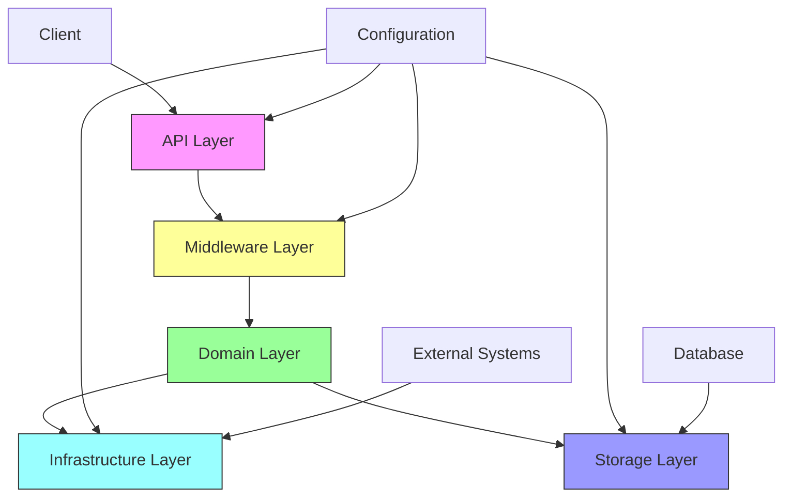
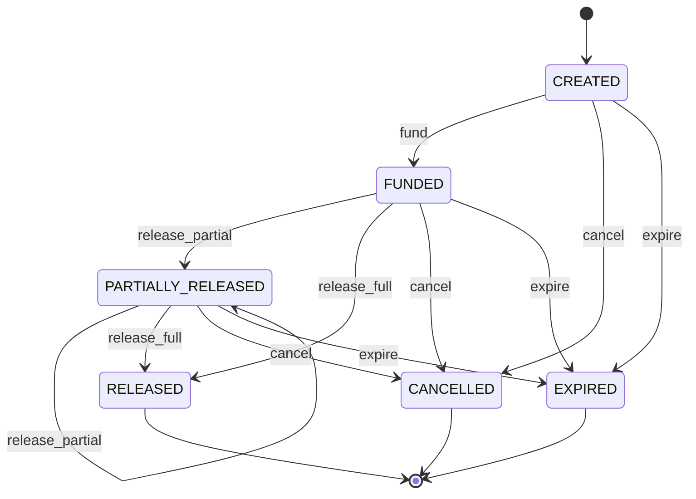
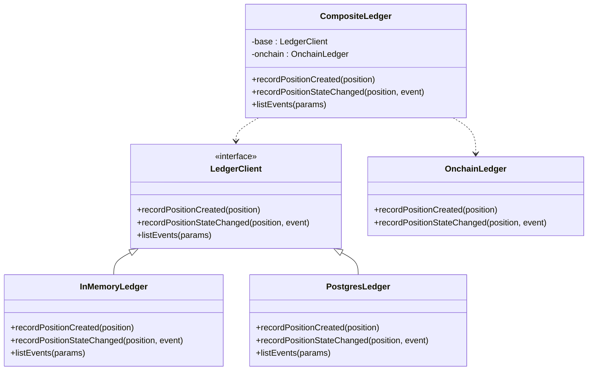
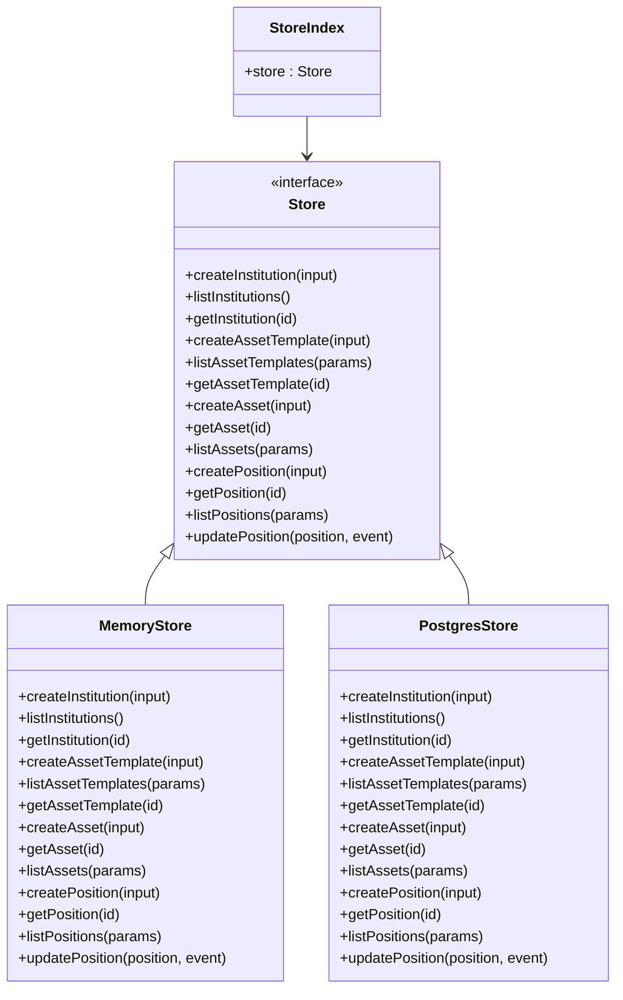
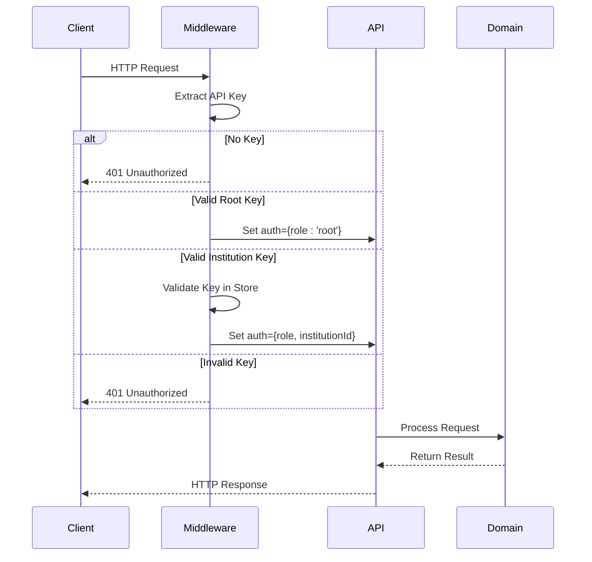
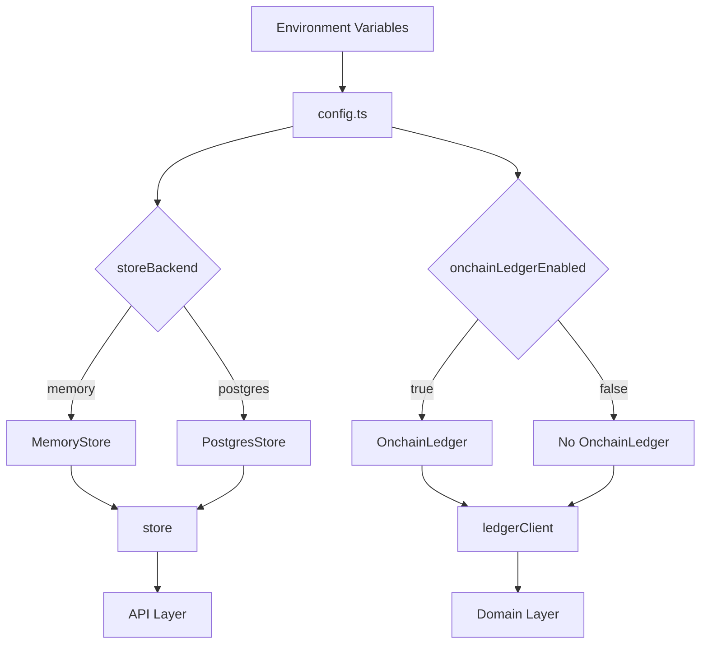
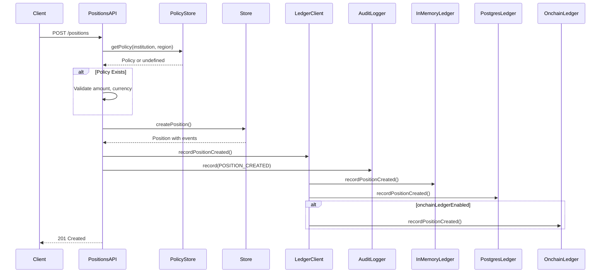

# Backend Architecture

<cite>
**Referenced Files in This Document**   
- [server.ts](file://src/server.ts)
- [config.ts](file://src/config.ts)
- [openapi.ts](file://src/openapi.ts)
- [store/index.ts](file://src/store/index.ts)
- [store/store.ts](file://src/store/store.ts)
- [store/memoryStore.ts](file://src/store/memoryStore.ts)
- [store/postgresStore.ts](file://src/store/postgresStore.ts)
- [api/positions.ts](file://src/api/positions.ts)
- [domain/types.ts](file://src/domain/types.ts)
- [domain/lifecycle.ts](file://src/domain/lifecycle.ts)
- [domain/policy.ts](file://src/domain/policy.ts)
- [middleware/auth.ts](file://src/middleware/auth.ts)
- [middleware/rateLimit.ts](file://src/middleware/rateLimit.ts)
- [infra/ledgerClient.ts](file://src/infra/ledgerClient.ts)
- [infra/policyStore.ts](file://src/infra/policyStore.ts)
- [infra/apiKeyStore.ts](file://src/infra/apiKeyStore.ts)
</cite>

## Table of Contents
1. [Introduction](#introduction)
2. [Project Structure](#project-structure)
3. [Layered Architecture Overview](#layered-architecture-overview)
4. [API Layer](#api-layer)
5. [Domain Layer](#domain-layer)
6. [Infrastructure Layer](#infrastructure-layer)
7. [Storage Layer](#storage-layer)
8. [Middleware Layer](#middleware-layer)
9. [Configuration and Dependency Injection](#configuration-and-dependency-injection)
10. [Component Interactions](#component-interactions)
11. [Technology Stack Implications](#technology-stack-implications)

## Introduction
The EscrowGrid backend implements a layered architecture that separates concerns across API, domain, infrastructure, middleware, and storage components. This architecture enables clear separation of business logic from technical implementation details, supports pluggable storage backends, and facilitates maintainability and testability. The system provides a Tokenization-as-a-Service (TAAS) platform for managing escrowable real-world assets through a well-defined API surface.

## Project Structure
The project follows a feature-based organization with clearly delineated layers. The source code is organized into five main directories under `src/`: `api` for route handlers, `domain` for business logic, `infra` for infrastructure services, `middleware` for cross-cutting concerns, and `store` for data persistence. This structure enforces architectural boundaries and makes the codebase navigable and maintainable.

```mermaid
graph TD
A[src/] --> B[api/]
A --> C[domain/]
A --> D[infra/]
A --> E[middleware/]
A --> F[store/]
A --> G[config.ts]
A --> H[server.ts]
A --> I[openapi.ts]
B --> J[positions.ts]
B --> K[assets.ts]
B --> L[assetTemplates.ts]
B --> M[institutions.ts]
B --> N[ledger.ts]
B --> O[apiKeys.ts]
B --> P[policies.ts]
B --> Q[metrics.ts]
C --> R[types.ts]
C --> S[lifecycle.ts]
C --> T[policy.ts]
C --> U[audit.ts]
C --> V[ledger.ts]
C --> W[verticals.ts]
D --> X[ledgerClient.ts]
D --> Y[apiKeyStore.ts]
D --> Z[policyStore.ts]
D --> AA[auditLogger.ts]
D --> AB[health.ts]
D --> AC[inMemoryLedger.ts]
D --> AD[onchainLedger.ts]
D --> AE[postgresLedger.ts]
E --> AF[auth.ts]
E --> AG[rateLimit.ts]
E --> AH[requestLogger.ts]
F --> AI[index.ts]
F --> AJ[memoryStore.ts]
F --> AK[postgresStore.ts]
F --> AL[store.ts]
```

**Diagram sources**
- [src/api](file://src/api)
- [src/domain](file://src/domain)
- [src/infra](file://src/infra)
- [src/middleware](file://src/middleware)
- [src/store](file://src/store)

**Section sources**
- [src/server.ts](file://src/server.ts#L1-L100)
- [src/config.ts](file://src/config.ts#L1-L47)

## Layered Architecture Overview
The EscrowGrid backend follows a clean architecture pattern with five distinct layers that enforce separation of concerns. The API layer handles HTTP requests and responses, the domain layer contains core business logic, the infrastructure layer manages external integrations, the middleware layer implements cross-cutting concerns, and the storage layer provides data persistence. These layers are connected through dependency injection, with configuration driving implementation choices.

**Diagram sources**
- [src/server.ts](file://src/server.ts#L1-L100)
- [src/config.ts](file://src/config.ts#L1-L47)

**Section sources**
- [src/server.ts](file://src/server.ts#L1-L100)
- [src/config.ts](file://src/config.ts#L1-L47)

## API Layer
The API layer consists of Express routers that handle HTTP requests for different resource types. Each router in `src/api/` corresponds to a specific domain entity and orchestrates interactions between the request, domain logic, and infrastructure services. The API layer validates input, enforces access control through middleware, and returns appropriate responses. Routers are mounted in `server.ts` with consistent URL patterns that reflect the resource hierarchy.

**Section sources**
- [src/server.ts](file://src/server.ts#L4-L17)
- [src/api/positions.ts](file://src/api/positions.ts#L1-L298)

## Domain Layer
The domain layer contains the core business logic and models that define the EscrowGrid system. It includes entity definitions in `types.ts`, the position lifecycle management in `lifecycle.ts`, and policy enforcement logic. The domain layer is independent of infrastructure concerns and focuses on business rules. The position lifecycle implements an event sourcing pattern where state transitions are recorded as events, maintaining a complete history of position changes.

**Diagram sources**
- [src/domain/lifecycle.ts](file://src/domain/lifecycle.ts#L3-L10)
- [src/domain/types.ts](file://src/domain/types.ts#L38-L44)

**Section sources**
- [src/domain/lifecycle.ts](file://src/domain/lifecycle.ts#L1-L51)
- [src/domain/types.ts](file://src/domain/types.ts#L1-L85)

## Infrastructure Layer
The infrastructure layer provides implementations for external services and integrations. It includes the `ledgerClient` for recording ledger events, `apiKeyStore` for API key management, and `policyStore` for institution policies. The infrastructure layer abstracts external dependencies and provides a consistent interface to the domain layer. The composite ledger pattern allows events to be recorded in multiple destinations simultaneously, such as in-memory, PostgreSQL, and on-chain ledgers.

**Diagram sources**
- [src/infra/ledgerClient.ts](file://src/infra/ledgerClient.ts#L8-L37)
- [src/domain/ledger.ts](file://src/domain/ledger.ts)

**Section sources**
- [src/infra/ledgerClient.ts](file://src/infra/ledgerClient.ts#L1-L64)
- [src/infra/policyStore.ts](file://src/infra/policyStore.ts#L1-L133)

## Storage Layer
The storage layer provides a pluggable interface for data persistence with support for both in-memory and PostgreSQL backends. The `Store` interface in `store.ts` defines all data access operations, and implementations are selected at runtime based on configuration. The `index.ts` file implements dependency injection by instantiating the appropriate store based on the `storeBackend` configuration value. This abstraction allows the domain logic to remain unaware of the underlying storage mechanism.

**Diagram sources**
- [src/store/store.ts](file://src/store/store.ts#L4-L59)
- [src/store/index.ts](file://src/store/index.ts#L1-L16)
- [src/store/memoryStore.ts](file://src/store/memoryStore.ts)
- [src/store/postgresStore.ts](file://src/store/postgresStore.ts)

**Section sources**
- [src/store/store.ts](file://src/store/store.ts#L1-L59)
- [src/store/index.ts](file://src/store/index.ts#L1-L16)

## Middleware Layer
The middleware layer implements cross-cutting concerns such as authentication, rate limiting, and request logging. The `auth.ts` file contains authentication middleware that validates API keys and establishes the request context, while `rateLimit.ts` implements rate limiting based on API key or institution. Middleware is applied globally in `server.ts` and provides a consistent security and operational framework across all endpoints. The authentication middleware supports both `X-API-KEY` headers and `Bearer` tokens.

**Diagram sources**
- [src/middleware/auth.ts](file://src/middleware/auth.ts#L35-L82)
- [src/middleware/rateLimit.ts](file://src/middleware/rateLimit.ts#L12-L67)

**Section sources**
- [src/middleware/auth.ts](file://src/middleware/auth.ts#L1-L95)
- [src/middleware/rateLimit.ts](file://src/middleware/rateLimit.ts#L1-L67)

## Configuration and Dependency Injection
Configuration is centralized in `config.ts` which exports an `AppConfig` object populated from environment variables. This configuration drives key architectural decisions such as the storage backend, database connection, and feature flags. Dependency injection is implemented through module-level singletons that are instantiated based on configuration values. The `store` and `ledgerClient` are prime examples of this pattern, where the implementation is selected at startup based on `config.storeBackend` and `config.onchainLedgerEnabled` values.

**Diagram sources**
- [src/config.ts](file://src/config.ts#L18-L38)
- [src/store/index.ts](file://src/store/index.ts#L8-L12)
- [src/infra/ledgerClient.ts](file://src/infra/ledgerClient.ts#L39-L62)

**Section sources**
- [src/config.ts](file://src/config.ts#L1-L47)
- [src/store/index.ts](file://src/store/index.ts#L1-L16)
- [src/infra/ledgerClient.ts](file://src/infra/ledgerClient.ts#L1-L64)

## Component Interactions
The EscrowGrid backend components interact through well-defined interfaces and patterns. When a position creation request is received, the API router validates input, the domain layer enforces business rules through policy checks, the storage layer persists the position, and infrastructure services record ledger events and audit logs. This flow demonstrates the layered architecture in action, with each layer contributing to the overall processing while maintaining separation of concerns.

**Diagram sources**
- [src/api/positions.ts](file://src/api/positions.ts#L22-L145)
- [src/infra/policyStore.ts](file://src/infra/policyStore.ts#L21-L24)
- [src/store/store.ts](file://src/store/store.ts#L39-L46)
- [src/infra/ledgerClient.ts](file://src/infra/ledgerClient.ts#L17-L22)
- [src/infra/auditLogger.ts](file://src/infra/auditLogger.ts)

**Section sources**
- [src/api/positions.ts](file://src/api/positions.ts#L1-L298)
- [src/domain/policy.ts](file://src/domain/policy.ts#L1-L23)

## Technology Stack Implications
The technology stack choices have significant implications for the EscrowGrid architecture. TypeScript provides type safety across the entire stack, enabling robust refactoring and reducing runtime errors. Express offers a lightweight and flexible foundation for the API layer, while PostgreSQL provides reliable, ACID-compliant storage for production deployments. The use of environment variables for configuration enables easy deployment across different environments, and the pluggable storage architecture allows for development and testing with in-memory storage while using PostgreSQL in production. The architecture also supports optional on-chain ledger integration for blockchain-based audit trails.

**Section sources**
- [src/config.ts](file://src/config.ts#L1-L47)
- [package.json](file://package.json)
- [tsconfig.json](file://tsconfig.json)