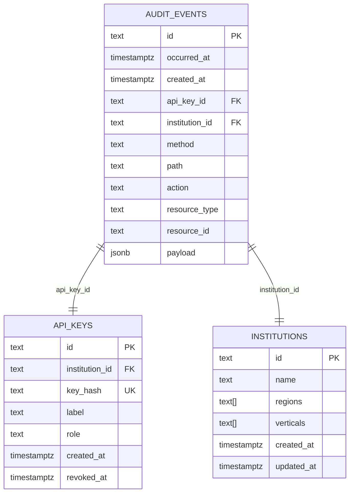

# Audit Logging Framework

<cite>
**Referenced Files in This Document**
- [src/domain/audit.ts](file://src/domain/audit.ts)
- [src/infra/auditLogger.ts](file://src/infra/auditLogger.ts)
- [src/middleware/auth.ts](file://src/middleware/auth.ts)
- [src/api/institutions.ts](file://src/api/institutions.ts)
- [src/api/assets.ts](file://src/api/assets.ts)
- [src/api/positions.ts](file://src/api/positions.ts)
- [db/schema.sql](file://db/schema.sql)
- [src/config.ts](file://src/config.ts)
- [src/store/index.ts](file://src/store/index.ts)
- [src/store/memoryStore.ts](file://src/store/memoryStore.ts)
</cite>

## Table of Contents
1. [Introduction](#introduction)
2. [Architecture Overview](#architecture-overview)
3. [Domain Layer - Audit Event Definitions](#domain-layer---audit-event-definitions)
4. [Infrastructure Layer - Logger Implementation](#infrastructure-layer---logger-implementation)
5. [Integration with API Endpoints](#integration-with-api-endpoints)
6. [Database Schema and Storage](#database-schema-and-storage)
7. [Configuration and Deployment](#configuration-and-deployment)
8. [Performance Considerations](#performance-considerations)
9. [Security and Access Control](#security-and-access-control)
10. [Common Issues and Troubleshooting](#common-issues-and-troubleshooting)
11. [Best Practices](#best-practices)
12. [Conclusion](#conclusion)

## Introduction

The escrowgrid audit logging framework provides a comprehensive solution for capturing and storing operational events across the platform. This framework ensures accountability, compliance, and operational visibility by systematically recording all significant actions performed on institutional, asset, and position resources.

The audit system operates on a pluggable architecture that supports both in-memory and PostgreSQL-based storage backends, enabling flexible deployment scenarios from development environments to production systems. The framework captures detailed contextual information including API key authentication, HTTP method, resource type, and action-specific payload data.

## Architecture Overview

The audit logging framework follows a layered architecture pattern with clear separation between domain specifications and infrastructure implementations:

**Diagram sources**
- [src/domain/audit.ts](file://src/domain/audit.ts#L1-L36)
- [src/infra/auditLogger.ts](file://src/infra/auditLogger.ts#L1-L109)
- [src/middleware/auth.ts](file://src/middleware/auth.ts#L1-L95)

## Domain Layer - Audit Event Definitions

The domain layer defines the core audit event structures and action types that form the foundation of the audit system.

### AuditAction Type

The framework defines six primary audit actions representing critical operational events:

| Action | Description | Trigger Conditions |
|--------|-------------|-------------------|
| `INSTITUTION_CREATED` | New institution creation | Root API key creates an institution |
| `API_KEY_CREATED` | New API key generation | Institution admin creates API keys |
| `ASSET_TEMPLATE_CREATED` | New asset template definition | Institution admin creates templates |
| `ASSET_CREATED` | New asset instantiation | Institution admin creates assets |
| `POSITION_CREATED` | New position establishment | Institution admin creates positions |
| `POSITION_TRANSITIONED` | Position state change | Lifecycle transitions occur |

**Section sources**
- [src/domain/audit.ts](file://src/domain/audit.ts#L3-L9)

### AuditEventInput Interface

The `AuditEventInput` interface captures the essential information required for audit event recording:

**Diagram sources**
- [src/domain/audit.ts](file://src/domain/audit.ts#L11-L20)
- [src/middleware/auth.ts](file://src/middleware/auth.ts#L8-L12)

### AuditEvent Interface

The `AuditEvent` interface represents the persisted audit record with additional system-generated fields:

| Field | Type | Description | Purpose |
|-------|------|-------------|---------|
| `id` | string | Unique identifier | Primary key for event lookup |
| `occurredAt` | string | ISO timestamp | Event occurrence time |
| `createdAt` | string | ISO timestamp | Record creation time |
| `apiKeyId` | string \| undefined | API key identifier | Authentication context |
| `institutionId` | string \| undefined | Institution identifier | Authorization context |
| `method` | string | HTTP method | Request method (GET, POST, etc.) |
| `path` | string | Request path | Endpoint URL |
| `action` | AuditAction | Audit action type | Event classification |
| `resourceType` | string \| undefined | Resource category | Asset, position, institution |
| `resourceId` | string \| undefined | Resource identifier | Specific resource ID |
| `payload` | Record<string,unknown> \| undefined | Event data | Action-specific details |

**Section sources**
- [src/domain/audit.ts](file://src/domain/audit.ts#L22-L34)

## Infrastructure Layer - Logger Implementation

The infrastructure layer provides pluggable implementations of the audit logging system, supporting both development and production deployment scenarios.

### AuditLogger Interface

The `AuditLogger` interface defines the contract for all audit logger implementations:

**Diagram sources**
- [src/infra/auditLogger.ts](file://src/infra/auditLogger.ts#L13-L15)
- [src/infra/auditLogger.ts](file://src/infra/auditLogger.ts#L17-L44)
- [src/infra/auditLogger.ts](file://src/infra/auditLogger.ts#L47-L96)

### InMemoryAuditLogger Implementation

The in-memory logger stores audit events in memory arrays and provides console logging for development:

**Key Features:**
- **In-Memory Storage**: Events stored in local array
- **Console Logging**: Structured JSON output for debugging
- **Automatic Timestamps**: Generated timestamps for `occurredAt` and `createdAt`
- **ID Generation**: Random ID generation with audit prefix

**Implementation Details:**
- Uses `Math.random()` for ID generation with prefix
- Emits structured console logs with `type: 'audit'`
- Maintains event ordering through array push operations

**Section sources**
- [src/infra/auditLogger.ts](file://src/infra/auditLogger.ts#L17-L44)

### PostgresAuditLogger Implementation

The PostgreSQL logger provides persistent storage with database-backed reliability:

**Key Features:**
- **Persistent Storage**: Relational database persistence
- **Index Optimization**: Composite indexes for performance
- **JSONB Payloads**: Flexible structured data storage
- **Connection Pooling**: Efficient database connection management

**Database Schema Integration:**
- **Primary Key**: UUID-style identifiers
- **Timestamp Fields**: Separate occurrence and creation timestamps
- **Foreign Key Relationships**: Links to API keys and institutions
- **Composite Indexes**: Optimized for common query patterns

**Section sources**
- [src/infra/auditLogger.ts](file://src/infra/auditLogger.ts#L47-L96)
- [db/schema.sql](file://db/schema.sql#L106-L117)

### Logger Selection Logic

The framework automatically selects the appropriate logger based on configuration:

**Diagram sources**
- [src/infra/auditLogger.ts](file://src/infra/auditLogger.ts#L99-L107)

**Section sources**
- [src/infra/auditLogger.ts](file://src/infra/auditLogger.ts#L99-L107)

## Integration with API Endpoints

The audit logging framework integrates seamlessly with API endpoints to capture operational events automatically.

### Institution Management Audit Events

Institution creation triggers the `INSTITUTION_CREATED` audit event:

**Trigger Point**: POST `/institutions` endpoint
**Authentication**: Root API key required
**Event Details**:
- `action`: `'INSTITUTION_CREATED'`
- `resourceType`: `'institution'`
- `resourceId`: Institution ID
- `payload`: `{ name, regions, verticals }`
- `auth`: Root context with no institution association

**Section sources**
- [src/api/institutions.ts](file://src/api/institutions.ts#L45-L57)

### Asset Management Audit Events

Asset creation generates the `ASSET_CREATED` audit event:

**Trigger Point**: POST `/assets` endpoint
**Authentication**: Write-access API key required
**Event Details**:
- `action`: `'ASSET_CREATED'`
- `resourceType`: `'asset'`
- `resourceId`: Asset ID
- `payload`: `{ institutionId, templateId, label }`
- `auth`: Institution-scoped context

**Section sources**
- [src/api/assets.ts](file://src/api/assets.ts#L68-L79)

### Position Management Audit Events

Position operations trigger two distinct audit events:

**Position Creation (`POSITION_CREATED`)**:
- **Trigger Point**: POST `/positions` endpoint
- **Event Details**: Similar to asset creation with position-specific data

**Position Transitions (`POSITION_TRANSITIONED`)**:
- **Trigger Point**: POST `/positions/:id/transition` endpoint
- **Event Details**: State change information
- `payload`: `{ fromState, toState, reason }`

**Section sources**
- [src/api/positions.ts](file://src/api/positions.ts#L129-L143)
- [src/api/positions.ts](file://src/api/positions.ts#L272-L284)

### Authentication Context Integration

The audit system leverages the authentication middleware to capture contextual information:

**Diagram sources**
- [src/middleware/auth.ts](file://src/middleware/auth.ts#L35-L82)
- [src/api/institutions.ts](file://src/api/institutions.ts#L45-L57)

**Section sources**
- [src/middleware/auth.ts](file://src/middleware/auth.ts#L8-L12)

## Database Schema and Storage

The PostgreSQL database schema provides optimized storage for audit events with comprehensive indexing strategies.

### Audit Events Table Structure

The `audit_events` table captures all audit event data with the following schema:

| Column | Type | Constraints | Purpose |
|--------|------|-------------|---------|
| `id` | TEXT | PRIMARY KEY | Unique event identifier |
| `occurred_at` | TIMESTAMPTZ | NOT NULL | Event occurrence time |
| `created_at` | TIMESTAMPTZ | NOT NULL | Record creation time |
| `api_key_id` | TEXT | FOREIGN KEY | Reference to API key |
| `institution_id` | TEXT | FOREIGN KEY | Reference to institution |
| `method` | TEXT | NOT NULL | HTTP method |
| `path` | TEXT | NOT NULL | Request path |
| `action` | TEXT | NOT NULL | Audit action type |
| `resource_type` | TEXT | NULLABLE | Resource category |
| `resource_id` | TEXT | NULLABLE | Resource identifier |
| `payload` | JSONB | NULLABLE | Structured event data |

**Section sources**
- [db/schema.sql](file://db/schema.sql#L106-L117)

### Indexing Strategy

The schema employs composite indexes for optimal query performance:

**Diagram sources**
- [db/schema.sql](file://db/schema.sql#L106-L117)
- [db/schema.sql](file://db/schema.sql#L94-L101)
- [db/schema.sql](file://db/schema.sql#L3-L10)

### Index Optimization

**Composite Indexes**:
- `(institution_id, occurred_at)`: Optimizes institution-based queries
- `(api_key_id, occurred_at)`: Supports API key activity tracking

**Performance Benefits**:
- Fast chronological queries for audit trails
- Efficient filtering by institution or API key
- Scalable for high-volume audit logging

**Section sources**
- [db/schema.sql](file://db/schema.sql#L120-L124)

## Configuration and Deployment

The audit logging framework supports flexible configuration for different deployment scenarios.

### Environment Configuration

Configuration is managed through environment variables and the central configuration system:

| Variable | Type | Default | Purpose |
|----------|------|---------|---------|
| `STORE_BACKEND` | string | 'memory' | Storage backend selection |
| `DATABASE_URL` | string | undefined | PostgreSQL connection string |
| `ROOT_API_KEY` | string | undefined | Root API key for institution creation |

**Section sources**
- [src/config.ts](file://src/config.ts#L23-L38)

### Deployment Scenarios

**Development Environment**:
- `STORE_BACKEND=memory`: In-memory logging for development
- Console output for immediate feedback
- No database dependencies

**Production Environment**:
- `STORE_BACKEND=postgres`: Persistent PostgreSQL storage
- Full audit trail persistence
- Scalable for enterprise deployments

**Section sources**
- [src/infra/auditLogger.ts](file://src/infra/auditLogger.ts#L101-L107)

### Schema Evolution

The framework supports schema evolution through database migration strategies:

**Version Control**:
- Incremental schema updates
- Backward compatibility maintenance
- Data preservation during migrations

**Migration Strategies**:
- Additive changes (new columns, indexes)
- Non-destructive modifications
- Rollback capability

## Performance Considerations

The audit logging framework is designed to handle high-volume operations while maintaining system performance.

### High-Volume Logging Strategies

**Asynchronous Processing**:
- Non-blocking audit recording
- Immediate response to API requests
- Background event processing

**Batch Operations**:
- Bulk insert operations for PostgreSQL
- Memory-efficient in-memory batching
- Configurable batch sizes

**Connection Management**:
- Connection pooling for PostgreSQL
- Automatic connection reuse
- Graceful connection handling

### Memory Management

**In-Memory Considerations**:
- Event array growth limits
- Periodic cleanup strategies
- Memory leak prevention

**Storage Optimization**:
- JSONB compression for payloads
- Index selectivity optimization
- Query performance monitoring

### Performance Monitoring

**Key Metrics**:
- Audit event throughput
- Storage utilization
- Query response times
- Memory consumption

**Monitoring Strategies**:
- Application metrics collection
- Database performance monitoring
- Alerting for performance degradation

## Security and Access Control

The audit logging framework implements comprehensive security measures to protect sensitive audit data.

### Authentication Integration

Audit events inherit authentication context from API requests:

**Root Access**:
- Root API key events lack institution context
- Administrative oversight capabilities
- System-level audit coverage

**Institution Access**:
- Institution-scoped API keys
- Limited to own resources
- Granular access control

**Section sources**
- [src/middleware/auth.ts](file://src/middleware/auth.ts#L8-L12)

### Data Protection

**Sensitive Data Handling**:
- Minimal payload data capture
- No credential exposure
- Structured data sanitization

**Access Control**:
- Role-based audit access
- Institution isolation
- Audit data confidentiality

### Compliance Considerations

**Regulatory Requirements**:
- Immutable audit trails
- Timestamp accuracy
- Comprehensive event capture
- Data retention policies

**Privacy Protection**:
- Data minimization principles
- Access logging for audit data
- Secure audit data storage

## Common Issues and Troubleshooting

This section addresses frequent issues encountered with the audit logging framework.

### Missing Audit Trails

**Symptoms**:
- Expected audit events not appearing
- Inconsistent audit data
- Missing authentication context

**Root Causes**:
- API key authentication failures
- Audit logger initialization errors
- Database connectivity issues

**Solutions**:
- Verify API key validity and permissions
- Check audit logger configuration
- Monitor database connection status

### Schema Evolution Challenges

**Migration Issues**:
- Existing data compatibility
- Index rebuild requirements
- Performance impact during migration

**Resolution Strategies**:
- Incremental migration approach
- Offline migration preparation
- Performance monitoring during migration

### Log Retention and Cleanup

**Storage Management**:
- Long-term storage costs
- Query performance degradation
- Legal retention requirements

**Strategies**:
- Automated archival processes
- Partitioned table management
- Retention policy enforcement

### Performance Degradation

**Symptoms**:
- Slow API response times
- Database performance issues
- Memory consumption problems

**Diagnosis**:
- Audit event volume monitoring
- Database query analysis
- System resource monitoring

**Optimization**:
- Index optimization
- Connection pool tuning
- Batch processing improvements

## Best Practices

### Audit Event Design

**Event Completeness**:
- Capture all significant operations
- Include sufficient context for investigation
- Maintain event correlation capabilities

**Payload Structure**:
- Consistent data formats
- Minimal sensitive data inclusion
- Structured metadata organization

### Implementation Guidelines

**Error Handling**:
- Graceful failure modes
- Circuit breaker patterns
- Retry mechanisms for transient failures

**Testing Strategies**:
- Unit tests for audit event generation
- Integration tests for logger implementations
- Load testing for high-volume scenarios

### Operational Excellence

**Monitoring and Alerting**:
- Audit event volume monitoring
- Storage capacity alerts
- Performance degradation detection

**Maintenance Procedures**:
- Regular schema optimization
- Backup verification
- Security audit reviews

## Conclusion

The escrowgrid audit logging framework provides a robust, scalable solution for operational event tracking across the platform. Its pluggable architecture supports diverse deployment scenarios while maintaining consistent audit event capture and storage.

The framework's strength lies in its clear separation of concerns, comprehensive event capture, and flexible storage options. By integrating seamlessly with API endpoints and leveraging authentication context, it provides valuable insights into system operations while maintaining security and performance standards.

Key benefits include:
- **Comprehensive Coverage**: Captures all significant operational events
- **Flexible Deployment**: Supports both development and production scenarios
- **Scalable Architecture**: Handles high-volume operations efficiently
- **Security Integration**: Leverages existing authentication infrastructure
- **Compliance Support**: Meets regulatory and organizational requirements

The framework serves as a foundation for operational transparency, security auditing, and system governance, enabling organizations to maintain accountability and operational visibility across their financial technology infrastructure.