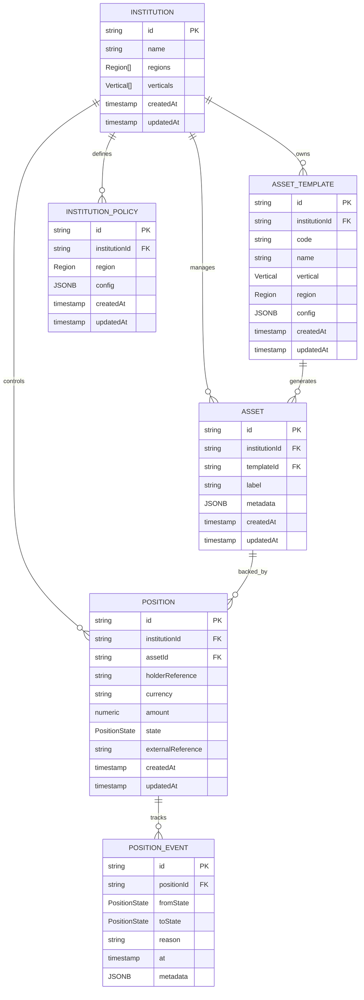
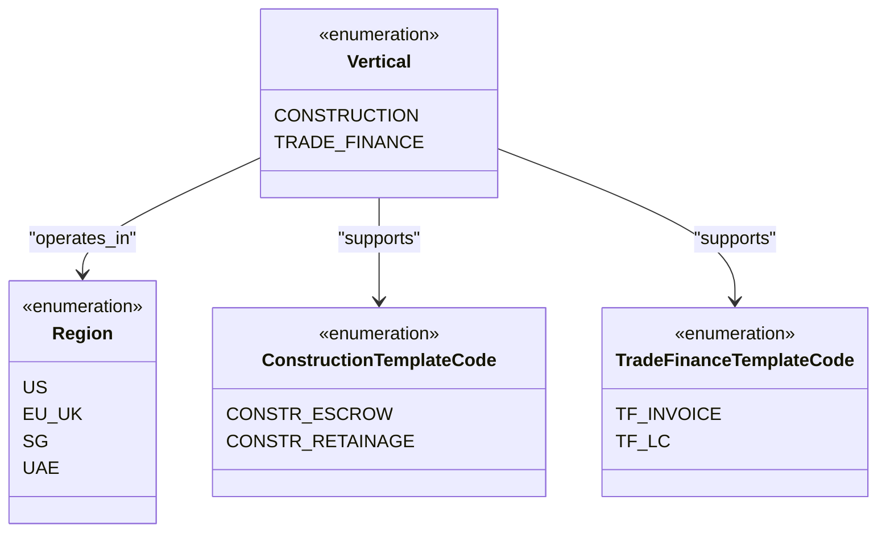
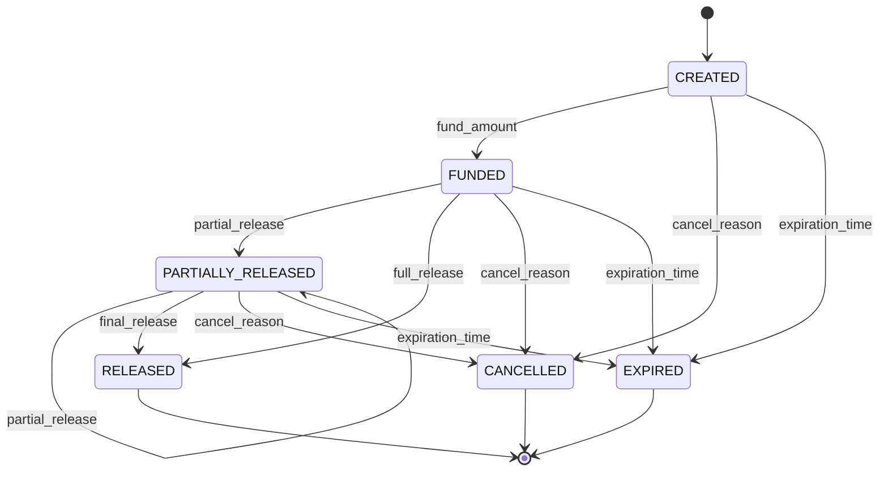
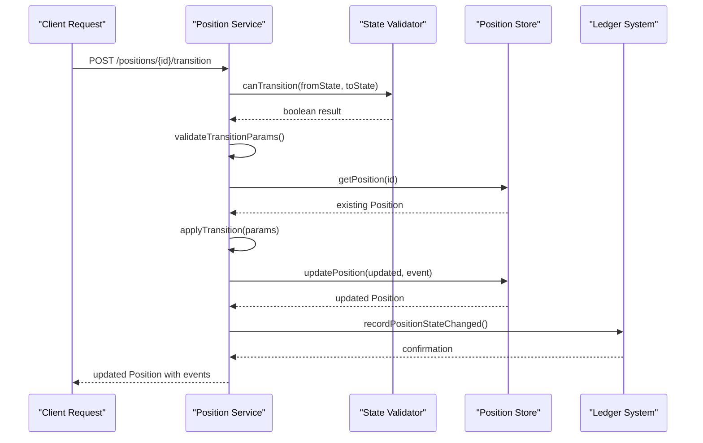
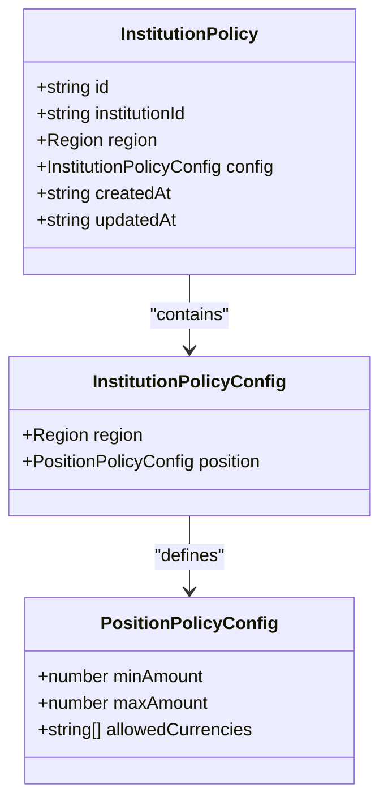
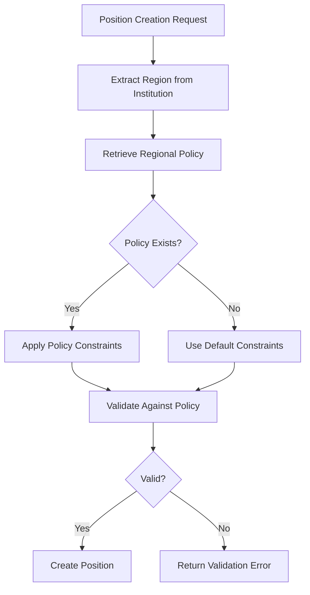
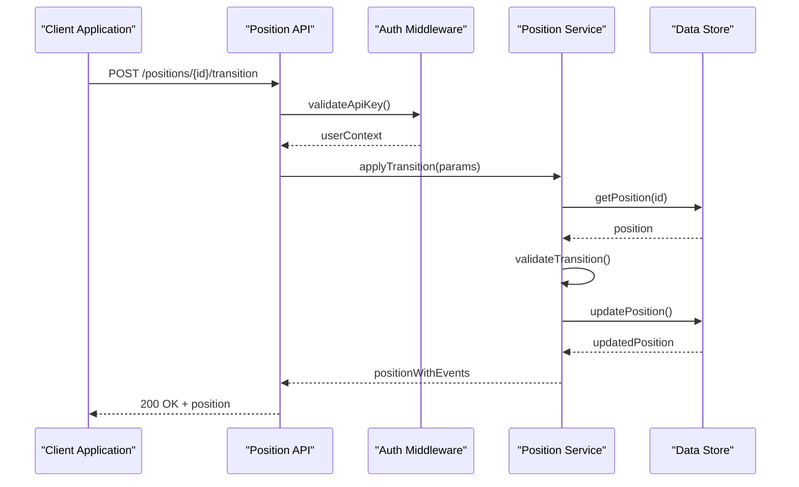
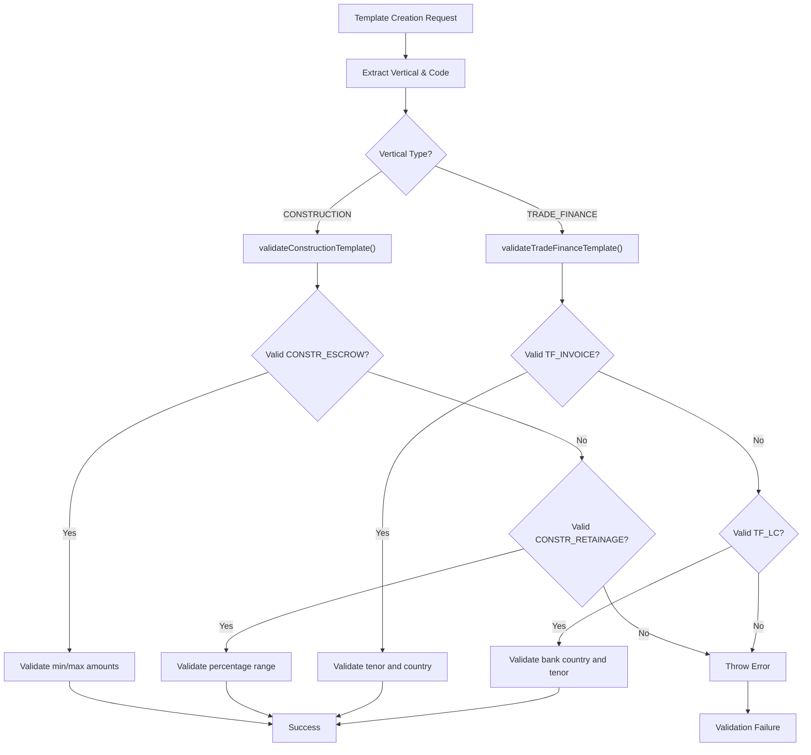

# Domain Data Modeling

<cite>
**Referenced Files in This Document**
- [src/domain/types.ts](file://src/domain/types.ts)
- [src/domain/verticals.ts](file://src/domain/verticals.ts)
- [src/domain/policy.ts](file://src/domain/policy.ts)
- [src/domain/lifecycle.ts](file://src/domain/lifecycle.ts)
- [src/api/assets.ts](file://src/api/assets.ts)
- [src/api/institutions.ts](file://src/api/institutions.ts)
- [src/api/positions.ts](file://src/api/positions.ts)
- [src/api/policies.ts](file://src/api/policies.ts)
- [src/store/store.ts](file://src/store/store.ts)
- [src/store/postgresStore.ts](file://src/store/postgresStore.ts)
- [src/store/memoryStore.ts](file://src/store/memoryStore.ts)
- [src/infra/policyStore.ts](file://src/infra/policyStore.ts)
- [db/schema.sql](file://db/schema.sql)
</cite>

## Table of Contents
1. [Introduction](#introduction)
2. [Core Domain Entities](#core-domain-entities)
3. [TypeScript Interfaces Overview](#typescript-interfaces-overview)
4. [Vertical-Specific Constraints](#vertical-specific-constraints)
5. [Position Lifecycle Management](#position-lifecycle-management)
6. [Policy Configuration Models](#policy-configuration-models)
7. [Data Persistence Layer](#data-persistence-layer)
8. [API Integration Patterns](#api-integration-patterns)
9. [Validation and Business Rules](#validation-and-business-rules)
10. [Extensibility Guidelines](#extensibility-guidelines)
11. [Best Practices](#best-practices)
12. [Troubleshooting Guide](#troubleshooting-guide)

## Introduction

Escrowgrid implements a sophisticated domain-driven architecture with strongly-typed TypeScript interfaces that enforce business invariants and maintain data integrity across multiple financial verticals. The platform supports construction and trade finance verticals, each with specialized asset templates, position states, and regulatory constraints.

The domain model follows clean architecture principles, separating concerns between domain entities, business logic, and infrastructure concerns. All core entities are defined as TypeScript interfaces with strict type enforcement, ensuring compile-time safety and runtime validation.

## Core Domain Entities

The escrowgrid platform revolves around five primary domain entities that form the foundation of the financial escrow system:



**Diagram sources**
- [src/domain/types.ts](file://src/domain/types.ts#L7-L85)
- [src/domain/policy.ts](file://src/domain/policy.ts#L1-L23)
- [db/schema.sql](file://db/schema.sql#L3-L138)

**Section sources**
- [src/domain/types.ts](file://src/domain/types.ts#L7-L85)
- [src/domain/policy.ts](file://src/domain/policy.ts#L1-L23)

## TypeScript Interfaces Overview

### Institution Entity

The Institution entity represents a financial institution or regulatory body that operates within the escrowgrid platform. Institutions define their operational scope through regions and supported verticals.

| Field | Type | Required | Description |
|-------|------|----------|-------------|
| `id` | `string` | Yes | Unique identifier for the institution |
| `name` | `string` | Yes | Human-readable name of the institution |
| `regions` | `Region[]` | Yes | Geographic regions where the institution operates |
| `verticals` | `Vertical[]` | Yes | Supported financial verticals (default: both CONSTRUCTION and TRADE_FINANCE) |
| `createdAt` | `string` | Yes | ISO 8601 timestamp of creation |
| `updatedAt` | `string` | Yes | ISO 8601 timestamp of last modification |

### AssetTemplate Entity

Asset templates define standardized configurations for financial instruments within specific verticals and regions. They serve as blueprints for creating assets.

| Field | Type | Required | Description |
|-------|------|----------|-------------|
| `id` | `string` | Yes | Unique identifier for the template |
| `institutionId` | `string` | Yes | Reference to owning institution |
| `code` | `string` | Yes | Template identifier code |
| `name` | `string` | Yes | Human-readable template name |
| `vertical` | `Vertical` | Yes | Target financial vertical |
| `region` | `Region` | Yes | Geographic region constraint |
| `config` | `Record<string, unknown>` | Yes | JSON-serializable configuration object |
| `createdAt` | `string` | Yes | ISO 8601 timestamp of creation |
| `updatedAt` | `string` | Yes | ISO 8601 timestamp of last modification |

### Asset Entity

Assets represent instantiated financial instruments created from asset templates. They carry specific metadata and institutional context.

| Field | Type | Required | Description |
|-------|------|----------|-------------|
| `id` | `string` | Yes | Unique identifier for the asset |
| `institutionId` | `string` | Yes | Reference to owning institution |
| `templateId` | `string` | Yes | Reference to parent template |
| `label` | `string` | Yes | Human-readable asset label |
| `metadata` | `Record<string, unknown>` | Yes | JSON-serializable metadata |
| `createdAt` | `string` | Yes | ISO 8601 timestamp of creation |
| `updatedAt` | `string` | Yes | ISO 8601 timestamp of last modification |

### Position Entity

Positions represent individual escrow agreements with complete lifecycle tracking. They are the core business entity in the escrowgrid system.

| Field | Type | Required | Description |
|-------|------|----------|-------------|
| `id` | `string` | Yes | Unique identifier for the position |
| `institutionId` | `string` | Yes | Reference to owning institution |
| `assetId` | `string` | Yes | Reference to backing asset |
| `holderReference` | `string` | Yes | External reference for position holder |
| `currency` | `string` | Yes | ISO currency code |
| `amount` | `number` | Yes | Numeric amount with precision |
| `state` | `PositionState` | Yes | Current lifecycle state |
| `externalReference` | `string` | No | Additional external reference |
| `createdAt` | `string` | Yes | ISO 8601 timestamp of creation |
| `updatedAt` | `string` | Yes | ISO 8601 timestamp of last modification |
| `events` | `PositionLifecycleEvent[]` | Yes | Complete lifecycle history |

### PositionLifecycleEvent Entity

Lifecycle events track state transitions and provide audit trail for position modifications.

| Field | Type | Required | Description |
|-------|------|----------|-------------|
| `id` | `string` | Yes | Unique identifier for the event |
| `positionId` | `string` | Yes | Reference to parent position |
| `fromState` | `PositionState \| null` | Yes | Previous state (null for creation) |
| `toState` | `PositionState` | Yes | New state |
| `reason` | `string \| undefined` | No | Reason for state change |
| `at` | `string` | Yes | ISO 8601 timestamp of transition |
| `metadata` | `Record<string, unknown> \| undefined` | No | Additional event metadata |

**Section sources**
- [src/domain/types.ts](file://src/domain/types.ts#L7-L85)

## Vertical-Specific Constraints

The platform supports two primary financial verticals, each with specialized template codes and validation rules.

### Vertical Types



**Diagram sources**
- [src/domain/types.ts](file://src/domain/types.ts#L3-L4)
- [src/domain/verticals.ts](file://src/domain/verticals.ts#L3-L6)

### Construction Vertical Constraints

Construction verticals support two template types with specific configuration requirements:

#### CONSTR_ESCROW Template

| Field | Type | Required | Validation Rules |
|-------|------|----------|------------------|
| `currency` | `string` | Yes | Must be valid ISO currency code |
| `region` | `Region` | Yes | Must match template region |
| `minAmount` | `number` | No | Must be positive when provided |
| `maxAmount` | `number` | No | Must be positive when provided |

#### CONSTR_RETAINAGE Template

| Field | Type | Required | Validation Rules |
|-------|------|----------|------------------|
| `currency` | `string` | Yes | Must be valid ISO currency code |
| `retainagePercentage` | `number` | Yes | Must be between 0 and 100 |

### Trade Finance Vertical Constraints

Trade finance verticals support invoice and letter of credit templates:

#### TF_INVOICE Template

| Field | Type | Required | Validation Rules |
|-------|------|----------|------------------|
| `currency` | `string` | Yes | Must be valid ISO currency code |
| `maxTenorDays` | `number` | Yes | Must be positive integer |
| `country` | `string` | Yes | Must be valid country code |

#### TF_LC Template

| Field | Type | Required | Validation Rules |
|-------|------|----------|------------------|
| `currency` | `string` | Yes | Must be valid ISO currency code |
| `issuingBankCountry` | `string` | Yes | Must be valid country code |
| `maxTenorDays` | `number` | Yes | Must be positive integer |

**Section sources**
- [src/domain/verticals.ts](file://src/domain/verticals.ts#L1-L125)

## Position Lifecycle Management

The position lifecycle follows a finite state machine with predefined transition rules and validation logic.

### Position States



**Diagram sources**
- [src/domain/lifecycle.ts](file://src/domain/lifecycle.ts#L3-L10)

### Allowed Transitions

The system enforces strict state transition rules through the `canTransition` function:

| From State | Allowed To States |
|------------|-------------------|
| `CREATED` | `FUNDED`, `CANCELLED`, `EXPIRED` |
| `FUNDED` | `PARTIALLY_RELEASED`, `RELEASED`, `CANCELLED`, `EXPIRED` |
| `PARTIALLY_RELEASED` | `PARTIALLY_RELEASED`, `RELEASED`, `CANCELLED`, `EXPIRED` |
| `RELEASED` | None (terminal state) |
| `CANCELLED` | None (terminal state) |
| `EXPIRED` | None (terminal state) |

### Lifecycle Event Processing

The `applyTransition` function handles state changes with comprehensive validation:



**Diagram sources**
- [src/api/positions.ts](file://src/api/positions.ts#L258-L296)
- [src/domain/lifecycle.ts](file://src/domain/lifecycle.ts#L16-L51)

**Section sources**
- [src/domain/lifecycle.ts](file://src/domain/lifecycle.ts#L1-L51)

## Policy Configuration Models

Institution policies define regional constraints and operational rules that govern position creation and management.

### Policy Structure



**Diagram sources**
- [src/domain/policy.ts](file://src/domain/policy.ts#L1-L23)

### Policy Fields and Validation

| Field | Type | Required | Description |
|-------|------|----------|-------------|
| `minAmount` | `number \| undefined` | No | Minimum position amount for the region |
| `maxAmount` | `number \| undefined` | No | Maximum position amount for the region |
| `allowedCurrencies` | `string[] \| undefined` | No | List of permitted ISO currency codes |

### Regional Policy Application

Policies are applied at the institution-region level, allowing granular control over operational constraints:



**Diagram sources**
- [src/api/policies.ts](file://src/api/policies.ts#L101-L129)
- [src/infra/policyStore.ts](file://src/infra/policyStore.ts#L66-L110)

**Section sources**
- [src/domain/policy.ts](file://src/domain/policy.ts#L1-L23)
- [src/api/policies.ts](file://src/api/policies.ts#L1-L129)

## Data Persistence Layer

The platform implements a dual-store architecture supporting both PostgreSQL and in-memory storage backends.

### Store Interface Definition

The [`Store`](file://src/store/store.ts#L4-L57) interface defines the contract for all persistence operations:

| Operation Category | Methods | Purpose |
|-------------------|---------|---------|
| Institution CRUD | `createInstitution`, `listInstitutions`, `getInstitution` | Manage financial institutions |
| Asset Template CRUD | `createAssetTemplate`, `listAssetTemplates`, `getAssetTemplate` | Manage asset configurations |
| Asset CRUD | `createAsset`, `listAssets`, `getAsset` | Manage instantiated assets |
| Position CRUD | `createPosition`, `getPosition`, `listPositions`, `updatePosition` | Manage escrow positions |

### Database Schema Mapping

The PostgreSQL schema mirrors the domain model with appropriate data types and constraints:

| Domain Entity | SQL Table | Key Constraints |
|---------------|-----------|-----------------|
| Institution | `institutions` | Primary key on `id`, unique name constraint |
| AssetTemplate | `asset_templates` | Foreign key to `institutions`, composite unique on `(institution_id, code)` |
| Asset | `assets` | Foreign keys to `institutions` and `asset_templates` |
| Position | `positions` | Foreign keys to `institutions` and `assets`, numeric amount precision |
| PositionEvent | `position_events` | Foreign key to `positions`, JSONB for metadata |
| InstitutionPolicy | `institution_policies` | Composite unique on `(institution_id, region)` |

### Serialization Patterns

The system uses JSON serialization for complex data types:

- **JSONB Columns**: Used for `config` fields in templates and policies
- **Metadata Fields**: Stored as JSONB for flexibility
- **Timestamps**: Stored as `TIMESTAMPTZ` for timezone-aware datetime handling

**Section sources**
- [src/store/store.ts](file://src/store/store.ts#L1-L59)
- [src/store/postgresStore.ts](file://src/store/postgresStore.ts#L61-L95)
- [src/store/memoryStore.ts](file://src/store/memoryStore.ts#L1-L93)
- [db/schema.sql](file://db/schema.sql#L3-L138)

## API Integration Patterns

REST APIs provide standardized interfaces for domain entity manipulation with consistent error handling and authentication.

### Authentication and Authorization

All API endpoints require authentication with role-based access control:

| Role | Permissions |
|------|-------------|
| `root` | Full access to all resources |
| `admin` | Access to own institution resources |
| `read_only` | Read-only access to own institution resources |

### Request/Response Patterns

#### Position State Transitions



**Diagram sources**
- [src/api/positions.ts](file://src/api/positions.ts#L211-L296)

### Error Handling Patterns

The platform implements consistent error response formatting:

| Status Code | Error Structure | Usage |
|-------------|----------------|-------|
| 400 | `{error: string, details?: unknown}` | Bad requests, validation failures |
| 401 | `{error: string}` | Authentication required |
| 403 | `{error: string, details?: unknown}` | Authorization denied |
| 404 | `{error: string}` | Resource not found |
| 500 | `{error: string, details?: unknown}` | Server errors |

**Section sources**
- [src/api/positions.ts](file://src/api/positions.ts#L1-L296)
- [src/api/assets.ts](file://src/api/assets.ts#L1-L147)
- [src/api/institutions.ts](file://src/api/institutions.ts#L1-L115)
- [src/api/policies.ts](file://src/api/policies.ts#L1-L129)

## Validation and Business Rules

The platform implements multi-layered validation to ensure data integrity and business compliance.

### Template Configuration Validation

Template validation occurs during creation and ensures vertical-specific constraints:



**Diagram sources**
- [src/domain/verticals.ts](file://src/domain/verticals.ts#L32-L45)

### Position Creation Validation

Position creation involves multiple validation layers:

1. **Template Existence**: Verify asset template exists and belongs to institution
2. **Policy Compliance**: Check against regional policy constraints
3. **Amount Validation**: Ensure amount falls within policy limits
4. **Currency Validation**: Verify currency is allowed in region
5. **State Initialization**: Set initial state to `CREATED`

### Lifecycle State Validation

State transitions are validated against the finite state machine:

- **Transition Existence**: Check if target state is allowed from current state
- **Reason Validation**: Ensure reason is provided for cancellations/expirations
- **Event Ordering**: Maintain chronological event sequence

**Section sources**
- [src/domain/verticals.ts](file://src/domain/verticals.ts#L47-L125)
- [src/domain/lifecycle.ts](file://src/domain/lifecycle.ts#L12-L31)

## Extensibility Guidelines

The domain model is designed for extensibility while maintaining backward compatibility and type safety.

### Adding New Verticals

To add a new financial vertical:

1. **Extend Vertical Type**: Add new vertical to `Vertical` union type
2. **Define Template Codes**: Create new template code enumeration
3. **Add Configuration Interfaces**: Define vertical-specific configuration interfaces
4. **Implement Validation**: Extend `validateTemplateConfig` function
5. **Update Schema**: Add new vertical constraint to database schema

Example extension pattern:

```typescript
// Step 1: Extend Vertical type
export type Vertical = 'CONSTRUCTION' | 'TRADE_FINANCE' | 'NEW_VERTICAL';

// Step 2: Define template codes
export type NewVerticalTemplateCode = 'NEW_TEMPLATE';

// Step 3: Add configuration interface
export interface NewVerticalConfig {
  // Vertical-specific fields
}

// Step 4: Implement validation
function validateNewVerticalTemplate(
  code: string,
  region: Region,
  config: Record<string, unknown>
): void {
  // Implementation
}

// Step 5: Update validation function
export function validateTemplateConfig(params: {
  vertical: Vertical;
  code: string;
  region: Region;
  config: Record<string, unknown>;
}): void {
  switch (params.vertical) {
    case 'NEW_VERTICAL':
      validateNewVerticalTemplate(params.code, params.region, params.config);
      break;
    // ... existing cases
  }
}
```

### Adding New Position States

To add new position states:

1. **Extend PositionState Union**: Add new state to `PositionState` type
2. **Update Transition Matrix**: Add new state to `allowedTransitions` object
3. **Update Validation Logic**: Ensure new state is handled appropriately

### Adding Regional Constraints

Regional constraints can be extended by:

1. **Enhancing Policy Configuration**: Add new fields to `PositionPolicyConfig`
2. **Updating Validation Logic**: Modify policy validation functions
3. **Extending Database Schema**: Add new columns to `institution_policies` table

### Backward Compatibility Strategies

- **Optional Fields**: Use optional properties for new features
- **Default Values**: Provide sensible defaults for new optional fields
- **Versioned Configurations**: Support multiple configuration formats
- **Graceful Degradation**: Handle unknown field types gracefully

## Best Practices

### Type Safety

- **Strict Null Checks**: Use TypeScript's strict mode for null safety
- **Discriminated Unions**: Leverage discriminated unions for type-safe branching
- **Type Guards**: Implement custom type guards for complex validations
- **Immutable Updates**: Use functional updates for state changes

### Performance Optimization

- **Indexing Strategy**: Proper indexing on foreign keys and frequently queried fields
- **Query Optimization**: Use prepared statements and parameterized queries
- **Caching Layers**: Implement appropriate caching for frequently accessed data
- **Batch Operations**: Support batch operations for bulk data processing

### Security Considerations

- **Input Validation**: Comprehensive validation at API boundaries
- **Authorization Checks**: Role-based access control for all operations
- **Audit Logging**: Complete audit trail for all modifications
- **Rate Limiting**: Implement rate limiting for sensitive operations

### Data Integrity

- **Atomic Operations**: Use transactions for related operations
- **Consistency Checks**: Implement domain-level consistency validation
- **Event Sourcing**: Use event sourcing for complex state changes
- **Backup Strategies**: Regular backups with point-in-time recovery

## Troubleshooting Guide

### Common Issues and Solutions

#### Template Validation Failures

**Problem**: Template creation fails with validation errors
**Causes**:
- Incorrect template code for vertical
- Missing required configuration fields
- Invalid data types in configuration

**Solution**: Review template configuration against vertical-specific requirements

#### Position State Transition Errors

**Problem**: State transitions fail with invalid state errors
**Causes**:
- Attempting invalid state transitions
- Missing required reason for cancellation/expiry
- Concurrent modification conflicts

**Solution**: Verify allowed transitions and provide required metadata

#### Policy Constraint Violations

**Problem**: Position creation fails due to policy constraints
**Causes**:
- Amount exceeds maximum allowed
- Currency not permitted in region
- Insufficient policy configuration

**Solution**: Review and update regional policies to accommodate requirements

#### Database Migration Issues

**Problem**: Schema migration fails or data corruption occurs
**Causes**:
- Incompatible data types
- Missing foreign key constraints
- Index creation failures

**Solution**: Review migration scripts and ensure data consistency

### Debugging Strategies

1. **Enable Debug Logging**: Turn on detailed logging for domain operations
2. **Validate Input Data**: Check API request payloads against interface definitions
3. **Verify Database Constraints**: Ensure database schema matches domain model
4. **Test State Transitions**: Validate lifecycle state machines independently
5. **Review Audit Logs**: Examine audit trails for operation history

### Monitoring and Observability

- **Metrics Collection**: Track API response times and error rates
- **Health Checks**: Implement comprehensive health monitoring
- **Performance Profiling**: Monitor database query performance
- **Error Tracking**: Centralized error reporting and alerting

**Section sources**
- [src/domain/types.ts](file://src/domain/types.ts#L1-L85)
- [src/domain/verticals.ts](file://src/domain/verticals.ts#L1-L125)
- [src/domain/lifecycle.ts](file://src/domain/lifecycle.ts#L1-L51)