# Domain Logic

<cite>
**Referenced Files in This Document**
- [types.ts](file://src/domain/types.ts)
- [lifecycle.ts](file://src/domain/lifecycle.ts)
- [policy.ts](file://src/domain/policy.ts)
- [audit.ts](file://src/domain/audit.ts)
- [verticals.ts](file://src/domain/verticals.ts)
- [ledger.ts](file://src/domain/ledger.ts)
- [positions.ts](file://src/api/positions.ts)
- [policies.ts](file://src/api/policies.ts)
- [auditLogger.ts](file://src/infra/auditLogger.ts)
- [policyStore.ts](file://src/infra/policyStore.ts)
- [ledgerClient.ts](file://src/infra/ledgerClient.ts)
- [store.ts](file://src/store/store.ts)
- [auth.ts](file://src/middleware/auth.ts)
- [config.ts](file://src/config.ts)
</cite>

## Table of Contents
1. [Introduction](#introduction)
2. [Core Domain Models](#core-domain-models)
3. [Position Lifecycle Management](#position-lifecycle-management)
4. [Policy Enforcement System](#policy-enforcement-system)
5. [Audit Logging Framework](#audit-logging-framework)
6. [Vertical and Region Constraints](#vertical-and-region-constraints)
7. [Infrastructure Integration](#infrastructure-integration)
8. [Common Issues and Error Handling](#common-issues-and-error-handling)
9. [Performance Considerations](#performance-considerations)
10. [Event Sourcing Implementation](#event-sourcing-implementation)

## Introduction

The escrowgrid domain logic layer implements a sophisticated financial escrow system with strict business rules, comprehensive audit trails, and multi-tenant governance. The domain layer defines core business concepts including positions, assets, institutions, and their relationships while enforcing complex state transitions, policy compliance, and regulatory constraints.

The system operates on a multi-vertical architecture supporting construction escrow and trade finance applications, with region-specific compliance requirements and institutional governance policies. All business logic is encapsulated within the domain layer, ensuring clean separation from infrastructure concerns.

## Core Domain Models

### Position Model

The Position model represents the central business entity in the escrow system, tracking funds held in escrow with complete lifecycle state management.

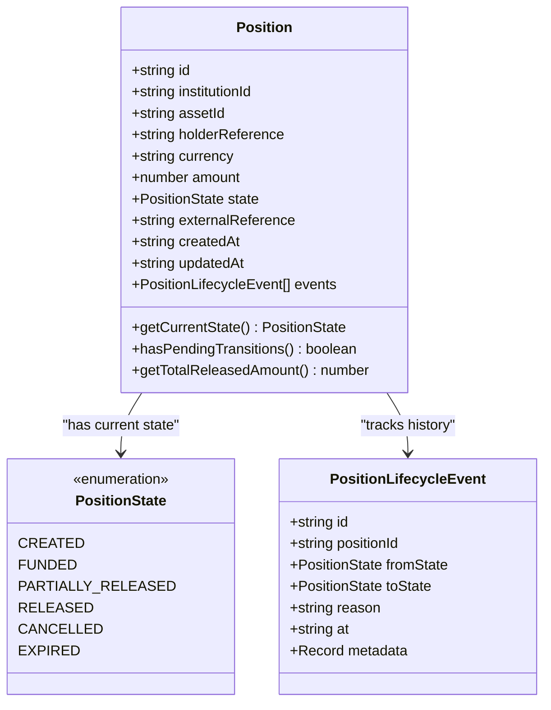

**Diagram sources**
- [types.ts](file://src/domain/types.ts#L38-L68)

### Asset and Institution Models

The system supports hierarchical asset management with template-based configuration and multi-tenant institutional governance.

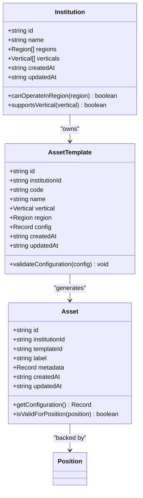

**Diagram sources**
- [types.ts](file://src/domain/types.ts#L7-L68)

**Section sources**
- [types.ts](file://src/domain/types.ts#L1-L85)

## Position Lifecycle Management

### State Transition Engine

The position lifecycle management implements a finite state machine with predefined allowed transitions and comprehensive validation.

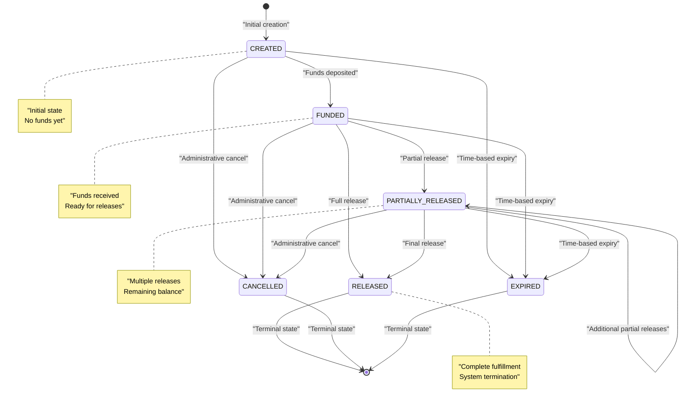

**Diagram sources**
- [lifecycle.ts](file://src/domain/lifecycle.ts#L3-L10)

### Transition Validation Logic

The transition engine enforces business rules and prevents invalid state changes through comprehensive validation.

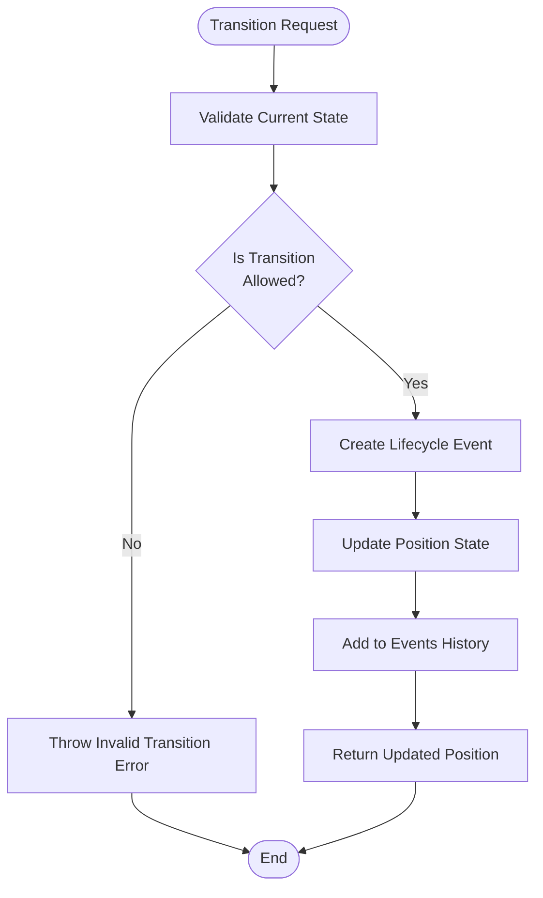

**Diagram sources**
- [lifecycle.ts](file://src/domain/lifecycle.ts#L12-L51)

### Real-world Transition Examples

The system handles various real-world scenarios through its state transition engine:

**Example 1: Standard Escrow Release Workflow**
- Position starts in `CREATED` state
- Funds deposited → transitions to `FUNDED`
- Partial release for milestone completion → transitions to `PARTIALLY_RELEASED`
- Final milestone → transitions to `RELEASED`

**Example 2: Administrative Cancellation**
- Position in `FUNDED` state
- Administrative error discovered → transitions to `CANCELLED`
- Refund process initiated through separate system

**Example 3: Expiration Handling**
- Position in `CREATED` state exceeding timeout
- Automatic transition to `EXPIRED`
- Funds returned to original account

**Section sources**
- [lifecycle.ts](file://src/domain/lifecycle.ts#L1-L51)
- [positions.ts](file://src/api/positions.ts#L220-L298)

## Policy Enforcement System

### Institutional Policy Architecture

The policy system implements region-specific and vertical-specific governance rules with configurable limits and restrictions.

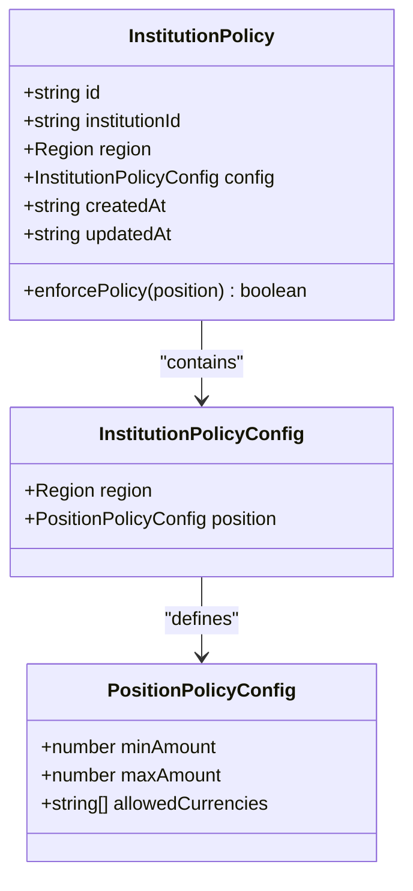

**Diagram sources**
- [policy.ts](file://src/domain/policy.ts#L3-L22)

### Policy Evaluation Process

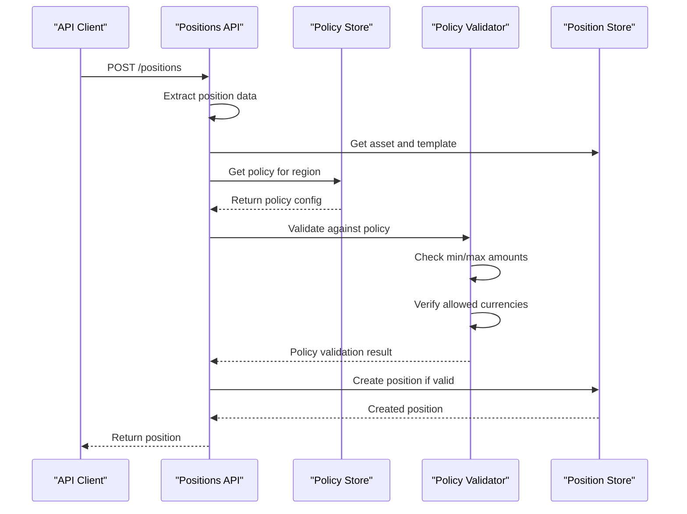

**Diagram sources**
- [positions.ts](file://src/api/positions.ts#L75-L118)
- [policyStore.ts](file://src/infra/policyStore.ts#L14-L24)

### Regional Compliance Matrix

| Region | Supported Verticals | Currency Restrictions | Amount Limits |
|--------|-------------------|---------------------|---------------|
| US | CONSTRUCTION, TRADE_FINANCE | USD, EUR, GBP | Min: $1k, Max: $10M |
| EU_UK | CONSTRUCTION, TRADE_FINANCE | EUR, GBP, USD | Min: €1k, Max: €5M |
| SG | TRADE_FINANCE | SGD, USD, EUR | Min: S$1k, Max: S$50M |
| UAE | TRADE_FINANCE | AED, USD, EUR | Min: AED10k, Max: AED500M |

**Section sources**
- [policy.ts](file://src/domain/policy.ts#L1-L23)
- [policies.ts](file://src/api/policies.ts#L1-L180)
- [policyStore.ts](file://src/infra/policyStore.ts#L1-L133)

## Audit Logging Framework

### Audit Event Architecture

The audit system provides comprehensive tracking of all system activities with structured event logging and compliance reporting capabilities.

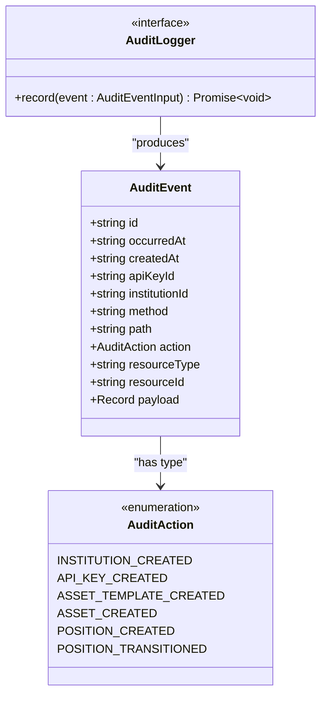

**Diagram sources**
- [audit.ts](file://src/domain/audit.ts#L3-L36)

### Audit Event Types and Triggers

The system automatically generates audit events for all significant operations:

**Position Lifecycle Events**
- `POSITION_CREATED`: New position establishment
- `POSITION_TRANSITIONED`: State changes during lifecycle
- `POSITION_UPDATED`: Metadata modifications

**Institution Management Events**
- `INSTITUTION_CREATED`: New institution registration
- `API_KEY_CREATED`: Authentication credential issuance

**Asset Management Events**
- `ASSET_TEMPLATE_CREATED`: Template definition
- `ASSET_CREATED`: Asset instantiation from templates

### Audit Storage Backends

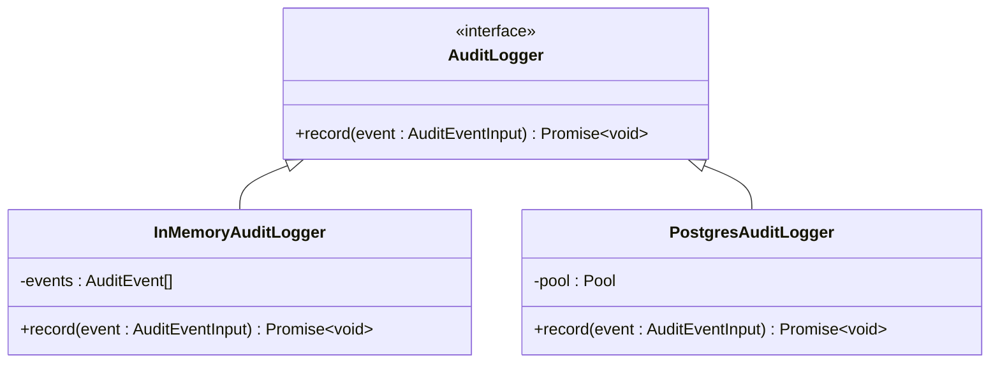

**Diagram sources**
- [auditLogger.ts](file://src/infra/auditLogger.ts#L13-L109)

**Section sources**
- [audit.ts](file://src/domain/audit.ts#L1-L36)
- [auditLogger.ts](file://src/infra/auditLogger.ts#L1-L109)
- [positions.ts](file://src/api/positions.ts#L128-L144)

## Vertical and Region Constraints

### Construction Vertical Specifications

The construction vertical supports specialized escrow configurations for construction projects and retainage arrangements.

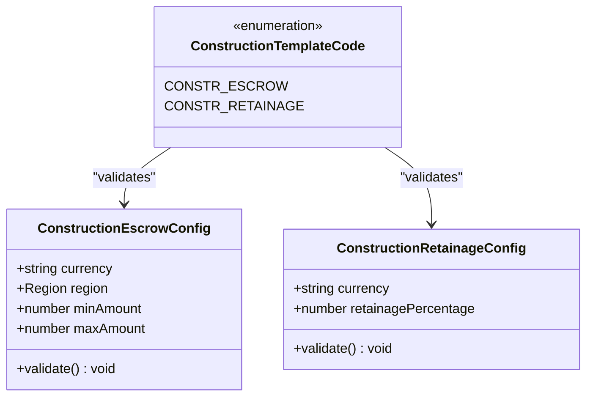

**Diagram sources**
- [verticals.ts](file://src/domain/verticals.ts#L3-L19)

### Trade Finance Vertical Specifications

The trade finance vertical handles invoice financing and letter of credit operations with international banking compliance.

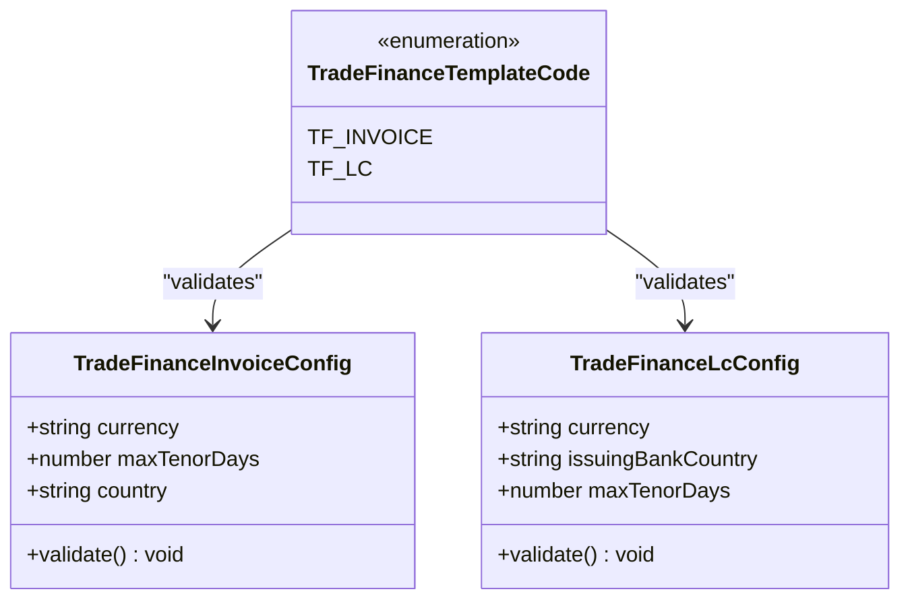

**Diagram sources**
- [verticals.ts](file://src/domain/verticals.ts#L20-L31)

### Template Validation Framework

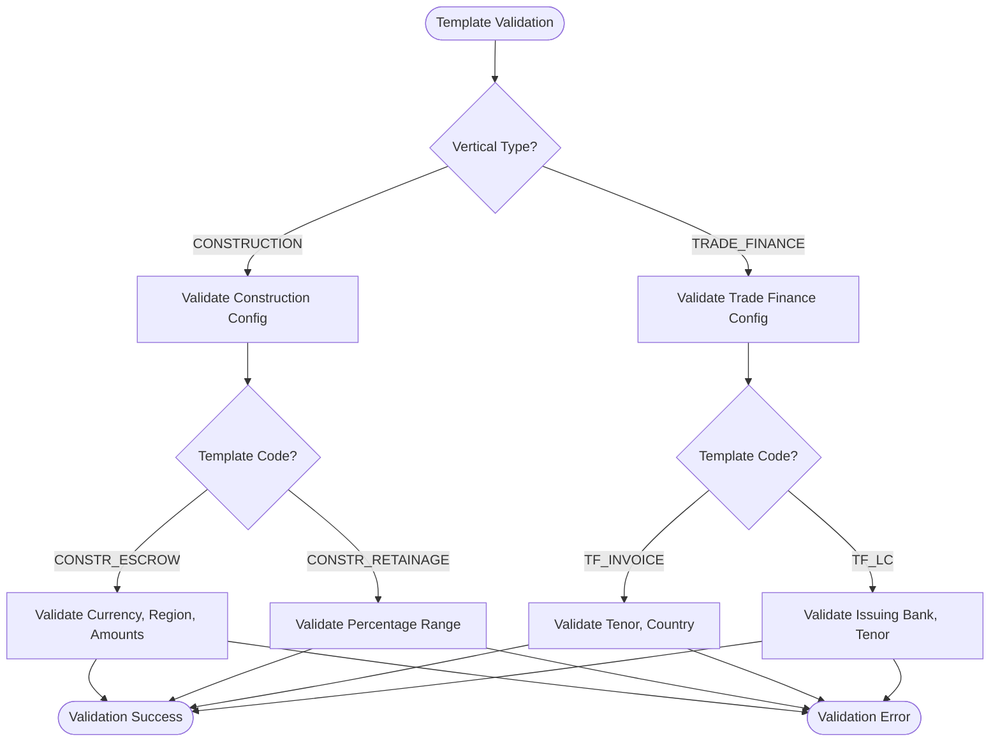

**Diagram sources**
- [verticals.ts](file://src/domain/verticals.ts#L32-L125)

**Section sources**
- [verticals.ts](file://src/domain/verticals.ts#L1-L125)

## Infrastructure Integration

### Domain-Infrastructure Layer Communication

The domain logic integrates seamlessly with infrastructure services through well-defined interfaces and dependency injection patterns.

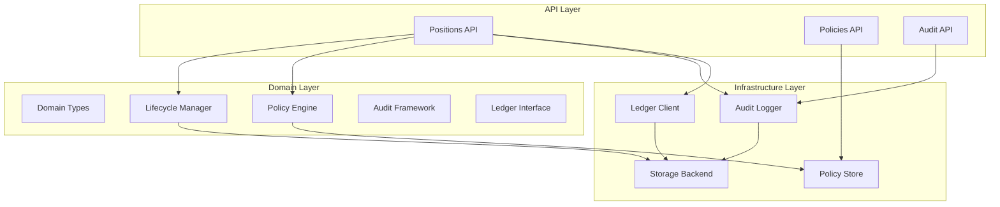

**Diagram sources**
- [positions.ts](file://src/api/positions.ts#L1-L10)
- [policies.ts](file://src/api/policies.ts#L1-L5)
- [auditLogger.ts](file://src/infra/auditLogger.ts#L1-L10)

### Store Abstraction Pattern

The system uses a store abstraction to support multiple persistence backends while maintaining domain logic independence.

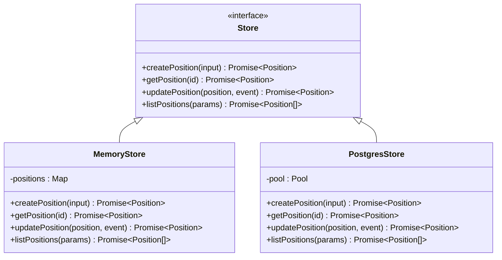

**Diagram sources**
- [store.ts](file://src/store/store.ts#L4-L58)

### Ledger Integration Patterns

The ledger system provides event sourcing capabilities with both local and blockchain storage options.

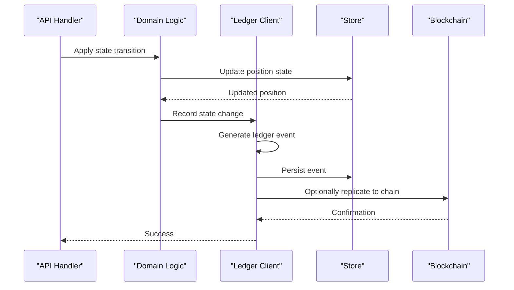

**Diagram sources**
- [ledgerClient.ts](file://src/infra/ledgerClient.ts#L8-L37)
- [positions.ts](file://src/api/positions.ts#L268-L271)

**Section sources**
- [store.ts](file://src/store/store.ts#L1-L59)
- [ledgerClient.ts](file://src/infra/ledgerClient.ts#L1-L64)
- [positions.ts](file://src/api/positions.ts#L1-L298)

## Common Issues and Error Handling

### Invalid State Transitions

The system handles various error scenarios through comprehensive validation and clear error messaging.

**Common Transition Errors:**
- Attempting to transition from `RELEASED` to any other state
- Transitioning from `CREATED` to `PARTIALLY_RELEASED` (invalid intermediate state)
- Circular transitions between same states

**Error Handling Pattern:**
```typescript
// Example error handling from lifecycle.ts
if (!canTransition(position.state, toState)) {
  throw new Error(`Invalid transition from ${position.state} to ${toState}`);
}
```

### Policy Violation Scenarios

Policy violations trigger specific error responses with detailed context:

**Amount Constraint Violations:**
- Amount below minimum threshold
- Amount exceeding maximum limit
- Currency not permitted by policy

**Regional Compliance Errors:**
- Asset template not available in region
- Institution lacks regional authorization
- Vertical not supported in region

### Authentication and Authorization Issues

The system implements multi-tier access control with clear error responses:

**Authentication Failures:**
- Missing API key header
- Invalid API key format
- Expired or revoked credentials

**Authorization Errors:**
- Insufficient permissions for operation
- Cross-institution access attempts
- Role-based access restrictions

**Section sources**
- [lifecycle.ts](file://src/domain/lifecycle.ts#L28-L31)
- [positions.ts](file://src/api/positions.ts#L45-L118)
- [auth.ts](file://src/middleware/auth.ts#L1-L95)

## Performance Considerations

### Rule Evaluation Optimization

The domain logic implements several performance optimization strategies:

**State Transition Caching:**
- Allowed transitions pre-computed in static lookup tables
- No runtime computation overhead for state validation
- O(1) complexity for transition validity checks

**Policy Evaluation Efficiency:**
- Lazy loading of policy configurations
- Regional caching of frequently accessed policies
- Minimal database queries for policy lookups

**Template Validation Performance:**
- Compile-time validation rule generation
- Early exit patterns for invalid configurations
- Efficient type checking and constraint validation

### Event Sourcing Performance

The event sourcing implementation optimizes for high-throughput scenarios:

**Batch Processing:**
- Multiple events processed in single database transaction
- Bulk ledger event recording
- Optimized event replay mechanisms

**Indexing Strategies:**
- Position ID indexing for fast lookups
- Timestamp-based event ordering
- Composite indexes for complex queries

**Memory Management:**
- Event streaming for large datasets
- Garbage collection optimization
- Efficient serialization/deserialization

### Scalability Considerations

**Horizontal Scaling:**
- Stateless domain logic enables easy horizontal scaling
- Shared infrastructure services for coordination
- Distributed policy caching strategies

**Resource Optimization:**
- Connection pooling for database operations
- Async processing for non-critical operations
- Efficient logging and monitoring integration

## Event Sourcing Implementation

### Event Structure and Persistence

The system implements comprehensive event sourcing with structured event persistence and replay capabilities.

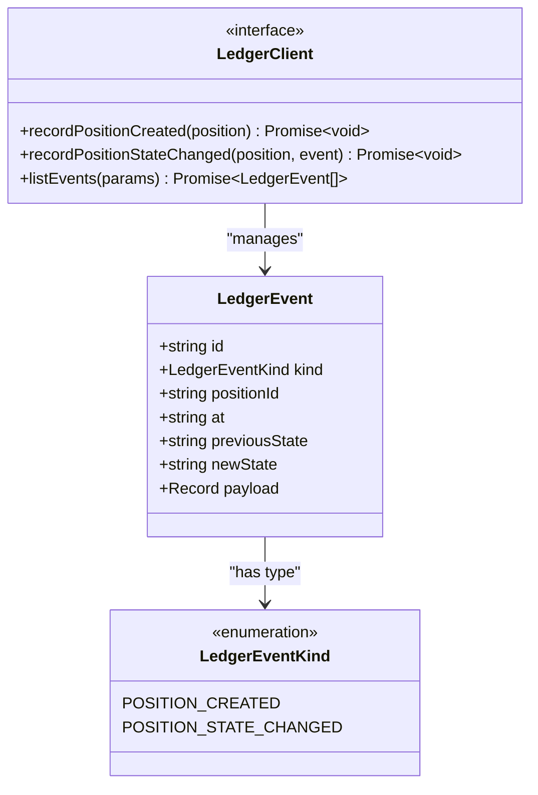

**Diagram sources**
- [ledger.ts](file://src/domain/ledger.ts#L1-L24)

### Event Replay and Consistency

The event sourcing system ensures eventual consistency and supports historical analysis:

**Replay Mechanisms:**
- Complete position state reconstruction from events
- Historical audit trail generation
- Compliance reporting and analytics

**Consistency Guarantees:**
- Atomic event persistence with position updates
- Idempotent event processing
- Conflict resolution for concurrent operations

**Historical Analysis:**
- Timeline visualization of position lifecycle
- Policy compliance tracking
- Regulatory audit preparation

**Section sources**
- [ledger.ts](file://src/domain/ledger.ts#L1-L24)
- [ledgerClient.ts](file://src/infra/ledgerClient.ts#L1-L64)