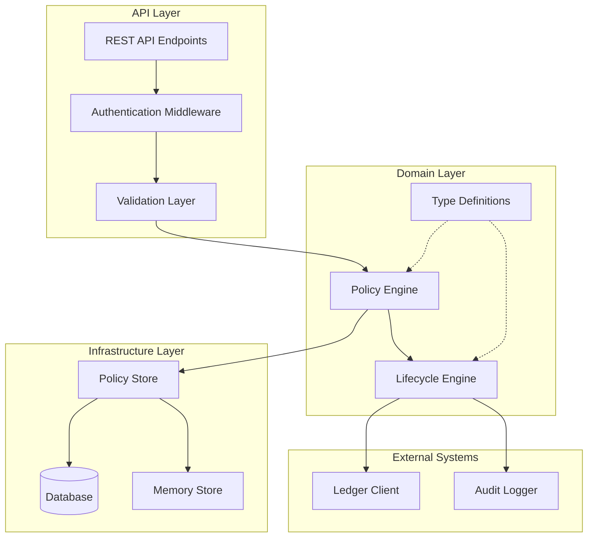
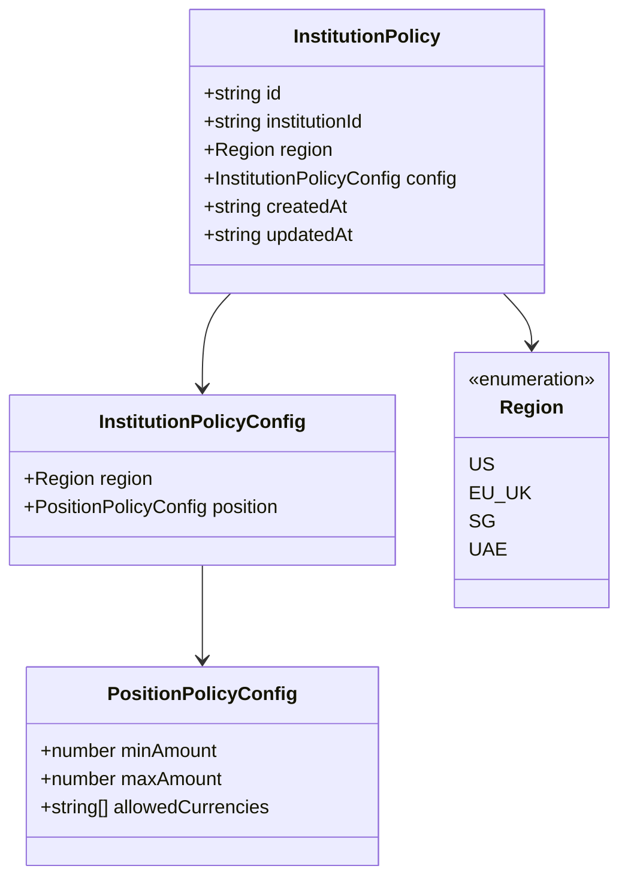
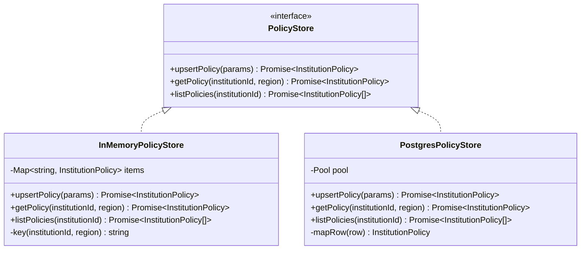
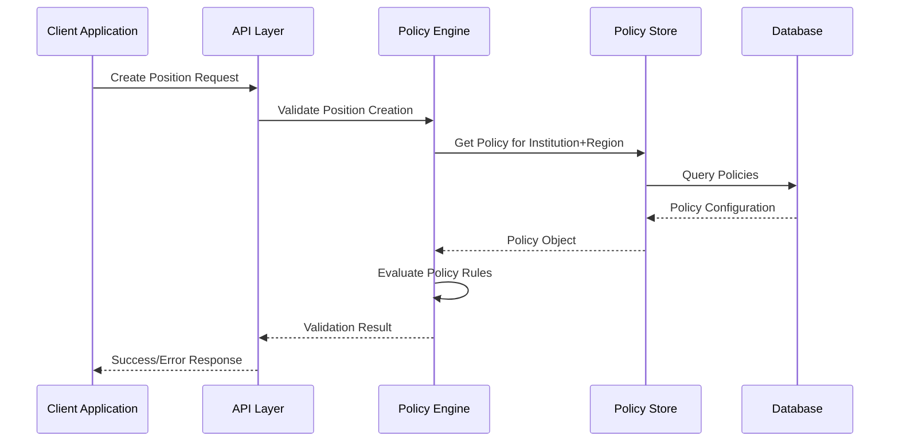
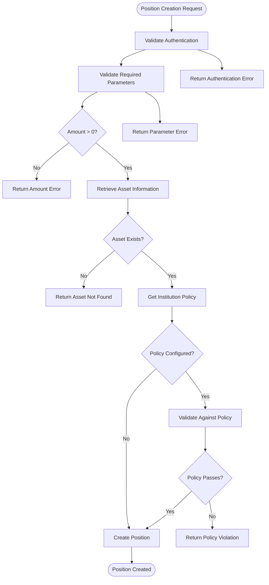
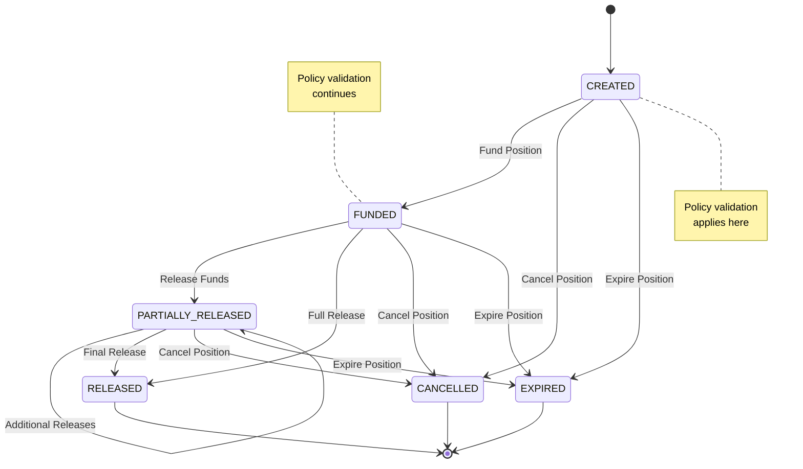

# Policy Enforcement Engine

<cite>
**Referenced Files in This Document**
- [src/domain/policy.ts](file://src/domain/policy.ts)
- [src/domain/types.ts](file://src/domain/types.ts)
- [src/infra/policyStore.ts](file://src/infra/policyStore.ts)
- [src/api/policies.ts](file://src/api/policies.ts)
- [src/api/positions.ts](file://src/api/positions.ts)
- [src/domain/lifecycle.ts](file://src/domain/lifecycle.ts)
- [src/config.ts](file://src/config.ts)
- [src/server.ts](file://src/server.ts)
- [src/__tests__/api.test.ts](file://src/__tests__/api.test.ts)
</cite>

## Table of Contents
1. [Introduction](#introduction)
2. [Architecture Overview](#architecture-overview)
3. [Policy Type Definitions](#policy-type-definitions)
4. [Policy Storage Infrastructure](#policy-storage-infrastructure)
5. [Domain-Level Policy Enforcement](#domain-level-policy-enforcement)
6. [API Integration and Validation](#api-integration-and-validation)
7. [Policy Evaluation During Operations](#policy-evaluation-during-operations)
8. [Common Issues and Debugging](#common-issues-and-debugging)
9. [Extending the Policy Engine](#extending-the-policy-engine)
10. [Best Practices and Testing](#best-practices-and-testing)
11. [Performance Considerations](#performance-considerations)

## Introduction

The EscrowGrid policy enforcement engine provides a sophisticated rule-based validation system for controlling operations on positions, assets, and institutions. Built around configurable policies that can be applied based on institutional context, geographic regions, vertical industries, transaction amounts, and custom metadata, the engine ensures compliance with organizational and regulatory requirements while maintaining flexibility for diverse operational needs.

The policy system operates through a layered architecture that separates concerns between domain logic, storage infrastructure, and API validation, enabling both fine-grained control over position lifecycle operations and robust enforcement mechanisms.

## Architecture Overview

The policy enforcement engine follows a multi-layered architecture that ensures separation of concerns while maintaining efficient policy evaluation:



**Diagram sources**
- [src/api/positions.ts](file://src/api/positions.ts#L1-L298)
- [src/domain/policy.ts](file://src/domain/policy.ts#L1-L23)
- [src/infra/policyStore.ts](file://src/infra/policyStore.ts#L1-L133)

The architecture consists of four primary layers:

- **API Layer**: Handles incoming requests, authentication, and initial validation
- **Domain Layer**: Contains core business logic including policy evaluation and lifecycle management
- **Infrastructure Layer**: Manages persistent storage and retrieval of policy configurations
- **External Systems**: Integrates with ledger systems and audit logging

**Section sources**
- [src/api/positions.ts](file://src/api/positions.ts#L1-L50)
- [src/domain/policy.ts](file://src/domain/policy.ts#L1-L23)
- [src/infra/policyStore.ts](file://src/infra/policyStore.ts#L1-L133)

## Policy Type Definitions

The policy system is built around carefully defined TypeScript interfaces that establish the foundation for rule-based validation:

### Core Policy Interfaces



**Diagram sources**
- [src/domain/policy.ts](file://src/domain/policy.ts#L1-L23)
- [src/domain/types.ts](file://src/domain/types.ts#L1-L85)

### Type System Design

The type definitions provide several key capabilities:

- **Geographic Granularity**: Regions (US, EU_UK, SG, UAE) enable location-specific policy enforcement
- **Amount Constraints**: Flexible minimum and maximum amount validation
- **Currency Control**: Allowed currencies list for financial compliance
- **Temporal Tracking**: Creation and update timestamps for policy versioning

### Policy Configuration Structure

The policy configuration supports hierarchical nesting that mirrors real-world organizational structures:

| Configuration Level | Purpose | Example Use Case |
|-------------------|---------|------------------|
| Institution | Top-level organizational policy | Global compliance requirements |
| Region | Geographic-specific restrictions | Local regulatory requirements |
| Position | Transaction-level controls | Amount limits and currency restrictions |

**Section sources**
- [src/domain/policy.ts](file://src/domain/policy.ts#L1-L23)
- [src/domain/types.ts](file://src/domain/types.ts#L1-L85)

## Policy Storage Infrastructure

The policy storage infrastructure provides a flexible, pluggable architecture that supports both in-memory and persistent storage backends:

### Storage Interface Design



**Diagram sources**
- [src/infra/policyStore.ts](file://src/infra/policyStore.ts#L14-L24)
- [src/infra/policyStore.ts](file://src/infra/policyStore.ts#L26-L61)
- [src/infra/policyStore.ts](file://src/infra/policyStore.ts#L63-L131)

### Storage Backend Selection

The system automatically selects the appropriate storage backend based on configuration:

- **Memory Backend**: Used for development and testing environments
- **PostgreSQL Backend**: Production-ready persistent storage with ACID guarantees

### Policy Persistence Patterns

The storage layer implements several key patterns:

- **Upsert Operations**: Atomic updates that create or modify policies atomically
- **Conflict Resolution**: PostgreSQL's ON CONFLICT clause handles concurrent updates
- **Indexing Strategy**: Composite indexing on `(institution_id, region)` for efficient lookups

**Section sources**
- [src/infra/policyStore.ts](file://src/infra/policyStore.ts#L1-L133)
- [src/config.ts](file://src/config.ts#L1-L47)

## Domain-Level Policy Enforcement

The domain layer implements the core policy evaluation logic that integrates with business operations:

### Policy Evaluation Workflow



**Diagram sources**
- [src/api/positions.ts](file://src/api/positions.ts#L75-L118)
- [src/infra/policyStore.ts](file://src/infra/policyStore.ts#L90-L110)

### Policy Rule Evaluation

The policy engine evaluates multiple rule categories during position operations:

#### Amount-Based Validation
- **Minimum Amount Checks**: Ensures transactions meet minimum thresholds
- **Maximum Amount Limits**: Prevents transactions exceeding configured limits
- **Range Validation**: Comprehensive amount constraint enforcement

#### Currency-Based Validation
- **Allowed Currency Lists**: Restricts transactions to approved currencies
- **Currency Compliance**: Validates against regulatory currency restrictions

#### Geographic Enforcement
- **Region-Specific Policies**: Applies location-based restrictions
- **Cross-Border Controls**: Manages international transaction limitations

**Section sources**
- [src/api/positions.ts](file://src/api/positions.ts#L75-L118)
- [src/domain/lifecycle.ts](file://src/domain/lifecycle.ts#L1-L51)

## API Integration and Validation

The API layer provides comprehensive validation that integrates policy enforcement with business operations:

### Position Creation Validation



**Diagram sources**
- [src/api/positions.ts](file://src/api/positions.ts#L22-L151)

### Policy API Endpoints

The system exposes REST endpoints for policy management:

| Endpoint | Method | Purpose | Access Control |
|----------|--------|---------|----------------|
| `/institutions/{id}/policies` | GET | List all institution policies | Institution owners and admins |
| `/institutions/{id}/policies/{region}` | GET | Retrieve specific region policy | Same as above |
| `/institutions/{id}/policies/{region}` | PUT | Create/update policy | Institution admins only |
| `/institutions/{id}/policies` | GET | Bulk policy retrieval | Same as above |

### Validation Pipeline

The API validation pipeline implements multiple layers of checks:

1. **Authentication Verification**: Ensures proper API key authentication
2. **Authorization Validation**: Confirms user permissions for the operation
3. **Parameter Validation**: Basic input sanitization and type checking
4. **Policy Enforcement**: Domain-level rule validation
5. **Business Logic Validation**: Additional business rule checks

**Section sources**
- [src/api/policies.ts](file://src/api/policies.ts#L1-L180)
- [src/api/positions.ts](file://src/api/positions.ts#L22-L151)

## Policy Evaluation During Operations

Policy evaluation occurs at strategic points throughout the position lifecycle:

### Lifecycle State Transitions



**Diagram sources**
- [src/domain/lifecycle.ts](file://src/domain/lifecycle.ts#L3-L14)
- [src/api/positions.ts](file://src/api/positions.ts#L220-L296)

### Position State Management

The lifecycle engine enforces state transitions according to predefined rules:

#### Allowed Transitions Matrix

| Current State | Allowed Next States | Policy Considerations |
|---------------|-------------------|---------------------|
| CREATED | FUNDED, CANCELLED, EXPIRED | Initial validation rules apply |
| FUNDED | PARTIALLY_RELEASED, RELEASED, CANCELLED, EXPIRED | Funding verification required |
| PARTIALLY_RELEASED | PARTIALLY_RELEASED, RELEASED, CANCELLED, EXPIRED | Partial release limits |
| RELEASED | None (terminal state) | No further transitions allowed |
| CANCELLED | None (terminal state) | No further transitions allowed |
| EXPIRED | None (terminal state) | No further transitions allowed |

### Policy Integration Points

Policy enforcement occurs at multiple integration points:

1. **Position Creation**: Validates initial parameters against policy rules
2. **State Transitions**: Ensures transitions comply with policy constraints
3. **Fund Releases**: Verifies release amounts against policy limits
4. **Metadata Validation**: Checks custom metadata against policy requirements

**Section sources**
- [src/domain/lifecycle.ts](file://src/domain/lifecycle.ts#L1-L51)
- [src/api/positions.ts](file://src/api/positions.ts#L220-L296)

## Common Issues and Debugging

Understanding common policy-related issues helps in effective debugging and system maintenance:

### Policy Conflict Resolution

Policy conflicts arise when multiple policies apply to the same operation:

#### Conflict Scenarios
- **Overlapping Regions**: Policies for overlapping geographic areas
- **Hierarchical Overrides**: Parent institution policies vs. regional policies
- **Temporal Conflicts**: Policy updates during active operations

#### Resolution Strategies
- **Precedence Rules**: Regional policies override institution-wide policies
- **Latest Timestamp**: More recent policies take precedence
- **Explicit Denial**: Specific deny rules override allow rules

### Debugging Failed Validations

Common debugging approaches for policy failures:

#### Diagnostic Steps
1. **Policy Retrieval**: Verify the correct policy is being loaded
2. **Rule Inspection**: Examine individual rule conditions
3. **Context Analysis**: Review operation context (amount, currency, region)
4. **Log Analysis**: Check audit logs for detailed failure information

#### Error Message Patterns

| Error Pattern | Likely Cause | Solution Approach |
|---------------|--------------|-------------------|
| `Amount below minimum for policy` | Transaction amount too low | Adjust policy minimum or transaction amount |
| `Amount above maximum for policy` | Transaction amount too high | Reduce transaction amount or adjust policy |
| `Currency not allowed by policy` | Unsupported currency | Use allowed currencies or update policy |
| `Policy not found` | Missing policy configuration | Create appropriate policy for region |

### Performance Monitoring

Monitor policy evaluation performance through:

- **Response Time Metrics**: Track policy lookup and evaluation times
- **Cache Hit Rates**: Monitor policy cache effectiveness
- **Error Rate Analysis**: Identify common failure patterns
- **Concurrent Access Patterns**: Analyze contention points

**Section sources**
- [src/api/positions.ts](file://src/api/positions.ts#L91-L118)
- [src/infra/policyStore.ts](file://src/infra/policyStore.ts#L1-L133)

## Extending the Policy Engine

The policy engine is designed for extensibility, allowing organizations to add custom validation rules:

### Adding New Condition Types

To extend the policy engine with new condition types:

#### Step 1: Define New Policy Interfaces
Extend the existing policy interfaces to include new condition types:

```typescript
// Example extension for custom metadata validation
interface CustomPolicyConfig {
  minAmount?: number;
  maxAmount?: number;
  allowedCurrencies?: string[];
  requiredMetadataFields?: string[];
  customValidators?: CustomValidator[];
}

interface CustomValidator {
  field: string;
  type: 'regex' | 'range' | 'enum';
  pattern?: string;
  minValue?: number;
  maxValue?: number;
  allowedValues?: string[];
}
```

#### Step 2: Implement Validation Logic
Add validation logic to the policy evaluation pipeline:

```typescript
// Example custom validator implementation
function validateCustomMetadata(metadata: Record<string, unknown>, validators: CustomValidator[]): void {
  for (const validator of validators) {
    const value = metadata[validator.field];
    
    switch (validator.type) {
      case 'regex':
        if (typeof value === 'string' && !new RegExp(validator.pattern!).test(value)) {
          throw new Error(`Field ${validator.field} fails regex validation`);
        }
        break;
      case 'range':
        if (typeof value === 'number' && 
            ((validator.minValue !== undefined && value < validator.minValue) ||
             (validator.maxValue !== undefined && value > validator.maxValue))) {
          throw new Error(`Field ${validator.field} out of range`);
        }
        break;
      // Additional validator types...
    }
  }
}
```

#### Step 3: Update API Endpoints
Modify API endpoints to handle new policy configurations:

```typescript
// Enhanced policy validation with custom fields
if (policy.customValidators) {
  validateCustomMetadata(position.metadata, policy.customValidators);
}
```

### Policy Versioning Strategy

Implement comprehensive policy versioning:

#### Version Control Patterns
- **Semantic Versioning**: Use MAJOR.MINOR.PATCH for policy versions
- **Backward Compatibility**: Maintain compatibility with older clients
- **Migration Strategies**: Plan for policy schema changes

#### Version Management
- **Automatic Versioning**: Increment version on policy updates
- **Rollback Capabilities**: Ability to revert to previous policy versions
- **Audit Trails**: Complete history of policy changes

### Metadata-Based Policy Rules

Enhance policy rules with custom metadata:

#### Metadata Schema Design
- **Structured Metadata**: Define clear metadata schemas
- **Validation Rules**: Apply validation to metadata fields
- **Conditional Logic**: Enable policy rules based on metadata values

**Section sources**
- [src/domain/policy.ts](file://src/domain/policy.ts#L1-L23)
- [src/api/policies.ts](file://src/api/policies.ts#L15-L21)

## Best Practices and Testing

Effective policy management requires adherence to established best practices and comprehensive testing strategies:

### Policy Design Principles

#### Clarity and Simplicity
- **Single Responsibility**: Each policy rule should have a clear, focused purpose
- **Minimal Complexity**: Avoid overly complex rule combinations
- **Clear Naming**: Use descriptive names for policies and rules

#### Security and Compliance
- **Defense in Depth**: Implement multiple layers of validation
- **Audit Logging**: Log all policy evaluations and violations
- **Principle of Least Privilege**: Grant minimal necessary permissions

#### Operational Excellence
- **Performance Awareness**: Consider the impact of policy evaluation on performance
- **Monitoring and Alerting**: Implement comprehensive monitoring
- **Documentation**: Maintain clear documentation for all policies

### Testing Strategies

#### Unit Testing Policies
```typescript
describe('Policy Engine', () => {
  it('should enforce minimum amount policy', () => {
    const policy = createPolicy({ minAmount: 1000 });
    expect(() => validatePosition({ amount: 500 }, policy)).toThrow();
    expect(() => validatePosition({ amount: 1500 }, policy)).not.toThrow();
  });
  
  it('should validate currency restrictions', () => {
    const policy = createPolicy({ allowedCurrencies: ['USD', 'EUR'] });
    expect(() => validatePosition({ currency: 'GBP' }, policy)).toThrow();
    expect(() => validatePosition({ currency: 'USD' }, policy)).not.toThrow();
  });
});
```

#### Integration Testing
- **End-to-End Workflows**: Test complete policy enforcement scenarios
- **API Integration**: Verify policy enforcement through API endpoints
- **Storage Backends**: Test both memory and PostgreSQL storage backends

#### Load Testing
- **Policy Lookup Performance**: Measure policy retrieval times under load
- **Concurrent Access**: Test policy evaluation with multiple simultaneous requests
- **Cache Effectiveness**: Monitor cache hit rates and performance improvements

### Monitoring and Observability

#### Key Metrics to Monitor
- **Policy Evaluation Latency**: Time taken to evaluate policies
- **Success/Failure Rates**: Percentage of successful vs. failed policy validations
- **Cache Hit Rates**: Effectiveness of policy caching
- **Error Distribution**: Types and patterns of policy validation errors

#### Alerting Strategies
- **Performance Degradation**: Alert on increased policy evaluation times
- **Unexpected Failures**: Notify on unusual policy validation patterns
- **Capacity Planning**: Monitor trends for policy storage growth

**Section sources**
- [src/__tests__/api.test.ts](file://src/__tests__/api.test.ts#L1-L126)
- [src/api/positions.ts](file://src/api/positions.ts#L22-L151)

## Performance Considerations

Optimizing policy enforcement performance requires careful consideration of multiple factors:

### Caching Strategies

#### Policy Caching
- **In-Memory Caching**: Store frequently accessed policies in memory
- **Cache Invalidation**: Implement proper cache invalidation strategies
- **Cache Warming**: Pre-load critical policies during system startup

#### Query Optimization
- **Composite Indexing**: Use composite indexes on `(institution_id, region)`
- **Query Patterns**: Optimize for common query patterns
- **Connection Pooling**: Manage database connections efficiently

### Scalability Patterns

#### Horizontal Scaling
- **Policy Distribution**: Distribute policy storage across multiple instances
- **Load Balancing**: Balance policy lookup requests across servers
- **Stateless Design**: Maintain statelessness for horizontal scaling

#### Vertical Scaling
- **Resource Allocation**: Properly allocate CPU and memory resources
- **Database Tuning**: Optimize database configuration for policy queries
- **Network Optimization**: Minimize network latency for policy lookups

### Performance Monitoring

#### Key Performance Indicators
- **Policy Lookup Time**: Average time for policy retrieval
- **Validation Throughput**: Number of validations per second
- **Cache Efficiency**: Ratio of cache hits to total requests
- **Error Rates**: Percentage of failed policy validations

#### Bottleneck Identification
- **Database Queries**: Identify slow policy lookup queries
- **Network Latency**: Measure network delays in policy retrieval
- **CPU Utilization**: Monitor CPU usage during policy evaluation
- **Memory Usage**: Track memory consumption patterns

The policy enforcement engine in EscrowGrid demonstrates a sophisticated approach to rule-based validation that balances flexibility, performance, and maintainability. By understanding its architecture, implementation patterns, and best practices, developers can effectively leverage and extend this powerful system for their specific requirements.