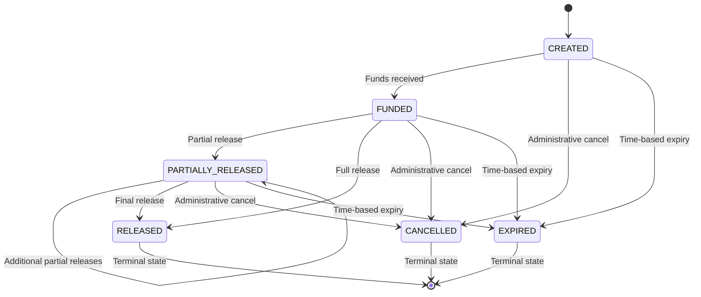
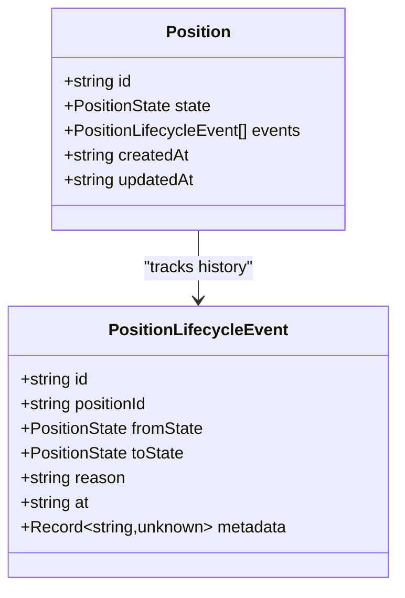
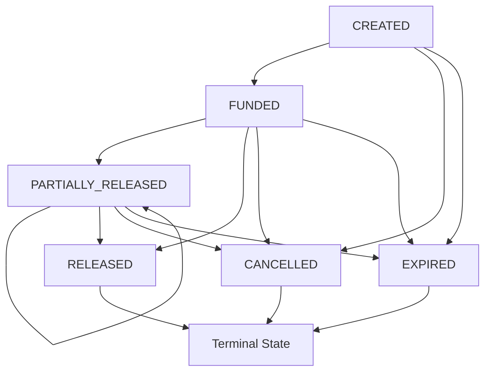
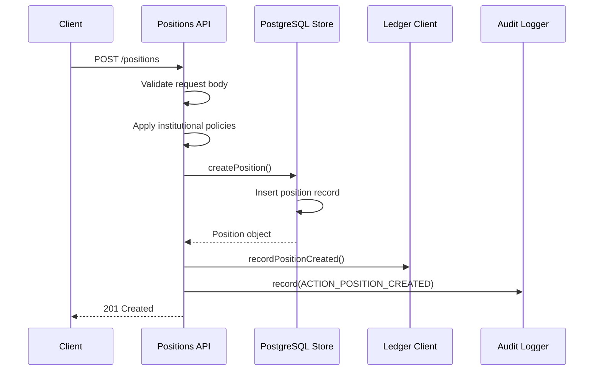
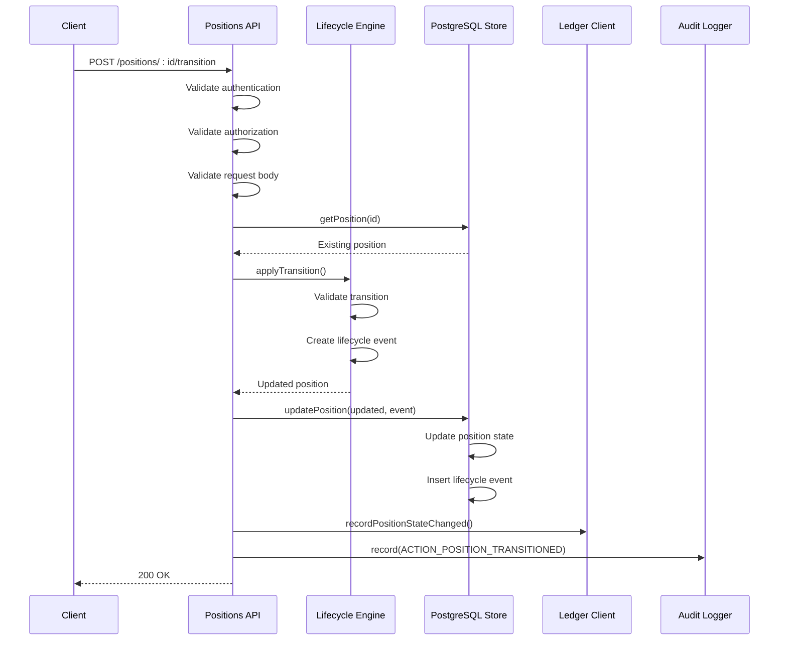
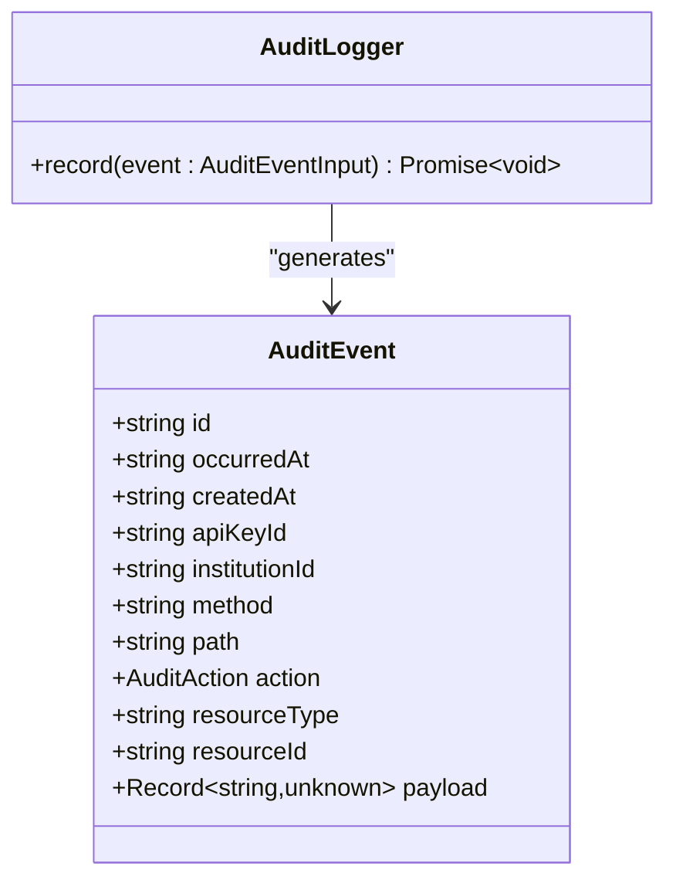
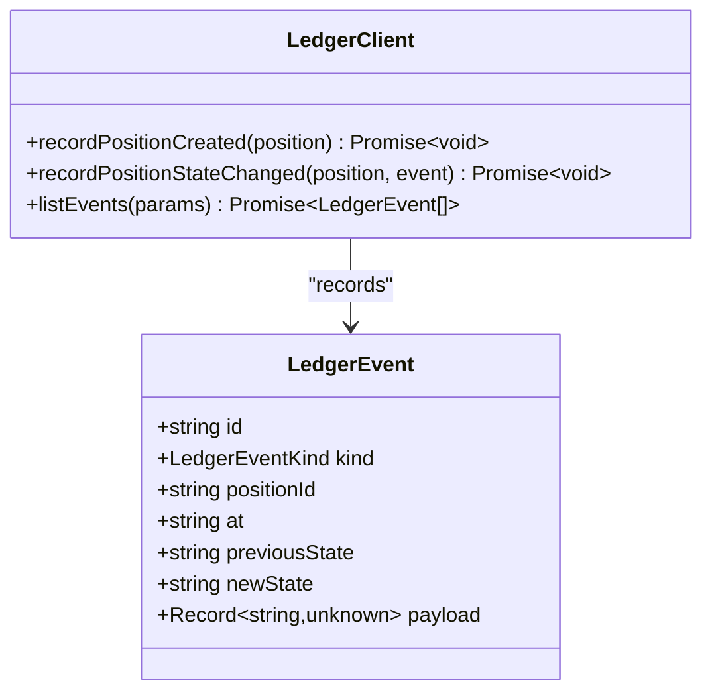
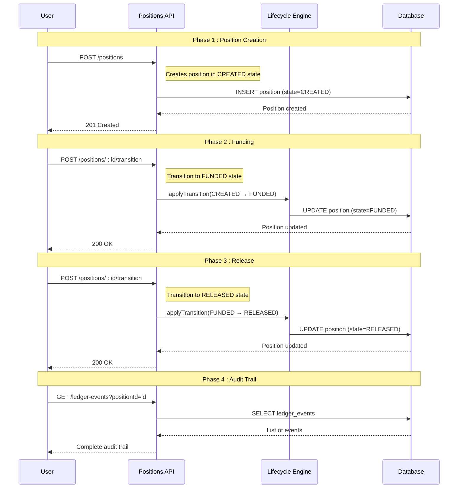
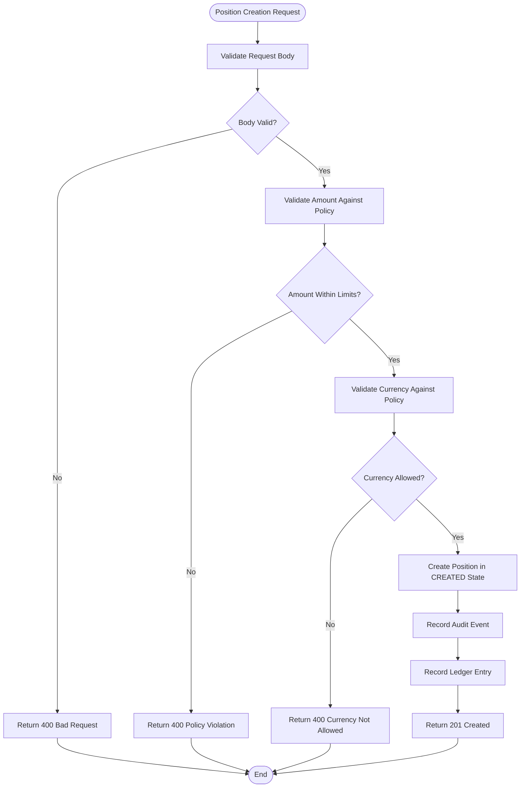

# Position Lifecycle Management

<cite>
**Referenced Files in This Document**
- [src/domain/types.ts](file://src/domain/types.ts)
- [src/domain/lifecycle.ts](file://src/domain/lifecycle.ts)
- [src/api/positions.ts](file://src/api/positions.ts)
- [src/domain/audit.ts](file://src/domain/audit.ts)
- [src/domain/ledger.ts](file://src/domain/ledger.ts)
- [src/infra/ledgerClient.ts](file://src/infra/ledgerClient.ts)
- [src/infra/auditLogger.ts](file://src/infra/auditLogger.ts)
- [src/store/postgresStore.ts](file://src/store/postgresStore.ts)
- [src/config.ts](file://src/config.ts)
- [src/openapi.ts](file://src/openapi.ts)
- [src/__tests__/api.test.ts](file://src/__tests__/api.test.ts)
- [src/__tests__/api.postgres.test.ts](file://src/__tests__/api.postgres.test.ts)
</cite>

## Table of Contents
1. [Introduction](#introduction)
2. [Position State Model](#position-state-model)
3. [Lifecycle Event System](#lifecycle-event-system)
4. [State Transition Engine](#state-transition-engine)
5. [API Integration](#api-integration)
6. [Audit and Ledger Integration](#audit-and-ledger-integration)
7. [Implementation Examples](#implementation-examples)
8. [Error Handling and Validation](#error-handling-and-validation)
9. [Performance Considerations](#performance-considerations)
10. [Common Issues and Solutions](#common-issues-and-solutions)
11. [Testing and Quality Assurance](#testing-and-quality-assurance)

## Introduction

The EscrowGrid position lifecycle management system provides a robust framework for tracking and controlling the state transitions of financial positions throughout their entire lifecycle. This system ensures data integrity, maintains audit trails, and enforces business rules through a comprehensive state machine architecture.

The lifecycle management system operates on the principle of immutable state transitions, where each change to a position's state is recorded as a discrete event with full auditability. This approach enables sophisticated reconciliation capabilities and provides a complete historical record of all position activities.

## Position State Model

The position lifecycle is governed by a well-defined state model that captures the essential phases of a financial position's existence.

### PositionState Enum Definition

The system defines six distinct states that represent the complete lifecycle of a position:

**Diagram sources**
- [src/domain/types.ts](file://src/domain/types.ts#L38-L44)

### State Characteristics

Each state represents a specific condition or milestone in the position lifecycle:

- **CREATED**: Initial state when a position is first established
- **FUNDED**: Position has received the required funds
- **PARTIALLY_RELEASED**: Some portion of funds has been released
- **RELEASED**: All funds have been fully released
- **CANCELLED**: Position was terminated administratively
- **EXPIRED**: Position reached its natural expiration

**Section sources**
- [src/domain/types.ts](file://src/domain/types.ts#L38-L44)

## Lifecycle Event System

The lifecycle event system provides a comprehensive mechanism for tracking state changes and maintaining audit trails.

### PositionLifecycleEvent Interface

Each state transition generates a detailed lifecycle event containing:

**Diagram sources**
- [src/domain/types.ts](file://src/domain/types.ts#L46-L54)

### Event Properties

- **id**: Unique identifier for the lifecycle event
- **positionId**: Reference to the affected position
- **fromState**: Previous state before transition
- **toState**: New state after transition
- **reason**: Human-readable explanation for the transition
- **at**: Timestamp of the transition
- **metadata**: Optional structured data about the transition

**Section sources**
- [src/domain/types.ts](file://src/domain/types.ts#L46-L54)

## State Transition Engine

The state transition engine enforces business rules and validates transitions through a carefully designed constraint system.

### Allowed Transitions Matrix

The system defines explicit allowed transitions between states:

**Diagram sources**
- [src/domain/lifecycle.ts](file://src/domain/lifecycle.ts#L3-L10)

### Transition Validation Logic

The transition engine implements several key validation mechanisms:

1. **State Consistency**: Ensures the current state matches expectations
2. **Allowed Transitions**: Validates that the proposed transition is permitted
3. **Idempotency**: Handles repeated requests gracefully
4. **Atomic Updates**: Ensures transactional consistency

**Section sources**
- [src/domain/lifecycle.ts](file://src/domain/lifecycle.ts#L1-L51)

## API Integration

The position lifecycle management integrates seamlessly with the REST API layer, providing controlled access to state transitions.

### Position Creation Endpoint

Position creation automatically sets the initial state to `CREATED`:

**Diagram sources**
- [src/api/positions.ts](file://src/api/positions.ts#L22-L144)

### State Transition Endpoint

State transitions are handled through a dedicated endpoint with comprehensive validation:

**Diagram sources**
- [src/api/positions.ts](file://src/api/positions.ts#L220-L296)

### API Request/Response Patterns

The API follows RESTful conventions with comprehensive error handling:

| Endpoint | Method | Purpose | Validation |
|----------|--------|---------|------------|
| `/positions` | POST | Create new position | Institutional policies, asset validation |
| `/positions/:id` | GET | Retrieve position details | Authentication, authorization |
| `/positions/:id/transition` | POST | Change position state | State transition rules, business logic |

**Section sources**
- [src/api/positions.ts](file://src/api/positions.ts#L1-L298)

## Audit and Ledger Integration

The system maintains comprehensive audit trails and ledger records for compliance and reconciliation purposes.

### Audit Logging System

The audit system tracks all significant operations with detailed contextual information:

**Diagram sources**
- [src/domain/audit.ts](file://src/domain/audit.ts#L22-L35)

### Ledger Recording System

The ledger system maintains chronological records of all state changes:

**Diagram sources**
- [src/domain/ledger.ts](file://src/domain/ledger.ts#L5-L24)

### Integration Points

Both systems integrate at key lifecycle moments:

1. **Position Creation**: Records `POSITION_CREATED` audit event and ledger entry
2. **State Transitions**: Records `POSITION_TRANSITIONED` audit event and ledger entry
3. **Error Conditions**: Logs failures with appropriate context

**Section sources**
- [src/api/positions.ts](file://src/api/positions.ts#L128-L144)
- [src/api/positions.ts](file://src/api/positions.ts#L268-L296)

## Implementation Examples

### Basic Position Lifecycle Example

Here's a complete example showing a position moving through its lifecycle:

**Diagram sources**
- [src/__tests__/api.test.ts](file://src/__tests__/api.test.ts#L88-L124)
- [src/__tests__/api.postgres.test.ts](file://src/__tests__/api.postgres.test.ts#L115-L153)

### Policy-Enforced Position Creation

The system enforces institutional policies during position creation:

**Diagram sources**
- [src/api/positions.ts](file://src/api/positions.ts#L37-L118)

**Section sources**
- [src/__tests__/api.test.ts](file://src/__tests__/api.test.ts#L88-L124)
- [src/__tests__/api.postgres.test.ts](file://src/__tests__/api.postgres.test.ts#L115-L153)

## Error Handling and Validation

The system implements comprehensive error handling and validation at multiple levels.

### Validation Layers

1. **API Level**: Input validation and authentication
2. **Domain Level**: Business rule enforcement
3. **Infrastructure Level**: Data consistency checks

### Common Error Scenarios

| Error Type | HTTP Status | Description | Recovery Strategy |
|------------|-------------|-------------|-------------------|
| Invalid State Transition | 400 | Attempting illegal state change | Review allowed transitions |
| Position Not Found | 404 | Position ID doesn't exist | Verify position ID |
| Authentication Failure | 401 | Missing or invalid API key | Provide valid credentials |
| Authorization Failure | 403 | Insufficient permissions | Check API key role |
| Policy Violation | 400 | Amount/currency violates policy | Adjust parameters |

### Idempotent Operations

The system handles idempotent operations gracefully:

- **Duplicate Transitions**: No-op if state hasn't changed
- **Retry Logic**: Safe to retry failed operations
- **Consistency Guarantees**: Atomic updates prevent race conditions

**Section sources**
- [src/domain/lifecycle.ts](file://src/domain/lifecycle.ts#L25-L30)
- [src/api/positions.ts](file://src/api/positions.ts#L238-L251)

## Performance Considerations

### Event Sourcing Overhead

The event sourcing architecture introduces several performance considerations:

1. **Storage Requirements**: Each state change creates a new event record
2. **Query Complexity**: Retrieving complete position history requires joining multiple tables
3. **Indexing Strategy**: Proper indexing on position_id and timestamps is crucial
4. **Batch Operations**: Group related operations to minimize database round-trips

### State Validation Performance

The state validation system is optimized for performance:

- **In-Memory Transitions Matrix**: O(1) lookup for allowed transitions
- **Immutable Updates**: Efficient functional updates minimize memory allocation
- **Transaction Batching**: Database operations are batched for optimal throughput

### Scalability Considerations

- **Connection Pooling**: PostgreSQL connection pooling for high concurrency
- **Caching Strategies**: Position data caching for frequently accessed positions
- **Asynchronous Processing**: Audit and ledger operations use async processing

**Section sources**
- [src/store/postgresStore.ts](file://src/store/postgresStore.ts#L356-L410)
- [src/config.ts](file://src/config.ts#L1-L47)

## Common Issues and Solutions

### Invalid State Transitions

**Problem**: Attempting to transition from an invalid state combination

**Solution**: The lifecycle engine validates transitions against the allowed matrix and throws descriptive errors.

**Example**: Cannot transition directly from `RELEASED` to `FUNDED` as `RELEASED` is a terminal state.

### Concurrent Modification

**Problem**: Multiple clients attempting to modify the same position simultaneously

**Solution**: Database transactions with optimistic locking prevent concurrent modification conflicts.

### Audit Trail Integrity

**Problem**: Audit logs becoming inconsistent with position state

**Solution**: Audit events are recorded atomically with position updates using database transactions.

### Performance Degradation

**Problem**: Slow response times for position queries

**Solution**: Implement proper indexing, connection pooling, and consider caching frequently accessed positions.

**Section sources**
- [src/domain/lifecycle.ts](file://src/domain/lifecycle.ts#L29-L30)
- [src/store/postgresStore.ts](file://src/store/postgresStore.ts#L356-L410)

## Testing and Quality Assurance

The system includes comprehensive testing coverage across all components.

### Test Coverage Areas

1. **Unit Tests**: Individual function testing for lifecycle logic
2. **Integration Tests**: API endpoint testing with real database
3. **End-to-End Tests**: Complete workflow testing
4. **Load Testing**: Performance validation under stress

### Test Examples

The test suite demonstrates typical position lifecycle scenarios:

- Creating positions with various configurations
- Validating state transitions
- Testing policy enforcement
- Verifying audit trail generation

**Section sources**
- [src/__tests__/api.test.ts](file://src/__tests__/api.test.ts#L88-L124)
- [src/__tests__/api.postgres.test.ts](file://src/__tests__/api.postgres.test.ts#L115-L153)