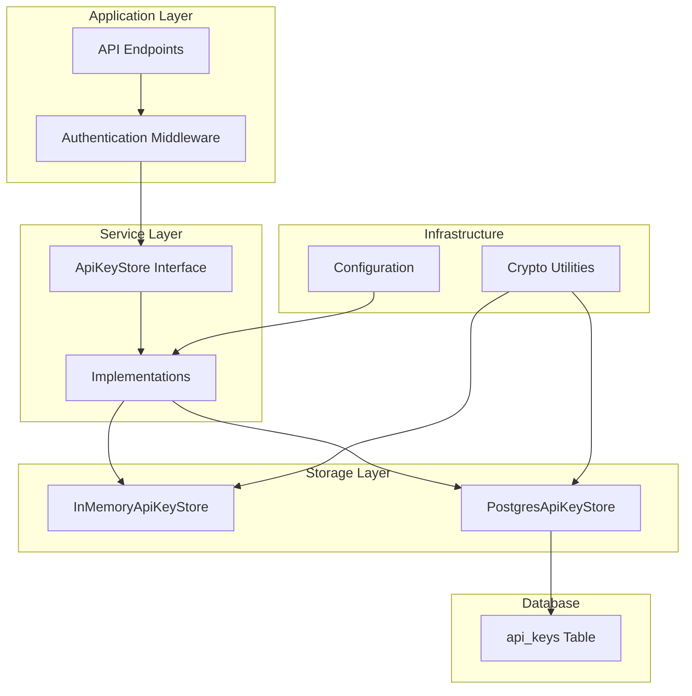
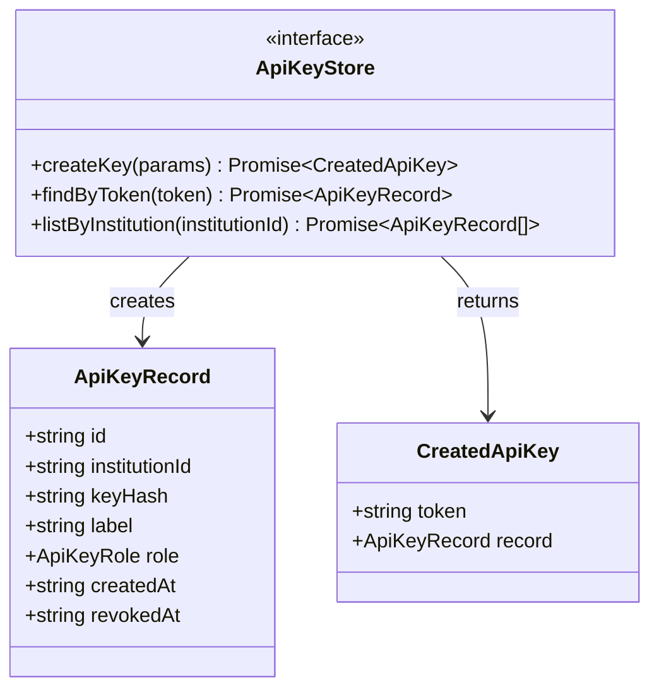
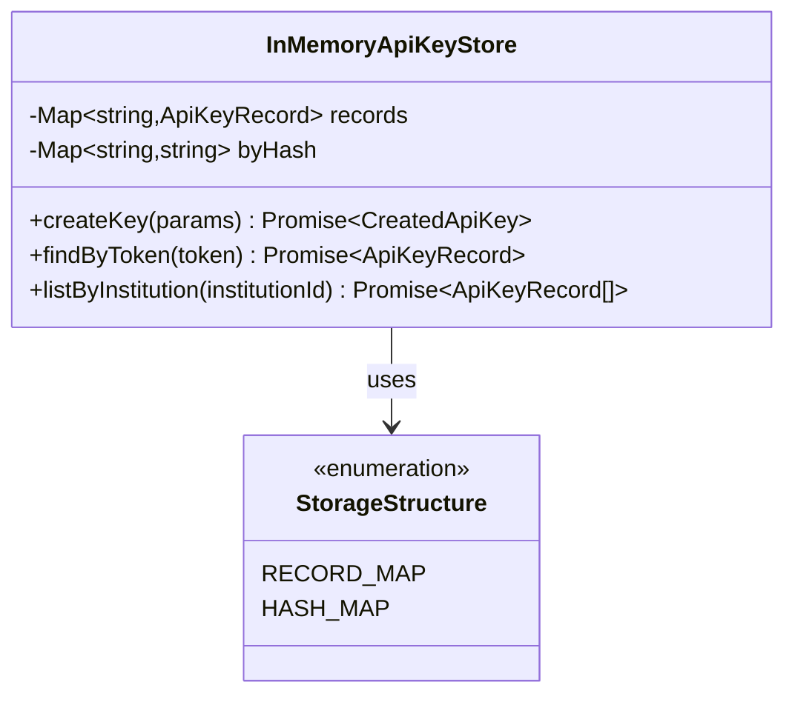
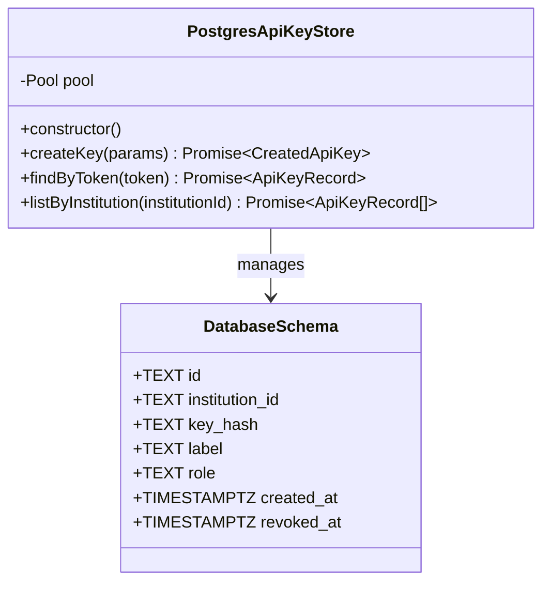
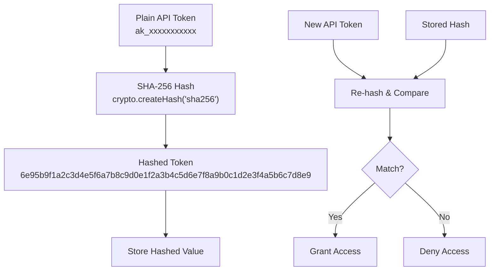
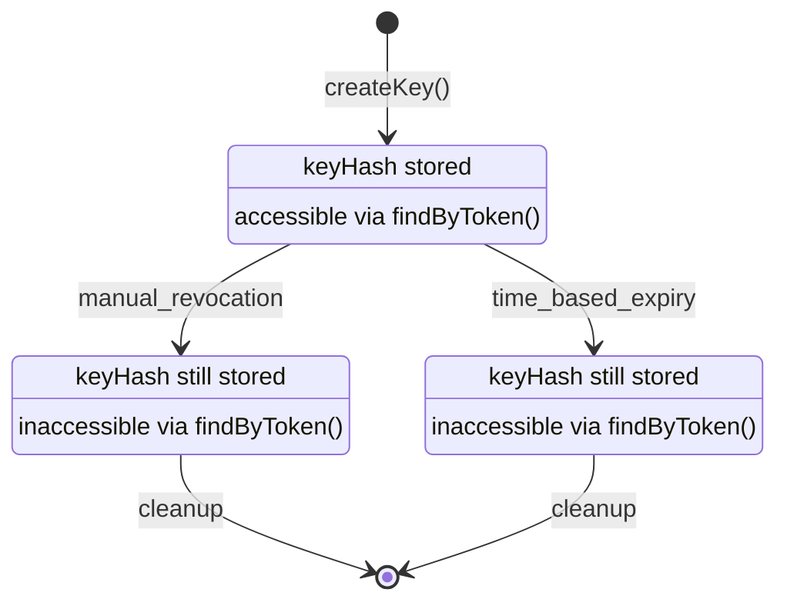
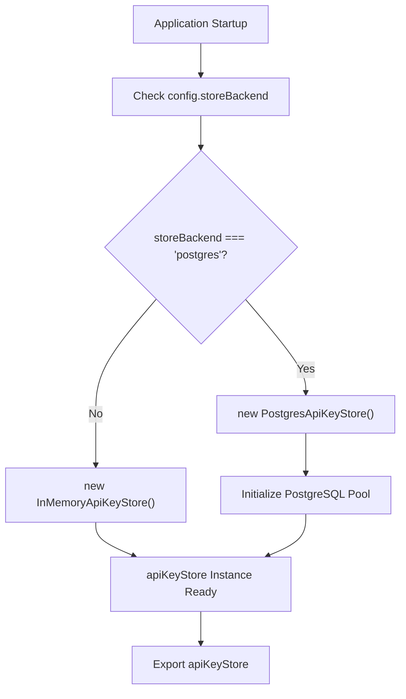
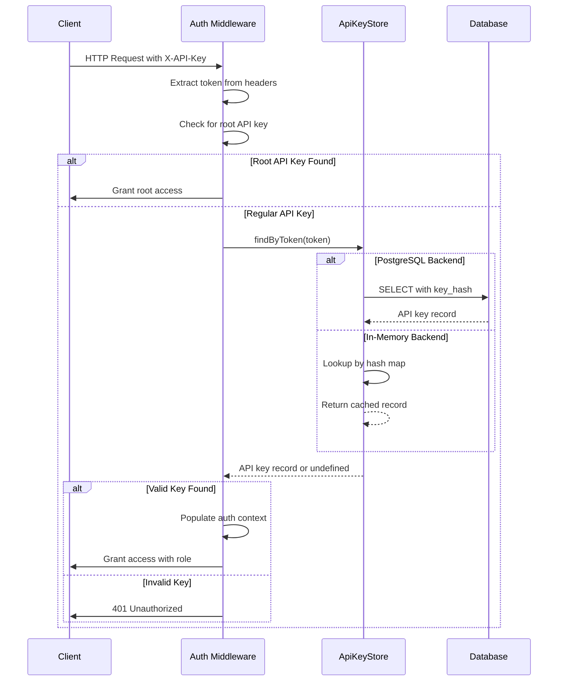
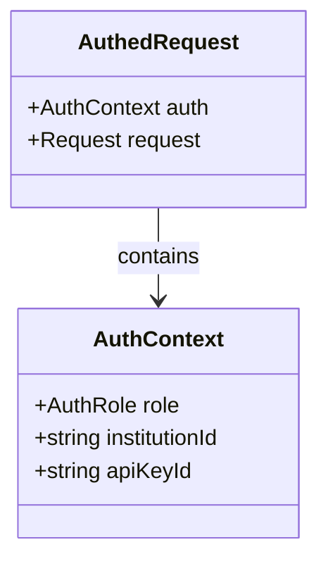

# API Key Store

<cite>
**Referenced Files in This Document**
- [src/infra/apiKeyStore.ts](file://src/infra/apiKeyStore.ts)
- [src/middleware/auth.ts](file://src/middleware/auth.ts)
- [src/config.ts](file://src/config.ts)
- [src/domain/types.ts](file://src/domain/types.ts)
- [db/schema.sql](file://db/schema.sql)
- [src/api/apiKeys.ts](file://src/api/apiKeys.ts)
- [src/server.ts](file://src/server.ts)
- [src/__tests__/api.test.ts](file://src/__tests__/api.test.ts)
</cite>

## Table of Contents
1. [Introduction](#introduction)
2. [Architecture Overview](#architecture-overview)
3. [ApiKeyStore Interface](#apikeystore-interface)
4. [Implementation Details](#implementation-details)
5. [Security Features](#security-features)
6. [Configuration and Instantiation](#configuration-and-instantiation)
7. [Integration with Authentication Middleware](#integration-with-authentication-middleware)
8. [Performance and Consistency Trade-offs](#performance-and-consistency-trade-offs)
9. [Common Issues and Solutions](#common-issues-and-solutions)
10. [Best Practices](#best-practices)

## Introduction

The API Key Store service in EscrowGrid provides a secure and scalable mechanism for managing API keys used for authentication and authorization. It implements a pluggable architecture with two distinct storage backends: in-memory storage for development and testing, and PostgreSQL for production environments. The service ensures secure token handling through cryptographic hashing and provides robust key revocation capabilities.

The API Key Store serves as the foundation for the platform's authentication system, enabling granular access control for institutions and their associated resources. It supports role-based permissions with administrative and read-only access levels, while maintaining audit trails for all key operations.

## Architecture Overview

The API Key Store follows a layered architecture pattern with clear separation of concerns:

**Diagram sources**
- [src/infra/apiKeyStore.ts](file://src/infra/apiKeyStore.ts#L13-L23)
- [src/middleware/auth.ts](file://src/middleware/auth.ts#L35-L81)
- [src/config.ts](file://src/config.ts#L176-L182)

**Section sources**
- [src/infra/apiKeyStore.ts](file://src/infra/apiKeyStore.ts#L1-L184)
- [src/middleware/auth.ts](file://src/middleware/auth.ts#L1-L95)

## ApiKeyStore Interface

The ApiKeyStore interface defines the contract for all API key storage implementations, providing three essential methods for key management:

### Interface Definition

**Diagram sources**
- [src/infra/apiKeyStore.ts](file://src/infra/apiKeyStore.ts#L13-L23)
- [src/domain/types.ts](file://src/domain/types.ts#L70-L78)

### Method Specifications

#### createKey Method

Creates a new API key for an institution with specified attributes.

**Parameters:**
- `params.institutionId` (string): Unique identifier of the target institution
- `params.label` (string): Human-readable description for the API key
- `params.role` (ApiKeyRole): Access level ('admin' or 'read_only')

**Return Type:** `Promise<CreatedApiKey>`
- `token` (string): Plain-text API key (returned only during creation)
- `record` (ApiKeyRecord): Complete API key record with metadata

**Error Conditions:**
- Database connection failures (PostgreSQL backend)
- Constraint violations (duplicate keys, invalid institution references)
- Invalid role values

#### findByToken Method

Retrieves an API key record by its hashed token value.

**Parameters:**
- `token` (string): API key token to search for

**Return Type:** `Promise<ApiKeyRecord | undefined>`
- Returns the API key record if found and not revoked
- Returns `undefined` if token is invalid, expired, or revoked

**Error Conditions:**
- Database connection failures (PostgreSQL backend)
- Malformed token format
- Cryptographic hash computation errors

#### listByInstitution Method

Lists all active API keys for a specific institution.

**Parameters:**
- `institutionId` (string): Target institution identifier

**Return Type:** `Promise<ApiKeyRecord[]>`
- Returns array of API key records (excluding revoked keys)
- Returns empty array if no active keys exist

**Error Conditions:**
- Database connection failures (PostgreSQL backend)
- Invalid institution identifier format

**Section sources**
- [src/infra/apiKeyStore.ts](file://src/infra/apiKeyStore.ts#L13-L23)

## Implementation Details

### InMemoryApiKeyStore

The in-memory implementation provides fast access for development and testing scenarios:

**Diagram sources**
- [src/infra/apiKeyStore.ts](file://src/infra/apiKeyStore.ts#L41-L94)

**Key Features:**
- O(1) average-case lookup performance for all operations
- Memory-efficient dual-map indexing (by ID and by hash)
- Thread-safe concurrent access support
- Automatic cleanup on application restart

**Implementation Details:**
- Uses JavaScript `Map` collections for optimal performance
- Maintains separate indices for direct ID lookup and hash-based token resolution
- Implements atomic operations for concurrent safety

### PostgresApiKeyStore

The PostgreSQL implementation provides persistent storage with ACID compliance:

**Diagram sources**
- [src/infra/apiKeyStore.ts](file://src/infra/apiKeyStore.ts#L88-L182)
- [db/schema.sql](file://db/schema.sql#L93-L101)

**Database Schema Integration:**
- Unique constraint on `key_hash` prevents duplicate tokens
- Foreign key relationship with `institutions` table
- Index on `institution_id` for efficient institution-scoped queries
- Timestamp fields for audit trail and temporal queries

**Section sources**
- [src/infra/apiKeyStore.ts](file://src/infra/apiKeyStore.ts#L41-L182)
- [db/schema.sql](file://db/schema.sql#L93-L101)

## Security Features

### Token Hashing

The API Key Store implements cryptographic security through SHA-256 token hashing:

**Diagram sources**
- [src/infra/apiKeyStore.ts](file://src/infra/apiKeyStore.ts#L37-L39)

**Security Benefits:**
- Tokens are never stored in plaintext
- Collision resistance prevents unauthorized access
- Irreversible transformation protects against data breaches
- Standard cryptographic algorithm ensures security

### Revocation Mechanism

API keys support graceful revocation through the `revokedAt` timestamp:

**Revocation Workflow:**
1. **Manual Revocation**: Set `revokedAt` timestamp to current time
2. **Automatic Expiry**: Keys become inaccessible after revocation
3. **Cleanup**: Database maintenance removes old revoked keys
4. **Audit Trail**: All revocation actions logged for compliance

**Section sources**
- [src/infra/apiKeyStore.ts](file://src/infra/apiKeyStore.ts#L37-L39)
- [src/domain/types.ts](file://src/domain/types.ts#L76-L78)

## Configuration and Instantiation

### Backend Selection

The API Key Store automatically selects the appropriate backend based on configuration:

**Diagram sources**
- [src/infra/apiKeyStore.ts](file://src/infra/apiKeyStore.ts#L174-L182)
- [src/config.ts](file://src/config.ts#L25)

### Environment Configuration

| Configuration Variable | Purpose | Default Value | Required |
|------------------------|---------|---------------|----------|
| `STORE_BACKEND` | Storage backend selection | `'memory'` | No |
| `DATABASE_URL` | PostgreSQL connection string | - | Yes (when postgres backend) |
| `ROOT_API_KEY` | Superuser API key | - | No |

### Runtime Behavior

**Development Mode (Memory Backend):**
- Fast startup and teardown
- No persistence across restarts
- Ideal for testing and local development
- Limited scalability for concurrent requests

**Production Mode (PostgreSQL Backend):**
- Persistent storage with ACID guarantees
- Scalable concurrent access
- High availability through connection pooling
- Comprehensive audit logging

**Section sources**
- [src/infra/apiKeyStore.ts](file://src/infra/apiKeyStore.ts#L174-L182)
- [src/config.ts](file://src/config.ts#L23-L47)

## Integration with Authentication Middleware

### Authentication Flow

The API Key Store integrates seamlessly with the authentication middleware:

**Diagram sources**
- [src/middleware/auth.ts](file://src/middleware/auth.ts#L35-L81)
- [src/infra/apiKeyStore.ts](file://src/infra/apiKeyStore.ts#L68-L150)

### Role-Based Access Control

The authentication system supports hierarchical permissions:

| Role Level | Permissions | Access Scope |
|------------|-------------|--------------|
| `root` | Full system access | All institutions and resources |
| `admin` | Administrative access | Specific institution only |
| `read_only` | Read-only access | Specific institution only |

### Authorization Middleware Integration

The authentication middleware populates the request context with authorization information:

**Diagram sources**
- [src/middleware/auth.ts](file://src/middleware/auth.ts#L8-L12)

**Section sources**
- [src/middleware/auth.ts](file://src/middleware/auth.ts#L35-L95)
- [src/server.ts](file://src/server.ts#L21-L24)

## Performance and Consistency Trade-offs

### Memory vs. PostgreSQL Comparison

| Aspect | InMemoryApiKeyStore | PostgresApiKeyStore |
|--------|-------------------|-------------------|
| **Latency** | Sub-millisecond | Milliseconds (network + query) |
| **Throughput** | Limited by CPU | High with connection pooling |
| **Persistence** | Lost on restart | ACID-compliant durability |
| **Scalability** | Single-process | Multi-process, distributed |
| **Consistency** | In-process consistency | Strong database consistency |
| **Memory Usage** | Linear growth | Fixed overhead |
| **Startup Time** | Instant | Database connection establishment |

### Performance Optimization Strategies

**In-Memory Backend Optimizations:**
- Dual-map indexing for O(1) lookups
- Garbage collection-friendly data structures
- Minimal memory fragmentation
- Efficient serialization for testing

**PostgreSQL Backend Optimizations:**
- Prepared statements for repeated queries
- Connection pooling for concurrent access
- Index utilization for key_hash lookups
- Batch operations for bulk key management

### Consistency Guarantees

**ACID Properties:**
- **Atomicity**: API key creation is transactional
- **Consistency**: Database constraints maintain data integrity
- **Isolation**: Concurrent operations don't interfere
- **Durability**: Keys persist through system failures

**Eventual Consistency Scenarios:**
- Replication lag in clustered PostgreSQL setups
- Cache invalidation timing in distributed systems
- Network partitions during key revocation

**Section sources**
- [src/infra/apiKeyStore.ts](file://src/infra/apiKeyStore.ts#L41-L182)

## Common Issues and Solutions

### Token Leakage Prevention

**Problem**: API keys exposed in logs, URLs, or client-side code

**Solutions:**
1. **Strict Logging Policies**: Never log API keys in plain text
2. **Header Validation**: Validate `X-API-Key` and `Authorization` headers
3. **Client-Side Protection**: Store keys securely in browser storage
4. **Key Rotation**: Implement automatic key rotation policies

### Database Connection Failures

**Problem**: PostgreSQL backend unavailable during operation

**Diagnostic Steps:**
1. Verify `DATABASE_URL` configuration
2. Check network connectivity to database
3. Monitor connection pool exhaustion
4. Review database server logs

**Recovery Strategies:**
- Fallback to in-memory mode for critical operations
- Circuit breaker pattern for database operations
- Graceful degradation with appropriate error messages
- Monitoring and alerting for connection issues

### Key Revocation Workflows

**Revocation Scenarios:**
1. **Immediate Revocation**: Set `revokedAt` timestamp immediately
2. **Scheduled Revocation**: Plan revocation during maintenance windows
3. **Emergency Revocation**: Immediate action for security incidents
4. **Bulk Revocation**: Mass revocation for compromised keys

**Implementation Considerations:**
- Audit trail for all revocation actions
- Notification mechanisms for affected clients
- Grace period for key expiration
- Cleanup procedures for historical data

### Concurrent Access Issues

**Race Conditions:**
- Simultaneous key creation with identical tokens
- Concurrent revocation and usage attempts
- Database deadlock scenarios

**Mitigation Strategies:**
- Database-level uniqueness constraints
- Application-level retry logic
- Optimistic locking for critical operations
- Proper transaction isolation levels

**Section sources**
- [src/infra/apiKeyStore.ts](file://src/infra/apiKeyStore.ts#L174-L182)
- [src/middleware/auth.ts](file://src/middleware/auth.ts#L64-L81)

## Best Practices

### API Key Management

**Creation Guidelines:**
- Use descriptive labels for easy identification
- Assign appropriate roles based on principle of least privilege
- Implement regular key rotation schedules
- Document key purposes and access requirements

**Security Recommendations:**
- Never hardcode API keys in source code
- Use environment variables for key storage
- Implement key versioning for backward compatibility
- Monitor key usage patterns for anomalies

### Operational Excellence

**Monitoring and Alerting:**
- Track API key creation and revocation events
- Monitor authentication failure rates
- Alert on suspicious access patterns
- Log all key management operations

**Maintenance Procedures:**
- Regular database backups for PostgreSQL backend
- Memory monitoring for in-memory backend
- Connection pool health checks
- Key expiration cleanup automation

### Development and Testing

**Testing Strategies:**
- Use in-memory backend for unit tests
- PostgreSQL backend for integration tests
- Mock API key store for isolated component testing
- Load testing with realistic key distribution

**Development Environment Setup:**
- Consistent configuration across environments
- Separate databases for development and testing
- Automated key cleanup for test isolation
- Environment-specific logging levels

**Section sources**
- [src/__tests__/api.test.ts](file://src/__tests__/api.test.ts#L1-L126)
- [src/api/apiKeys.ts](file://src/api/apiKeys.ts#L1-L108)