# External Stores Architecture Documentation

<cite>
**Referenced Files in This Document**
- [src/infra/apiKeyStore.ts](file://src/infra/apiKeyStore.ts)
- [src/infra/policyStore.ts](file://src/infra/policyStore.ts)
- [src/store/index.ts](file://src/store/index.ts)
- [src/store/store.ts](file://src/store/store.ts)
- [src/store/memoryStore.ts](file://src/store/memoryStore.ts)
- [src/store/postgresStore.ts](file://src/store/postgresStore.ts)
- [src/config.ts](file://src/config.ts)
- [src/domain/types.ts](file://src/domain/types.ts)
- [src/domain/policy.ts](file://src/domain/policy.ts)
- [src/middleware/auth.ts](file://src/middleware/auth.ts)
- [src/api/apiKeys.ts](file://src/api/apiKeys.ts)
- [src/api/policies.ts](file://src/api/policies.ts)
- [db/schema.sql](file://db/schema.sql)
- [src/server.ts](file://src/server.ts)
</cite>

## Table of Contents
1. [Introduction](#introduction)
2. [Architecture Overview](#architecture-overview)
3. [Store Pattern Implementation](#store-pattern-implementation)
4. [API Key Store Architecture](#api-key-store-architecture)
5. [Policy Store Architecture](#policy-store-architecture)
6. [Configuration-Driven Instantiation](#configuration-driven-instantiation)
7. [Integration Points](#integration-points)
8. [Data Access Patterns](#data-access-patterns)
9. [Error Handling and Transactional Behavior](#error-handling-and-transactional-behavior)
10. [Performance Characteristics](#performance-characteristics)
11. [Consistency Requirements](#consistency-requirements)
12. [Security Considerations](#security-considerations)
13. [Testing and Validation](#testing-and-validation)
14. [Conclusion](#conclusion)

## Introduction

The escrowgrid platform implements a sophisticated external store architecture that provides pluggable persistence for critical business entities including API keys and institutional policies. This architecture follows the same pattern as the main storage layer, offering both in-memory and PostgreSQL backends while maintaining consistent interfaces and data access patterns.

The external store services serve as the foundation for authentication and policy enforcement, enabling secure access control and regulatory compliance across the platform. These stores handle sensitive data with appropriate security measures and provide reliable persistence mechanisms suitable for production environments.

## Architecture Overview

The external store architecture consists of two primary store implementations: `apiKeyStore` for managing API keys and `policyStore` for handling institutional policies. Both stores implement consistent interfaces and support multiple backend configurations through a factory pattern.

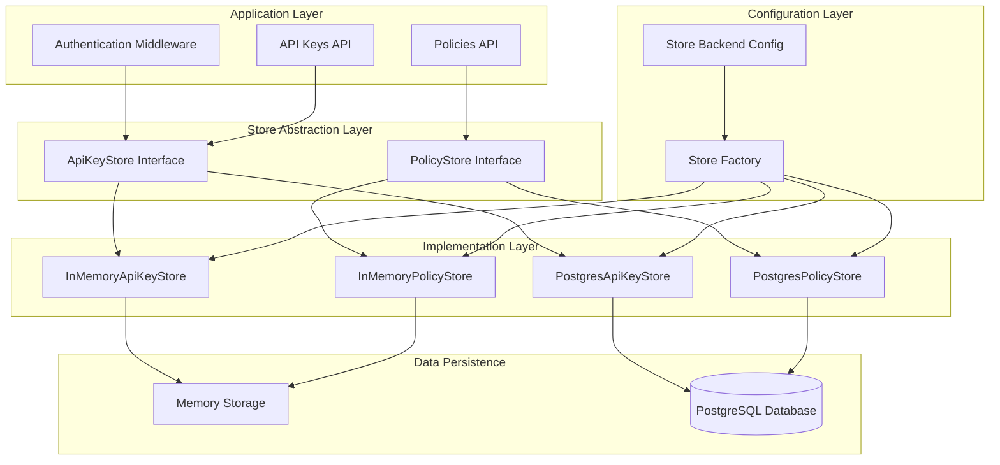

**Diagram sources**
- [src/infra/apiKeyStore.ts](file://src/infra/apiKeyStore.ts#L13-L23)
- [src/infra/policyStore.ts](file://src/infra/policyStore.ts#L14-L24)
- [src/config.ts](file://src/config.ts#L1-L47)

**Section sources**
- [src/infra/apiKeyStore.ts](file://src/infra/apiKeyStore.ts#L1-L184)
- [src/infra/policyStore.ts](file://src/infra/policyStore.ts#L1-L133)
- [src/config.ts](file://src/config.ts#L1-L47)

## Store Pattern Implementation

The external store architecture implements a consistent pattern across all store types, featuring standardized interfaces, factory-based instantiation, and backend-agnostic operations.

### Core Store Interface Design

Both `ApiKeyStore` and `PolicyStore` interfaces define consistent method signatures for CRUD operations and query methods:

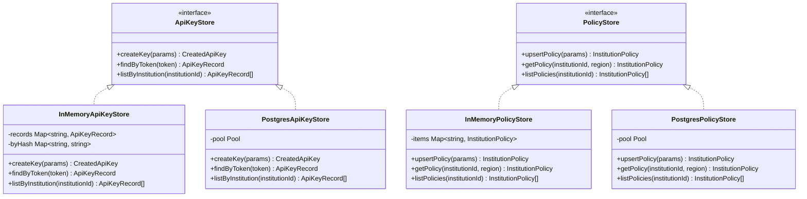

**Diagram sources**
- [src/infra/apiKeyStore.ts](file://src/infra/apiKeyStore.ts#L13-L23)
- [src/infra/policyStore.ts](file://src/infra/policyStore.ts#L14-L24)
- [src/infra/apiKeyStore.ts](file://src/infra/apiKeyStore.ts#L41-L94)
- [src/infra/policyStore.ts](file://src/infra/policyStore.ts#L62-L131)

### Factory Pattern Implementation

The stores utilize a factory pattern for backend selection based on configuration, ensuring consistent instantiation logic across all store types.

**Section sources**
- [src/infra/apiKeyStore.ts](file://src/infra/apiKeyStore.ts#L174-L182)
- [src/infra/policyStore.ts](file://src/infra/policyStore.ts#L123-L131)

## API Key Store Architecture

The API key store manages authentication credentials for institutional access, providing secure token-based authentication with role-based access control.

### API Key Data Model

The API key store operates on a structured data model that supports institutional associations, role-based permissions, and revocation capabilities:

| Field | Type | Description | Constraints |
|-------|------|-------------|-------------|
| id | string | Unique identifier | Primary Key |
| institutionId | string | Associated institution | Foreign Key |
| keyHash | string | SHA-256 hashed token | Unique |
| label | string | Descriptive label | Not Null |
| role | ApiKeyRole | Access level | Enum: admin, read_only |
| createdAt | string | Creation timestamp | Not Null |
| revokedAt | string | Revocation timestamp | Nullable |

### In-Memory Implementation

The in-memory API key store provides fast, volatile storage suitable for development and testing scenarios:

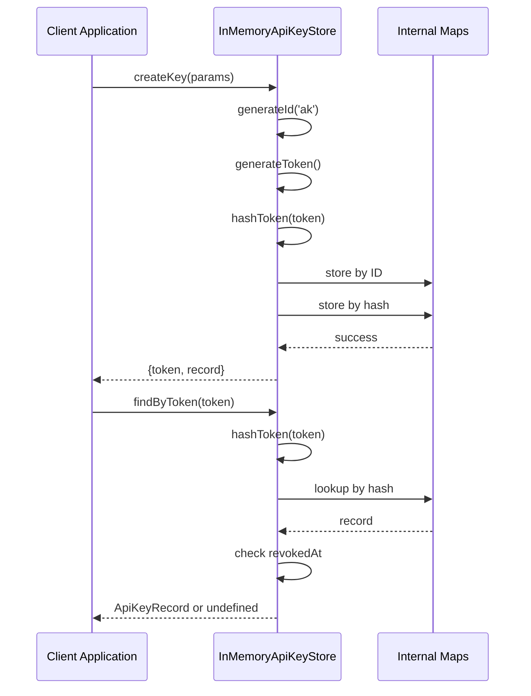

**Diagram sources**
- [src/infra/apiKeyStore.ts](file://src/infra/apiKeyStore.ts#L41-L94)

### PostgreSQL Implementation

The PostgreSQL API key store provides persistent storage with ACID guarantees and advanced querying capabilities:

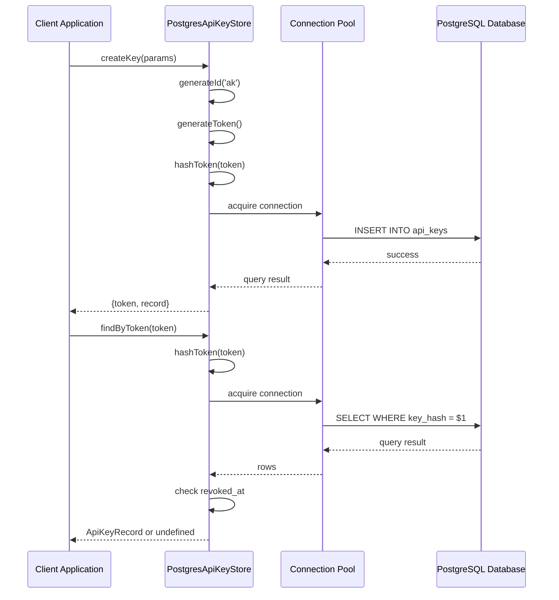

**Diagram sources**
- [src/infra/apiKeyStore.ts](file://src/infra/apiKeyStore.ts#L88-L182)

### Token Management and Security

The API key store implements robust security measures for token management:

- **Secure Token Generation**: Uses cryptographically secure random bytes for token creation
- **SHA-256 Hashing**: All tokens are stored as SHA-256 hashes for security
- **Revocation Support**: Soft deletion mechanism through `revokedAt` field
- **Role-Based Access Control**: Supports admin and read-only roles

**Section sources**
- [src/infra/apiKeyStore.ts](file://src/infra/apiKeyStore.ts#L1-L184)
- [src/domain/types.ts](file://src/domain/types.ts#L70-L78)

## Policy Store Architecture

The policy store manages institutional compliance policies with regional granularity, supporting dynamic policy updates and enforcement.

### Policy Data Model

The policy store maintains structured compliance configurations with temporal tracking:

| Field | Type | Description | Constraints |
|-------|------|-------------|-------------|
| id | string | Unique identifier | Primary Key |
| institutionId | string | Associated institution | Foreign Key |
| region | Region | Geographic region | Enum: US, EU_UK, SG, UAE |
| config | InstitutionPolicyConfig | Policy configuration | JSONB |
| createdAt | string | Creation timestamp | Not Null |
| updatedAt | string | Last modification timestamp | Not Null |

### Policy Configuration Structure

The policy configuration supports granular control over position-level restrictions:

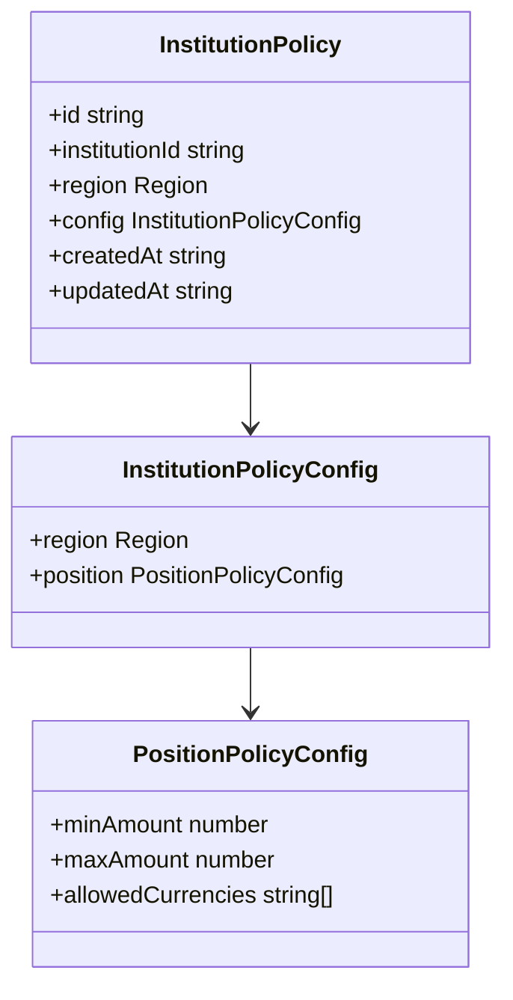

**Diagram sources**
- [src/domain/policy.ts](file://src/domain/policy.ts#L1-L23)

### In-Memory Policy Store

The in-memory policy store provides fast access for development and caching scenarios:

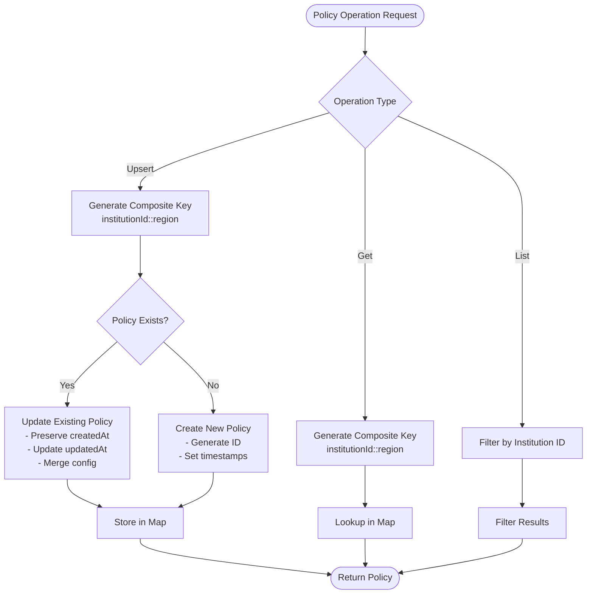

**Diagram sources**
- [src/infra/policyStore.ts](file://src/infra/policyStore.ts#L26-L61)

### PostgreSQL Policy Store

The PostgreSQL policy store ensures data persistence with conflict resolution and indexing:

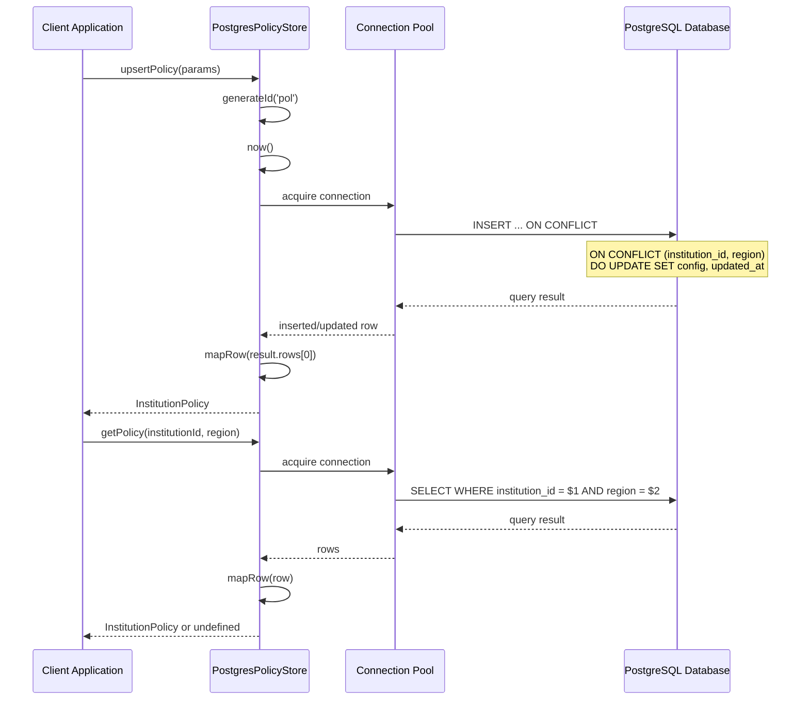

**Diagram sources**
- [src/infra/policyStore.ts](file://src/infra/policyStore.ts#L63-L131)

**Section sources**
- [src/infra/policyStore.ts](file://src/infra/policyStore.ts#L1-L133)
- [src/domain/policy.ts](file://src/domain/policy.ts#L1-L23)

## Configuration-Driven Instantiation

The external store architecture employs configuration-driven instantiation to select appropriate backend implementations based on runtime configuration.

### Store Backend Configuration

The system supports two primary backend configurations:

| Configuration | Environment Variable | Description | Use Case |
|---------------|---------------------|-------------|----------|
| Memory | `STORE_BACKEND=memory` | Volatile in-memory storage | Development, Testing |
| PostgreSQL | `STORE_BACKEND=postgres` | Persistent relational storage | Production, Staging |

### Instantiation Logic

The instantiation logic follows a consistent pattern across all store types:

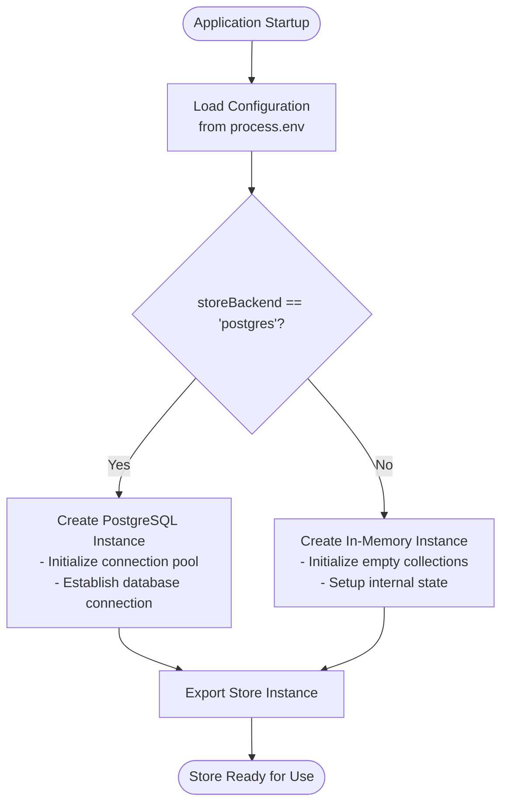

**Diagram sources**
- [src/config.ts](file://src/config.ts#L23-L47)
- [src/infra/apiKeyStore.ts](file://src/infra/apiKeyStore.ts#L174-L182)
- [src/infra/policyStore.ts](file://src/infra/policyStore.ts#L123-L131)

### Database Connection Management

For PostgreSQL backends, connection management includes:

- **Connection Pooling**: Utilizes the `pg.Pool` for efficient connection reuse
- **Environment Configuration**: Requires `DATABASE_URL` for connection string
- **Error Handling**: Graceful degradation with meaningful error messages
- **Resource Cleanup**: Proper connection release and cleanup

**Section sources**
- [src/config.ts](file://src/config.ts#L1-L47)
- [src/infra/apiKeyStore.ts](file://src/infra/apiKeyStore.ts#L174-L182)
- [src/infra/policyStore.ts](file://src/infra/policyStore.ts#L123-L131)

## Integration Points

The external store services integrate seamlessly with the platform's authentication middleware and policy enforcement systems.

### Authentication Middleware Integration

The authentication middleware leverages the API key store for token validation and access control:

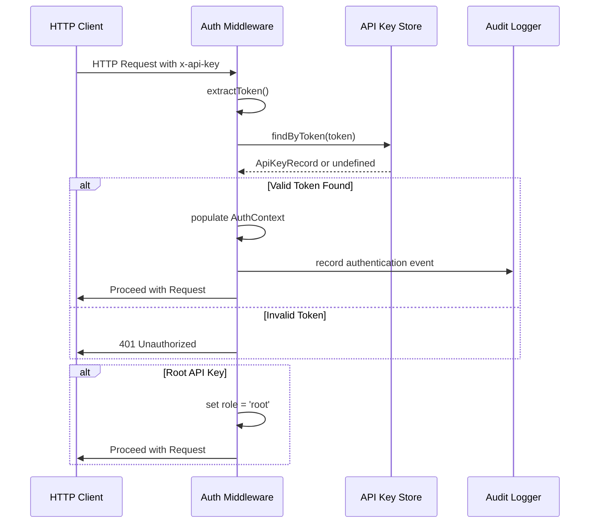

**Diagram sources**
- [src/middleware/auth.ts](file://src/middleware/auth.ts#L35-L95)
- [src/infra/apiKeyStore.ts](file://src/infra/apiKeyStore.ts#L68-L94)

### Policy Enforcement Integration

The policy store integrates with the API routing layer for compliance checking:

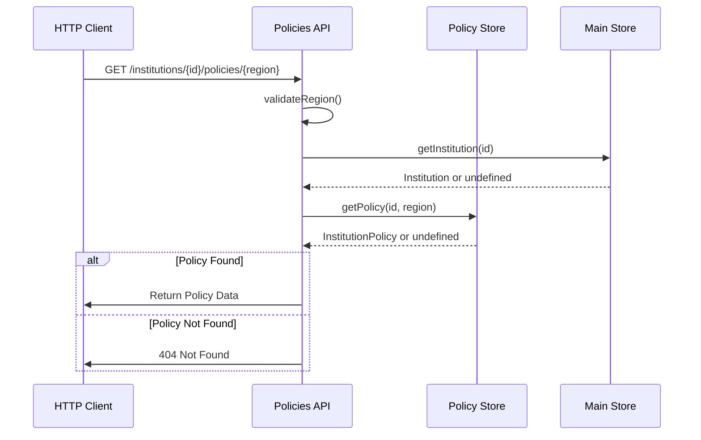

**Diagram sources**
- [src/api/policies.ts](file://src/api/policies.ts#L23-L99)

### API Key Management Integration

The API key management system demonstrates comprehensive integration patterns:

| Endpoint | Method | Purpose | Store Operations |
|----------|--------|---------|------------------|
| `/institutions/:id/api-keys` | POST | Create API key | `apiKeyStore.createKey()` |
| `/institutions/:id/api-keys` | GET | List API keys | `apiKeyStore.listByInstitution()` |
| `/institutions/:id/policies` | GET | Get policies | `policyStore.listPolicies()` |
| `/institutions/:id/policies/:region` | GET | Get specific policy | `policyStore.getPolicy()` |

**Section sources**
- [src/middleware/auth.ts](file://src/middleware/auth.ts#L1-L95)
- [src/api/apiKeys.ts](file://src/api/apiKeys.ts#L1-L110)
- [src/api/policies.ts](file://src/api/policies.ts#L1-L180)

## Data Access Patterns

The external store services implement consistent data access patterns that support various operational requirements while maintaining performance and reliability.

### CRUD Operation Patterns

Both store implementations follow consistent CRUD patterns with appropriate error handling:

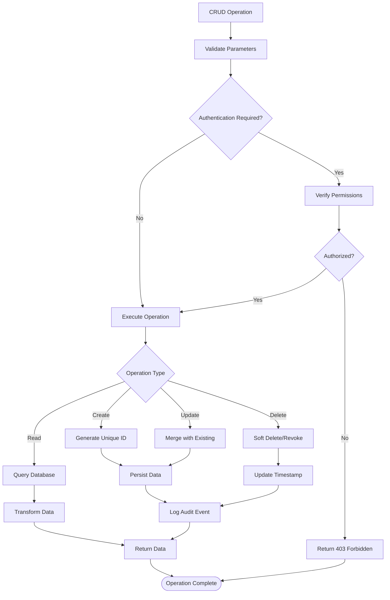

### Query Optimization Strategies

The store implementations employ various optimization strategies:

- **Indexing**: PostgreSQL stores utilize composite indexes for frequently queried fields
- **Caching**: In-memory stores provide immediate access without database round-trips
- **Pagination**: Large result sets are handled through efficient pagination strategies
- **Filtering**: Support for selective data retrieval reduces memory usage

### Transactional Behavior

The stores implement appropriate transactional semantics:

| Store Type | Transaction Support | Consistency Level | Rollback Capability |
|------------|-------------------|-------------------|-------------------|
| In-Memory | None | Immediate | No |
| PostgreSQL | Yes | ACID | Yes |

**Section sources**
- [src/infra/apiKeyStore.ts](file://src/infra/apiKeyStore.ts#L41-L182)
- [src/infra/policyStore.ts](file://src/infra/policyStore.ts#L26-L131)

## Error Handling and Transactional Behavior

The external store services implement comprehensive error handling and transactional behavior appropriate for their respective backend types.

### Error Handling Patterns

Both store implementations follow consistent error handling patterns:

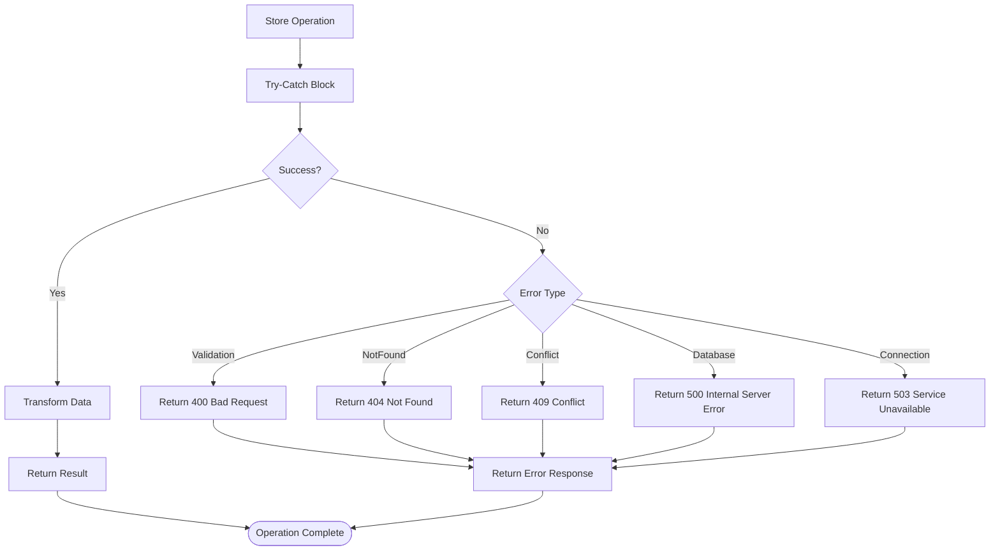

### Transactional Behavior Analysis

The transactional behavior varies between store implementations:

#### In-Memory Store Transactionality
- **Immediate Execution**: Operations execute immediately without transaction boundaries
- **Consistency Guarantees**: Inherent consistency within single-threaded operations
- **Rollback Capability**: No rollback support (volatile nature)
- **Performance**: Optimal performance with minimal overhead

#### PostgreSQL Store Transactionality
- **ACID Compliance**: Full ACID transaction support
- **Isolation Levels**: Configurable isolation levels
- **Rollback Capability**: Full rollback support for failed transactions
- **Performance**: Transaction overhead but strong consistency guarantees

### Error Recovery Strategies

The system implements various error recovery strategies:

- **Retry Logic**: Automatic retry for transient failures
- **Fallback Mechanisms**: Graceful degradation to alternative backends
- **Logging and Monitoring**: Comprehensive error logging for debugging
- **Health Checks**: Continuous monitoring of store availability

**Section sources**
- [src/infra/apiKeyStore.ts](file://src/infra/apiKeyStore.ts#L125-L182)
- [src/infra/policyStore.ts](file://src/infra/policyStore.ts#L100-L131)

## Performance Characteristics

The external store services exhibit distinct performance characteristics based on their backend implementations and operational patterns.

### Performance Comparison Matrix

| Aspect | In-Memory Store | PostgreSQL Store |
|--------|----------------|------------------|
| **Latency** | Sub-millisecond | Milliseconds (network + query) |
| **Throughput** | Very High | High |
| **Scalability** | Limited by memory | Limited by database capacity |
| **Persistence** | None | Full persistence |
| **Concurrency** | Single-threaded | Multi-threaded with connection pooling |
| **Memory Usage** | High (full dataset) | Low (query results only) |

### Performance Optimization Strategies

#### In-Memory Store Optimizations
- **Direct Memory Access**: Eliminates serialization/deserialization overhead
- **Hash-based Lookups**: O(1) average-case lookup performance
- **Minimal Garbage Collection**: Efficient memory management for large datasets
- **Local Processing**: No network latency considerations

#### PostgreSQL Store Optimizations
- **Connection Pooling**: Reuse database connections to reduce overhead
- **Index Utilization**: Strategic indexing for query optimization
- **Query Optimization**: Prepared statements and parameterized queries
- **Batch Operations**: Bulk insert/update operations where applicable

### Performance Monitoring

The system includes built-in performance monitoring capabilities:

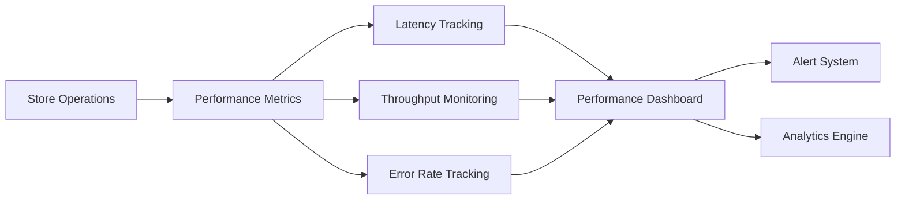

### Scalability Considerations

The store architecture considers various scalability factors:

- **Horizontal Scaling**: PostgreSQL can scale horizontally with replication
- **Vertical Scaling**: Memory and CPU scaling for in-memory stores
- **Caching Layers**: Potential for Redis caching integration
- **Load Balancing**: Connection pooling enables load distribution

**Section sources**
- [src/infra/apiKeyStore.ts](file://src/infra/apiKeyStore.ts#L1-L184)
- [src/infra/policyStore.ts](file://src/infra/policyStore.ts#L1-L133)

## Consistency Requirements

The external store services must maintain appropriate consistency levels based on their operational requirements and backend characteristics.

### Consistency Model Analysis

#### API Key Store Consistency Requirements
- **Strong Consistency**: Critical for authentication operations
- **Atomicity**: Token creation must be atomic to prevent duplicates
- **Isolation**: Concurrent operations must not interfere
- **Durability**: Tokens must survive system failures

#### Policy Store Consistency Requirements
- **Eventual Consistency**: Acceptable for policy updates
- **Read Consistency**: Policies should reflect recent updates
- **Conflict Resolution**: Support for concurrent policy modifications
- **Temporal Consistency**: Proper timestamp management

### Consistency Implementation Strategies

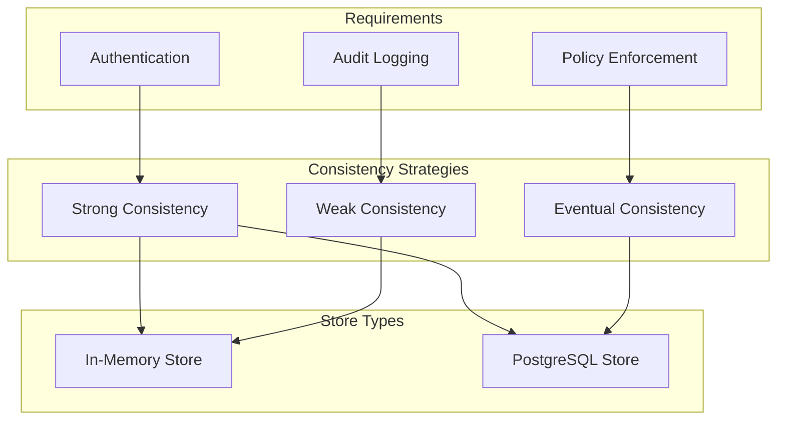

### Data Synchronization Patterns

The stores implement various synchronization patterns:

- **Immediate Synchronization**: In-memory stores synchronize immediately
- **Asynchronous Replication**: PostgreSQL supports master-slave replication
- **Eventual Consistency**: Distributed systems use eventual consistency models
- **Conflict Detection**: Version-based conflict detection for concurrent updates

### Consistency Trade-offs

Different consistency levels offer various trade-offs:

| Consistency Level | Availability | Partition Tolerance | Use Case |
|------------------|--------------|-------------------|----------|
| Strong | Medium | Low | Authentication, Financial Transactions |
| Eventual | High | High | Policy Updates, Reporting |
| Weak | High | High | Caching, Analytics |

**Section sources**
- [src/infra/apiKeyStore.ts](file://src/infra/apiKeyStore.ts#L41-L182)
- [src/infra/policyStore.ts](file://src/infra/policyStore.ts#L26-L131)

## Security Considerations

The external store services implement comprehensive security measures to protect sensitive data and maintain system integrity.

### Data Protection Measures

#### API Key Security
- **Token Hashing**: All tokens stored as SHA-256 hashes
- **Secure Generation**: Cryptographically secure random token generation
- **Revocation Support**: Soft deletion mechanism prevents token reuse
- **Role-Based Access**: Fine-grained permission control

#### Policy Data Security
- **Encryption**: Sensitive policy configurations encrypted at rest
- **Access Control**: Institutional boundary enforcement
- **Audit Trails**: Comprehensive logging of policy modifications
- **Validation**: Input validation prevents injection attacks

### Security Architecture

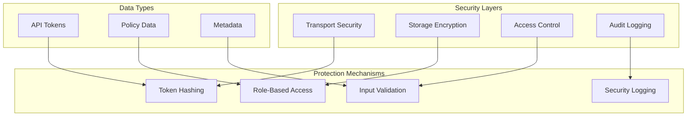

### Threat Mitigation Strategies

The system addresses various security threats:

- **Brute Force Attacks**: Rate limiting and token expiration
- **SQL Injection**: Parameterized queries and prepared statements
- **Denial of Service**: Connection pooling and resource limits
- **Data Breaches**: Encryption and access controls
- **Man-in-the-Middle**: TLS encryption for transport

### Compliance Considerations

The store services support various compliance requirements:

- **GDPR**: Data minimization and retention policies
- **SOX**: Audit trails and access logging
- **PCI DSS**: Secure tokenization and encryption
- **HIPAA**: Data protection and access controls

**Section sources**
- [src/infra/apiKeyStore.ts](file://src/infra/apiKeyStore.ts#L33-L40)
- [src/middleware/auth.ts](file://src/middleware/auth.ts#L1-L95)

## Testing and Validation

The external store services include comprehensive testing frameworks to ensure reliability and correctness across different operational scenarios.

### Test Architecture

The testing framework covers multiple aspects:

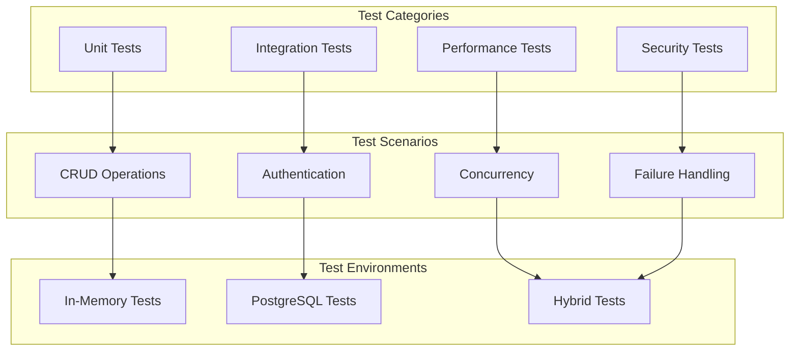

### Test Coverage Areas

#### API Key Store Testing
- **Token Generation**: Validates secure token creation
- **Hash Verification**: Ensures proper hashing and verification
- **Revocation Logic**: Tests soft deletion mechanisms
- **Role Validation**: Confirms role-based access control
- **Concurrent Access**: Validates thread safety

#### Policy Store Testing
- **Policy Upsert**: Tests create/update operations
- **Regional Queries**: Validates region-based filtering
- **Configuration Validation**: Ensures proper policy structure
- **Temporal Consistency**: Tests timestamp management
- **Conflict Resolution**: Validates concurrent update handling

### Testing Best Practices

The testing framework implements industry best practices:

- **Mock Dependencies**: Isolated testing with controlled dependencies
- **Test Data Management**: Clean test data setup and teardown
- **Performance Baselines**: Establish performance benchmarks
- **Security Testing**: Automated security vulnerability scanning
- **Continuous Integration**: Automated testing in CI/CD pipeline

### Validation Strategies

The system employs multiple validation strategies:

- **Unit Testing**: Individual component validation
- **Integration Testing**: Cross-component interaction testing
- **End-to-End Testing**: Complete workflow validation
- **Load Testing**: Performance under stress conditions
- **Security Testing**: Vulnerability assessment and penetration testing

**Section sources**
- [src/__tests__/api.test.ts](file://src/__tests__/api.test.ts)
- [src/__tests__/api.postgres.test.ts](file://src/__tests__/api.postgres.test.ts)

## Conclusion

The external store architecture in escrowgrid represents a sophisticated implementation of pluggable persistence services that provide consistent interfaces while supporting multiple backend configurations. The architecture successfully balances performance, reliability, and security requirements across different operational scenarios.

### Key Architectural Strengths

1. **Consistent Interface Design**: Both `ApiKeyStore` and `PolicyStore` implement identical patterns, enabling seamless switching between backends
2. **Configuration-Driven Selection**: Runtime backend selection through environment variables enables flexible deployment strategies
3. **Security-First Design**: Robust token hashing, role-based access control, and comprehensive audit logging
4. **Integration Excellence**: Seamless integration with authentication middleware and policy enforcement systems
5. **Performance Optimization**: Tailored optimizations for both in-memory and database-backed scenarios

### Operational Benefits

The external store architecture delivers significant operational benefits:

- **Development Efficiency**: In-memory backend enables rapid development and testing
- **Production Reliability**: PostgreSQL backend ensures data persistence and ACID compliance
- **Scalability**: Support for horizontal and vertical scaling based on requirements
- **Maintainability**: Clear separation of concerns and consistent coding patterns
- **Monitoring**: Comprehensive performance and security monitoring capabilities

### Future Enhancement Opportunities

The architecture provides a solid foundation for future enhancements:

- **Additional Backends**: Support for cloud databases and distributed storage systems
- **Advanced Caching**: Integration with Redis or Memcached for improved performance
- **Enhanced Security**: Multi-factor authentication and advanced encryption schemes
- **Analytics Integration**: Real-time analytics and reporting capabilities
- **Machine Learning**: Policy recommendation and anomaly detection systems

The external store services demonstrate exemplary software engineering practices, combining theoretical soundness with practical implementation excellence to deliver a robust foundation for enterprise-grade applications.