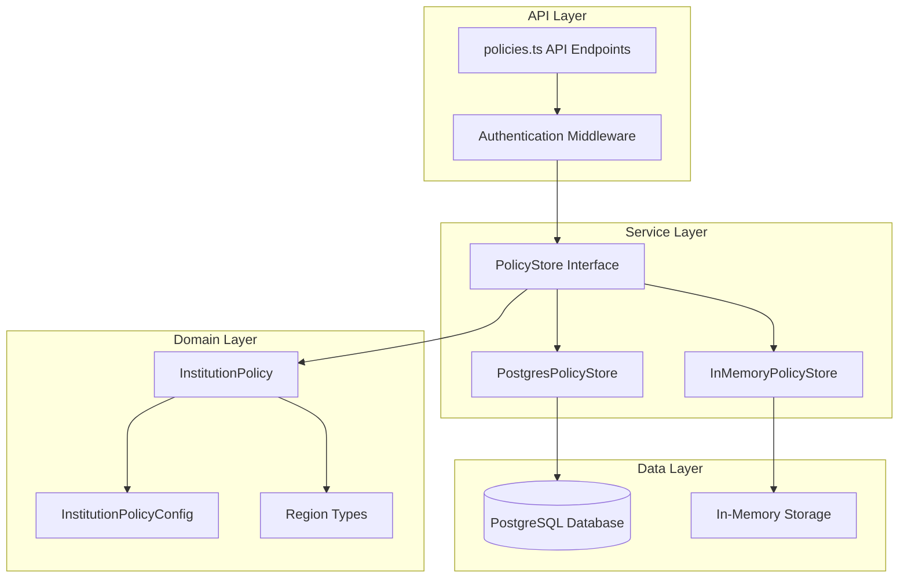
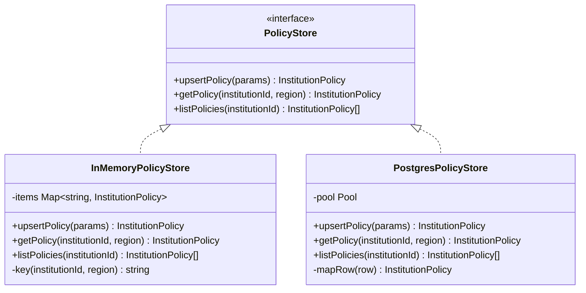
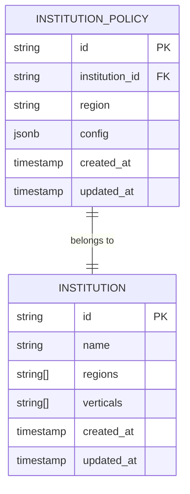
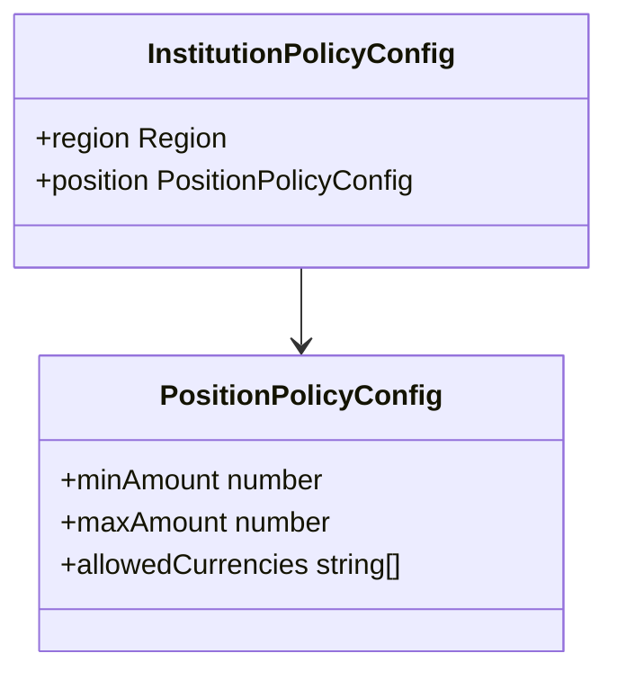
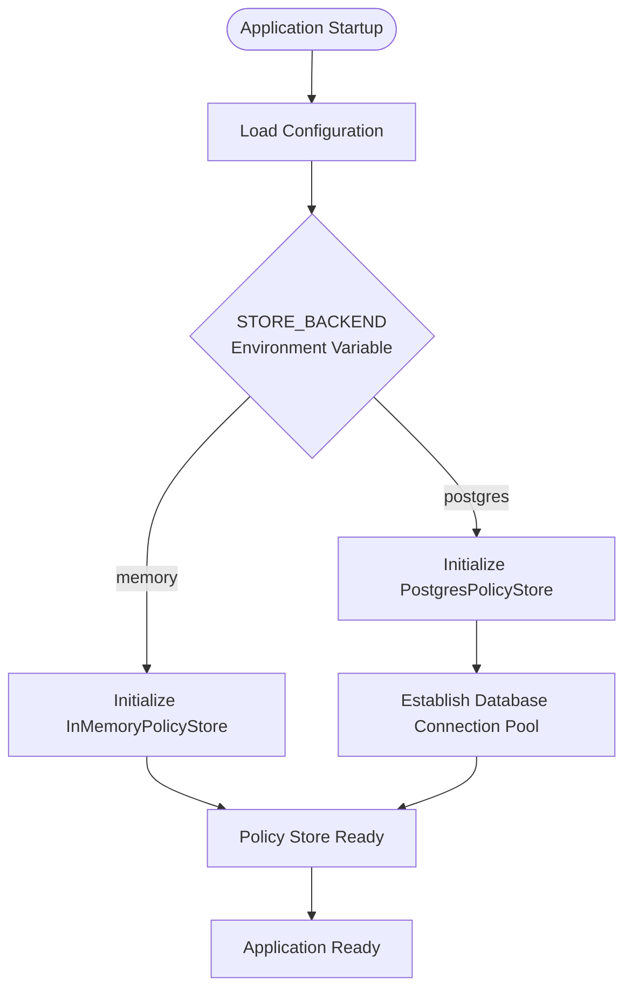
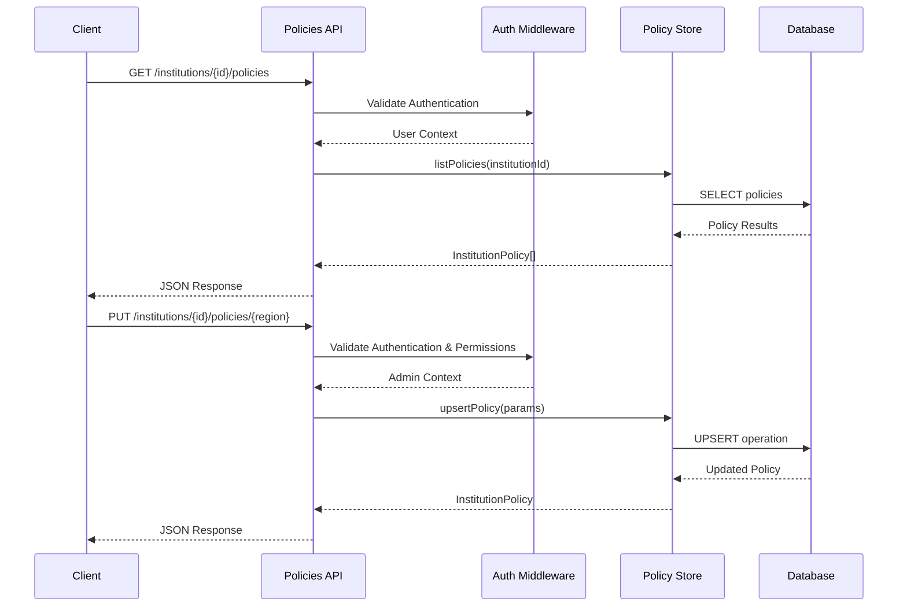

# Policy Store

<cite>
**Referenced Files in This Document**
- [src/infra/policyStore.ts](file://src/infra/policyStore.ts)
- [src/domain/policy.ts](file://src/domain/policy.ts)
- [src/domain/types.ts](file://src/domain/types.ts)
- [src/config.ts](file://src/config.ts)
- [src/api/policies.ts](file://src/api/policies.ts)
- [src/store/postgresStore.ts](file://src/store/postgresStore.ts)
- [src/store/memoryStore.ts](file://src/store/memoryStore.ts)
- [db/schema.sql](file://db/schema.sql)
</cite>

## Table of Contents
1. [Introduction](#introduction)
2. [Architecture Overview](#architecture-overview)
3. [PolicyStore Interface](#policystore-interface)
4. [Implementation Details](#implementation-details)
5. [Data Model](#data-model)
6. [Configuration and Backend Selection](#configuration-and-backend-selection)
7. [API Endpoints](#api-endpoints)
8. [Consistency and Transactional Integrity](#consistency-and-transactional-integrity)
9. [Common Issues and Troubleshooting](#common-issues-and-troubleshooting)
10. [Best Practices](#best-practices)

## Introduction

The Policy Store service in escrowgrid provides a unified interface for managing institutional compliance policies across different regions. It enables organizations to define and enforce regulatory requirements for financial transactions, particularly focusing on position-level controls such as minimum/maximum amounts and allowed currencies.

The service operates as a dual-backend system, supporting both in-memory storage for development and testing environments, and PostgreSQL for production deployments. This flexibility allows for seamless transitions between environments while maintaining consistent policy management capabilities.

## Architecture Overview

The Policy Store follows a layered architecture with clear separation of concerns:



**Diagram sources**
- [src/infra/policyStore.ts](file://src/infra/policyStore.ts#L14-L24)
- [src/api/policies.ts](file://src/api/policies.ts#L1-L10)
- [src/config.ts](file://src/config.ts#L123-L133)

## PolicyStore Interface

The PolicyStore interface defines the contract for policy management operations:



**Diagram sources**
- [src/infra/policyStore.ts](file://src/infra/policyStore.ts#L14-L24)
- [src/infra/policyStore.ts](file://src/infra/policyStore.ts#L26-L61)
- [src/infra/policyStore.ts](file://src/infra/policyStore.ts#L63-L131)

**Section sources**
- [src/infra/policyStore.ts](file://src/infra/policyStore.ts#L14-L24)

## Implementation Details

### InMemoryPolicyStore

The in-memory implementation provides fast access for development and testing scenarios:

#### Method Behavior

**upsertPolicy**
- **Parameters**: `institutionId` (string), `region` (Region), `config` (InstitutionPolicyConfig)
- **Return Value**: Promise resolving to InstitutionPolicy
- **Behavior**: Creates or updates a policy with the specified institutionId and region combination. Uses a composite key format (`institutionId::region`) for uniqueness.

**getPolicy**
- **Parameters**: `institutionId` (string), `region` (Region)
- **Return Value**: Promise resolving to InstitutionPolicy or undefined
- **Behavior**: Retrieves the policy for the given institution and region combination.

**listPolicies**
- **Parameters**: `institutionId` (string)
- **Return Value**: Promise resolving to array of InstitutionPolicy
- **Behavior**: Returns all policies associated with the specified institution.

#### Key Generation and Timestamp Management
- Uses UUID-like identifiers with prefix 'pol'
- Generates timestamps in ISO format for creation and update tracking
- Maintains policy identity through composite keys

**Section sources**
- [src/infra/policyStore.ts](file://src/infra/policyStore.ts#L26-L61)

### PostgresPolicyStore

The PostgreSQL implementation provides persistent storage with ACID guarantees:

#### Method Behavior

**upsertPolicy**
- **Parameters**: `institutionId` (string), `region` (Region), `config` (InstitutionPolicyConfig)
- **Return Value**: Promise resolving to InstitutionPolicy
- **Behavior**: Performs UPSERT operation using PostgreSQL's ON CONFLICT clause to handle concurrent updates gracefully.

**getPolicy**
- **Parameters**: `institutionId` (string), `region` (Region)
- **Return Value**: Promise resolving to InstitutionPolicy or undefined
- **Behavior**: Executes SELECT query with institution_id and region filtering.

**listPolicies**
- **Parameters**: `institutionId` (string)
- **Return Value**: Promise resolving to array of InstitutionPolicy
- **Behavior**: Retrieves all policies for the specified institution ordered by region.

#### Database Operations

The PostgreSQL implementation leverages advanced SQL features:

- **ON CONFLICT Clause**: Handles simultaneous upsert operations without race conditions
- **JSONB Storage**: Stores policy configuration as structured JSON data
- **Composite Indexes**: Optimizes queries on institution_id and region combinations
- **Connection Pooling**: Manages database connections efficiently

**Section sources**
- [src/infra/policyStore.ts](file://src/infra/policyStore.ts#L63-L131)

## Data Model

### InstitutionPolicy Entity

The core entity representing institutional compliance policies:



**Diagram sources**
- [src/domain/policy.ts](file://src/domain/policy.ts#L14-L21)
- [db/schema.sql](file://db/schema.sql#L126-L137)

### Policy Configuration Structure

Policy configurations are structured hierarchically:



**Diagram sources**
- [src/domain/policy.ts](file://src/domain/policy.ts#L9-L12)

### Regional Compliance Framework

The system supports four primary regions with specific compliance requirements:

| Region | Description | Common Compliance Features |
|--------|-------------|---------------------------|
| US | United States | Anti-Money Laundering (AML), Know Your Customer (KYC) |
| EU_UK | European Union / United Kingdom | GDPR, MiFID II, PSD2 |
| SG | Singapore | MAS Notice 610, Payment Services Act |
| UAE | United Arab Emirates | Central Bank regulations, AML requirements |

**Section sources**
- [src/domain/types.ts](file://src/domain/types.ts#L1)
- [src/domain/policy.ts](file://src/domain/policy.ts#L1-L23)

## Configuration and Backend Selection

### Environment Configuration

The Policy Store backend selection is controlled through environment variables:



**Diagram sources**
- [src/config.ts](file://src/config.ts#L25)
- [src/infra/policyStore.ts](file://src/infra/policyStore.ts#L123-L131)

### Configuration Options

| Parameter | Type | Default | Description |
|-----------|------|---------|-------------|
| `STORE_BACKEND` | StoreBackend | 'memory' | Backend selection: 'memory' or 'postgres' |
| `DATABASE_URL` | string | - | PostgreSQL connection string (required for postgres backend) |
| `PORT` | number | 4000 | Server port for API endpoints |

### Connection Pooling Configuration

For PostgreSQL backend, the connection pool is configured automatically:

- **Connection String**: Extracted from `DATABASE_URL` environment variable
- **Automatic Pooling**: Uses pg.Pool for efficient connection management
- **Error Handling**: Validates database URL presence during initialization

**Section sources**
- [src/config.ts](file://src/config.ts#L1-L47)
- [src/infra/policyStore.ts](file://src/infra/policyStore.ts#L66-L68)

## API Endpoints

### Policy Management Endpoints

The Policy Store exposes RESTful endpoints for policy management:



**Diagram sources**
- [src/api/policies.ts](file://src/api/policies.ts#L24-L177)

### Endpoint Specifications

| Method | Endpoint | Description | Authentication |
|--------|----------|-------------|----------------|
| GET | `/institutions/:id/policies` | List all policies for an institution | Institution access or root |
| GET | `/institutions/:id/policies/:region` | Get policy for specific region | Institution access or root |
| PUT | `/institutions/:id/policies/:region` | Upsert policy for region | Admin access only |

### Request/Response Formats

**GET /institutions/:id/policies**
- **Response**: Array of policy objects with full metadata
- **Status Codes**: 200 (success), 401 (unauthenticated), 403 (forbidden), 404 (not found)

**PUT /institutions/:id/policies/:region**
- **Request Body**: Policy configuration with position constraints
- **Response**: Complete policy object with generated identifiers
- **Status Codes**: 200 (success), 400 (validation error), 401 (unauthenticated), 403 (forbidden), 404 (not found)

**Section sources**
- [src/api/policies.ts](file://src/api/policies.ts#L1-L180)

## Consistency and Transactional Integrity

### In-Memory Consistency

The in-memory implementation provides immediate consistency within the same process:

- **Atomic Operations**: Each method executes as a single atomic operation
- **Memory Isolation**: Policies are isolated to individual application instances
- **No Persistence**: Data loss occurs on application restart

### PostgreSQL Transactional Guarantees

The PostgreSQL implementation ensures ACID compliance:

#### UPSERT Operation Semantics

The ON CONFLICT clause provides sophisticated conflict resolution:

```sql
INSERT INTO institution_policies (id, institution_id, region, config, created_at, updated_at)
VALUES ($1, $2, $3, $4, $5, $6)
ON CONFLICT (institution_id, region)
DO UPDATE SET config = EXCLUDED.config, updated_at = EXCLUDED.updated_at
RETURNING *
```

**Key Features**:
- **Unique Constraint**: Prevents duplicate policies per institution-region combination
- **Conditional Updates**: Only updates when configuration differs
- **Timestamp Management**: Automatically updates `updated_at` timestamp
- **Identity Preservation**: Maintains original policy identifier

#### Connection Pooling and Resource Management

- **Pool Configuration**: Automatic connection pooling with configurable limits
- **Resource Cleanup**: Proper connection release after operations
- **Error Recovery**: Automatic retry mechanisms for transient failures

### Caching Considerations

While the current implementation doesn't include explicit caching, several factors influence cache behavior:

- **In-Memory Store**: Natural caching through Map-based storage
- **Database Queries**: PostgreSQL query planner optimizes repeated requests
- **Composite Keys**: Efficient indexing on institution_id and region combinations

**Section sources**
- [src/infra/policyStore.ts](file://src/infra/policyStore.ts#L89-L98)
- [db/schema.sql](file://db/schema.sql#L133)

## Common Issues and Troubleshooting

### Stale Policy Reads

**Problem**: Application retrieves outdated policy configurations

**Causes**:
- In-memory store not synchronized across multiple instances
- Database connection pooling delays propagation
- Concurrent updates not immediately visible

**Solutions**:
- Use PostgreSQL backend for consistent reads across instances
- Implement cache invalidation strategies for production deployments
- Design applications to handle eventual consistency gracefully

### Schema Mismatches in Config JSON

**Problem**: Policy configuration validation fails due to unexpected JSON structure

**Common Issues**:
- Missing required fields in policy configuration
- Incorrect data types (numbers vs strings)
- Malformed JSON structure

**Diagnostic Approach**:
```typescript
// Validation pattern from API layer
if (positionConfig.minAmount !== undefined && typeof positionConfig.minAmount !== 'number') {
  return res.status(400).json({ error: 'position.minAmount must be a number when provided' });
}
```

**Prevention Strategies**:
- Implement comprehensive schema validation
- Use TypeScript interfaces for compile-time checking
- Add unit tests for policy configuration parsing

### Connection Pooling Limits

**Problem**: Database connection exhaustion under high load

**Symptoms**:
- Timeout errors during policy operations
- Slow response times
- Connection refused errors

**Monitoring and Resolution**:
- Monitor connection pool metrics
- Adjust pool size based on workload patterns
- Implement circuit breaker patterns for database operations
- Consider connection pooling libraries for advanced management

### Regional Compliance Validation

**Problem**: Invalid region specification causing API errors

**Solution**: The system validates regions against a predefined whitelist:

```typescript
const REGIONS: Region[] = ['US', 'EU_UK', 'SG', 'UAE'];
function isRegion(value: string): value is Region {
  return REGIONS.includes(value as Region);
}
```

**Best Practices**:
- Validate region parameters early in the request pipeline
- Provide clear error messages for unsupported regions
- Maintain region whitelist consistency across the application

**Section sources**
- [src/api/policies.ts](file://src/api/policies.ts#L11-L13)
- [src/api/policies.ts](file://src/api/policies.ts#L131-L151)

## Best Practices

### Policy Design Guidelines

1. **Granular Regions**: Define policies at the appropriate regional granularity
2. **Hierarchical Configuration**: Use PositionPolicyConfig for fine-grained controls
3. **Version Control**: Consider implementing policy versioning for compliance tracking
4. **Documentation**: Maintain clear documentation of policy rationale and compliance requirements

### Performance Optimization

1. **Index Utilization**: Leverage composite indexes on (institution_id, region)
2. **Connection Pooling**: Configure appropriate pool sizes for production workloads
3. **Query Optimization**: Use prepared statements and parameterized queries
4. **Caching Layers**: Implement application-level caching for frequently accessed policies

### Security Considerations

1. **Access Control**: Implement role-based access control for policy modifications
2. **Audit Logging**: Track all policy changes for compliance and forensic analysis
3. **Validation**: Validate all incoming policy configurations
4. **Encryption**: Consider encrypting sensitive policy data at rest

### Operational Excellence

1. **Monitoring**: Implement comprehensive monitoring for policy store operations
2. **Backup Strategy**: Ensure regular backups of policy configurations
3. **Disaster Recovery**: Plan for policy store failure scenarios
4. **Testing**: Maintain comprehensive test suites for policy operations

The Policy Store service provides a robust foundation for institutional compliance management, offering both development convenience and production reliability through its dual-backend architecture.