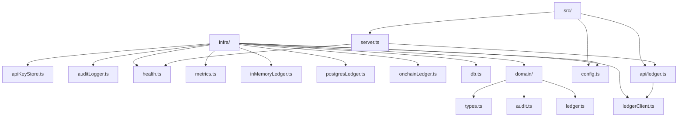
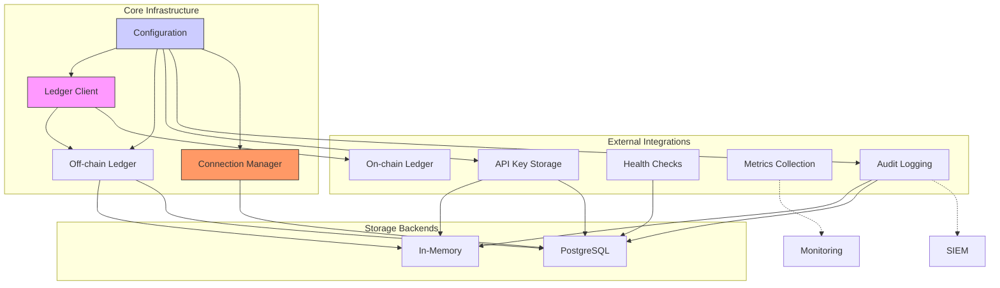
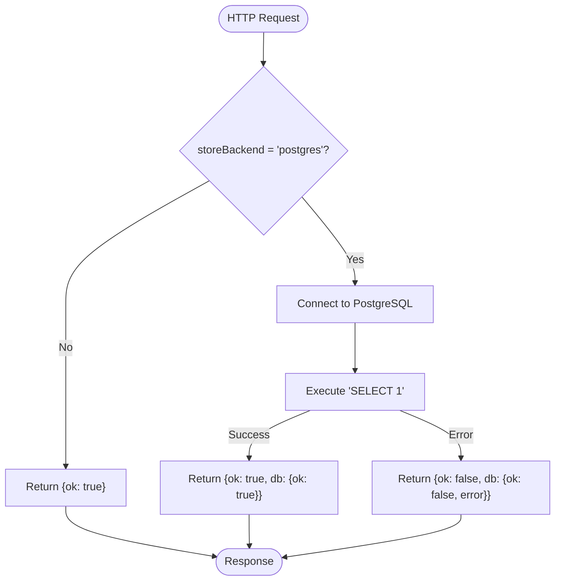
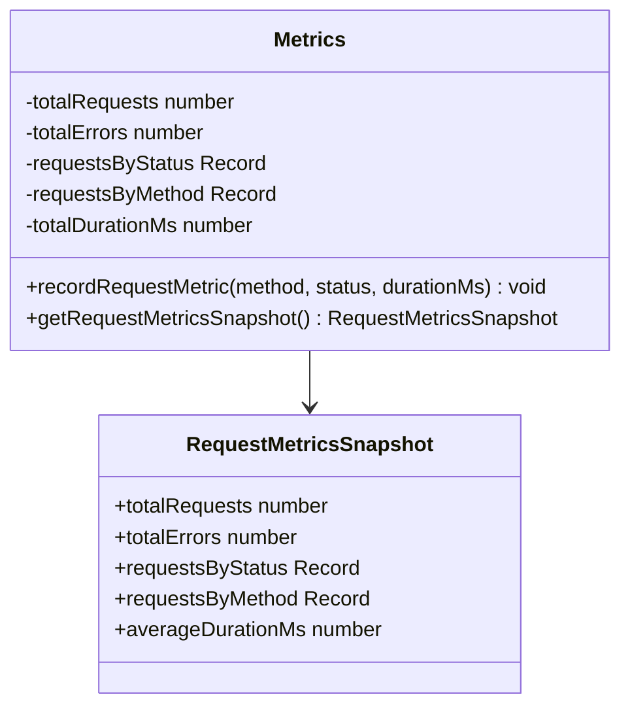
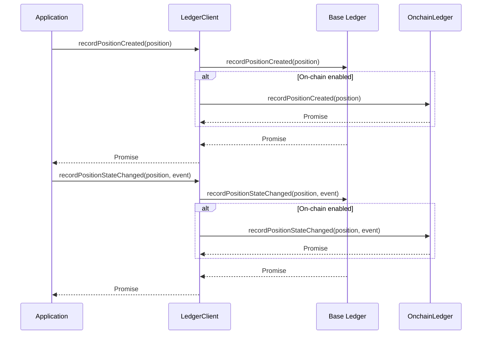
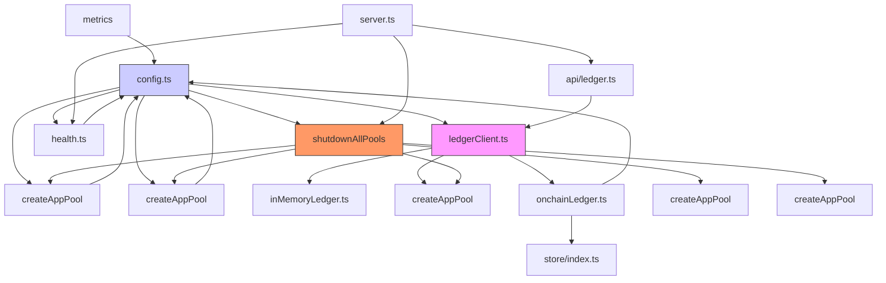

# Infrastructure Services

<cite>
**Referenced Files in This Document**   
- [apiKeyStore.ts](file://src/infra/apiKeyStore.ts) - *Updated to use centralized database connection management*
- [auditLogger.ts](file://src/infra/auditLogger.ts) - *Updated to use centralized database connection management*
- [db.ts](file://src/infra/db.ts) - *Added createAppPool and shutdownAllPools for centralized database connection management*
- [health.ts](file://src/infra/health.ts)
- [metrics.ts](file://src/infra/metrics.ts)
- [ledgerClient.ts](file://src/infra/ledgerClient.ts)
- [inMemoryLedger.ts](file://src/infra/inMemoryLedger.ts)
- [postgresLedger.ts](file://src/infra/postgresLedger.ts)
- [onchainLedger.ts](file://src/infra/onchainLedger.ts)
- [config.ts](file://src/config.ts)
- [ledger.ts](file://src/api/ledger.ts)
- [server.ts](file://src/server.ts)
- [types.ts](file://src/domain/types.ts)
- [ledger.ts](file://src/domain/ledger.ts)
- [audit.ts](file://src/domain/audit.ts)
- [policyStore.ts](file://src/infra/policyStore.ts) - *Updated to use centralized database connection management*
- [postgresStore.ts](file://src/store/postgresStore.ts) - *Updated to use centralized database connection management*
</cite>

## Update Summary
**Changes Made**   
- Added documentation for centralized database connection management via `createAppPool` and `shutdownAllPools` in `db.ts`
- Updated section sources to reflect modifications in data access layers
- Added new diagram illustrating centralized connection management
- Updated dependency analysis to include new connection lifecycle integration
- Enhanced troubleshooting guide with graceful shutdown considerations

## Table of Contents
1. [Introduction](#introduction)
2. [Project Structure](#project-structure)
3. [Core Components](#core-components)
4. [Architecture Overview](#architecture-overview)
5. [Detailed Component Analysis](#detailed-component-analysis)
6. [Dependency Analysis](#dependency-analysis)
7. [Performance Considerations](#performance-considerations)
8. [Troubleshooting Guide](#troubleshooting-guide)
9. [Conclusion](#conclusion)

## Introduction
This document provides architectural documentation for the infrastructure services in the escrowgrid system. It describes the high-level design of components responsible for external integrations, including API key storage, audit logging, health checks, metrics collection, and ledger operations. The documentation covers the dual ledger architecture with in-memory and PostgreSQL-based off-chain ledgers, as well as Ethereum integration through the on-chain ledger. It explains the abstraction layer provided by the ledger client, readiness and liveness probes for container orchestration, scalability considerations, failure modes, monitoring approaches, configuration dependencies, and integration points with other system layers.

## Project Structure



**Diagram sources**
- [apiKeyStore.ts](file://src/infra/apiKeyStore.ts)
- [auditLogger.ts](file://src/infra/auditLogger.ts)
- [health.ts](file://src/infra/health.ts)
- [metrics.ts](file://src/infra/metrics.ts)
- [ledgerClient.ts](file://src/infra/ledgerClient.ts)
- [inMemoryLedger.ts](file://src/infra/inMemoryLedger.ts)
- [postgresLedger.ts](file://src/infra/postgresLedger.ts)
- [onchainLedger.ts](file://src/infra/onchainLedger.ts)
- [db.ts](file://src/infra/db.ts)
- [config.ts](file://src/config.ts)
- [ledger.ts](file://src/domain/ledger.ts)
- [audit.ts](file://src/domain/audit.ts)
- [types.ts](file://src/domain/types.ts)
- [api/ledger.ts](file://src/api/ledger.ts)
- [server.ts](file://src/server.ts)

**Section sources**
- [apiKeyStore.ts](file://src/infra/apiKeyStore.ts)
- [auditLogger.ts](file://src/infra/auditLogger.ts)
- [health.ts](file://src/infra/health.ts)
- [metrics.ts](file://src/infra/metrics.ts)
- [ledgerClient.ts](file://src/infra/ledgerClient.ts)
- [inMemoryLedger.ts](file://src/infra/inMemoryLedger.ts)
- [postgresLedger.ts](file://src/infra/postgresLedger.ts)
- [onchainLedger.ts](file://src/infra/onchainLedger.ts)
- [db.ts](file://src/infra/db.ts)
- [config.ts](file://src/config.ts)
- [api/ledger.ts](file://src/api/ledger.ts)
- [server.ts](file://src/server.ts)

## Core Components

The infrastructure services in escrowgrid consist of several key components that handle external integrations and system observability. These include API key storage for authentication, audit logging for security and compliance, health checks for container orchestration, metrics collection for monitoring, and a dual ledger architecture for both off-chain and on-chain operations. The system uses a configuration-driven approach to determine storage backends and integration points, allowing for flexible deployment scenarios.

**Section sources**
- [apiKeyStore.ts](file://src/infra/apiKeyStore.ts)
- [auditLogger.ts](file://src/infra/auditLogger.ts)
- [health.ts](file://src/infra/health.ts)
- [metrics.ts](file://src/infra/metrics.ts)
- [ledgerClient.ts](file://src/infra/ledgerClient.ts)
- [config.ts](file://src/config.ts)
- [db.ts](file://src/infra/db.ts)

## Architecture Overview



**Diagram sources**
- [config.ts](file://src/config.ts)
- [ledgerClient.ts](file://src/infra/ledgerClient.ts)
- [apiKeyStore.ts](file://src/infra/apiKeyStore.ts)
- [auditLogger.ts](file://src/infra/auditLogger.ts)
- [health.ts](file://src/infra/health.ts)
- [metrics.ts](file://src/infra/metrics.ts)
- [inMemoryLedger.ts](file://src/infra/inMemoryLedger.ts)
- [postgresLedger.ts](file://src/infra/postgresLedger.ts)
- [onchainLedger.ts](file://src/infra/onchainLedger.ts)
- [db.ts](file://src/infra/db.ts)

## Detailed Component Analysis

### API Key Storage

The API key storage system provides secure storage and retrieval of API keys used for authentication. It supports two storage backends: in-memory and PostgreSQL, selected via configuration. API keys are stored with their SHA-256 hashes for security, and the system generates both a database record ID and a token for each key. The implementation follows a factory pattern with conditional instantiation based on the configured store backend. When using PostgreSQL, the system now utilizes the centralized connection management through `createAppPool` for database access.

```mermaid
classDiagram
class ApiKeyStore {
<<interface>>
+createKey(params) CreatedApiKey
+findByToken(token) ApiKeyRecord | undefined
+listByInstitution(institutionId) ApiKeyRecord[]
}
class InMemoryApiKeyStore {
-records Map[string, ApiKeyRecord]
-byHash Map[string, string]
+createKey(params) CreatedApiKey
+findByToken(token) ApiKeyRecord | undefined
+listByInstitution(institutionId) ApiKeyRecord[]
}
class PostgresApiKeyStore {
-pool Pool
+createKey(params) CreatedApiKey
+findByToken(token) ApiKeyRecord | undefined
+listByInstitution(institutionId) ApiKeyRecord[]
}
ApiKeyStore <|-- InMemoryApiKeyStore
ApiKeyStore <|-- PostgresApiKeyStore
InMemoryApiKeyStore --> "Map" ApiKeyRecord
PostgresApiKeyStore --> "Pool" pg
PostgresApiKeyStore --> db "createAppPool"
```

**Diagram sources**
- [apiKeyStore.ts](file://src/infra/apiKeyStore.ts)
- [db.ts](file://src/infra/db.ts)

**Section sources**
- [apiKeyStore.ts](file://src/infra/apiKeyStore.ts)
- [db.ts](file://src/infra/db.ts)

### Audit Logging

The audit logging system captures security-relevant events across the application, including resource creation and state transitions. It implements a dual-storage strategy with both in-memory and PostgreSQL backends, selected based on the configured store backend. All audit events are structured as JSON objects and written to both the selected storage backend and console output for monitoring. The system generates unique identifiers for events and captures timestamps for occurrence and creation. When using PostgreSQL, the system now utilizes the centralized connection management through `createAppPool` for database access.

```mermaid
classDiagram
class AuditLogger {
<<interface>>
+record(event) Promise<void>
}
class InMemoryAuditLogger {
-events AuditEvent[]
+record(event) Promise<void>
}
class PostgresAuditLogger {
-pool Pool
+record(event) Promise<void>
}
AuditLogger <|-- InMemoryAuditLogger
AuditLogger <|-- PostgresAuditLogger
InMemoryAuditLogger --> "AuditEvent[]" events
PostgresAuditLogger --> "Pool" pg
PostgresAuditLogger --> db "createAppPool"
```

**Diagram sources**
- [auditLogger.ts](file://src/infra/auditLogger.ts)
- [db.ts](file://src/infra/db.ts)

**Section sources**
- [auditLogger.ts](file://src/infra/auditLogger.ts)
- [db.ts](file://src/infra/db.ts)

### Health Checks

The health check system provides readiness and liveness probes for container orchestration platforms. The liveness check at `/health` returns basic service status, while the readiness check at `/ready` performs database connectivity validation when using PostgreSQL as the storage backend. The readiness check evaluates database connectivity by executing a simple query and returns detailed status information including any connection errors.



**Diagram sources**
- [health.ts](file://src/infra/health.ts)

**Section sources**
- [health.ts](file://src/infra/health.ts)

### Metrics Collection

The metrics collection system tracks API request performance and error rates. It maintains counters for total requests, errors, requests by status code, and requests by HTTP method, along with timing data for calculating average request duration. Metrics are recorded synchronously during request processing and can be accessed via a snapshot method that returns a structured view of the collected data. The system is designed for low overhead with simple in-memory aggregation.



**Diagram sources**
- [metrics.ts](file://src/infra/metrics.ts)

**Section sources**
- [metrics.ts](file://src/infra/metrics.ts)

### Dual Ledger Architecture

The dual ledger architecture separates off-chain operations from on-chain blockchain integration. The system uses a composite pattern to coordinate between the off-chain ledger (either in-memory or PostgreSQL-based) and the on-chain Ethereum ledger. This design enables event replication across both systems while maintaining independence between them. The architecture supports selective on-chain recording based on asset template configuration. When using PostgreSQL, the system now utilizes the centralized connection management through `createAppPool` for database access.

```mermaid
classDiagram
class LedgerClient {
<<interface>>
+recordPositionCreated(position) Promise<void>
+recordPositionStateChanged(position, lifecycleEvent) Promise<void>
+listEvents(params) Promise<LedgerEvent[]>
}
class CompositeLedger {
-base LedgerClient
-onchain OnchainLedger | undefined
+recordPositionCreated(position) Promise<void>
+recordPositionStateChanged(position, lifecycleEvent) Promise<void>
+listEvents(params) Promise<LedgerEvent[]>
}
class InMemoryLedger {
-events LedgerEvent[]
+recordPositionCreated(position) Promise<void>
+recordPositionStateChanged(position, lifecycleEvent) Promise<void>
+listEvents(params) Promise<LedgerEvent[]>
}
class PostgresLedger {
-pool Pool
+recordPositionCreated(position) Promise<void>
+recordPositionStateChanged(position, lifecycleEvent) Promise<void>
+listEvents(params) Promise<LedgerEvent[]>
}
class OnchainLedger {
-provider JsonRpcProvider
-wallet Wallet
-contract Contract
+recordPositionCreated(position) Promise<void>
+recordPositionStateChanged(position, lifecycleEvent) Promise<void>
}
LedgerClient <|-- CompositeLedger
LedgerClient <|-- InMemoryLedger
LedgerClient <|-- PostgresLedger
CompositeLedger --> LedgerClient "base"
CompositeLedger --> OnchainLedger "onchain"
PostgresLedger --> "Pool" pg
PostgresLedger --> db "createAppPool"
OnchainLedger --> "JsonRpcProvider" ethers
OnchainLedger --> "Wallet" ethers
OnchainLedger --> "Contract" ethers
```

**Diagram sources**
- [ledgerClient.ts](file://src/infra/ledgerClient.ts)
- [inMemoryLedger.ts](file://src/infra/inMemoryLedger.ts)
- [postgresLedger.ts](file://src/infra/postgresLedger.ts)
- [onchainLedger.ts](file://src/infra/onchainLedger.ts)
- [ledger.ts](file://src/domain/ledger.ts)
- [db.ts](file://src/infra/db.ts)

**Section sources**
- [ledgerClient.ts](file://src/infra/ledgerClient.ts)
- [inMemoryLedger.ts](file://src/infra/inMemoryLedger.ts)
- [postgresLedger.ts](file://src/infra/postgresLedger.ts)
- [onchainLedger.ts](file://src/infra/onchainLedger.ts)
- [db.ts](file://src/infra/db.ts)

### Ledger Client Abstraction

The ledger client serves as an abstraction layer that unifies access to both off-chain and on-chain ledger systems. It implements the Composite design pattern, allowing the application to interact with a single interface while potentially writing to multiple ledger systems. The client is configured at startup based on environment variables, enabling or disabling the on-chain component independently of the off-chain storage backend.



**Diagram sources**
- [ledgerClient.ts](file://src/infra/ledgerClient.ts)

**Section sources**
- [ledgerClient.ts](file://src/infra/ledgerClient.ts)

### Centralized Database Connection Management

The system now features centralized database connection management through the `createAppPool` and `shutdownAllPools` functions in `db.ts`. This enhancement provides a unified approach to database connection lifecycle management across all data access layers. The `createAppPool` function creates a PostgreSQL connection pool and registers it with a global tracking system, while `shutdownAllPools` gracefully closes all registered pools during application shutdown.

```mermaid
classDiagram
class ConnectionManager {
+createAppPool(connectionString) Pool
+shutdownAllPools() Promise<void>
}
class DataStore {
+pool Pool
}
class ApiKeyStore {
+pool Pool
}
class AuditLogger {
+pool Pool
}
class PolicyStore {
+pool Pool
}
ConnectionManager --> "Set" Pool
DataStore --> ConnectionManager "createAppPool"
ApiKeyStore --> ConnectionManager "createAppPool"
AuditLogger --> ConnectionManager "createAppPool"
PolicyStore --> ConnectionManager "createAppPool"
```

**Diagram sources**
- [db.ts](file://src/infra/db.ts)
- [postgresStore.ts](file://src/store/postgresStore.ts)
- [apiKeyStore.ts](file://src/infra/apiKeyStore.ts)
- [auditLogger.ts](file://src/infra/auditLogger.ts)
- [policyStore.ts](file://src/infra/policyStore.ts)

**Section sources**
- [db.ts](file://src/infra/db.ts)
- [postgresStore.ts](file://src/store/postgresStore.ts)
- [apiKeyStore.ts](file://src/infra/apiKeyStore.ts)
- [auditLogger.ts](file://src/infra/auditLogger.ts)
- [policyStore.ts](file://src/infra/policyStore.ts)

## Dependency Analysis



**Diagram sources**
- [config.ts](file://src/config.ts)
- [ledgerClient.ts](file://src/infra/ledgerClient.ts)
- [apiKeyStore.ts](file://src/infra/apiKeyStore.ts)
- [auditLogger.ts](file://src/infra/auditLogger.ts)
- [health.ts](file://src/infra/health.ts)
- [metrics.ts](file://src/infra/metrics.ts)
- [inMemoryLedger.ts](file://src/infra/inMemoryLedger.ts)
- [postgresLedger.ts](file://src/infra/postgresLedger.ts)
- [onchainLedger.ts](file://src/infra/onchainLedger.ts)
- [api/ledger.ts](file://src/api/ledger.ts)
- [server.ts](file://src/server.ts)
- [db.ts](file://src/infra/db.ts)
- [postgresStore.ts](file://src/store/postgresStore.ts)
- [policyStore.ts](file://src/infra/policyStore.ts)

**Section sources**
- [config.ts](file://src/config.ts)
- [ledgerClient.ts](file://src/infra/ledgerClient.ts)
- [apiKeyStore.ts](file://src/infra/apiKeyStore.ts)
- [auditLogger.ts](file://src/infra/auditLogger.ts)
- [health.ts](file://src/infra/health.ts)
- [metrics.ts](file://src/infra/metrics.ts)
- [db.ts](file://src/infra/db.ts)

## Performance Considerations

The infrastructure services are designed with performance and scalability in mind. The system supports both in-memory and PostgreSQL storage backends, allowing deployment flexibility based on performance requirements and data persistence needs. The metrics collection system uses simple in-memory counters for low overhead. The ledger architecture separates read and write concerns, with the off-chain ledger handling high-frequency operations and the on-chain ledger handling blockchain integration asynchronously.

For high-traffic scenarios, the PostgreSQL backend provides better durability and scalability than the in-memory option. The rate limiting middleware (configured via environment variables) helps protect the system from abuse. The health check endpoints are designed to be lightweight, with the readiness check only performing database validation when necessary.

The dual ledger architecture introduces potential latency when on-chain operations are enabled, as Ethereum transactions require network confirmation. However, the system is designed to handle this asynchronously, with failures in on-chain recording not affecting off-chain operations. The on-chain ledger includes safeguards to prevent unnecessary transactions based on asset template configuration.

The centralized database connection management through `createAppPool` and `shutdownAllPools` improves resource utilization and ensures graceful shutdown of all database connections. This prevents connection leaks and ensures proper cleanup during application termination, particularly important in containerized environments with strict shutdown timeouts.

## Troubleshooting Guide

Common issues and their solutions:

1. **Database connection failures**: When using PostgreSQL backend, ensure DATABASE_URL environment variable is set correctly. The readiness check will fail if the database is unreachable.

2. **On-chain ledger initialization errors**: Verify that ONCHAIN_RPC_URL, ONCHAIN_PRIVATE_KEY, and ONCHAIN_CONTRACT_ADDRESS environment variables are set when ONCHAIN_LEDGER_ENABLED is true.

3. **API key authentication failures**: Check that ROOT_API_KEY is set for root access, and that API keys are properly created and not revoked.

4. **Rate limiting issues**: Adjust RATE_LIMIT_WINDOW_MS and RATE_LIMIT_MAX_REQUESTS environment variables based on traffic patterns.

5. **On-chain transaction failures**: Check that asset templates have on-chain integration enabled and that chain IDs match between configuration and template settings.

6. **Memory leaks in development**: The in-memory storage options are not suitable for production as they don't persist data across restarts.

7. **Graceful shutdown issues**: Ensure that `shutdownAllPools` is properly integrated into the server lifecycle. Check that all PostgreSQL-backed components are using `createAppPool` to register their connections for proper cleanup.

Log entries with type "onchain_ledger_error" indicate issues with Ethereum integration, while "onchain_ledger_skip" entries show intentional bypassing of on-chain recording based on configuration.

**Section sources**
- [config.ts](file://src/config.ts)
- [health.ts](file://src/infra/health.ts)
- [onchainLedger.ts](file://src/infra/onchainLedger.ts)
- [apiKeyStore.ts](file://src/infra/apiKeyStore.ts)
- [db.ts](file://src/infra/db.ts)
- [server.ts](file://src/server.ts)

## Conclusion

The infrastructure services in escrowgrid provide a robust foundation for external integrations, security, monitoring, and blockchain connectivity. The architecture features a flexible dual-storage approach with both in-memory and PostgreSQL options, a comprehensive audit logging system, health checks for container orchestration, and a sophisticated dual ledger architecture that bridges off-chain operations with on-chain blockchain integration.

The system's design emphasizes configuration-driven behavior, allowing deployment flexibility without code changes. The ledger client abstraction simplifies interaction with multiple ledger systems while maintaining separation of concerns. The integration with Ethereum via Ethers.js enables verifiable on-chain recording of critical events, with safeguards to prevent unnecessary transactions.

A significant enhancement has been added with centralized database connection management through `createAppPool` and `shutdownAllPools` in `db.ts`. This ensures proper lifecycle management of all database connections across the application, preventing connection leaks and enabling graceful shutdown. All PostgreSQL-backed components now register their connection pools through `createAppPool`, and the server lifecycle properly invokes `shutdownAllPools` during termination.

For production deployments, using the PostgreSQL backend is recommended for data durability and scalability. The monitoring and troubleshooting features provide adequate visibility into system operations, with structured logging and metrics collection supporting operational excellence.