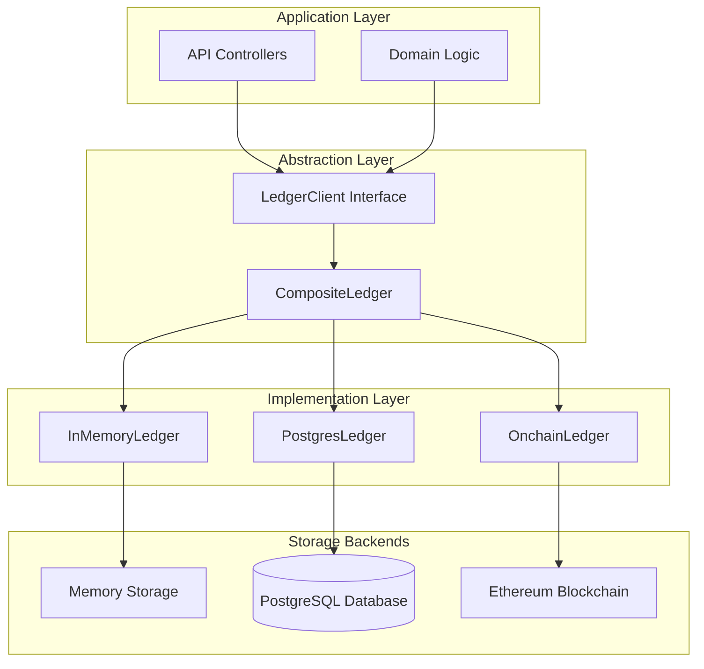
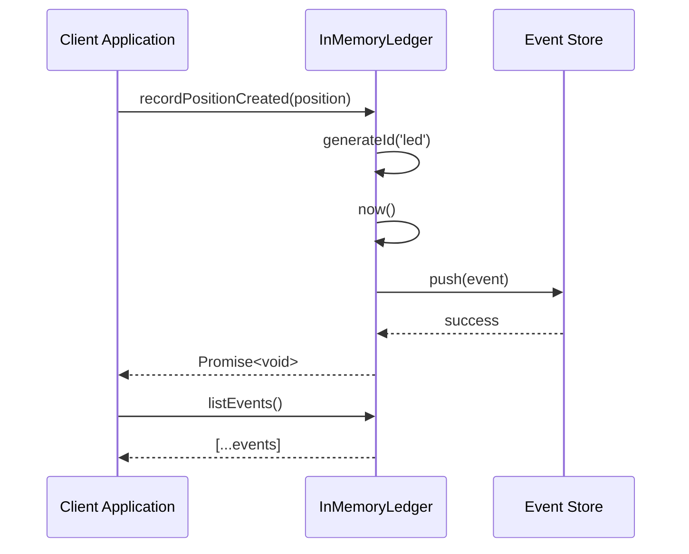
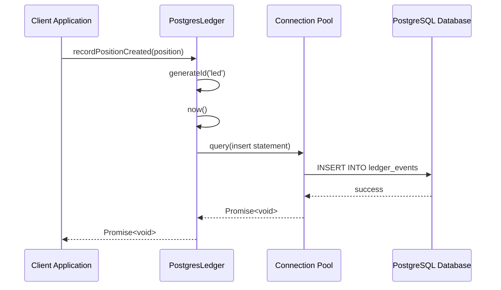
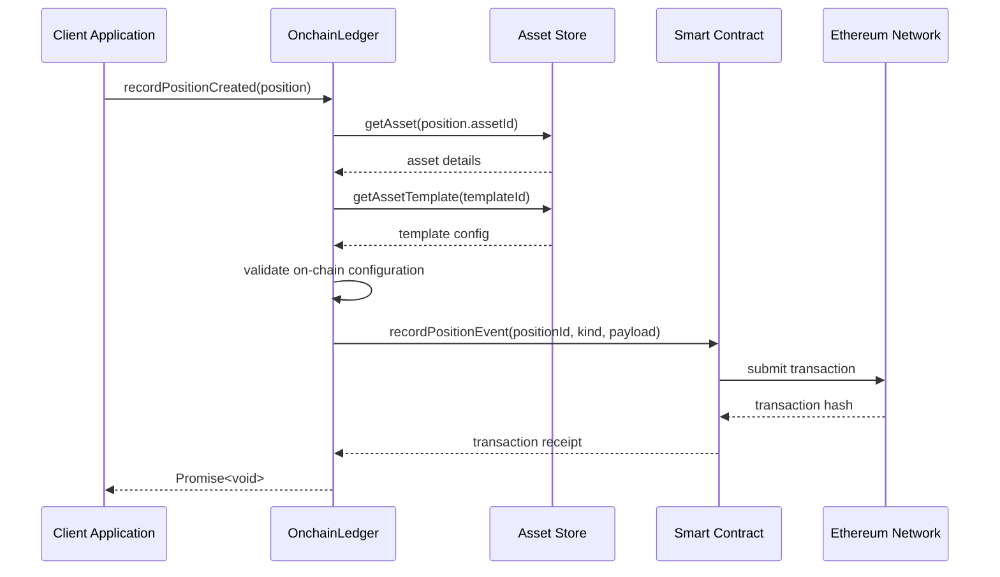
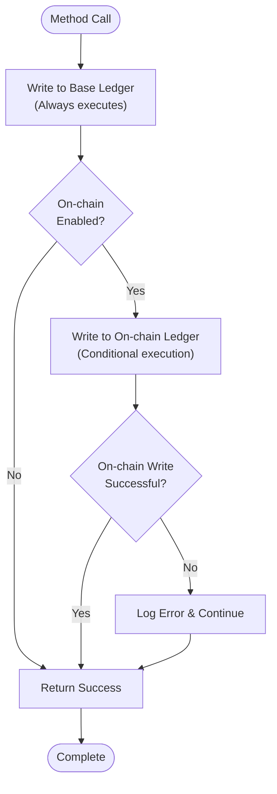
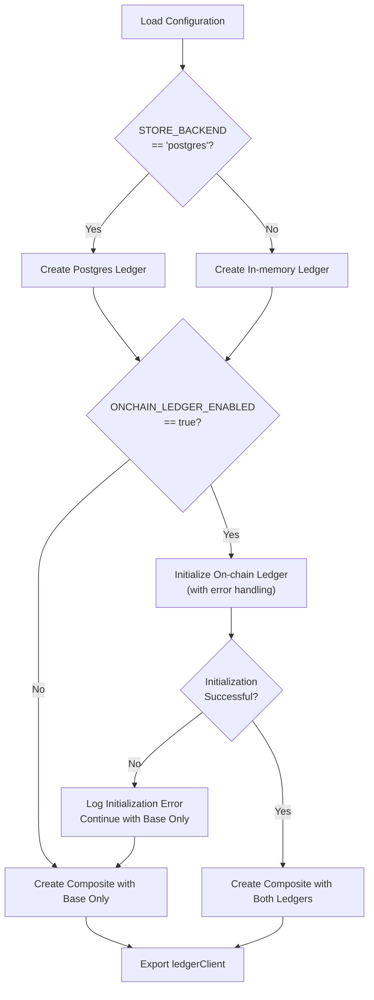
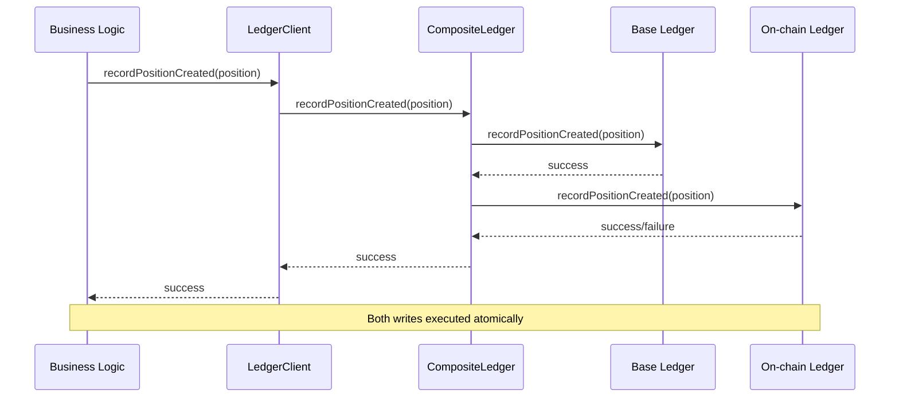
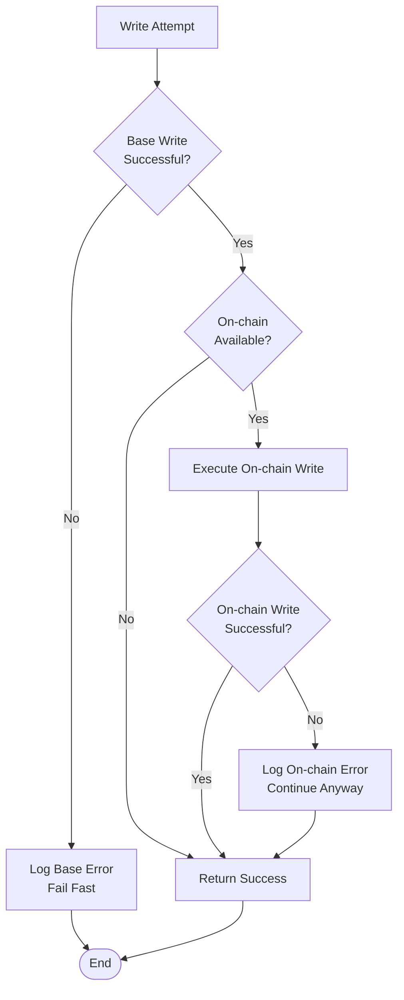

# Ledger Abstraction Layer

<cite>
**Referenced Files in This Document**
- [src/domain/ledger.ts](file://src/domain/ledger.ts)
- [src/infra/ledgerClient.ts](file://src/infra/ledgerClient.ts)
- [src/infra/inMemoryLedger.ts](file://src/infra/inMemoryLedger.ts)
- [src/infra/postgresLedger.ts](file://src/infra/postgresLedger.ts)
- [src/infra/onchainLedger.ts](file://src/infra/onchainLedger.ts)
- [src/domain/types.ts](file://src/domain/types.ts)
- [src/api/ledger.ts](file://src/api/ledger.ts)
- [src/config.ts](file://src/config.ts)
- [src/domain/lifecycle.ts](file://src/domain/lifecycle.ts)
</cite>

## Table of Contents
1. [Introduction](#introduction)
2. [Architecture Overview](#architecture-overview)
3. [Core Interface Definition](#core-interface-definition)
4. [Implementation Patterns](#implementation-patterns)
5. [CompositeLedger Pattern](#compositeldger-pattern)
6. [Runtime Composition](#runtime-composition)
7. [Domain Logic Integration](#domain-logic-integration)
8. [Benefits and Advantages](#benefits-and-advantages)
9. [Edge Cases and Error Handling](#edge-cases-and-error-handling)
10. [Extending the Abstraction](#extending-the-abstraction)
11. [Testing and Observability](#testing-and-observability)
12. [Conclusion](#conclusion)

## Introduction

The ledger abstraction layer in escrowgrid provides a sophisticated decoupling mechanism between business logic and specific ledger implementations. This design enables seamless integration with multiple storage backends while maintaining a unified interface for recording position lifecycle events. The abstraction supports both off-chain (PostgreSQL) and on-chain (Ethereum) ledger systems, with the ability to perform atomic dual writes when both are enabled.

The ledger abstraction serves as the foundation for audit trails, compliance reporting, and real-time monitoring of position states throughout their lifecycle. By abstracting the underlying storage mechanisms, the system achieves exceptional flexibility, testability, and operational resilience.

## Architecture Overview

The ledger abstraction follows a layered architecture pattern with clear separation of concerns:



**Diagram sources**
- [src/infra/ledgerClient.ts](file://src/infra/ledgerClient.ts#L8-L62)
- [src/domain/ledger.ts](file://src/domain/ledger.ts#L15-L22)

The architecture enables runtime configuration of ledger backends, allowing the system to operate in various modes depending on deployment requirements and compliance needs.

## Core Interface Definition

The `LedgerClient` interface defines the contract that all ledger implementations must fulfill:

```mermaid
classDiagram
class LedgerClient {
<<interface>>
+recordPositionCreated(position : Position) Promise~void~
+recordPositionStateChanged(position : Position, lifecycleEvent : PositionLifecycleEvent) Promise~void~
+listEvents(params? : {positionId? : string}) Promise~LedgerEvent[]~
}
class LedgerEvent {
+string id
+LedgerEventKind kind
+string positionId
+string at
+string previousState?
+string newState?
+Record~string, unknown~ payload?
}
class Position {
+string id
+string institutionId
+string assetId
+string holderReference
+string currency
+number amount
+PositionState state
+string externalReference?
+string createdAt
+string updatedAt
+PositionLifecycleEvent[] events
}
class PositionLifecycleEvent {
+string id
+string positionId
+PositionState fromState
+PositionState toState
+string reason?
+string at
+Record~string, unknown~ metadata?
}
LedgerClient --> LedgerEvent : creates
LedgerClient --> Position : operates on
LedgerClient --> PositionLifecycleEvent : records
```

**Diagram sources**
- [src/domain/ledger.ts](file://src/domain/ledger.ts#L15-L22)
- [src/domain/ledger.ts](file://src/domain/ledger.ts#L3-L13)
- [src/domain/types.ts](file://src/domain/types.ts#L38-L54)
- [src/domain/types.ts](file://src/domain/types.ts#L56-L68)

### Method Signatures

The interface defines three primary methods with unified signatures across all implementations:

| Method | Purpose | Parameters | Return Type |
|--------|---------|------------|-------------|
| `recordPositionCreated` | Records new position creation | `position: Position` | `Promise<void>` |
| `recordPositionStateChanged` | Records state transitions | `position: Position, lifecycleEvent: PositionLifecycleEvent` | `Promise<void>` |
| `listEvents` | Retrieves ledger events | `params?: {positionId?: string}` | `Promise<LedgerEvent[]>` |

**Section sources**
- [src/domain/ledger.ts](file://src/domain/ledger.ts#L15-L22)

## Implementation Patterns

### In-Memory Ledger

The in-memory implementation provides fast, ephemeral storage suitable for development and testing environments:



**Diagram sources**
- [src/infra/inMemoryLedger.ts](file://src/infra/inMemoryLedger.ts#L12-L61)

### PostgreSQL Ledger

The PostgreSQL implementation provides persistent, ACID-compliant storage with full SQL capabilities:



**Diagram sources**
- [src/infra/postgresLedger.ts](file://src/infra/postgresLedger.ts#L14-L107)

### On-Chain Ledger

The on-chain implementation integrates with Ethereum smart contracts for immutable, verifiable audit trails:



**Diagram sources**
- [src/infra/onchainLedger.ts](file://src/infra/onchainLedger.ts#L11-L220)

**Section sources**
- [src/infra/inMemoryLedger.ts](file://src/infra/inMemoryLedger.ts#L1-L62)
- [src/infra/postgresLedger.ts](file://src/infra/postgresLedger.ts#L1-L108)
- [src/infra/onchainLedger.ts](file://src/infra/onchainLedger.ts#L1-L221)

## CompositeLedger Pattern

The CompositeLedger pattern enables atomic dual writes to both base and on-chain ledgers when both are available:

```mermaid
classDiagram
class CompositeLedger {
-base : LedgerClient
-onchain? : OnchainLedger
+constructor(base : LedgerClient, onchain? : OnchainLedger)
+recordPositionCreated(position : Position) Promise~void~
+recordPositionStateChanged(position : Position, lifecycleEvent : PositionLifecycleEvent) Promise~void~
+listEvents(params? : {positionId? : string}) Promise~LedgerEvent[]~
}
class LedgerClient {
<<interface>>
}
class OnchainLedger {
<<implementation>>
}
CompositeLedger --> LedgerClient : contains
CompositeLedger --> OnchainLedger : conditionally uses
```

**Diagram sources**
- [src/infra/ledgerClient.ts](file://src/infra/ledgerClient.ts#L8-L37)

### Atomic Write Behavior

The CompositeLedger ensures that either both writes succeed or neither does, maintaining consistency across storage backends:



**Diagram sources**
- [src/infra/ledgerClient.ts](file://src/infra/ledgerClient.ts#L17-L32)

**Section sources**
- [src/infra/ledgerClient.ts](file://src/infra/ledgerClient.ts#L8-L37)

## Runtime Composition

The runtime composition logic in `ledgerClient.ts` demonstrates how configuration drives the selection of active ledger components:



**Diagram sources**
- [src/infra/ledgerClient.ts](file://src/infra/ledgerClient.ts#L39-L62)

### Configuration-Driven Selection

The system supports multiple configuration scenarios:

| Scenario | Base Ledger | On-chain Ledger | Use Case |
|----------|-------------|-----------------|----------|
| Development | In-memory | Not Available | Fast local development |
| Production | PostgreSQL | Not Available | Cost-effective persistence |
| Compliance | PostgreSQL | Enabled | Full audit trail |
| Hybrid | PostgreSQL | Enabled | Primary persistence with blockchain verification |

**Section sources**
- [src/infra/ledgerClient.ts](file://src/infra/ledgerClient.ts#L39-L62)
- [src/config.ts](file://src/config.ts#L1-L47)

## Domain Logic Integration

Domain logic interacts with the ledger client through a clean, implementation-agnostic interface:



**Diagram sources**
- [src/domain/lifecycle.ts](file://src/domain/lifecycle.ts#L33-L48)
- [src/infra/ledgerClient.ts](file://src/infra/ledgerClient.ts#L17-L32)

### Example Integration Pattern

Domain logic typically follows this pattern when interacting with the ledger:

1. **State Transition Validation**: Business logic validates state transitions before proceeding
2. **Event Creation**: Lifecycle events are created with appropriate metadata
3. **Ledger Recording**: The ledger client records the event with minimal business logic
4. **Persistence**: The underlying ledger implementation handles persistence details

**Section sources**
- [src/domain/lifecycle.ts](file://src/domain/lifecycle.ts#L16-L51)
- [src/api/ledger.ts](file://src/api/ledger.ts#L1-L43)

## Benefits and Advantages

### Testability

The abstraction layer significantly enhances testability through several mechanisms:

- **Mockable Interfaces**: All implementations adhere to the same interface, enabling easy mocking
- **Deterministic Testing**: In-memory ledger provides predictable, isolated testing environments
- **Isolated Unit Tests**: Business logic can be tested independently of storage backends

### Extensibility

The design supports easy addition of new ledger types:

- **Interface Compliance**: New implementations only need to satisfy the LedgerClient interface
- **Plug-and-Play**: New ledger types can be integrated without modifying existing code
- **Configuration-Based**: New implementations are activated through configuration changes

### Operational Flexibility

The abstraction provides operational advantages:

- **Multi-Backend Support**: Simultaneous writes to multiple storage systems
- **Graceful Degradation**: Fallback to single backend when others fail
- **Dynamic Configuration**: Runtime switching between different ledger configurations

### Audit Trail Capabilities

The ledger abstraction enables comprehensive audit capabilities:

- **Immutable Records**: On-chain ledger provides tamper-proof audit trails
- **Historical Queries**: Complete event history for compliance reporting
- **Real-time Monitoring**: Live event streaming for operational dashboards

## Edge Cases and Error Handling

### Partial Failure Scenarios

The system handles various failure scenarios gracefully:



**Diagram sources**
- [src/infra/onchainLedger.ts](file://src/infra/onchainLedger.ts#L25-L118)
- [src/infra/onchainLedger.ts](file://src/infra/onchainLedger.ts#L121-L218)

### Error Logging and Recovery

The system implements comprehensive error logging:

| Error Type | Logging Level | Recovery Strategy |
|------------|---------------|-------------------|
| On-chain initialization failure | ERROR | Continue with base ledger only |
| Asset/template not found | ERROR | Skip on-chain write, log reason |
| Chain ID mismatch | LOG | Skip on-chain write, log reason |
| Transaction failure | ERROR | Log transaction details, continue |

### Asset Template Validation

On-chain ledger implementations include sophisticated validation:

- **Asset Existence**: Verifies asset exists before attempting on-chain writes
- **Template Configuration**: Checks template-level on-chain enablement
- **Chain Compatibility**: Validates chain ID matches configuration
- **Graceful Degradation**: Falls back to base ledger when on-chain fails

**Section sources**
- [src/infra/onchainLedger.ts](file://src/infra/onchainLedger.ts#L25-L82)
- [src/infra/onchainLedger.ts](file://src/infra/onchainLedger.ts#L121-L181)

## Extending the Abstraction

### Adding New Ledger Types

To add a new ledger implementation, follow these steps:

1. **Implement the Interface**: Create a class implementing `LedgerClient`
2. **Add Configuration**: Extend the configuration system to support the new type
3. **Update Composition Logic**: Modify `ledgerClient.ts` to handle the new type
4. **Add Validation**: Implement appropriate validation logic for the new backend

### Implementation Checklist

| Requirement | Description | Implementation Notes |
|-------------|-------------|---------------------|
| Interface Compliance | Implement all LedgerClient methods | Ensure proper error handling |
| Configuration Support | Add to config.ts and environment variables | Follow existing patterns |
| Error Handling | Implement graceful degradation | Log errors appropriately |
| Testing | Add comprehensive unit tests | Mock external dependencies |
| Documentation | Update README and inline comments | Document new capabilities |

### Best Practices for Extensions

- **Atomic Operations**: Maintain consistency across multiple writes
- **Error Propagation**: Log errors without masking them from higher layers
- **Resource Management**: Properly manage connections and cleanup
- **Performance Considerations**: Optimize for the target use case
- **Security**: Validate inputs and handle sensitive data appropriately

## Testing and Observability

### Testing Strategies

The ledger abstraction supports multiple testing approaches:

- **Unit Testing**: Mock the ledger client for isolated business logic testing
- **Integration Testing**: Test with actual ledger implementations
- **End-to-End Testing**: Verify complete workflows with real backends
- **Contract Testing**: Ensure interface compliance across implementations

### Observability Features

The system includes comprehensive observability:

- **Structured Logging**: JSON-formatted logs with correlation IDs
- **Error Tracking**: Detailed error information with stack traces
- **Performance Metrics**: Timing information for write operations
- **Health Checks**: Status monitoring for all ledger components

**Section sources**
- [src/__tests__/api.test.ts](file://src/__tests__/api.test.ts#L1-L126)

## Conclusion

The ledger abstraction layer in escrowgrid represents a sophisticated approach to storage decoupling that balances flexibility, performance, and reliability. Through the `LedgerClient` interface and `CompositeLedger` pattern, the system achieves:

- **Clean Separation of Concerns**: Business logic remains unaware of storage implementation details
- **Multi-Backend Support**: Seamless integration with various storage systems
- **Operational Resilience**: Graceful handling of failures and partial system outages
- **Development Efficiency**: Easy testing and debugging through abstraction
- **Future-Proof Design**: Extensible architecture supporting new storage technologies

The abstraction enables organizations to meet diverse compliance requirements while maintaining a single, cohesive codebase. Whether operating in purely on-premises environments, cloud-native architectures, or hybrid blockchain setups, the ledger abstraction provides the flexibility needed for modern financial technology applications.

By centralizing audit trail logic and providing a unified interface for position lifecycle events, the system ensures consistent behavior across all deployment scenarios while maintaining the performance characteristics required for high-throughput financial operations.