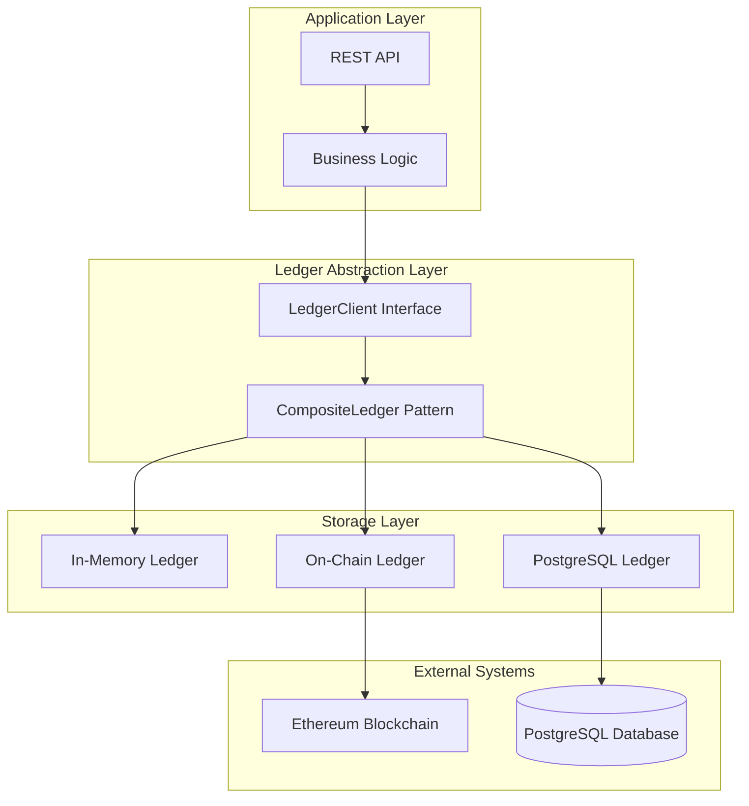
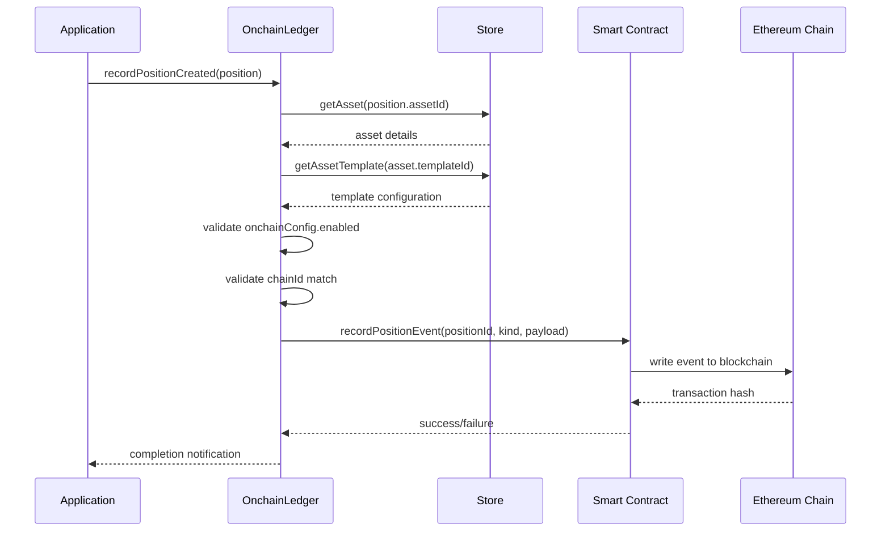
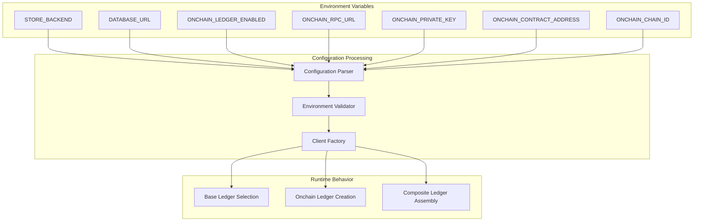
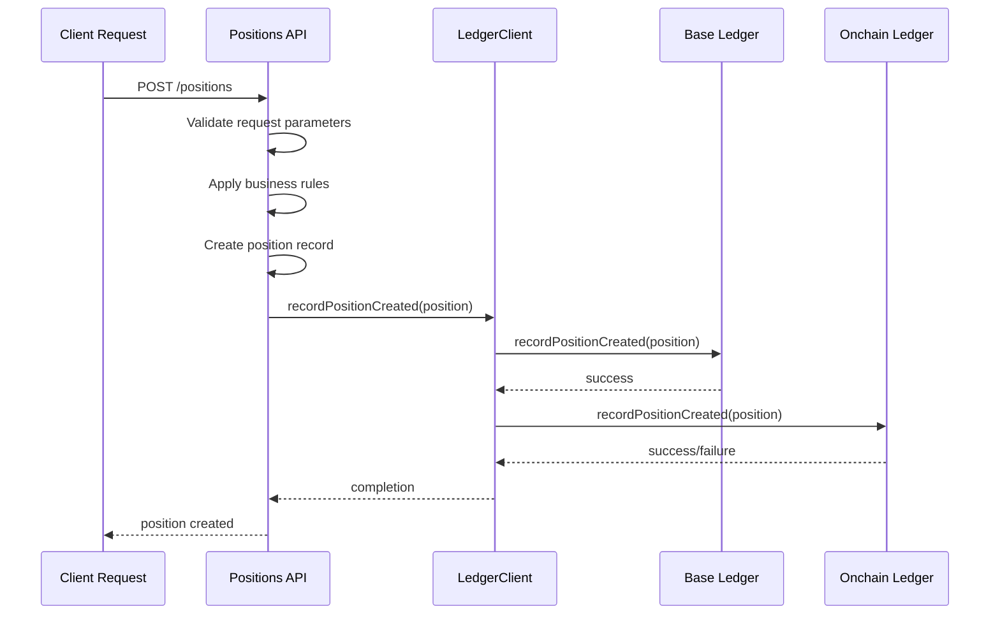
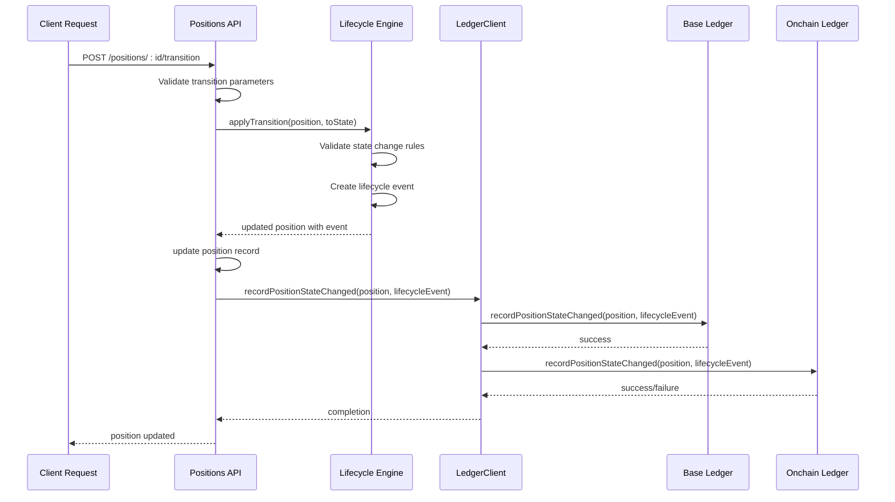

# Ledger Systems

<cite>
**Referenced Files in This Document**
- [src/infra/ledgerClient.ts](file://src/infra/ledgerClient.ts)
- [src/infra/inMemoryLedger.ts](file://src/infra/inMemoryLedger.ts)
- [src/infra/postgresLedger.ts](file://src/infra/postgresLedger.ts)
- [src/infra/onchainLedger.ts](file://src/infra/onchainLedger.ts)
- [src/domain/ledger.ts](file://src/domain/ledger.ts)
- [src/config.ts](file://src/config.ts)
- [src/domain/types.ts](file://src/domain/types.ts)
- [src/store/index.ts](file://src/store/index.ts)
- [src/api/positions.ts](file://src/api/positions.ts)
- [src/api/ledger.ts](file://src/api/ledger.ts)
- [db/schema.sql](file://db/schema.sql)
</cite>

## Table of Contents
1. [Introduction](#introduction)
2. [Dual Ledger Architecture](#dual-ledger-architecture)
3. [LedgerClient Interface Abstraction](#ledgerclient-interface-abstraction)
4. [In-Memory Ledger Implementation](#in-memory-ledger-implementation)
5. [PostgreSQL Ledger Implementation](#postgresql-ledger-implementation)
6. [On-Chain Ledger Integration](#on-chain-ledger-integration)
7. [Composite Ledger Pattern](#composite-ledger-pattern)
8. [Configuration Management](#configuration-management)
9. [Event Recording Flows](#event-recording-flows)
10. [Error Handling and Logging](#error-handling-and-logging)
11. [Scalability and Consistency](#scalability-and-consistency)
12. [Failure Recovery Strategies](#failure-recovery-strategies)
13. [Conclusion](#conclusion)

## Introduction

Escrowgrid implements a sophisticated dual ledger architecture that seamlessly separates off-chain operations from on-chain Ethereum integration. This architecture provides flexible storage options while maintaining strong consistency guarantees across different ledger implementations. The system employs a unified LedgerClient interface that abstracts away the complexities of underlying storage mechanisms, enabling both ephemeral in-memory operations and persistent PostgreSQL storage, with optional on-chain integration for blockchain-based audit trails.

The ledger system serves as the central audit trail mechanism for position lifecycle events, capturing every state transition and creation operation with comprehensive metadata. This design ensures regulatory compliance, operational transparency, and robust data governance across the escrow platform.

## Dual Ledger Architecture

The escrowgrid ledger system implements a dual-layer architecture that separates concerns between immediate operational needs and long-term audit requirements:



**Diagram sources**
- [src/infra/ledgerClient.ts](file://src/infra/ledgerClient.ts#L8-L62)
- [src/infra/inMemoryLedger.ts](file://src/infra/inMemoryLedger.ts#L12-L61)
- [src/infra/postgresLedger.ts](file://src/infra/postgresLedger.ts#L14-L107)
- [src/infra/onchainLedger.ts](file://src/infra/onchainLedger.ts#L11-L221)

The architecture consists of three primary layers:

1. **Application Layer**: Handles HTTP requests and business logic operations
2. **Ledger Abstraction Layer**: Provides unified interface for all ledger operations
3. **Storage Layer**: Implements different storage backends with varying durability guarantees

**Section sources**
- [src/infra/ledgerClient.ts](file://src/infra/ledgerClient.ts#L1-L64)
- [src/domain/ledger.ts](file://src/domain/ledger.ts#L15-L22)

## LedgerClient Interface Abstraction

The LedgerClient interface serves as the foundational abstraction that enables polymorphic ledger operations across different storage implementations. This interface defines three core methods that handle the complete lifecycle of position events:

```mermaid
classDiagram
class LedgerClient {
<<interface>>
+recordPositionCreated(position : Position) Promise~void~
+recordPositionStateChanged(position : Position, lifecycleEvent : PositionLifecycleEvent) Promise~void~
+listEvents(params? : {positionId? : string}) Promise~LedgerEvent[]~
}
class LedgerEvent {
+string id
+LedgerEventKind kind
+string positionId
+string at
+string previousState?
+string newState?
+Record~string, unknown~ payload?
}
class Position {
+string id
+string institutionId
+string assetId
+string holderReference
+string currency
+number amount
+PositionState state
+string externalReference?
+string createdAt
+string updatedAt
+PositionLifecycleEvent[] events
}
class PositionLifecycleEvent {
+string id
+string positionId
+PositionState fromState
+PositionState toState
+string reason?
+string at
+Record~string, unknown~ metadata?
}
LedgerClient --> LedgerEvent : "manages"
LedgerClient --> Position : "processes"
LedgerClient --> PositionLifecycleEvent : "handles"
```

**Diagram sources**
- [src/domain/ledger.ts](file://src/domain/ledger.ts#L15-L22)
- [src/domain/types.ts](file://src/domain/types.ts#L56-L67)
- [src/domain/types.ts](file://src/domain/types.ts#L46-L54)

The interface provides three essential operations:

- **recordPositionCreated**: Captures new position creation events with comprehensive asset and institutional metadata
- **recordPositionStateChanged**: Records state transitions with reason codes and contextual metadata
- **listEvents**: Enables querying of ledger events with optional position-specific filtering

**Section sources**
- [src/domain/ledger.ts](file://src/domain/ledger.ts#L15-L22)

## In-Memory Ledger Implementation

The InMemoryLedger provides ephemeral storage for development and testing environments, offering fast access to ledger events without persistence guarantees. This implementation demonstrates the ledger pattern while maintaining full compatibility with the LedgerClient interface.

```mermaid
classDiagram
class InMemoryLedger {
-events : LedgerEvent[]
+recordPositionCreated(position : Position) Promise~void~
+recordPositionStateChanged(position : Position, lifecycleEvent : PositionLifecycleEvent) Promise~void~
+listEvents(params? : {positionId? : string}) Promise~LedgerEvent[]~
}
class LedgerEvent {
+string id
+LedgerEventKind kind
+string positionId
+string at
+string previousState?
+string newState?
+Record~string, unknown~ payload?
}
InMemoryLedger --> LedgerEvent : "manages"
```

**Diagram sources**
- [src/infra/inMemoryLedger.ts](file://src/infra/inMemoryLedger.ts#L12-L61)

### Key Features

The InMemoryLedger implementation includes several important characteristics:

- **Fast Access**: All operations occur in RAM with O(1) insertion and O(n) querying performance
- **Unique Event IDs**: Uses random string generation with 'led_' prefix for event identification
- **Timestamp Precision**: Utilizes ISO 8601 format for temporal consistency
- **Flexible Filtering**: Supports position-specific event retrieval or complete ledger queries

### Implementation Details

The `recordPositionCreated` method captures comprehensive position metadata including institutional context, asset details, and financial parameters. The `recordPositionStateChanged` method records state transitions with reason codes and additional metadata for audit purposes.

**Section sources**
- [src/infra/inMemoryLedger.ts](file://src/infra/inMemoryLedger.ts#L1-L62)

## PostgreSQL Ledger Implementation

The PostgresLedger provides durable, ACID-compliant storage for production environments, leveraging PostgreSQL's JSONB capabilities for flexible payload storage and indexing for efficient querying.

```mermaid
classDiagram
class PostgresLedger {
-pool : Pool
+constructor()
+recordPositionCreated(position : Position) Promise~void~
+recordPositionStateChanged(position : Position, lifecycleEvent : PositionLifecycleEvent) Promise~void~
+listEvents(params? : {positionId? : string}) Promise~LedgerEvent[]~
}
class Pool {
+query(text : string, values : any[]) Promise~any~
}
PostgresLedger --> Pool : "uses"
```

**Diagram sources**
- [src/infra/postgresLedger.ts](file://src/infra/postgresLedger.ts#L14-L107)

### Database Schema Integration

The PostgreSQL ledger integrates with the existing database schema through the `ledger_events` table, which mirrors the ledger event structure:

| Column | Type | Description |
|--------|------|-------------|
| id | TEXT | Unique event identifier |
| kind | TEXT | Event type (POSITION_CREATED/POSITION_STATE_CHANGED) |
| position_id | TEXT | Foreign key to positions table |
| at | TIMESTAMPTZ | Event occurrence timestamp |
| previous_state | TEXT | Source state for state changes |
| new_state | TEXT | Target state for state changes |
| payload | JSONB | Flexible event payload storage |
| created_at | TIMESTAMPTZ | Record creation timestamp |

### Transaction Safety

All ledger operations occur within database transactions, ensuring atomicity and consistency. The implementation uses prepared statements with parameterized queries to prevent SQL injection attacks and optimize query performance.

**Section sources**
- [src/infra/postgresLedger.ts](file://src/infra/postgresLedger.ts#L1-L108)
- [db/schema.sql](file://db/schema.sql#L80-L88)

## On-Chain Ledger Integration

The OnchainLedger provides optional blockchain integration for immutable audit trails, writing position events to Ethereum smart contracts based on asset template configurations.



**Diagram sources**
- [src/infra/onchainLedger.ts](file://src/infra/onchainLedger.ts#L25-L118)

### Conditional Event Writing

The on-chain ledger implements sophisticated conditional logic to determine when events should be written to the blockchain:

1. **Asset Validation**: Ensures the position's asset exists and belongs to the requesting institution
2. **Template Configuration**: Checks asset template's on-chain configuration settings
3. **Chain Compatibility**: Validates that the configured chain ID matches the deployment environment
4. **Permission Verification**: Confirms on-chain ledger is enabled globally

### Smart Contract Interface

The on-chain ledger communicates with Ethereum smart contracts through a standardized ABI interface:

```typescript
const ledgerAbi = [
  'function recordPositionEvent(string positionId, string kind, string payloadJson)'
] as const;
```

This interface accepts position identifiers, event kinds, and JSON-encoded payloads for flexible event representation.

**Section sources**
- [src/infra/onchainLedger.ts](file://src/infra/onchainLedger.ts#L1-L221)

## Composite Ledger Pattern

The CompositeLedger pattern enables simultaneous writes to multiple ledger implementations, providing flexibility in deployment scenarios and supporting hybrid architectures.

```mermaid
classDiagram
class CompositeLedger {
-base : LedgerClient
-onchain? : OnchainLedger
+constructor(base : LedgerClient, onchain? : OnchainLedger)
+recordPositionCreated(position : Position) Promise~void~
+recordPositionStateChanged(position : Position, lifecycleEvent : PositionLifecycleEvent) Promise~void~
+listEvents(params? : {positionId? : string}) Promise~LedgerEvent[]~
}
class LedgerClient {
<<interface>>
+recordPositionCreated(position : Position) Promise~void~
+recordPositionStateChanged(position : Position, lifecycleEvent : PositionLifecycleEvent) Promise~void~
+listEvents(params? : {positionId? : string}) Promise~LedgerEvent[]~
}
class OnchainLedger {
+recordPositionCreated(position : Position) Promise~void~
+recordPositionStateChanged(position : Position, lifecycleEvent : PositionLifecycleEvent) Promise~void~
}
CompositeLedger ..|> LedgerClient : implements
CompositeLedger --> LedgerClient : "delegates to"
CompositeLedger --> OnchainLedger : "optionally uses"
```

**Diagram sources**
- [src/infra/ledgerClient.ts](file://src/infra/ledgerClient.ts#L8-L62)

### Implementation Strategy

The CompositeLedger maintains references to both base and on-chain ledger implementations, delegating operations to each while preserving the LedgerClient interface contract. This design allows for:

- **Graceful Degradation**: If on-chain ledger fails, base ledger operations continue normally
- **Conditional Activation**: On-chain ledger can be disabled without affecting base operations
- **Consistent Interface**: Both implementations share identical method signatures and return types

### Synchronous Execution

Both base and on-chain operations execute synchronously within the same method call, ensuring that failures in either component are immediately apparent to the caller. This synchronous approach simplifies error handling but may impact performance under high load.

**Section sources**
- [src/infra/ledgerClient.ts](file://src/infra/ledgerClient.ts#L8-L62)

## Configuration Management

The ledger system relies on comprehensive configuration management to support different deployment scenarios and enable/disable features dynamically.



**Diagram sources**
- [src/config.ts](file://src/config.ts#L3-L47)

### Configuration Options

The system supports multiple configuration modes:

| Setting | Purpose | Default | Impact |
|---------|---------|---------|--------|
| `STORE_BACKEND` | Storage backend selection | 'memory' | Determines base ledger implementation |
| `DATABASE_URL` | PostgreSQL connection string | - | Required for PostgreSQL backend |
| `ONCHAIN_LEDGER_ENABLED` | Enable blockchain integration | false | Controls on-chain ledger availability |
| `ONCHAIN_RPC_URL` | Ethereum RPC endpoint | - | Required for on-chain operations |
| `ONCHAIN_PRIVATE_KEY` | Wallet private key | - | Required for transaction signing |
| `ONCHAIN_CONTRACT_ADDRESS` | Smart contract address | - | Required for event writing |
| `ONCHAIN_CHAIN_ID` | Network identifier | - | Required for chain validation |

### Runtime Adaptation

The configuration system enables runtime adaptation to different environments:

- **Development**: Uses in-memory ledger for speed and simplicity
- **Testing**: Can switch between memory and PostgreSQL backends
- **Production**: Deploys PostgreSQL backend with optional on-chain integration
- **Hybrid**: Activates both base and on-chain ledgers for comprehensive auditing

**Section sources**
- [src/config.ts](file://src/config.ts#L1-L47)

## Event Recording Flows

The ledger system handles two primary event types: position creation and state transitions, each with distinct recording patterns and validation requirements.

### Position Creation Flow



**Diagram sources**
- [src/api/positions.ts](file://src/api/positions.ts#L120-L129)

### Position State Transition Flow



**Diagram sources**
- [src/api/positions.ts](file://src/api/positions.ts#L258-L271)

### Event Payload Structure

Both event types maintain consistent payload structures while accommodating different informational needs:

**POSITION_CREATED Events:**
- `institutionId`: Originating institution identifier
- `assetId`: Associated asset identifier  
- `currency`: Financial instrument denomination
- `amount`: Numeric value of the position
- `externalReference`: Client-provided reference
- `state`: Initial position state

**POSITION_STATE_CHANGED Events:**
- `institutionId`: Originating institution identifier
- `assetId`: Associated asset identifier
- `fromState`: Previous position state
- `toState`: New position state
- `reason`: Cause of state transition
- `at`: Timestamp of transition

**Section sources**
- [src/api/positions.ts](file://src/api/positions.ts#L120-L129)
- [src/api/positions.ts](file://src/api/positions.ts#L258-L271)

## Error Handling and Logging

The ledger system implements comprehensive error handling and structured logging to ensure operational visibility and facilitate debugging across all components.

### Error Classification

The system categorizes errors into several types:

1. **Configuration Errors**: Missing or invalid environment variables
2. **Validation Errors**: Invalid position data or state transitions
3. **Storage Errors**: Database connectivity or constraint violations
4. **Blockchain Errors**: Smart contract communication failures
5. **Authorization Errors**: Insufficient permissions for ledger operations

### Structured Logging Patterns

All error conditions emit structured JSON logs with consistent field sets:

```typescript
// On-chain ledger initialization error
{
  type: 'onchain_ledger_init_error',
  error: 'Error message'
}

// On-chain ledger skip notifications
{
  type: 'onchain_ledger_skip',
  reason: 'asset_not_found',
  positionId: 'pos_123',
  assetId: 'asset_456'
}

// On-chain ledger operation errors
{
  type: 'onchain_ledger_error',
  operation: 'recordPositionCreated',
  positionId: 'pos_123',
  error: 'Transaction failed'
}
```

### Graceful Degradation

The system implements graceful degradation strategies:

- **On-chain Failures**: When on-chain ledger fails, base ledger operations continue unaffected
- **Configuration Issues**: Missing on-chain configuration disables blockchain integration without affecting core functionality
- **Network Issues**: Temporary network problems don't impact local storage operations

**Section sources**
- [src/infra/ledgerClient.ts](file://src/infra/ledgerClient.ts#L48-L60)
- [src/infra/onchainLedger.ts](file://src/infra/onchainLedger.ts#L52-L82)
- [src/infra/onchainLedger.ts](file://src/infra/onchainLedger.ts#L109-L118)

## Scalability and Consistency

The dual ledger architecture addresses scalability and consistency challenges through careful design choices and operational patterns.

### Scalability Considerations

**Horizontal Scaling Opportunities:**
- **Stateless Design**: All ledger implementations are stateless, enabling easy horizontal scaling
- **Connection Pooling**: PostgreSQL ledger uses connection pooling for efficient resource utilization
- **Asynchronous Operations**: On-chain operations can be made asynchronous for improved throughput

**Performance Characteristics:**
- **In-Memory Ledger**: O(1) insertion, O(n) querying (linear scan)
- **PostgreSQL Ledger**: O(1) insertion with indexed querying (O(log n))
- **On-Chain Ledger**: O(1) insertion with blockchain confirmation latency

### Consistency Guarantees

The system provides different consistency levels based on deployment configuration:

**Strong Consistency:**
- PostgreSQL ledger ensures ACID properties
- Atomic writes guarantee event ordering
- Transaction isolation prevents race conditions

**Eventually Consistent:**
- On-chain ledger operates with eventual consistency
- Blockchain confirmations introduce latency
- Network partitions may temporarily affect availability

**Hybrid Approach:**
- Base ledger provides immediate consistency
- On-chain ledger provides delayed immutability
- Composite pattern enables balanced trade-offs

### Data Integrity Mechanisms

The system implements multiple layers of data integrity protection:

1. **Schema Validation**: PostgreSQL enforces data type and constraint validation
2. **Event Validation**: Application-level validation before ledger recording
3. **Idempotency**: Event IDs prevent duplicate entries
4. **Audit Trails**: Comprehensive logging enables forensic analysis

## Failure Recovery Strategies

The ledger system implements multiple failure recovery strategies to maintain operational continuity and data integrity.

### Automatic Recovery Patterns

**Database Recovery:**
- Connection pooling with automatic retry logic
- Graceful degradation to in-memory storage during outages
- Transaction rollback on constraint violations

**Blockchain Recovery:**
- Transaction monitoring and re-submission capabilities
- Gas price adjustment for stuck transactions
- Fallback mechanisms for network failures

**Application Recovery:**
- Circuit breaker pattern for failing components
- Health checks for all ledger dependencies
- Graceful degradation when on-chain ledger unavailable

### Manual Recovery Procedures

**Data Corruption Recovery:**
1. Identify corrupted ledger segments through audit logs
2. Restore from PostgreSQL backup if available
3. Rebuild in-memory ledger from transaction history
4. Verify consistency across all ledger instances

**Configuration Recovery:**
1. Reset to default configuration values
2. Gradually reintroduce custom settings
3. Validate functionality at each step
4. Monitor for configuration-induced issues

**Network Recovery:**
1. Monitor network connectivity status
2. Switch to alternative RPC endpoints
3. Implement circuit breaker for failed connections
4. Retry logic with exponential backoff

### Monitoring and Alerting

The system provides comprehensive monitoring capabilities:

- **Health Checks**: Regular status verification of all ledger components
- **Performance Metrics**: Response time and throughput monitoring
- **Error Rates**: Tracking of failure frequencies and patterns
- **Capacity Planning**: Resource utilization monitoring for scaling decisions

## Conclusion

The escrowgrid ledger system demonstrates sophisticated architectural patterns that balance flexibility, performance, and reliability. The dual ledger architecture successfully separates immediate operational needs from long-term audit requirements while maintaining a unified interface for all applications.

Key architectural achievements include:

- **Unified Abstraction**: The LedgerClient interface provides consistent access across diverse storage implementations
- **Flexible Deployment**: Support for multiple storage backends enables deployment optimization for different environments
- **Optional Blockchain Integration**: On-chain ledger provides immutable audit trails without impacting core functionality
- **Robust Error Handling**: Comprehensive logging and graceful degradation ensure system resilience
- **Scalable Design**: Stateless implementations and connection pooling support horizontal scaling

The CompositeLedger pattern exemplifies how modern systems can combine multiple technologies effectively while maintaining clean separation of concerns. This architecture serves as a model for building resilient, scalable, and auditable systems in distributed environments.

Future enhancements could include asynchronous on-chain processing, advanced caching strategies, and enhanced monitoring capabilities to further improve performance and observability while maintaining the system's core architectural principles.