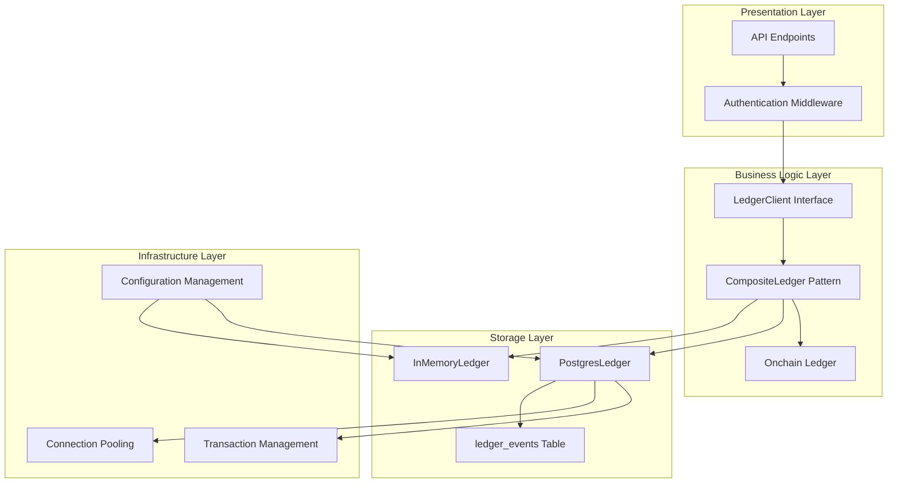
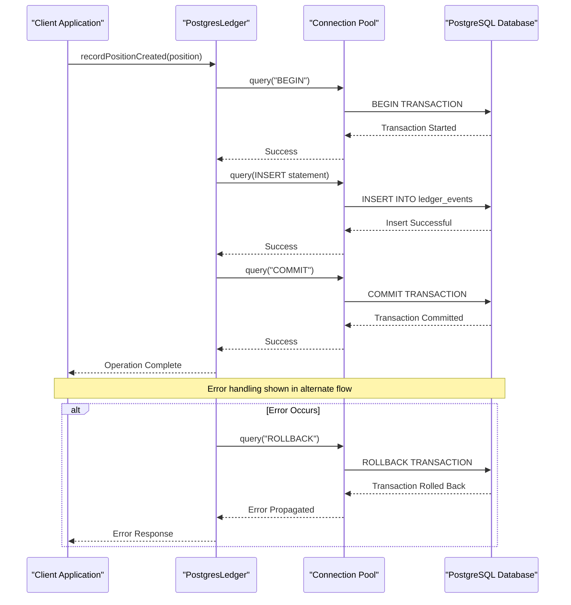
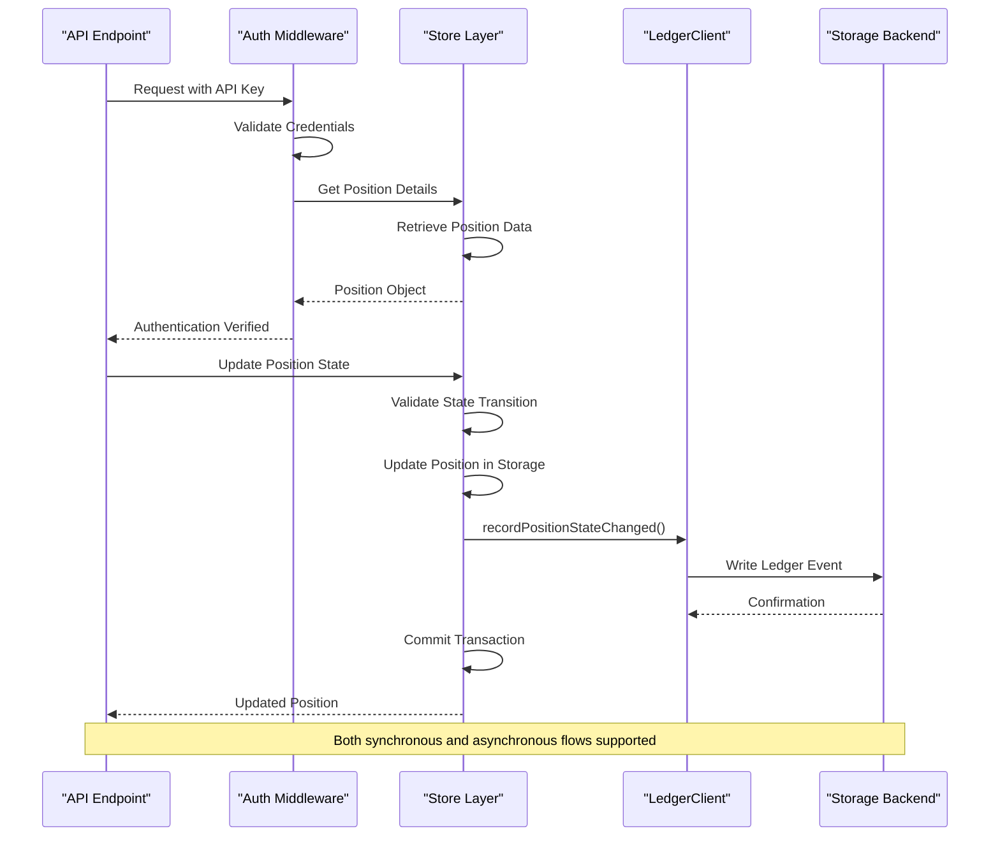
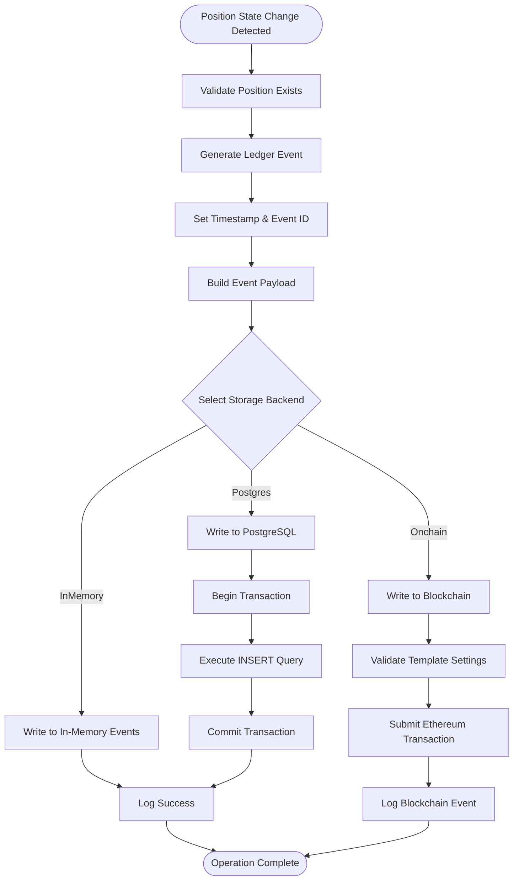
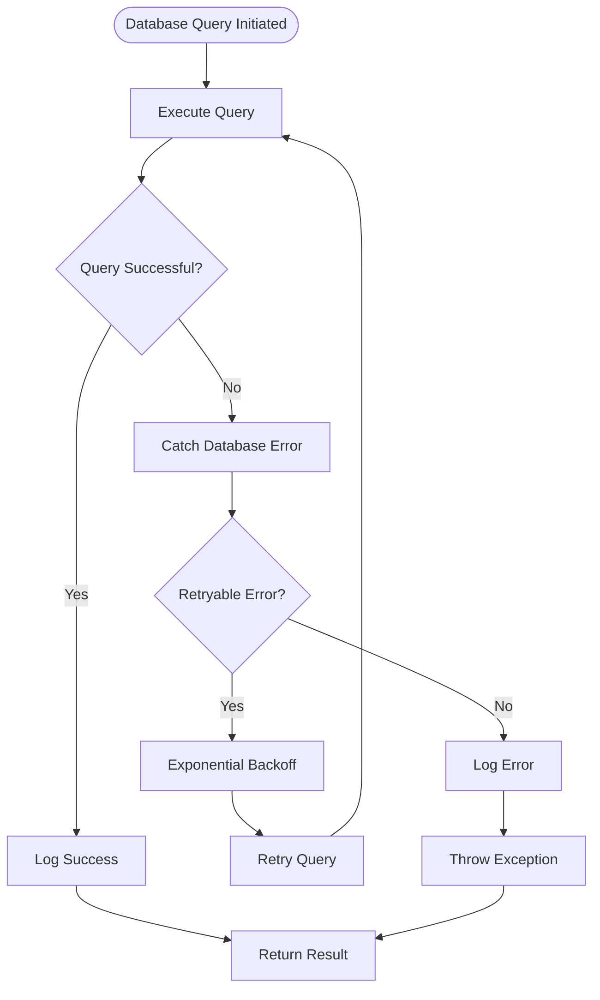
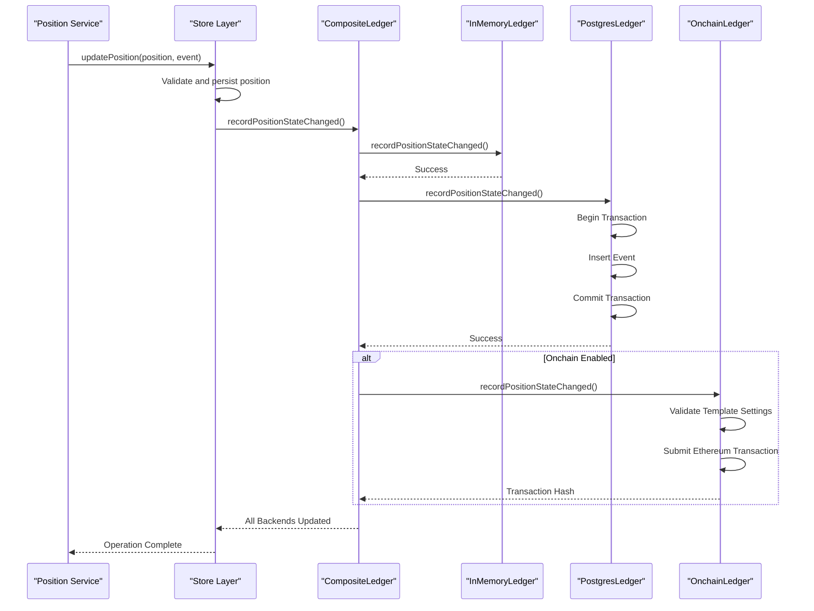

# Off-Chain Ledger System Architecture

<cite>
**Referenced Files in This Document**
- [src/config.ts](file://src/config.ts)
- [src/infra/inMemoryLedger.ts](file://src/infra/inMemoryLedger.ts)
- [src/infra/postgresLedger.ts](file://src/infra/postgresLedger.ts)
- [src/infra/ledgerClient.ts](file://src/infra/ledgerClient.ts)
- [src/infra/onchainLedger.ts](file://src/infra/onchainLedger.ts)
- [src/domain/ledger.ts](file://src/domain/ledger.ts)
- [src/domain/types.ts](file://src/domain/types.ts)
- [src/store/index.ts](file://src/store/index.ts)
- [src/store/postgresStore.ts](file://src/store/postgresStore.ts)
- [src/store/memoryStore.ts](file://src/store/memoryStore.ts)
- [src/store/store.ts](file://src/store/store.ts)
- [src/api/ledger.ts](file://src/api/ledger.ts)
- [db/schema.sql](file://db/schema.sql)
</cite>

## Table of Contents
1. [Introduction](#introduction)
2. [System Architecture Overview](#system-architecture-overview)
3. [Dual Storage Implementation](#dual-storage-implementation)
4. [LedgerClient Interface Abstraction](#ledgerclient-interface-abstraction)
5. [Transaction Handling and Consistency](#transaction-handling-and-consistency)
6. [Composite Ledger Pattern](#composite-ledger-pattern)
7. [Data Flow Architecture](#data-flow-architecture)
8. [Performance Considerations](#performance-considerations)
9. [Error Handling and Recovery](#error-handling-and-recovery)
10. [Use Cases and Deployment Scenarios](#use-cases-and-deployment-scenarios)
11. [Integration Patterns](#integration-patterns)
12. [Conclusion](#conclusion)

## Introduction

The escrowgrid off-chain ledger system provides a sophisticated dual-storage architecture designed to support both ephemeral testing environments and production-grade persistent storage. This system implements a comprehensive audit trail mechanism for tracking position lifecycle events while maintaining flexibility in deployment scenarios through configurable storage backends.

The ledger system serves as the central audit component of the escrowgrid platform, recording all position creation and state transitions with full historical tracking. It supports both in-memory storage for development and testing scenarios, and PostgreSQL-based persistence for production workloads requiring ACID compliance and durability.

## System Architecture Overview

The off-chain ledger system follows a layered architecture with clear separation of concerns between storage, business logic, and presentation layers:



**Diagram sources**
- [src/infra/ledgerClient.ts](file://src/infra/ledgerClient.ts#L8-L37)
- [src/infra/inMemoryLedger.ts](file://src/infra/inMemoryLedger.ts#L12-L61)
- [src/infra/postgresLedger.ts](file://src/infra/postgresLedger.ts#L14-L107)

The architecture implements several key design patterns:
- **Strategy Pattern**: Runtime selection between InMemoryLedger and PostgresLedger
- **Composite Pattern**: CompositeLedger combines multiple storage backends
- **Factory Pattern**: LedgerClient instantiation based on configuration
- **Observer Pattern**: Event-driven ledger recording

**Section sources**
- [src/infra/ledgerClient.ts](file://src/infra/ledgerClient.ts#L39-L62)
- [src/config.ts](file://src/config.ts#L1-L47)

## Dual Storage Implementation

### InMemoryLedger for Ephemeral Storage

The InMemoryLedger provides a lightweight, volatile storage solution optimized for development and testing scenarios:

```mermaid
classDiagram
class InMemoryLedger {
-events : LedgerEvent[]
+recordPositionCreated(position : Position) : Promise~void~
+recordPositionStateChanged(position : Position, lifecycleEvent : PositionLifecycleEvent) : Promise~void~
+listEvents(params? : {positionId? : string}) : Promise~LedgerEvent[]~
-generateId(prefix : string) : string
-now() : string
}
class LedgerEvent {
+id : string
+kind : LedgerEventKind
+positionId : string
+at : string
+previousState? : string | null
+newState? : string
+payload? : Record~string, unknown~
}
InMemoryLedger --> LedgerEvent : "manages"
```

**Diagram sources**
- [src/infra/inMemoryLedger.ts](file://src/infra/inMemoryLedger.ts#L12-L61)
- [src/domain/ledger.ts](file://src/domain/ledger.ts#L5-L12)

Key characteristics of InMemoryLedger:
- **Volatility**: Data persists only during runtime session
- **Performance**: Zero-latency operations with in-memory access
- **Simplicity**: No external dependencies or configuration
- **Testing**: Ideal for unit tests and development workflows
- **Resource Efficiency**: Minimal memory footprint suitable for containerized environments

### PostgresLedger for Durable Persistence

The PostgresLedger implements ACID-compliant storage with comprehensive transaction support:

```mermaid
classDiagram
class PostgresLedger {
-pool : Pool
+constructor() : void
+recordPositionCreated(position : Position) : Promise~void~
+recordPositionStateChanged(position : Position, lifecycleEvent : PositionLifecycleEvent) : Promise~void~
+listEvents(params? : {positionId? : string}) : Promise~LedgerEvent[]~
-generateId(prefix : string) : string
-now() : string
}
class Pool {
+query(text : string, values? : any[]) : Promise~QueryResult~
+connect() : Promise~Client~
}
class LedgerEventsTable {
+id : TEXT
+kind : TEXT
+position_id : TEXT
+at : TIMESTAMPTZ
+previous_state : TEXT
+new_state : TEXT
+payload : JSONB
+created_at : TIMESTAMPTZ
}
PostgresLedger --> Pool : "uses"
PostgresLedger --> LedgerEventsTable : "manages"
```

**Diagram sources**
- [src/infra/postgresLedger.ts](file://src/infra/postgresLedger.ts#L14-L107)
- [db/schema.sql](file://db/schema.sql#L79-L88)

PostgresLedger features:
- **ACID Compliance**: Full transaction support with rollback capabilities
- **Indexing**: Optimized indexes on position_id and timestamps
- **Parameterized Queries**: Protection against SQL injection attacks
- **Connection Pooling**: Efficient resource utilization
- **Structured Logging**: Comprehensive audit trails with JSON payload support

**Section sources**
- [src/infra/postgresLedger.ts](file://src/infra/postgresLedger.ts#L14-L107)
- [db/schema.sql](file://db/schema.sql#L79-L88)

## LedgerClient Interface Abstraction

The LedgerClient interface provides a standardized contract for ledger operations across all implementations:

```mermaid
classDiagram
class LedgerClient {
<<interface>>
+recordPositionCreated(position : Position) : Promise~void~
+recordPositionStateChanged(position : Position, lifecycleEvent : PositionLifecycleEvent) : Promise~void~
+listEvents(params? : {positionId? : string}) : Promise~LedgerEvent[]~
}
class InMemoryLedger {
-events : LedgerEvent[]
+recordPositionCreated(position : Position) : Promise~void~
+recordPositionStateChanged(position : Position, lifecycleEvent : PositionLifecycleEvent) : Promise~void~
+listEvents(params? : {positionId? : string}) : Promise~LedgerEvent[]~
}
class PostgresLedger {
-pool : Pool
+recordPositionCreated(position : Position) : Promise~void~
+recordPositionStateChanged(position : Position, lifecycleEvent : PositionLifecycleEvent) : Promise~void~
+listEvents(params? : {positionId? : string}) : Promise~LedgerEvent[]~
}
class OnchainLedger {
-provider : JsonRpcProvider
-wallet : Wallet
-contract : Contract
+recordPositionCreated(position : Position) : Promise~void~
+recordPositionStateChanged(position : Position, lifecycleEvent : PositionLifecycleEvent) : Promise~void~
}
LedgerClient <|.. InMemoryLedger : implements
LedgerClient <|.. PostgresLedger : implements
LedgerClient <|.. OnchainLedger : implements
```

**Diagram sources**
- [src/domain/ledger.ts](file://src/domain/ledger.ts#L15-L22)
- [src/infra/inMemoryLedger.ts](file://src/infra/inMemoryLedger.ts#L12-L61)
- [src/infra/postgresLedger.ts](file://src/infra/postgresLedger.ts#L14-L107)
- [src/infra/onchainLedger.ts](file://src/infra/onchainLedger.ts#L11-L221)

The interface ensures:
- **Consistency**: Uniform API across all storage backends
- **Testability**: Easy mocking and stubbing for unit tests
- **Extensibility**: New storage implementations can be added seamlessly
- **Decoupling**: Business logic remains independent of storage technology

**Section sources**
- [src/domain/ledger.ts](file://src/domain/ledger.ts#L15-L22)

## Transaction Handling and Consistency

### PostgreSQL Transaction Management

The PostgresLedger implements robust transaction handling with structured error recovery:



**Diagram sources**
- [src/infra/postgresLedger.ts](file://src/infra/postgresLedger.ts#L22-L45)
- [src/infra/postgresLedger.ts](file://src/infra/postgresLedger.ts#L48-L71)

### Parameterized Query Security

All PostgreSQL operations use parameterized queries to prevent SQL injection:

| Query Type | Parameter Usage | Security Benefit |
|------------|----------------|------------------|
| POSITION_CREATED | `$1, $2, $3, $4, $5, $6, $7, $8` | Prevents injection in all fields |
| POSITION_STATE_CHANGED | `$1, $2, $3, $4, $5, $6, $7, $8` | Secure payload serialization |
| LIST_EVENTS | `$1` (positionId filter) | Safe filtering without string concatenation |

### Consistency Guarantees

The system provides different consistency levels based on backend selection:

| Backend | Atomicity | Durability | Isolation | Consistency |
|---------|-----------|------------|-----------|-------------|
| InMemoryLedger | Session-based | Lost on shutdown | Single-threaded | Immediate |
| PostgresLedger | ACID transactions | Persistent writes | Multi-user isolation | Strong consistency |
| OnchainLedger | Blockchain consensus | Immutable records | N/A | Distributed consensus |

**Section sources**
- [src/infra/postgresLedger.ts](file://src/infra/postgresLedger.ts#L22-L71)

## Composite Ledger Pattern

The CompositeLedger pattern enables simultaneous writing to multiple storage backends, providing flexibility for hybrid deployments:

```mermaid
classDiagram
class CompositeLedger {
-base : LedgerClient
-onchain? : OnchainLedger
+constructor(base : LedgerClient, onchain? : OnchainLedger)
+recordPositionCreated(position : Position) : Promise~void~
+recordPositionStateChanged(position : Position, lifecycleEvent : PositionLifecycleEvent) : Promise~void~
+listEvents(params? : {positionId? : string}) : Promise~LedgerEvent[]~
}
class BaseLedger {
<<abstract>>
+recordPositionCreated(position : Position) : Promise~void~
+recordPositionStateChanged(position : Position, lifecycleEvent : PositionLifecycleEvent) : Promise~void~
+listEvents(params? : {positionId? : string}) : Promise~LedgerEvent[]~
}
class OnchainLedger {
+recordPositionCreated(position : Position) : Promise~void~
+recordPositionStateChanged(position : Position, lifecycleEvent : PositionLifecycleEvent) : Promise~void~
}
CompositeLedger --> BaseLedger : "delegates to"
CompositeLedger --> OnchainLedger : "optionally delegates to"
```

**Diagram sources**
- [src/infra/ledgerClient.ts](file://src/infra/ledgerClient.ts#L8-L37)

### Hybrid Deployment Scenarios

The CompositeLedger enables several deployment patterns:

1. **Development Environment**: InMemoryLedger + OnchainLedger
2. **Staging Environment**: PostgresLedger + OnchainLedger  
3. **Production Environment**: PostgresLedger only
4. **Audit Environment**: PostgresLedger + OnchainLedger

**Section sources**
- [src/infra/ledgerClient.ts](file://src/infra/ledgerClient.ts#L8-L62)

## Data Flow Architecture

### API Layer to Storage Flow

The complete data flow from API requests to storage demonstrates the system's layered architecture:



**Diagram sources**
- [src/api/ledger.ts](file://src/api/ledger.ts#L8-L42)
- [src/store/index.ts](file://src/store/index.ts#L6-L15)

### Event Recording Workflow

Each position lifecycle event triggers a standardized recording process:



**Diagram sources**
- [src/infra/inMemoryLedger.ts](file://src/infra/inMemoryLedger.ts#L33-L49)
- [src/infra/postgresLedger.ts](file://src/infra/postgresLedger.ts#L48-L71)
- [src/infra/onchainLedger.ts](file://src/infra/onchainLedger.ts#L121-L181)

**Section sources**
- [src/api/ledger.ts](file://src/api/ledger.ts#L8-L42)
- [src/infra/ledgerClient.ts](file://src/infra/ledgerClient.ts#L17-L36)

## Performance Considerations

### PostgreSQL Performance Optimizations

The PostgresLedger implementation includes several performance enhancements:

#### Index Strategy
The database schema implements strategic indexing for optimal query performance:

| Index | Column(s) | Purpose | Performance Impact |
|-------|-----------|---------|-------------------|
| idx_ledger_events_position | position_id | Filter by position | O(log n) lookup |
| idx_ledger_events_created_at | created_at | Sort chronologically | Fast timeline queries |
| idx_ledger_events_kind | kind | Event type filtering | Efficient categorization |

#### Connection Pooling Configuration
The system uses PostgreSQL connection pooling for resource optimization:

```typescript
// Connection pool configuration (implicit in pg.Pool)
const pool = new Pool({
  connectionString: connectionString,
  // Default pool settings provide optimal performance
  max: 10,                    // Maximum connections
  min: 2,                     // Minimum idle connections
  idleTimeoutMillis: 30000,   // Timeout for idle connections
  connectionTimeoutMillis: 5000, // Timeout for acquiring connections
});
```

#### Query Optimization Techniques

1. **Parameterized Queries**: Prevent query plan cache pollution
2. **Batch Operations**: Group related operations in transactions
3. **Selective Field Retrieval**: Use specific column lists instead of `SELECT *`
4. **Pagination Support**: Handle large event histories efficiently

### Memory Usage Patterns

#### InMemoryLedger Memory Management
The in-memory implementation uses efficient data structures:

- **Array-based Storage**: O(1) insertion, O(n) lookup
- **Garbage Collection**: Automatic cleanup on application shutdown
- **Memory Monitoring**: Suitable for bounded event volumes

#### PostgreSQL Memory Optimization
The PostgreSQL backend benefits from database-level optimizations:

- **WAL (Write-Ahead Logging)**: Efficient disk write patterns
- **Buffer Management**: Intelligent page caching
- **Query Planning**: Optimized execution plans for ledger queries

**Section sources**
- [db/schema.sql](file://db/schema.sql#L89-L91)
- [src/infra/postgresLedger.ts](file://src/infra/postgresLedger.ts#L17-L20)

## Error Handling and Recovery

### PostgreSQL Error Recovery

The PostgresLedger implements comprehensive error handling with automatic recovery mechanisms:



**Diagram sources**
- [src/infra/postgresLedger.ts](file://src/infra/postgresLedger.ts#L22-L45)

### Onchain Error Handling

The on-chain ledger implements robust error handling with structured logging:

| Error Category | Detection Method | Recovery Strategy | Logging Level |
|---------------|------------------|-------------------|---------------|
| Network Timeout | Transaction timeout | Automatic retry | ERROR |
| Contract Revert | Transaction receipt | Skip event recording | WARN |
| Chain Mismatch | Configuration validation | Graceful degradation | INFO |
| Asset Not Found | Store lookup failure | Event skipping | WARN |

### Fallback Mechanisms

The system implements graceful degradation when storage backends fail:

1. **Primary Failure**: Continue operation with secondary backend
2. **Secondary Failure**: Continue with in-memory storage only
3. **Complete Failure**: Fail fast with meaningful error messages

**Section sources**
- [src/infra/onchainLedger.ts](file://src/infra/onchainLedger.ts#L110-L118)
- [src/infra/onchainLedger.ts](file://src/infra/onchainLedger.ts#L183-L191)

## Use Cases and Deployment Scenarios

### Development and Testing Environment

**Configuration**: `STORE_BACKEND=memory`

The in-memory ledger excels in development scenarios:

- **Fast Execution**: No I/O overhead for rapid iteration
- **Isolation**: Clean slate for each test run
- **Resource Efficiency**: Minimal memory footprint
- **Debugging**: Easy inspection of event history
- **CI/CD Integration**: Reliable automated testing

### Production Workload Environment

**Configuration**: `STORE_BACKEND=postgres`

PostgreSQL provides enterprise-grade capabilities:

- **Durability**: Persistent storage with WAL support
- **Scalability**: Horizontal scaling through replication
- **Monitoring**: Comprehensive performance metrics
- **Backup**: Point-in-time recovery capabilities
- **Compliance**: Audit trail with immutable records

### Hybrid Deployment Scenarios

#### Multi-Region Audit Setup
```typescript
// Production + Audit backend configuration
const productionLedger = createPostgresLedger();
const auditLedger = createPostgresLedger(); // Different database
const compositeLedger = new CompositeLedger(productionLedger, auditLedger);
```

#### Gradual Migration Strategy
1. **Phase 1**: Write to both old and new systems
2. **Phase 2**: Read from new system, write to both
3. **Phase 3**: Read/write exclusively to new system
4. **Phase 4**: Decommission old system

**Section sources**
- [src/config.ts](file://src/config.ts#L25-L26)
- [src/infra/ledgerClient.ts](file://src/infra/ledgerClient.ts#L41-L45)

## Integration Patterns

### Store-Ledger Integration

The ledger system integrates seamlessly with the store layer through the CompositeLedger pattern:



**Diagram sources**
- [src/infra/ledgerClient.ts](file://src/infra/ledgerClient.ts#L17-L36)
- [src/store/index.ts](file://src/store/index.ts#L6-L15)

### API Integration Patterns

The ledger API provides flexible access patterns for different use cases:

#### Timeline Queries
```typescript
// Complete ledger history
const allEvents = await ledgerClient.listEvents();

// Position-specific timeline
const positionEvents = await ledgerClient.listEvents({ positionId: 'pos_123' });
```

#### Authorization Patterns
The API enforces strict access controls based on institutional relationships:

- **Root Access**: Unrestricted ledger access
- **Institutional Access**: Ledger access limited to owned positions
- **Cross-Institutional Prevention**: No position cross-access

**Section sources**
- [src/api/ledger.ts](file://src/api/ledger.ts#L8-L42)
- [src/infra/ledgerClient.ts](file://src/infra/ledgerClient.ts#L34-L36)

## Conclusion

The escrowgrid off-chain ledger system demonstrates sophisticated architectural design with dual storage capabilities, comprehensive error handling, and flexible deployment options. The system successfully balances performance, reliability, and developer experience through:

- **Dual Implementation Strategy**: InMemoryLedger for development and PostgresLedger for production
- **Interface Abstraction**: Standardized LedgerClient interface enabling seamless backend switching
- **Composite Pattern**: Flexible multi-backend coordination for hybrid deployments
- **Transaction Safety**: ACID compliance with PostgreSQL and graceful degradation
- **Performance Optimization**: Strategic indexing and connection pooling for scalability
- **Error Resilience**: Comprehensive error handling with fallback mechanisms

The architecture supports diverse deployment scenarios from rapid development cycles to enterprise-scale production workloads, making it a robust foundation for financial audit and compliance requirements. The modular design ensures future extensibility while maintaining backward compatibility and operational simplicity.