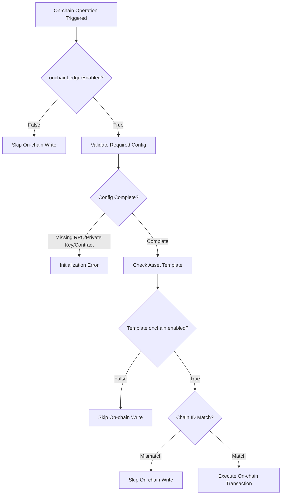
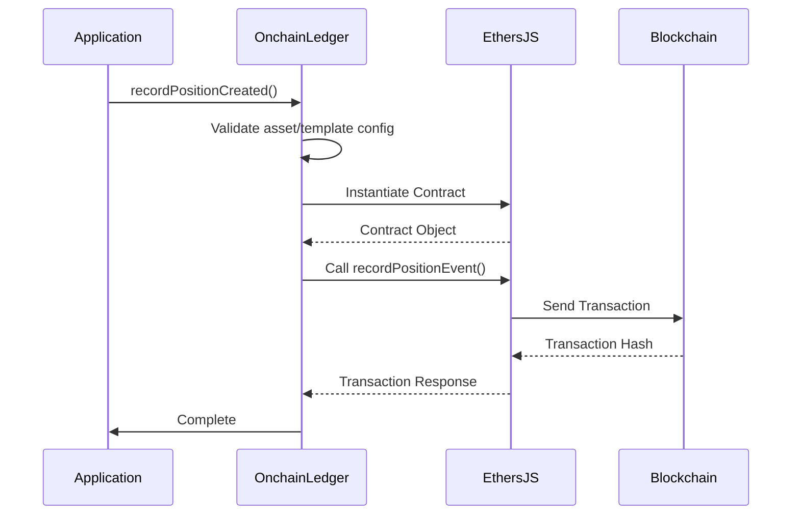
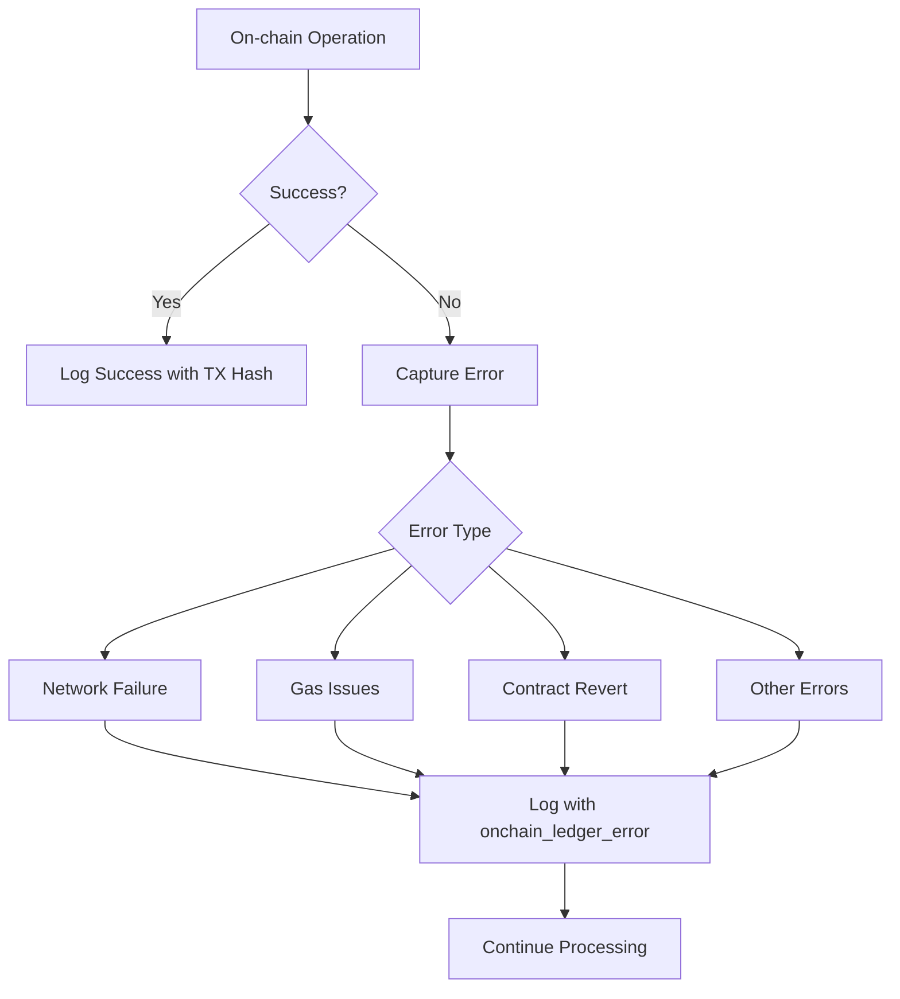
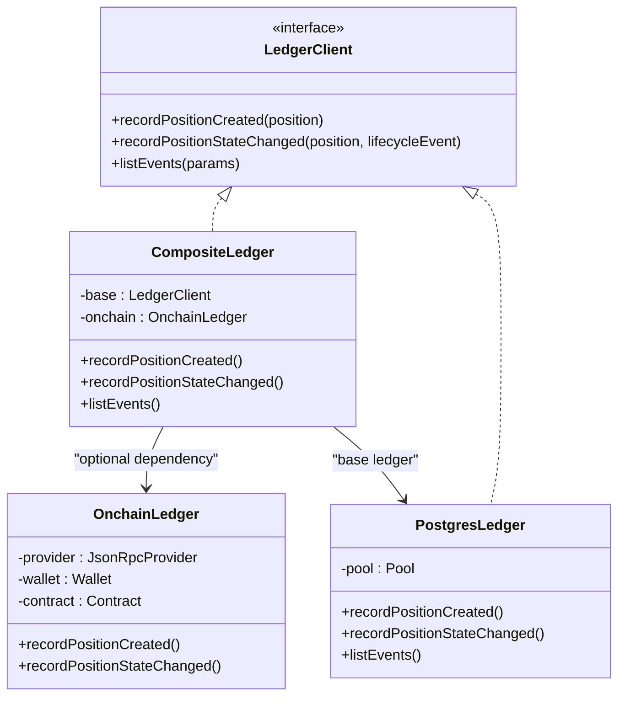
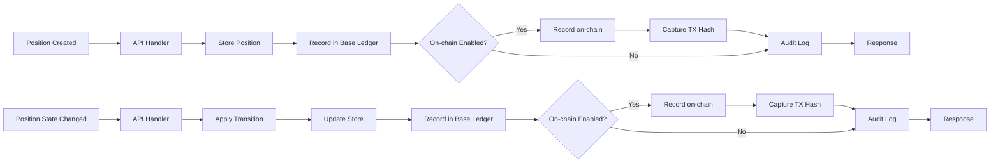

# On-Chain Ledger Integration

<cite>
**Referenced Files in This Document**   
- [onchainLedger.ts](file://src/infra/onchainLedger.ts)
- [config.ts](file://src/config.ts)
- [ledgerClient.ts](file://src/infra/ledgerClient.ts)
- [positions.ts](file://src/api/positions.ts)
- [auditLogger.ts](file://src/infra/auditLogger.ts)
</cite>

## Table of Contents
1. [Introduction](#introduction)
2. [Configuration and Conditional Activation](#configuration-and-conditional-activation)
3. [Smart Contract Interaction Pattern](#smart-contract-interaction-pattern)
4. [Error Handling and Fallback Strategies](#error-handling-and-fallback-strategies)
5. [CompositeLedger Synchronization](#compositel edger-synchronization)
6. [Event Triggering and Audit Trail Integration](#event-triggering-and-audit-trail-integration)
7. [Security Considerations](#security-considerations)
8. [Performance Implications](#performance-implications)

## Introduction
The on-chain ledger functionality in escrowgrid provides a mechanism to record position events as on-chain attestations on EVM-compatible blockchains. This feature enables verifiable, tamper-resistant audit trails by leveraging blockchain technology while maintaining compatibility with off-chain operations. The system uses Ethers.js for blockchain interactions and implements a dual-write pattern through the CompositeLedger to ensure both on-chain and off-chain consistency. The integration is designed to be optional and configurable at both the system and asset template levels, allowing granular control over when and where on-chain recording occurs.

## Configuration and Conditional Activation
The on-chain ledger functionality is governed by a hierarchical configuration system that enables conditional activation based on both global settings and asset-specific templates. The primary control is the `onchainLedgerEnabled` flag in the application configuration, which serves as a master switch for the entire on-chain functionality.

**Diagram sources**
- [config.ts](file://src/config.ts#L8)
- [onchainLedger.ts](file://src/infra/onchainLedger.ts#L17-L22)
- [onchainLedger.ts](file://src/infra/onchainLedger.ts#L53-L56)

**Section sources**
- [config.ts](file://src/config.ts#L8)
- [onchainLedger.ts](file://src/infra/onchainLedger.ts#L17-L82)

The system requires four essential environment variables to enable on-chain functionality:
- `ONCHAIN_RPC_URL`: The JSON-RPC endpoint for the target blockchain
- `ONCHAIN_PRIVATE_KEY`: The private key for the signing wallet
- `ONCHAIN_CONTRACT_ADDRESS`: The address of the ledger contract
- `ONCHAIN_CHAIN_ID`: The chain ID (optional but recommended for validation)

Additionally, each asset template can independently enable or disable on-chain recording through its configuration object. The template-level configuration supports:
- `enabled`: Boolean flag to activate on-chain recording for positions using this template
- `chainId`: Optional chain ID specification that must match the configured chain ID

This dual-layer configuration allows organizations to selectively enable on-chain recording for specific asset types while maintaining off-chain operations for others, providing flexibility in compliance and cost management.

## Smart Contract Interaction Pattern
The OnchainLedger class implements a standardized pattern for interacting with EVM-compatible smart contracts using Ethers.js. The interaction follows a consistent sequence of contract instantiation, method invocation, and transaction handling.

**Diagram sources**
- [onchainLedger.ts](file://src/infra/onchainLedger.ts#L25-L108)
- [onchainLedger.ts](file://src/infra/onchainLedger.ts#L93-L100)

**Section sources**
- [onchainLedger.ts](file://src/infra/onchainLedger.ts#L7-L23)

The contract interaction pattern consists of the following components:

1. **Contract Instantiation**: During OnchainLedger construction, the system creates a contract instance using the provided ABI, contract address, and wallet credentials. The ABI defines a single method:
   - `recordPositionEvent(string positionId, string kind, string payloadJson)`

2. **Transaction Execution**: When recording events, the ledger:
   - Retrieves the asset and template information to validate configuration
   - Constructs a JSON payload containing relevant position data
   - Invokes the contract method with the position ID, event kind, and serialized payload
   - Awaits the transaction response containing the transaction hash

3. **Payload Structure**: The payload format varies by event type:
   - **POSITION_CREATED**: Includes institutionId, assetId, currency, amount, externalReference, and state
   - **POSITION_STATE_CHANGED**: Includes institutionId, assetId, fromState, toState, reason, and timestamp

The implementation uses dynamic method access through TypeScript casting to invoke the contract method, providing type safety while maintaining flexibility in contract interface definition.

## Error Handling and Fallback Strategies
The on-chain ledger implements comprehensive error handling to maintain system reliability despite the inherent unpredictability of blockchain networks. The system employs structured logging and non-blocking execution to ensure that on-chain failures do not disrupt core application functionality.

**Diagram sources**
- [onchainLedger.ts](file://src/infra/onchainLedger.ts#L109-L117)
- [onchainLedger.ts](file://src/infra/onchainLedger.ts#L209-L217)

**Section sources**
- [onchainLedger.ts](file://src/infra/onchainLedger.ts#L109-L118)
- [onchainLedger.ts](file://src/infra/onchainLedger.ts#L209-L218)

The error handling strategy includes:

1. **Initialization Errors**: If required configuration is missing, the OnchainLedger constructor throws an error, which is caught during application startup. The system logs the initialization failure but continues operation with on-chain functionality disabled.

2. **Runtime Transaction Errors**: All contract interactions are wrapped in try-catch blocks that:
   - Capture and serialize any errors (including non-Error objects)
   - Log structured JSON messages with type "onchain_ledger_error"
   - Include the operation type, position ID, and error message
   - Prevent exceptions from propagating to calling code

3. **Pre-execution Validation**: Before attempting transactions, the system validates:
   - Asset existence
   - Template existence
   - Template-level on-chain enablement
   - Chain ID compatibility

4. **Non-blocking Design**: On-chain operations execute independently of the primary workflow. Failures in on-chain recording do not affect the success of position creation or state transitions, ensuring system availability even during blockchain network issues.

## CompositeLedger Synchronization
The CompositeLedger pattern enables synchronized writes to both off-chain and on-chain ledgers while maintaining loose coupling between the systems. This design ensures data consistency across storage layers without creating single points of failure.

**Diagram sources**
- [ledgerClient.ts](file://src/infra/ledgerClient.ts#L8-L37)
- [onchainLedger.ts](file://src/infra/onchainLedger.ts#L11-L15)

**Section sources**
- [ledgerClient.ts](file://src/infra/ledgerClient.ts#L8-L37)

The CompositeLedger implementation follows these principles:

1. **Sequential but Independent Writes**: When recording events, the system first writes to the base ledger (Postgres or in-memory), then conditionally writes to the on-chain ledger. The operations are sequential to maintain temporal consistency in logs, but failures in on-chain writing do not roll back the base ledger write.

2. **Conditional On-chain Integration**: The on-chain ledger is an optional dependency injected during CompositeLedger construction. If on-chain functionality is disabled or initialization fails, the onchain reference remains undefined, and the system silently skips on-chain operations.

3. **Read-Through Pattern**: The listEvents operation delegates entirely to the base ledger, as on-chain data is intended for external verification rather than application-level querying.

4. **Configuration-Driven Instantiation**: The ledgerClient singleton is constructed during application initialization based on:
   - The storeBackend configuration (determining Postgres vs. in-memory)
   - The onchainLedgerEnabled flag (determining on-chain integration)

This architecture ensures that the core ledger functionality remains available even when on-chain services are unavailable, while still providing the benefits of blockchain-based verification when enabled.

## Event Triggering and Audit Trail Integration
On-chain recording is triggered by specific position lifecycle events, with transaction details integrated into the system's audit trails for comprehensive monitoring and verification.

**Diagram sources**
- [positions.ts](file://src/api/positions.ts#L128)
- [positions.ts](file://src/api/positions.ts#L270)
- [onchainLedger.ts](file://src/infra/onchainLedger.ts#L101-L107)

**Section sources**
- [positions.ts](file://src/api/positions.ts#L128-L144)
- [positions.ts](file://src/api/positions.ts#L270-L285)

The system triggers on-chain recording for two primary events:

1. **Position Creation**: When a new position is created via the positions API endpoint, the system calls `ledgerClient.recordPositionCreated()` after successfully storing the position. If on-chain ledger is enabled and properly configured, this results in a blockchain transaction.

2. **Position State Changes**: When a position transitions between states via the transition endpoint, the system calls `ledgerClient.recordPositionStateChanged()` after updating the position in storage.

In both cases, successful on-chain transactions result in structured logs containing the transaction hash, which is included in the audit trail. The audit logger captures these events with type "onchain_ledger" and includes:
- The operation kind (POSITION_CREATED or POSITION_STATE_CHANGED)
- The position ID
- The blockchain transaction hash

This integration creates a verifiable chain of custody where off-chain audit logs reference on-chain attestations, enabling external verification of system integrity.

## Security Considerations
The on-chain ledger implementation incorporates several security measures to protect against common blockchain-related vulnerabilities and ensure the integrity of on-chain attestations.

**Section sources**
- [config.ts](file://src/config.ts#L10)
- [onchainLedger.ts](file://src/infra/onchainLedger.ts#L21)
- [onchainLedger.ts](file://src/infra/onchainLedger.ts#L67-L81)

Key security features include:

1. **Private Key Management**: The private key is injected through the ONCHAIN_PRIVATE_KEY environment variable, following the principle of least privilege. The implementation uses Ethers.js Wallet class for secure transaction signing without exposing private key operations in application code.

2. **Chain Selection and Validation**: The system validates chain compatibility at multiple levels:
   - Global configuration specifies the target chain ID
   - Template-level configuration can specify a required chain ID
   - The system checks for chain ID mismatches before executing transactions
   - This prevents accidental writes to incorrect networks

3. **Replay Protection**: While not explicitly implemented in the ledger code, the use of Ethers.js with JsonRpcProvider inherits Ethereum's native replay protection through nonce management and chain ID inclusion in transactions.

4. **Configuration Validation**: The system performs comprehensive validation before transaction execution:
   - Verifies asset and template existence
   - Confirms template-level on-chain enablement
   - Validates chain ID compatibility
   - Ensures required infrastructure configuration

5. **Error Isolation**: By containing blockchain interactions within the OnchainLedger class and using try-catch blocks, the system prevents blockchain-level errors from compromising application security.

6. **Principle of Least Authority**: The signing wallet should have minimal permissions, ideally limited to calling the recordPositionEvent function on the specified contract, reducing the impact of potential key compromise.

## Performance Implications
The integration of on-chain ledger functionality introduces specific performance characteristics and latency trade-offs that affect system behavior.

**Section sources**
- [onchainLedger.ts](file://src/infra/onchainLedger.ts#L100)
- [onchainLedger.ts](file://src/infra/onchainLedger.ts#L199)
- [ledgerClient.ts](file://src/infra/ledgerClient.ts#L18-L21)

Key performance considerations include:

1. **Latency**: On-chain operations introduce significant latency compared to off-chain writes, as transactions must be:
   - Signed locally
   - Broadcast to the network
   - Included in a block
   - Confirmed through block finality

2. **Non-blocking Design**: The system mitigates latency impacts by:
   - Not waiting for transaction confirmation before responding to clients
   - Only awaiting transaction submission (receipt of transaction hash)
   - Continuing processing regardless of on-chain success or failure

3. **Resource Utilization**: Each on-chain operation consumes:
   - Network bandwidth for transaction broadcasting
   - Gas fees for contract execution
   - Processing time for transaction signing

4. **Scalability Trade-offs**: The dual-write pattern ensures data consistency but creates a potential bottleneck during high-volume operations. The system is designed to prioritize off-chain availability, allowing on-chain operations to fail gracefully during peak loads.

5. **Monitoring Requirements**: The asynchronous nature of on-chain operations necessitates external monitoring to verify transaction finality, as the application only confirms transaction submission, not confirmation.

These performance characteristics make the on-chain ledger most suitable for high-value or compliance-critical operations where verifiable audit trails are more important than real-time blockchain confirmation.