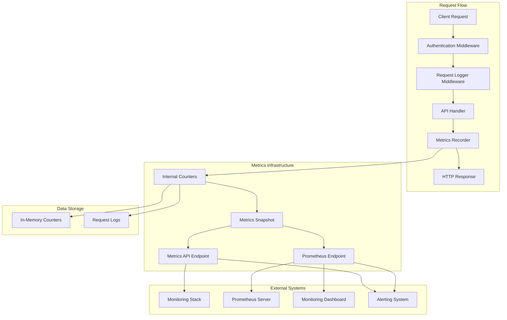
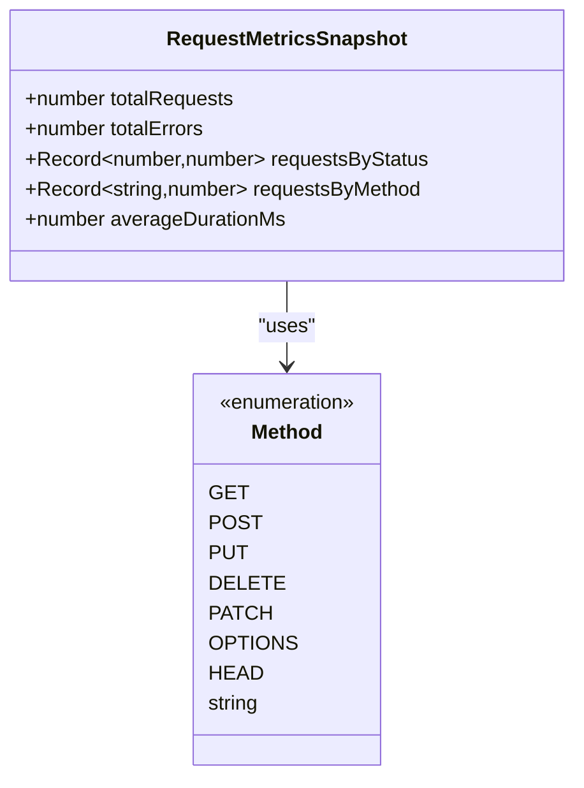
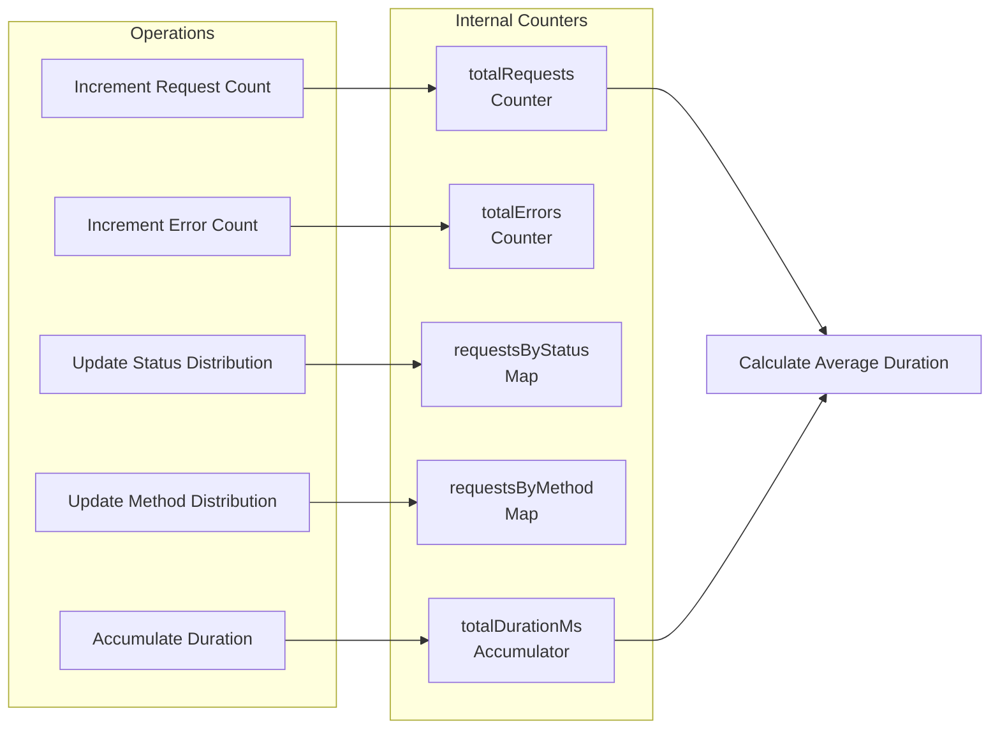
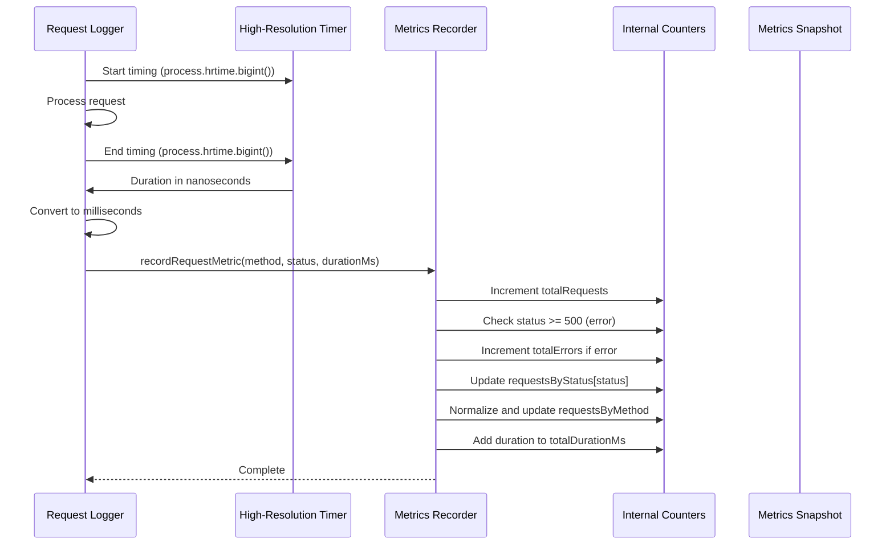
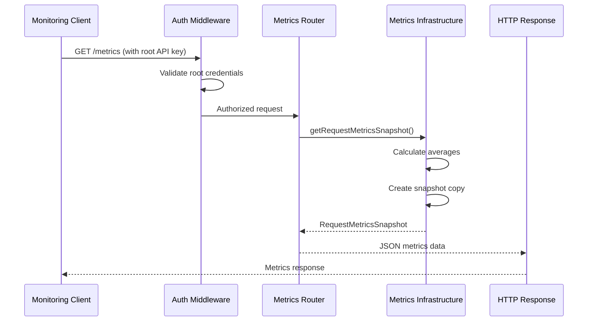
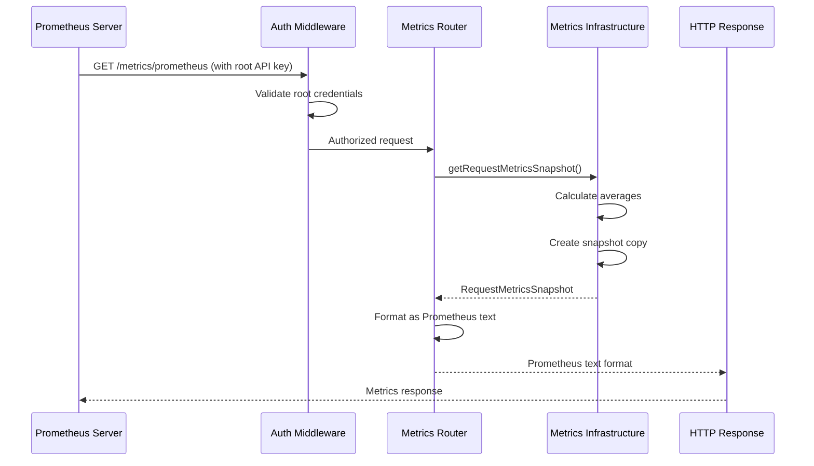
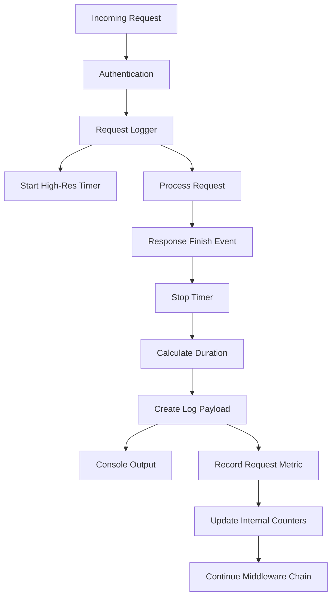

# Metrics Collection

<cite>
**Referenced Files in This Document**
- [src/infra/metrics.ts](file://src/infra/metrics.ts) - *Updated in recent commit*
- [src/api/metrics.ts](file://src/api/metrics.ts) - *Updated in recent commit*
- [src/middleware/requestLogger.ts](file://src/middleware/requestLogger.ts)
- [src/server.ts](file://src/server.ts) - *Updated in recent commit*
- [src/middleware/auth.ts](file://src/middleware/auth.ts)
- [src/config.ts](file://src/config.ts) - *Updated in recent commit*
- [src/infra/health.ts](file://src/infra/health.ts)
- [src/openapi.ts](file://src/openapi.ts) - *Updated in recent commit*
- [README.md](file://README.md) - *Updated in recent commit*
</cite>

## Update Summary
**Changes Made**
- Added new section on Prometheus metrics endpoint with detailed implementation and integration guidance
- Updated Metrics Exposure and Access section to include Prometheus endpoint details
- Enhanced Monitoring and Alerting Setup section with updated Prometheus configuration examples
- Added configuration details for METRICS_ENABLED environment variable
- Updated system architecture diagram to include Prometheus endpoint
- Added OpenAPI specification details for the new endpoint
- Updated document sources to reflect all modified files

## Table of Contents
1. [Introduction](#introduction)
2. [System Architecture](#system-architecture)
3. [Core Components](#core-components)
4. [RequestMetricsSnapshot Interface](#requestmetricssnapshot-interface)
5. [Internal Counters and Data Structures](#internal-counters-and-data-structures)
6. [Metrics Recording Process](#metrics-recording-process)
7. [Metrics Exposure and Access](#metrics-exposure-and-access)
8. [Integration with Request Logging Middleware](#integration-with-request-logging-middleware)
9. [Performance Analysis Use Cases](#performance-analysis-use-cases)
10. [Monitoring and Alerting Setup](#monitoring-and-alerting-setup)
11. [Memory Usage Considerations](#memory-usage-considerations)
12. [Troubleshooting Guide](#troubleshooting-guide)
13. [Best Practices](#best-practices)

## Introduction

The EscrowGrid metrics collection system provides comprehensive observability for API performance, reliability, and capacity planning. Built around a lightweight, in-memory metrics infrastructure, it captures essential request-level telemetry including timing data, error rates, HTTP status codes, and method distribution. The system is designed for operational visibility while maintaining minimal overhead on production workloads.

The metrics system serves as a foundation for monitoring, alerting, and performance analysis, enabling teams to track service health, identify bottlenecks, and make informed decisions about capacity planning and optimization. With the recent addition of a Prometheus-compatible endpoint, the system now offers enhanced integration capabilities with modern monitoring stacks.

## System Architecture

The metrics collection system follows a modular architecture with clear separation of concerns:



**Diagram sources**
- [src/server.ts](file://src/server.ts#L22-L24)
- [src/middleware/requestLogger.ts](file://src/middleware/requestLogger.ts#L5-L28)
- [src/infra/metrics.ts](file://src/infra/metrics.ts#L17-L37)
- [src/api/metrics.ts](file://src/api/metrics.ts#L20-L58)

**Section sources**
- [src/server.ts](file://src/server.ts#L1-L100)
- [src/middleware/requestLogger.ts](file://src/middleware/requestLogger.ts#L1-L29)

## Core Components

The metrics system consists of several interconnected components that work together to provide comprehensive observability:

### Metrics Infrastructure Layer
The core metrics infrastructure handles data collection, aggregation, and snapshot generation. This layer maintains internal state and provides thread-safe operations for metrics recording.

### Request Logger Middleware
The request logger middleware intercepts all incoming requests, measures response times, and triggers metrics recording with appropriate timing and outcome data.

### Metrics API Endpoint
The `/metrics` endpoint provides controlled access to aggregated metrics data, protected by root-level authentication to prevent unauthorized access to operational data.

### Prometheus Endpoint
The new `/metrics/prometheus` endpoint exposes metrics in standard Prometheus text format, enabling seamless integration with Prometheus monitoring systems. This endpoint is controlled by the METRICS_ENABLED environment variable and requires root-level authentication.

### Authentication Integration
Metrics access is restricted to root-level users, ensuring sensitive operational data remains protected while still being accessible for authorized monitoring activities.

**Section sources**
- [src/infra/metrics.ts](file://src/infra/metrics.ts#L1-L39)
- [src/api/metrics.ts](file://src/api/metrics.ts#L1-L18)
- [src/middleware/requestLogger.ts](file://src/middleware/requestLogger.ts#L1-L29)

## RequestMetricsSnapshot Interface

The `RequestMetricsSnapshot` interface defines the structure of aggregated metrics data exposed through the metrics endpoint. This interface serves as the contract for metrics consumption and monitoring integration.



**Diagram sources**
- [src/infra/metrics.ts](file://src/infra/metrics.ts#L3-L9)

### Interface Properties

| Property | Type | Description | Use Case |
|----------|------|-------------|----------|
| `totalRequests` | number | Cumulative count of all processed requests | Capacity planning, traffic analysis |
| `totalErrors` | number | Count of requests resulting in 5xx status codes | Error rate monitoring, reliability tracking |
| `requestsByStatus` | Record<number, number> | Distribution of requests across HTTP status codes | Status code analysis, SLA compliance |
| `requestsByMethod` | Record<string, number> | Distribution of requests across HTTP methods | Method-specific analysis, API usage patterns |
| `averageDurationMs` | number | Average response time across all requests | Performance monitoring, latency analysis |

**Section sources**
- [src/infra/metrics.ts](file://src/infra/metrics.ts#L3-L9)
- [src/openapi.ts](file://src/openapi.ts#L243-L258)

## Internal Counters and Data Structures

The metrics system maintains several internal counters and data structures to efficiently track request-level telemetry:

### Global State Management



**Diagram sources**
- [src/infra/metrics.ts](file://src/infra/metrics.ts#L11-L16)

### Counter Implementation Details

| Counter | Purpose | Reset Behavior | Memory Impact |
|---------|---------|----------------|---------------|
| `totalRequests` | Track total request volume | Never reset | Linear growth with traffic |
| `totalErrors` | Monitor error conditions | Never reset | Proportional to error rate |
| `requestsByStatus` | Status code distribution | Never reset | O(number of status codes) |
| `requestsByMethod` | HTTP method usage | Never reset | O(number of HTTP methods) |
| `totalDurationMs` | Response time accumulation | Never reset | Linear with request volume |

**Section sources**
- [src/infra/metrics.ts](file://src/infra/metrics.ts#L11-L16)

## Metrics Recording Process

The `recordRequestMetric` function captures timing and outcome data during request processing through a carefully orchestrated sequence of operations:



**Diagram sources**
- [src/middleware/requestLogger.ts](file://src/middleware/requestLogger.ts#L6-L23)
- [src/infra/metrics.ts](file://src/infra/metrics.ts#L17-L26)

### Timing Precision and Accuracy

The system uses Node.js high-resolution timers (`process.hrtime.bigint()`) to capture precise request durations with nanosecond resolution, converting to milliseconds for practical reporting while maintaining accuracy for performance analysis.

### Error Detection Logic

The metrics system automatically identifies errors by checking HTTP status codes against the 5xx range threshold, providing immediate visibility into service reliability issues.

**Section sources**
- [src/middleware/requestLogger.ts](file://src/middleware/requestLogger.ts#L6-L23)
- [src/infra/metrics.ts](file://src/infra/metrics.ts#L17-L26)

## Metrics Exposure and Access

The metrics endpoint provides controlled access to aggregated metrics data through a dedicated Express router with root-level authentication:



**Diagram sources**
- [src/api/metrics.ts](file://src/api/metrics.ts#L7-L14)
- [src/middleware/auth.ts](file://src/middleware/auth.ts#L58-L60)

### Prometheus Endpoint Integration

The new `/metrics/prometheus` endpoint exposes metrics in the standard Prometheus text format, enabling seamless integration with Prometheus monitoring systems. This endpoint is controlled by the METRICS_ENABLED environment variable and requires root-level authentication.



**Diagram sources**
- [src/api/metrics.ts](file://src/api/metrics.ts#L20-L58)
- [src/middleware/auth.ts](file://src/middleware/auth.ts#L58-L60)

### Access Control and Security

The metrics endpoint implements strict access controls requiring root-level authentication, ensuring that only authorized personnel can access operational metrics data. Both the JSON `/metrics` endpoint and the Prometheus `/metrics/prometheus` endpoint enforce this security requirement.

### Response Format and Schema

The metrics endpoint returns structured JSON data conforming to the OpenAPI specification, enabling seamless integration with monitoring systems and automated tooling. The Prometheus endpoint returns metrics in the standard Prometheus text format with appropriate HELP and TYPE metadata.

**Section sources**
- [src/api/metrics.ts](file://src/api/metrics.ts#L1-L18)
- [src/middleware/auth.ts](file://src/middleware/auth.ts#L58-L60)
- [src/openapi.ts](file://src/openapi.ts#L322-L364)

## Integration with Request Logging Middleware

The metrics system integrates seamlessly with the request logging middleware, creating a cohesive observability pipeline:



**Diagram sources**
- [src/middleware/requestLogger.ts](file://src/middleware/requestLogger.ts#L5-L28)

### Request Context Enrichment

The request logger enriches metrics data with contextual information including API key ID, institution ID, and request path, providing additional dimensions for analysis and troubleshooting.

### Asynchronous Processing

Metrics recording occurs asynchronously through the `res.on('finish')` event handler, ensuring that metrics collection doesn't impact request processing performance.

**Section sources**
- [src/middleware/requestLogger.ts](file://src/middleware/requestLogger.ts#L1-L29)

## Performance Analysis Use Cases

The metrics collection system enables various performance analysis scenarios critical for operational excellence:

### Traffic Pattern Analysis

| Analysis Type | Metrics Used | Insights Gained | Actionable Recommendations |
|---------------|--------------|-----------------|---------------------------|
| Request Volume Trends | `totalRequests` over time | Traffic growth patterns | Capacity scaling decisions |
| Method Distribution | `requestsByMethod` | API usage patterns | Resource allocation optimization |
| Status Code Analysis | `requestsByStatus` | Error patterns | Reliability improvement focus |
| Response Time Analysis | `averageDurationMs` | Performance trends | Bottleneck identification |

### Error Rate Monitoring

The system provides immediate visibility into service reliability through automatic error detection and cumulative error tracking, enabling rapid identification of reliability issues.

### Latency Analysis and Optimization

Average response time calculations combined with request volume data enable identification of performance degradation and optimization opportunities.

**Section sources**
- [src/infra/metrics.ts](file://src/infra/metrics.ts#L28-L37)

## Monitoring and Alerting Setup

The metrics system is designed for integration with comprehensive monitoring and alerting solutions:

### Prometheus Integration

The new `/metrics/prometheus` endpoint provides native support for Prometheus scraping with the following configuration:

```yaml
scrape_configs:
  - job_name: 'escrowgrid-backend'
    metrics_path: /metrics/prometheus
    static_configs:
      - targets: ['escrowgrid:4000']
    basic_auth:
      username: root
      password: $ROOT_API_KEY
```

**Section sources**
- [README.md](file://README.md#L381-L410)

### Suggested SLO Thresholds

| SLO Category | Target | Measurement Window | Alert Severity |
|--------------|--------|-------------------|----------------|
| Availability | 99.9% | 30-day rolling | Critical |
| Latency (95th) | < 300ms | Normal load | Warning |
| Latency (99th) | < 1000ms | Normal load | Warning |
| Error Rate | < 0.1% | 24-hour window | Warning |

### Alerting Rules

```yaml
groups:
  - name: escrowgrid_alerts
    rules:
      - alert: HighErrorRate
        expr: rate(escrowgrid_errors_total[5m]) > 0.001
        for: 2m
        labels:
          severity: warning
        annotations:
          summary: "High error rate detected"
          
      - alert: HighLatency
        expr: histogram_quantile(0.95, escrowgrid_request_duration_seconds) > 0.3
        for: 5m
        labels:
          severity: warning
        annotations:
          summary: "95th percentile latency exceeded threshold"
```

**Section sources**
- [README.md](file://README.md#L363-L378)

## Memory Usage Considerations

The metrics system operates in memory with specific memory usage characteristics that require consideration for long-running processes:

### Memory Growth Patterns

| Metric Type | Growth Pattern | Mitigation Strategy | Monitoring Approach |
|-------------|----------------|-------------------|-------------------|
| Status Code Cardinality | O(unique status codes) | Monitor cardinality | Set alerts for unexpected status codes |
| HTTP Method Distribution | O(unique methods) | Standard HTTP methods | Track unusual method patterns |
| Request Counters | Linear with traffic | Regular cleanup | Monitor memory usage trends |

### Long-Running Process Management

For applications operating continuously, the metrics system accumulates data indefinitely. While this provides historical insights, it's important to monitor memory usage and consider periodic restarts or data archival strategies for very long-running deployments.

### Memory Optimization Strategies

- **Status Code Cardinality**: Monitor the number of unique status codes being tracked
- **Method Distribution**: Track unusual HTTP method patterns that could indicate abuse
- **Memory Monitoring**: Implement memory usage alerts for production environments

**Section sources**
- [src/infra/metrics.ts](file://src/infra/metrics.ts#L11-L16)

## Troubleshooting Guide

Common issues and their resolutions when working with the metrics collection system:

### Metrics Not Updating

**Symptoms**: Metrics endpoint returns stale or unchanged data
**Causes**: 
- Request logging middleware not properly configured
- High-frequency requests not triggering metrics recording
- Application restarts clearing internal state

**Solutions**:
- Verify request logger middleware is properly registered in middleware chain
- Check that requests are actually reaching the metrics recording function
- Implement metrics persistence for production deployments

### High Memory Usage

**Symptoms**: Application memory usage grows unbounded over time
**Causes**:
- Excessive unique status codes being tracked
- Very high request volumes without monitoring
- Memory leaks in other parts of the application

**Solutions**:
- Monitor metrics cardinality and implement alerts
- Consider periodic application restarts for long-running deployments
- Review application memory usage patterns

### Authentication Issues

**Symptoms**: 403 Forbidden responses from metrics endpoint
**Causes**:
- Missing or invalid root API key
- Incorrect authentication header format
- Root API key not configured in environment

**Solutions**:
- Verify ROOT_API_KEY environment variable is set
- Ensure proper API key format in request headers
- Test authentication separately before accessing metrics

### Prometheus Endpoint Not Available

**Symptoms**: 404 Not Found responses from /metrics/prometheus endpoint
**Causes**:
- METRICS_ENABLED environment variable set to false
- Application configuration disabling metrics
- Endpoint not properly registered in server

**Solutions**:
- Verify METRICS_ENABLED environment variable is not set to false
- Check server configuration to ensure metrics router is properly mounted
- Test with default configuration to isolate the issue

**Section sources**
- [src/api/metrics.ts](file://src/api/metrics.ts#L8-L11)
- [src/middleware/auth.ts](file://src/middleware/auth.ts#L58-L60)
- [src/config.ts](file://src/config.ts#L65)

## Best Practices

### Production Deployment Guidelines

1. **Root API Key Management**: Securely manage root API keys and rotate them regularly
2. **Access Control**: Limit metrics endpoint access to authorized monitoring systems only
3. **Monitoring Integration**: Integrate with existing monitoring infrastructure early in development
4. **Capacity Planning**: Monitor metrics growth patterns to inform capacity decisions
5. **Prometheus Configuration**: Use the dedicated /metrics/prometheus endpoint for Prometheus integration with proper authentication

### Performance Optimization

1. **Middleware Ordering**: Ensure request logger middleware executes early in the middleware chain
2. **Asynchronous Processing**: Leverage the asynchronous nature of metrics recording
3. **Memory Monitoring**: Implement memory usage monitoring for long-running deployments
4. **Cardinality Management**: Monitor metrics cardinality to prevent unexpected growth

### Security Considerations

1. **Access Restriction**: Always use root-level authentication for metrics access
2. **Network Security**: Protect metrics endpoints with appropriate network security controls
3. **Data Sensitivity**: Recognize that metrics data may contain operational intelligence
4. **Audit Logging**: Consider additional audit logging for metrics access

### Operational Excellence

1. **Baseline Establishment**: Establish baseline metrics for normal operating conditions
2. **Trend Analysis**: Regularly analyze metrics trends for capacity planning
3. **Incident Response**: Use metrics data to support incident response and post-mortem analysis
4. **Documentation**: Maintain documentation of metrics meanings and thresholds

**Section sources**
- [src/config.ts](file://src/config.ts#L1-L47)
- [src/infra/health.ts](file://src/infra/health.ts#L1-L47)