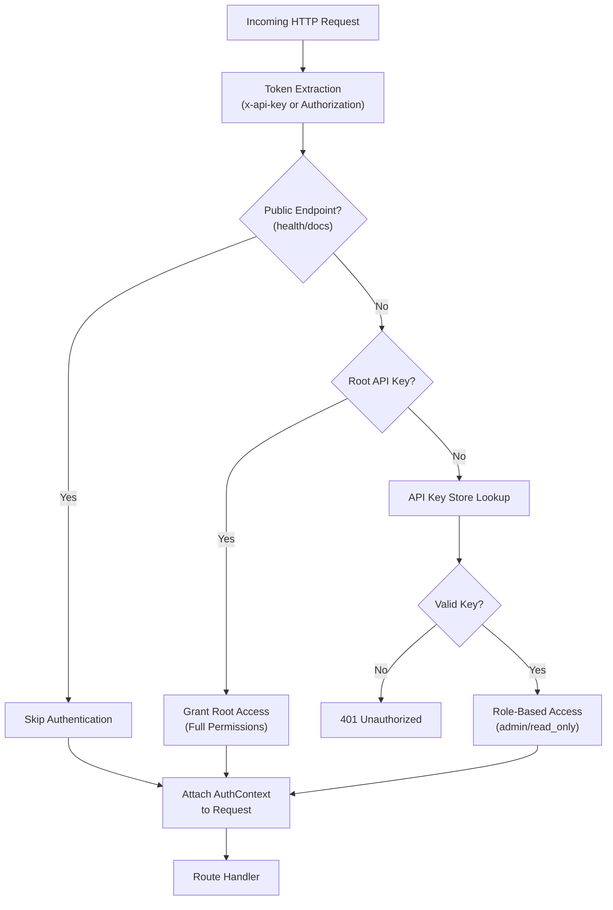
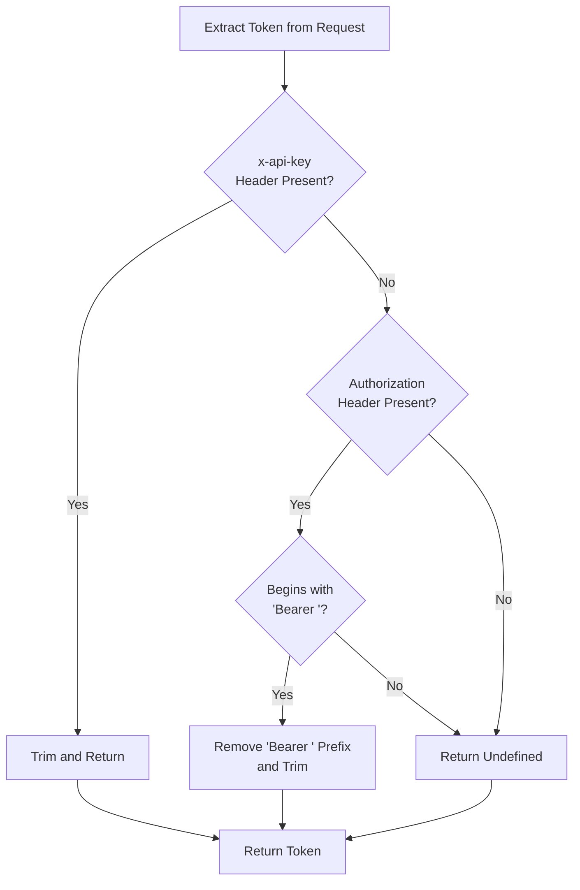
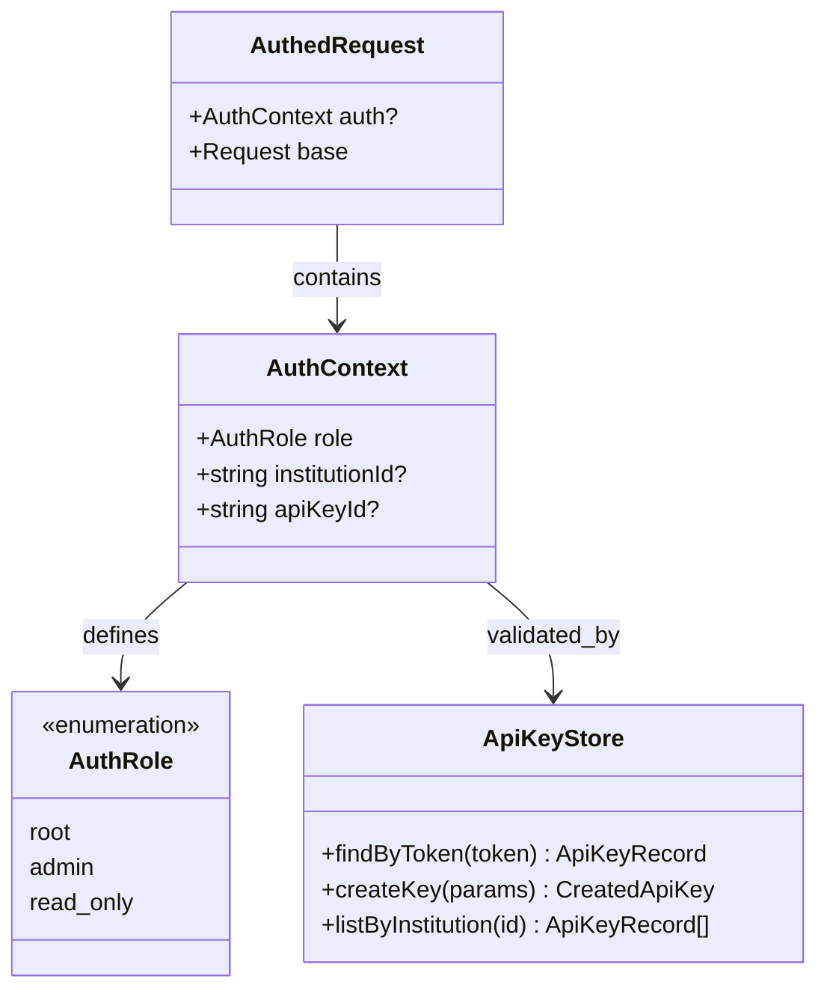
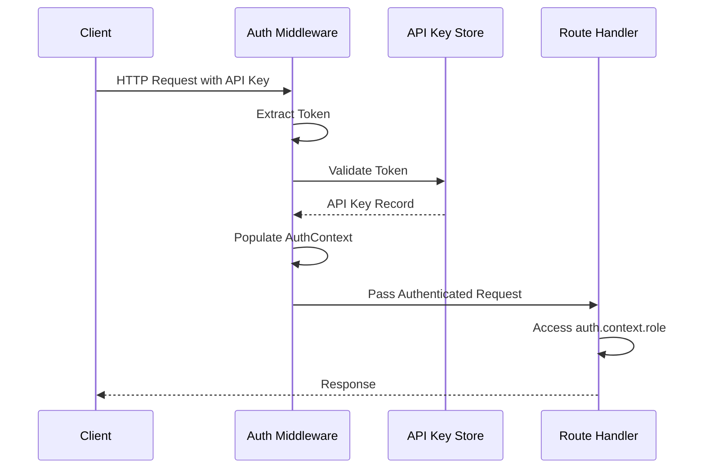
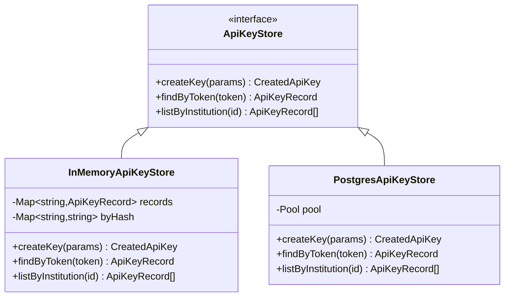
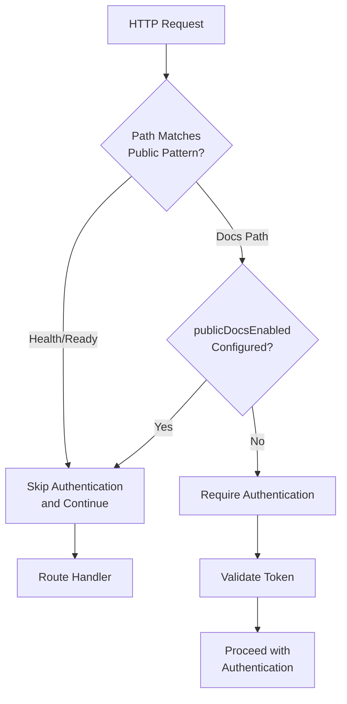
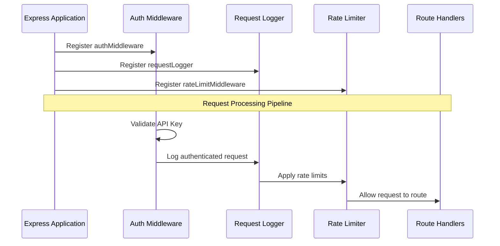
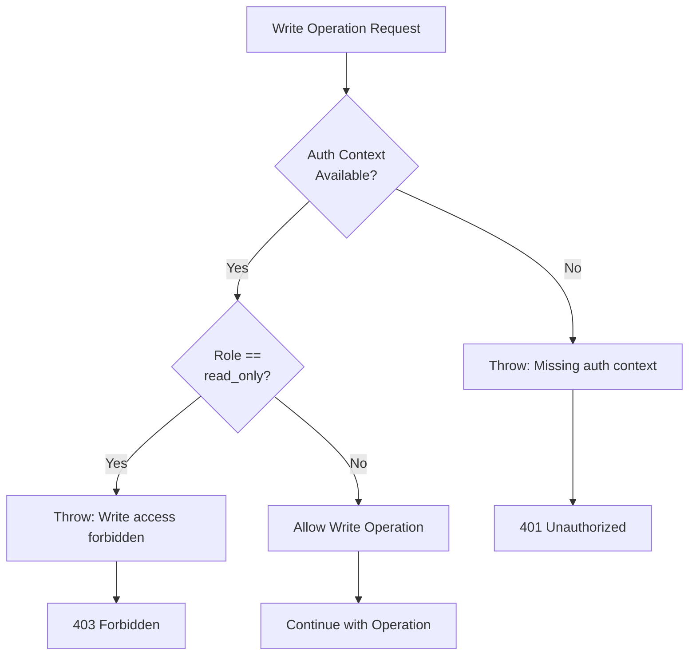

# Authentication Middleware

<cite>
**Referenced Files in This Document**
- [src/middleware/auth.ts](file://src/middleware/auth.ts) - *Updated to include publicDocsEnabled configuration*
- [src/config.ts](file://src/config.ts) - *Added publicDocsEnabled configuration option*
- [src/server.ts](file://src/server.ts) - *Documentation endpoints registration*
- [src/openapi.ts](file://src/openapi.ts) - *OpenAPI specification with documentation details*
- [src/infra/apiKeyStore.ts](file://src/infra/apiKeyStore.ts)
- [src/api/apiKeys.ts](file://src/api/apiKeys.ts)
- [src/api/positions.ts](file://src/api/positions.ts)
- [src/api/ledger.ts](file://src/api/ledger.ts)
- [src/api/policies.ts](file://src/api/policies.ts)
- [src/domain/types.ts](file://src/domain/types.ts)
- [src/infra/health.ts](file://src/infra/health.ts)
- [src/middleware/rateLimit.ts](file://src/middleware/rateLimit.ts)
</cite>

## Update Summary
**Changes Made**
- Updated Public Endpoint Bypass Logic section to include new `publicDocsEnabled` configuration option
- Added configuration details for public documentation access control
- Enhanced code examples to show conditional bypass logic
- Updated diagram to reflect conditional public access
- Added security considerations for public documentation endpoints

## Table of Contents
1. [Introduction](#introduction)
2. [Authentication Architecture](#authentication-architecture)
3. [Token Extraction and Validation](#token-extraction-and-validation)
4. [Role-Based Access Control](#role-based-access-control)
5. [AuthContext Integration](#authcontext-integration)
6. [API Key Store Integration](#api-key-store-integration)
7. [Public Endpoint Bypass Logic](#public-endpoint-bypass-logic)
8. [Middleware Registration](#middleware-registration)
9. [Write Access Enforcement](#write-access-enforcement)
10. [Security Considerations](#security-considerations)
11. [Common Issues and Troubleshooting](#common-issues-and-troubleshooting)
12. [Best Practices](#best-practices)

## Introduction

The authentication middleware in EscrowGrid provides a comprehensive security layer for the API, implementing role-based access control (RBAC) with support for multiple authentication mechanisms. The system validates API keys from HTTP headers and enforces granular permissions based on user roles and institutional associations.

The middleware serves as the primary security gatekeeper, intercepting all incoming requests and ensuring proper authentication before allowing access to protected resources. It supports three distinct authentication modes: root-level access, institution-administrator access, and read-only access, each with appropriate permission boundaries.

## Authentication Architecture

The authentication system follows a layered architecture that separates concerns between token extraction, validation, and access control enforcement.



**Diagram sources**
- [src/middleware/auth.ts](file://src/middleware/auth.ts#L35-L82)

**Section sources**
- [src/middleware/auth.ts](file://src/middleware/auth.ts#L1-L95)

## Token Extraction and Validation

The authentication middleware implements flexible token extraction supporting two primary header formats commonly used in modern APIs.

### Header Processing Logic

The [`extractToken`](file://src/middleware/auth.ts#L23-L32) function implements a prioritized header evaluation strategy:

1. **Primary Priority**: `x-api-key` header containing the raw API token
2. **Secondary Priority**: `Authorization: Bearer <token>` header format
3. **Fallback**: No token detected



**Diagram sources**
- [src/middleware/auth.ts](file://src/middleware/auth.ts#L23-L32)

### Root API Key Validation

The system supports a special root API key configuration that grants unrestricted access to all resources. This mechanism enables administrative operations and system maintenance tasks.

**Section sources**
- [src/middleware/auth.ts](file://src/middleware/auth.ts#L23-L32)
- [src/middleware/auth.ts](file://src/middleware/auth.ts#L58-L60)

## Role-Based Access Control

The authentication system implements a hierarchical RBAC model with three distinct roles, each with specific permission boundaries and access limitations.

### Role Definitions

| Role | Description | Permissions | Scope |
|------|-------------|-------------|-------|
| `root` | Super administrator | Full access to all resources | Global |
| `admin` | Institution administrator | Full access within institution | Institution-specific |
| `read_only` | Limited access | Read-only access within institution | Institution-specific |

### Role-Based Access Patterns



**Diagram sources**
- [src/middleware/auth.ts](file://src/middleware/auth.ts#L6-L21)
- [src/domain/types.ts](file://src/domain/types.ts#L5)

### Access Control Implementation

The middleware enforces role-based access through several mechanisms:

1. **Global vs Institutional Access**: Root users can access any resource, while institution users are restricted to their assigned institution
2. **Write Permission Enforcement**: The [`requireWriteAccess`](file://src/middleware/auth.ts#L84-L93) function prevents read-only users from performing modification operations
3. **Institution Boundary Enforcement**: Requests are validated against the user's institutional association

**Section sources**
- [src/middleware/auth.ts](file://src/middleware/auth.ts#L6-L21)
- [src/domain/types.ts](file://src/domain/types.ts#L5)

## AuthContext Integration

The authentication middleware seamlessly integrates with Express.js request objects through a custom type extension mechanism.

### Type Definition Structure

The [`AuthedRequest`](file://src/middleware/auth.ts#L14-L21) interface extends the standard Express Request type to include authentication context:

```typescript
interface AuthedRequest<
  P = any,
  ResBody = any,
  ReqBody = any,
  ReqQuery = any,
> extends Request<P, ResBody, ReqBody, ReqQuery> {
  auth?: AuthContext;
}
```

### Context Population

During successful authentication, the middleware populates the AuthContext with:

- **Role Information**: The authenticated user's role level
- **Institution Association**: The institution ID for institutional users
- **API Key Identity**: The specific API key ID for auditing and tracking

### Request Flow Integration



**Diagram sources**
- [src/middleware/auth.ts](file://src/middleware/auth.ts#L35-L82)

**Section sources**
- [src/middleware/auth.ts](file://src/middleware/auth.ts#L14-L21)
- [src/middleware/auth.ts](file://src/middleware/auth.ts#L70-L74)

## API Key Store Integration

The authentication system integrates with a pluggable API key storage backend that supports both in-memory and PostgreSQL implementations.

### Storage Backend Architecture



**Diagram sources**
- [src/infra/apiKeyStore.ts](file://src/infra/apiKeyStore.ts#L13-L23)

### Token Hashing and Security

The API key store implements cryptographic hashing for secure token storage:

1. **Token Generation**: Random 48-character hex strings prefixed with `ak_`
2. **Hash Storage**: SHA-256 hashing of tokens for secure storage
3. **Recovery**: Hash-based lookup for token validation

### Storage Backend Selection

The system automatically selects the appropriate storage backend based on configuration:

- **PostgreSQL Backend**: Production-ready with persistent storage
- **In-Memory Backend**: Development and testing environments

**Section sources**
- [src/infra/apiKeyStore.ts](file://src/infra/apiKeyStore.ts#L13-L184)

## Public Endpoint Bypass Logic

The authentication middleware implements intelligent bypass logic for public endpoints that should remain accessible without authentication.

### Bypass Criteria

The middleware automatically skips authentication for the following endpoint patterns when enabled:

| Endpoint Pattern | Purpose | Security Consideration | Configuration Dependency |
|------------------|---------|------------------------|--------------------------|
| `/health` | Health monitoring | Public availability | Always accessible |
| `/ready` | Readiness checks | Public availability | Always accessible |
| `/openapi.json` | API specification | Public documentation | `publicDocsEnabled` |
| `/docs*` | Interactive documentation | Public documentation | `publicDocsEnabled` |

### Configuration Option

The new `publicDocsEnabled` configuration option in `AppConfig` controls whether documentation endpoints require authentication:

```typescript
/**
 * When true, OpenAPI/Swagger/ReDoc are served without authentication.
 * In production you will typically want this false so that docs require an API key.
 */
publicDocsEnabled: boolean;
```

This configuration is derived from the `PUBLIC_DOCS_ENABLED` environment variable in the config module:

```typescript
publicDocsEnabled: process.env.PUBLIC_DOCS_ENABLED === 'true',
```

**Section sources**
- [src/config.ts](file://src/config.ts#L15-L19)
- [src/config.ts](file://src/config.ts#L41)

### Implementation Logic

The authentication middleware now includes conditional logic for documentation endpoints:



**Diagram sources**
- [src/middleware/auth.ts](file://src/middleware/auth.ts#L40-L51)

### Security Implications

The public endpoint bypass ensures that monitoring, documentation, and health-check endpoints remain accessible while maintaining strict authentication for all protected resources. The `publicDocsEnabled` configuration provides flexibility for different deployment environments:

- **Development**: Enable public documentation access for easier API exploration
- **Production**: Disable public access to protect API documentation from unauthorized access
- **Staging**: Configure based on organizational security policies

**Section sources**
- [src/middleware/auth.ts](file://src/middleware/auth.ts#L40-L51)
- [src/server.ts](file://src/server.ts#L68-L105)

## Middleware Registration

The authentication middleware is integrated into the Express.js application stack during server initialization.

### Registration Order

The middleware is registered in the following sequence:

1. **Authentication Middleware**: First middleware executed
2. **Request Logger**: Logs authenticated requests
3. **Rate Limiter**: Applies rate limiting based on authentication context

### Server Integration



**Diagram sources**
- [src/server.ts](file://src/server.ts#L21-L24)

### Configuration Impact

The middleware registration affects all routes in the application, ensuring consistent security enforcement across the entire API surface.

**Section sources**
- [src/server.ts](file://src/server.ts#L21-L24)

## Write Access Enforcement

The system implements granular write access control through the [`requireWriteAccess`](file://src/middleware/auth.ts#L84-L93) function, preventing read-only users from performing modification operations.

### Enforcement Mechanism



**Diagram sources**
- [src/middleware/auth.ts](file://src/middleware/auth.ts#L84-L93)

### Usage Patterns

The write access enforcement is implemented consistently across all modification endpoints:

1. **Position Creation**: Validates write access before processing creation requests
2. **Position Transitions**: Ensures only authorized users can modify position states
3. **Policy Updates**: Restricts policy modifications to administrators
4. **API Key Management**: Controls who can create and manage API keys

### Error Handling

The system provides structured error responses with appropriate HTTP status codes:

- **401 Unauthorized**: Missing authentication context
- **403 Forbidden**: Insufficient privileges for write operations

**Section sources**
- [src/middleware/auth.ts](file://src/middleware/auth.ts#L84-L93)
- [src/api/positions.ts](file://src/api/positions.ts#L30-L35)

## Security Considerations

The authentication middleware implements several security measures to protect against common vulnerabilities and ensure robust protection.

### Token Security

1. **Secure Generation**: API keys use cryptographically secure random generation
2. **Hash Storage**: Tokens are stored as SHA-256 hashes to prevent exposure
3. **Header Security**: Supports both `x-api-key` and `Authorization` headers for flexibility

### Access Control Boundaries

1. **Role Isolation**: Clear separation between root, admin, and read-only users
2. **Institution Boundaries**: Prevents cross-institution access attempts
3. **Operation Restrictions**: Granular control over read/write operations

### Error Handling Security

The middleware implements secure error handling that avoids information disclosure:

- **Generic Error Messages**: Vague error messages prevent information leakage
- **Structured Responses**: Consistent error response format
- **Logging Separation**: Authentication errors logged separately from application errors

### Performance Considerations

1. **Async Operations**: Token validation occurs asynchronously to avoid blocking
2. **Caching Opportunities**: API key store implementations support caching strategies
3. **Early Termination**: Unauthenticated requests are rejected early in the pipeline

### Documentation Endpoint Security

With the introduction of the `publicDocsEnabled` configuration:

1. **Production Security**: Disable public documentation access in production environments
2. **Environment-Specific Configuration**: Use different settings for development, staging, and production
3. **Access Monitoring**: Track access to documentation endpoints when publicly available
4. **Content Protection**: Ensure sensitive information is not exposed in public documentation

**Section sources**
- [src/config.ts](file://src/config.ts#L15-L19)
- [src/middleware/auth.ts](file://src/middleware/auth.ts#L40-L51)

## Common Issues and Troubleshooting

### Invalid Token Handling

**Issue**: Users receive 401 Unauthorized responses despite having valid tokens.

**Causes and Solutions**:
- **Token Format Issues**: Ensure tokens follow the `ak_<hex>` format
- **Whitespace Problems**: Verify tokens are trimmed of leading/trailing whitespace
- **Header Configuration**: Confirm proper header format (`x-api-key` or `Authorization: Bearer`)

### Root Key Misconfiguration

**Issue**: Root API key fails to grant expected permissions.

**Diagnosis Steps**:
1. Verify `ROOT_API_KEY` environment variable is set
2. Check token format matches exactly (case-sensitive)
3. Ensure middleware is properly registered

**Solution**: Validate configuration and restart application if needed.

### Performance Implications of Async Lookups

**Issue**: Authentication delays affecting API response times.

**Mitigation Strategies**:
- **Connection Pooling**: Use PostgreSQL backend for efficient database connections
- **Caching Layers**: Implement application-level caching for frequently accessed keys
- **Monitoring**: Track authentication latency and identify bottlenecks

### Cross-Institution Access Violations

**Issue**: Users attempting to access resources outside their institutional scope.

**Prevention Measures**:
- **Strict Validation**: Enforce institutional boundaries in all route handlers
- **Audit Logging**: Monitor unauthorized access attempts
- **Configuration Review**: Regularly review API key assignments

**Section sources**
- [src/middleware/auth.ts](file://src/middleware/auth.ts#L58-L67)
- [src/middleware/auth.ts](file://src/middleware/auth.ts#L75-L81)

## Best Practices

### Key Rotation Strategies

1. **Scheduled Rotation**: Implement regular API key rotation schedules
2. **Gradual Migration**: Support multiple valid keys during transition periods
3. **Revocation Mechanisms**: Enable immediate key revocation when compromised
4. **Audit Trails**: Maintain comprehensive logs of key creation and revocation

### Monitoring and Observability

1. **Authentication Metrics**: Track authentication success/failure rates
2. **Rate Limiting**: Monitor rate limit violations and adjust thresholds
3. **Error Patterns**: Identify and investigate authentication error patterns
4. **Performance Monitoring**: Track authentication latency and throughput

### Security Hardening

1. **Environment Isolation**: Separate root API keys from regular API keys
2. **Network Security**: Implement proper network segmentation and TLS encryption
3. **Access Auditing**: Regular review of API key usage and access patterns
4. **Incident Response**: Establish procedures for authentication-related incidents
5. **Documentation Security**: Configure `publicDocsEnabled=false` in production environments

### Development Guidelines

1. **Consistent Implementation**: Apply authentication patterns uniformly across all endpoints
2. **Testing Coverage**: Comprehensive testing of authentication scenarios
3. **Documentation**: Maintain clear documentation of authentication requirements
4. **Error Handling**: Implement graceful degradation for authentication failures

The authentication middleware in EscrowGrid provides a robust, scalable security foundation that supports the platform's operational requirements while maintaining strong security boundaries and clear access control mechanisms.