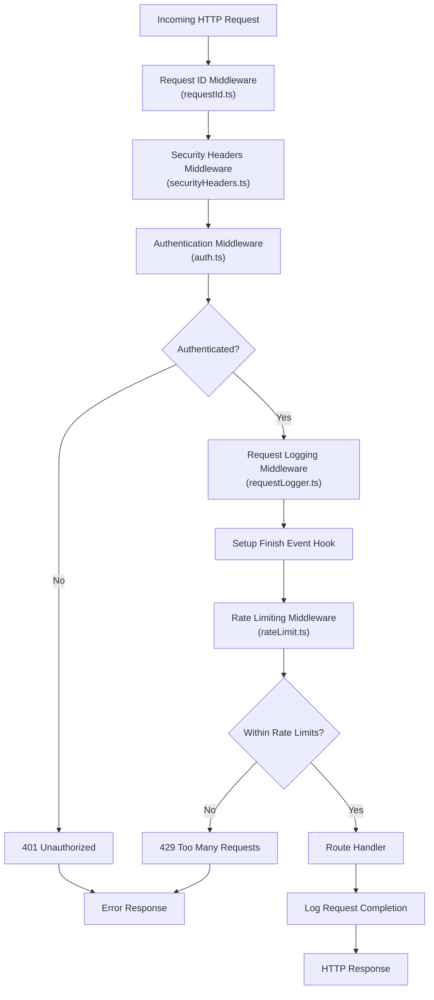
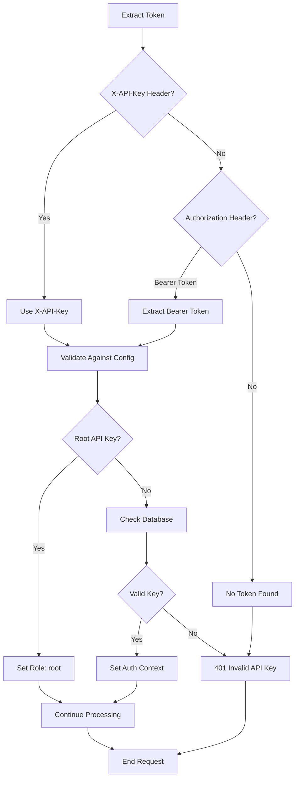
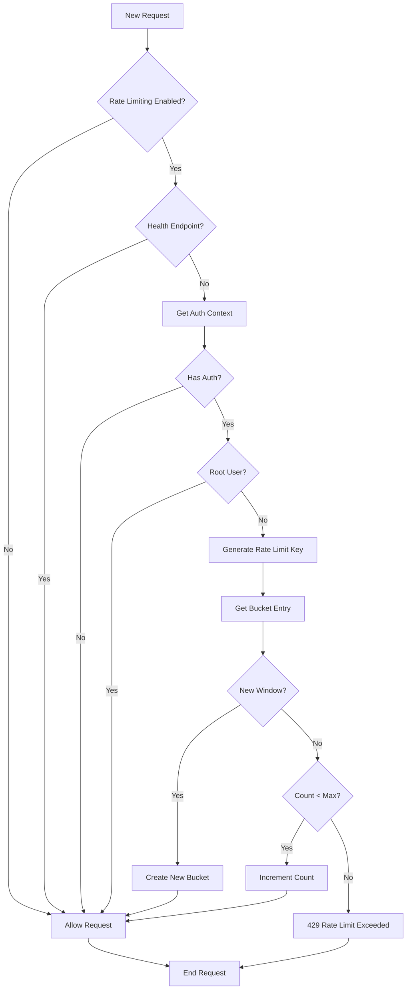
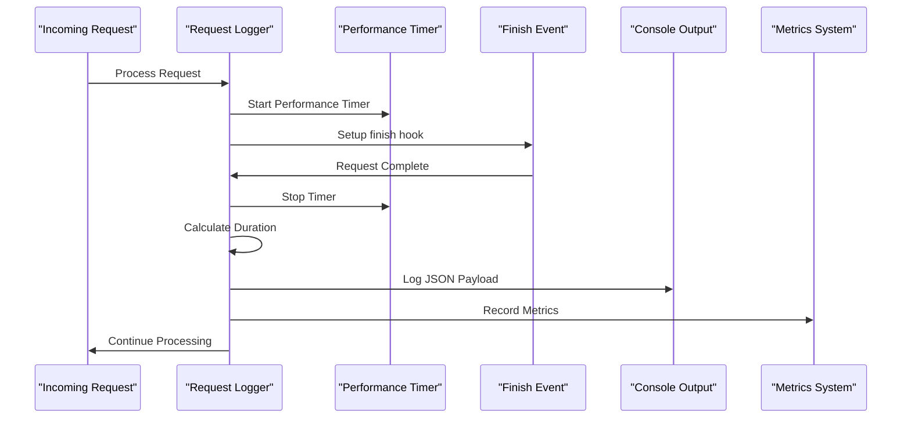
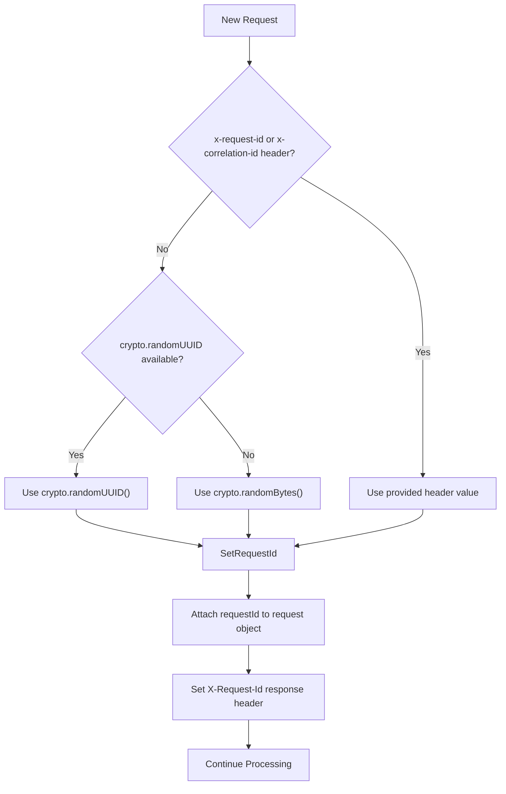
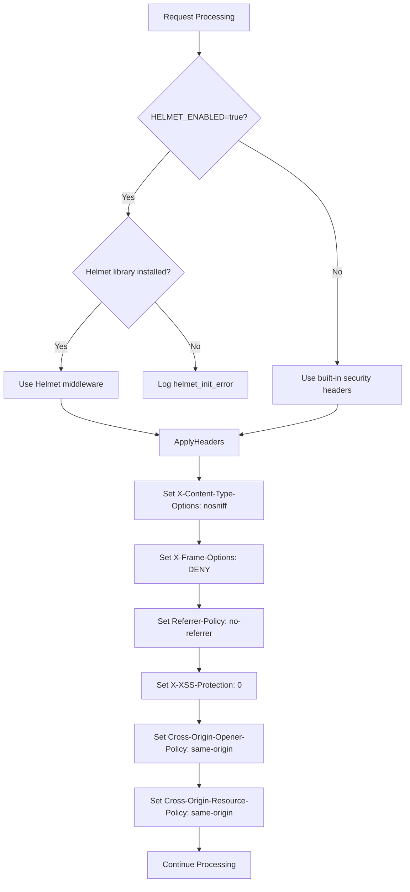
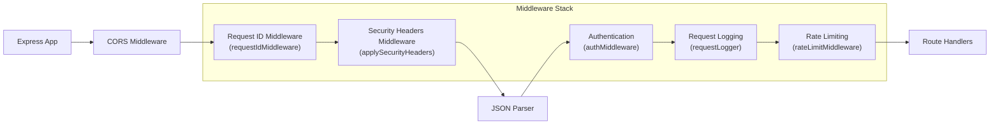
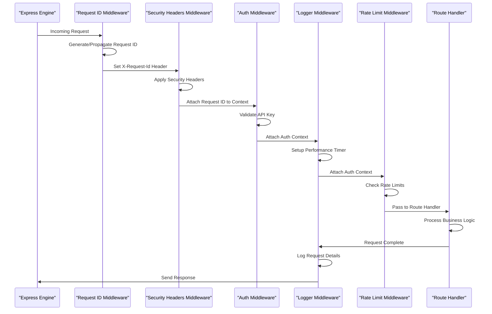

# Middleware

<cite>
**Referenced Files in This Document**
- [src/middleware/auth.ts](file://src/middleware/auth.ts) - *Updated in recent commit*
- [src/middleware/rateLimit.ts](file://src/middleware/rateLimit.ts) - *Updated in recent commit*
- [src/middleware/requestLogger.ts](file://src/middleware/requestLogger.ts) - *Updated in recent commit*
- [src/server.ts](file://src/server.ts) - *Updated in recent commit*
- [src/config.ts](file://src/config.ts) - *Updated in recent commit*
- [src/domain/types.ts](file://src/domain/types.ts)
- [src/infra/apiKeyStore.ts](file://src/infra/apiKeyStore.ts)
- [src/infra/metrics.ts](file://src/infra/metrics.ts)
- [src/api/apiKeys.ts](file://src/api/apiKeys.ts)
- [src/api/positions.ts](file://src/api/positions.ts)
- [src/middleware/requestId.ts](file://src/middleware/requestId.ts) - *Added in recent commit*
- [src/middleware/securityHeaders.ts](file://src/middleware/securityHeaders.ts) - *Added in recent commit*
</cite>

## Update Summary
**Changes Made**
- Added new section for Request ID Propagation Middleware
- Added new section for Security Headers Middleware
- Updated Middleware Architecture Overview diagram to include new middleware components
- Updated Middleware Registration and Execution Order diagram and explanation
- Updated Integration with Express Request Lifecycle diagram
- Added configuration details for HELMET_ENABLED environment variable
- Updated references to include new middleware files

## Table of Contents
1. [Introduction](#introduction)
2. [Middleware Architecture Overview](#middleware-architecture-overview)
3. [Authentication Middleware](#authentication-middleware)
4. [Rate Limiting Middleware](#rate-limiting-middleware)
5. [Request Logging Middleware](#request-logging-middleware)
6. [Request ID Propagation Middleware](#request-id-propagation-middleware)
7. [Security Headers Middleware](#security-headers-middleware)
8. [Middleware Registration and Execution Order](#middleware-registration-and-execution-order)
9. [Integration with Express Request Lifecycle](#integration-with-express-request-lifecycle)
10. [Configuration and Environment Variables](#configuration-and-environment-variables)
11. [Common Issues and Troubleshooting](#common-issues-and-troubleshooting)
12. [Performance Implications](#performance-implications)
13. [Best Practices](#best-practices)

## Introduction

The escrowgrid middleware stack provides essential security, performance, and observability features for the API server. The middleware components work together to enforce authentication, implement rate limiting, capture detailed request logs for debugging and auditing purposes, propagate request identifiers for tracing, and apply security hardening headers. This system is built using Express.js and follows a layered approach where each middleware component has a specific responsibility in the request processing pipeline.

The middleware architecture consists of five primary components:
- **Authentication Middleware**: Validates API keys and enforces role-based access control
- **Rate Limiting Middleware**: Implements in-memory rate limiting with configurable thresholds
- **Request Logging Middleware**: Captures request metadata for monitoring and debugging
- **Request ID Propagation Middleware**: Generates and propagates unique request identifiers for end-to-end tracing
- **Security Headers Middleware**: Applies HTTP security hardening headers with optional Helmet integration

## Middleware Architecture Overview

The middleware components are designed to work together in a specific execution order, with each layer building upon the previous one to provide comprehensive request processing capabilities.



**Diagram sources**
- [src/server.ts](file://src/server.ts#L22-L24)
- [src/middleware/auth.ts](file://src/middleware/auth.ts#L35-L82)
- [src/middleware/rateLimit.ts](file://src/middleware/rateLimit.ts#L12-L64)
- [src/middleware/requestLogger.ts](file://src/middleware/requestLogger.ts#L5-L26)
- [src/middleware/requestId.ts](file://src/middleware/requestId.ts#L11-L26)
- [src/middleware/securityHeaders.ts](file://src/middleware/securityHeaders.ts#L29-L47)

## Authentication Middleware

The authentication middleware serves as the first line of defense, validating API keys and establishing the authentication context for subsequent middleware and route handlers.

### Purpose and Functionality

The authentication middleware performs several critical functions:

1. **API Key Validation**: Extracts and validates API keys from request headers
2. **Role-Based Access Control**: Enforces different access levels (root, admin, read_only)
3. **Context Establishment**: Creates an authentication context attached to the request object
4. **Security Enforcement**: Blocks unauthorized access attempts

### API Key Validation Process

The middleware supports multiple authentication methods:



**Diagram sources**
- [src/middleware/auth.ts](file://src/middleware/auth.ts#L23-L32)
- [src/middleware/auth.ts](file://src/middleware/auth.ts#L52-L81)

### Role-Based Access Control

The system implements a hierarchical access control model:

| Role | Description | Permissions |
|------|-------------|-------------|
| `root` | Super administrator | Full access to all resources, bypasses rate limits |
| `admin` | Institution administrator | Full access within assigned institution |
| `read_only` | Read-only access | Limited to GET operations, no modifications |

### Write Access Enforcement

The middleware provides a dedicated function for enforcing write access restrictions:

```typescript
// requireWriteAccess usage pattern
export function requireWriteAccess(auth?: AuthContext): void {
  if (!auth) {
    throw new Error('Missing auth context');
  }
  if (auth.role === 'read_only') {
    const err = new Error('Write access forbidden for read_only API key');
    (err as any).statusCode = 403;
    throw err;
  }
}
```

**Section sources**
- [src/middleware/auth.ts](file://src/middleware/auth.ts#L1-L95)
- [src/domain/types.ts](file://src/domain/types.ts#L5-L6)

## Rate Limiting Middleware

The rate limiting middleware implements an in-memory sliding window algorithm to prevent API abuse while maintaining simplicity and performance.

### Implementation Strategy

The rate limiting system uses a sliding window approach with the following characteristics:

1. **Sliding Window Algorithm**: Tracks request counts within configurable time windows
2. **In-Memory Storage**: Uses a Map-based storage for efficient memory management
3. **Per-Entity Limiting**: Supports both API key-specific and institution-based limits
4. **Configurable Thresholds**: Adjustable limits based on operational requirements

### Rate Limiting Algorithm



**Diagram sources**
- [src/middleware/rateLimit.ts](file://src/middleware/rateLimit.ts#L12-L64)

### Configuration Parameters

The rate limiting system is configured through environment variables:

| Parameter | Type | Default | Description |
|-----------|------|---------|-------------|
| `RATE_LIMIT_ENABLED` | boolean | false | Enable/disable rate limiting |
| `RATE_LIMIT_WINDOW_MS` | number | 60000 | Time window in milliseconds |
| `RATE_LIMIT_MAX_REQUESTS` | number | 1000 | Maximum requests per window |

### Rate Limiting Behavior

The middleware implements the following rate limiting logic:

1. **Window Management**: Each client gets a separate time window bucket
2. **Count Tracking**: Maintains request count within the current window
3. **Expiry Handling**: Automatically resets buckets when windows expire
4. **Graceful Degradation**: Continues processing when rate limiting is disabled

**Section sources**
- [src/middleware/rateLimit.ts](file://src/middleware/rateLimit.ts#L1-L67)
- [src/config.ts](file://src/config.ts#L13-L16)

## Request Logging Middleware

The request logging middleware provides comprehensive request tracking for monitoring, debugging, and auditing purposes. It captures detailed metadata and integrates with the metrics system.

### Logging Architecture

The logging system operates through an event-driven approach:



**Diagram sources**
- [src/middleware/requestLogger.ts](file://src/middleware/requestLogger.ts#L5-L26)

### Log Payload Structure

Each logged request includes comprehensive metadata:

| Field | Type | Description |
|-------|------|-------------|
| `type` | string | Log type identifier ('request') |
| `method` | string | HTTP method (GET, POST, etc.) |
| `path` | string | Request URL path |
| `status` | number | HTTP response status code |
| `durationMs` | number | Request duration in milliseconds |
| `requestId` | string \| null | Request identifier for tracing |
| `apiKeyId` | string \| null | Associated API key ID |
| `institutionId` | string \| null | Associated institution ID |

### Performance Monitoring Integration

The middleware integrates with the metrics system to track request performance:

```typescript
// Metrics recording example
recordRequestMetric(method, res.statusCode, durationMs);
```

This integration enables real-time monitoring of request patterns, error rates, and performance characteristics.

**Section sources**
- [src/middleware/requestLogger.ts](file://src/middleware/requestLogger.ts#L1-L29)
- [src/infra/metrics.ts](file://src/infra/metrics.ts#L17-L25)

## Request ID Propagation Middleware

The request ID propagation middleware generates unique identifiers for each request and ensures they are propagated throughout the request lifecycle for end-to-end tracing.

### Purpose and Functionality

The request ID middleware serves several critical purposes:

1. **Request Tracing**: Provides a unique identifier for tracking requests across system boundaries
2. **Log Correlation**: Enables correlation of logs across different services and components
3. **Audit Trail**: Supports comprehensive audit trails by linking related operations
4. **Debugging**: Facilitates debugging by providing a consistent identifier across logs

### Request ID Generation Strategy

The middleware implements a robust request ID generation strategy:



**Diagram sources**
- [src/middleware/requestId.ts](file://src/middleware/requestId.ts#L11-L26)

### Implementation Details

The middleware follows these steps to handle request IDs:

1. **Header Extraction**: Checks for existing `x-request-id` or `x-correlation-id` headers
2. **ID Generation**: Generates a new UUID if no valid header is present
3. **Context Propagation**: Attaches the request ID to the request object for downstream access
4. **Response Header**: Sets the `X-Request-Id` header in the response for client visibility

```typescript
// Request ID middleware implementation
export function requestIdMiddleware(
  req: AuthedRequest,
  res: Response,
  next: NextFunction,
): void {
  const header =
    req.header('x-request-id') ??
    req.header('x-correlation-id') ??
    undefined;
  const requestId = header && header.trim().length > 0 ? header.trim() : generateRequestId();

  req.requestId = requestId;
  res.setHeader('X-Request-Id', requestId);

  next();
}
```

**Section sources**
- [src/middleware/requestId.ts](file://src/middleware/requestId.ts#L1-L30)
- [src/middleware/auth.ts](file://src/middleware/auth.ts#L13-L21)

## Security Headers Middleware

The security headers middleware applies HTTP security hardening headers to protect against common web vulnerabilities, with optional integration of the Helmet library.

### Purpose and Functionality

The security headers middleware provides several security benefits:

1. **Content Type Protection**: Prevents MIME type sniffing attacks
2. **Clickjacking Prevention**: Blocks framing of the application
3. **Referrer Policy**: Controls referrer information disclosure
4. **Cross-Origin Protection**: Enforces same-origin policies for resources and windows
5. **XSS Protection**: Disables legacy XSS protection that can cause issues

### Security Headers Strategy

The middleware implements a flexible security headers strategy:



**Diagram sources**
- [src/middleware/securityHeaders.ts](file://src/middleware/securityHeaders.ts#L29-L47)

### Implementation Details

The middleware follows a fallback strategy for security headers:

1. **Helmet Integration**: Uses Helmet library when `HELMET_ENABLED=true` and Helmet is installed
2. **Built-in Headers**: Applies basic security headers when Helmet is not available
3. **Configuration**: Respects configuration settings from `config.helmetEnabled`

```typescript
// Security headers implementation
export function applySecurityHeaders(
  req: AuthedRequest,
  res: Response,
  next: NextFunction,
): void {
  if (helmetMiddleware) {
    return helmetMiddleware(req, res, next);
  }

  // Basic hardening headers; HSTS and CSP are typically managed at the edge (reverse proxy / CDN).
  res.setHeader('X-Content-Type-Options', 'nosniff');
  res.setHeader('X-Frame-Options', 'DENY');
  res.setHeader('Referrer-Policy', 'no-referrer');
  res.setHeader('X-XSS-Protection', '0');
  res.setHeader('Cross-Origin-Opener-Policy', 'same-origin');
  res.setHeader('Cross-Origin-Resource-Policy', 'same-origin');

  next();
}
```

**Section sources**
- [src/middleware/securityHeaders.ts](file://src/middleware/securityHeaders.ts#L1-L51)
- [src/config.ts](file://src/config.ts#L21-L25)

## Middleware Registration and Execution Order

The middleware components are registered in a specific order that ensures proper dependency chain and security enforcement.

### Registration Sequence



**Diagram sources**
- [src/server.ts](file://src/server.ts#L19-L24)

### Execution Order Benefits

1. **Early Request Identification**: Request IDs are established before any processing
2. **Security Hardening**: Security headers are applied early in the request lifecycle
3. **Early Authentication**: Security checks occur before expensive operations
4. **Comprehensive Logging**: All requests are logged with request IDs regardless of outcome
5. **Rate Limiting Protection**: Prevents abuse before reaching business logic
6. **Resource Efficiency**: Unauthenticated requests are blocked early

### Protected Routes

Certain routes are automatically exempt from authentication and rate limiting:

- `/health` - Health check endpoint
- `/ready` - Readiness check endpoint  
- `/openapi.json` - API specification
- `/docs` - API documentation
- `/docs/` - Documentation variants
- `/docs/redoc` - Redoc documentation

**Section sources**
- [src/server.ts](file://src/server.ts#L22-L24)
- [src/middleware/auth.ts](file://src/middleware/auth.ts#L40-L48)

## Integration with Express Request Lifecycle

The middleware components integrate seamlessly with Express.js request lifecycle hooks, ensuring proper error handling and resource cleanup.

### Request Lifecycle Integration



**Diagram sources**
- [src/server.ts](file://src/server.ts#L19-L24)
- [src/middleware/auth.ts](file://src/middleware/auth.ts#L35-L82)
- [src/middleware/requestLogger.ts](file://src/middleware/requestLogger.ts#L5-L26)
- [src/middleware/requestId.ts](file://src/middleware/requestId.ts#L11-L26)
- [src/middleware/securityHeaders.ts](file://src/middleware/securityHeaders.ts#L29-L47)

### Error Handling Integration

Each middleware component handles errors appropriately:

1. **Authentication Errors**: Return 401 Unauthorized for invalid credentials
2. **Rate Limiting Errors**: Return 429 Too Many Requests with Retry-After header
3. **Write Access Errors**: Return 403 Forbidden for insufficient permissions
4. **System Errors**: Return 500 Internal Server Error for unexpected failures

### Context Propagation

The authentication and request ID context is propagated through the request lifecycle:

```typescript
// Authenticated request interface with request ID
export interface AuthedRequest<
  P = any,
  ResBody = any,
  ReqBody = any,
  ReqQuery = any,
> extends Request<P, ResBody, ReqBody, ReqQuery> {
  auth?: AuthContext;
  requestId?: string;
}
```

This typed interface ensures type safety throughout the request processing pipeline.

**Section sources**
- [src/middleware/auth.ts](file://src/middleware/auth.ts#L13-L21)
- [src/middleware/rateLimit.ts](file://src/middleware/rateLimit.ts#L12-L64)

## Configuration and Environment Variables

The middleware system is highly configurable through environment variables, allowing for flexible deployment scenarios.

### Authentication Configuration

| Variable | Type | Default | Description |
|----------|------|---------|-------------|
| `ROOT_API_KEY` | string | undefined | Master API key for administrative access |

### Rate Limiting Configuration

| Variable | Type | Default | Description |
|----------|------|---------|-------------|
| `RATE_LIMIT_ENABLED` | boolean | false | Enable rate limiting |
| `RATE_LIMIT_WINDOW_MS` | number | 60000 | Time window in milliseconds |
| `RATE_LIMIT_MAX_REQUESTS` | number | 1000 | Maximum requests per window |

### Security Headers Configuration

| Variable | Type | Default | Description |
|----------|------|---------|-------------|
| `HELMET_ENABLED` | boolean | false | Enable Helmet integration for enhanced security headers |

### Storage Backend Configuration

| Variable | Type | Default | Description |
|----------|------|---------|-------------|
| `STORE_BACKEND` | string | 'memory' | Database backend selection |
| `DATABASE_URL` | string | undefined | PostgreSQL connection string |

### Configuration Loading

The configuration system uses a centralized approach with environment variable overrides:

```typescript
// Configuration loading example
export const config: AppConfig = {
  port: Number.isNaN(parsedPort) ? 4000 : parsedPort,
  storeBackend: (process.env.STORE_BACKEND as StoreBackend | undefined) ?? 'memory',
  postgresUrl: process.env.DATABASE_URL,
  rootApiKey: process.env.ROOT_API_KEY,
  rateLimitEnabled: process.env.RATE_LIMIT_ENABLED === 'true',
  rateLimitWindowMs: rawRateLimitWindow ? Number.parseInt(rawRateLimitWindow, 10) : 60000,
  rateLimitMaxRequests: rawRateLimitMax ? Number.parseInt(rawRateLimitMax, 10) : 1000,
  helmetEnabled: process.env.HELMET_ENABLED === 'true',
};
```

**Section sources**
- [src/config.ts](file://src/config.ts#L1-L75)

## Common Issues and Troubleshooting

Understanding common issues helps in diagnosing problems and implementing effective solutions.

### Authentication Issues

#### Unauthorized Access Attempts

**Symptoms:**
- 401 Unauthorized responses
- "Missing API key" errors
- "Invalid API key" messages

**Causes:**
1. Missing or malformed API key in request headers
2. Expired or revoked API keys
3. Incorrect API key format

**Solutions:**
- Verify API key presence in `X-API-Key` or `Authorization` headers
- Check API key validity through the API key management endpoints
- Ensure proper header formatting (no extra whitespace)

#### Root API Key Configuration

**Symptoms:**
- Root API key not recognized
- Unexpected rate limiting for root users

**Solutions:**
- Verify `ROOT_API_KEY` environment variable is set correctly
- Ensure root API key matches exactly (case-sensitive)
- Check that rate limiting is properly configured for root users

### Rate Limiting Issues

#### Rate Limit Exceeded

**Symptoms:**
- 429 Too Many Requests responses
- Retry-After header present
- Requests being blocked unexpectedly

**Causes:**
1. Exceeding configured rate limits
2. Misconfigured rate limiting parameters
3. High traffic volume during peak periods

**Solutions:**
- Monitor rate limit metrics and adjust thresholds
- Implement exponential backoff in client applications
- Consider upgrading rate limiting configuration for high-volume clients

#### Memory Usage Concerns

**Symptoms:**
- Increasing memory consumption over time
- Rate limiting buckets growing indefinitely

**Solutions:**
- Implement periodic cleanup of expired buckets
- Consider using persistent storage for production deployments
- Monitor memory usage and implement appropriate alerts

### Request Logging Issues

#### Log Overload

**Symptoms:**
- Excessive console output
- Performance degradation
- Disk space issues

**Solutions:**
- Implement structured logging with filtering
- Use log rotation strategies
- Consider external logging systems for production

#### Synchronous Logging Impact

**Symptoms:**
- Request latency increases
- Performance bottlenecks observed

**Solutions:**
- Implement asynchronous logging where possible
- Use buffered logging for high-throughput scenarios
- Consider logging aggregation and batch processing

### Integration Issues

#### Middleware Order Problems

**Symptoms:**
- Authentication failing for legitimate requests
- Rate limiting not working as expected
- Logging missing request details

**Solutions:**
- Verify middleware registration order in server.ts
- Ensure proper error handling in each middleware
- Test middleware components independently

**Section sources**
- [src/middleware/auth.ts](file://src/middleware/auth.ts#L52-L81)
- [src/middleware/rateLimit.ts](file://src/middleware/rateLimit.ts#L12-L64)
- [src/middleware/requestLogger.ts](file://src/middleware/requestLogger.ts#L5-L26)

## Performance Implications

Understanding the performance characteristics of each middleware component is crucial for optimizing system performance.

### Authentication Performance

#### API Key Validation Costs

The authentication middleware involves several performance considerations:

1. **Header Parsing**: Minimal cost for extracting API keys from headers
2. **Database Lookups**: Synchronous database queries for API key validation
3. **Hash Comparison**: SHA-256 hash verification for stored API keys
4. **Context Creation**: Object creation overhead for authentication context

#### Optimization Strategies

- **Connection Pooling**: Use database connection pooling for API key lookups
- **Caching**: Implement caching for frequently accessed API keys
- **Async Operations**: Consider async database operations for improved throughput
- **Indexing**: Ensure proper indexing on API key hash columns

### Rate Limiting Performance

#### Memory-Based Implementation

The in-memory rate limiting approach offers excellent performance characteristics:

1. **O(1) Lookup**: Map-based storage provides constant-time access
2. **Minimal Serialization**: Simple object structures for rate limit entries
3. **Garbage Collection**: Automatic cleanup of expired buckets

#### Scalability Considerations

While in-memory implementation is fast, it has limitations:
- **Single Instance**: Rate limits are not shared across instances
- **Memory Constraints**: Large numbers of clients may consume significant memory
- **Persistence**: Rate limits are lost on restart

### Request Logging Performance

#### Synchronous Logging Impact

The current implementation uses synchronous console logging, which has several implications:

1. **Blocking Nature**: Each log operation blocks request processing
2. **I/O Bottlenecks**: Console output can become a bottleneck under high load
3. **Latency Impact**: Logging adds measurable latency to request processing

#### Performance Optimization Options

1. **Asynchronous Logging**: Implement async logging to non-blocking I/O
2. **Buffered Logging**: Use logging buffers to reduce I/O frequency
3. **Sampling**: Implement request sampling to reduce logging overhead
4. **External Systems**: Integrate with external logging systems (ELK, Splunk)

### Memory Management

#### Resource Cleanup

Proper resource management is essential for long-running applications:

```typescript
// Example cleanup patterns
const cleanupInterval = setInterval(() => {
  // Remove expired rate limit buckets
  // Clean up old log entries
  // Perform garbage collection tasks
}, 60000); // Run every minute
```

#### Monitoring Metrics

Key performance metrics to monitor:

- Authentication response times
- Rate limiting hit rates
- Logging throughput and latency
- Memory usage patterns
- Error rates and types

**Section sources**
- [src/middleware/rateLimit.ts](file://src/middleware/rateLimit.ts#L10)
- [src/middleware/requestLogger.ts](file://src/middleware/requestLogger.ts#L22)

## Best Practices

Implementing these best practices ensures optimal middleware performance and reliability.

### Security Best Practices

#### API Key Management

1. **Secure Storage**: Never log or expose API keys in plain text
2. **Rotation Policies**: Implement regular API key rotation
3. **Scope Limiting**: Use least-privilege principle for API key roles
4. **Monitoring**: Track API key usage and detect anomalies

#### Authentication Hardening

1. **Header Validation**: Validate and sanitize all request headers
2. **Error Information**: Avoid exposing sensitive information in error messages
3. **Rate Limiting**: Apply rate limiting to authentication endpoints
4. **Timeouts**: Implement reasonable timeouts for authentication operations

### Operational Best Practices

#### Configuration Management

1. **Environment Separation**: Use different configurations for development, staging, and production
2. **Secret Management**: Store sensitive configuration in secure secret management systems
3. **Validation**: Validate configuration parameters at startup
4. **Documentation**: Document all configuration options and their effects

#### Monitoring and Alerting

1. **Metrics Collection**: Implement comprehensive metrics for all middleware components
2. **Alerting**: Set up alerts for authentication failures, rate limit breaches, and performance degradation
3. **Log Analysis**: Implement log analysis for security and performance insights
4. **Health Checks**: Regular health checks for middleware components

### Development Best Practices

#### Testing Strategies

1. **Unit Testing**: Test each middleware component independently
2. **Integration Testing**: Test middleware interactions and error handling
3. **Load Testing**: Test rate limiting and authentication under load
4. **Security Testing**: Penetration testing for authentication vulnerabilities

#### Code Quality

1. **Type Safety**: Use TypeScript interfaces for middleware contracts
2. **Error Handling**: Implement comprehensive error handling and logging
3. **Documentation**: Document middleware behavior and configuration options
4. **Modularity**: Keep middleware components focused and reusable

### Deployment Best Practices

#### Production Considerations

1. **Scalability**: Design for horizontal scaling and distributed rate limiting
2. **Resilience**: Implement circuit breakers and fallback mechanisms
3. **Observability**: Ensure comprehensive logging and monitoring
4. **Backup**: Implement backup and recovery procedures for authentication data

#### Performance Tuning

1. **Profiling**: Regular performance profiling of middleware components
2. **Optimization**: Identify and address performance bottlenecks
3. **Capacity Planning**: Plan for growth and scale requirements
4. **Testing**: Load testing with realistic traffic patterns

**Section sources**
- [src/middleware/auth.ts](file://src/middleware/auth.ts#L1-L95)
- [src/middleware/rateLimit.ts](file://src/middleware/rateLimit.ts#L1-L67)
- [src/middleware/requestLogger.ts](file://src/middleware/requestLogger.ts#L1-L29)