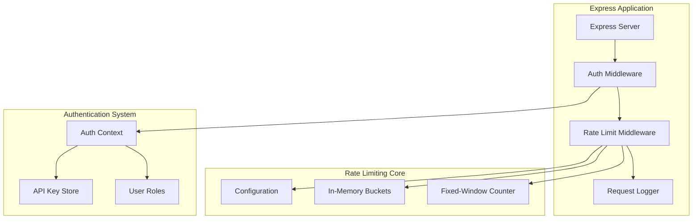
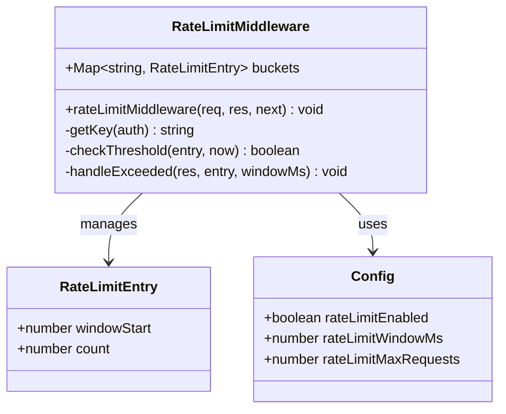
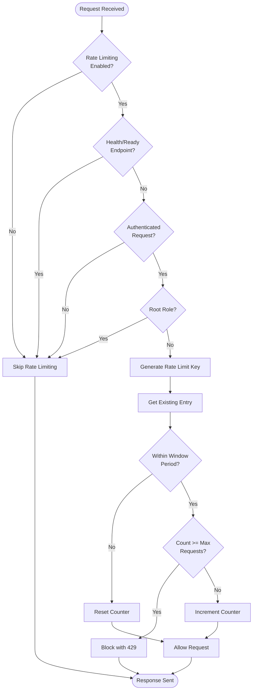
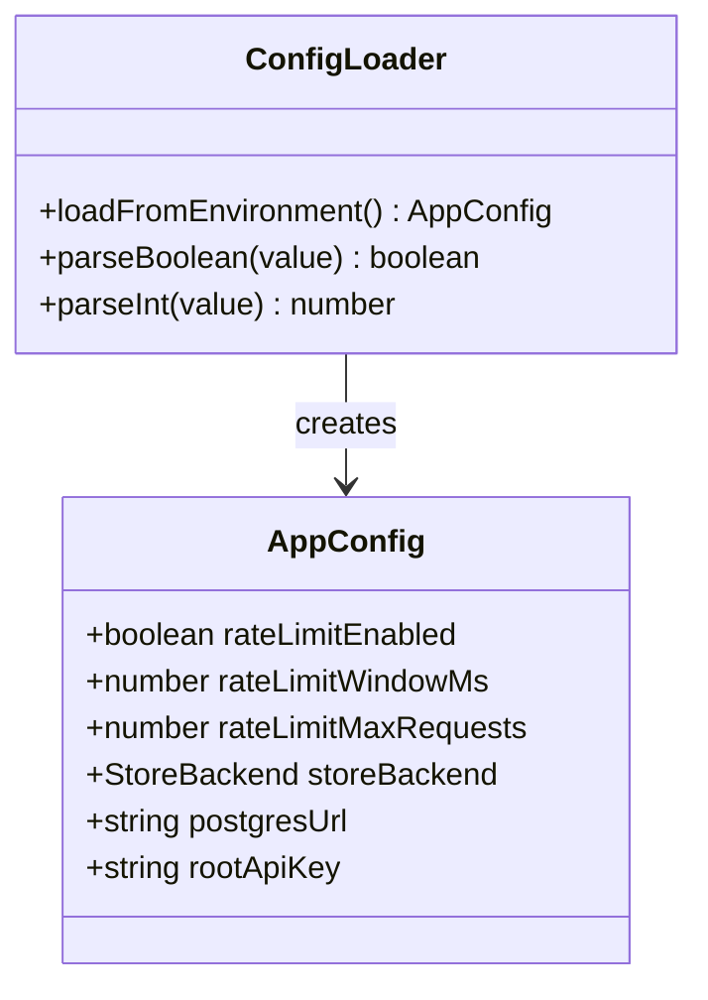
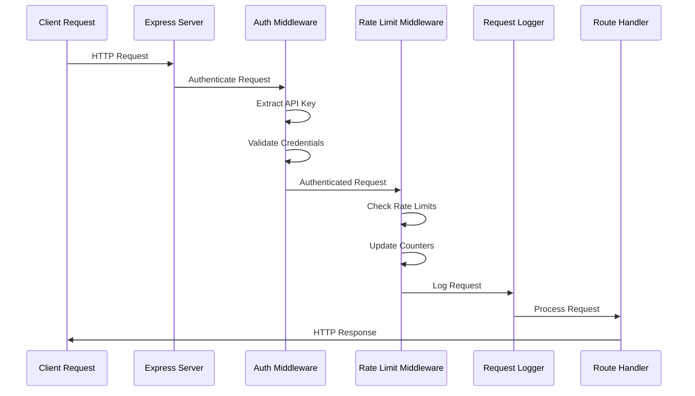
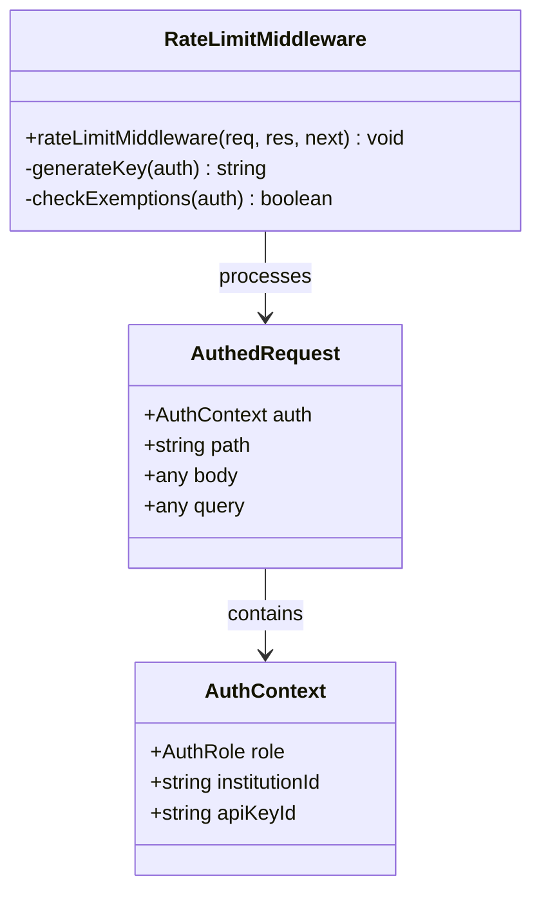

# Rate Limiting Middleware

<cite>
**Referenced Files in This Document**
- [rateLimit.ts](file://src/middleware/rateLimit.ts)
- [auth.ts](file://src/middleware/auth.ts)
- [config.ts](file://src/config.ts)
- [server.ts](file://src/server.ts)
- [memoryStore.ts](file://src/store/memoryStore.ts)
- [apiKeyStore.ts](file://src/infra/apiKeyStore.ts)
- [types.ts](file://src/domain/types.ts)
</cite>

## Table of Contents
1. [Introduction](#introduction)
2. [Architecture Overview](#architecture-overview)
3. [Implementation Details](#implementation-details)
4. [Configuration Options](#configuration-options)
5. [Integration with Express](#integration-with-express)
6. [Authentication Integration](#authentication-integration)
7. [Performance Considerations](#performance-considerations)
8. [Common Issues and Solutions](#common-issues-and-solutions)
9. [Production Recommendations](#production-recommendations)
10. [Troubleshooting Guide](#troubleshooting-guide)

## Introduction

The rate limiting middleware in EscrowGrid provides in-memory request throttling based on API keys and IP addresses using a fixed-window counter strategy. This middleware serves as a protective layer against abuse and ensures fair resource allocation among clients while maintaining optimal system performance.

The implementation follows a simple yet effective approach using JavaScript's built-in Map data structure to track request counts within configurable time windows. The middleware integrates seamlessly with the existing authentication system and provides configurable bypass mechanisms for trusted users and system endpoints.

## Architecture Overview

The rate limiting system consists of several interconnected components that work together to provide comprehensive request throttling:



**Diagram sources**
- [server.ts](file://src/server.ts#L19-L25)
- [rateLimit.ts](file://src/middleware/rateLimit.ts#L1-L67)
- [auth.ts](file://src/middleware/auth.ts#L1-L95)

## Implementation Details

### Fixed-Window Counter Strategy

The rate limiting implementation uses a fixed-window counter approach where each client maintains a counter that resets at the beginning of each time window. The system tracks request counts using a Map structure with composite keys derived from authentication contexts.



**Diagram sources**
- [rateLimit.ts](file://src/middleware/rateLimit.ts#L5-L8)
- [rateLimit.ts](file://src/middleware/rateLimit.ts#L12-L64)
- [config.ts](file://src/config.ts#L12-L14)

### Key Generation Strategy

The middleware generates composite keys for rate limiting using the following hierarchy:

1. **API Key ID**: For authenticated requests with specific API keys
2. **Institution ID**: As fallback for unauthenticated requests or when API key is unavailable
3. **Root Role**: Special exemption for administrative access

The key generation logic prioritizes API key identification when available, falling back to institutional context otherwise.

**Section sources**
- [rateLimit.ts](file://src/middleware/rateLimit.ts#L37-L37)

### Request Processing Flow

The rate limiting middleware follows a structured processing flow:



**Diagram sources**
- [rateLimit.ts](file://src/middleware/rateLimit.ts#L12-L64)

**Section sources**
- [rateLimit.ts](file://src/middleware/rateLimit.ts#L12-L64)

## Configuration Options

The rate limiting system provides comprehensive configuration through environment variables and TypeScript interfaces:

### Core Configuration Parameters

| Parameter | Type | Default | Description |
|-----------|------|---------|-------------|
| `RATE_LIMIT_ENABLED` | boolean | `false` | Global enable/disable flag for rate limiting |
| `RATE_LIMIT_WINDOW_MS` | number | `60000` | Time window duration in milliseconds (default: 1 minute) |
| `RATE_LIMIT_MAX_REQUESTS` | number | `1000` | Maximum requests allowed per window |

### Configuration Implementation

The configuration system uses environment variables with sensible defaults and type-safe validation:



**Diagram sources**
- [config.ts](file://src/config.ts#L3-L16)
- [config.ts](file://src/config.ts#L23-L37)

**Section sources**
- [config.ts](file://src/config.ts#L12-L14)
- [config.ts](file://src/config.ts#L34-L36)

## Integration with Express

The rate limiting middleware integrates seamlessly with Express applications through the standard middleware pattern. The middleware is positioned strategically in the request processing pipeline to balance security and performance.

### Middleware Registration

The middleware is registered in the server initialization phase with careful consideration of the request processing order:



**Diagram sources**
- [server.ts](file://src/server.ts#L19-L25)
- [auth.ts](file://src/middleware/auth.ts#L35-L82)
- [rateLimit.ts](file://src/middleware/rateLimit.ts#L12-L64)

### Endpoint Exclusions

The middleware automatically excludes certain endpoints from rate limiting to ensure system health monitoring and operational functionality:

- `/health` - Health check endpoint
- `/ready` - Readiness check endpoint

**Section sources**
- [rateLimit.ts](file://src/middleware/rateLimit.ts#L18-L22)

## Authentication Integration

The rate limiting middleware integrates deeply with the authentication system to provide context-aware rate limiting based on user roles and API credentials.

### Authentication Context Requirements

The middleware expects authenticated requests through the `AuthedRequest` interface, which extends Express's Request type with an optional `auth` property containing authentication context.

### Role-Based Exemptions

The system provides special exemptions for privileged users:

- **Root Role**: Administrative users receive unlimited rate limits
- **API Keys**: Authenticated users with valid API keys are rate-limited based on their credentials
- **Institution Context**: Unauthenticated requests fall back to institutional rate limiting



**Diagram sources**
- [auth.ts](file://src/middleware/auth.ts#L8-L12)
- [auth.ts](file://src/middleware/auth.ts#L14-L21)
- [rateLimit.ts](file://src/middleware/rateLimit.ts#L37-L40)

**Section sources**
- [auth.ts](file://src/middleware/auth.ts#L8-L21)
- [rateLimit.ts](file://src/middleware/rateLimit.ts#L24-L37)

## Performance Considerations

### Memory Management

The in-memory implementation uses JavaScript's Map data structure for efficient key-value storage. However, this approach has inherent limitations in high-concurrency scenarios:

#### Memory Growth Patterns
- **Linear Growth**: Bucket entries grow linearly with active clients
- **No Automatic Cleanup**: The current implementation lacks automatic expiration mechanisms
- **Memory Pressure**: High concurrent users can lead to significant memory consumption

#### Performance Characteristics
- **O(1) Lookup**: Map operations provide constant-time complexity
- **Garbage Collection**: Memory cleanup depends on JavaScript's garbage collection
- **Concurrent Access**: Single-threaded nature prevents race conditions

### Scalability Limitations

The current implementation has several scalability constraints:

1. **Single Instance**: Rate limiting state is maintained only in memory
2. **No Persistence**: Counter data is lost on application restart
3. **Limited Distribution**: Cannot scale across multiple server instances

**Section sources**
- [rateLimit.ts](file://src/middleware/rateLimit.ts#L9-L10)

## Common Issues and Solutions

### Memory Bloat Under High Concurrency

**Problem**: Large numbers of concurrent clients can cause excessive memory usage.

**Symptoms**:
- Increasing memory consumption over time
- Garbage collection pressure
- Potential out-of-memory errors

**Solutions**:
1. **Implement TTL Mechanisms**: Add automatic cleanup for expired windows
2. **Monitor Memory Usage**: Track bucket size and implement alerts
3. **Consider Distributed Storage**: Migrate to Redis for persistent storage

### Uneven Distribution Across Instances

**Problem**: In clustered environments, rate limiting becomes inconsistent across instances.

**Solution**: Implement distributed rate limiting using Redis or similar systems.

### Bypass Mechanisms for Trusted IPs

**Current Limitation**: The middleware doesn't support IP-based exemptions.

**Potential Enhancement**:
```typescript
// Example enhancement for IP-based exemptions
const trustedIPs = new Set(['127.0.0.1', '::1']);
if (trustedIPs.has(req.ip)) {
  next();
  return;
}
```

**Section sources**
- [rateLimit.ts](file://src/middleware/rateLimit.ts#L18-L22)
- [rateLimit.ts](file://src/middleware/rateLimit.ts#L32-L34)

## Production Recommendations

### Environment-Specific Configuration

#### Development Environment
```typescript
// Development configuration
export const developmentConfig: AppConfig = {
  rateLimitEnabled: false, // Disable for development
  rateLimitWindowMs: 60000,
  rateLimitMaxRequests: 1000,
};
```

#### Production Environment
```typescript
// Production configuration
export const productionConfig: AppConfig = {
  rateLimitEnabled: true,
  rateLimitWindowMs: 60000,
  rateLimitMaxRequests: 1000,
};
```

### Monitoring and Alerting

Implement comprehensive monitoring for rate limiting effectiveness:

1. **Request Rate Tracking**: Monitor actual vs. configured rates
2. **Bypass Detection**: Track when rate limits are skipped
3. **Error Rate Monitoring**: Track 429 responses and their patterns

### Security Considerations

1. **Secure Headers**: Ensure `Retry-After` header is properly set
2. **Logging**: Log rate limit violations for security analysis
3. **Configuration Validation**: Validate rate limit parameters at startup

**Section sources**
- [config.ts](file://src/config.ts#L34-L36)
- [rateLimit.ts](file://src/middleware/rateLimit.ts#L49-L58)

## Troubleshooting Guide

### Common Error Scenarios

#### Rate Limit Exceeded (429)
**Response Format**:
```json
{
  "error": "Rate limit exceeded",
  "details": {
    "windowMs": 60000,
    "maxRequests": 1000
  }
}
```

**Resolution Steps**:
1. Check configuration parameters
2. Verify authentication headers
3. Review request patterns
4. Monitor rate limit logs

#### Authentication Failures
**Causes**:
- Missing or invalid API keys
- Expired tokens
- Revoked API keys

**Debugging**:
1. Verify API key validity through authentication middleware
2. Check API key store for revocation status
3. Validate token extraction logic

#### Configuration Issues
**Common Problems**:
- Incorrect environment variable values
- Type conversion errors
- Missing required configuration

**Validation**:
```typescript
// Configuration validation example
if (config.rateLimitWindowMs <= 0) {
  throw new Error('Rate limit window must be positive');
}
if (config.rateLimitMaxRequests <= 0) {
  throw new Error('Rate limit max requests must be positive');
}
```

**Section sources**
- [rateLimit.ts](file://src/middleware/rateLimit.ts#L49-L58)
- [config.ts](file://src/config.ts#L34-L36)

### Performance Tuning

#### Optimal Window Sizes
- **Short Windows (1-5 minutes)**: Better for real-time protection but higher overhead
- **Long Windows (15-60 minutes)**: Lower overhead but slower response to abuse

#### Request Thresholds
- **Low Thresholds (< 100)**: Suitable for premium services
- **Medium Thresholds (100-1000)**: Balanced approach for most APIs
- **High Thresholds (> 1000)**: For public APIs or development environments

### Integration Testing

#### Test Scenarios
1. **Normal Operation**: Verify rate limits work under normal load
2. **Exceeding Limits**: Test 429 responses when limits are exceeded
3. **Authentication**: Verify API key-based rate limiting
4. **Root Exemption**: Confirm root users are not rate-limited
5. **Endpoint Exclusions**: Verify health endpoints are exempt

#### Mock Testing Setup
```typescript
// Example test setup
describe('Rate Limiting Middleware', () => {
  it('should allow requests within limits', async () => {
    // Test implementation
  });
  
  it('should block requests exceeding limits', async () => {
    // Test implementation
  });
});
```

**Section sources**
- [rateLimit.ts](file://src/middleware/rateLimit.ts#L12-L64)
- [auth.ts](file://src/middleware/auth.ts#L35-L82)