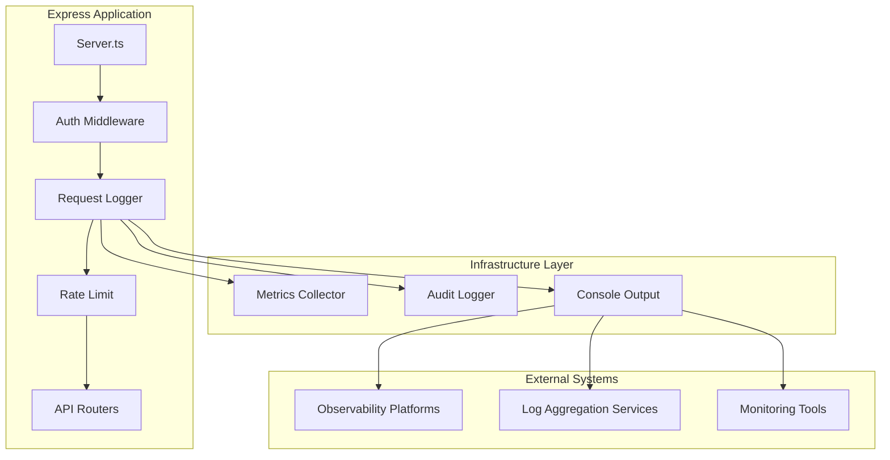
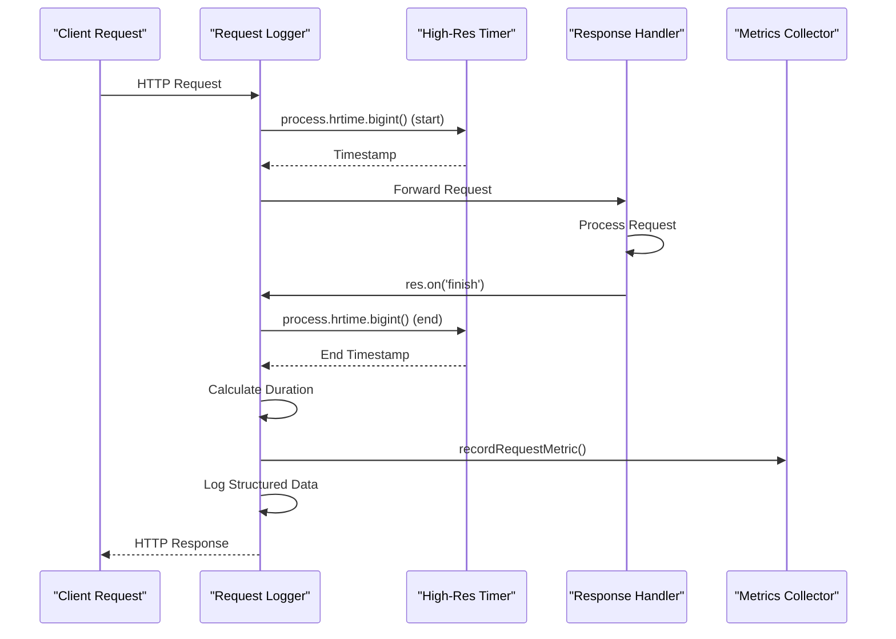
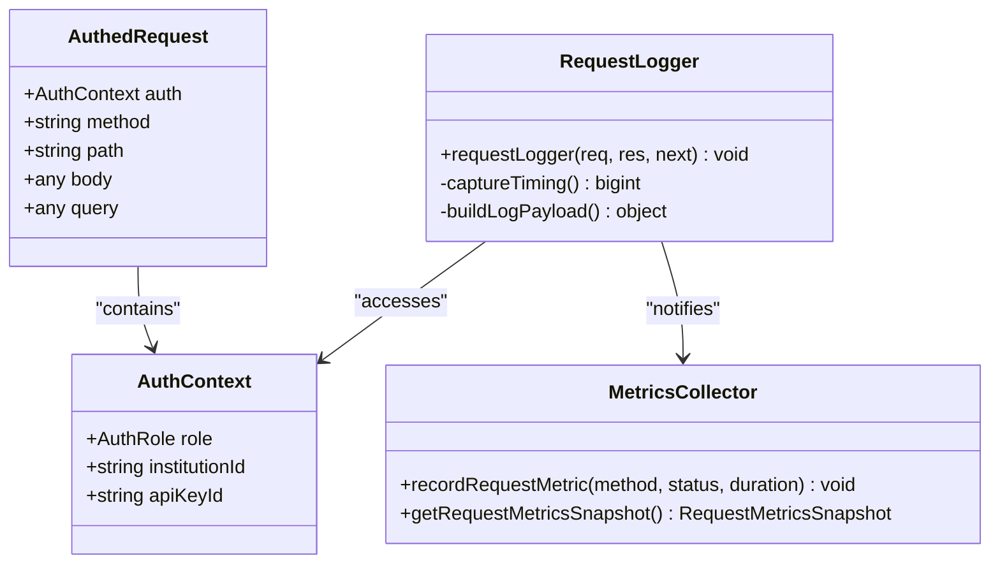
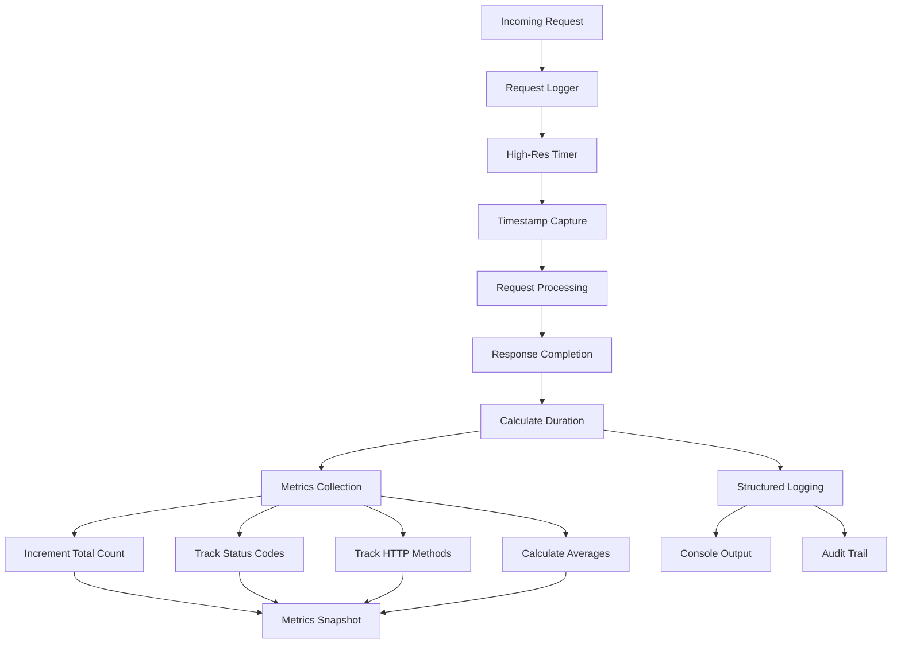
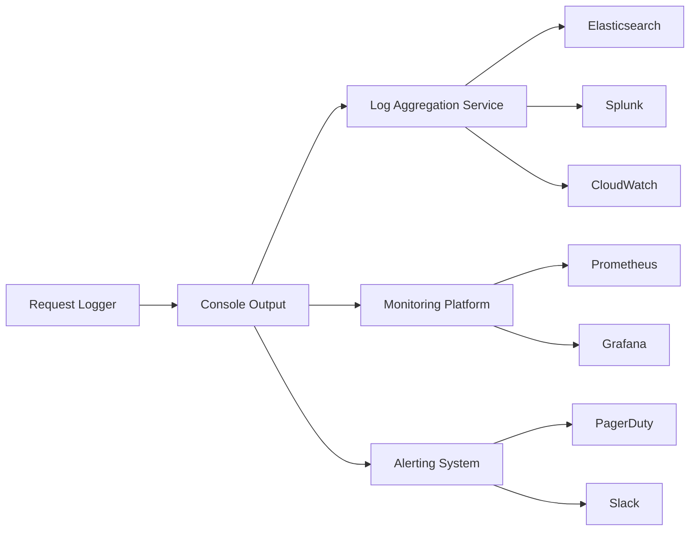

# Request Logging Middleware

<cite>
**Referenced Files in This Document**
- [requestLogger.ts](file://src/middleware/requestLogger.ts)
- [auth.ts](file://src/middleware/auth.ts)
- [server.ts](file://src/server.ts)
- [metrics.ts](file://src/infra/metrics.ts)
- [auditLogger.ts](file://src/infra/auditLogger.ts)
- [rateLimit.ts](file://src/middleware/rateLimit.ts)
- [config.ts](file://src/config.ts)
- [apiKeys.ts](file://src/api/apiKeys.ts)
- [audit.ts](file://src/domain/audit.ts)
</cite>

## Table of Contents
1. [Introduction](#introduction)
2. [Architecture Overview](#architecture-overview)
3. [Core Implementation](#core-implementation)
4. [Middleware Integration](#middleware-integration)
5. [Performance Monitoring](#performance-monitoring)
6. [Logging Format and Structure](#logging-format-and-structure)
7. [Security and Privacy Considerations](#security-and-privacy-considerations)
8. [Integration with External Systems](#integration-with-external-systems)
9. [Common Issues and Solutions](#common-issues-and-solutions)
10. [Best Practices](#best-practices)
11. [Troubleshooting Guide](#troubleshooting-guide)
12. [Conclusion](#conclusion)

## Introduction

The request logging middleware in EscrowGrid serves as a critical component for observability, security auditing, and performance monitoring. This middleware captures comprehensive metadata about HTTP requests, including method, path, status code, duration, API key ID, and institution ID, enabling robust audit trails and debugging capabilities.

The middleware leverages Node.js's high-resolution timing capabilities through `process.hrtime.bigint()` for precise duration measurements and utilizes Express.js's event-driven architecture with the `res.on('finish')` event to ensure logging occurs after response completion. This design ensures that all logged data accurately reflects the final state of each request.

## Architecture Overview

The request logging middleware operates within a layered architecture that integrates seamlessly with EscrowGrid's authentication and rate limiting systems. The middleware follows Express.js middleware conventions while providing dual functionality for audit logging and performance monitoring.

**Diagram sources**
- [server.ts](file://src/server.ts#L19-L24)
- [requestLogger.ts](file://src/middleware/requestLogger.ts#L5-L27)
- [auth.ts](file://src/middleware/auth.ts#L35-L81)

**Section sources**
- [server.ts](file://src/server.ts#L19-L24)
- [requestLogger.ts](file://src/middleware/requestLogger.ts#L1-L29)

## Core Implementation

### High-Resolution Timing with process.hrtime.bigint()

The middleware employs Node.js's high-resolution timer through `process.hrtime.bigint()` to capture precise request durations. This approach provides nanosecond-level precision, essential for accurate performance monitoring and debugging.

**Diagram sources**
- [requestLogger.ts](file://src/middleware/requestLogger.ts#L6-L23)

### Event-Driven Logging Architecture

The middleware utilizes the `res.on('finish')` event to ensure logging occurs after the response has been fully sent to the client. This approach guarantees that all response data, including status codes and headers, are accurately captured.

The logging mechanism operates asynchronously relative to the request processing pipeline, preventing any impact on request performance while ensuring comprehensive data capture.

**Section sources**
- [requestLogger.ts](file://src/middleware/requestLogger.ts#L5-L27)

## Middleware Integration

### Authentication Context Access

The request logger middleware integrates closely with the authentication middleware to access contextual information about the authenticated user or API key. This integration enables correlation of requests with specific API keys and institutions.

**Diagram sources**
- [auth.ts](file://src/middleware/auth.ts#L14-L21)
- [requestLogger.ts](file://src/middleware/requestLogger.ts#L12-L21)

### Middleware Chain Execution

The middleware chain in EscrowGrid follows a specific order that optimizes both security and performance:

1. **Authentication Middleware**: Validates API keys and establishes authentication context
2. **Request Logger**: Captures request metadata and performance metrics
3. **Rate Limiting**: Enforces request rate limits based on authentication context

This ordering ensures that authentication information is available for logging while maintaining security controls before performance monitoring.

**Section sources**
- [server.ts](file://src/server.ts#L21-L24)
- [auth.ts](file://src/middleware/auth.ts#L35-L81)
- [requestLogger.ts](file://src/middleware/requestLogger.ts#L5-L27)

## Performance Monitoring

### Metrics Collection Architecture

The request logger middleware integrates with a centralized metrics collection system that tracks various performance indicators:

**Diagram sources**
- [metrics.ts](file://src/infra/metrics.ts#L17-L26)
- [requestLogger.ts](file://src/middleware/requestLogger.ts#L22-L23)

### Performance Impact Analysis

The middleware is designed to minimize performance overhead through several optimization strategies:

- **Asynchronous Logging**: Console output occurs after response completion
- **Minimal Memory Allocation**: Structured logging uses efficient JSON serialization
- **Selective Metrics**: Only essential metrics are collected and stored
- **Non-blocking Operations**: All logging operations are non-blocking

**Section sources**
- [metrics.ts](file://src/infra/metrics.ts#L1-L39)
- [requestLogger.ts](file://src/middleware/requestLogger.ts#L22-L23)

## Logging Format and Structure

### Structured JSON Format

The middleware produces structured JSON logs that follow a consistent format for easy parsing and analysis:

| Field | Type | Description | Example |
|-------|------|-------------|---------|
| type | string | Log type identifier | "request" |
| method | string | HTTP method | "GET", "POST", "PUT", "DELETE" |
| path | string | Request URL path | "/api/v1/users" |
| status | number | HTTP status code | 200, 404, 500 |
| durationMs | number | Request duration in milliseconds | 123.456 |
| apiKeyId | string \| null | Associated API key ID | "key_12345" |
| institutionId | string \| null | Associated institution ID | "inst_67890" |

### Log Payload Construction

The middleware constructs log payloads by extracting relevant information from the request and response objects, ensuring comprehensive coverage of request metadata while maintaining security and privacy standards.

**Section sources**
- [requestLogger.ts](file://src/middleware/requestLogger.ts#L13-L21)

## Security and Privacy Considerations

### PII Leakage Prevention

The middleware implements several safeguards to prevent personally identifiable information (PII) leakage in logs:

- **Selective Data Exposure**: Only essential metadata is logged
- **Null Handling**: Missing authentication context is represented as null values
- **No Request Body Logging**: Sensitive request data is not included in logs
- **Status Code Filtering**: Only final status codes are logged

### Authentication Context Protection

The middleware safely accesses authentication context while respecting security boundaries:

- **Optional Authentication**: Handles unauthenticated requests gracefully
- **Context Validation**: Validates authentication context before logging
- **Secure Defaults**: Uses null values for missing or invalid context

**Section sources**
- [requestLogger.ts](file://src/middleware/requestLogger.ts#L18-L21)
- [auth.ts](file://src/middleware/auth.ts#L14-L21)

## Integration with External Systems

### Console Output Integration

The middleware integrates with external observability systems through structured console output:

**Diagram sources**
- [requestLogger.ts](file://src/middleware/requestLogger.ts#L22)
- [auditLogger.ts](file://src/infra/auditLogger.ts#L38-L43)

### Audit Trail Integration

The middleware complements the audit logging system by providing request-level visibility that enhances security monitoring and compliance reporting.

**Section sources**
- [requestLogger.ts](file://src/middleware/requestLogger.ts#L22)
- [auditLogger.ts](file://src/infra/auditLogger.ts#L38-L43)

## Common Issues and Solutions

### Log Volume Management

**Issue**: High-volume applications generate excessive log data, impacting storage and performance.

**Solution**: Implement log sampling or filtering mechanisms:
- Use environment-based log levels
- Implement request filtering for specific endpoints
- Configure log rotation and archival policies

### Performance Overhead

**Issue**: Synchronous console logging may impact application performance under high load.

**Solution**: Consider asynchronous logging approaches:
- Use worker threads for log processing
- Implement log buffering and batch processing
- Configure appropriate log levels for production environments

### Authentication Context Availability

**Issue**: Missing authentication context leads to incomplete log entries.

**Solution**: Implement graceful degradation:
- Log requests with minimal context when authentication fails
- Use fallback identifiers for anonymous requests
- Monitor authentication failures separately

**Section sources**
- [requestLogger.ts](file://src/middleware/requestLogger.ts#L18-L21)
- [auth.ts](file://src/middleware/auth.ts#L52-L81)

## Best Practices

### Log Aggregation and Retention

1. **Centralized Logging**: Route all application logs to a centralized log aggregation system
2. **Structured Format**: Maintain consistent JSON structure across all log entries
3. **Retention Policies**: Implement appropriate retention policies based on compliance requirements
4. **Indexing Strategy**: Index log fields for efficient querying and analysis

### Observability Platform Integration

1. **Metrics Export**: Export metrics to monitoring platforms for dashboard creation
2. **Alert Configuration**: Set up alerts based on request patterns and error rates
3. **Correlation**: Correlate request logs with other system metrics for comprehensive monitoring
4. **Performance Baselines**: Establish performance baselines for request duration monitoring

### Security and Compliance

1. **Access Control**: Restrict access to log data based on role-based permissions
2. **Encryption**: Encrypt log data both in transit and at rest
3. **Audit Trails**: Maintain comprehensive audit trails for security investigations
4. **Compliance Monitoring**: Monitor for compliance violations and generate reports

## Troubleshooting Guide

### Common Logging Issues

**Problem**: Logs not appearing in expected locations

**Diagnosis Steps**:
1. Verify middleware registration order in server.ts
2. Check NODE_ENV and log level configurations
3. Review console output redirection settings
4. Validate authentication middleware execution

**Problem**: Incomplete or missing request metadata

**Diagnosis Steps**:
1. Verify authentication context availability
2. Check request routing and middleware execution
3. Review error handling in request processing
4. Validate response completion events

**Problem**: Performance degradation with logging enabled

**Diagnosis Steps**:
1. Profile application performance with and without logging
2. Monitor CPU and memory usage during high-load scenarios
3. Review log volume and frequency
4. Consider asynchronous logging alternatives

**Section sources**
- [server.ts](file://src/server.ts#L21-L24)
- [requestLogger.ts](file://src/middleware/requestLogger.ts#L5-L27)

## Conclusion

The request logging middleware in EscrowGrid provides a robust foundation for observability, security auditing, and performance monitoring. Its integration with authentication systems, support for high-resolution timing, and structured logging format make it an essential component for production deployments.

The middleware's design prioritizes both functionality and performance, ensuring that comprehensive logging capabilities do not negatively impact application performance. Through careful consideration of security, privacy, and operational requirements, the middleware supports the platform's goals of reliability, security, and maintainability.

Future enhancements could include configurable log levels, sampling mechanisms for high-volume environments, and integration with distributed tracing systems for enhanced observability across microservice architectures.