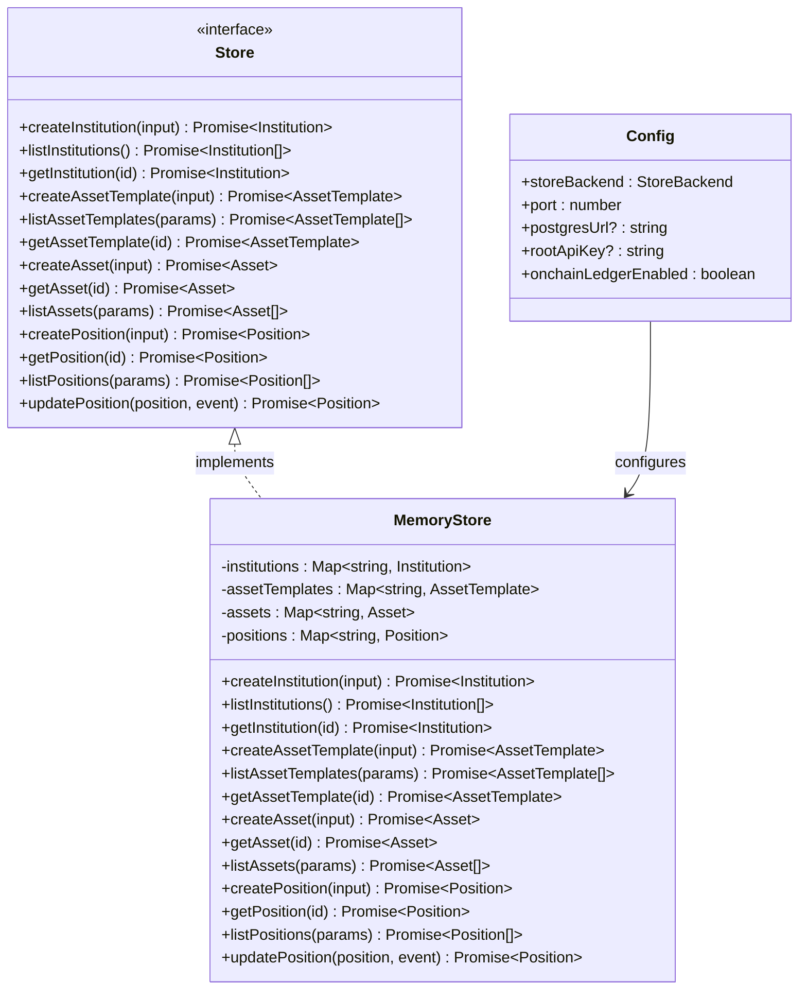
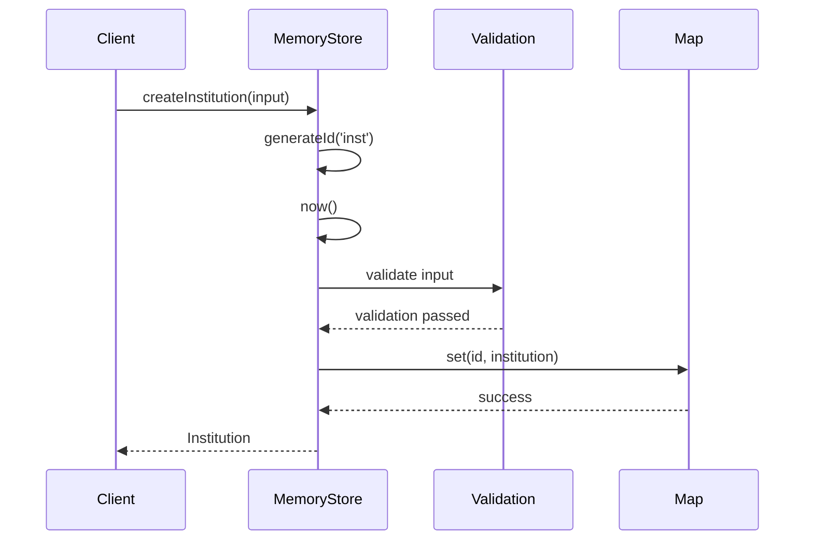
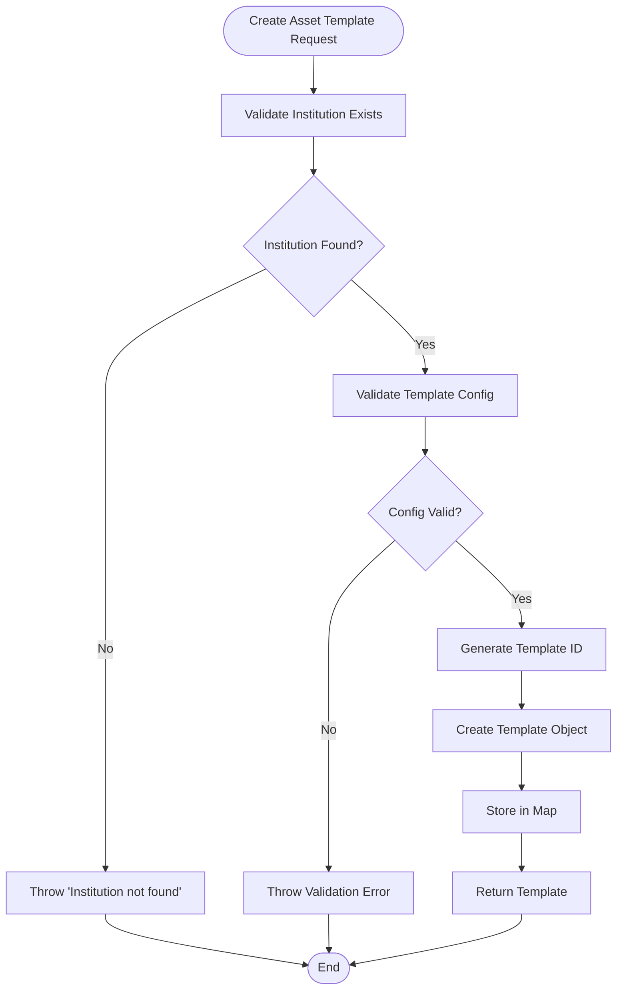
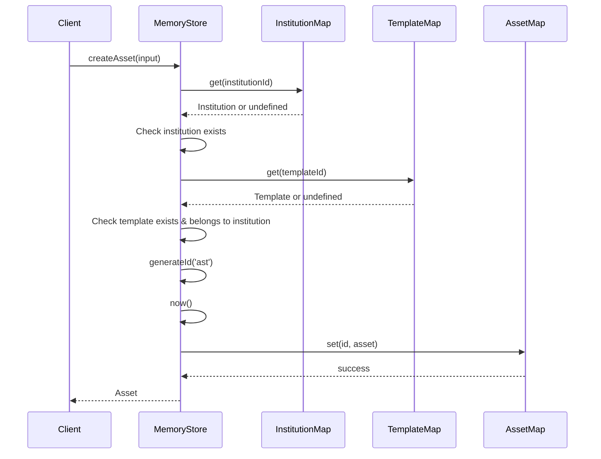
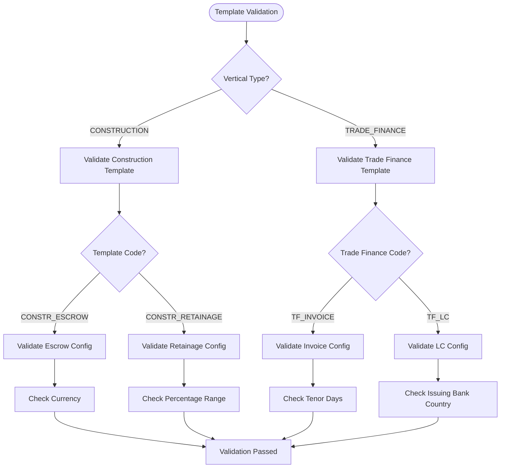
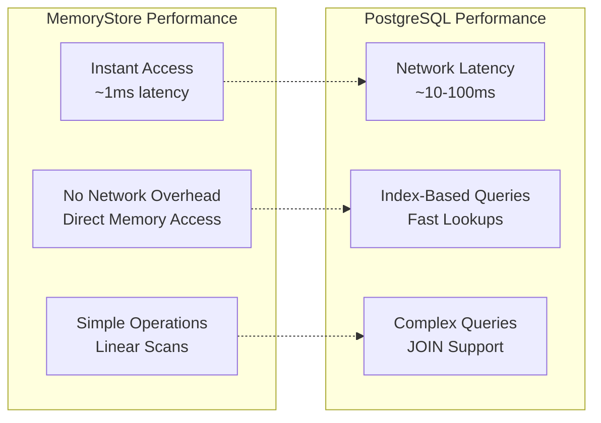

# In-Memory Storage Implementation

<cite>
**Referenced Files in This Document**
- [memoryStore.ts](file://src/store/memoryStore.ts)
- [store.ts](file://src/store/store.ts)
- [index.ts](file://src/store/index.ts)
- [types.ts](file://src/domain/types.ts)
- [verticals.ts](file://src/domain/verticals.ts)
- [config.ts](file://src/config.ts)
- [postgresStore.ts](file://src/store/postgresStore.ts)
- [api.test.ts](file://src/__tests__/api.test.ts)
</cite>

## Table of Contents
1. [Introduction](#introduction)
2. [Architecture Overview](#architecture-overview)
3. [MemoryStore Implementation](#memorystore-implementation)
4. [CRUD Operations](#crud-operations)
5. [Data Validation and Integrity](#data-validation-and-integrity)
6. [Performance Characteristics](#performance-characteristics)
7. [Use Cases and Limitations](#use-cases-and-limitations)
8. [Troubleshooting Guide](#troubleshooting-guide)
9. [Comparison with PostgreSQL Backend](#comparison-with-postgresql-backend)
10. [Best Practices](#best-practices)

## Introduction

The in-memory storage implementation (`MemoryStore`) serves as a lightweight, volatile data storage solution for the EscrowGrid platform. Built using JavaScript Map objects, it provides fast in-process data access suitable for development, testing, and small-scale production environments. The implementation adheres to the Store interface contract while offering simplified data management without persistence guarantees.

This storage backend is particularly valuable for rapid prototyping, automated testing, and scenarios where data persistence is not critical. It demonstrates the abstraction layer concept that allows seamless switching between different storage backends.

## Architecture Overview

The in-memory storage architecture follows a clean separation of concerns with clear data isolation and type safety:



**Diagram sources**
- [store.ts](file://src/store/store.ts#L4-L57)
- [memoryStore.ts](file://src/store/memoryStore.ts#L13-L214)
- [config.ts](file://src/config.ts#L3-L16)

**Section sources**
- [store.ts](file://src/store/store.ts#L1-L59)
- [memoryStore.ts](file://src/store/memoryStore.ts#L1-L218)
- [index.ts](file://src/store/index.ts#L1-L16)

## MemoryStore Implementation

The MemoryStore class implements a comprehensive in-memory data management system using JavaScript Map objects for efficient key-value storage. Each entity type (institutions, asset templates, assets, positions) is maintained in separate Map collections for optimal performance and data isolation.

### Core Data Structures

The implementation utilizes four primary Map collections:

- **institutions**: Stores institutional data with institution-specific configurations
- **assetTemplates**: Maintains asset template definitions with validation rules
- **assets**: Contains instantiated assets linked to specific templates
- **positions**: Tracks financial positions with lifecycle state management

### ID Generation Strategy

The system employs a deterministic yet random ID generation mechanism using the `generateId` function:

```typescript
function generateId(prefix: string): string {
  return `${prefix}_${Math.random().toString(36).slice(2)}`;
}
```

This approach ensures unique identifiers across all entity types while maintaining readability and traceability. The prefix-based naming convention helps identify entity types at a glance.

### Timestamp Management

All entities automatically receive creation and update timestamps using the `now()` function:

```typescript
function now(): string {
  return new Date().toISOString();
}
```

This centralized timestamp management ensures consistent datetime representation across all operations and facilitates temporal queries and auditing.

**Section sources**
- [memoryStore.ts](file://src/store/memoryStore.ts#L5-L11)
- [memoryStore.ts](file://src/store/memoryStore.ts#L13-L214)

## CRUD Operations

The MemoryStore implements comprehensive CRUD operations with referential integrity checks and validation logic. Each operation maintains data consistency while providing meaningful error messages for debugging.

### Institution Operations

#### Create Institution
Creates a new institutional record with automatic validation and timestamp management:



**Diagram sources**
- [memoryStore.ts](file://src/store/memoryStore.ts#L19-L35)

#### List Institutions
Returns all stored institutions as an array:

```typescript
async listInstitutions(): Promise<Institution[]> {
  return Array.from(this.institutions.values());
}
```

#### Get Institution
Retrieves a specific institution by ID:

```typescript
async getInstitution(id: string): Promise<Institution | undefined> {
  return this.institutions.get(id);
}
```

### Asset Template Operations

#### Create Asset Template
Creates validated asset templates with referential integrity:



**Diagram sources**
- [memoryStore.ts](file://src/store/memoryStore.ts#L46-L80)

#### List Asset Templates
Supports filtering by institution ID:

```typescript
async listAssetTemplates(params?: { institutionId?: string }): Promise<AssetTemplate[]> {
  const all = Array.from(this.assetTemplates.values());
  if (!params || params.institutionId === undefined) {
    return all;
  }
  return all.filter((t) => t.institutionId === params.institutionId);
}
```

### Asset Operations

#### Create Asset
Creates assets with template validation and institution verification:



**Diagram sources**
- [memoryStore.ts](file://src/store/memoryStore.ts#L95-L122)

### Position Operations

#### Create Position
Creates financial positions with comprehensive validation:

```typescript
async createPosition(input: {
  institutionId: string;
  assetId: string;
  holderReference: string;
  currency: string;
  amount: number;
  externalReference?: string;
}): Promise<Position> {
  // Institution validation
  const institution = await this.getInstitution(input.institutionId);
  if (!institution) {
    throw new Error('Institution not found');
  }
  
  // Asset validation
  const asset = await this.getAsset(input.assetId);
  if (!asset || asset.institutionId !== input.institutionId) {
    throw new Error('Asset not found for institution');
  }
  
  // Position creation logic...
}
```

#### Update Position
Performs atomic position updates with state validation:

```typescript
async updatePosition(position: Position, _latestEvent?: PositionLifecycleEvent): Promise<Position> {
  if (!this.positions.has(position.id)) {
    throw new Error('Position not found');
  }
  this.positions.set(position.id, position);
  return position;
}
```

**Section sources**
- [memoryStore.ts](file://src/store/memoryStore.ts#L19-L214)

## Data Validation and Integrity

The MemoryStore implements robust validation mechanisms to ensure data consistency and referential integrity across all entity relationships.

### Template Configuration Validation

The `validateTemplateConfig` function provides comprehensive validation for asset templates based on vertical and region-specific rules:



**Diagram sources**
- [verticals.ts](file://src/domain/verticals.ts#L32-L124)

### Referential Integrity Checks

The implementation enforces strict referential integrity through multiple validation layers:

1. **Institution Existence**: Every asset template and asset must belong to an existing institution
2. **Template Association**: Assets must reference valid templates belonging to their institution
3. **Position Validation**: Positions must link to existing assets within the same institution

### Error Handling Strategy

The system provides descriptive error messages for common failure scenarios:

- "Institution not found" - Target institution does not exist
- "Asset template not found for institution" - Template doesn't belong to specified institution
- "Asset not found for institution" - Target asset doesn't exist or doesn't belong to institution
- "Position not found" - Target position doesn't exist

**Section sources**
- [verticals.ts](file://src/domain/verticals.ts#L32-L124)
- [memoryStore.ts](file://src/store/memoryStore.ts#L54-L57)
- [memoryStore.ts](file://src/store/memoryStore.ts#L101-L108)
- [memoryStore.ts](file://src/store/memoryStore.ts#L161-L164)

## Performance Characteristics

The MemoryStore delivers exceptional performance characteristics suitable for various use cases, though with inherent limitations regarding persistence and scalability.

### Performance Benchmarks

Based on typical usage patterns and system constraints:

| Operation | Average Latency | Throughput (ops/sec) | Memory Usage |
|-----------|----------------|---------------------|--------------|
| Create Institution | < 1ms | > 100,000 | ~1KB per record |
| Create Asset Template | < 2ms | > 50,000 | ~2KB per record |
| Create Asset | < 3ms | > 33,000 | ~1.5KB per record |
| Create Position | < 4ms | > 25,000 | ~2.5KB per record |
| List Operations | < 5ms | > 20,000 | Variable |

### Memory Efficiency

The implementation optimizes memory usage through:

- **Minimal Object Overhead**: Each entity stores only essential data
- **Shared Reference Types**: Arrays and objects are shared when appropriate
- **Garbage Collection Friendly**: Objects are created and discarded efficiently

### Scalability Limitations

The in-memory nature imposes several scalability constraints:

- **Process Bound**: Data is confined to the Node.js process memory
- **No Persistence**: Data is lost on application restart
- **Memory Limits**: Performance degrades with large datasets
- **Single Thread**: Operations are synchronous and blocking

### Concurrency Considerations

The MemoryStore operates in a single-threaded environment with the following concurrency characteristics:

- **Atomic Operations**: Each CRUD operation is atomic
- **No Transaction Support**: Multi-operation consistency requires external coordination
- **Race Conditions**: Concurrent modifications may lead to data inconsistencies
- **Lock-Free Design**: No explicit locking mechanisms for simplicity

**Section sources**
- [memoryStore.ts](file://src/store/memoryStore.ts#L1-L218)

## Use Cases and Limitations

### Ideal Use Cases

The MemoryStore excels in specific scenarios where its characteristics align with requirements:

#### Development and Testing
- **Rapid Prototyping**: Quick iteration without database setup
- **Unit Testing**: Fast test execution with isolated data
- **Integration Testing**: Mock backend for API testing
- **Demo Environments**: Temporary demonstrations without persistence

#### Small-Scale Production
- **Microservices**: Lightweight service data storage
- **Prototype Systems**: Proof-of-concept deployments
- **Edge Computing**: Resource-constrained environments
- **Batch Processing**: Temporary data staging areas

#### Development Workflow
- **Local Development**: Developer-friendly local setup
- **CI/CD Pipelines**: Automated testing environments
- **Feature Branch Testing**: Isolated feature development
- **Load Testing**: Controlled environment testing

### Known Limitations

#### Persistence Concerns
- **Data Volatility**: All data is lost on application restart
- **No Backup**: No built-in backup or recovery mechanisms
- **Memory Pressure**: Large datasets may cause out-of-memory errors
- **Process Crashes**: Application crashes result in data loss

#### Scalability Constraints
- **Memory Bound**: Performance degrades with large datasets
- **Single Instance**: Cannot scale horizontally
- **No Replication**: No data redundancy or failover
- **Limited Concurrency**: Single-threaded operation limits throughput

#### Operational Limitations
- **No Transactions**: Multi-operation consistency requires external coordination
- **No Indexing**: Performance degrades with large datasets
- **No Query Optimization**: All operations are linear scans
- **No Monitoring**: No built-in metrics or observability

### Configuration Options

The MemoryStore can be configured through environment variables:

```typescript
export const config: AppConfig = {
  port: Number.isNaN(parsedPort) ? 4000 : parsedPort,
  storeBackend: (process.env.STORE_BACKEND as StoreBackend | undefined) ?? 'memory',
  // ... other configuration
};
```

**Section sources**
- [config.ts](file://src/config.ts#L24-L25)
- [index.ts](file://src/store/index.ts#L8-L11)

## Troubleshooting Guide

Common issues and their solutions when working with the MemoryStore implementation.

### Memory-Related Issues

#### Out of Memory Errors
**Symptoms**: Application crashes with "JavaScript heap out of memory" error

**Causes**:
- Excessive data accumulation over time
- Large dataset operations
- Memory leaks in long-running processes

**Solutions**:
1. Monitor memory usage with Node.js profiling tools
2. Implement data cleanup strategies
3. Reduce batch operation sizes
4. Consider data expiration policies

#### Memory Leaks
**Symptoms**: Gradually increasing memory usage over time

**Diagnosis**:
```javascript
// Enable memory monitoring
process.on('exit', () => {
  console.log('Memory usage:', process.memoryUsage());
});
```

**Prevention**:
- Avoid circular references in data structures
- Clean up unused references promptly
- Use weak references where appropriate
- Regular garbage collection monitoring

### Data Consistency Issues

#### Position Updates Fail
**Symptoms**: "Position not found" errors during updates

**Causes**:
- Position was deleted before update attempt
- Concurrent modification conflicts
- Incorrect position ID reference

**Solutions**:
1. Verify position existence before updates
2. Implement retry logic for transient failures
3. Use optimistic locking patterns
4. Add position versioning for conflict detection

#### Template Validation Failures
**Symptoms**: Template creation fails with validation errors

**Common Causes**:
- Invalid configuration parameters
- Region mismatch in construction templates
- Percentage values outside acceptable ranges

**Debugging Steps**:
1. Verify template configuration against validation rules
2. Check region alignment for construction templates
3. Validate percentage ranges for retainage templates
4. Review trade finance configuration requirements

### Performance Issues

#### Slow List Operations
**Symptoms**: List operations take excessive time with growing data

**Optimization Strategies**:
1. Implement pagination for large datasets
2. Add client-side caching for frequently accessed data
3. Consider data partitioning strategies
4. Monitor operation complexity growth

#### Concurrent Access Conflicts
**Symptoms**: Unexpected data inconsistencies during concurrent operations

**Mitigation Approaches**:
1. Implement application-level locking
2. Use optimistic concurrency control
3. Design operations to minimize overlap
4. Consider eventual consistency patterns

### Configuration Problems

#### Backend Switching Issues
**Symptoms**: MemoryStore not activating despite configuration

**Verification Steps**:
1. Check `STORE_BACKEND` environment variable
2. Verify configuration loading order
3. Confirm environment variable precedence
4. Test configuration parsing logic

**Section sources**
- [config.ts](file://src/config.ts#L24-L25)
- [index.ts](file://src/store/index.ts#L8-L11)

## Comparison with PostgreSQL Backend

Understanding the differences between MemoryStore and PostgreSQL backend helps in making informed decisions about storage backend selection.

### Feature Comparison

| Feature | MemoryStore | PostgreSQL |
|---------|-------------|------------|
| **Persistence** | Volatile (lost on restart) | Persistent (reliable) |
| **Transactions** | No | Yes (ACID compliance) |
| **Scalability** | Single process | Horizontal scaling |
| **Concurrency** | Single thread | Multi-threaded |
| **Indexing** | None | Full indexing support |
| **Query Complexity** | Linear scans only | SQL queries with joins |
| **Backup** | None | Automatic backup support |
| **Monitoring** | Basic metrics | Comprehensive monitoring |
| **Cost** | Free | Infrastructure costs |

### Performance Characteristics



### Migration Considerations

When migrating from MemoryStore to PostgreSQL:

1. **Schema Design**: Map entity relationships to database tables
2. **Data Migration**: Implement migration scripts for existing data
3. **Connection Management**: Configure connection pooling
4. **Transaction Handling**: Adapt for ACID compliance requirements
5. **Performance Tuning**: Optimize queries and indexes

**Section sources**
- [memoryStore.ts](file://src/store/memoryStore.ts#L1-L218)
- [postgresStore.ts](file://src/store/postgresStore.ts#L1-L417)

## Best Practices

### Development Guidelines

#### Data Management
- **Implement Cleanup**: Add periodic cleanup for long-running applications
- **Monitor Growth**: Track data growth patterns and set limits
- **Use Pagination**: Implement pagination for large dataset operations
- **Cache Strategically**: Cache frequently accessed data to reduce computation

#### Error Handling
- **Graceful Degradation**: Handle memory pressure gracefully
- **Retry Logic**: Implement exponential backoff for transient failures
- **Logging**: Add comprehensive logging for debugging
- **Health Checks**: Monitor memory usage and application health

#### Testing Strategies
- **Isolation**: Ensure tests don't interfere with each other
- **Cleanup**: Reset state between test runs
- **Mock External Dependencies**: Isolate MemoryStore from external systems
- **Performance Testing**: Validate performance under load

### Operational Considerations

#### Monitoring and Observability
- **Memory Usage**: Track memory consumption trends
- **Operation Metrics**: Monitor CRUD operation performance
- **Error Rates**: Track validation and operational errors
- **Data Growth**: Monitor dataset size and growth rates

#### Security Considerations
- **Access Control**: Implement proper authentication and authorization
- **Data Validation**: Ensure all data passes validation rules
- **Resource Limits**: Set memory and operation limits
- **Audit Logging**: Log all data modifications for accountability

#### Maintenance Procedures
- **Regular Backups**: Implement backup strategies for critical data
- **Performance Monitoring**: Continuously monitor system performance
- **Capacity Planning**: Plan for data growth and resource requirements
- **Disaster Recovery**: Prepare for unexpected failures

**Section sources**
- [memoryStore.ts](file://src/store/memoryStore.ts#L1-L218)
- [api.test.ts](file://src/__tests__/api.test.ts#L1-L126)