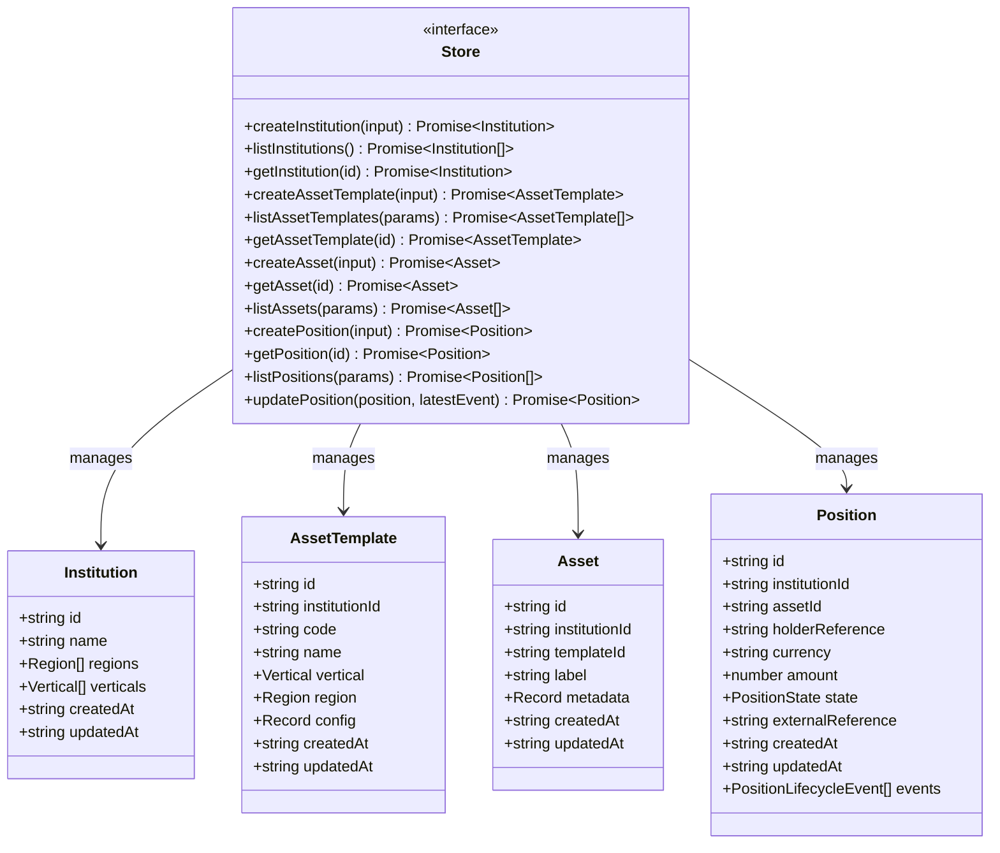
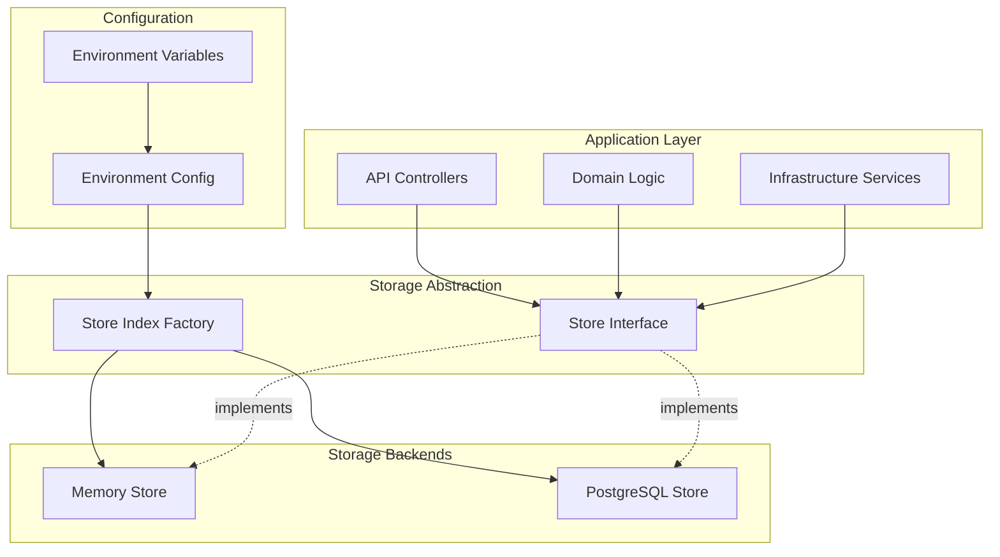
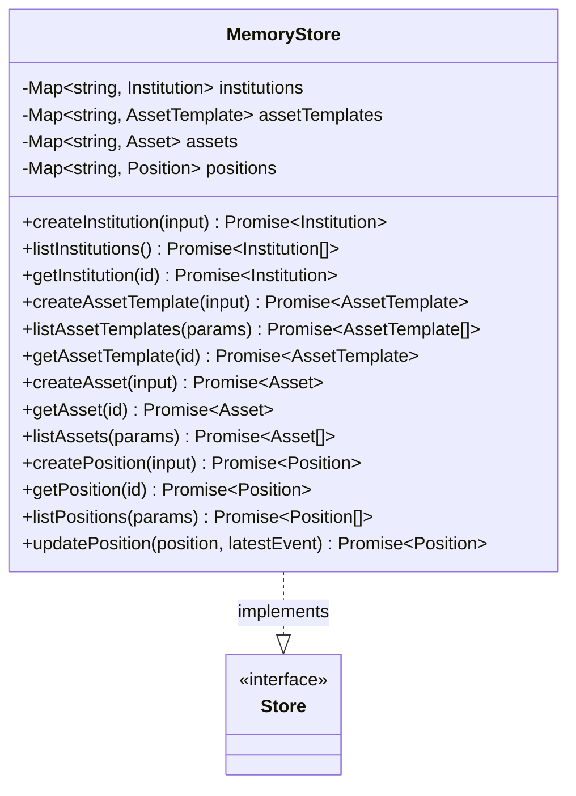
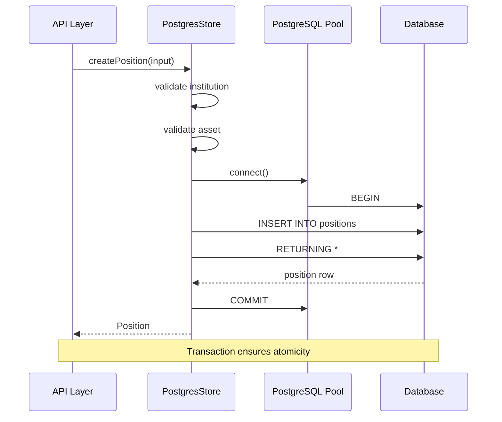
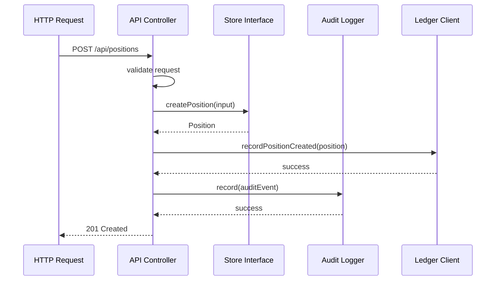
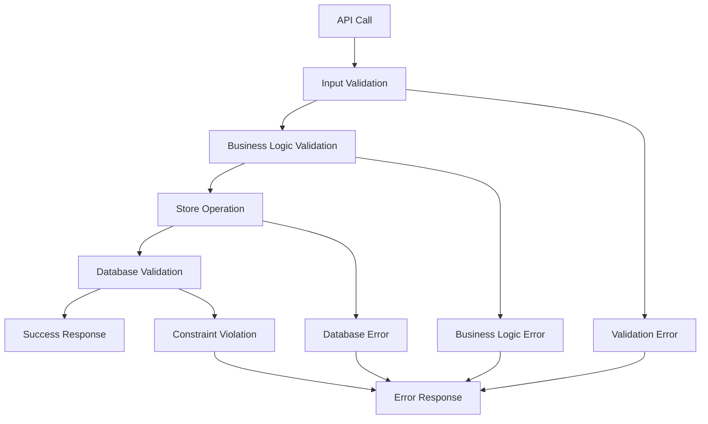

# Storage Interface Abstraction

<cite>
**Referenced Files in This Document**
- [src/store/store.ts](file://src/store/store.ts)
- [src/store/index.ts](file://src/store/index.ts)
- [src/store/memoryStore.ts](file://src/store/memoryStore.ts)
- [src/store/postgresStore.ts](file://src/store/postgresStore.ts)
- [src/domain/types.ts](file://src/domain/types.ts)
- [src/api/institutions.ts](file://src/api/institutions.ts)
- [src/api/assets.ts](file://src/api/assets.ts)
- [src/api/positions.ts](file://src/api/positions.ts)
- [src/config.ts](file://src/config.ts)
- [src/infra/auditLogger.ts](file://src/infra/auditLogger.ts)
- [src/infra/ledgerClient.ts](file://src/infra/ledgerClient.ts)
- [src/domain/audit.ts](file://src/domain/audit.ts)
</cite>

## Table of Contents
1. [Introduction](#introduction)
2. [Store Interface Definition](#store-interface-definition)
3. [Entity Management Operations](#entity-management-operations)
4. [Implementation Architecture](#implementation-architecture)
5. [TypeScript Interface Benefits](#typescript-interface-benefits)
6. [API Layer Integration](#api-layer-integration)
7. [Error Handling Patterns](#error-handling-patterns)
8. [Extension Points](#extension-points)
9. [Testing and Mocking](#testing-and-mocking)
10. [Performance Considerations](#performance-considerations)
11. [Best Practices](#best-practices)
12. [Conclusion](#conclusion)

## Introduction

The escrowgrid platform implements a sophisticated storage interface abstraction that provides a unified contract for all data persistence operations across the system. This abstraction serves as the foundation for managing institutions, assets, templates, and positions while enabling pluggable storage backends through a clean separation of concerns.

The storage interface abstraction decouples business logic from persistence concerns, allowing the platform to seamlessly switch between different storage implementations (memory vs. PostgreSQL) without affecting the API or domain layers. This design enables flexible deployment scenarios, from development environments using in-memory storage to production systems leveraging robust relational databases.

## Store Interface Definition

The core [`Store`](file://src/store/store.ts#L4-L57) interface defines a comprehensive contract for all data persistence operations in the escrowgrid platform. This interface establishes a standardized API for CRUD operations across four primary entity types: institutions, asset templates, assets, and positions.



**Diagram sources**
- [src/store/store.ts](file://src/store/store.ts#L4-L57)
- [src/domain/types.ts](file://src/domain/types.ts#L7-L84)

**Section sources**
- [src/store/store.ts](file://src/store/store.ts#L1-L59)
- [src/domain/types.ts](file://src/domain/types.ts#L1-L85)

## Entity Management Operations

The Store interface provides comprehensive CRUD operations for each entity type, organized into logical groups that reflect the platform's domain model.

### Institution Management

Institution operations handle the creation and management of organizational entities within the escrowgrid ecosystem:

| Method | Parameters | Return Type | Description |
|--------|------------|-------------|-------------|
| `createInstitution` | `{ name: string, regions: Region[], verticals?: Vertical[] }` | `Promise<Institution>` | Creates a new institution with specified regions and verticals |
| `listInstitutions` | None | `Promise<Institution[]>` | Retrieves all institutions ordered by creation date |
| `getInstitution` | `id: string` | `Promise<Institution \| undefined>` | Fetches a specific institution by ID |

### Asset Template Management

Asset templates define reusable configurations for asset creation:

| Method | Parameters | Return Type | Description |
|--------|------------|-------------|-------------|
| `createAssetTemplate` | `{ institutionId: string, code: string, name: string, vertical: Vertical, region: Region, config: Record<string, unknown> }` | `Promise<AssetTemplate>` | Creates a template with validation against institution context |
| `listAssetTemplates` | `params?: { institutionId?: string }` | `Promise<AssetTemplate[]>` | Lists templates, optionally filtered by institution |
| `getAssetTemplate` | `id: string` | `Promise<AssetTemplate \| undefined>` | Retrieves a specific template by ID |

### Asset Management

Assets represent concrete instances based on templates:

| Method | Parameters | Return Type | Description |
|--------|------------|-------------|-------------|
| `createAsset` | `{ institutionId: string, templateId: string, label: string, metadata?: Record<string, unknown> }` | `Promise<Asset>` | Creates an asset linked to a template and institution |
| `getAsset` | `id: string` | `Promise<Asset \| undefined>` | Fetches a specific asset by ID |
| `listAssets` | `params?: { institutionId?: string; templateId?: string }` | `Promise<Asset[]>` | Lists assets with optional filtering by institution or template |

### Position Management

Positions represent financial instruments with lifecycle tracking:

| Method | Parameters | Return Type | Description |
|--------|------------|-------------|-------------|
| `createPosition` | `{ institutionId: string, assetId: string, holderReference: string, currency: string, amount: number, externalReference?: string }` | `Promise<Position>` | Creates a position with initial state and lifecycle events |
| `getPosition` | `id: string` | `Promise<Position \| undefined>` | Retrieves a position with complete lifecycle history |
| `listPositions` | `params?: { institutionId?: string; assetId?: string; holderReference?: string }` | `Promise<Position[]>` | Lists positions with multiple filter criteria |
| `updatePosition` | `position: Position, latestEvent?: PositionLifecycleEvent` | `Promise<Position>` | Updates position state and appends lifecycle events |

**Section sources**
- [src/store/store.ts](file://src/store/store.ts#L4-L57)

## Implementation Architecture

The storage interface abstraction supports multiple backend implementations through a factory pattern and dependency injection mechanism.



**Diagram sources**
- [src/store/index.ts](file://src/store/index.ts#L1-L16)
- [src/config.ts](file://src/config.ts#L1-L47)

### Memory Store Implementation

The [`MemoryStore`](file://src/store/memoryStore.ts#L13-L217) provides an in-memory implementation suitable for development and testing scenarios:



**Diagram sources**
- [src/store/memoryStore.ts](file://src/store/memoryStore.ts#L13-L217)
- [src/store/store.ts](file://src/store/store.ts#L4-L57)

### PostgreSQL Store Implementation

The [`PostgresStore`](file://src/store/postgresStore.ts#L89-L411) provides a persistent, transactional implementation for production use:



**Diagram sources**
- [src/store/postgresStore.ts](file://src/store/postgresStore.ts#L256-L411)

**Section sources**
- [src/store/memoryStore.ts](file://src/store/memoryStore.ts#L1-L218)
- [src/store/postgresStore.ts](file://src/store/postgresStore.ts#L1-L417)
- [src/store/index.ts](file://src/store/index.ts#L1-L16)

## TypeScript Interface Benefits

The Store interface leverages TypeScript's type system to provide compile-time guarantees and enhanced developer experience.

### Type Safety Guarantees

The interface definition ensures strict typing across all operations:

- **Parameter Validation**: All method parameters are strongly typed with specific property requirements
- **Return Type Consistency**: Each operation returns the expected entity type or appropriate error states
- **Generic Constraints**: The interface uses TypeScript generics for flexible parameter typing
- **Optional Property Handling**: Proper handling of optional parameters through union types

### Contract Enforcement

TypeScript interfaces enforce implementation contracts through:

- **Method Signature Verification**: All required methods must be implemented with exact signatures
- **Parameter Type Checking**: Compile-time validation of parameter types and structures
- **Return Type Validation**: Ensures implementations return the correct response types
- **Null Safety**: Proper handling of nullable return values through union types

### IDE Integration Benefits

The interface provides excellent developer experience through:

- **IntelliSense Support**: Comprehensive autocompletion and type hints
- **Refactoring Safety**: Type-safe refactoring across the codebase
- **Documentation Generation**: Automatic documentation from TypeScript definitions
- **IDE Error Detection**: Early detection of implementation errors

**Section sources**
- [src/store/store.ts](file://src/store/store.ts#L1-L59)

## API Layer Integration

The Store interface serves as the primary data access layer for all API endpoints, enabling seamless integration between business logic and persistence operations.



**Diagram sources**
- [src/api/positions.ts](file://src/api/positions.ts#L22-L144)
- [src/store/index.ts](file://src/store/index.ts#L14-L16)

### API Controller Pattern

API controllers demonstrate the Store interface integration pattern:

```typescript
// Example from positions.ts controller
const position = await store.createPosition({
  institutionId: effectiveInstitutionId,
  assetId,
  holderReference,
  currency,
  amount,
  externalReference,
});

await ledgerClient.recordPositionCreated(position);
await auditLogger.record({
  action: 'POSITION_CREATED',
  method: req.method,
  path: req.path,
  resourceType: 'position',
  resourceId: position.id,
  payload: { institutionId: effectiveInstitutionId, assetId, holderReference, currency, amount },
  auth,
});
```

### Authentication and Authorization

The Store interface integrates with the authentication system through:

- **Context-Aware Queries**: Methods accept authentication context for access control
- **Permission Validation**: Business logic validates permissions before delegating to storage
- **Resource Isolation**: Queries automatically filter results based on user permissions
- **Audit Trail Integration**: All operations trigger audit logging automatically

### Error Propagation

API controllers handle Store interface errors consistently:

- **Validation Errors**: Input validation occurs before Store method calls
- **Business Logic Errors**: Store implementations validate business rules
- **Persistence Errors**: Database-level errors are caught and transformed
- **Consistent Error Responses**: Standardized error payloads across all endpoints

**Section sources**
- [src/api/institutions.ts](file://src/api/institutions.ts#L1-L115)
- [src/api/assets.ts](file://src/api/assets.ts#L1-L147)
- [src/api/positions.ts](file://src/api/positions.ts#L1-L298)

## Error Handling Patterns

The Store interface implements comprehensive error handling patterns that ensure robustness and predictable behavior across different storage backends.

### Exception Types and Handling

Different storage implementations handle errors differently:

| Storage Backend | Error Handling Strategy | Error Types |
|----------------|-------------------------|-------------|
| Memory Store | Immediate throwing | Validation errors, not found errors |
| PostgreSQL Store | Database exceptions | Constraint violations, connection errors, transaction failures |

### Validation Patterns

Store implementations implement layered validation:



### Transaction Management

The PostgreSQL implementation demonstrates sophisticated transaction handling:

- **Atomic Operations**: Critical operations are wrapped in database transactions
- **Rollback Mechanisms**: Failed operations automatically roll back changes
- **Deadlock Prevention**: Careful ordering of operations prevents deadlocks
- **Connection Pooling**: Efficient resource management through connection pools

### Graceful Degradation

The interface supports graceful degradation scenarios:

- **Fallback Mechanisms**: Alternative implementations for failed operations
- **Circuit Breaker Patterns**: Protection against cascading failures
- **Timeout Handling**: Prevents long-running operations from blocking resources
- **Retry Logic**: Intelligent retry mechanisms for transient failures

**Section sources**
- [src/store/postgresStore.ts](file://src/store/postgresStore.ts#L356-L411)
- [src/store/memoryStore.ts](file://src/store/memoryStore.ts#L54-L80)

## Extension Points

The Store interface provides several extension points for future enhancements and customization.

### Adding New Entity Types

To add support for new entity types:

1. **Extend the Store Interface**: Add new method signatures for the entity
2. **Implement in Existing Stores**: Update both MemoryStore and PostgresStore
3. **Add API Endpoints**: Create corresponding REST endpoints
4. **Update Domain Types**: Define TypeScript interfaces for the new entity

### Custom Query Parameters

The interface supports extensible query parameters:

```typescript
// Example extension pattern
interface ExtendedStore extends Store {
  listEntities<T extends Entity>(
    params?: Partial<Entity>,
    options?: { sort?: keyof Entity; limit?: number; offset?: number }
  ): Promise<T[]>;
}

// Usage with type safety
const entities = await store.listEntities<MyEntityType>({ 
  institutionId: 'inst_123', 
  status: 'active' 
});
```

### Plugin Architecture

Future extensions could include plugin-like functionality:

- **Middleware Hooks**: Pre/post-operation hooks for cross-cutting concerns
- **Custom Validators**: Pluggable validation frameworks
- **Audit Extensions**: Modular audit trail systems
- **Caching Layers**: Transparent caching implementations

### Performance Monitoring

Built-in extension points for monitoring:

- **Operation Timing**: Built-in timing for performance analysis
- **Metrics Collection**: Structured metrics for observability
- **Logging Integration**: Pluggable logging frameworks
- **Health Checks**: Built-in health monitoring capabilities

**Section sources**
- [src/store/store.ts](file://src/store/store.ts#L4-L57)

## Testing and Mocking

The Store interface facilitates comprehensive testing through dependency injection and mocking capabilities.

### Unit Testing Patterns

Test implementations can easily mock the Store interface:

```typescript
// Test setup pattern
const mockStore: Store = {
  createInstitution: jest.fn(),
  listInstitutions: jest.fn(),
  getInstitution: jest.fn(),
  // ... other methods
};

// Usage in tests
const service = new InstitutionService(mockStore);
```

### Integration Testing

The interface supports integration testing with real storage backends:

- **Test Environment Configuration**: Easy switching between memory and PostgreSQL
- **Database Seeding**: Automated test data population
- **Transaction Rollback**: Clean test isolation
- **Performance Benchmarking**: Real-world performance testing

### Mock Implementation Benefits

The interface enables sophisticated mocking strategies:

- **Behavior Verification**: Verify specific method calls and parameters
- **State Testing**: Test internal state changes
- **Error Simulation**: Test error handling paths
- **Performance Testing**: Measure operation performance

**Section sources**
- [src/store/memoryStore.ts](file://src/store/memoryStore.ts#L216-L218)

## Performance Considerations

The Store interface architecture incorporates several performance optimization strategies.

### Caching Strategies

While not implemented in the current interface, the architecture supports caching layers:

- **Application-Level Caching**: In-memory caching of frequently accessed data
- **Database-Level Caching**: Query result caching in PostgreSQL
- **CDN Integration**: Static asset caching for read-heavy operations
- **Connection Pooling**: Efficient database connection management

### Query Optimization

The interface supports optimized query patterns:

- **Selective Field Loading**: Load only required fields when possible
- **Batch Operations**: Group related operations for efficiency
- **Index Utilization**: Leverage database indexes for fast lookups
- **Pagination Support**: Efficient handling of large datasets

### Scalability Patterns

The architecture supports horizontal scaling:

- **Read Replicas**: Separate read and write operations
- **Sharding Strategies**: Distribute data across multiple stores
- **Load Balancing**: Distribute requests across multiple instances
- **Async Processing**: Offload long-running operations

**Section sources**
- [src/store/postgresStore.ts](file://src/store/postgresStore.ts#L234-L257)

## Best Practices

Effective use of the Store interface follows established patterns and practices.

### Design Principles

- **Single Responsibility**: Each Store method handles one specific operation
- **Open/Closed Principle**: Open for extension, closed for modification
- **Dependency Inversion**: Depend on abstractions, not concretions
- **Interface Segregation**: Small, focused interfaces for specific operations

### Implementation Guidelines

- **Consistent Error Handling**: Use uniform error patterns across implementations
- **Transaction Boundaries**: Wrap related operations in transactions
- **Validation Ordering**: Perform validation in logical order
- **Resource Cleanup**: Properly manage database connections and resources

### Security Considerations

- **Input Sanitization**: Validate all input parameters
- **Access Control**: Implement proper authorization checks
- **SQL Injection Prevention**: Use parameterized queries exclusively
- **Audit Logging**: Log all persistence operations for accountability

### Maintenance Practices

- **Code Reviews**: Review Store implementations for consistency
- **Performance Monitoring**: Monitor operation performance regularly
- **Documentation Updates**: Keep interface documentation current
- **Backward Compatibility**: Maintain backward compatibility when extending

**Section sources**
- [src/store/store.ts](file://src/store/store.ts#L1-L59)
- [src/store/postgresStore.ts](file://src/store/postgresStore.ts#L1-L417)

## Conclusion

The Store interface abstraction represents a sophisticated approach to data persistence in the escrowgrid platform. By providing a unified contract for all data operations, it enables:

- **Flexibility**: Seamless switching between storage backends
- **Maintainability**: Clear separation of concerns and well-defined interfaces
- **Testability**: Easy mocking and comprehensive testing capabilities
- **Scalability**: Foundation for future performance optimizations and extensions
- **Reliability**: Robust error handling and transaction management

The interface successfully decouples business logic from persistence concerns while maintaining type safety and performance. Its design supports both current requirements and future extensibility, making it a solid foundation for the platform's data management needs.

Through careful implementation of both memory and PostgreSQL backends, the abstraction demonstrates practical benefits of interface-driven design. The consistent API across different storage technologies ensures that higher-level application components remain unaffected by underlying persistence choices.

This storage interface abstraction exemplifies modern software architecture principles, providing a scalable, maintainable, and testable solution for complex data persistence requirements in enterprise applications.