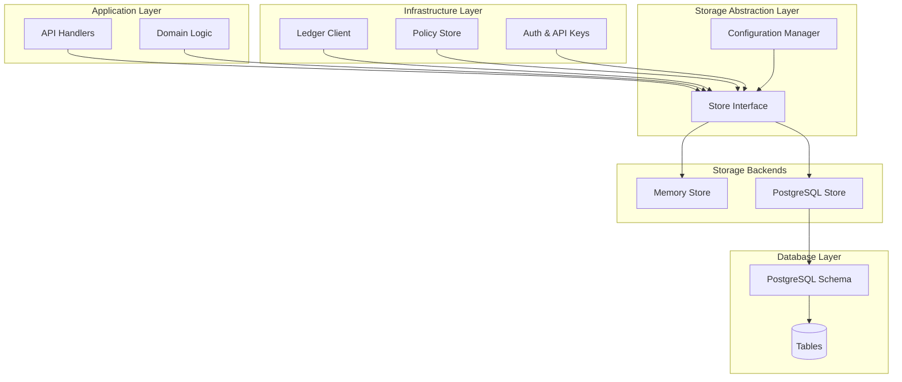
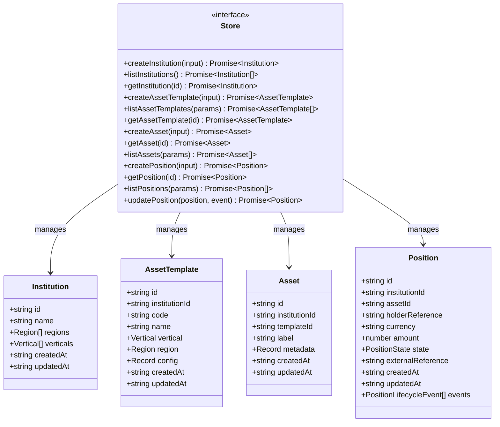
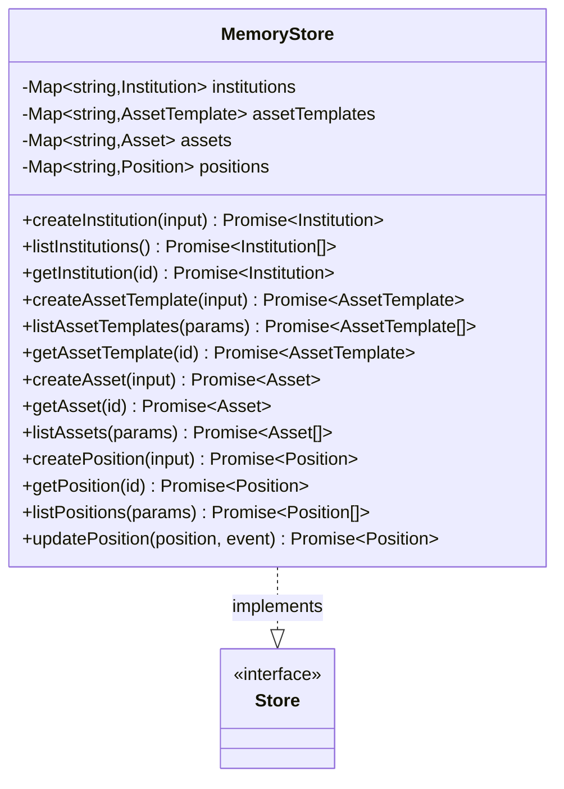
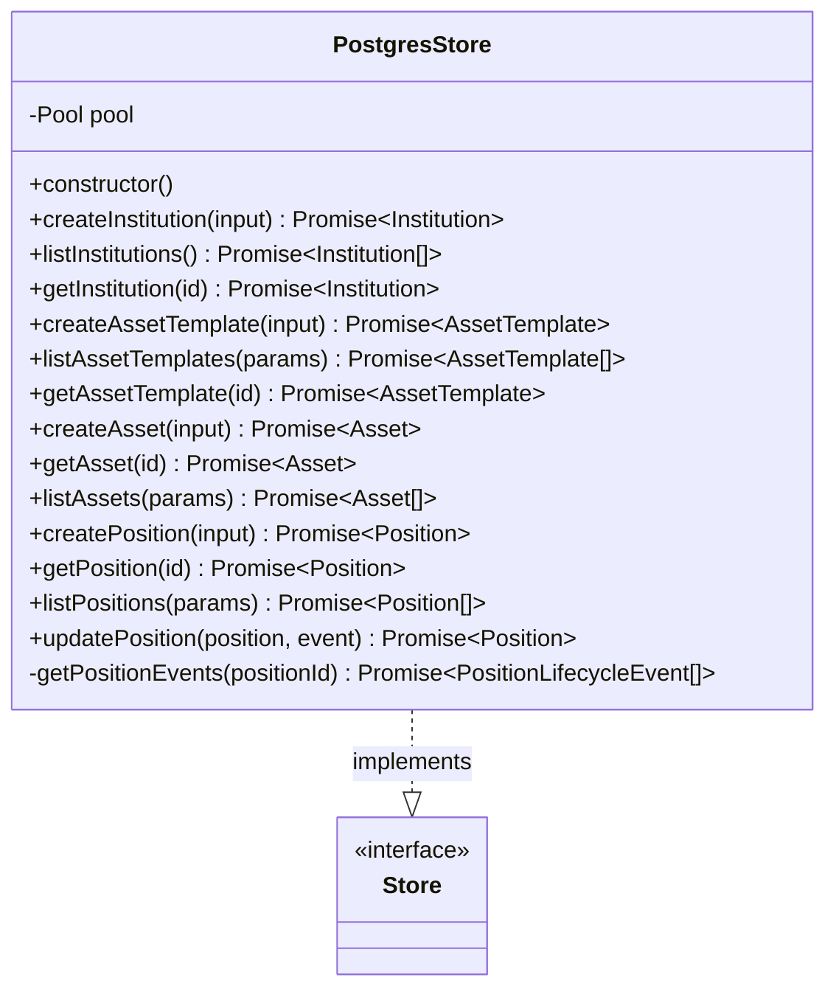
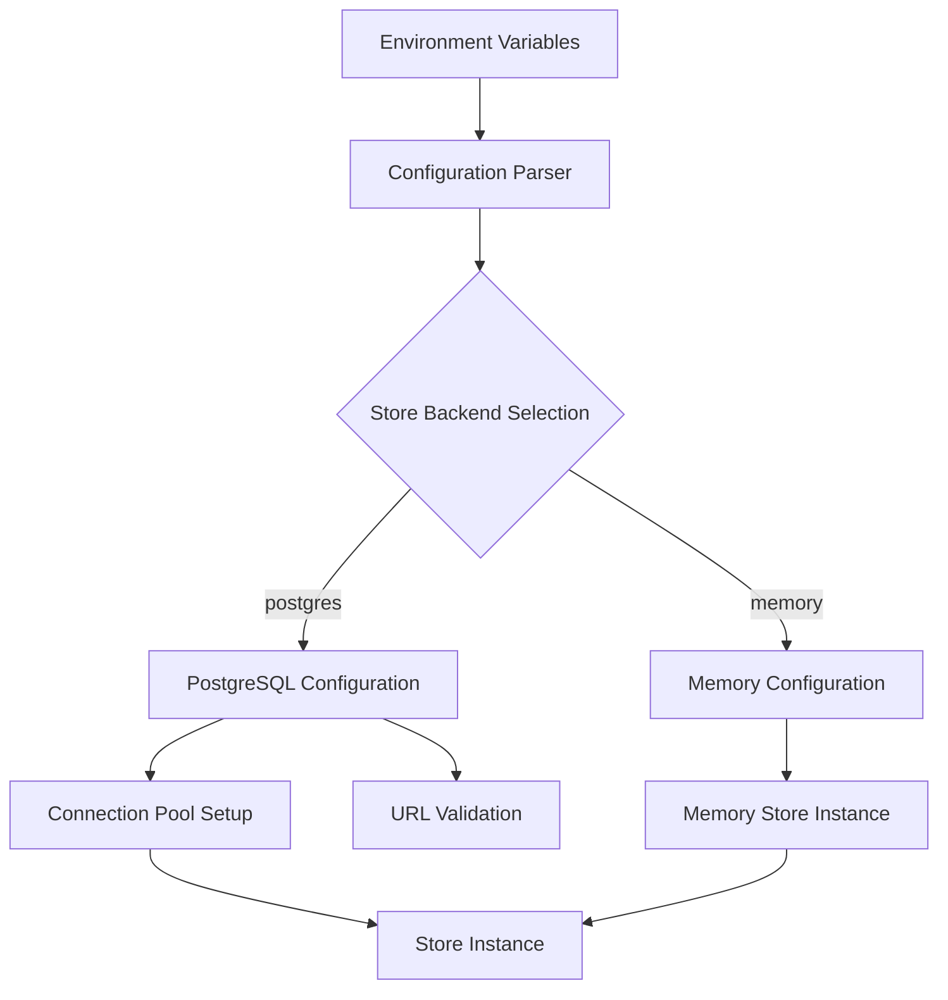
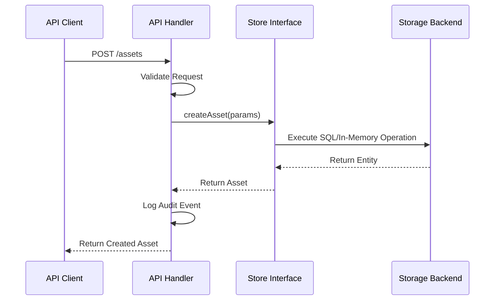
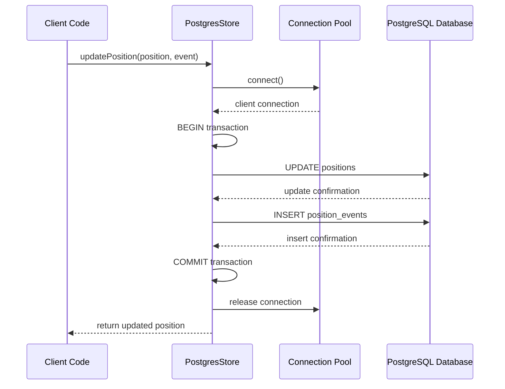
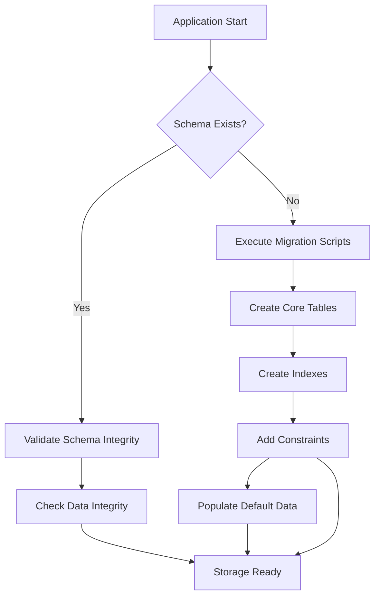
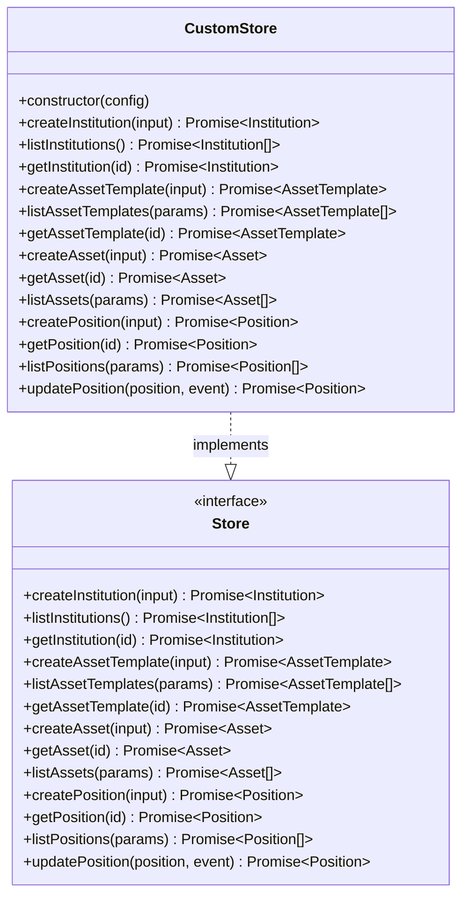
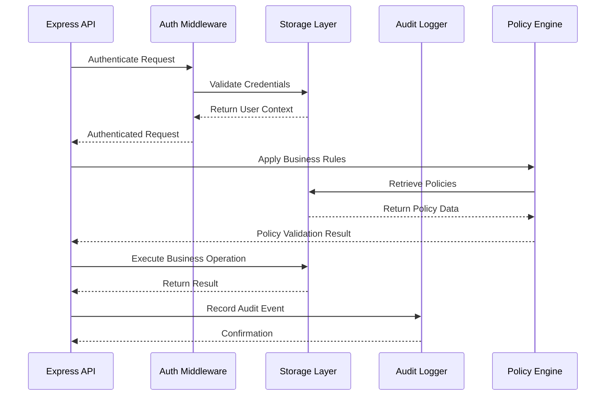

# Storage Layer

<cite>
**Referenced Files in This Document**
- [src/store/store.ts](file://src/store/store.ts)
- [src/store/index.ts](file://src/store/index.ts)
- [src/store/memoryStore.ts](file://src/store/memoryStore.ts)
- [src/store/postgresStore.ts](file://src/store/postgresStore.ts)
- [src/config.ts](file://src/config.ts)
- [src/domain/types.ts](file://src/domain/types.ts)
- [src/infra/postgresLedger.ts](file://src/infra/postgresLedger.ts)
- [src/infra/inMemoryLedger.ts](file://src/infra/inMemoryLedger.ts)
- [src/infra/policyStore.ts](file://src/infra/policyStore.ts)
- [src/infra/apiKeyStore.ts](file://src/infra/apiKeyStore.ts)
- [src/infra/ledgerClient.ts](file://src/infra/ledgerClient.ts)
- [db/schema.sql](file://db/schema.sql)
- [src/api/assets.ts](file://src/api/assets.ts)
- [src/api/positions.ts](file://src/api/positions.ts)
</cite>

## Table of Contents
1. [Introduction](#introduction)
2. [Architecture Overview](#architecture-overview)
3. [Common Store Interface](#common-store-interface)
4. [Storage Backend Implementations](#storage-backend-implementations)
5. [Configuration Management](#configuration-management)
6. [Data Access Patterns](#data-access-patterns)
7. [Transaction Handling](#transaction-handling)
8. [Performance Considerations](#performance-considerations)
9. [Data Consistency and Initialization](#data-consistency-and-initialization)
10. [Extension Points](#extension-points)
11. [Integration with Higher Layers](#integration-with-higher-layers)
12. [Troubleshooting Guide](#troubleshooting-guide)

## Introduction

The escrowgrid storage layer implements a sophisticated pluggable architecture that supports both in-memory and PostgreSQL-backed storage through a unified interface. This design enables seamless switching between development and production environments while maintaining data consistency and performance characteristics appropriate for each deployment scenario.

The storage layer serves as the foundation for all data persistence operations, managing core domain entities including Institutions, Asset Templates, Assets, Positions, and supporting infrastructure like API keys, policies, and audit trails. The architecture emphasizes flexibility, scalability, and maintainability through well-defined abstractions and modular design patterns.

## Architecture Overview

The storage layer follows a layered architecture with clear separation of concerns:

**Diagram sources**
- [src/store/store.ts](file://src/store/store.ts#L1-L59)
- [src/store/index.ts](file://src/store/index.ts#L1-L16)
- [src/config.ts](file://src/config.ts#L1-L47)

The architecture provides several key benefits:
- **Environment Flexibility**: Seamless switching between memory and PostgreSQL backends
- **Consistent API**: Unified interface regardless of underlying storage mechanism
- **Scalability**: PostgreSQL backend supports production-scale deployments
- **Testability**: Memory backend enables fast unit testing and development
- **Extensibility**: Pluggable design allows easy addition of new storage backends

**Section sources**
- [src/store/store.ts](file://src/store/store.ts#L1-L59)
- [src/store/index.ts](file://src/store/index.ts#L1-L16)

## Common Store Interface

The `Store` interface defines the contract that all storage implementations must fulfill, ensuring consistent behavior across different backend types.

### Interface Definition

The Store interface provides comprehensive CRUD operations for all core domain entities:

**Diagram sources**
- [src/store/store.ts](file://src/store/store.ts#L4-L57)
- [src/domain/types.ts](file://src/domain/types.ts#L7-L84)

### Entity Relationships

The storage layer manages four primary entity types with well-defined relationships:

| Entity | Purpose | Key Attributes | Relationships |
|--------|---------|----------------|---------------|
| Institution | Organization container | name, regions, verticals | Many-to-many with AssetTemplate, Asset, Position |
| AssetTemplate | Asset blueprint | code, name, vertical, region, config | Many-to-one with Institution, many-to-many with Asset |
| Asset | Instance of template | label, metadata, templateId | Many-to-one with Institution, AssetTemplate, many-to-many with Position |
| Position | Financial position | holderReference, currency, amount, state | Many-to-one with Institution, Asset, one-to-many with PositionLifecycleEvent |

**Section sources**
- [src/store/store.ts](file://src/store/store.ts#L1-L59)
- [src/domain/types.ts](file://src/domain/types.ts#L7-L84)

## Storage Backend Implementations

The storage layer provides two distinct implementations, each optimized for different use cases and deployment scenarios.

### Memory Store Implementation

The MemoryStore provides in-memory persistence suitable for development, testing, and lightweight production scenarios.

#### Architecture and Design

**Diagram sources**
- [src/store/memoryStore.ts](file://src/store/memoryStore.ts#L13-L217)

#### Key Features

- **Fast Operations**: O(1) lookup times using Map data structures
- **Memory Efficiency**: Optimized for small to medium datasets
- **Atomic Operations**: Thread-safe operations using JavaScript's Map
- **Automatic Cleanup**: No cleanup required - memory is reclaimed automatically
- **Development Friendly**: Zero configuration, instant startup

#### Implementation Details

The MemoryStore uses JavaScript Maps for efficient data storage and retrieval. Each entity type is stored in a separate Map with string keys generated using a prefix-based random ID generator. The implementation ensures data integrity through synchronous operations and maintains timestamps for creation and modification tracking.

**Section sources**
- [src/store/memoryStore.ts](file://src/store/memoryStore.ts#L1-L218)

### PostgreSQL Store Implementation

The PostgreSQLStore provides persistent, scalable storage suitable for production deployments with ACID guarantees.

#### Architecture and Design

**Diagram sources**
- [src/store/postgresStore.ts](file://src/store/postgresStore.ts#L89-L416)

#### Database Schema Integration

The PostgreSQL implementation integrates with a comprehensive database schema that supports all domain entities:

| Table | Purpose | Key Constraints | Indexes |
|-------|---------|----------------|---------|
| institutions | Organization data | Primary key, regions array, verticals array | None |
| asset_templates | Asset blueprints | Foreign key to institutions, composite unique | institution_id |
| assets | Asset instances | Foreign keys to institutions and templates | institution_id, template_id |
| positions | Financial positions | Foreign keys to institutions and assets | institution_id, asset_id, holder_reference |
| position_events | State transitions | Foreign key to positions | position_id |
| ledger_events | Audit trail | Foreign key to positions | position_id |
| api_keys | Authentication tokens | Unique key_hash, foreign key to institutions | institution_id |
| institution_policies | Regional policies | Unique constraint on (institution_id, region) | institution_id |

#### Advanced Features

- **Connection Pooling**: Efficient connection management through pg Pool
- **Transaction Support**: Full ACID compliance with BEGIN/COMMIT/ROLLBACK
- **Index Optimization**: Strategic indexing for query performance
- **JSONB Support**: Flexible configuration storage using PostgreSQL's JSONB type
- **Foreign Key Constraints**: Data integrity enforcement at database level

**Section sources**
- [src/store/postgresStore.ts](file://src/store/postgresStore.ts#L1-L417)
- [db/schema.sql](file://db/schema.sql#L1-L138)

## Configuration Management

The storage layer's backend selection and configuration is managed through a centralized configuration system that supports environment-based deployment scenarios.

### Configuration Architecture

**Diagram sources**
- [src/config.ts](file://src/config.ts#L1-L47)
- [src/store/index.ts](file://src/store/index.ts#L1-L16)

### Configuration Parameters

The system uses several key configuration parameters to determine storage behavior:

| Parameter | Type | Default | Environment Variable | Purpose |
|-----------|------|---------|---------------------|---------|
| storeBackend | StoreBackend | 'memory' | STORE_BACKEND | Determines storage backend selection |
| postgresUrl | string | undefined | DATABASE_URL | PostgreSQL connection string |
| onchainLedgerEnabled | boolean | false | ONCHAIN_LEDGER_ENABLED | Enables blockchain ledger integration |

### Backend Selection Logic

The storage backend selection follows a simple but robust pattern:

1. **Environment Detection**: Reads `STORE_BACKEND` environment variable
2. **Default Fallback**: Uses 'memory' if not specified
3. **Validation**: Ensures PostgreSQL URL is provided when selected
4. **Instance Creation**: Instantiates appropriate store implementation
5. **Export**: Makes the configured store available to application modules

**Section sources**
- [src/config.ts](file://src/config.ts#L1-L47)
- [src/store/index.ts](file://src/store/index.ts#L1-L16)

## Data Access Patterns

The storage layer implements consistent data access patterns that support various operational requirements while maintaining performance and reliability.

### Query Patterns

The store interface supports multiple query patterns optimized for different use cases:

#### Filtering Patterns
- **Single Entity Lookup**: Direct ID-based retrieval
- **List with Filters**: Multi-parameter filtering (institutionId, templateId, holderReference)
- **Full Listing**: Unfiltered enumeration of all entities
- **Hierarchical Queries**: Related entity retrieval (position events, asset templates)

#### Transaction Patterns
- **Single Operation**: Independent entity creation/update
- **Composite Operations**: Related entity updates requiring consistency
- **Batch Operations**: Bulk data processing scenarios

### Implementation Examples

The API handlers demonstrate typical usage patterns:

**Diagram sources**
- [src/api/assets.ts](file://src/api/assets.ts#L62-L81)
- [src/store/store.ts](file://src/store/store.ts#L34-L36)

**Section sources**
- [src/api/assets.ts](file://src/api/assets.ts#L1-L147)
- [src/api/positions.ts](file://src/api/positions.ts#L1-L200)

## Transaction Handling

The storage layer provides different transaction handling capabilities depending on the backend implementation.

### Memory Store Transactions

The MemoryStore provides atomic operations through JavaScript's synchronous execution model:

- **Isolation**: Each operation executes in isolation
- **Consistency**: Synchronous operations ensure immediate consistency
- **Durability**: Not applicable (in-memory only)
- **ACID Properties**: Atomicity and consistency guaranteed through synchronous execution

### PostgreSQL Store Transactions

The PostgreSQLStore implements full ACID compliance through database transactions:

**Diagram sources**
- [src/store/postgresStore.ts](file://src/store/postgresStore.ts#L356-L410)

#### Transaction Features

- **Explicit Control**: BEGIN/COMMIT/ROLLBACK statements
- **Connection Management**: Automatic connection pooling and release
- **Error Handling**: Automatic rollback on exceptions
- **Concurrency Control**: Database-level locking and isolation

**Section sources**
- [src/store/postgresStore.ts](file://src/store/postgresStore.ts#L356-L410)

## Performance Considerations

Each storage backend has distinct performance characteristics and optimization strategies.

### Memory Store Performance

#### Strengths
- **Zero Latency**: Direct memory access with minimal overhead
- **High Throughput**: No I/O bottlenecks for small to medium datasets
- **Predictable Performance**: Consistent O(1) operation times
- **Low Resource Usage**: Minimal CPU and memory overhead

#### Limitations
- **Memory Pressure**: Limited by available RAM
- **Persistence Loss**: Data lost on application restart
- **Scalability Limits**: Not suitable for large datasets
- **Concurrent Access**: Single-threaded nature may limit concurrency

#### Optimization Strategies
- **Memory Monitoring**: Track memory usage for capacity planning
- **Garbage Collection**: Leverage JavaScript GC for automatic cleanup
- **Data Structure Selection**: Use appropriate Map/Array structures
- **Connection Limits**: Monitor concurrent access patterns

### PostgreSQL Store Performance

#### Strengths
- **Persistent Storage**: Data survives application restarts
- **Scalable Architecture**: Handles large datasets efficiently
- **Advanced Features**: Full-text search, geospatial queries, JSONB operations
- **Concurrency**: Built-in locking and isolation levels
- **Backup/Recovery**: Comprehensive data protection mechanisms

#### Performance Optimization
- **Connection Pooling**: Configure optimal pool sizes
- **Index Strategy**: Strategic indexing for query patterns
- **Query Optimization**: Prepared statements and parameterized queries
- **Monitoring**: Track query execution times and connection usage

#### Configuration Recommendations

| Parameter | Memory Store | PostgreSQL Store |
|-----------|--------------|------------------|
| Startup Time | Instant | Database connection establishment |
| Memory Usage | Proportional to data size | Database server resources |
| Query Performance | O(1) for indexed operations | O(log n) with indexes |
| Concurrency | Limited by JavaScript single-threading | Database-level concurrency control |
| Persistence | None | ACID-compliant persistence |
| Scalability | Limited by RAM | Horizontal and vertical scaling |

**Section sources**
- [src/store/memoryStore.ts](file://src/store/memoryStore.ts#L1-L218)
- [src/store/postgresStore.ts](file://src/store/postgresStore.ts#L1-L417)

## Data Consistency and Initialization

The storage layer ensures data consistency through multiple mechanisms tailored to each backend type.

### Consistency Mechanisms

#### Memory Store Consistency
- **Immediate Updates**: Synchronous operations ensure immediate consistency
- **Atomic Operations**: JavaScript's single-threaded nature provides natural atomicity
- **Validation**: Runtime validation of entity relationships and constraints
- **Error Handling**: Exception-based error reporting for consistency violations

#### PostgreSQL Store Consistency
- **Foreign Key Constraints**: Database-level referential integrity
- **Unique Constraints**: Business rule enforcement at database level
- **Transaction Isolation**: ACID compliance through database transactions
- **Trigger-Based Validation**: Database-level business logic enforcement

### Initialization Procedures

#### Database Schema Initialization

The PostgreSQL backend requires schema initialization through migration scripts:

**Diagram sources**
- [db/schema.sql](file://db/schema.sql#L1-L138)

#### Application-Level Initialization

The application performs several initialization steps:

1. **Configuration Loading**: Environment variables and defaults
2. **Connection Establishment**: Database connection for PostgreSQL backend
3. **Schema Validation**: Verify database schema integrity
4. **Default Data Population**: Initialize required default entities
5. **Health Checks**: Verify storage backend accessibility

**Section sources**
- [db/schema.sql](file://db/schema.sql#L1-L138)
- [src/store/postgresStore.ts](file://src/store/postgresStore.ts#L92-L95)

## Extension Points

The storage layer architecture provides several extension points for adding new storage backends or enhancing existing functionality.

### Adding New Storage Backends

To add a new storage backend, implement the Store interface:

### Extension Implementation Steps

1. **Interface Compliance**: Implement all Store interface methods
2. **Configuration Integration**: Add configuration parameters
3. **Backend Registration**: Update store selection logic
4. **Testing**: Implement comprehensive test suite
5. **Documentation**: Update usage documentation

### Modular Infrastructure Extensions

The storage layer supports modular infrastructure extensions:

- **Custom Ledger Backends**: Alternative audit trail implementations
- **Policy Store Variants**: Different policy evaluation engines
- **Authentication Stores**: Custom authentication and authorization backends
- **Monitoring Integrations**: Custom metrics and logging backends

**Section sources**
- [src/store/store.ts](file://src/store/store.ts#L4-L57)
- [src/store/index.ts](file://src/store/index.ts#L8-L12)

## Integration with Higher Layers

The storage layer integrates seamlessly with higher application layers through well-defined interfaces and dependency injection patterns.

### API Layer Integration

The API handlers demonstrate typical integration patterns:

**Diagram sources**
- [src/api/positions.ts](file://src/api/positions.ts#L75-L118)
- [src/infra/ledgerClient.ts](file://src/infra/ledgerClient.ts#L8-L36)

### Infrastructure Layer Integration

The storage layer supports multiple infrastructure components:

#### Ledger Integration
- **Position Events**: Automatic recording of state transitions
- **Audit Trails**: Comprehensive audit logging
- **Blockchain Integration**: Optional on-chain ledger support

#### Policy Engine Integration
- **Regional Policies**: Location-based business rules
- **Dynamic Configuration**: Runtime policy updates
- **Compliance Monitoring**: Policy violation detection

#### Authentication Integration
- **API Key Management**: Secure credential storage
- **Role-Based Access**: Permission enforcement
- **Audit Logging**: Security event tracking

**Section sources**
- [src/api/assets.ts](file://src/api/assets.ts#L1-L147)
- [src/api/positions.ts](file://src/api/positions.ts#L1-L200)
- [src/infra/ledgerClient.ts](file://src/infra/ledgerClient.ts#L1-L64)

## Troubleshooting Guide

Common issues and their solutions when working with the storage layer.

### Memory Store Issues

#### Problem: Out of Memory Errors
**Symptoms**: Application crashes with memory errors
**Solution**: 
- Monitor memory usage patterns
- Implement data lifecycle management
- Consider data expiration policies
- Switch to PostgreSQL backend for large datasets

#### Problem: Data Loss on Restart
**Symptoms**: Application restart clears all data
**Solution**: 
- Use PostgreSQL backend for persistent storage
- Implement backup strategies for critical data
- Consider hybrid approaches with periodic snapshots

### PostgreSQL Store Issues

#### Problem: Connection Pool Exhaustion
**Symptoms**: "Connection pool exhausted" errors
**Solution**:
- Increase connection pool size
- Optimize query performance
- Implement proper connection release
- Monitor connection usage patterns

#### Problem: Slow Query Performance
**Symptoms**: High response times for database operations
**Solution**:
- Analyze query execution plans
- Add appropriate indexes
- Optimize WHERE clause conditions
- Review connection pooling configuration

#### Problem: Transaction Deadlocks
**Symptoms**: "Deadlock detected" errors
**Solution**:
- Review transaction boundaries
- Minimize transaction scope
- Implement retry logic
- Order operations consistently

### Configuration Issues

#### Problem: PostgreSQL URL Not Found
**Symptoms**: "DATABASE_URL is required" error
**Solution**:
- Verify environment variable is set
- Check database connectivity
- Validate connection string format
- Test database credentials

#### Problem: Backend Selection Issues
**Symptoms**: Unexpected storage backend behavior
**Solution**:
- Verify STORE_BACKEND environment variable
- Check configuration loading order
- Validate environment variable precedence
- Test with explicit configuration

**Section sources**
- [src/config.ts](file://src/config.ts#L40-L46)
- [src/store/postgresStore.ts](file://src/store/postgresStore.ts#L92-L95)