# Data Flow

<cite>
**Referenced Files in This Document**
- [src/server.ts](file://src/server.ts)
- [src/middleware/auth.ts](file://src/middleware/auth.ts)
- [src/middleware/requestLogger.ts](file://src/middleware/requestLogger.ts)
- [src/middleware/rateLimit.ts](file://src/middleware/rateLimit.ts)
- [src/api/institutions.ts](file://src/api/institutions.ts)
- [src/api/positions.ts](file://src/api/positions.ts)
- [src/api/ledger.ts](file://src/api/ledger.ts)
- [src/domain/lifecycle.ts](file://src/domain/lifecycle.ts)
- [src/domain/policy.ts](file://src/domain/policy.ts)
- [src/domain/types.ts](file://src/domain/types.ts)
- [src/domain/audit.ts](file://src/domain/audit.ts)
- [src/store/postgresStore.ts](file://src/store/postgresStore.ts)
- [src/store/store.ts](file://src/store/store.ts)
- [src/infra/ledgerClient.ts](file://src/infra/ledgerClient.ts)
- [src/infra/auditLogger.ts](file://src/infra/auditLogger.ts)
- [src/infra/policyStore.ts](file://src/infra/policyStore.ts)
- [src/config.ts](file://src/config.ts)
</cite>

## Table of Contents
1. [Introduction](#introduction)
2. [System Architecture Overview](#system-architecture-overview)
3. [HTTP Request Processing Pipeline](#http-request-processing-pipeline)
4. [Middleware Stack](#middleware-stack)
5. [API Router Layer](#api-router-layer)
6. [Domain Logic Processing](#domain-logic-processing)
7. [Storage Interaction](#storage-interaction)
8. [Event Sourcing and Ledger Integration](#event-sourcing-and-ledger-integration)
9. [Audit Logging System](#audit-logging-system)
10. [Error Handling and Transaction Boundaries](#error-handling-and-transaction-boundaries)
11. [Policy Enforcement](#policy-enforcement)
12. [Race Condition Prevention](#race-condition-prevention)
13. [Performance Considerations](#performance-considerations)
14. [Troubleshooting Guide](#troubleshooting-guide)
15. [Conclusion](#conclusion)

## Introduction

The escrowgrid platform implements a sophisticated data flow architecture designed for financial position management with strong consistency guarantees, comprehensive audit trails, and robust policy enforcement. This document provides a detailed analysis of the end-to-end request processing pipeline, focusing on the position creation and lifecycle transition processes as primary examples of event sourcing and policy enforcement mechanisms.

The platform follows a layered architecture with clear separation of concerns, implementing middleware processing, API routing, domain logic execution, storage interaction, and audit logging in a coordinated manner. The system emphasizes transactional consistency, race condition prevention, and comprehensive monitoring through structured logging and metrics collection.

## System Architecture Overview

The escrowgrid platform employs a modular, layered architecture that ensures clean separation between presentation, business logic, and persistence layers. The system is built around Express.js with TypeScript, utilizing PostgreSQL for persistent storage and Redis for caching where applicable.

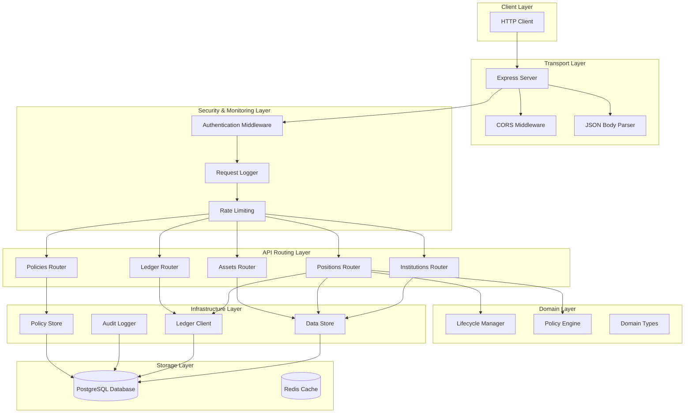
```mermaid
graph TB
subgraph "Client Layer"
Client[HTTP Client]
end
subgraph "Transport Layer"
Express[Express Server]
CORS[CORS Middleware]
BodyParser[JSON Body Parser]
end
subgraph "Security & Monitoring Layer"
Auth[Authentication Middleware]
Logger[Request Logger]
RateLimit[Rate Limiting]
end
subgraph "API Routing Layer"
InstRouter[Institutions Router]
PosRouter[Positions Router]
LedgerRouter[Ledger Router]
AssetsRouter[Assets Router]
PoliciesRouter[Policies Router]
end
subgraph "Domain Layer"
Lifecycle[Lifecycle Manager]
PolicyEngine[Policy Engine]
Types[Domain Types]
end
subgraph "Infrastructure Layer"
LedgerClient[Ledger Client]
AuditLogger[Audit Logger]
PolicyStore[Policy Store]
Store[Data Store]
end
subgraph "Storage Layer"
PostgreSQL[(PostgreSQL Database)]
Redis[(Redis Cache)]
end
Client --> Express
Express --> CORS
Express --> BodyParser
Express --> Auth
Auth --> Logger
Logger --> RateLimit
RateLimit --> InstRouter
RateLimit --> PosRouter
RateLimit --> LedgerRouter
RateLimit --> AssetsRouter
RateLimit --> PoliciesRouter
InstRouter --> Store
PosRouter --> Store
PosRouter --> Lifecycle
PosRouter --> PolicyEngine
PosRouter --> LedgerClient
LedgerRouter --> LedgerClient
AssetsRouter --> Store
PoliciesRouter --> PolicyStore
Store --> PostgreSQL
LedgerClient --> PostgreSQL
AuditLogger --> PostgreSQL
PolicyStore --> PostgreSQL
```

**Diagram sources**
- [src/server.ts](file://src/server.ts#L19-L100)
- [src/middleware/auth.ts](file://src/middleware/auth.ts#L35-L82)
- [src/middleware/requestLogger.ts](file://src/middleware/requestLogger.ts#L5-L26)
- [src/middleware/rateLimit.ts](file://src/middleware/rateLimit.ts#L12-L66)

**Section sources**
- [src/server.ts](file://src/server.ts#L1-L100)
- [src/config.ts](file://src/config.ts#L1-L47)

## HTTP Request Processing Pipeline

The HTTP request processing pipeline in escrowgrid follows a well-defined sequence from ingress to egress, ensuring consistent handling of all requests while maintaining security, performance, and observability standards.

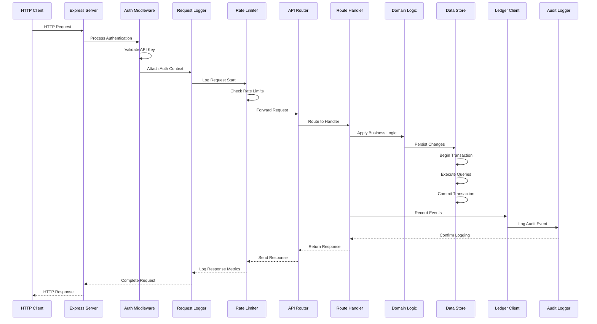
```mermaid
sequenceDiagram
participant Client as HTTP Client
participant Server as Express Server
participant Auth as Auth Middleware
participant Logger as Request Logger
participant RateLimit as Rate Limiter
participant Router as API Router
participant Handler as Route Handler
participant Domain as Domain Logic
participant Store as Data Store
participant Ledger as Ledger Client
participant Audit as Audit Logger
Client->>Server : HTTP Request
Server->>Auth : Process Authentication
Auth->>Auth : Validate API Key
Auth->>Logger : Attach Auth Context
Logger->>RateLimit : Log Request Start
RateLimit->>RateLimit : Check Rate Limits
RateLimit->>Router : Forward Request
Router->>Handler : Route to Handler
Handler->>Domain : Apply Business Logic
Domain->>Store : Persist Changes
Store->>Store : Begin Transaction
Store->>Store : Execute Queries
Store->>Store : Commit Transaction
Handler->>Ledger : Record Events
Ledger->>Audit : Log Audit Event
Audit-->>Handler : Confirm Logging
Handler-->>Router : Return Response
Router-->>RateLimit : Send Response
RateLimit-->>Logger : Log Response Metrics
Logger-->>Server : Complete Request
Server-->>Client : HTTP Response
```

**Diagram sources**
- [src/server.ts](file://src/server.ts#L19-L100)
- [src/middleware/auth.ts](file://src/middleware/auth.ts#L35-L82)
- [src/middleware/requestLogger.ts](file://src/middleware/requestLogger.ts#L5-L26)
- [src/middleware/rateLimit.ts](file://src/middleware/rateLimit.ts#L12-L66)

### Request Flow Through Core Routers

The platform organizes its API endpoints into specialized routers, each handling specific domain concerns:

| Router | Purpose | Key Endpoints | Data Flow Pattern |
|--------|---------|---------------|-------------------|
| **institutionsRouter** | Institution management | `/institutions`, `/institutions/:id` | CRUD operations with root-only creation |
| **positionsRouter** | Position lifecycle | `/positions`, `/positions/:id`, `/positions/:id/transition` | Full lifecycle management with state transitions |
| **ledgerRouter** | Event history | `/ledger-events` | Queryable event stream with position filtering |
| **assetsRouter** | Asset management | `/assets`, `/asset-templates` | Asset templates and instances |
| **policiesRouter** | Policy configuration | `/policies` | Institution-specific policy enforcement |

**Section sources**
- [src/server.ts](file://src/server.ts#L80-L87)
- [src/api/institutions.ts](file://src/api/institutions.ts#L1-L115)
- [src/api/positions.ts](file://src/api/positions.ts#L1-L298)
- [src/api/ledger.ts](file://src/api/ledger.ts#L1-L43)

## Middleware Stack

The middleware stack provides essential cross-cutting concerns including authentication, request logging, rate limiting, and error handling. Each middleware component operates independently while contributing to the overall request processing pipeline.

### Authentication Middleware

The authentication middleware validates API keys and establishes the authorization context for each request:

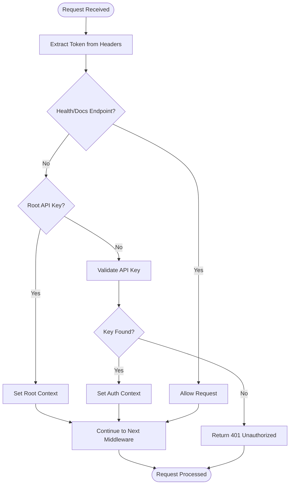
```mermaid
flowchart TD
Start([Request Received]) --> ExtractToken["Extract Token from Headers"]
ExtractToken --> CheckHealth{"Health/Docs Endpoint?"}
CheckHealth --> |Yes| Allow[Allow Request]
CheckHealth --> |No| CheckRoot{"Root API Key?"}
CheckRoot --> |Yes| SetRootContext["Set Root Context"]
CheckRoot --> |No| ValidateKey["Validate API Key"]
ValidateKey --> KeyExists{"Key Found?"}
KeyExists --> |No| Unauthorized["Return 401 Unauthorized"]
KeyExists --> |Yes| SetAuthContext["Set Auth Context"]
SetRootContext --> NextMiddleware[Continue to Next Middleware]
SetAuthContext --> NextMiddleware
Allow --> NextMiddleware
NextMiddleware --> End([Request Processed])
Unauthorized --> End
```

**Diagram sources**
- [src/middleware/auth.ts](file://src/middleware/auth.ts#L35-L82)

### Request Logging and Metrics

The request logger captures comprehensive metrics about each request, enabling performance monitoring and debugging capabilities:

| Metric | Description | Collection Method |
|--------|-------------|-------------------|
| **Duration** | Request processing time in milliseconds | High-resolution timing |
| **Status Code** | HTTP response status | Response event listener |
| **Method** | HTTP verb (GET, POST, etc.) | Request metadata |
| **Path** | Request URL path | Request routing data |
| **API Key ID** | Authenticated API key identifier | Auth context |
| **Institution ID** | Associated institution (if applicable) | Auth context |

**Section sources**
- [src/middleware/requestLogger.ts](file://src/middleware/requestLogger.ts#L1-L29)
- [src/middleware/auth.ts](file://src/middleware/auth.ts#L1-L95)

### Rate Limiting Implementation

The rate limiting middleware prevents abuse while allowing legitimate traffic patterns:

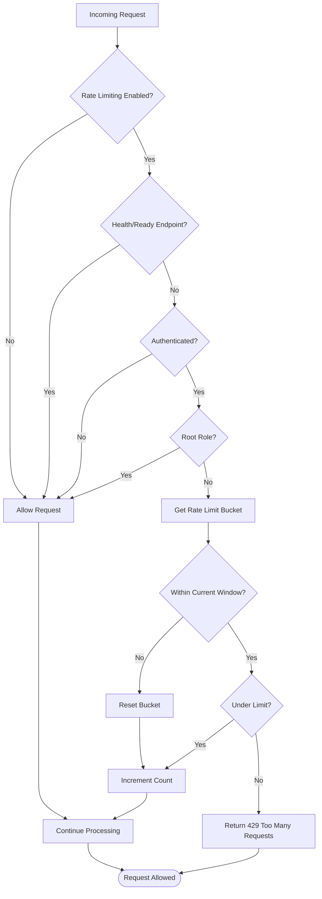
```mermaid
flowchart TD
Request[Incoming Request] --> CheckEnabled{"Rate Limiting Enabled?"}
CheckEnabled --> |No| Allow[Allow Request]
CheckEnabled --> |Yes| CheckEndpoint{"Health/Ready Endpoint?"}
CheckEndpoint --> |Yes| Allow
CheckEndpoint --> |No| CheckAuth{"Authenticated?"}
CheckAuth --> |No| Allow
CheckAuth --> |Yes| CheckRoot{"Root Role?"}
CheckRoot --> |Yes| Allow
CheckRoot --> |No| GetBucket["Get Rate Limit Bucket"]
GetBucket --> CheckWindow{"Within Current Window?"}
CheckWindow --> |No| ResetBucket["Reset Bucket"]
CheckWindow --> |Yes| CheckLimit{"Under Limit?"}
ResetBucket --> IncrementCount["Increment Count"]
CheckLimit --> |Yes| IncrementCount
CheckLimit --> |No| Block["Return 429 Too Many Requests"]
IncrementCount --> Continue[Continue Processing]
Block --> End([Request Blocked])
Allow --> Continue
Continue --> End([Request Allowed])
```

**Diagram sources**
- [src/middleware/rateLimit.ts](file://src/middleware/rateLimit.ts#L12-L66)

**Section sources**
- [src/middleware/rateLimit.ts](file://src/middleware/rateLimit.ts#L1-L67)

## API Router Layer

The API router layer implements RESTful endpoints with consistent error handling, input validation, and response formatting. Each router specializes in a particular domain area while maintaining architectural consistency.

### Positions Router - Primary Example

The positions router exemplifies the platform's approach to handling complex business logic with comprehensive validation and state management:

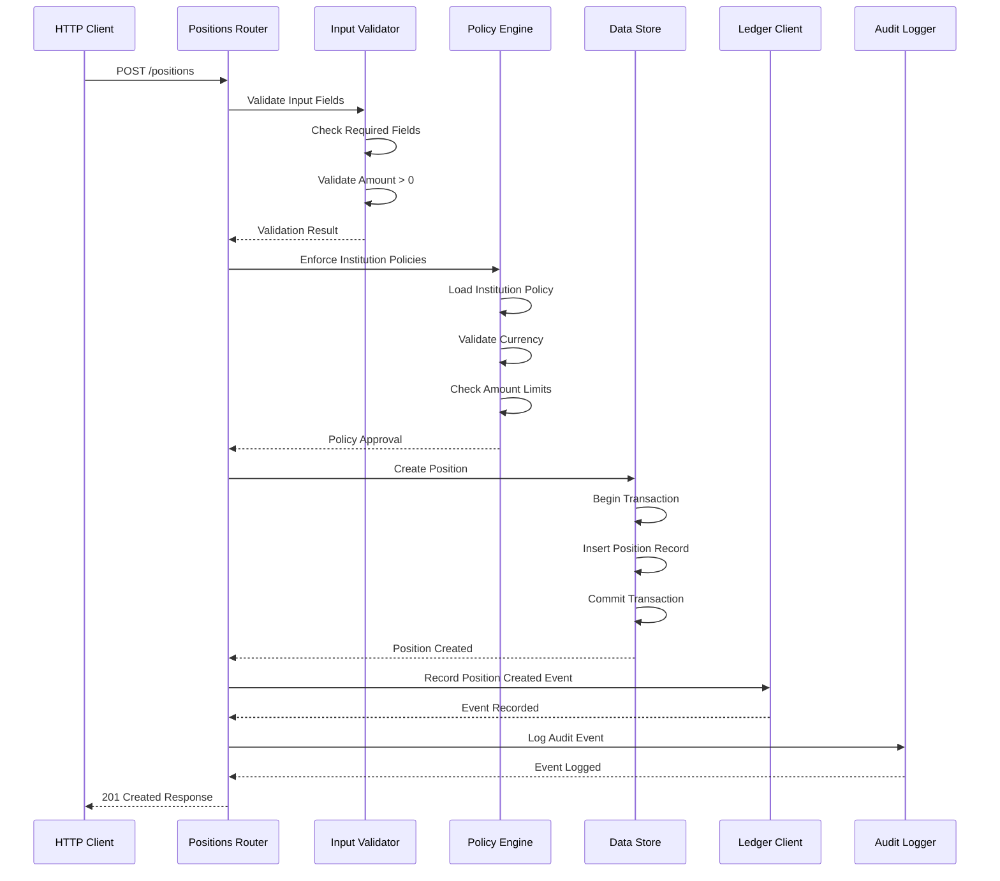
```mermaid
sequenceDiagram
participant Client as HTTP Client
participant PosRouter as Positions Router
participant Validator as Input Validator
participant Policy as Policy Engine
participant Store as Data Store
participant Ledger as Ledger Client
participant Audit as Audit Logger
Client->>PosRouter : POST /positions
PosRouter->>Validator : Validate Input Fields
Validator->>Validator : Check Required Fields
Validator->>Validator : Validate Amount > 0
Validator-->>PosRouter : Validation Result
PosRouter->>Policy : Enforce Institution Policies
Policy->>Policy : Load Institution Policy
Policy->>Policy : Validate Currency
Policy->>Policy : Check Amount Limits
Policy-->>PosRouter : Policy Approval
PosRouter->>Store : Create Position
Store->>Store : Begin Transaction
Store->>Store : Insert Position Record
Store->>Store : Commit Transaction
Store-->>PosRouter : Position Created
PosRouter->>Ledger : Record Position Created Event
Ledger-->>PosRouter : Event Recorded
PosRouter->>Audit : Log Audit Event
Audit-->>PosRouter : Event Logged
PosRouter-->>Client : 201 Created Response
```

**Diagram sources**
- [src/api/positions.ts](file://src/api/positions.ts#L22-L144)

### Position Lifecycle Transitions

The platform implements a state machine for position lifecycle management with strict transition validation:

| Current State | Allowed Transitions | Reason |
|---------------|-------------------|---------|
| **CREATED** | FUNDED, CANCELLED, EXPIRED | Initial funding or cancellation |
| **FUNDED** | PARTIALLY_RELEASED, RELEASED, CANCELLED, EXPIRED | Partial or full release |
| **PARTIALLY_RELEASED** | PARTIALLY_RELEASED, RELEASED, CANCELLED, EXPIRED | Additional releases |
| **RELEASED** | None | Terminal state |
| **CANCELLED** | None | Terminal state |
| **EXPIRED** | None | Terminal state |

**Section sources**
- [src/api/positions.ts](file://src/api/positions.ts#L1-L298)
- [src/domain/lifecycle.ts](file://src/domain/lifecycle.ts#L1-L51)

## Domain Logic Processing

The domain layer encapsulates business rules and logic, ensuring consistency and enforcing invariants across the system. The platform implements several key domain concepts that demonstrate sophisticated data flow patterns.

### Lifecycle Management

The lifecycle management system demonstrates event sourcing principles with immutable state transitions:

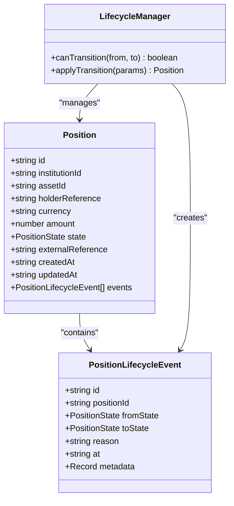
```mermaid
classDiagram
class Position {
+string id
+string institutionId
+string assetId
+string holderReference
+string currency
+number amount
+PositionState state
+string externalReference
+string createdAt
+string updatedAt
+PositionLifecycleEvent[] events
}
class PositionLifecycleEvent {
+string id
+string positionId
+PositionState fromState
+PositionState toState
+string reason
+string at
+Record metadata
}
class LifecycleManager {
+canTransition(from, to) boolean
+applyTransition(params) Position
}
Position --> PositionLifecycleEvent : "contains"
LifecycleManager --> Position : "manages"
LifecycleManager --> PositionLifecycleEvent : "creates"
```

**Diagram sources**
- [src/domain/lifecycle.ts](file://src/domain/lifecycle.ts#L16-L50)
- [src/domain/types.ts](file://src/domain/types.ts#L46-L68)

### Policy Enforcement Mechanism

The policy enforcement system provides dynamic configuration-driven validation:

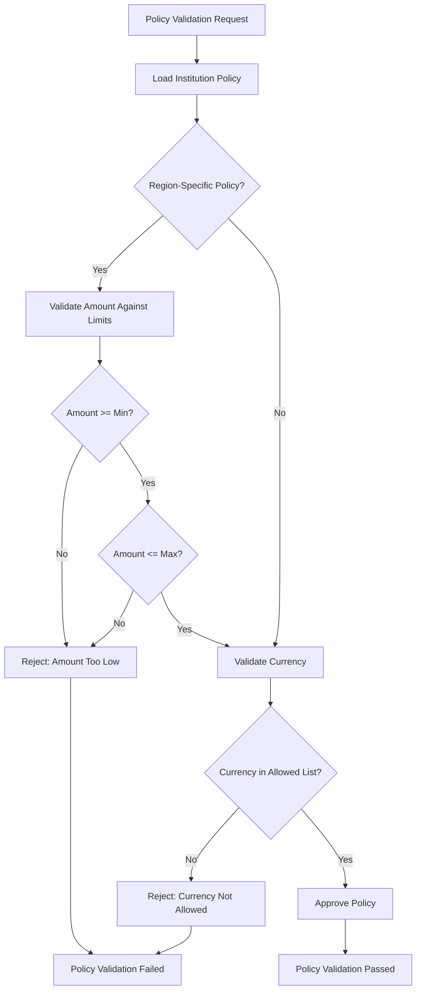
```mermaid
flowchart TD
PolicyRequest[Policy Validation Request] --> LoadPolicy["Load Institution Policy"]
LoadPolicy --> CheckRegion{"Region-Specific Policy?"}
CheckRegion --> |Yes| ValidateAmount["Validate Amount Against Limits"]
CheckRegion --> |No| ValidateCurrency["Validate Currency"]
ValidateAmount --> CheckMin{"Amount >= Min?"}
CheckMin --> |No| RejectAmount["Reject: Amount Too Low"]
CheckMin --> |Yes| CheckMax{"Amount <= Max?"}
CheckMax --> |No| RejectAmount
CheckMax --> |Yes| ValidateCurrency
ValidateCurrency --> CheckAllowed{"Currency in Allowed List?"}
CheckAllowed --> |No| RejectCurrency["Reject: Currency Not Allowed"]
CheckAllowed --> |Yes| ApprovePolicy["Approve Policy"]
RejectAmount --> PolicyFailure[Policy Validation Failed]
RejectCurrency --> PolicyFailure
ApprovePolicy --> PolicySuccess[Policy Validation Passed]
```

**Diagram sources**
- [src/api/positions.ts](file://src/api/positions.ts#L75-L118)
- [src/domain/policy.ts](file://src/domain/policy.ts#L1-L23)

**Section sources**
- [src/domain/lifecycle.ts](file://src/domain/lifecycle.ts#L1-L51)
- [src/domain/policy.ts](file://src/domain/policy.ts#L1-L23)

## Storage Interaction

The storage layer implements a consistent interface across different backend implementations while maintaining transactional integrity and data consistency. The platform supports both in-memory and PostgreSQL backends for development and production scenarios.

### Transaction Management

The PostgreSQL store implements explicit transaction management to ensure atomicity across multiple database operations:

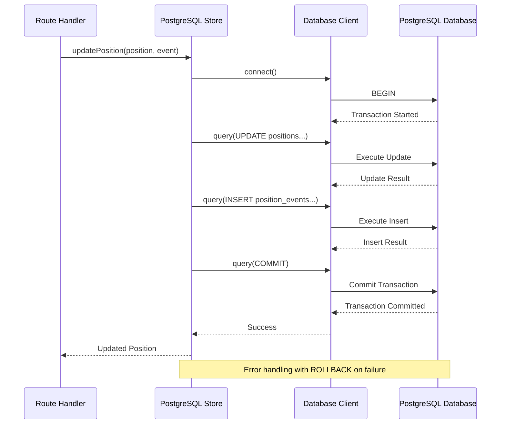
```mermaid
sequenceDiagram
participant Handler as Route Handler
participant Store as PostgreSQL Store
participant Client as Database Client
participant DB as PostgreSQL Database
Handler->>Store : updatePosition(position, event)
Store->>Client : connect()
Client->>DB : BEGIN
DB-->>Client : Transaction Started
Store->>Client : query(UPDATE positions...)
Client->>DB : Execute Update
DB-->>Client : Update Result
Store->>Client : query(INSERT position_events...)
Client->>DB : Execute Insert
DB-->>Client : Insert Result
Store->>Client : query(COMMIT)
Client->>DB : Commit Transaction
DB-->>Client : Transaction Committed
Client-->>Store : Success
Store-->>Handler : Updated Position
Note over Store,DB : Error handling with ROLLBACK on failure
```

**Diagram sources**
- [src/store/postgresStore.ts](file://src/store/postgresStore.ts#L356-L409)

### Data Consistency Patterns

The storage layer implements several consistency patterns to maintain data integrity:

| Pattern | Implementation | Use Case |
|---------|----------------|----------|
| **Transactional Updates** | Explicit BEGIN/COMMIT/ROLLBACK | Position updates with events |
| **Upsert Operations** | ON CONFLICT DO UPDATE | Policy configuration |
| **Cascade Deletion** | Foreign key constraints | Related entity cleanup |
| **Timestamp Versioning** | createdAt/updatedAt fields | Concurrency control |

**Section sources**
- [src/store/postgresStore.ts](file://src/store/postgresStore.ts#L1-L417)
- [src/store/store.ts](file://src/store/store.ts#L1-L59)

## Event Sourcing and Ledger Integration

The platform implements event sourcing principles through its ledger system, providing immutable audit trails and eventual consistency guarantees across distributed systems.

### Ledger Client Architecture

The ledger client provides a unified interface for recording and querying events across multiple storage backends:

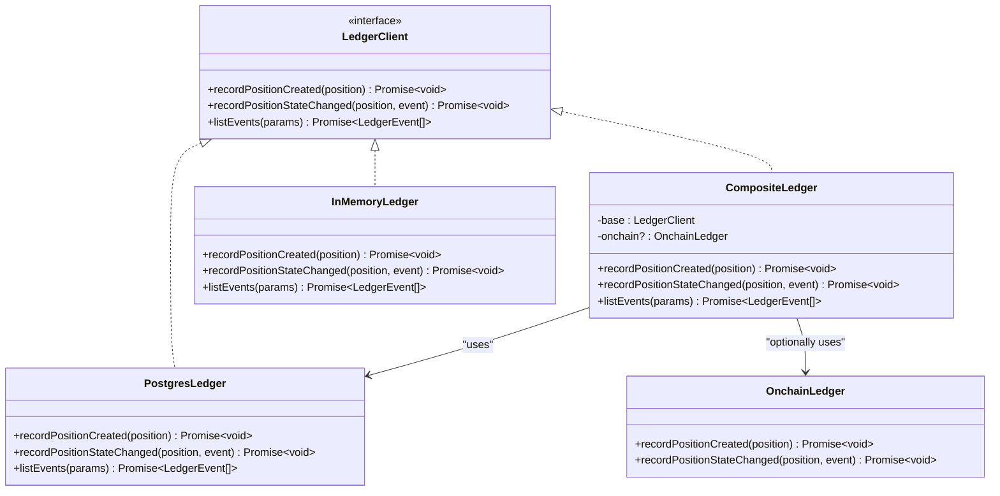
```mermaid
classDiagram
class LedgerClient {
<<interface>>
+recordPositionCreated(position) Promise~void~
+recordPositionStateChanged(position, event) Promise~void~
+listEvents(params) Promise~LedgerEvent[]~
}
class CompositeLedger {
-base : LedgerClient
-onchain? : OnchainLedger
+recordPositionCreated(position) Promise~void~
+recordPositionStateChanged(position, event) Promise~void~
+listEvents(params) Promise~LedgerEvent[]~
}
class PostgresLedger {
+recordPositionCreated(position) Promise~void~
+recordPositionStateChanged(position, event) Promise~void~
+listEvents(params) Promise~LedgerEvent[]~
}
class InMemoryLedger {
+recordPositionCreated(position) Promise~void~
+recordPositionStateChanged(position, event) Promise~void~
+listEvents(params) Promise~LedgerEvent[]~
}
class OnchainLedger {
+recordPositionCreated(position) Promise~void~
+recordPositionStateChanged(position, event) Promise~void~
}
LedgerClient <|.. CompositeLedger
LedgerClient <|.. PostgresLedger
LedgerClient <|.. InMemoryLedger
CompositeLedger --> PostgresLedger : "uses"
CompositeLedger --> OnchainLedger : "optionally uses"
```

**Diagram sources**
- [src/infra/ledgerClient.ts](file://src/infra/ledgerClient.ts#L8-L37)

### Event Recording Workflow

The event recording process ensures consistency between the main data store and the ledger system:

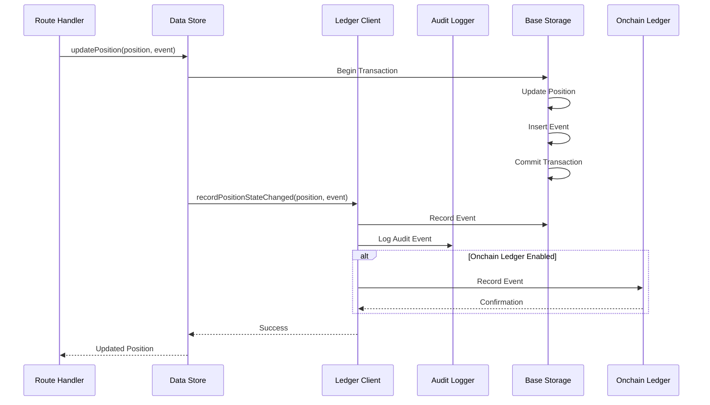
```mermaid
sequenceDiagram
participant Handler as Route Handler
participant Store as Data Store
participant Ledger as Ledger Client
participant Audit as Audit Logger
participant BaseStore as Base Storage
participant Onchain as Onchain Ledger
Handler->>Store : updatePosition(position, event)
Store->>BaseStore : Begin Transaction
BaseStore->>BaseStore : Update Position
BaseStore->>BaseStore : Insert Event
BaseStore->>BaseStore : Commit Transaction
Store->>Ledger : recordPositionStateChanged(position, event)
Ledger->>BaseStore : Record Event
Ledger->>Audit : Log Audit Event
alt Onchain Ledger Enabled
Ledger->>Onchain : Record Event
Onchain-->>Ledger : Confirmation
end
Ledger-->>Store : Success
Store-->>Handler : Updated Position
```

**Diagram sources**
- [src/api/positions.ts](file://src/api/positions.ts#L268-L271)
- [src/infra/ledgerClient.ts](file://src/infra/ledgerClient.ts#L17-L31)

**Section sources**
- [src/infra/ledgerClient.ts](file://src/infra/ledgerClient.ts#L1-L64)

## Audit Logging System

The audit logging system provides comprehensive tracking of all system activities with structured data and multiple storage backends for reliability and performance.

### Audit Event Structure

The audit system captures detailed information about each significant system operation:

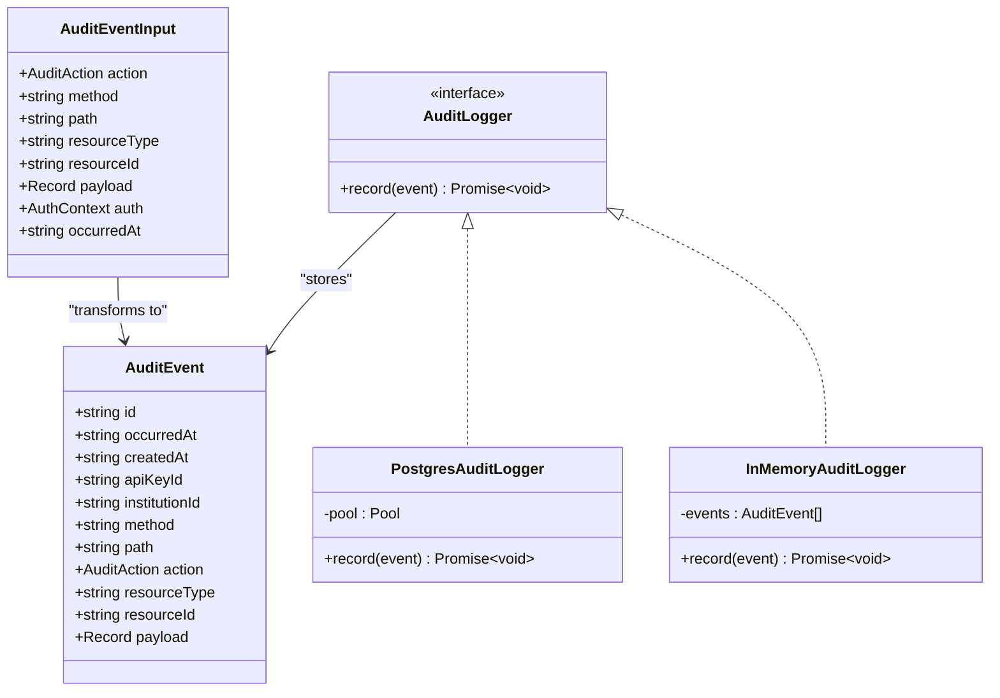
```mermaid
classDiagram
class AuditEvent {
+string id
+string occurredAt
+string createdAt
+string apiKeyId
+string institutionId
+string method
+string path
+AuditAction action
+string resourceType
+string resourceId
+Record payload
}
class AuditEventInput {
+AuditAction action
+string method
+string path
+string resourceType
+string resourceId
+Record payload
+AuthContext auth
+string occurredAt
}
class AuditLogger {
<<interface>>
+record(event) Promise~void~
}
class PostgresAuditLogger {
-pool : Pool
+record(event) Promise~void~
}
class InMemoryAuditLogger {
-events : AuditEvent[]
+record(event) Promise~void~
}
AuditEventInput --> AuditEvent : "transforms to"
AuditLogger <|.. PostgresAuditLogger
AuditLogger <|.. InMemoryAuditLogger
AuditLogger --> AuditEvent : "stores"
```

**Diagram sources**
- [src/domain/audit.ts](file://src/domain/audit.ts#L11-L35)
- [src/infra/auditLogger.ts](file://src/infra/auditLogger.ts#L13-L108)

### Audit Event Types

The platform tracks various types of system activities with appropriate metadata:

| Action Type | Trigger Conditions | Key Metadata |
|-------------|-------------------|--------------|
| **INSTITUTION_CREATED** | New institution registration | name, regions, verticals |
| **POSITION_CREATED** | New position creation | institutionId, assetId, amount |
| **POSITION_TRANSITIONED** | State change in position | fromState, toState, reason |
| **ASSET_CREATED** | New asset registration | templateId, label, metadata |
| **API_KEY_CREATED** | New API key generation | role, institutionId |

**Section sources**
- [src/domain/audit.ts](file://src/domain/audit.ts#L1-L36)
- [src/infra/auditLogger.ts](file://src/infra/auditLogger.ts#L1-L109)

## Error Handling and Transaction Boundaries

The platform implements comprehensive error handling with clear transaction boundaries to ensure data consistency and provide meaningful error responses to clients.

### Error Handling Strategy

The error handling system follows a consistent pattern across all API endpoints:

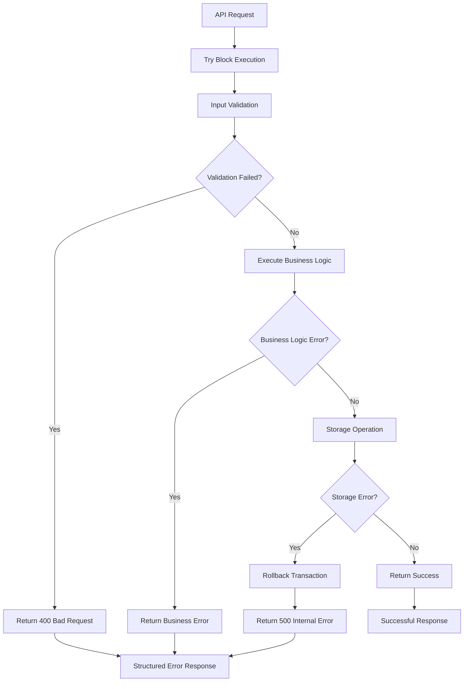
```mermaid
flowchart TD
Request[API Request] --> TryBlock["Try Block Execution"]
TryBlock --> ValidateInput["Input Validation"]
ValidateInput --> ValidationError{"Validation Failed?"}
ValidationError --> |Yes| BadRequest["Return 400 Bad Request"]
ValidationError --> |No| ExecuteLogic["Execute Business Logic"]
ExecuteLogic --> BusinessError{"Business Logic Error?"}
BusinessError --> |Yes| BusinessResponse["Return Business Error"]
BusinessError --> |No| StorageOp["Storage Operation"]
StorageOp --> StorageError{"Storage Error?"}
StorageError --> |Yes| RollbackTransaction["Rollback Transaction"]
StorageError --> |No| Success["Return Success"]
RollbackTransaction --> InternalError["Return 500 Internal Error"]
BadRequest --> ErrorResponse[Structured Error Response]
BusinessResponse --> ErrorResponse
InternalError --> ErrorResponse
Success --> SuccessResponse[Successful Response]
```

### Transaction Boundaries

The platform defines clear transaction boundaries to ensure consistency:

| Boundary Type | Scope | Rollback Trigger |
|---------------|-------|------------------|
| **HTTP Request** | Single API call | Any exception during request |
| **Position Update** | Position + Event | Database constraint violation |
| **Policy Upsert** | Single policy record | Conflict resolution failure |
| **Bulk Operations** | Multiple related records | Any individual failure |

**Section sources**
- [src/api/positions.ts](file://src/api/positions.ts#L145-L151)
- [src/store/postgresStore.ts](file://src/store/postgresStore.ts#L356-L409)

## Policy Enforcement

The policy enforcement system provides dynamic configuration-driven validation that adapts to institutional requirements and regulatory compliance needs.

### Policy Configuration Model

The policy system supports hierarchical configuration with institution and region-specific rules:

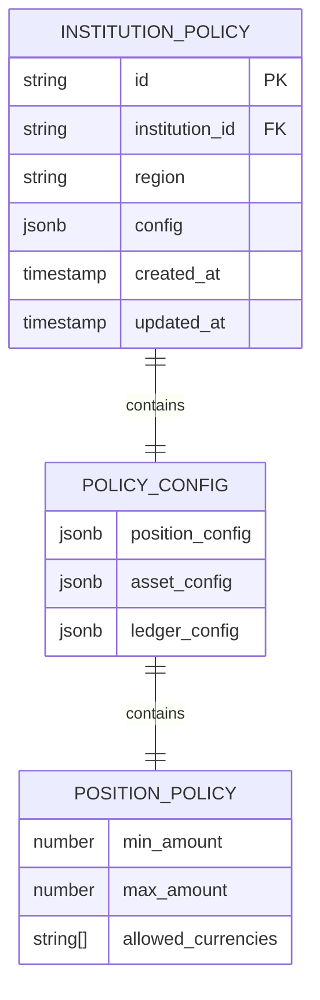
```mermaid
erDiagram
INSTITUTION_POLICY {
string id PK
string institution_id FK
string region
jsonb config
timestamp created_at
timestamp updated_at
}
POLICY_CONFIG {
jsonb position_config
jsonb asset_config
jsonb ledger_config
}
POSITION_POLICY {
number min_amount
number max_amount
string[] allowed_currencies
}
INSTITUTION_POLICY ||--|| POLICY_CONFIG : contains
POLICY_CONFIG ||--|| POSITION_POLICY : contains
```

**Diagram sources**
- [src/domain/policy.ts](file://src/domain/policy.ts#L1-L23)
- [src/infra/policyStore.ts](file://src/infra/policyStore.ts#L63-L132)

### Policy Enforcement Workflow

The policy enforcement process integrates seamlessly with business logic:

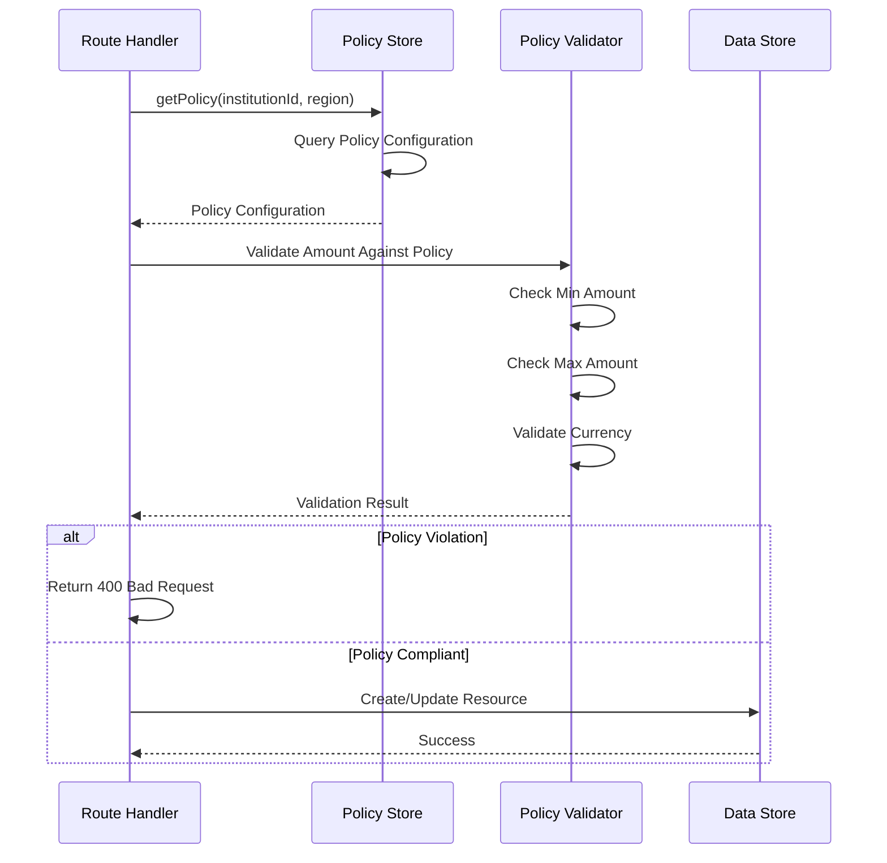
```mermaid
sequenceDiagram
participant Handler as Route Handler
participant PolicyStore as Policy Store
participant Validator as Policy Validator
participant Store as Data Store
Handler->>PolicyStore : getPolicy(institutionId, region)
PolicyStore->>PolicyStore : Query Policy Configuration
PolicyStore-->>Handler : Policy Configuration
Handler->>Validator : Validate Amount Against Policy
Validator->>Validator : Check Min Amount
Validator->>Validator : Check Max Amount
Validator->>Validator : Validate Currency
Validator-->>Handler : Validation Result
alt Policy Violation
Handler->>Handler : Return 400 Bad Request
else Policy Compliant
Handler->>Store : Create/Update Resource
Store-->>Handler : Success
end
```

**Diagram sources**
- [src/api/positions.ts](file://src/api/positions.ts#L75-L118)

**Section sources**
- [src/domain/policy.ts](file://src/domain/policy.ts#L1-L23)
- [src/infra/policyStore.ts](file://src/infra/policyStore.ts#L1-L133)

## Race Condition Prevention

The platform implements multiple strategies to prevent race conditions and ensure data consistency in concurrent environments.

### Concurrency Control Strategies

| Strategy | Implementation | Use Case |
|----------|----------------|----------|
| **Database Constraints** | Unique indexes, foreign keys | Prevent duplicate records |
| **Optimistic Locking** | Version timestamps | Detect concurrent modifications |
| **Explicit Transactions** | BEGIN/COMMIT blocks | Atomic multi-record operations |
| **Rate Limiting** | Per-API-key throttling | Reduce concurrent requests |
| **State Machine Validation** | Lifecycle transition rules | Prevent invalid state changes |

### Position State Transition Safety

The position lifecycle system prevents race conditions through state machine validation:

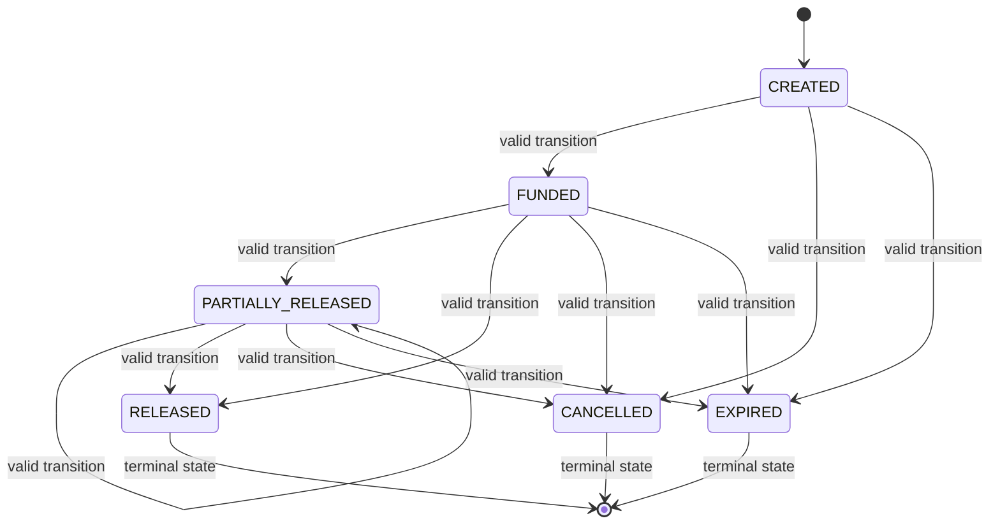
```mermaid
stateDiagram-v2
[*] --> CREATED
CREATED --> FUNDED : valid transition
CREATED --> CANCELLED : valid transition
CREATED --> EXPIRED : valid transition
FUNDED --> PARTIALLY_RELEASED : valid transition
FUNDED --> RELEASED : valid transition
FUNDED --> CANCELLED : valid transition
FUNDED --> EXPIRED : valid transition
PARTIALLY_RELEASED --> PARTIALLY_RELEASED : valid transition
PARTIALLY_RELEASED --> RELEASED : valid transition
PARTIALLY_RELEASED --> CANCELLED : valid transition
PARTIALLY_RELEASED --> EXPIRED : valid transition
RELEASED --> [*] : terminal state
CANCELLED --> [*] : terminal state
EXPIRED --> [*] : terminal state
```

**Diagram sources**
- [src/domain/lifecycle.ts](file://src/domain/lifecycle.ts#L3-L10)

### Transaction Isolation

The PostgreSQL store ensures isolation through explicit transaction management:

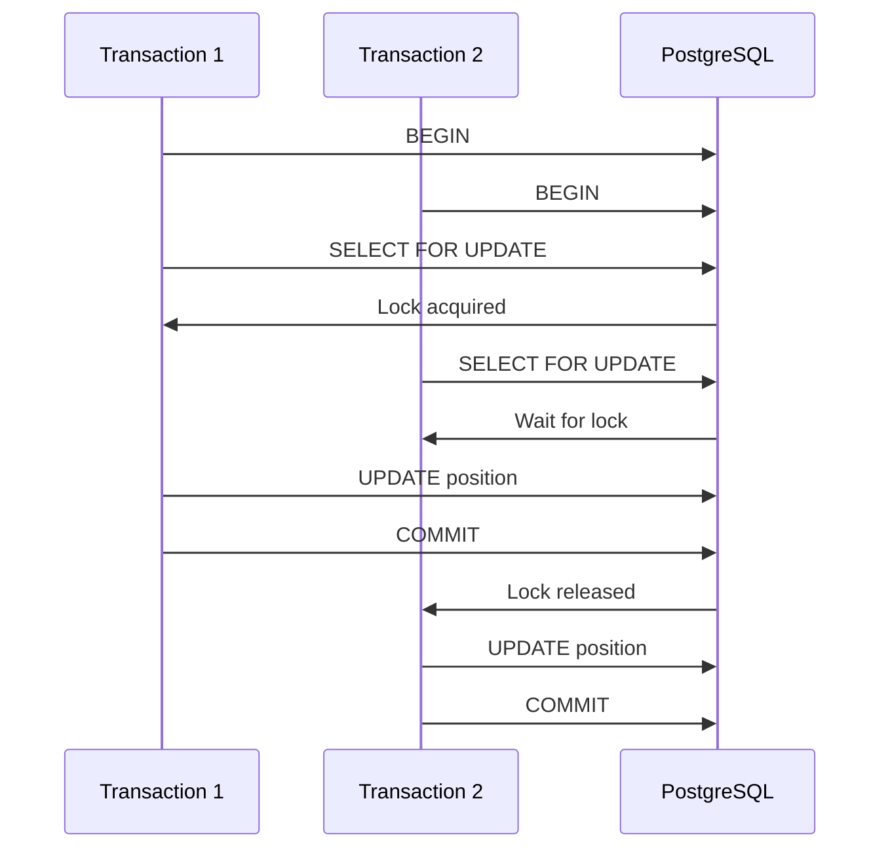
```mermaid
sequenceDiagram
participant T1 as Transaction 1
participant T2 as Transaction 2
participant DB as PostgreSQL
T1->>DB : BEGIN
T2->>DB : BEGIN
T1->>DB : SELECT FOR UPDATE
DB->>T1 : Lock acquired
T2->>DB : SELECT FOR UPDATE
DB->>T2 : Wait for lock
T1->>DB : UPDATE position
T1->>DB : COMMIT
DB->>T2 : Lock released
T2->>DB : UPDATE position
T2->>DB : COMMIT
```

**Section sources**
- [src/domain/lifecycle.ts](file://src/domain/lifecycle.ts#L1-L51)
- [src/store/postgresStore.ts](file://src/store/postgresStore.ts#L356-L409)

## Performance Considerations

The platform implements several performance optimization strategies to handle high-throughput scenarios while maintaining data consistency and system reliability.

### Caching Strategy

The system employs multi-level caching to reduce database load:

| Cache Level | Technology | Purpose | Expiration |
|-------------|------------|---------|------------|
| **Application Memory** | In-memory stores | Frequently accessed policies | TTL-based |
| **Database Connections** | Connection pooling | Reuse database connections | Connection timeout |
| **Query Results** | PostgreSQL query cache | Repeated queries | Statement-based |

### Indexing Strategy

The PostgreSQL implementation uses strategic indexing for optimal performance:

| Table | Index Type | Columns | Purpose |
|-------|------------|---------|---------|
| **positions** | Primary Key | id | Fast position lookup |
| **positions** | Composite | institution_id, asset_id | Filtered queries |
| **position_events** | Foreign Key | position_id | Event history queries |
| **institution_policies** | Unique | institution_id, region | Policy lookups |

### Asynchronous Processing

The platform handles long-running operations asynchronously:

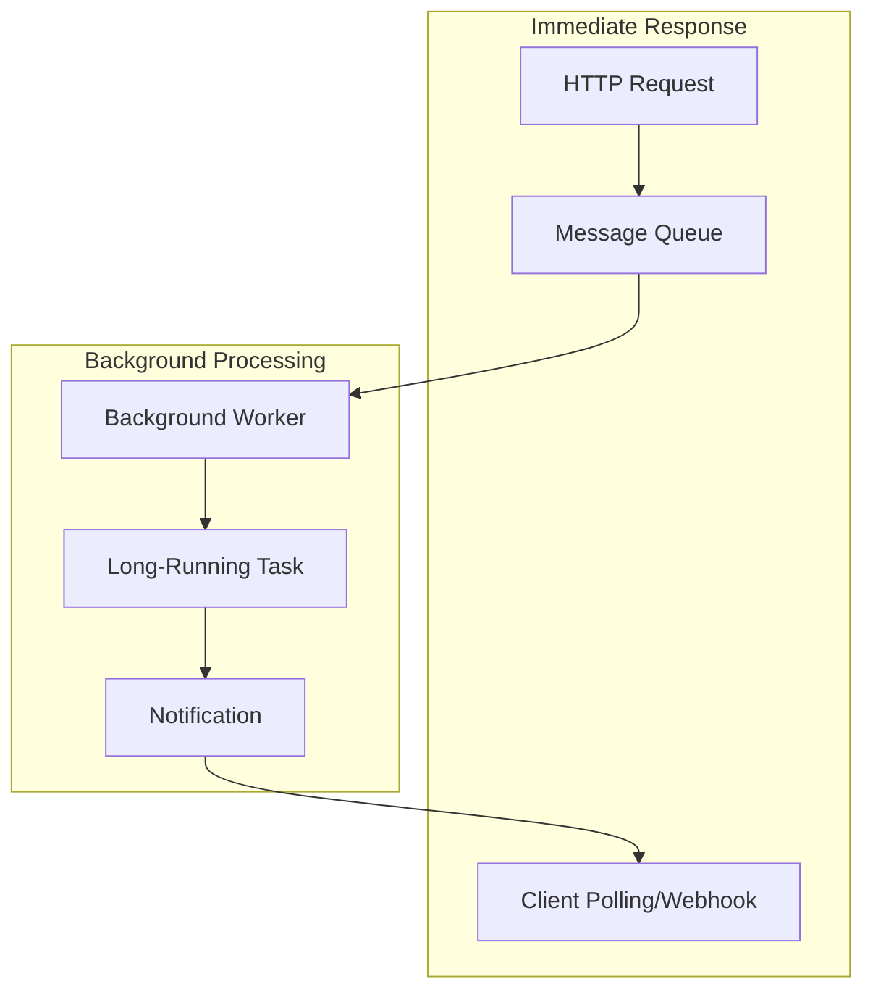
```mermaid
flowchart TD
Request[HTTP Request] --> Queue[Message Queue]
Queue --> Worker[Background Worker]
Worker --> Process[Long-Running Task]
Process --> Notify[Notification]
Notify --> Client[Client Polling/Webhook]
subgraph "Immediate Response"
Request
Queue
Client
end
subgraph "Background Processing"
Worker
Process
Notify
end
```

## Troubleshooting Guide

Common issues and their solutions in the escrowgrid platform data flow:

### Authentication Failures

**Symptoms**: 401 Unauthorized responses
**Causes**: Invalid API key, missing headers, expired tokens
**Solutions**: Verify API key format, check header casing, regenerate keys

### Rate Limiting Issues

**Symptoms**: 429 Too Many Requests responses
**Causes**: Exceeded request limits, misconfigured rate limits
**Solutions**: Implement exponential backoff, increase rate limits, use bulk operations

### Transaction Failures

**Symptoms**: 500 Internal Server errors, inconsistent data
**Causes**: Database connection issues, constraint violations, deadlock
**Solutions**: Implement retry logic, optimize queries, review transaction scope

### Policy Enforcement Errors

**Symptoms**: 400 Bad Request with policy violation messages
**Causes**: Invalid amount ranges, unsupported currencies, missing policies
**Solutions**: Configure appropriate policies, validate input data, check regional requirements

### Ledger Synchronization Issues

**Symptoms**: Audit logs out of sync, missing events
**Causes**: Network failures, onchain ledger issues, concurrent modifications
**Solutions**: Implement retry mechanisms, monitor ledger health, use idempotent operations

## Conclusion

The escrowgrid platform demonstrates a sophisticated approach to data flow architecture, combining modern design patterns with proven enterprise practices. The system successfully balances performance, consistency, and observability through:

- **Layered Architecture**: Clear separation of concerns enables maintainability and scalability
- **Event Sourcing**: Immutable audit trails provide transparency and compliance support
- **Policy-Driven Validation**: Dynamic configuration enables adaptability to changing requirements
- **Comprehensive Error Handling**: Structured error responses and transaction boundaries ensure reliability
- **Race Condition Prevention**: Multiple concurrency control mechanisms protect data integrity
- **Performance Optimization**: Strategic caching and indexing support high-throughput operations

The platform serves as an excellent example of how to build robust financial systems that can scale while maintaining the highest standards of security, compliance, and operational excellence. The modular design allows for easy extension and customization while preserving the core architectural principles that ensure system reliability and data integrity.