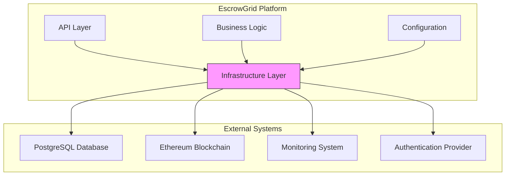
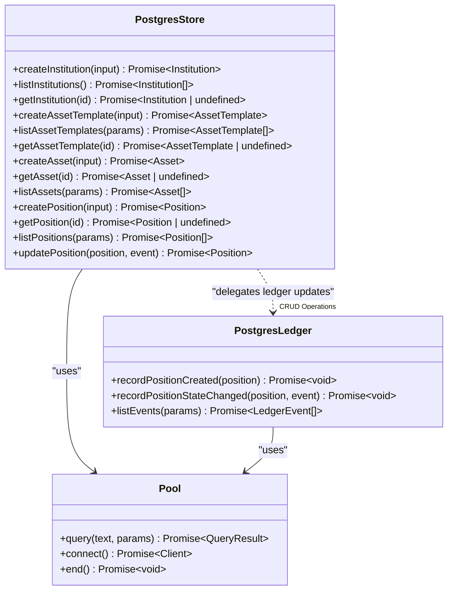
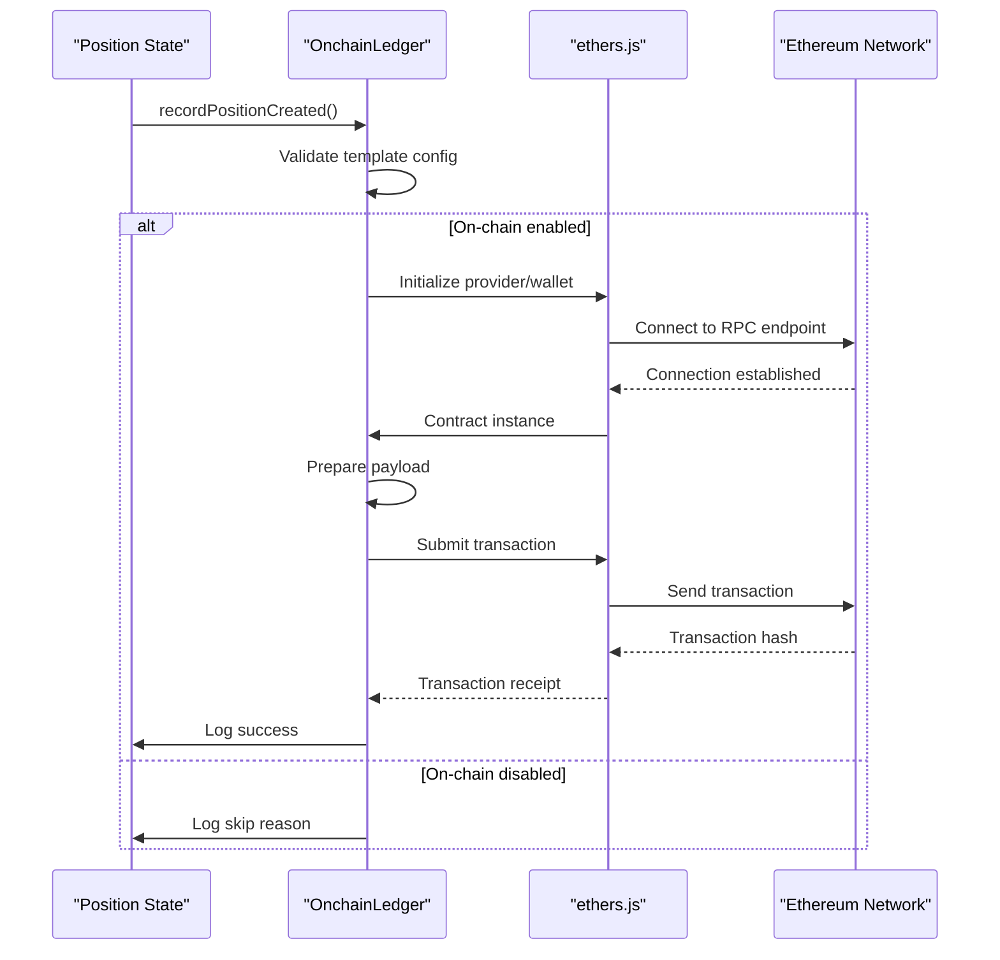
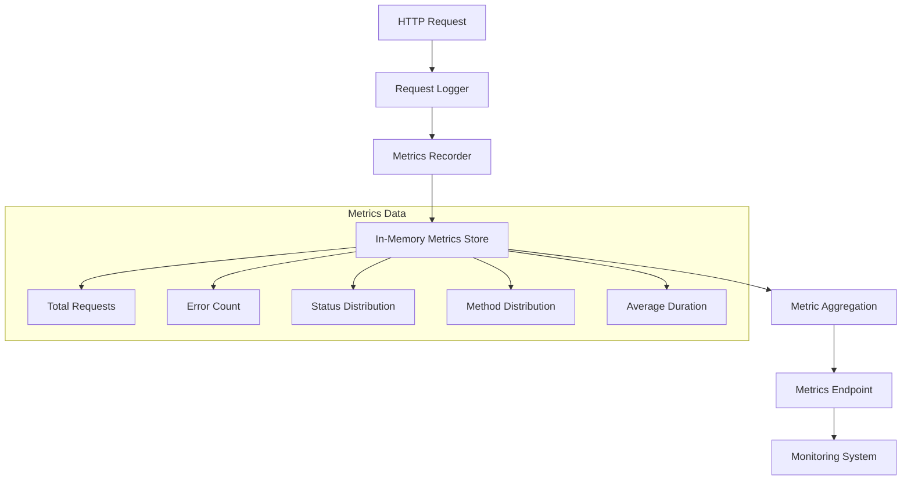
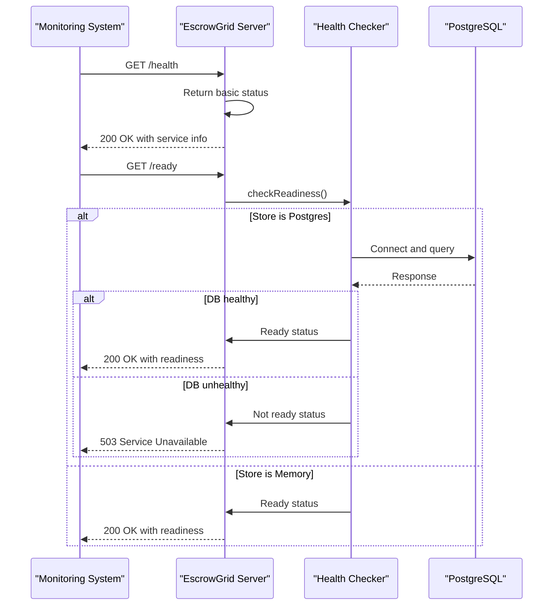
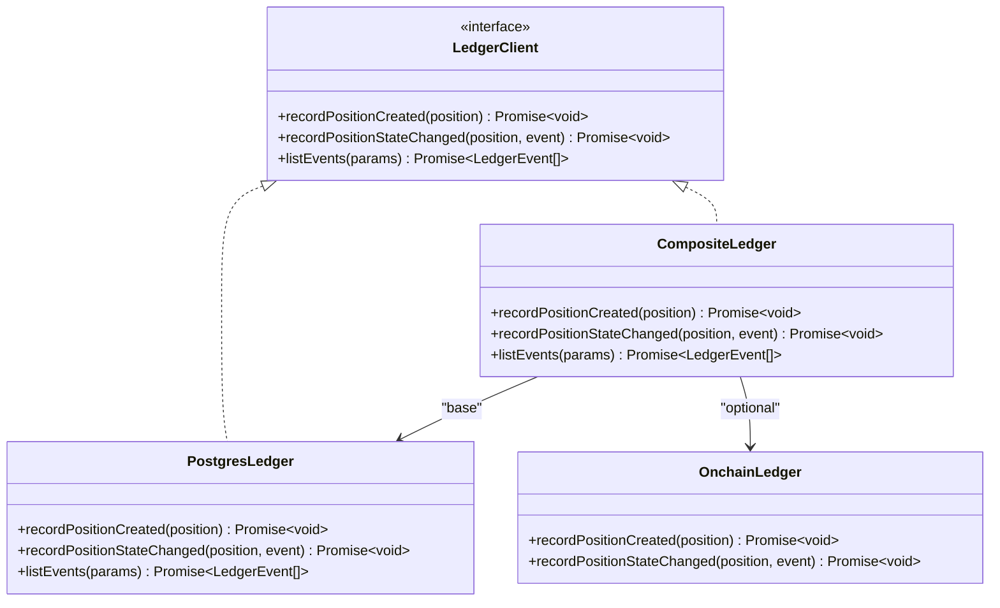
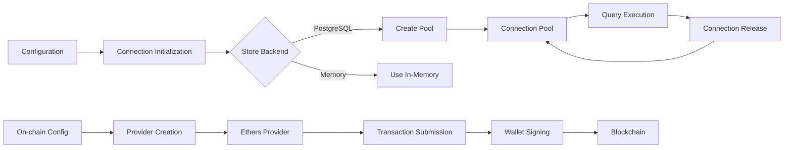
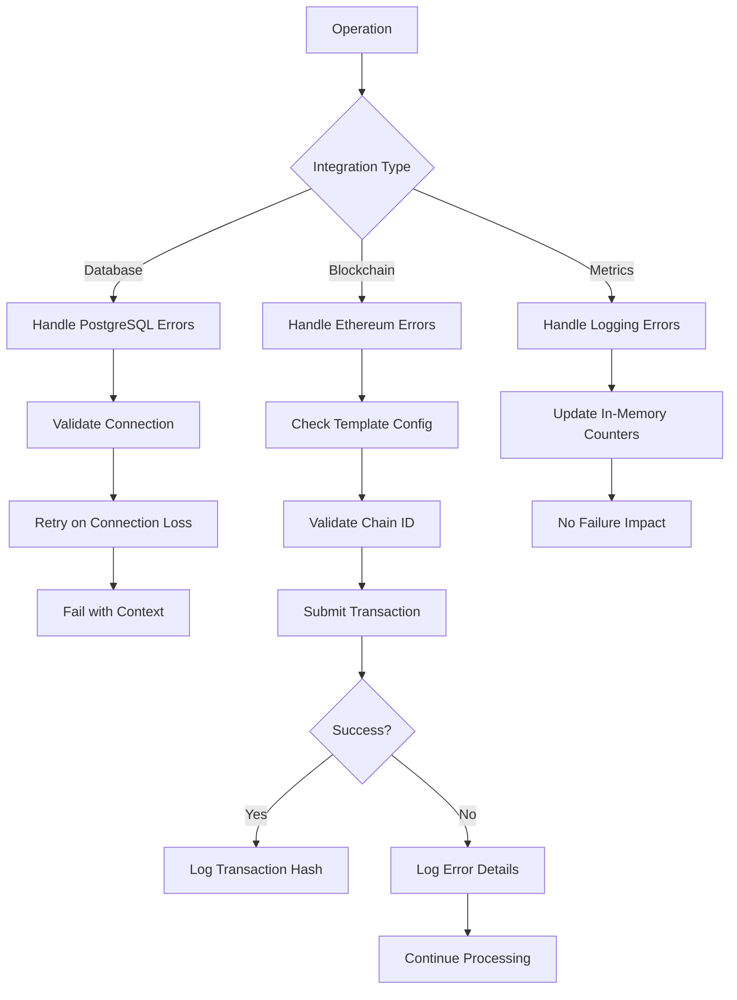
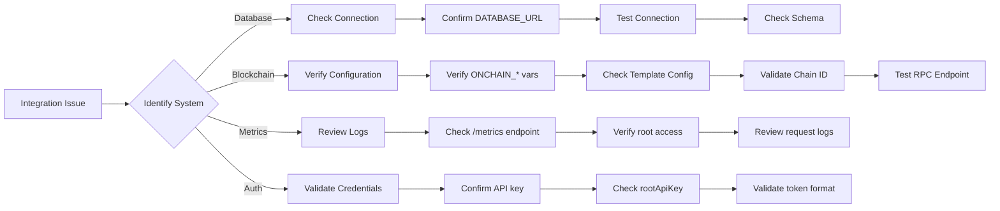

# Integration Patterns

<cite>
**Referenced Files in This Document**   
- [postgresLedger.ts](file://src/infra/postgresLedger.ts)
- [onchainLedger.ts](file://src/infra/onchainLedger.ts)
- [metrics.ts](file://src/infra/metrics.ts)
- [health.ts](file://src/infra/health.ts)
- [config.ts](file://src/config.ts)
- [ledgerClient.ts](file://src/infra/ledgerClient.ts)
- [postgresStore.ts](file://src/store/postgresStore.ts)
- [memoryStore.ts](file://src/store/memoryStore.ts)
- [metrics.ts](file://src/api/metrics.ts)
- [server.ts](file://src/server.ts)
- [schema.sql](file://db/schema.sql)
- [auth.ts](file://src/middleware/auth.ts)
</cite>

## Table of Contents
1. [Introduction](#introduction)
2. [Integration Architecture Overview](#integration-architecture-overview)
3. [PostgreSQL Database Integration](#postgresql-database-integration)
4. [Ethereum Blockchain Integration](#ethereum-blockchain-integration)
5. [Monitoring and Metrics Integration](#monitoring-and-metrics-integration)
6. [Health Check Endpoints](#health-check-endpoints)
7. [Abstraction Layer and Pluggable Integrations](#abstraction-layer-and-pluggable-integrations)
8. [Connection Management](#connection-management)
9. [Error Handling and Retry Strategies](#error-handling-and-retry-strategies)
10. [Integration Challenges and Debugging](#integration-challenges-and-debugging)

## Introduction
The EscrowGrid platform implements a modular integration architecture that enables seamless connectivity with external systems including PostgreSQL databases, Ethereum blockchain networks, monitoring endpoints, and authentication providers. This documentation details the integration patterns used throughout the system, focusing on the abstraction mechanisms, connection protocols, error handling strategies, and operational considerations for each integration type. The platform's design emphasizes pluggability, allowing different integration implementations to be composed based on configuration.

## Integration Architecture Overview

**Diagram sources**
- [server.ts](file://src/server.ts#L1-L100)
- [config.ts](file://src/config.ts#L1-L47)

The EscrowGrid integration architecture follows a layered approach where the infrastructure layer (infra directory) provides abstractions for external system integrations. The platform routes data through these integration points based on configuration, with the API layer and business logic components interacting with the infrastructure layer through well-defined interfaces rather than directly with external systems.

## PostgreSQL Database Integration

**Diagram sources**
- [postgresStore.ts](file://src/store/postgresStore.ts#L1-L417)
- [postgresLedger.ts](file://src/infra/postgresLedger.ts#L1-L108)
- [schema.sql](file://db/schema.sql#L1-L138)

**Section sources**
- [postgresStore.ts](file://src/store/postgresStore.ts#L1-L417)
- [postgresLedger.ts](file://src/infra/postgresLedger.ts#L1-L108)
- [schema.sql](file://db/schema.sql#L1-L138)

The PostgreSQL integration serves as the primary persistence mechanism for EscrowGrid, handling both operational data storage and ledger event recording. The integration uses the `pg` library to establish connections to the database, with connection strings provided through the `DATABASE_URL` environment variable. The schema includes tables for institutions, asset templates, assets, positions, position events, and ledger events, with appropriate indexes to optimize query performance.

The platform implements two primary integration points with PostgreSQL:
1. **Data Store**: The `PostgresStore` class provides CRUD operations for core entities (institutions, assets, positions) with referential integrity enforced through foreign key constraints.
2. **Ledger**: The `PostgresLedger` class records immutable ledger events for position lifecycle changes, providing an audit trail of all state transitions.

Connection management follows best practices with connection pooling configured through the `pg` library's `Pool` class. The system validates the presence of the database URL during initialization and establishes connections on-demand when operations are performed.

## Ethereum Blockchain Integration

**Diagram sources**
- [onchainLedger.ts](file://src/infra/onchainLedger.ts#L1-L221)
- [config.ts](file://src/config.ts#L1-L47)

**Section sources**
- [onchainLedger.ts](file://src/infra/onchainLedger.ts#L1-L221)
- [config.ts](file://src/config.ts#L1-L47)

The Ethereum blockchain integration enables EscrowGrid to record position lifecycle events on-chain through smart contract interactions. This integration uses the ethers.js library to connect to Ethereum-compatible networks via JSON-RPC endpoints. The integration is conditional and can be enabled or disabled per asset template through configuration.

Key integration components:
- **Configuration-driven**: Enabled via `ONCHAIN_LEDGER_ENABLED` environment variable, with RPC URL, private key, contract address, and chain ID provided through environment variables.
- **Template-level control**: Individual asset templates can enable or disable on-chain recording through their configuration, allowing granular control over which positions are recorded on-chain.
- **Chain ID validation**: The system validates that the configured chain ID matches the template's specified chain ID to prevent accidental cross-chain transactions.

The integration follows a conditional pattern where ledger events are only submitted to the blockchain when both the global on-chain ledger feature is enabled and the specific asset template has on-chain recording enabled. Error handling is comprehensive, with detailed logging of failures including network connectivity issues, contract method availability, and transaction submission errors.

## Monitoring and Metrics Integration

**Diagram sources**
- [metrics.ts](file://src/infra/metrics.ts#L1-L39)
- [metrics.ts](file://src/api/metrics.ts#L1-L18)
- [requestLogger.ts](file://src/middleware/requestLogger.ts#L1-L25)

**Section sources**
- [metrics.ts](file://src/infra/metrics.ts#L1-L39)
- [metrics.ts](file://src/api/metrics.ts#L1-L18)

The monitoring integration provides operational visibility into the EscrowGrid platform through a simple in-memory metrics collection system. The integration captures key performance indicators including request volume, error rates, status code distribution, HTTP method usage, and response duration metrics.

The metrics collection process:
1. Each HTTP request triggers the `recordRequestMetric` function in the infrastructure layer
2. Metrics are aggregated in memory using counters and duration tracking
3. The aggregated metrics are exposed through a dedicated `/metrics` endpoint
4. Access to metrics is restricted to root users for security

The implementation uses a straightforward in-memory storage model without persistence, making it suitable for short-term monitoring and debugging rather than long-term analytics. The metrics endpoint returns a JSON snapshot of the current metrics state, which can be consumed by external monitoring systems.

## Health Check Endpoints

**Diagram sources**
- [server.ts](file://src/server.ts#L27-L38)
- [health.ts](file://src/infra/health.ts#L1-L47)

**Section sources**
- [server.ts](file://src/server.ts#L27-L38)
- [health.ts](file://src/infra/health.ts#L1-L47)

The platform exposes two health check endpoints that serve different purposes in the deployment lifecycle:
- **/health**: A liveness probe that indicates whether the application process is running, regardless of its dependencies. This endpoint always returns 200 OK as long as the server is accepting connections.
- **/ready**: A readiness probe that verifies the application is ready to accept traffic by checking critical dependencies. When using PostgreSQL as the store backend, this endpoint validates database connectivity by executing a simple query.

The readiness check is conditional based on the configured store backend. For in-memory storage, the check always passes since there are no external dependencies. For PostgreSQL, the system establishes a temporary connection to verify database availability, properly closing the connection afterward to avoid pool exhaustion.

## Abstraction Layer and Pluggable Integrations

**Diagram sources**
- [ledger.ts](file://src/domain/ledger.ts#L1-L24)
- [postgresLedger.ts](file://src/infra/postgresLedger.ts#L1-L108)
- [onchainLedger.ts](file://src/infra/onchainLedger.ts#L1-L221)
- [ledgerClient.ts](file://src/infra/ledgerClient.ts#L1-L64)

**Section sources**
- [ledgerClient.ts](file://src/infra/ledgerClient.ts#L1-L64)
- [postgresLedger.ts](file://src/infra/postgresLedger.ts#L1-L108)
- [onchainLedger.ts](file://src/infra/onchainLedger.ts#L1-L221)

The infra directory provides a comprehensive abstraction layer that enables pluggable integrations throughout the EscrowGrid platform. This design pattern allows the system to support multiple integration implementations that can be composed based on configuration.

Key abstraction mechanisms:
- **Interface-based design**: Components define interfaces (e.g., `LedgerClient`) that specify the contract for integration points
- **Composite pattern**: The `CompositeLedger` class combines multiple ledger implementations, allowing position events to be recorded in multiple systems simultaneously
- **Configuration-driven composition**: The system assembles the appropriate integration components during initialization based on environment variables
- **Fallback and optional integrations**: Non-critical integrations (like on-chain ledger) are implemented as optional components that can fail without affecting core functionality

The abstraction layer decouples business logic from integration details, allowing the core domain logic to remain unaware of the specific implementation details of external systems. This enables features like recording ledger events to both PostgreSQL and Ethereum blockchain simultaneously, or switching between in-memory and database-backed storage without code changes.

## Connection Management

**Diagram sources**
- [config.ts](file://src/config.ts#L1-L47)
- [postgresStore.ts](file://src/store/postgresStore.ts#L1-L417)
- [onchainLedger.ts](file://src/infra/onchainLedger.ts#L1-L221)

**Section sources**
- [config.ts](file://src/config.ts#L1-L47)
- [postgresStore.ts](file://src/store/postgresStore.ts#L1-L417)
- [onchainLedger.ts](file://src/infra/onchainLedger.ts#L1-L221)

Connection management in EscrowGrid follows different patterns for different integration types:

**PostgreSQL**: Uses connection pooling via the `pg` library's `Pool` class. Connections are established on-demand when operations are performed and automatically managed by the pool. The system validates the database URL during component initialization and creates the pool with default configuration. For health checks, temporary connections are created and properly closed to avoid affecting the main pool.

**Ethereum**: Establishes a persistent connection to the JSON-RPC endpoint through ethers.js `JsonRpcProvider`. The provider, wallet, and contract instances are created during `OnchainLedger` initialization and reused for subsequent operations. The private key is used to instantiate a wallet that signs transactions locally before submission.

**Configuration-driven**: All connection parameters are derived from environment variables, allowing different connection settings for different deployment environments without code changes.

## Error Handling and Retry Strategies

**Diagram sources**
- [postgresLedger.ts](file://src/infra/postgresLedger.ts#L1-L108)
- [onchainLedger.ts](file://src/infra/onchainLedger.ts#L1-L221)
- [metrics.ts](file://src/infra/metrics.ts#L1-L39)

**Section sources**
- [onchainLedger.ts](file://src/infra/onchainLedger.ts#L1-L221)
- [postgresLedger.ts](file://src/infra/postgresLedger.ts#L1-L108)
- [metrics.ts](file://src/infra/metrics.ts#L1-L39)

The platform implements tailored error handling strategies for each integration type:

**PostgreSQL Integration**: Database operations use try-catch patterns with specific error handling for connection issues, query failures, and constraint violations. The system validates foreign key relationships and data integrity constraints at the application level before database operations. For health checks, connection errors are gracefully handled and reported in the readiness response.

**Ethereum Integration**: Comprehensive error handling with detailed logging of failure reasons including:
- Missing configuration parameters
- Asset or template not found
- On-chain recording disabled for template
- Chain ID mismatch
- Contract method availability
- Transaction submission failures

The integration follows a "best effort" approach where blockchain recording failures do not prevent the core business operation from completing. Errors are logged with detailed context for debugging, but the system continues processing.

**Metrics Integration**: The in-memory metrics system is designed to be failure-resistant. Since metrics collection is non-critical, errors in recording metrics do not affect the primary request processing flow. The implementation uses simple in-memory operations that are unlikely to fail.

The platform does not implement automated retry mechanisms for most integrations, relying instead on external systems to handle retries when necessary. For blockchain transactions, the responsibility for retrying failed transactions lies with the calling system rather than the platform itself.

## Integration Challenges and Debugging

**Diagram sources**
- [config.ts](file://src/config.ts#L1-L47)
- [auth.ts](file://src/middleware/auth.ts#L1-L95)
- [onchainLedger.ts](file://src/infra/onchainLedger.ts#L1-L221)
- [health.ts](file://src/infra/health.ts#L1-L47)

**Section sources**
- [config.ts](file://src/config.ts#L1-L47)
- [auth.ts](file://src/middleware/auth.ts#L1-L95)
- [onchainLedger.ts](file://src/infra/onchainLedger.ts#L1-L221)

Common integration challenges and debugging approaches:

**Configuration Issues**: The most common source of integration problems. Key areas to verify:
- `DATABASE_URL` for PostgreSQL connectivity
- `ONCHAIN_RPC_URL`, `ONCHAIN_PRIVATE_KEY`, and `ONCHAIN_CONTRACT_ADDRESS` for blockchain integration
- `STORE_BACKEND` setting to ensure correct store implementation is used
- Chain ID consistency between configuration and template settings

**Authentication Problems**: API access issues typically stem from:
- Missing or incorrect API key headers
- Revoked or invalid API keys
- Insufficient permissions for the requested operation
- Root API key not configured for metrics access

**Blockchain Integration Challenges**:
- Network connectivity to the RPC endpoint
- Insufficient funds in the signing wallet
- Smart contract not deployed at the specified address
- Chain ID mismatches between configuration and network
- Gas price or limit issues

**Debugging Tools and Techniques**:
- **Health endpoints**: Use `/ready` to verify database connectivity
- **Structured logging**: The system outputs JSON-formatted logs with type indicators (e.g., "onchain_ledger_skip", "onchain_ledger_error")
- **Metrics endpoint**: Access `/metrics` (with root credentials) to monitor request patterns and error rates
- **Schema verification**: Confirm database schema matches the expected structure using the SQL schema file
- **Configuration validation**: Verify all required environment variables are set before startup

The platform's modular design allows integrations to be tested and debugged independently, with clear separation between core business logic and external system interactions.