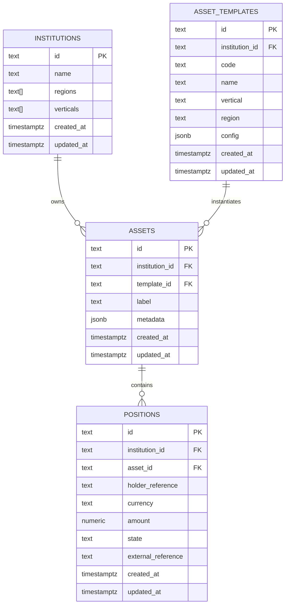
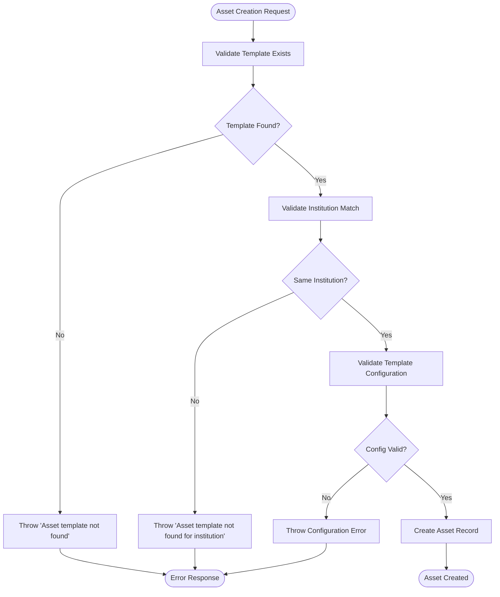
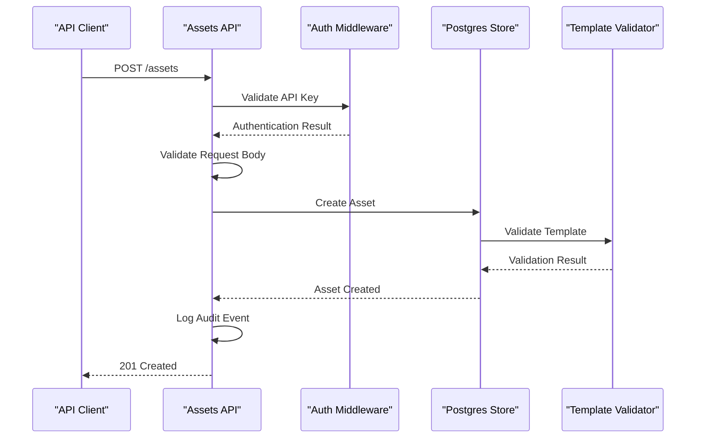

# Asset Model

<cite>
**Referenced Files in This Document**
- [db/schema.sql](file://db/schema.sql)
- [src/domain/types.ts](file://src/domain/types.ts)
- [src/api/assets.ts](file://src/api/assets.ts)
- [src/store/postgresStore.ts](file://src/store/postgresStore.ts)
- [src/store/store.ts](file://src/store/store.ts)
- [src/domain/verticals.ts](file://src/domain/verticals.ts)
- [README.md](file://README.md)
</cite>

## Table of Contents
1. [Introduction](#introduction)
2. [Database Schema](#database-schema)
3. [TypeScript Interface](#typescript-interface)
4. [Field Specifications](#field-specifications)
5. [Relationships](#relationships)
6. [Indexes and Performance](#indexes-and-performance)
7. [Data Validation](#data-validation)
8. [Sample Data](#sample-data)
9. [API Endpoints](#api-endpoints)
10. [Position Model Relationship](#position-model-relationship)
11. [Security and Access Control](#security-and-access-control)
12. [Best Practices](#best-practices)

## Introduction

The Asset model represents tokenized financial instruments instantiated from asset templates in the escrowgrid platform. Assets serve as the foundational building blocks for creating positions, which represent holder-specific claims on these financial instruments. Each asset encapsulates specific characteristics and metadata derived from its parent asset template while maintaining institutional context and unique identification.

Assets embody the concept of "a specific instance under an asset template," such as a particular project escrow or invoice program. They provide the bridge between standardized asset templates and individualized financial instruments that can be tracked and managed throughout their lifecycle.

## Database Schema

The Asset entity is defined in the PostgreSQL database schema with the following structure:



**Diagram sources**
- [db/schema.sql](file://db/schema.sql#L27-L35)
- [db/schema.sql](file://db/schema.sql#L3-L22)
- [db/schema.sql](file://db/schema.sql#L43-L53)

**Section sources**
- [db/schema.sql](file://db/schema.sql#L27-L35)

## TypeScript Interface

The Asset model is defined in the TypeScript domain types with the following interface:

```typescript
export interface Asset {
  id: string;
  institutionId: string;
  templateId: string;
  label: string;
  metadata: Record<string, unknown>;
  createdAt: string;
  updatedAt: string;
}
```

**Section sources**
- [src/domain/types.ts](file://src/domain/types.ts#L28-L36)

## Field Specifications

### id
- **Type**: `string` (TEXT in PostgreSQL)
- **Constraints**: Primary Key, Unique, Not Null
- **Format**: Generated using prefix 'ast' followed by random alphanumeric characters
- **Purpose**: Uniquely identifies each asset instance within the system
- **Generation**: Automatically generated using `generateId('ast')` function

### institutionId
- **Type**: `string` (TEXT in PostgreSQL)
- **Constraints**: Foreign Key, Not Null
- **Relationship**: References `institutions(id)`
- **Cascade Delete**: Enabled (ON DELETE CASCADE)
- **Purpose**: Associates the asset with its owning institution
- **Validation**: Must reference a valid institution record

### templateId
- **Type**: `string` (TEXT in PostgreSQL)
- **Constraints**: Foreign Key, Not Null
- **Relationship**: References `asset_templates(id)`
- **Cascade Delete**: Enabled (ON DELETE CASCADE)
- **Purpose**: Links the asset to its parent asset template
- **Validation**: Must reference a valid asset template belonging to the same institution

### label
- **Type**: `string` (TEXT in PostgreSQL)
- **Constraints**: Not Null
- **Purpose**: Human-readable identifier for the asset
- **Usage**: Typically represents a descriptive name like "Project Alpha Escrow"
- **Validation**: Required field during asset creation

### metadata
- **Type**: `Record<string, unknown>` (JSONB in PostgreSQL)
- **Constraints**: Not Null, JSONB type for flexible data storage
- **Purpose**: Extensible container for asset-specific configuration and tracking data
- **Structure**: Arbitrary JSON object containing custom fields
- **Example**: `{ "projectCode": "ALPHA-001", "contractValue": 1000000 }`

### createdAt
- **Type**: `string` (Timestamptz in PostgreSQL)
- **Constraints**: Not Null
- **Format**: ISO 8601 timestamp with timezone
- **Purpose**: Records the asset creation timestamp
- **Auto-population**: Automatically set during asset creation

### updatedAt
- **Type**: `string` (Timestamptz in PostgreSQL)
- **Constraints**: Not Null
- **Format**: ISO 8601 timestamp with timezone
- **Purpose**: Tracks last modification timestamp
- **Auto-update**: Updated automatically on asset modifications

**Section sources**
- [src/domain/types.ts](file://src/domain/types.ts#L28-L36)
- [src/store/postgresStore.ts](file://src/store/postgresStore.ts#L49-L58)

## Relationships

### Institution Relationship
Assets maintain a strict one-to-many relationship with institutions, ensuring that:
- Each asset belongs exclusively to one institution
- Institution ownership controls access to asset operations
- Cascade deletion ensures data integrity when institutions are removed

### Asset Template Relationship
Assets inherit from asset templates through a one-to-many relationship:
- Each asset instantiates exactly one asset template
- Template configuration defines the asset's capabilities and constraints
- Cross-institution template access is prohibited for security

### Position Relationship
Assets serve as the foundation for position creation:
- Many positions can reference a single asset
- Positions inherit institutional context from their parent asset
- Asset metadata influences position behavior and validation

**Section sources**
- [db/schema.sql](file://db/schema.sql#L28-L35)
- [src/store/postgresStore.ts](file://src/store/postgresStore.ts#L191-L204)

## Indexes and Performance

The Asset table implements strategic indexing for optimal query performance:

### Primary Key Index
- **Index**: `PRIMARY KEY (id)`
- **Purpose**: Fast lookups by asset ID
- **Performance**: O(log n) for point queries

### Institutional Index
- **Index**: `idx_assets_institution (institution_id)`
- **Purpose**: Efficient filtering by institution
- **Usage**: Common queries for institutional asset listings
- **Performance**: O(log n) for range queries

### Template Index
- **Index**: `idx_assets_template (template_id)`
- **Purpose**: Fast template-based asset queries
- **Usage**: Finding assets by template type
- **Performance**: O(log n) for point queries

### Composite Queries
The combination of these indexes enables efficient:
- Institutional asset listings with template filtering
- Template-based asset discovery
- Cross-reference queries between assets and positions

**Section sources**
- [db/schema.sql](file://db/schema.sql#L37-L41)

## Data Validation

### Template Validation
Assets undergo comprehensive validation during creation:



**Diagram sources**
- [src/store/postgresStore.ts](file://src/store/postgresStore.ts#L197-L204)

### Field Validation Rules
- **Required Fields**: templateId, label
- **Institution Consistency**: Template must belong to the same institution
- **Template Type Validation**: Based on vertical (CONSTRUCTION vs TRADE_FINANCE)
- **Metadata Validation**: JSONB structure validation based on template configuration

### Trade Finance Template Validation
Specific validation rules apply to Trade Finance templates:

| Template Code | Required Fields | Validation Rules |
|---------------|----------------|------------------|
| TF_INVOICE | currency, maxTenorDays, country | currency: string, maxTenorDays: positive number, country: string |
| TF_LC | currency, issuingBankCountry, maxTenorDays | currency: string, issuingBankCountry: string, maxTenorDays: positive number |

**Section sources**
- [src/store/postgresStore.ts](file://src/store/postgresStore.ts#L197-L204)
- [src/domain/verticals.ts](file://src/domain/verticals.ts#L87-L123)

## Sample Data

### Trade Finance Invoice Asset Example

Here's a concrete example of an asset created from a Trade Finance invoice template:

```json
{
  "id": "ast_abc123def456",
  "institutionId": "inst_bankxyz",
  "templateId": "tmpl_tf_invoice_001",
  "label": "Supplier Invoice #INV-2024-001",
  "metadata": {
    "invoiceNumber": "INV-2024-001",
    "supplierName": "Global Manufacturing Co.",
    "purchaseOrder": "PO-2024-1234",
    "dueDate": "2024-12-15",
    "additionalTerms": "30-day payment terms",
    "internalReference": "FIN-2024-001"
  },
  "createdAt": "2024-11-15T09:30:00.000Z",
  "updatedAt": "2024-11-15T09:30:00.000Z"
}
```

### Trade Finance Letter of Credit Asset Example

```json
{
  "id": "ast_lc_789ghi012",
  "institutionId": "inst_bankxyz",
  "templateId": "tmpl_tf_lc_002",
  "label": "LC-2024-002 - Export Contract",
  "metadata": {
    "lcNumber": "LC-2024-002",
    "beneficiaryName": "Export Corp Ltd.",
    "shipmentDetails": {
      "portOfLoading": "Shanghai",
      "portOfDestination": "New York",
      "estimatedShipmentDate": "2024-12-01"
    },
    "documentsRequired": ["Commercial Invoice", "Bill of Lading", "Insurance Certificate"],
    "paymentTerms": "Documents against Payment"
  },
  "createdAt": "2024-11-15T10:15:00.000Z",
  "updatedAt": "2024-11-15T10:15:00.000Z"
}
```

**Section sources**
- [README.md](file://README.md#L170-L181)

## API Endpoints

### Asset Management Endpoints

The Asset model exposes several REST endpoints for CRUD operations:

#### GET /assets
- **Purpose**: Retrieve assets with optional filtering
- **Parameters**: `institutionId` (optional), `templateId` (optional)
- **Response**: Array of Asset objects
- **Authentication**: Requires valid API key with appropriate permissions

#### GET /assets/:id
- **Purpose**: Retrieve a specific asset by ID
- **Response**: Single Asset object
- **Authentication**: Requires valid API key with access to the asset's institution

#### POST /assets
- **Purpose**: Create a new asset instance
- **Request Body**: Asset creation data including templateId, label, and optional metadata
- **Response**: Created Asset object with 201 status
- **Authentication**: Requires write access API key

### Request Validation

The API enforces comprehensive validation:



**Diagram sources**
- [src/api/assets.ts](file://src/api/assets.ts#L17-L88)

**Section sources**
- [src/api/assets.ts](file://src/api/assets.ts#L91-L145)

## Position Model Relationship

Assets serve as the foundational entity for position creation, establishing a hierarchical relationship:

### Asset-Position Hierarchy
- **Assets**: Represent tokenized financial instruments
- **Positions**: Represent holder-specific claims on assets
- **Relationship**: One-to-many (one asset can have many positions)

### Position Creation Constraints
When creating positions:
- The asset must belong to the requesting institution
- The asset template configuration applies validation rules
- Position metadata inherits from asset metadata where appropriate

### Lifecycle Integration
- Assets define the scope and capabilities of positions
- Position states reflect the asset's operational context
- Asset metadata influences position behavior and reporting

**Section sources**
- [db/schema.sql](file://db/schema.sql#L43-L53)

## Security and Access Control

### Institutional Isolation
Assets enforce strict institutional boundaries:
- Root API keys can access all assets across institutions
- Institution API keys can only access assets within their own institution
- Cross-institution asset access is prohibited

### Template Access Control
- Assets can only reference templates from their own institution
- Template visibility is restricted to authorized institutions
- Template configuration validation prevents unauthorized access patterns

### Audit Logging
All asset operations are audited:
- Asset creation events log template and label information
- Asset access events track institutional context
- Modification events capture change details

**Section sources**
- [src/api/assets.ts](file://src/api/assets.ts#L138-L140)

## Best Practices

### Asset Naming Conventions
- Use descriptive, human-readable labels
- Include identifying information (project codes, contract numbers)
- Maintain consistency across institutional standards

### Metadata Organization
- Structure metadata for easy querying and reporting
- Include business-relevant identifiers
- Maintain backward compatibility for evolving requirements

### Template Selection
- Choose appropriate asset templates based on financial instrument type
- Ensure template configuration aligns with regulatory requirements
- Consider future expansion possibilities in template selection

### Performance Optimization
- Leverage institutional indexing for efficient queries
- Use template filtering for targeted asset discovery
- Implement caching strategies for frequently accessed assets

### Security Considerations
- Validate all incoming asset data
- Enforce institutional boundaries consistently
- Monitor asset creation patterns for anomalies
- Implement proper audit logging for compliance