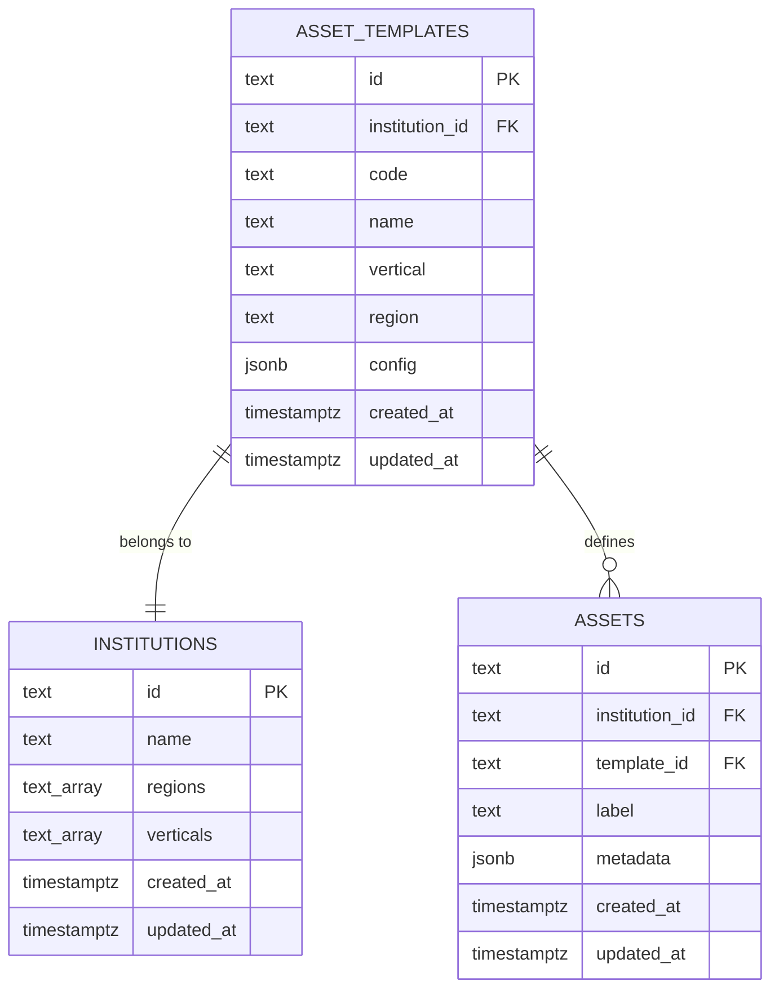
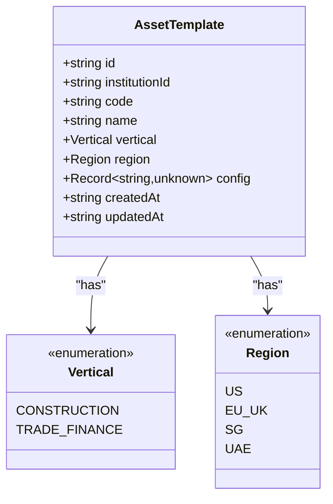
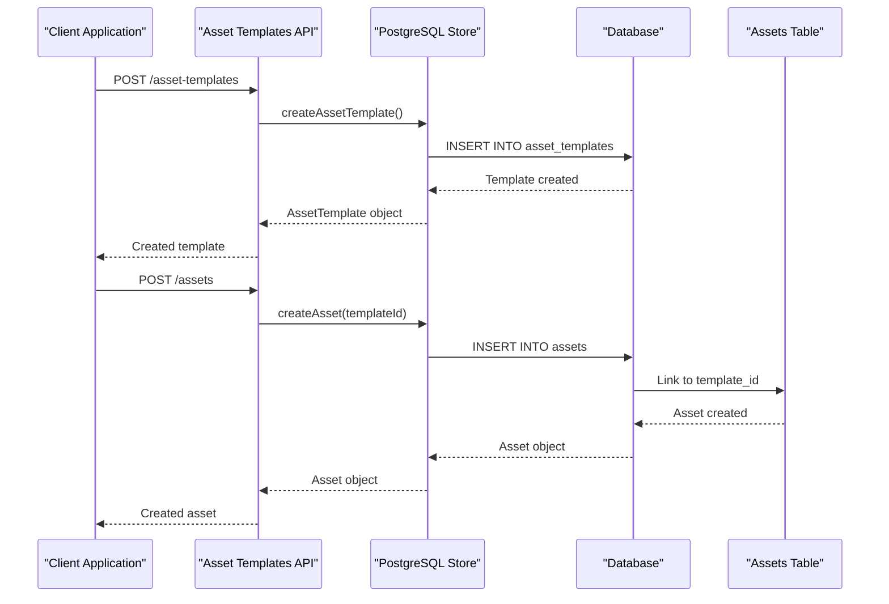
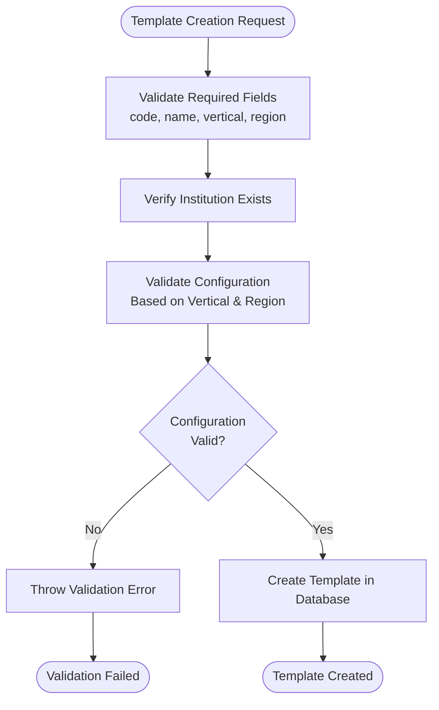

# Asset Template Model

<cite>
**Referenced Files in This Document**
- [schema.sql](file://db/schema.sql)
- [types.ts](file://src/domain/types.ts)
- [assetTemplates.ts](file://src/api/assetTemplates.ts)
- [postgresStore.ts](file://src/store/postgresStore.ts)
- [verticals.ts](file://src/domain/verticals.ts)
- [App.tsx](file://admin-console/src/App.tsx)
- [api.test.ts](file://src/__tests__/api.test.ts)
- [api.postgres.test.ts](file://src/__tests__/api.postgres.test.ts)
- [README.md](file://README.md)
</cite>

## Table of Contents
1. [Introduction](#introduction)
2. [Database Schema](#database-schema)
3. [TypeScript Interface](#typescript-interface)
4. [Field Specifications](#field-specifications)
5. [Relationships](#relationships)
6. [Validation Rules](#validation-rules)
7. [Sample Data](#sample-data)
8. [Use Cases](#use-cases)
9. [Implementation Details](#implementation-details)
10. [Best Practices](#best-practices)

## Introduction

The AssetTemplate entity serves as a blueprint for creating standardized financial assets within the escrowgrid platform. These templates define reusable configurations that institutions can use to create assets with consistent structures, validation rules, and compliance requirements. Asset templates are region- and vertical-specific, ensuring that financial instruments adhere to regulatory frameworks and industry standards.

## Database Schema

The AssetTemplate entity is defined in the database schema with the following structure:



**Diagram sources**
- [schema.sql](file://db/schema.sql#L12-L22)

**Section sources**
- [schema.sql](file://db/schema.sql#L12-L22)

## TypeScript Interface

The AssetTemplate interface defines the TypeScript representation of the entity:



**Diagram sources**
- [types.ts](file://src/domain/types.ts#L16-L25)

**Section sources**
- [types.ts](file://src/domain/types.ts#L16-L25)

## Field Specifications

### Primary Key and Identity
- **id**: Unique identifier for the asset template, automatically generated using the format `tmpl_<random_string>`
- **Primary Key**: Yes, enforced at the database level

### Foreign Key Relationships
- **institutionId**: References `institutions(id)` with cascade delete behavior
- **Foreign Key Constraint**: Enforced at the database level for referential integrity

### Indexes
- **idx_asset_templates_institution**: Composite index on `(institution_id)` for query performance optimization

### Core Fields

| Field | Type | Constraints | Business Meaning |
|-------|------|-------------|------------------|
| **id** | string | Primary Key, auto-generated | Unique template identifier |
| **institutionId** | string | Foreign Key, Not Null | Associated institution reference |
| **code** | string | Not Null | Template classification code (e.g., TF_INVOICE, CONSTR_ESCROW) |
| **name** | string | Not Null | Human-readable template name |
| **vertical** | Vertical | Not Null, Enum | Industry vertical (CONSTRUCTION, TRADE_FINANCE) |
| **region** | Region | Not Null, Enum | Geographic region (US, EU_UK, SG, UAE) |
| **config** | JSONB | Not Null | Flexible configuration data for asset-specific parameters |
| **createdAt** | string | Timestamp, Auto-set | Template creation timestamp |
| **updatedAt** | string | Timestamp, Auto-update | Last modification timestamp |

### Configuration Field (JSONB)
The `config` field uses PostgreSQL's JSONB data type to provide flexible, schema-less configuration per asset type:

- **Flexible Schema**: Allows different configuration structures for different asset types
- **Type Safety**: Typed as `Record<string, unknown>` in TypeScript
- **Validation**: Enforced through runtime validation logic
- **Storage Efficiency**: Optimized storage and indexing capabilities

**Section sources**
- [schema.sql](file://db/schema.sql#L12-L22)
- [types.ts](file://src/domain/types.ts#L16-L25)

## Relationships

### One-to-Many Relationship with Assets
Each AssetTemplate can be used to create multiple Assets through the `template_id` foreign key relationship:



**Diagram sources**
- [postgresStore.ts](file://src/store/postgresStore.ts#L127-L167)
- [postgresStore.ts](file://src/store/postgresStore.ts#L191-L224)

### Cascade Delete Behavior
When an institution is deleted, all associated asset templates and their dependent assets are automatically removed through cascade delete constraints.

**Section sources**
- [schema.sql](file://db/schema.sql#L28-L35)
- [postgresStore.ts](file://src/store/postgresStore.ts#L127-L167)

## Validation Rules

### Template Configuration Validation
The platform enforces strict validation rules for asset template configurations based on vertical and region:

#### Construction Vertical Rules
- **CONSTR_ESCROW**: Requires currency, region, and optional min/max amounts
- **CONSTR_RETAINAGE**: Requires currency and retainage percentage (0-100%)

#### Trade Finance Vertical Rules  
- **TF_INVOICE**: Requires currency, maxTenorDays, and country
- **TF_LC**: Requires currency, issuingBankCountry, and maxTenorDays

### Regional and Vertical Specificity
- Templates must be specific to one vertical and region combination
- Configuration parameters must align with the template's vertical and region
- Cross-validation ensures compliance with regulatory requirements



**Diagram sources**
- [verticals.ts](file://src/domain/verticals.ts#L32-L45)
- [postgresStore.ts](file://src/store/postgresStore.ts#L135-L145)

**Section sources**
- [verticals.ts](file://src/domain/verticals.ts#L32-L125)
- [assetTemplates.ts](file://src/api/assetTemplates.ts#L35-L41)

## Sample Data

### Trade Finance Asset Template Example

Here's a concrete example of a Trade Finance invoice template in the US region:

```json
{
  "id": "tmpl_abc123def456",
  "institutionId": "inst_xyz789ghi012",
  "code": "TF_INVOICE",
  "name": "US Trade Invoice Financing",
  "vertical": "TRADE_FINANCE",
  "region": "US",
  "config": {
    "currency": "USD",
    "maxTenorDays": 180,
    "country": "United States",
    "issuingBankCountry": "United States",
    "minimumAmount": 10000,
    "maximumAmount": 1000000,
    "interestRate": 2.5,
    "complianceChecks": true
  },
  "createdAt": "2024-01-15T10:30:00.000Z",
  "updatedAt": "2024-01-15T10:30:00.000Z"
}
```

### Construction Asset Template Example

```json
{
  "id": "tmpl_constr567",
  "institutionId": "inst_financial123",
  "code": "CONSTR_ESCROW",
  "name": "US Construction Escrow",
  "vertical": "CONSTRUCTION", 
  "region": "US",
  "config": {
    "currency": "USD",
    "region": "US",
    "minAmount": 50000,
    "maxAmount": 5000000,
    "jurisdiction": "California",
    "insuranceRequired": true,
    "releaseConditions": [
      "Completion Certificate",
      "Final Inspection Passed"
    ]
  },
  "createdAt": "2024-01-10T09:15:00.000Z",
  "updatedAt": "2024-01-10T09:15:00.000Z"
}
```

**Section sources**
- [api.test.ts](file://src/__tests__/api.test.ts#L61-L67)
- [api.postgres.test.ts](file://src/__tests__/api.postgres.test.ts#L87-L94)

## Use Cases

### Asset Tokenization
Asset templates enable standardized tokenization processes by providing predefined structures for digital asset creation:

- **Standardized Metadata**: Consistent asset attributes across tokenized offerings
- **Regulatory Compliance**: Built-in compliance checks based on regional regulations
- **Risk Management**: Predefined risk parameters and limits

### Compliance Enforcement
Templates enforce compliance requirements through configuration validation:

- **Geographic Restrictions**: Region-specific compliance requirements
- **Industry Standards**: Vertical-specific regulatory frameworks
- **Risk Controls**: Automated validation of risk parameters

### Operational Efficiency
Templates streamline asset creation and management:

- **Reusability**: Standard configurations reduce setup time
- **Consistency**: Uniform asset structures across institutions
- **Audit Trail**: Complete history of template usage and modifications

### Multi-Regional Operations
Institutions can maintain separate templates for different regions while sharing common structures:

- **Regional Adaptation**: Local regulatory requirements per region
- **Currency Flexibility**: Different currencies per geographic area
- **Compliance Localization**: Region-specific compliance checks

**Section sources**
- [README.md](file://README.md#L68-L92)

## Implementation Details

### API Endpoints
The platform provides RESTful APIs for asset template management:

| Endpoint | Method | Purpose | Authentication |
|----------|--------|---------|----------------|
| `/asset-templates` | GET | List templates for an institution | Institution Admin |
| `/asset-templates` | POST | Create a new template | Institution Admin |
| `/asset-templates/:id` | GET | Retrieve specific template | Institution Admin |

### Database Operations
Template operations are handled through the PostgreSQL store implementation:

- **CRUD Operations**: Full create, read, update, delete functionality
- **Query Optimization**: Indexed queries for efficient template retrieval
- **Transaction Safety**: Atomic operations with proper error handling

### Frontend Integration
The admin console demonstrates practical usage patterns:

- **Template Selection**: Dropdown menus for template selection
- **Configuration Display**: Dynamic form generation based on template type
- **Real-time Validation**: Client-side validation before API submission

**Section sources**
- [assetTemplates.ts](file://src/api/assetTemplates.ts#L19-L146)
- [postgresStore.ts](file://src/store/postgresStore.ts#L127-L188)
- [App.tsx](file://admin-console/src/App.tsx#L458-L498)

## Best Practices

### Template Design Guidelines
- **Specificity**: Create templates that are specific to particular use cases
- **Documentation**: Provide clear naming conventions and documentation
- **Versioning**: Consider template versioning for regulatory changes
- **Testing**: Thoroughly test configurations before production deployment

### Security Considerations
- **Access Control**: Limit template creation to authorized administrators
- **Validation**: Implement comprehensive input validation
- **Audit Logging**: Maintain audit trails for all template operations
- **Principle of Least Privilege**: Grant minimal necessary permissions

### Performance Optimization
- **Index Usage**: Leverage database indexes for efficient queries
- **Batch Operations**: Use batch operations for bulk template management
- **Caching**: Implement caching strategies for frequently accessed templates
- **Monitoring**: Monitor template usage patterns for optimization opportunities

### Compliance Management
- **Regulatory Updates**: Regular review and update of template configurations
- **Cross-Validation**: Implement multi-layer validation checks
- **Documentation**: Maintain comprehensive compliance documentation
- **Training**: Ensure staff understand template requirements and limitations