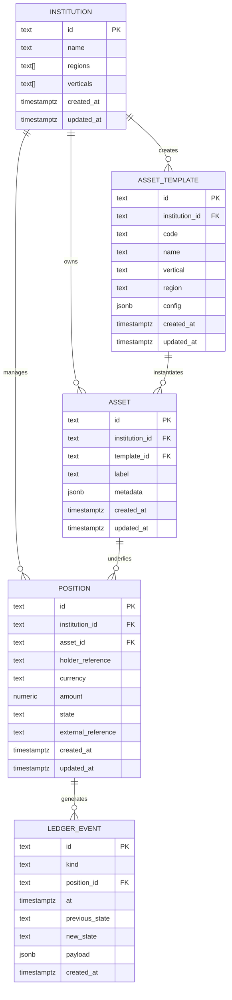
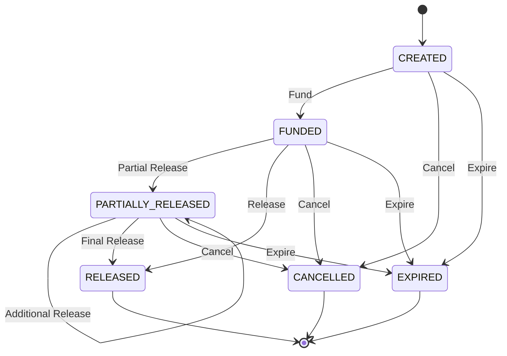

# Data Models & Database Schema

<cite>
**Referenced Files in This Document**   
- [schema.sql](file://db/schema.sql)
- [types.ts](file://src/domain/types.ts)
- [postgresStore.ts](file://src/store/postgresStore.ts)
- [lifecycle.ts](file://src/domain/lifecycle.ts)
- [verticals.ts](file://src/domain/verticals.ts)
- [policyStore.ts](file://src/infra/policyStore.ts)
</cite>

## Table of Contents
1. [Introduction](#introduction)
2. [Core Entities](#core-entities)
3. [Entity Relationships](#entity-relationships)
4. [Business Rules and Validation Logic](#business-rules-and-validation-logic)
5. [Data Access Patterns](#data-access-patterns)
6. [Sample Data Records](#sample-data-records)
7. [Data Lifecycle and Retention](#data-lifecycle-and-retention)
8. [Data Security and Access Control](#data-security-and-access-control)
9. [Migration Strategies](#migration-strategies)

## Introduction
The escrowgrid platform provides a structured data model for managing financial escrow positions across institutions, assets, and regulatory regions. This document details the core data entities, their relationships, constraints, and business logic. The system uses PostgreSQL as the primary data store with a well-defined schema that supports multi-tenancy, auditability, and policy enforcement. The data model is implemented through TypeScript interfaces that mirror the database structure, ensuring type safety across the application.

**Section sources**
- [schema.sql](file://db/schema.sql#L1-L138)
- [types.ts](file://src/domain/types.ts#L1-L85)

## Core Entities

### Institution
The Institution entity represents a financial or corporate entity that participates in the escrow platform. Each institution operates within specific geographic regions and business verticals.

**Field Definitions**
- `id`: Unique identifier (TEXT, Primary Key)
- `name`: Institution name (TEXT, NOT NULL)
- `regions`: Array of supported regions (TEXT[], NOT NULL) - Valid values: US, EU_UK, SG, UAE
- `verticals`: Array of supported business verticals (TEXT[], NOT NULL) - Valid values: CONSTRUCTION, TRADE_FINANCE
- `created_at`: Creation timestamp (TIMESTAMPTZ, NOT NULL)
- `updated_at`: Last update timestamp (TIMESTAMPTZ, NOT NULL)

**Constraints**
- Primary Key: id
- No additional constraints beyond NOT NULL requirements

**Indexes**
- None explicitly defined beyond primary key

**Section sources**
- [schema.sql](file://db/schema.sql#L3-L10)
- [types.ts](file://src/domain/types.ts#L7-L14)

### AssetTemplate
The AssetTemplate entity defines a blueprint for assets within a specific institution, vertical, and region. Templates contain configuration parameters that govern how assets are created and validated.

**Field Definitions**
- `id`: Unique identifier (TEXT, Primary Key)
- `institution_id`: Reference to owning institution (TEXT, NOT NULL, Foreign Key)
- `code`: Template code identifier (TEXT, NOT NULL)
- `name`: Template name (TEXT, NOT NULL)
- `vertical`: Business vertical (TEXT, NOT NULL) - Valid values: CONSTRUCTION, TRADE_FINANCE
- `region`: Geographic region (TEXT, NOT NULL) - Valid values: US, EU_UK, SG, UAE
- `config`: JSON configuration specific to template type (JSONB, NOT NULL)
- `created_at`: Creation timestamp (TIMESTAMPTZ, NOT NULL)
- `updated_at`: Last update timestamp (TIMESTAMPTZ, NOT NULL)

**Constraints**
- Primary Key: id
- Foreign Key: institution_id references institutions(id) with ON DELETE CASCADE
- NOT NULL constraints on all fields

**Indexes**
- `idx_asset_templates_institution`: Index on institution_id for efficient institution-based queries

**Section sources**
- [schema.sql](file://db/schema.sql#L12-L22)
- [types.ts](file://src/domain/types.ts#L16-L26)
- [verticals.ts](file://src/domain/verticals.ts#L1-L125)

### Asset
The Asset entity represents a specific instance of an asset template, created within an institution. Assets are the foundation for creating financial positions.

**Field Definitions**
- `id`: Unique identifier (TEXT, Primary Key)
- `institution_id`: Reference to owning institution (TEXT, NOT NULL, Foreign Key)
- `template_id`: Reference to asset template (TEXT, NOT NULL, Foreign Key)
- `label`: Human-readable asset label (TEXT, NOT NULL)
- `metadata`: JSON metadata for additional asset information (JSONB, NOT NULL)
- `created_at`: Creation timestamp (TIMESTAMPTZ, NOT NULL)
- `updated_at`: Last update timestamp (TIMESTAMPTZ, NOT NULL)

**Constraints**
- Primary Key: id
- Foreign Key: institution_id references institutions(id) with ON DELETE CASCADE
- Foreign Key: template_id references asset_templates(id) with ON DELETE CASCADE
- NOT NULL constraints on all fields

**Indexes**
- `idx_assets_institution`: Index on institution_id for efficient institution-based queries
- `idx_assets_template`: Index on template_id for efficient template-based queries

**Section sources**
- [schema.sql](file://db/schema.sql#L27-L35)
- [types.ts](file://src/domain/types.ts#L28-L36)

### Position
The Position entity represents a financial position (escrow account) that holds value for a specific holder. Positions have a lifecycle state and can be transitioned through various states.

**Field Definitions**
- `id`: Unique identifier (TEXT, Primary Key)
- `institution_id`: Reference to owning institution (TEXT, NOT NULL, Foreign Key)
- `asset_id`: Reference to underlying asset (TEXT, NOT NULL, Foreign Key)
- `holder_reference`: Identifier for the position holder (TEXT, NOT NULL)
- `currency`: Currency code (TEXT, NOT NULL)
- `amount`: Position amount (NUMERIC(32, 8), NOT NULL)
- `state`: Current position state (TEXT, NOT NULL) - Valid values: CREATED, FUNDED, PARTIALLY_RELEASED, RELEASED, CANCELLED, EXPIRED
- `external_reference`: Optional external identifier (TEXT)
- `created_at`: Creation timestamp (TIMESTAMPTZ, NOT NULL)
- `updated_at`: Last update timestamp (TIMESTAMPTZ, NOT NULL)

**Constraints**
- Primary Key: id
- Foreign Key: institution_id references institutions(id) with ON DELETE CASCADE
- Foreign Key: asset_id references assets(id) with ON DELETE CASCADE
- NOT NULL constraints on all fields except external_reference

**Indexes**
- `idx_positions_institution`: Index on institution_id for efficient institution-based queries
- `idx_positions_asset`: Index on asset_id for efficient asset-based queries
- `idx_positions_holder_reference`: Index on holder_reference for efficient holder-based queries

**Section sources**
- [schema.sql](file://db/schema.sql#L43-L54)
- [types.ts](file://src/domain/types.ts#L56-L68)

### LedgerEvent
The LedgerEvent entity records all state changes and significant events related to positions. This provides an immutable audit trail of all position transitions.

**Field Definitions**
- `id`: Unique identifier (TEXT, Primary Key)
- `kind`: Event type/category (TEXT, NOT NULL)
- `position_id`: Reference to associated position (TEXT, NOT NULL, Foreign Key)
- `at`: Timestamp when the event occurred (TIMESTAMPTZ, NOT NULL)
- `previous_state`: Previous position state (TEXT)
- `new_state`: New position state (TEXT)
- `payload`: JSON payload with event-specific data (JSONB)
- `created_at`: Record creation timestamp (TIMESTAMPTZ, NOT NULL)

**Constraints**
- Primary Key: id
- Foreign Key: position_id references positions(id) with ON DELETE CASCADE
- NOT NULL constraints on id, kind, position_id, at, and created_at

**Indexes**
- `idx_ledger_events_position`: Index on position_id for efficient position-based event queries

**Section sources**
- [schema.sql](file://db/schema.sql#L79-L88)
- [types.ts](file://src/domain/types.ts#L46-L54)

## Entity Relationships



**Diagram sources**
- [schema.sql](file://db/schema.sql#L3-L88)
- [types.ts](file://src/domain/types.ts#L7-L68)

## Business Rules and Validation Logic

### Asset Template Validation
Asset templates are validated based on their vertical and code type. The system enforces specific configuration requirements for different template types:

**Construction Templates**
- CONSTR_ESCROW: Requires currency, region, optional min/max amount
- CONSTR_RETAINAGE: Requires currency and retainagePercentage (0-100)

**Trade Finance Templates**
- TF_INVOICE: Requires currency, maxTenorDays (positive), and country
- TF_LC: Requires currency, issuingBankCountry, and maxTenorDays (positive)

Validation occurs during template creation and ensures configuration integrity.

**Section sources**
- [verticals.ts](file://src/domain/verticals.ts#L1-L125)

### Position State Transitions
Positions follow a strict state machine with defined allowable transitions:



**Diagram sources**
- [lifecycle.ts](file://src/domain/lifecycle.ts#L3-L10)

The state transition rules are enforced by the `canTransition` function, which validates that a transition from the current state to the requested state is permitted. Invalid transitions result in an error.

**Section sources**
- [lifecycle.ts](file://src/domain/lifecycle.ts#L12-L31)

### Position Creation Policies
When creating positions, the system enforces institution- and region-specific policies that may include:
- Minimum and maximum amount limits
- Allowed currencies
- Other position-specific constraints

These policies are retrieved from the institution_policies table and applied during position creation.

**Section sources**
- [positions.ts](file://src/api/positions.ts#L75-L118)
- [policyStore.ts](file://src/infra/policyStore.ts#L1-L131)

## Data Access Patterns

### Query Patterns
The system supports several key data access patterns through its API and storage layer:

**Institution Access**
- List all institutions (root users only)
- Get specific institution by ID
- Institutions are filtered by API key permissions

**Asset Template Access**
- List templates for a specific institution
- Get specific template by ID
- Templates are accessible only to their owning institution or root users

**Asset Access**
- List assets by institution or template
- Get specific asset by ID
- Assets are accessible only to their owning institution or root users

**Position Access**
- List positions by institution, asset, or holder reference
- Get specific position by ID
- Positions include their event history when retrieved
- Positions are accessible only to their owning institution or root users

All data access operations are logged in the audit_events table for security and compliance.

**Section sources**
- [postgresStore.ts](file://src/store/postgresStore.ts#L1-L417)
- [institutions.ts](file://src/api/institutions.ts#L1-L115)
- [assets.ts](file://src/api/assets.ts#L1-L147)
- [assetTemplates.ts](file://src/api/assetTemplates.ts#L1-L147)
- [positions.ts](file://src/api/positions.ts#L1-L298)

## Sample Data Records

### Institution Record
```json
{
  "id": "inst_abc123",
  "name": "Global Construction Inc.",
  "regions": ["US", "EU_UK"],
  "verticals": ["CONSTRUCTION"],
  "createdAt": "2023-01-15T10:30:00Z",
  "updatedAt": "2023-01-15T10:30:00Z"
}
```

### Asset Template Record
```json
{
  "id": "tmpl_xyz789",
  "institutionId": "inst_abc123",
  "code": "CONSTR_ESCROW",
  "name": "Construction Escrow Account",
  "vertical": "CONSTRUCTION",
  "region": "US",
  "config": {
    "currency": "USD",
    "minAmount": 1000,
    "maxAmount": 1000000
  },
  "createdAt": "2023-01-15T10:35:00Z",
  "updatedAt": "2023-01-15T10:35:00Z"
}
```

### Asset Record
```json
{
  "id": "ast_def456",
  "institutionId": "inst_abc123",
  "templateId": "tmpl_xyz789",
  "label": "Project Alpha Escrow",
  "metadata": {
    "projectName": "Alpha Development",
    "contractor": "BuildCo"
  },
  "createdAt": "2023-01-15T10:40:00Z",
  "updatedAt": "2023-01-15T10:40:00Z"
}
```

### Position Record
```json
{
  "id": "pos_ghi789",
  "institutionId": "inst_abc123",
  "assetId": "ast_def456",
  "holderReference": "client_123",
  "currency": "USD",
  "amount": 500000,
  "state": "FUNDED",
  "externalReference": "PO-7890",
  "createdAt": "2023-01-15T10:45:00Z",
  "updatedAt": "2023-01-15T10:50:00Z",
  "events": [
    {
      "id": "ple_1a2b3c",
      "positionId": "pos_ghi789",
      "fromState": null,
      "toState": "CREATED",
      "at": "2023-01-15T10:45:00Z",
      "createdAt": "2023-01-15T10:45:01Z"
    },
    {
      "id": "ple_4d5e6f",
      "positionId": "pos_ghi789",
      "fromState": "CREATED",
      "toState": "FUNDED",
      "at": "2023-01-15T10:50:00Z",
      "createdAt": "2023-01-15T10:50:01Z"
    }
  ]
}
```

### Ledger Event Record
```json
{
  "id": "led_evt_123",
  "kind": "POSITION_CREATED",
  "positionId": "pos_ghi789",
  "at": "2023-01-15T10:45:00Z",
  "previousState": null,
  "newState": "CREATED",
  "payload": {
    "amount": 500000,
    "currency": "USD"
  },
  "createdAt": "2023-01-15T10:45:01Z"
}
```

**Section sources**
- [types.ts](file://src/domain/types.ts#L7-L68)
- [postgresStore.ts](file://src/store/postgresStore.ts#L24-L86)

## Data Lifecycle and Retention

### Data Lifecycle
The data model supports a comprehensive lifecycle for all entities:

**Institutions**
- Created by root users
- Can create templates, assets, and positions
- Can be queried and viewed by authorized users
- No explicit deletion (soft delete pattern not implemented)

**Asset Templates**
- Created by institution administrators or root users
- Used to instantiate assets
- Can be queried and viewed by authorized users
- No explicit deletion (soft delete pattern not implemented)

**Assets**
- Created from templates within an institution
- Used as the basis for positions
- Can be queried and viewed by authorized users
- No explicit deletion (soft delete pattern not implemented)

**Positions**
- Created with a CREATED state
- Transition through various states (FUNDED, RELEASED, etc.)
- Final states (RELEASED, CANCELLED, EXPIRED) are terminal
- Can be queried and viewed by authorized users
- No explicit deletion (soft delete pattern not implemented)

**Ledger Events**
- Immutable records of position state changes
- Created automatically during position transitions
- Never modified or deleted
- Provide complete audit trail

### Retention Policies
The system does not implement automated data retention or deletion policies. All data is retained indefinitely in the primary PostgreSQL database. Backup and restore procedures are available through the backup.sh and restore.sh scripts in the db directory.

For audit logs, the product documentation suggests configuring retention windows appropriate for regulatory context (30-365 days) in external log systems, but this does not apply to the core database records.

**Section sources**
- [product.md](file://product.md#L87-L90)
- [db/backup.sh](file://db/backup.sh)
- [db/restore.sh](file://db/restore.sh)

## Data Security and Access Control

### Authentication and Authorization
The system implements role-based access control with two primary roles:
- **root**: Full system access, can manage all institutions and their resources
- **admin/read_only**: Access limited to the institution associated with the API key

API keys are stored with hashed values in the api_keys table and are used to authenticate all requests.

### Data Access Controls
All data access is governed by strict ownership rules:
- Institutions can only access their own templates, assets, and positions
- Root users can access all data across institutions
- Cross-institution access is prohibited
- API endpoints validate ownership before processing requests

### Audit Logging
All significant operations are recorded in the audit_events table, including:
- Institution creation
- API key creation
- Asset template creation
- Asset creation
- Position creation and state transitions

Audit events capture the API key used, institution context, action performed, and relevant payload data, providing a complete audit trail for compliance and security monitoring.

**Section sources**
- [auth.ts](file://src/middleware/auth.ts)
- [auditLogger.ts](file://src/infra/auditLogger.ts)
- [api_keys table in schema.sql](file://db/schema.sql#L93-L104)
- [audit_events table in schema.sql](file://db/schema.sql#L106-L124)

## Migration Strategies

### Schema Evolution
The database schema is defined in db/schema.sql and uses CREATE TABLE IF NOT EXISTS statements, allowing for idempotent application. This enables safe schema migrations that can be applied multiple times without error.

Index creation also uses IF NOT EXISTS clauses, preventing errors when applying migrations to already-updated databases.

### Data Migration Approach
While no explicit migration scripts are provided, the system supports data migration through:
- Database backup and restore scripts (backup.sh, restore.sh)
- Direct database access for data manipulation
- Application APIs for programmatic data creation and modification

### Deployment Considerations
When evolving the schema:
1. Update db/schema.sql with new DDL statements
2. Ensure backward compatibility with existing application code
3. Test migrations on staging environments
4. Apply to production with appropriate downtime planning
5. Verify data integrity post-migration

The use of JSONB columns for config and metadata fields provides flexibility for evolving data requirements without requiring schema changes.

**Section sources**
- [schema.sql](file://db/schema.sql)
- [backup.sh](file://db/backup.sh)
- [restore.sh](file://db/restore.sh)