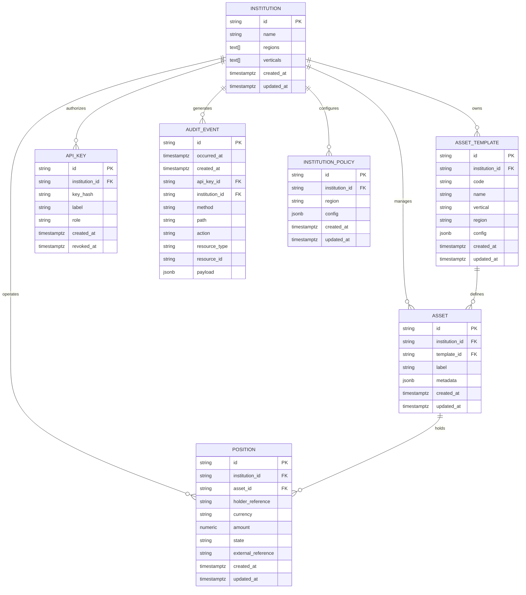
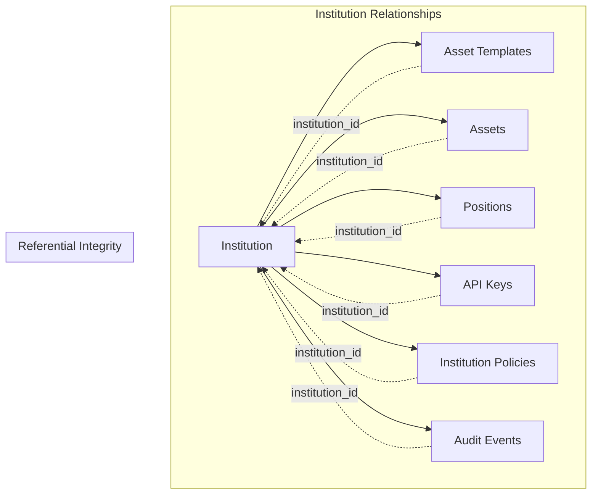
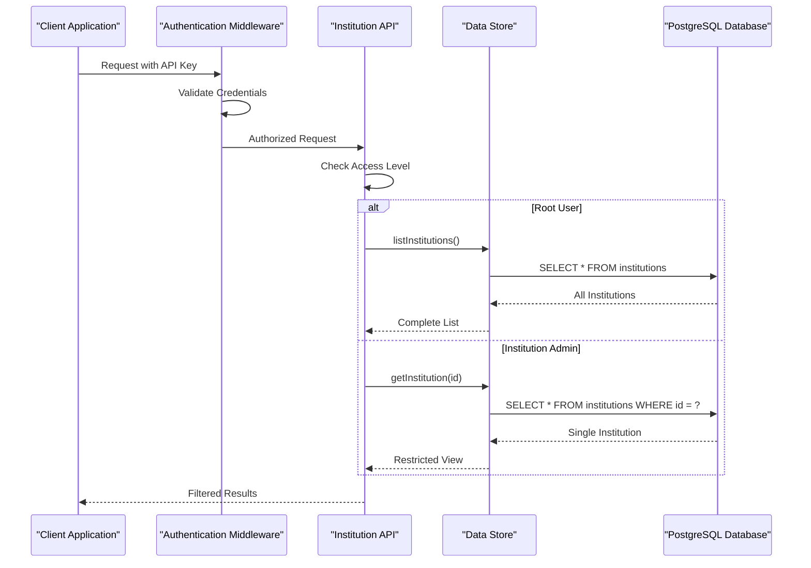
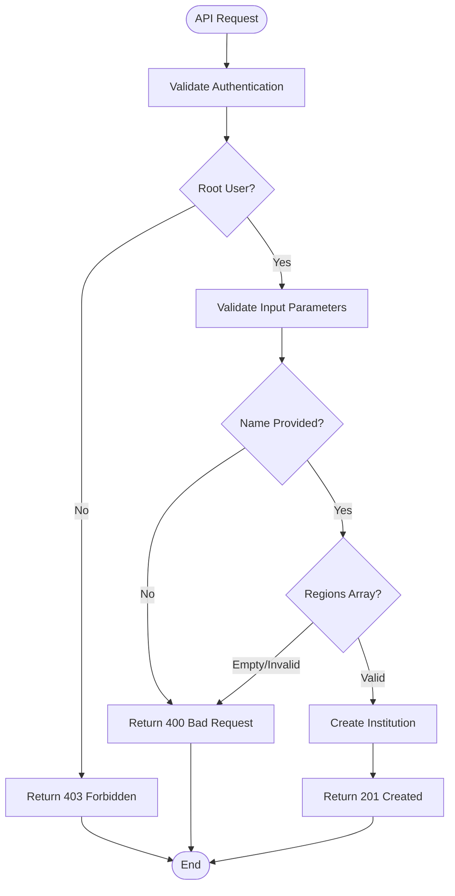
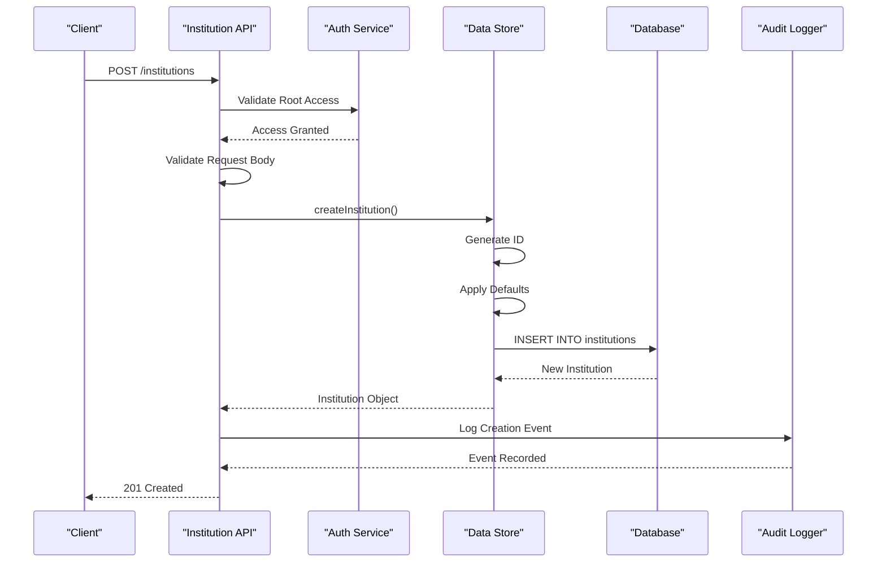

# Institution Model

<cite>
**Referenced Files in This Document**
- [db/schema.sql](file://db/schema.sql)
- [src/domain/types.ts](file://src/domain/types.ts)
- [src/api/institutions.ts](file://src/api/institutions.ts)
- [src/store/postgresStore.ts](file://src/store/postgresStore.ts)
- [src/store/store.ts](file://src/store/store.ts)
- [src/store/memoryStore.ts](file://src/store/memoryStore.ts)
- [src/domain/policy.ts](file://src/domain/policy.ts)
- [src/domain/audit.ts](file://src/domain/audit.ts)
- [src/infra/policyStore.ts](file://src/infra/policyStore.ts)
</cite>

## Table of Contents
1. [Introduction](#introduction)
2. [Data Model Architecture](#data-model-architecture)
3. [Core Entity Fields](#core-entity-fields)
4. [Foreign Key Relationships](#foreign-key-relationships)
5. [Data Access Patterns](#data-access-patterns)
6. [Security and Multi-Tenancy](#security-and-multi-tenancy)
7. [Sample Data Implementation](#sample-data-implementation)
8. [Validation Rules and Constraints](#validation-rules-and-constraints)
9. [Lifecycle Management](#lifecycle-management)
10. [Performance Considerations](#performance-considerations)

## Introduction

The Institution entity serves as the foundational organizational unit in the escrowgrid Trust-as-a-Service (TAAS) platform. As a multi-tenant system, institutions represent distinct organizations that operate within specific geographic regions and industry verticals. Each institution maintains its own set of assets, positions, policies, and access controls while sharing the underlying infrastructure and compliance framework.

Institutions enable region- and vertical-specific configurations, allowing financial institutions to tailor their operations to regulatory requirements, market conditions, and business needs. The platform supports multiple regions (US, EU_UK, SG, UAE) and verticals (CONSTRUCTION, TRADE_FINANCE), with each institution capable of operating across multiple combinations of these dimensions.

## Data Model Architecture

The Institution entity follows a normalized relational database design with PostgreSQL-specific features for enhanced functionality. The core table structure implements a primary key constraint on the `id` field and utilizes PostgreSQL arrays for flexible region and vertical storage.



**Diagram sources**
- [db/schema.sql](file://db/schema.sql#L3-L138)

**Section sources**
- [db/schema.sql](file://db/schema.sql#L3-L10)
- [src/domain/types.ts](file://src/domain/types.ts#L7-L14)

## Core Entity Fields

### Primary Key Field

| Field | Type | Constraints | Purpose |
|-------|------|-------------|---------|
| `id` | TEXT | PRIMARY KEY, NOT NULL | Unique identifier for the institution, generated using the `inst_` prefix format |

The `id` field serves as the primary key and follows a deterministic generation pattern using the `generateId('inst')` function. This ensures consistent identification across all related entities while maintaining uniqueness within the system.

### Core Identification Fields

| Field | Type | Constraints | Purpose |
|-------|------|-------------|---------|
| `name` | TEXT | NOT NULL | Human-readable name of the institution for display and identification |
| `regions` | TEXT[] | NOT NULL, ARRAY | Geographic regions where the institution operates, stored as PostgreSQL arrays |
| `verticals` | TEXT[] | NOT NULL, ARRAY | Industry verticals served by the institution, stored as PostgreSQL arrays |

### Timestamp Fields

| Field | Type | Constraints | Purpose |
|-------|------|-------------|---------|
| `created_at` | TIMESTAMPTZ | NOT NULL | Automatic timestamp recording when the institution is created |
| `updated_at` | TIMESTAMPTZ | NOT NULL | Automatic timestamp updating on record modifications |

**Section sources**
- [db/schema.sql](file://db/schema.sql#L3-L10)
- [src/domain/types.ts](file://src/domain/types.ts#L7-L14)
- [src/store/postgresStore.ts](file://src/store/postgresStore.ts#L24-L32)

## Foreign Key Relationships

The Institution entity establishes several critical foreign key relationships that define the hierarchical data structure and enforce referential integrity:

### Primary Relationships



**Diagram sources**
- [db/schema.sql](file://db/schema.sql#L12-L138)

### Relationship Details

| Related Entity | Foreign Key | Cascade Behavior | Purpose |
|----------------|-------------|------------------|---------|
| `asset_templates` | `institution_id` | ON DELETE CASCADE | Asset templates are scoped to specific institutions |
| `assets` | `institution_id` | ON DELETE CASCADE | Assets belong exclusively to their parent institution |
| `positions` | `institution_id` | ON DELETE CASCADE | Positions inherit institutional context and access controls |
| `api_keys` | `institution_id` | ON DELETE CASCADE | API keys are bound to specific institutional contexts |
| `institution_policies` | `institution_id` | ON DELETE CASCADE | Policies are institution-specific configurations |
| `audit_events` | `institution_id` | NO ACTION | Audit trails maintain institutional provenance |

**Section sources**
- [db/schema.sql](file://db/schema.sql#L12-L138)

## Data Access Patterns

### Multi-Tenancy Implementation

The platform implements strict multi-tenancy through institution-based filtering. Access control mechanisms ensure that:

- Root administrators can view all institutions
- Institution administrators can only access their own institution
- Regular users are restricted to their associated institution's data



**Diagram sources**
- [src/api/institutions.ts](file://src/api/institutions.ts#L70-L97)

### Reference Schema Implementation

The database schema defines specific indexes for optimal query performance:

| Index | Columns | Purpose |
|-------|---------|---------|
| `idx_asset_templates_institution` | `institution_id` | Fast asset template lookups by institution |
| `idx_assets_institution` | `institution_id` | Efficient asset filtering |
| `idx_positions_institution` | `institution_id` | Optimized position queries |
| `idx_api_keys_institution` | `institution_id` | Quick API key resolution |
| `idx_institution_policies_institution` | `institution_id` | Policy retrieval optimization |
| `idx_audit_events_institution` | `institution_id, occurred_at` | Audit trail navigation |

**Section sources**
- [db/schema.sql](file://db/schema.sql#L24-L137)
- [src/api/institutions.ts](file://src/api/institutions.ts#L70-L97)

## Security and Multi-Tenancy

### Access Control Mechanisms

The platform implements role-based access control (RBAC) with institution-level isolation:

| Role | Access Level | Institution Scope | Operations |
|------|--------------|-------------------|------------|
| `root` | Full Administrator | All Institutions | Create, read, update, delete all institutions |
| `admin` | Institution Administrator | Own Institution | Manage own institution resources |
| `read_only` | Limited Access | Own Institution | Read-only access to institution data |

### Security Implications

Institution-level access control provides several security benefits:

- **Data Isolation**: Each institution's data remains separate and inaccessible to others
- **Audit Trail**: All actions are logged with institution context for compliance
- **Resource Protection**: API keys and policies are bound to specific institutions
- **Regulatory Compliance**: Regional and vertical restrictions support compliance requirements

**Section sources**
- [src/api/institutions.ts](file://src/api/institutions.ts#L15-L28)
- [src/domain/audit.ts](file://src/domain/audit.ts#L1-L34)

## Sample Data Implementation

### Financial Institution Example

Here's a comprehensive example of a financial institution operating in the US and EU_UK regions within the TRADE_FINANCE vertical:

```typescript
// Sample Institution Data
const financialInstitution: Institution = {
  id: 'inst_finance_abc123',
  name: 'Global Finance Bank',
  regions: ['US', 'EU_UK'],
  verticals: ['TRADE_FINANCE'],
  createdAt: '2024-01-15T10:30:00.000Z',
  updatedAt: '2024-01-15T10:30:00.000Z'
};

// Corresponding Database Insert
INSERT INTO institutions (id, name, regions, verticals, created_at, updated_at)
VALUES ('inst_finance_abc123', 'Global Finance Bank', 
        ARRAY['US', 'EU_UK'], 
        ARRAY['TRADE_FINANCE'], 
        '2024-01-15 10:30:00+00', 
        '2024-01-15 10:30:00+00');
```

### TypeScript Interface Representation

The TypeScript interface provides compile-time type safety for institution data:

```typescript
interface Institution {
  id: string;                    // Unique identifier
  name: string;                  // Institution name
  regions: Region[];             // Supported regions (US, EU_UK, SG, UAE)
  verticals: Vertical[];         // Supported verticals (CONSTRUCTION, TRADE_FINANCE)
  createdAt: string;             // ISO 8601 timestamp
  updatedAt: string;             // ISO 8601 timestamp
}
```

**Section sources**
- [src/domain/types.ts](file://src/domain/types.ts#L7-L14)
- [src/store/postgresStore.ts](file://src/store/postgresStore.ts#L97-L111)

## Validation Rules and Constraints

### Database-Level Constraints

The PostgreSQL schema enforces several critical constraints:

| Constraint | Field | Description |
|------------|-------|-------------|
| PRIMARY KEY | `id` | Ensures unique identification |
| NOT NULL | `name` | Institution must have a name |
| NOT NULL | `regions` | Must specify at least one region |
| NOT NULL | `verticals` | Must specify at least one vertical |
| NOT NULL | `created_at` | Automatic timestamp generation |
| NOT NULL | `updated_at` | Automatic timestamp updates |

### Application-Level Validation

The API layer implements additional validation logic:



**Diagram sources**
- [src/api/institutions.ts](file://src/api/institutions.ts#L15-L43)

### Default Values and Defaults

The system automatically applies default values for unspecified fields:

- **Default Verticals**: When not provided, institutions default to `['CONSTRUCTION', 'TRADE_FINANCE']`
- **Timestamp Generation**: Both `created_at` and `updated_at` receive automatic timestamps
- **ID Generation**: Unique identifiers are generated using the `inst_` prefix pattern

**Section sources**
- [src/api/institutions.ts](file://src/api/institutions.ts#L30-L36)
- [src/store/postgresStore.ts](file://src/store/postgresStore.ts#L104-L105)

## Lifecycle Management

### Creation Process

The institution creation process involves multiple validation and persistence steps:



**Diagram sources**
- [src/api/institutions.ts](file://src/api/institutions.ts#L9-L67)
- [src/store/postgresStore.ts](file://src/store/postgresStore.ts#L97-L111)

### Update Operations

While the current implementation focuses on creation, the underlying store interface supports update operations through the `updatePosition` method, which demonstrates transactional updates with event logging.

### Deletion Behavior

The cascade deletion policy ensures complete cleanup when institutions are removed:

- **Asset Templates**: Automatically deleted when institution is removed
- **Assets**: All associated assets are removed
- **Positions**: All positions are cleaned up
- **API Keys**: All API keys are revoked
- **Policies**: Institution-specific policies are removed
- **Audit Events**: Associated audit trails are preserved

**Section sources**
- [src/store/postgresStore.ts](file://src/store/postgresStore.ts#L97-L125)
- [db/schema.sql](file://db/schema.sql#L12-L138)

## Performance Considerations

### Query Optimization

The database schema includes several indexes to optimize common query patterns:

| Query Pattern | Index Used | Performance Benefit |
|---------------|------------|-------------------|
| Get Institution by ID | Primary Key | O(1) lookup performance |
| List All Institutions | No Index Needed | Sequential scan for admin views |
| Filter by Institution | Institution ID Index | Sub-second response times |
| Audit Trail Queries | Composite Index | Efficient chronological browsing |

### Array Storage Considerations

PostgreSQL array storage for `regions` and `verticals` provides flexibility but has performance implications:

- **Storage Efficiency**: Arrays compress well for small cardinality sets
- **Index Limitations**: Arrays cannot be indexed directly; use GIN indexes for complex queries
- **Query Complexity**: Array operations require specialized SQL syntax

### Caching Strategies

The platform implements caching at multiple levels:

- **Connection Pooling**: PostgreSQL connection pools reduce overhead
- **Memory Store**: In-memory store provides fastest access for testing
- **Policy Caching**: Institution policies are cached for quick access

**Section sources**
- [db/schema.sql](file://db/schema.sql#L24-L137)
- [src/store/postgresStore.ts](file://src/store/postgresStore.ts#L92-L95)