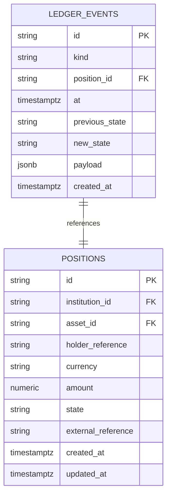
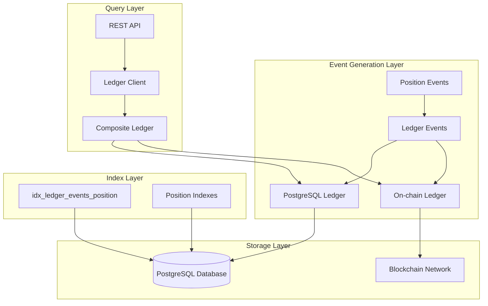
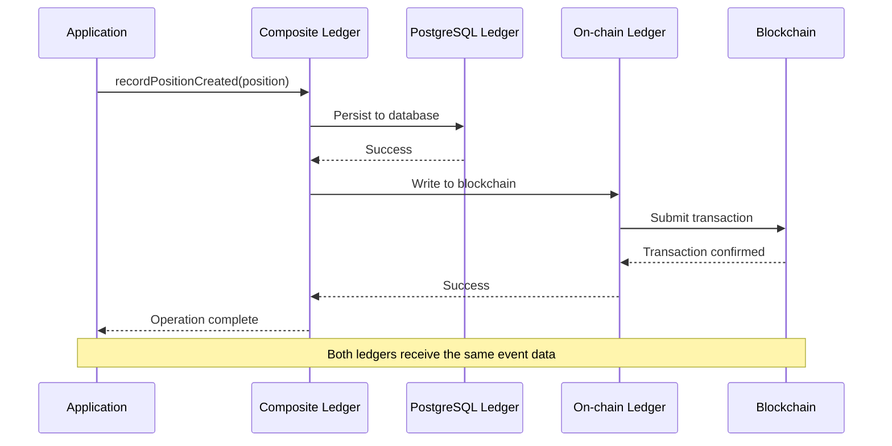
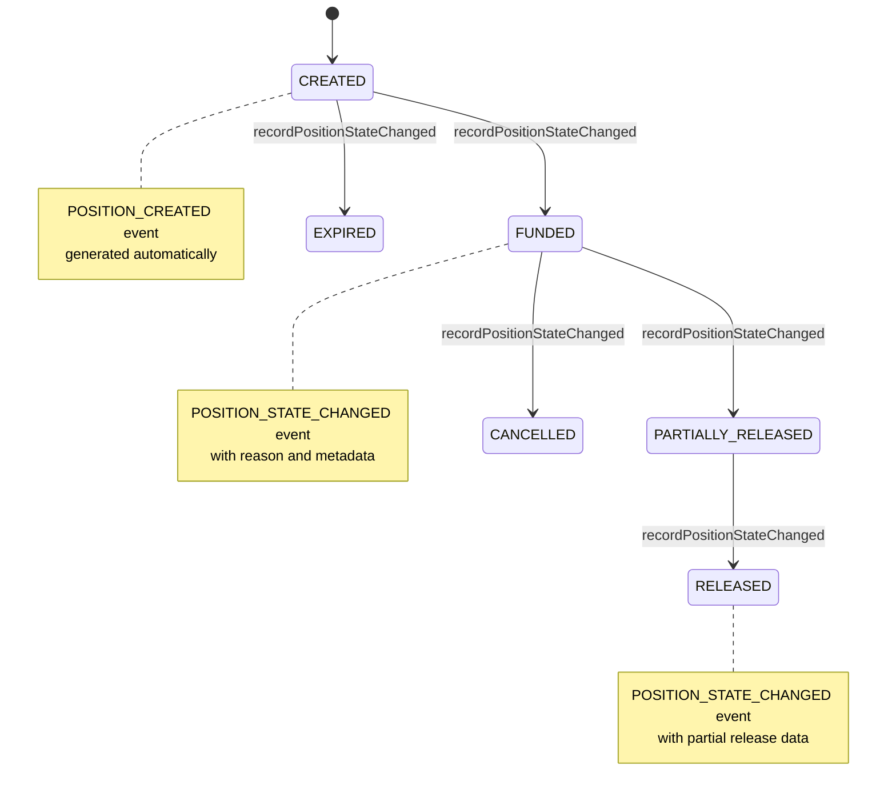
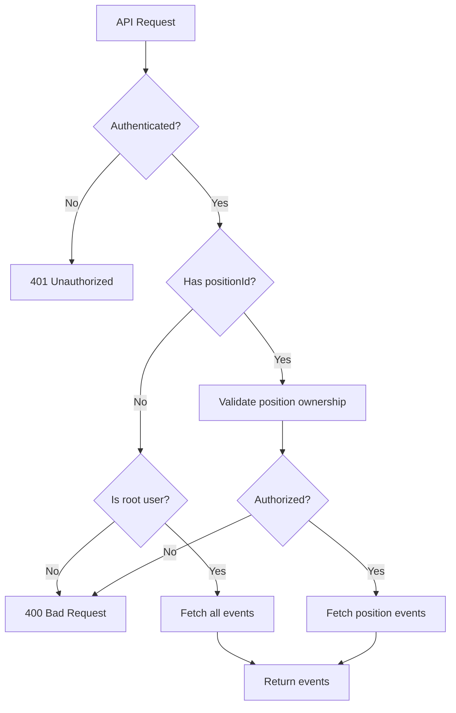
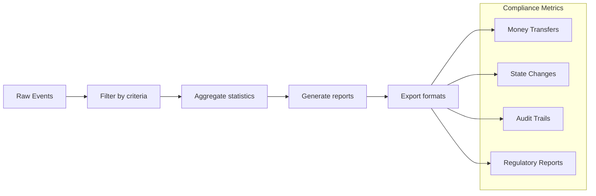

# Ledger Events Model

<cite>
**Referenced Files in This Document**
- [db/schema.sql](file://db/schema.sql)
- [src/domain/ledger.ts](file://src/domain/ledger.ts)
- [src/domain/types.ts](file://src/domain/types.ts)
- [src/infra/postgresLedger.ts](file://src/infra/postgresLedger.ts)
- [src/infra/inMemoryLedger.ts](file://src/infra/inMemoryLedger.ts)
- [src/infra/onchainLedger.ts](file://src/infra/onchainLedger.ts)
- [src/infra/ledgerClient.ts](file://src/infra/ledgerClient.ts)
- [src/api/ledger.ts](file://src/api/ledger.ts)
- [src/config.ts](file://src/config.ts)
- [README.md](file://README.md)
</cite>

## Table of Contents
1. [Introduction](#introduction)
2. [Schema Definition](#schema-definition)
3. [Field Specifications](#field-specifications)
4. [Data Model Architecture](#data-model-architecture)
5. [Dual Ledger Design](#dual-ledger-design)
6. [Event Types and Discrimination](#event-types-and-discrimination)
7. [Integration with Position Lifecycle](#integration-with-position-lifecycle)
8. [Query and Retrieval Patterns](#query-and-retrieval-patterns)
9. [Sample Data and Usage](#sample-data-and-usage)
10. [Auditability and Compliance](#auditability-and-compliance)
11. [Performance Considerations](#performance-considerations)
12. [Troubleshooting Guide](#troubleshooting-guide)
13. [Conclusion](#conclusion)

## Introduction

The LedgerEvents (ledger_events table) entity serves as the system of record for all significant financial and operational changes to positions within the escrowgrid platform. This comprehensive data model captures immutable audit trails of position lifecycle events, enabling robust reconciliation between on-chain and off-chain systems while supporting regulatory compliance requirements.

The ledger events model implements a dual-ledger architecture that maintains both traditional PostgreSQL persistence and optional blockchain attestation capabilities, providing flexibility for different regulatory environments and use cases.

## Schema Definition

The ledger_events table is defined in the PostgreSQL schema with the following structure:



**Diagram sources**
- [db/schema.sql](file://db/schema.sql#L79-L88)

**Section sources**
- [db/schema.sql](file://db/schema.sql#L79-L88)

## Field Specifications

### Primary Key: id
- **Type**: TEXT
- **Constraints**: PRIMARY KEY
- **Format**: Generated using prefix-based UUID format (e.g., `led_<random_string>`)
- **Purpose**: Uniquely identifies each ledger event with deterministic generation

### Event Type: kind
- **Type**: TEXT
- **Constraints**: NOT NULL
- **Values**: `'POSITION_CREATED'` | `'POSITION_STATE_CHANGED'`
- **Purpose**: Acts as a discriminator for event categorization and routing
- **Implementation**: Used for polymorphic event handling and type-specific processing

### Foreign Key: position_id
- **Type**: TEXT
- **Constraints**: NOT NULL, REFERENCES positions(id) ON DELETE CASCADE
- **Purpose**: Links events to specific positions
- **Behavior**: Automatic cascading deletion ensures data integrity when positions are removed

### Timestamp: at
- **Type**: TIMESTAMPTZ
- **Constraints**: NOT NULL
- **Precision**: Millisecond-level timestamp
- **Purpose**: Records the exact moment when the event occurred
- **Format**: ISO 8601 with timezone awareness

### State Tracking: previous_state and new_state
- **Type**: TEXT
- **Nullable**: Yes (previous_state can be NULL for creation events)
- **Purpose**: Captures state transitions for audit and validation
- **Relationship**: Together enable complete lifecycle tracking

### Flexible Payload: payload
- **Type**: JSONB
- **Constraints**: Nullable
- **Purpose**: Stores arbitrary event-specific data in JSON format
- **Benefits**: Enables schema evolution without migration requirements
- **Storage**: Optimized binary JSON storage with indexing capabilities

### Audit Trail: created_at
- **Type**: TIMESTAMPTZ
- **Constraints**: NOT NULL
- **Purpose**: Records when the event was persisted to the database
- **Difference from 'at'**: Allows for temporal separation between occurrence and recording

**Section sources**
- [db/schema.sql](file://db/schema.sql#L79-L88)
- [src/domain/ledger.ts](file://src/domain/ledger.ts#L5-L12)

## Data Model Architecture

The ledger events model follows a normalized relational design optimized for auditability and performance:



**Diagram sources**
- [src/infra/ledgerClient.ts](file://src/infra/ledgerClient.ts#L1-L45)
- [src/infra/postgresLedger.ts](file://src/infra/postgresLedger.ts#L1-L46)
- [src/infra/onchainLedger.ts](file://src/infra/onchainLedger.ts#L1-L23)

### Index Strategy

The schema includes strategic indexes for optimal query performance:

| Index Name | Columns | Purpose |
|------------|---------|---------|
| idx_ledger_events_position | position_id | Fast position-based lookups |
| Primary Key | id | Unique event identification |

**Section sources**
- [db/schema.sql](file://db/schema.sql#L90-L91)

## Dual Ledger Design

The escrowgrid platform implements a sophisticated dual-ledger architecture that provides both traditional database persistence and optional blockchain attestation:



**Diagram sources**
- [src/infra/ledgerClient.ts](file://src/infra/ledgerClient.ts#L17-L32)
- [src/infra/postgresLedger.ts](file://src/infra/postgresLedger.ts#L20-L46)
- [src/infra/onchainLedger.ts](file://src/infra/onchainLedger.ts#L25-L82)

### PostgreSQL Ledger Implementation

The PostgreSQL ledger provides reliable, ACID-compliant persistence with full SQL capabilities:

- **Transaction Support**: Ensures atomicity of event recording
- **Indexing**: Optimized for position-based queries
- **Scalability**: Handles high-volume event streams
- **Backup Compatibility**: Integrates with standard database backup procedures

### On-chain Ledger Implementation

The on-chain ledger provides immutable blockchain attestations:

- **Immutability**: Once recorded, events cannot be altered
- **Decentralization**: Distributed consensus ensures trustlessness
- **Regulatory Compliance**: Meets strict audit requirements
- **Template-based Control**: Per-asset-template on-chain activation

**Section sources**
- [src/infra/ledgerClient.ts](file://src/infra/ledgerClient.ts#L1-L62)
- [src/infra/postgresLedger.ts](file://src/infra/postgresLedger.ts#L1-L106)
- [src/infra/onchainLedger.ts](file://src/infra/onchainLedger.ts#L1-L219)

## Event Types and Discrimination

The ledger events model supports two primary event types, each serving distinct operational purposes:

### POSITION_CREATED Events

Generated when a new position is established:

```typescript
// Event structure for POSITION_CREATED
{
  id: string,
  kind: 'POSITION_CREATED',
  positionId: string,
  at: string,
  previousState: null,
  newState: string,
  payload: {
    institutionId: string,
    assetId: string,
    currency: string,
    amount: number,
    externalReference?: string
  }
}
```

### POSITION_STATE_CHANGED Events

Generated during position lifecycle transitions:

```typescript
// Event structure for POSITION_STATE_CHANGED
{
  id: string,
  kind: 'POSITION_STATE_CHANGED',
  positionId: string,
  at: string,
  previousState: string,
  newState: string,
  payload: {
    reason: string,
    metadata?: Record<string, unknown>
  }
}
```

**Section sources**
- [src/domain/ledger.ts](file://src/domain/ledger.ts#L3-L4)
- [src/infra/postgresLedger.ts](file://src/infra/postgresLedger.ts#L20-L46)
- [src/infra/postgresLedger.ts](file://src/infra/postgresLedger.ts#L48-L76)

## Integration with Position Lifecycle

The ledger events model integrates seamlessly with the position lifecycle management system:



**Diagram sources**
- [src/domain/types.ts](file://src/domain/types.ts#L38-L44)
- [src/domain/types.ts](file://src/domain/types.ts#L46-L54)

### State Transition Validation

The system enforces valid state transitions through the ledger events mechanism:

| From State | To State | Event Type | Reason |
|------------|----------|------------|--------|
| null | CREATED | POSITION_CREATED | Initial position creation |
| CREATED | FUNDED | POSITION_STATE_CHANGED | Funds deposited |
| FUNDED | PARTIALLY_RELEASED | POSITION_STATE_CHANGED | Partial release occurred |
| PARTIALLY_RELEASED | RELEASED | POSITION_STATE_CHANGED | Final release |
| FUNDED | CANCELLED | POSITION_STATE_CHANGED | Position cancelled |
| CREATED | EXPIRED | POSITION_STATE_CHANGED | Position expired |

**Section sources**
- [src/domain/types.ts](file://src/domain/types.ts#L38-L44)
- [src/infra/postgresLedger.ts](file://src/infra/postgresLedger.ts#L48-L76)

## Query and Retrieval Patterns

The ledger events model supports multiple query patterns optimized for different use cases:

### Position-Specific Queries

Retrieve all events for a specific position:

```sql
SELECT * FROM ledger_events 
WHERE position_id = $1 
ORDER BY at ASC
```

### Global Queries

Retrieve all events across all positions:

```sql
SELECT * FROM ledger_events 
ORDER BY at ASC
```

### Event Listing Implementation

The system provides flexible event listing with authentication and authorization:



**Diagram sources**
- [src/api/ledger.ts](file://src/api/ledger.ts#L8-L41)

**Section sources**
- [src/api/ledger.ts](file://src/api/ledger.ts#L8-L41)
- [src/infra/postgresLedger.ts](file://src/infra/postgresLedger.ts#L78-L106)

## Sample Data and Usage

### Release Event Example

Here's a typical release event payload from the PostgreSQL ledger:

```json
{
  "id": "led_abc123def456",
  "kind": "POSITION_STATE_CHANGED",
  "positionId": "pos_xyz789uvw321",
  "at": "2024-01-15T10:30:45.123Z",
  "previousState": "FUNDED",
  "newState": "PARTIALLY_RELEASED",
  "payload": {
    "reason": "Partial payment processed",
    "metadata": {
      "amountReleased": 50000.00,
      "releaseDate": "2024-01-15T10:30:45.123Z",
      "recipient": "SUBCONTRACTOR_123",
      "invoiceReference": "INV-2024-001"
    }
  },
  "createdAt": "2024-01-15T10:30:45.123Z"
}
```

### Creation Event Example

Initial position creation event:

```json
{
  "id": "led_def456ghi789",
  "kind": "POSITION_CREATED",
  "positionId": "pos_xyz789uvw321",
  "at": "2024-01-15T09:00:00.000Z",
  "previousState": null,
  "newState": "CREATED",
  "payload": {
    "institutionId": "inst_bank123",
    "assetId": "asset_proj456",
    "currency": "USD",
    "amount": 100000.00,
    "externalReference": "ESCROW-2024-PROJECT-A"
  },
  "createdAt": "2024-01-15T09:00:00.000Z"
}
```

### On-chain Event Example

Corresponding blockchain event payload:

```json
{
  "positionId": "pos_xyz789uvw321",
  "kind": "POSITION_STATE_CHANGED",
  "payloadJson": "{\"fromState\":\"FUNDED\",\"toState\":\"PARTIALLY_RELEASED\",\"reason\":\"Partial payment processed\",\"at\":\"2024-01-15T10:30:45.123Z\"}"
}
```

**Section sources**
- [src/infra/postgresLedger.ts](file://src/infra/postgresLedger.ts#L48-L76)
- [src/infra/onchainLedger.ts](file://src/infra/onchainLedger.ts#L183-L219)

## Auditability and Compliance

The ledger events model provides comprehensive audit trail capabilities essential for regulatory compliance:

### Immutable Audit Trail

- **Non-destructible**: Events cannot be modified or deleted
- **Complete history**: Full lifecycle tracking from creation to closure
- **Timestamp precision**: Millisecond-level temporal accuracy
- **State validation**: Complete before/after state capture

### Regulatory Compliance Features

| Requirement | Implementation |
|-------------|----------------|
| **Audit Trail** | Complete event history with timestamps |
| **Data Integrity** | Immutable event records |
| **Access Control** | Role-based authorization |
| **Geographic Compliance** | Regional policy enforcement |
| **Transaction Attribution** | Detailed payload metadata |

### Compliance Reporting

The system enables automated compliance reporting through structured event data:



**Section sources**
- [README.md](file://README.md#L220-L238)
- [src/api/ledger.ts](file://src/api/ledger.ts#L8-L41)

## Performance Considerations

### Query Optimization

The ledger events model implements several performance optimization strategies:

- **Position-based indexing**: Fast lookups by position_id
- **Timestamp ordering**: Efficient chronological queries
- **JSONB optimization**: Binary JSON storage for payload fields
- **Cascade deletion**: Automatic cleanup of orphaned events

### Scalability Patterns

- **Event streaming**: Supports high-volume event generation
- **Batch processing**: Efficient bulk event insertion
- **Partitioning potential**: Future support for time-based partitioning
- **Connection pooling**: Optimized database connection management

### Memory Management

The in-memory ledger implementation demonstrates efficient memory usage:

- **Garbage collection**: Automatic cleanup of old events
- **Reference counting**: Proper object lifecycle management
- **Streaming support**: Large dataset processing without memory overflow

**Section sources**
- [db/schema.sql](file://db/schema.sql#L90-L91)
- [src/infra/inMemoryLedger.ts](file://src/infra/inMemoryLedger.ts#L1-L60)

## Troubleshooting Guide

### Common Issues and Solutions

#### Event Recording Failures

**Problem**: Events not appearing in the ledger
**Causes**:
- Database connection issues
- On-chain ledger configuration errors
- Template-based on-chain disabling

**Solutions**:
1. Verify database connectivity
2. Check on-chain ledger configuration
3. Review asset template on-chain settings

#### Query Performance Issues

**Problem**: Slow event retrieval
**Causes**:
- Missing indexes
- Large result sets
- Poor query patterns

**Solutions**:
1. Ensure position_id indexing
2. Implement pagination for large datasets
3. Optimize query parameters

#### Data Consistency Problems

**Problem**: Discrepancies between ledgers
**Causes**:
- Race conditions
- Network failures
- Configuration drift

**Solutions**:
1. Implement retry mechanisms
2. Monitor ledger synchronization
3. Validate configuration consistency

**Section sources**
- [src/infra/onchainLedger.ts](file://src/infra/onchainLedger.ts#L25-L82)
- [src/config.ts](file://src/config.ts#L28-L34)

## Conclusion

The LedgerEvents data model represents a sophisticated approach to financial transaction auditing and compliance in the escrowgrid platform. By combining traditional relational database persistence with optional blockchain attestation, the system provides flexibility for diverse regulatory environments while maintaining data integrity and auditability.

Key strengths of the implementation include:

- **Comprehensive coverage**: Captures all significant position lifecycle events
- **Flexible schema**: JSONB payload enables easy adaptation to changing requirements
- **Dual persistence**: Balances cost-effectiveness with regulatory compliance needs
- **Performance optimization**: Strategic indexing and query patterns
- **Security-first design**: Role-based access control and immutable audit trails

The model serves as the foundation for robust reconciliation processes, regulatory reporting, and operational transparency, making it an essential component of the escrowgrid platform's financial infrastructure.