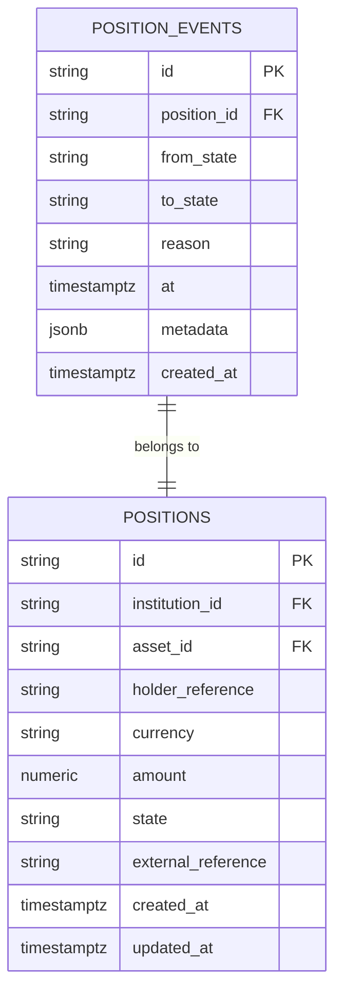
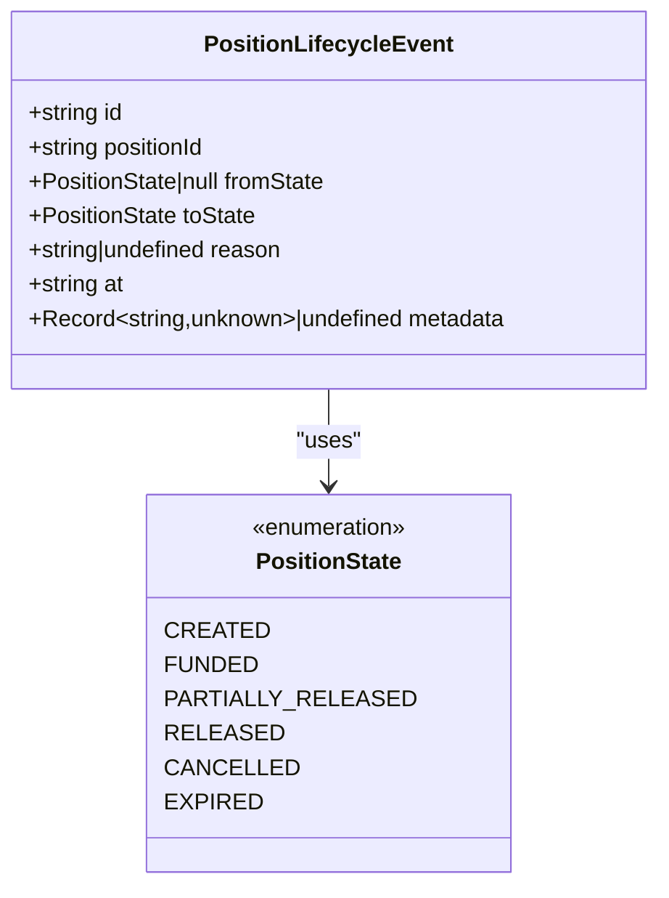
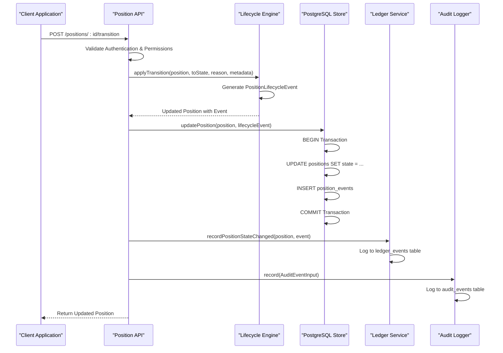
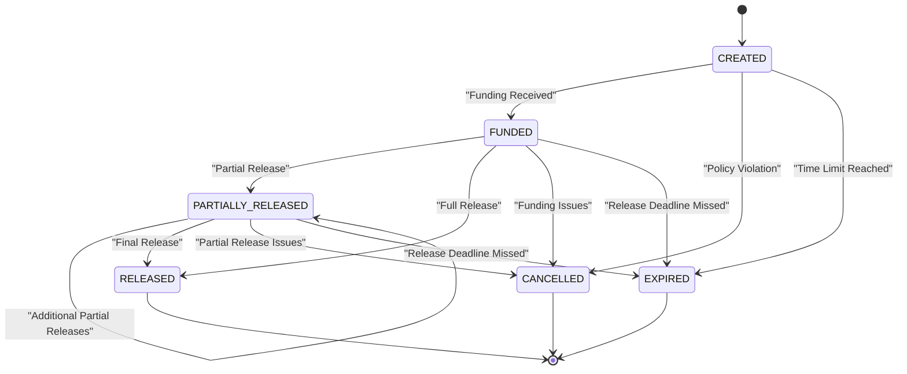
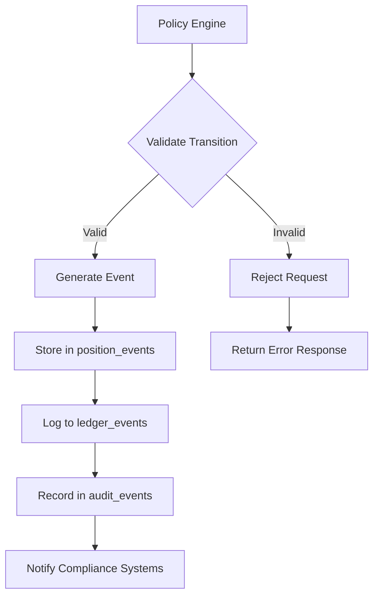

# Position Events Model

<cite>
**Referenced Files in This Document**
- [db/schema.sql](file://db/schema.sql)
- [src/domain/types.ts](file://src/domain/types.ts)
- [src/domain/lifecycle.ts](file://src/domain/lifecycle.ts)
- [src/store/postgresStore.ts](file://src/store/postgresStore.ts)
- [src/api/positions.ts](file://src/api/positions.ts)
- [src/infra/postgresLedger.ts](file://src/infra/postgresLedger.ts)
- [src/domain/audit.ts](file://src/domain/audit.ts)
- [src/infra/auditLogger.ts](file://src/infra/auditLogger.ts)
- [src/__tests__/api.postgres.test.ts](file://src/__tests__/api.postgres.test.ts)
</cite>

## Table of Contents
1. [Introduction](#introduction)
2. [Database Schema](#database-schema)
3. [Type Definitions](#type-definitions)
4. [Field Specifications](#field-specifications)
5. [Event Sourcing Implementation](#event-sourcing-implementation)
6. [Relationships and Constraints](#relationships-and-constraints)
7. [Sample Data and Usage Patterns](#sample-data-and-usage-patterns)
8. [Compliance and Security Features](#compliance-and-security-features)
9. [Performance Considerations](#performance-considerations)
10. [Integration Points](#integration-points)
11. [Best Practices](#best-practices)

## Introduction

The PositionEvents model (position_events table) is a core component of the escrowgrid platform's event sourcing architecture, specifically designed to track and maintain an immutable audit trail of position lifecycle transitions. This model implements a sophisticated event-driven approach to position state management, enabling comprehensive compliance monitoring, debugging capabilities, and policy enforcement throughout the position's entire lifecycle.

Position events serve as the foundation for reconstructing position state at any point in time, providing organizations with complete visibility into how positions have evolved through their various states. The system captures every meaningful change as a discrete event, ensuring that no state transition goes undocumented while maintaining referential integrity with the underlying position records.

## Database Schema

The position_events table is defined in the database schema with the following structure:



**Diagram sources**
- [db/schema.sql](file://db/schema.sql#L65-L74)

**Section sources**
- [db/schema.sql](file://db/schema.sql#L65-L74)

## Type Definitions

The PositionLifecycleEvent interface in TypeScript provides the application-level representation of position events:



**Diagram sources**
- [src/domain/types.ts](file://src/domain/types.ts#L46-L54)

**Section sources**
- [src/domain/types.ts](file://src/domain/types.ts#L46-L54)

## Field Specifications

### Primary Key: id
- **Type**: TEXT
- **Constraints**: PRIMARY KEY
- **Description**: Unique identifier for each position event, generated using the pattern `ple_{random_string}`
- **Usage**: Enables direct lookup and ensures event immutability

### Foreign Key: position_id
- **Type**: TEXT
- **Constraints**: NOT NULL, REFERENCES positions(id) ON DELETE CASCADE
- **Description**: Links the event to its parent position record
- **Behavior**: Automatic deletion when the associated position is removed

### Nullable Field: from_state
- **Type**: TEXT
- **Constraints**: NULLABLE
- **Description**: The state before the transition occurred
- **Special Case**: Can be NULL for initial position creation events
- **Validation**: Must match valid PositionState values when present

### Required Field: to_state
- **Type**: TEXT
- **Constraints**: NOT NULL
- **Description**: The state after the transition occurred
- **Validation**: Must be a valid PositionState value
- **Purpose**: Defines the target state of the lifecycle transition

### Optional Field: reason
- **Type**: TEXT
- **Constraints**: NULLABLE
- **Description**: Human-readable explanation for the state transition
- **Usage**: Supports compliance reporting and audit trails
- **Example**: "Funds received into escrow", "Policy violation detected"

### Timestamp: at
- **Type**: TIMESTAMPTZ
- **Constraints**: NOT NULL
- **Description**: Precise timestamp when the transition occurred
- **Format**: ISO 8601 with timezone information
- **Precision**: Millisecond level

### Optional Metadata: metadata
- **Type**: JSONB
- **Constraints**: NULLABLE
- **Description**: Extensible context storage for additional event information
- **Structure**: Free-form JSON object supporting arbitrary key-value pairs
- **Use Cases**: Policy-specific data, external system references, operational context

### System Field: created_at
- **Type**: TIMESTAMPTZ
- **Constraints**: NOT NULL
- **Description**: Event creation timestamp for ordering and analytics
- **Purpose**: Enables chronological event reconstruction

**Section sources**
- [db/schema.sql](file://db/schema.sql#L66-L74)
- [src/domain/types.ts](file://src/domain/types.ts#L46-L54)

## Event Sourcing Implementation

The position events model implements event sourcing principles to maintain an immutable history of position state changes. This approach provides several key benefits:

### Immutable Audit Trail
Each state transition is captured as a discrete, unalterable event that preserves the complete history of position evolution. This immutability ensures that historical data cannot be tampered with while providing complete transparency into position lifecycle activities.

### State Reconstruction Capability
By replaying events in chronological order, the system can reconstruct the position state at any point in time. This capability is essential for compliance reporting, dispute resolution, and system recovery scenarios.

### Event Ordering and Consistency
The combination of the `at` and `created_at` timestamps ensures precise event ordering, enabling accurate temporal analysis and preventing race condition issues during concurrent updates.



**Diagram sources**
- [src/api/positions.ts](file://src/api/positions.ts#L258-L296)
- [src/domain/lifecycle.ts](file://src/domain/lifecycle.ts#L16-L49)
- [src/store/postgresStore.ts](file://src/store/postgresStore.ts#L356-L415)

**Section sources**
- [src/domain/lifecycle.ts](file://src/domain/lifecycle.ts#L16-L49)
- [src/api/positions.ts](file://src/api/positions.ts#L258-L296)

## Relationships and Constraints

### Indexes for Performance
The position_events table includes strategic indexes to optimize common query patterns:

| Index Name | Columns | Purpose |
|------------|---------|---------|
| idx_position_events_position | position_id | Efficient event retrieval by position |
| idx_ledger_events_position | position_id | Supporting ledger event queries |

### Foreign Key Relationships
The table maintains referential integrity through carefully designed constraints:

- **Primary Key**: Ensures uniqueness and enables direct event lookup
- **Foreign Key**: Maintains association with parent position records
- **Cascade Delete**: Automatically removes events when positions are deleted

### State Transition Validation
The system enforces valid state transitions through a predefined transition matrix:



**Diagram sources**
- [src/domain/lifecycle.ts](file://src/domain/lifecycle.ts#L3-L10)

**Section sources**
- [db/schema.sql](file://db/schema.sql#L76-L77)
- [src/domain/lifecycle.ts](file://src/domain/lifecycle.ts#L3-L10)

## Sample Data and Usage Patterns

### Initial Position Creation Event
When a new position is created, the system generates an initial event with `from_state` set to NULL:

```sql
INSERT INTO position_events (
    id, position_id, from_state, to_state, reason, at, metadata, created_at
) VALUES (
    'ple_abc123def456', 
    'pos_xyz789ghi012', 
    NULL, 
    'CREATED', 
    'Initial position setup', 
    '2024-01-15T10:30:00.000Z', 
    '{"institutionId":"inst_123","assetId":"asset_456"}', 
    '2024-01-15T10:30:00.000Z'
);
```

### State Transition Example: CREATED to FUNDED
A typical transition from CREATED to FUNDED state demonstrates the event sourcing pattern:

```sql
INSERT INTO position_events (
    id, position_id, from_state, to_state, reason, at, metadata, created_at
) VALUES (
    'ple_jkl987mno654', 
    'pos_xyz789ghi012', 
    'CREATED', 
    'FUNDED', 
    'PG funds received into escrow', 
    '2024-01-15T14:45:30.123Z', 
    '{"fundingAmount":50000,"currency":"USD","sourceAccount":"acct_12345"}', 
    '2024-01-15T14:45:30.123Z'
);
```

### Event Retrieval Pattern
To reconstruct position state at any point in time, the system retrieves events in chronological order:

```sql
SELECT * FROM position_events 
WHERE position_id = 'pos_xyz789ghi012'
ORDER BY at ASC, created_at ASC;
```

### Metadata Usage Examples
The metadata field supports various use cases:

| Use Case | Example Metadata |
|----------|------------------|
| Funding Details | `{"amount":50000,"currency":"USD","reference":"FUND-2024-001"}` |
| Release Information | `{"releaseAmount":25000,"releaseType":"partial","voucherId":"VCH-2024-001"}` |
| Policy Violation | `{"violationType":"amount_exceeded","threshold":100000,"actualAmount":125000}` |
| System Integration | `{"externalSystem":"payment_processor","transactionId":"txn_987654321"}` |

**Section sources**
- [src/__tests__/api.postgres.test.ts](file://src/__tests__/api.postgres.test.ts#L132-L142)
- [src/store/postgresStore.ts](file://src/store/postgresStore.ts#L277-L319)

## Compliance and Security Features

### Regulatory Compliance Support
Position events provide comprehensive support for regulatory compliance requirements:

- **Immutable Audit Trail**: All state changes are permanently recorded with precise timestamps
- **Complete Event History**: Every transition is documented with reason and metadata
- **Timestamp Accuracy**: Millisecond precision timestamps enable detailed temporal analysis
- **Referential Integrity**: Strong relationships ensure data consistency and prevent orphaned records

### Debugging and Monitoring
The event model facilitates comprehensive debugging and monitoring capabilities:

- **State Change Tracking**: Complete visibility into position evolution
- **Reason Documentation**: Clear explanations for all state transitions
- **Metadata Enrichment**: Additional context for troubleshooting
- **Temporal Analysis**: Ability to analyze position behavior over time

### Policy Enforcement
The system integrates with institutional policies through:

- **Transition Validation**: Predefined state transition rules prevent invalid state changes
- **Metadata Validation**: Policy-specific metadata requirements can be enforced
- **Audit Logging**: All policy-related actions are automatically logged
- **Compliance Reporting**: Events support detailed compliance reports



**Diagram sources**
- [src/domain/lifecycle.ts](file://src/domain/lifecycle.ts#L28-L31)
- [src/domain/audit.ts](file://src/domain/audit.ts#L1-L34)

**Section sources**
- [src/domain/audit.ts](file://src/domain/audit.ts#L1-L34)
- [src/infra/auditLogger.ts](file://src/infra/auditLogger.ts#L50-L107)

## Performance Considerations

### Query Optimization
The position_events table is optimized for common access patterns:

- **Index Strategy**: The position_id index enables efficient event retrieval by position
- **Composite Ordering**: Events are ordered by both `at` and `created_at` timestamps
- **Selective Queries**: Position-specific queries minimize data scanning overhead

### Storage Efficiency
The JSONB metadata field provides flexible storage while maintaining reasonable performance:

- **Compression**: JSONB automatically compresses repeated keys
- **Indexing**: Selective indexing on frequently queried metadata fields
- **Size Limits**: Reasonable limits on metadata size prevent performance degradation

### Scalability Patterns
The event sourcing model scales effectively through:

- **Event Batching**: Multiple events can be processed in transaction batches
- **Partitioning**: Events can be partitioned by position or time periods
- **Archival**: Historical events can be archived while maintaining access to recent data

## Integration Points

### Ledger Integration
Position events integrate seamlessly with the broader ledger system:

- **Dual Logging**: Events are logged to both position_events and ledger_events tables
- **Consistent Timestamps**: Same timestamp values across related event types
- **Cross-Reference**: Events can be cross-referenced between systems

### Audit System Integration
The audit system receives comprehensive event notifications:

- **Automated Logging**: All position transitions trigger audit events
- **Structured Payloads**: Standardized audit event formats
- **Security Tracing**: Full security context included in audit trails

### External System Integration
The metadata field enables integration with external systems:

- **External References**: Track external system identifiers
- **System Notifications**: Trigger external system events
- **Data Export**: Support for external system data feeds

**Section sources**
- [src/infra/postgresLedger.ts](file://src/infra/postgresLedger.ts#L48-L106)
- [src/api/positions.ts](file://src/api/positions.ts#L272-L284)

## Best Practices

### Event Design Guidelines
When designing position events, follow these best practices:

- **Meaningful Reasons**: Always provide clear, actionable reasons for state transitions
- **Minimal Metadata**: Include only essential metadata to maintain performance
- **Consistent Timestamps**: Use standardized timestamp formats across all events
- **Null Handling**: Properly handle NULL values for initial creation events

### Error Handling
Implement robust error handling for event processing:

- **Transaction Safety**: Wrap event creation in database transactions
- **Duplicate Prevention**: Handle potential duplicate event creation scenarios
- **Rollback Strategies**: Implement proper rollback mechanisms for failed events
- **Retry Logic**: Design retry mechanisms for transient failures

### Monitoring and Alerting
Establish monitoring for position event processing:

- **Event Latency**: Monitor time between state changes and event creation
- **Error Rates**: Track event creation failure rates
- **Volume Metrics**: Monitor event volume for capacity planning
- **Integrity Checks**: Regular validation of event consistency

### Data Retention
Implement appropriate data retention policies:

- **Regulatory Requirements**: Align retention periods with regulatory mandates
- **Storage Optimization**: Archive old events while maintaining access to recent data
- **Performance Impact**: Consider performance implications of long-term event storage
- **Compliance Verification**: Regular verification of retention policy compliance