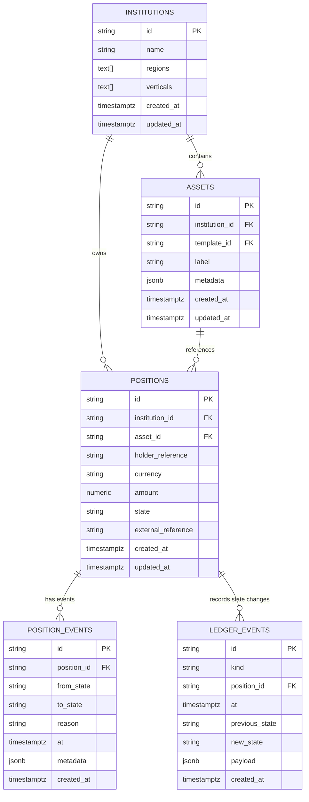
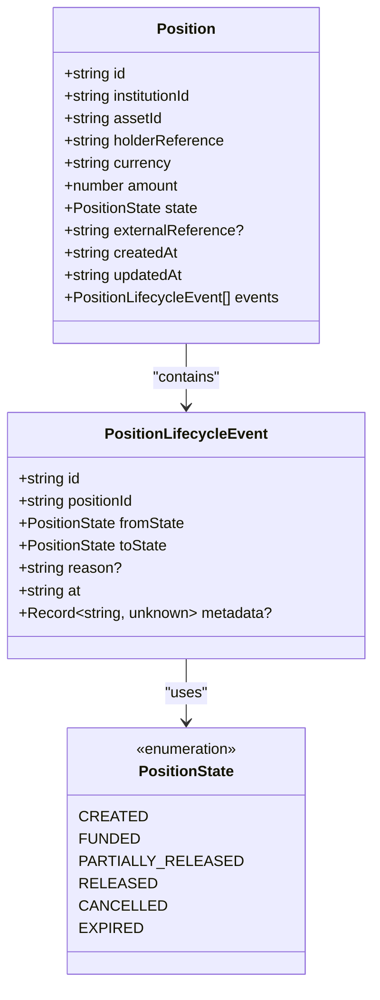
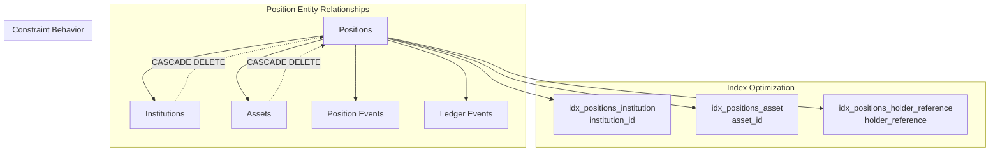
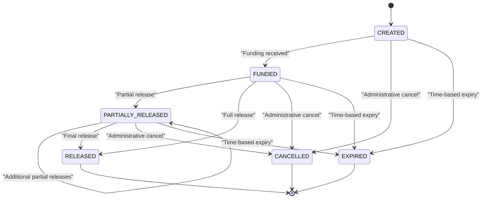
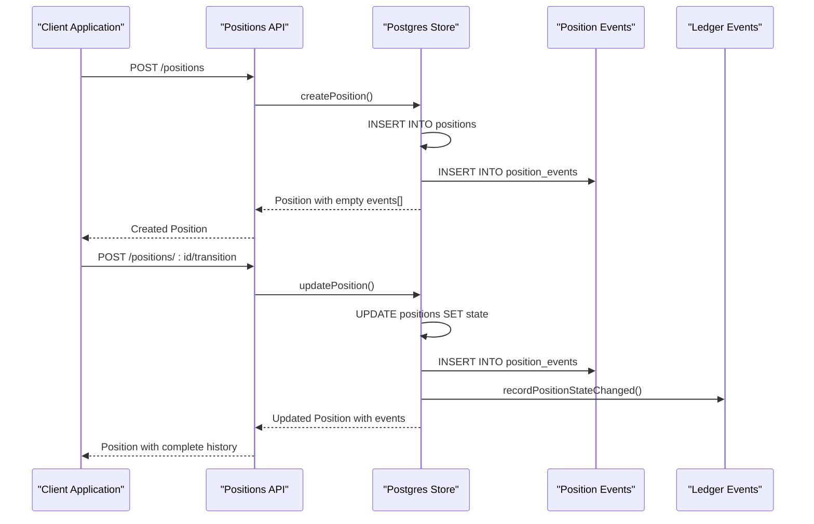
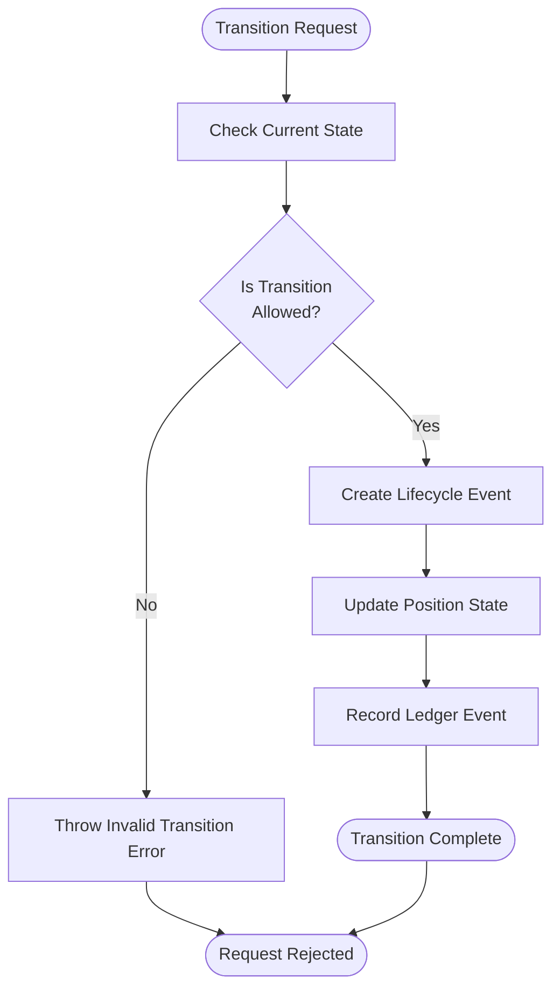
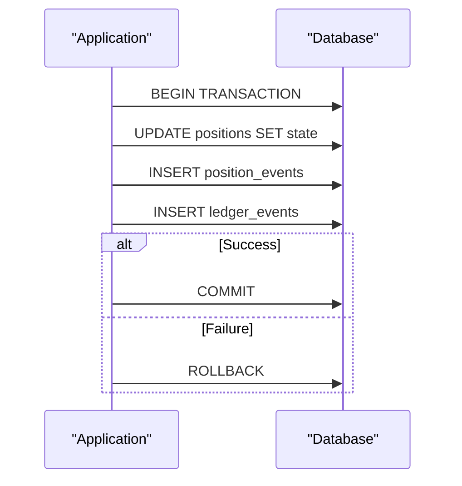

# Position Model

<cite>
**Referenced Files in This Document**
- [schema.sql](file://db/schema.sql)
- [types.ts](file://src/domain/types.ts)
- [positions.ts](file://src/api/positions.ts)
- [lifecycle.ts](file://src/domain/lifecycle.ts)
- [postgresStore.ts](file://src/store/postgresStore.ts)
- [store.ts](file://src/store/store.ts)
- [positions-k6.js](file://load/positions-k6.js)
- [api.postgres.test.ts](file://src/__tests__/api.postgres.test.ts)
</cite>

## Table of Contents
1. [Introduction](#introduction)
2. [Database Schema](#database-schema)
3. [TypeScript Interface](#typescript-interface)
4. [Field Specifications](#field-specifications)
5. [Relationships and Constraints](#relationships-and-constraints)
6. [State Management](#state-management)
7. [Lifecycle Events](#lifecycle-events)
8. [Validation Rules](#validation-rules)
9. [Sample Data](#sample-data)
10. [Performance Considerations](#performance-considerations)
11. [Best Practices](#best-practices)

## Introduction

The Position entity represents financial escrow accounts or holdings within the TaaS (Tokenized Asset Services) platform. Each position corresponds to a specific asset held by a particular holder, tracked through a unique identifier. Positions form the core of the escrow system, enabling secure financial transactions while maintaining complete auditability through embedded lifecycle events.

Positions are designed to handle various financial scenarios including construction projects, trade finance, and other asset-backed transactions. They support multiple currencies, precise monetary amounts with up to 8 decimal places, and a comprehensive state lifecycle that tracks the progression from creation through completion or cancellation.

## Database Schema

The Position entity is stored in the `positions` table with the following structure:



**Diagram sources**
- [schema.sql](file://db/schema.sql#L43-L54)
- [schema.sql](file://db/schema.sql#L65-L74)
- [schema.sql](file://db/schema.sql#L79-L88)

**Section sources**
- [schema.sql](file://db/schema.sql#L43-L54)

## TypeScript Interface

The Position entity is defined in TypeScript with the following interface:



**Diagram sources**
- [types.ts](file://src/domain/types.ts#L56-L68)
- [types.ts](file://src/domain/types.ts#L38-L44)
- [types.ts](file://src/domain/types.ts#L46-L54)

**Section sources**
- [types.ts](file://src/domain/types.ts#L56-L68)

## Field Specifications

### Core Identity Fields

| Field | Type | Description | Constraints |
|-------|------|-------------|-------------|
| `id` | string | Unique position identifier | Primary Key, auto-generated |
| `institutionId` | string | Associated institution reference | Foreign Key to institutions(id), CASCADE DELETE |
| `assetId` | string | Asset reference | Foreign Key to assets(id), CASCADE DELETE |

### Holder Information

| Field | Type | Description | Constraints |
|-------|------|-------------|-------------|
| `holderReference` | string | Unique holder identifier | NOT NULL, indexed for query optimization |
| `externalReference` | string | External system reference | Nullable, allows integration with external systems |

### Financial Details

| Field | Type | Description | Constraints |
|-------|------|-------------|-------------|
| `currency` | string | ISO currency code | NOT NULL |
| `amount` | number | Monetary amount | NOT NULL, validated against policy limits, precision NUMERIC(32,8) |

### State and Metadata

| Field | Type | Description | Constraints |
|-------|------|-------------|-------------|
| `state` | PositionState | Current lifecycle state | NOT NULL, enum validation |
| `createdAt` | string | Creation timestamp | NOT NULL, automatically managed |
| `updatedAt` | string | Last modification timestamp | NOT NULL, automatically managed |

**Section sources**
- [types.ts](file://src/domain/types.ts#L56-L68)
- [schema.sql](file://db/schema.sql#L43-L54)

## Relationships and Constraints

### Foreign Key Relationships



**Diagram sources**
- [schema.sql](file://db/schema.sql#L45-L46)
- [schema.sql](file://db/schema.sql#L56-L63)

### Index Strategy

The database implements three key indexes for optimal query performance:

1. **institution_id Index**: Optimizes queries filtering by institution ownership
2. **asset_id Index**: Enables efficient asset-based position lookups  
3. **holder_reference Index**: Supports fast holder identification queries

**Section sources**
- [schema.sql](file://db/schema.sql#L56-L63)

## State Management

### PositionState Enum

The position lifecycle is governed by a comprehensive state machine with six distinct states:



**Diagram sources**
- [lifecycle.ts](file://src/domain/lifecycle.ts#L3-L10)

### State Transition Rules

The system enforces strict state transition rules to maintain data integrity:

| Current State | Allowed Transitions |
|---------------|-------------------|
| CREATED | FUNDED, CANCELLED, EXPIRED |
| FUNDED | PARTIALLY_RELEASED, RELEASED, CANCELLED, EXPIRED |
| PARTIALLY_RELEASED | PARTIALLY_RELEASED, RELEASED, CANCELLED, EXPIRED |
| RELEASED | None (terminal state) |
| CANCELLED | None (terminal state) |
| EXPIRED | None (terminal state) |

**Section sources**
- [lifecycle.ts](file://src/domain/lifecycle.ts#L3-L10)

## Lifecycle Events

### Embedded Events Architecture

Each Position maintains an embedded array of lifecycle events, providing complete auditability:



**Diagram sources**
- [positions.ts](file://src/api/positions.ts#L258-L296)
- [postgresStore.ts](file://src/store/postgresStore.ts#L356-L415)

### Event Structure

Position lifecycle events capture comprehensive transition metadata:

| Field | Type | Purpose |
|-------|------|---------|
| `id` | string | Unique event identifier |
| `positionId` | string | Reference to parent position |
| `fromState` | PositionState \| null | Previous state (null for creation) |
| `toState` | PositionState | New state |
| `reason` | string \| undefined | Human-readable transition reason |
| `at` | string | Timestamp of transition |
| `metadata` | Record<string, unknown> \| undefined | Additional transition context |

**Section sources**
- [types.ts](file://src/domain/types.ts#L46-L54)
- [postgresStore.ts](file://src/store/postgresStore.ts#L61-L71)

## Validation Rules

### Amount Precision and Range

The system enforces strict validation rules to ensure financial accuracy:

| Validation Rule | Implementation | Purpose |
|----------------|----------------|---------|
| Precision | NUMERIC(32,8) | Supports up to 8 decimal places for precise financial calculations |
| Minimum Amount | Policy-based | Prevents creation of micro-transactions |
| Maximum Amount | Policy-based | Enforces institutional limits |
| Positive Value | Runtime check | Ensures valid monetary amounts |

### Currency Validation

Currency validation occurs at multiple levels:

1. **Database Level**: Stored as string for flexibility
2. **Policy Level**: Configurable allowed currencies per region
3. **Runtime Level**: Validation during position creation and updates

### State Transition Validation

State transitions are validated through the lifecycle module:



**Diagram sources**
- [lifecycle.ts](file://src/domain/lifecycle.ts#L12-L30)
- [positions.ts](file://src/api/positions.ts#L37-L51)

**Section sources**
- [positions.ts](file://src/api/positions.ts#L37-L51)
- [positions.ts](file://src/api/positions.ts#L91-L118)

## Sample Data

### Funded Position Example

Here's a typical funded position in USD with complete lifecycle history:

```json
{
  "id": "pos_abc123def456",
  "institutionId": "inst_xyz789",
  "assetId": "asset_987zyx654",
  "holderReference": "CONTRACTOR_456_PROJECT_ALPHA",
  "currency": "USD",
  "amount": 50000.00,
  "state": "FUNDED",
  "externalReference": "EXT_SYS_001_2024",
  "createdAt": "2024-01-15T10:30:00.000Z",
  "updatedAt": "2024-01-15T14:20:00.000Z",
  "events": [
    {
      "id": "ple_created_123",
      "positionId": "pos_abc123def456",
      "fromState": null,
      "toState": "CREATED",
      "reason": "Position created for project alpha",
      "at": "2024-01-15T10:30:00.000Z",
      "metadata": {
        "creator": "admin@constructionco.com",
        "projectCode": "PROJECT_ALPHA_001"
      }
    },
    {
      "id": "ple_funded_456",
      "positionId": "pos_abc123def456",
      "fromState": "CREATED",
      "toState": "FUNDED",
      "reason": "Escrow funds deposited from client account",
      "at": "2024-01-15T14:20:00.000Z",
      "metadata": {
        "depositMethod": "ACH_TRANSFER",
        "referenceNumber": "DEPOSIT_REF_2024_001",
        "fundingSource": "CLIENT_ACCOUNT_12345"
      }
    }
  ]
}
```

### Load Testing Example

The system includes automated load testing that demonstrates real-world usage patterns:

```javascript
// Load test creates and funds positions
const createResponse = await http.post(`${API_URL}/positions`, {
  assetId: ASSET_ID,
  holderReference: `LOAD_TEST_${__VU}_${Date.now()}`,
  currency: 'USD',
  amount: 1000
});

const transitionResponse = await http.post(`${API_URL}/positions/${positionId}/transition`, {
  toState: 'FUNDED',
  reason: 'load test funding'
});
```

**Section sources**
- [api.postgres.test.ts](file://src/__tests__/api.postgres.test.ts#L100-L151)
- [positions-k6.js](file://load/positions-k6.js#L35-L54)

## Performance Considerations

### Query Optimization

The database schema is optimized for common query patterns:

1. **Indexed Lookups**: Three strategic indexes enable efficient filtering
2. **Foreign Key Joins**: Optimized relationships for cross-table queries
3. **Timestamp Ordering**: Efficient chronological queries for audit trails

### Transaction Management

Position updates occur within database transactions to ensure consistency:



**Diagram sources**
- [postgresStore.ts](file://src/store/postgresStore.ts#L356-L415)

### Scalability Features

1. **Partitioning Potential**: Future support for large-scale deployments
2. **Connection Pooling**: Efficient database connection management
3. **Asynchronous Logging**: Non-blocking audit trail recording

**Section sources**
- [postgresStore.ts](file://src/store/postgresStore.ts#L356-L415)

## Best Practices

### Position Creation Guidelines

1. **Unique Holder References**: Ensure `holderReference` uniqueness within institution scope
2. **Currency Selection**: Choose appropriate currency based on regional regulations
3. **Amount Validation**: Respect institutional and regulatory limits
4. **External References**: Use meaningful external identifiers for integration

### State Management Best Practices

1. **Reason Documentation**: Provide clear reasons for state transitions
2. **Metadata Enrichment**: Include relevant contextual information
3. **Audit Trail**: Maintain comprehensive lifecycle documentation
4. **Error Handling**: Implement robust error handling for invalid transitions

### Security Considerations

1. **Access Control**: Verify institution ownership for position operations
2. **API Key Validation**: Ensure proper authentication and authorization
3. **Data Validation**: Validate all input parameters before processing
4. **Audit Logging**: Maintain complete operational audit trails

### Monitoring and Observability

1. **State Tracking**: Monitor position state distributions
2. **Performance Metrics**: Track query response times and throughput
3. **Error Rates**: Monitor failed position operations
4. **Resource Utilization**: Track database connection usage

**Section sources**
- [positions.ts](file://src/api/positions.ts#L220-L296)
- [lifecycle.ts](file://src/domain/lifecycle.ts#L16-L51)