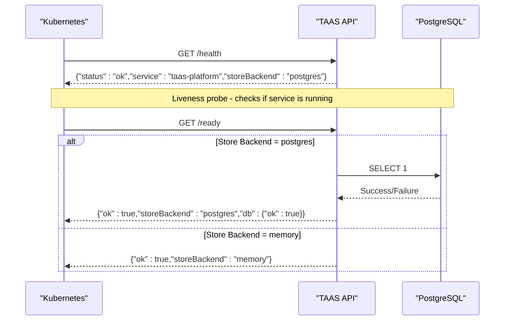
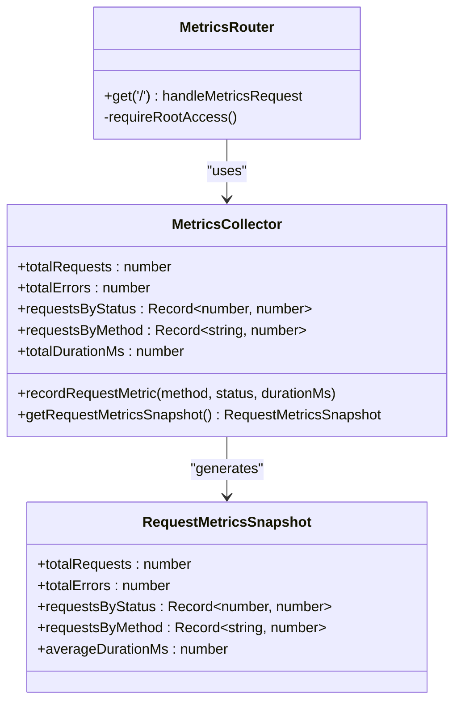
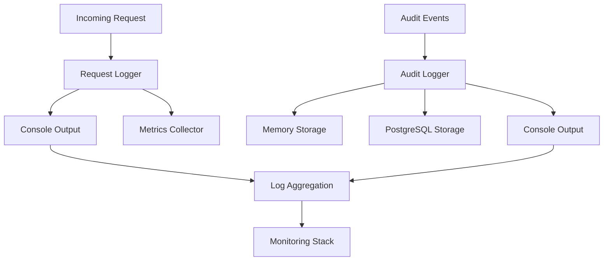
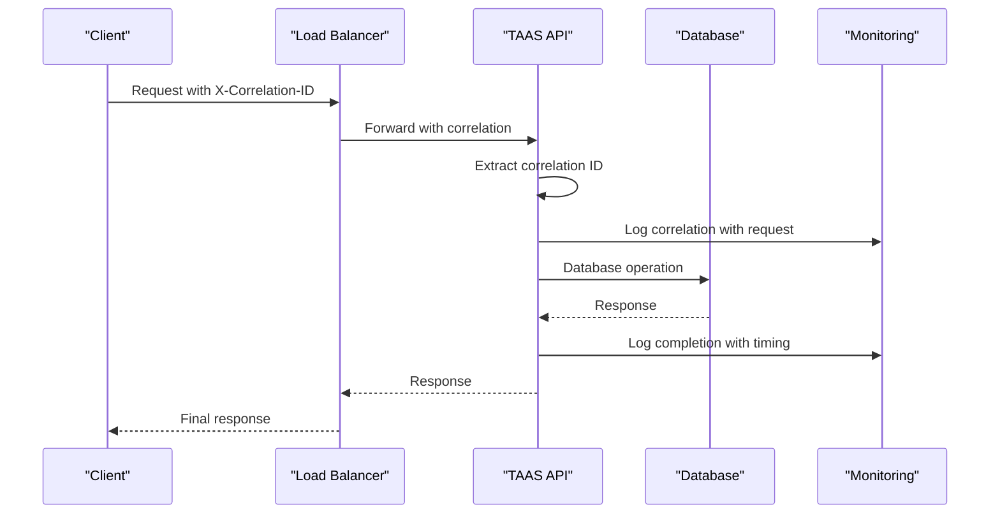
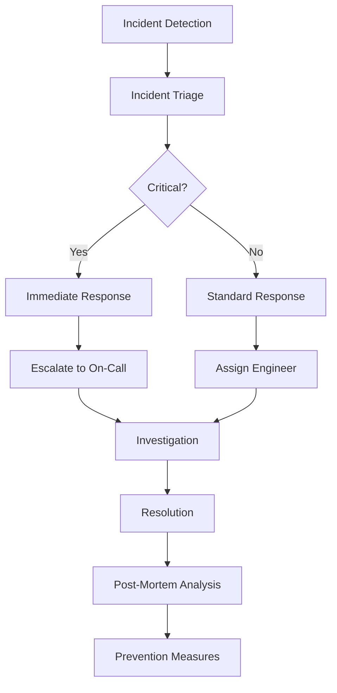

# Monitoring & Operations

<cite>
**Referenced Files in This Document**
- [src/infra/health.ts](file://src/infra/health.ts)
- [src/infra/metrics.ts](file://src/infra/metrics.ts)
- [src/api/metrics.ts](file://src/api/metrics.ts)
- [src/middleware/requestLogger.ts](file://src/middleware/requestLogger.ts)
- [src/infra/auditLogger.ts](file://src/infra/auditLogger.ts)
- [src/domain/audit.ts](file://src/domain/audit.ts)
- [src/middleware/rateLimit.ts](file://src/middleware/rateLimit.ts)
- [src/server.ts](file://src/server.ts)
- [Dockerfile](file://Dockerfile)
- [docker-compose.yml](file://docker-compose.yml)
- [src/config.ts](file://src/config.ts)
- [README.md](file://README.md)
- [package.json](file://package.json)
</cite>

## Table of Contents
1. [Introduction](#introduction)
2. [Health Checks and Readiness Probes](#health-checks-and-readiness-probes)
3. [Metrics Collection](#metrics-collection)
4. [Logging Infrastructure](#logging-infrastructure)
5. [Request Tracing](#request-tracing)
6. [Operational Endpoints](#operational-endpoints)
7. [Production Deployment Best Practices](#production-deployment-best-practices)
8. [Monitoring Dashboards and Alerting](#monitoring-dashboards-and-alerting)
9. [Incident Response Procedures](#incident-response-procedures)
10. [Performance Optimization](#performance-optimization)

## Introduction

EscrowGrid provides comprehensive monitoring and operations capabilities designed for production Kubernetes deployments. The platform implements industry-standard observability patterns including health checks, metrics collection, structured logging, and audit trails. This documentation covers the complete monitoring infrastructure, operational best practices, and production deployment strategies.

The monitoring system consists of four primary components:
- **Health Checks**: Liveness and readiness probes for Kubernetes integration
- **Metrics Collection**: Request-level telemetry in Prometheus-compatible format
- **Logging Infrastructure**: Structured logging with audit trails
- **Rate Limiting**: Traffic control mechanisms for stability

## Health Checks and Readiness Probes

### Health Check Implementation

The platform provides two distinct health check endpoints designed for different Kubernetes probe scenarios:



**Diagram sources**
- [src/server.ts](file://src/server.ts#L26-L38)
- [src/infra/health.ts](file://src/infra/health.ts#L13-L46)

### Health Check Endpoints

| Endpoint | Purpose | Response Format | Status Codes |
|----------|---------|-----------------|--------------|
| `/health` | Liveness probe | Basic service status | 200 OK |
| `/ready` | Readiness probe | Complete system health | 200 OK, 503 Service Unavailable |

#### Liveness Probe Configuration
The health endpoint provides immediate service status without external dependencies:

```typescript
// Health endpoint implementation
app.get('/health', (_req: Request, res: Response) => {
  res.json({ 
    status: 'ok', 
    service: 'taas-platform', 
    storeBackend: config.storeBackend 
  });
});
```

#### Readiness Probe Configuration
The readiness endpoint performs comprehensive system validation:

```typescript
// Readiness endpoint with database connectivity check
app.get('/ready', async (_req: Request, res: Response) => {
  const status = await checkReadiness();
  if (!status.ok) {
    return res.status(503).json(status);
  }
  return res.json(status);
});
```

**Section sources**
- [src/server.ts](file://src/server.ts#L26-L38)
- [src/infra/health.ts](file://src/infra/health.ts#L13-L46)

### Kubernetes Deployment Configuration

For optimal Kubernetes integration, configure the following probe settings:

```yaml
livenessProbe:
  httpGet:
    path: /health
    port: 4000
  initialDelaySeconds: 30
  periodSeconds: 10
  timeoutSeconds: 5
  failureThreshold: 3

readinessProbe:
  httpGet:
    path: /ready
    port: 4000
  initialDelaySeconds: 5
  periodSeconds: 10
  timeoutSeconds: 5
  failureThreshold: 3
```

## Metrics Collection

### Metrics Architecture

The platform implements a comprehensive metrics collection system that tracks request patterns, errors, and performance characteristics:



**Diagram sources**
- [src/infra/metrics.ts](file://src/infra/metrics.ts#L3-L39)
- [src/api/metrics.ts](file://src/api/metrics.ts#L1-L18)

### Metrics Data Model

The metrics system captures the following key indicators:

| Metric Category | Description | Data Type | Calculation |
|----------------|-------------|-----------|-------------|
| Total Requests | Cumulative request count | Integer | Incremented per request |
| Total Errors | 5xx status code occurrences | Integer | Counted for status ≥ 500 |
| Status Distribution | HTTP status code frequencies | Map | Status → Count |
| Method Distribution | HTTP method usage patterns | Map | Method → Count |
| Average Duration | Request processing time | Float | Total duration / Request count |

### Metrics Endpoint

The metrics endpoint provides root-only access to aggregated statistics:

```typescript
// Metrics endpoint with authentication
router.get('/', (req: AuthedRequest, res: Response) => {
  const auth = req.auth;
  if (!auth || auth.role !== 'root') {
    return res.status(403).json({ error: 'Forbidden: metrics are root-only' });
  }
  const snapshot = getRequestMetricsSnapshot();
  return res.json(snapshot);
});
```

### Prometheus Integration

For Prometheus monitoring, expose metrics in the following format:

```yaml
scrape_configs:
  - job_name: 'taas-backend'
    metrics_path: /metrics
    static_configs:
      - targets: ['taas-backend:4000']
    scrape_interval: 30s
```

**Section sources**
- [src/infra/metrics.ts](file://src/infra/metrics.ts#L1-L39)
- [src/api/metrics.ts](file://src/api/metrics.ts#L1-L18)

## Logging Infrastructure

### Structured Logging Architecture

The platform implements a multi-layered logging system with separate channels for different operational concerns:



**Diagram sources**
- [src/middleware/requestLogger.ts](file://src/middleware/requestLogger.ts#L5-L29)
- [src/infra/auditLogger.ts](file://src/infra/auditLogger.ts#L13-L109)

### Request Logging

Each incoming request generates structured log entries with comprehensive metadata:

```typescript
// Request log payload structure
const logPayload = {
  type: 'request',
  method: req.method,
  path: req.path,
  status: res.statusCode,
  durationMs: durationMs,
  apiKeyId: auth?.apiKeyId ?? null,
  institutionId: auth?.institutionId ?? null,
};
```

### Audit Logging

The audit system maintains immutable records of all administrative actions:

```typescript
// Audit event structure
interface AuditEvent {
  id: string;
  occurredAt: string;
  createdAt: string;
  apiKeyId?: string;
  institutionId?: string;
  method: string;
  path: string;
  action: AuditAction;
  resourceType?: string;
  resourceId?: string;
  payload?: Record<string, unknown>;
}
```

### Log Aggregation Strategies

For production deployments, implement centralized log aggregation:

1. **Structured JSON Format**: All logs use JSON format for easy parsing
2. **Log Levels**: Differentiate between request logs, audit logs, and system events
3. **Correlation IDs**: Track requests across microservices
4. **Centralized Storage**: Aggregate logs to Elasticsearch, Splunk, or similar systems

**Section sources**
- [src/middleware/requestLogger.ts](file://src/middleware/requestLogger.ts#L5-L29)
- [src/infra/auditLogger.ts](file://src/infra/auditLogger.ts#L13-L109)
- [src/domain/audit.ts](file://src/domain/audit.ts#L1-L36)

## Request Tracing

### Distributed Tracing Implementation

The platform supports distributed tracing through correlation IDs and structured logging:



### Trace Correlation

Implement correlation tracking through:

1. **Request Headers**: Propagate correlation IDs through request headers
2. **Log Context**: Include correlation IDs in all log entries
3. **Metrics Tagging**: Tag metrics with correlation identifiers
4. **Audit Trails**: Link audit events to specific request traces

### Performance Monitoring

Track request performance across the entire request lifecycle:

- **End-to-End Latency**: Total request processing time
- **Database Query Times**: Individual query execution times
- **External Service Calls**: Third-party API response times
- **Middleware Processing**: Time spent in request middleware

## Operational Endpoints

### Core Management Endpoints

The platform exposes several operational endpoints for monitoring and management:

| Endpoint | Method | Purpose | Authentication |
|----------|--------|---------|----------------|
| `/health` | GET | Service health status | None |
| `/ready` | GET | System readiness | None |
| `/metrics` | GET | Request metrics | Root only |
| `/openapi.json` | GET | API specification | None |
| `/docs` | GET | Swagger UI | None |
| `/docs/redoc` | GET | ReDoc documentation | None |

### Endpoint Security

All operational endpoints implement appropriate security measures:

```typescript
// Metrics endpoint security
router.get('/', (req: AuthedRequest, res: Response) => {
  const auth = req.auth;
  if (!auth || auth.role !== 'root') {
    return res.status(403).json({ error: 'Forbidden: metrics are root-only' });
  }
  // Proceed with metrics retrieval
});
```

**Section sources**
- [src/server.ts](file://src/server.ts#L26-L88)
- [src/api/metrics.ts](file://src/api/metrics.ts#L7-L14)

## Production Deployment Best Practices

### Container Configuration

The platform uses multi-stage Docker builds for optimal production deployment:

```dockerfile
# Production-ready container configuration
FROM node:20-alpine AS runner
WORKDIR /app
ENV NODE_ENV=production

# Install production dependencies only
COPY package.json package-lock.json ./
RUN npm ci --omit=dev

# Copy built artifacts
COPY --from=builder /app/dist ./dist
COPY db ./db

EXPOSE 4000
CMD ["node", "dist/server.js"]
```

### Environment Configuration

Configure production environment variables for optimal monitoring:

```yaml
environment:
  NODE_ENV: production
  STORE_BACKEND: postgres
  DATABASE_URL: postgres://user:pass@db:5432/taas_platform
  ROOT_API_KEY: "${ROOT_API_KEY}"
  RATE_LIMIT_ENABLED: "true"
  RATE_LIMIT_WINDOW_MS: "60000"
  RATE_LIMIT_MAX_REQUESTS: "1000"
```

### Resource Management

Implement proper resource limits and requests:

```yaml
resources:
  requests:
    memory: "256Mi"
    cpu: "100m"
  limits:
    memory: "512Mi"
    cpu: "500m"
```

### Database Configuration

For PostgreSQL backend, ensure proper connection pooling and monitoring:

```yaml
healthcheck:
  test: ["CMD", "pg_isready", "-U", "taas_user"]
  interval: 5s
  timeout: 5s
  retries: 5
```

**Section sources**
- [Dockerfile](file://Dockerfile#L1-L27)
- [docker-compose.yml](file://docker-compose.yml#L23-L47)
- [src/config.ts](file://src/config.ts#L23-L46)

## Monitoring Dashboards and Alerting

### Dashboard Configuration

Create comprehensive monitoring dashboards covering:

1. **Service Health**: Availability and response time metrics
2. **Database Performance**: Query execution times and connection counts
3. **Request Patterns**: Method distribution and status code trends
4. **Error Rates**: 5xx error rates and error categorization
5. **Resource Utilization**: CPU, memory, and disk usage

### Alerting Strategies

Implement multi-tier alerting based on SLIs:

| Alert Level | Condition | Response Time | Action |
|-------------|-----------|---------------|--------|
| Critical | Service unavailable | Immediate | Page on-call engineer |
| Warning | High error rate (>5%) | 15 minutes | Investigate and escalate |
| Info | Performance degradation | 1 hour | Monitor and document |

### SLO Implementation

Define Service Level Objectives for production:

```yaml
# Example SLO configuration
slos:
  availability:
    target: 99.9%
    period: 30d
    granularity: 5m
  
  latency:
    target: 95th percentile < 300ms
    period: 30d
    granularity: 5m
  
  error_budget_policy:
    burn_rate_threshold: 0.5
    investigation_time: 1h
```

## Incident Response Procedures

### Incident Classification

Classify incidents based on impact and urgency:

1. **Critical Incidents**: Service unavailability or data loss
2. **High Impact**: Significant performance degradation
3. **Medium Impact**: Feature degradation or partial outages
4. **Low Impact**: Minor usability issues

### Response Workflow

Implement structured incident response procedures:



### Recovery Procedures

Establish documented recovery procedures for common scenarios:

1. **Database Failures**: Automatic failover and manual intervention
2. **High Load**: Auto-scaling and rate limiting activation
3. **Configuration Errors**: Rollback procedures and configuration validation
4. **Security Incidents**: Isolation and forensic analysis

## Performance Optimization

### Rate Limiting Implementation

The platform implements sliding-window rate limiting to prevent abuse:

```typescript
// Rate limiting with sliding window
const entry = buckets.get(key);
if (!entry || now - entry.windowStart >= windowMs) {
  buckets.set(key, { windowStart: now, count: 1 });
} else if (entry.count >= maxRequests) {
  // Return 429 Too Many Requests
}
```

### Caching Strategies

Implement caching for frequently accessed data:

1. **In-Memory Caching**: For hot data requiring low latency
2. **Redis Caching**: For distributed caching across instances
3. **Database Indexing**: Optimize query performance with proper indexes

### Database Optimization

Optimize database performance through:

1. **Connection Pooling**: Manage database connections efficiently
2. **Query Optimization**: Analyze and optimize slow queries
3. **Index Management**: Create appropriate indexes for query patterns
4. **Partitioning**: Implement table partitioning for large datasets

**Section sources**
- [src/middleware/rateLimit.ts](file://src/middleware/rateLimit.ts#L12-L67)