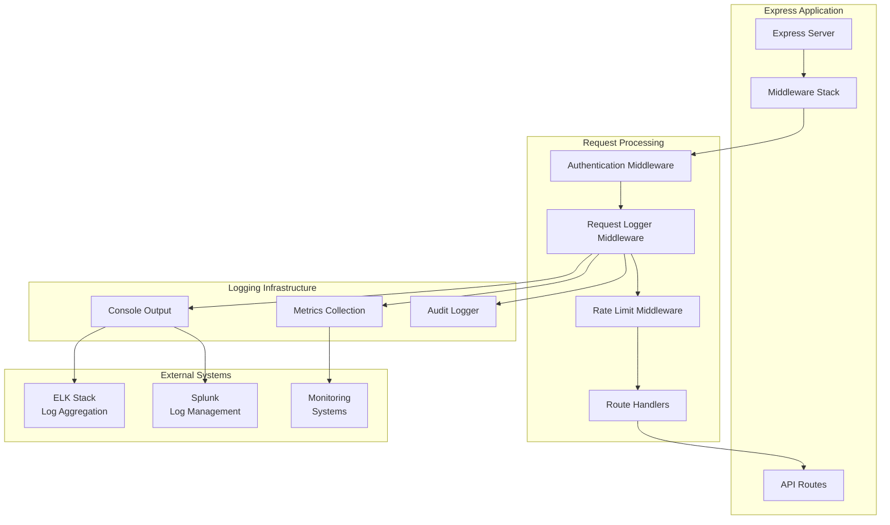
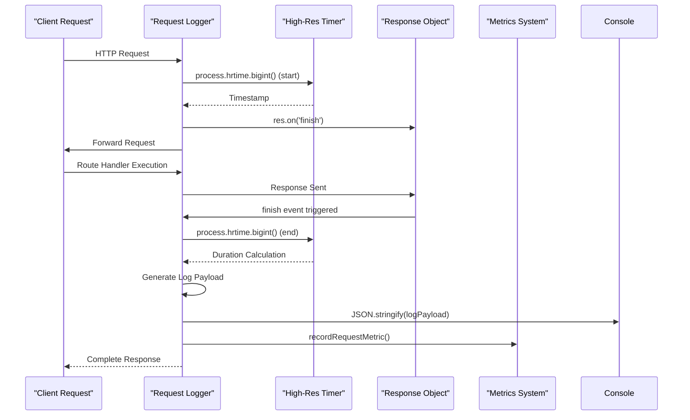
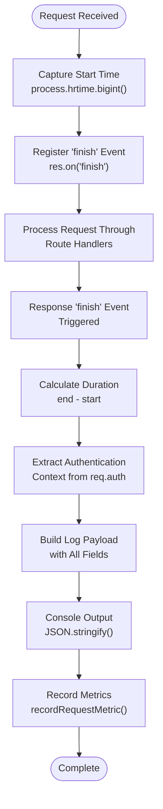
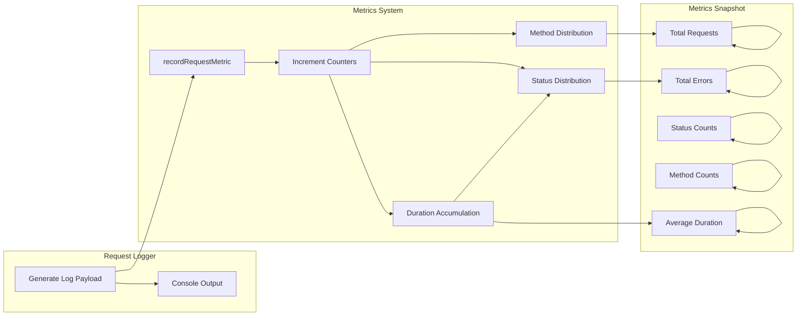
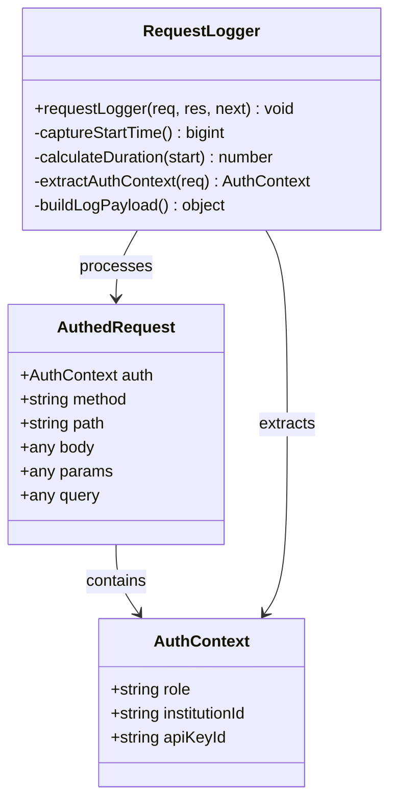
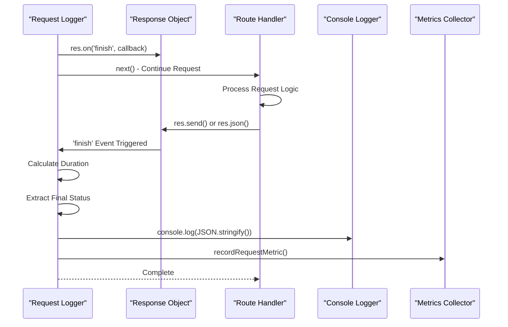
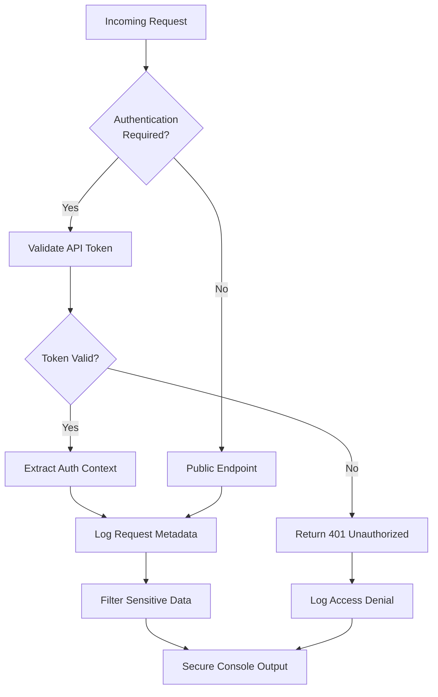
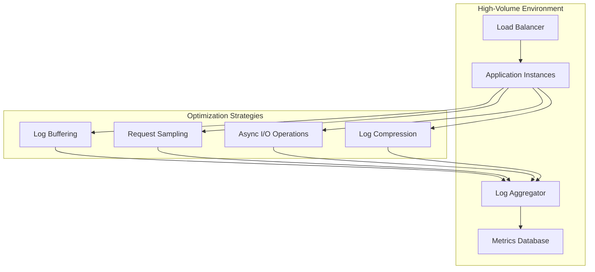
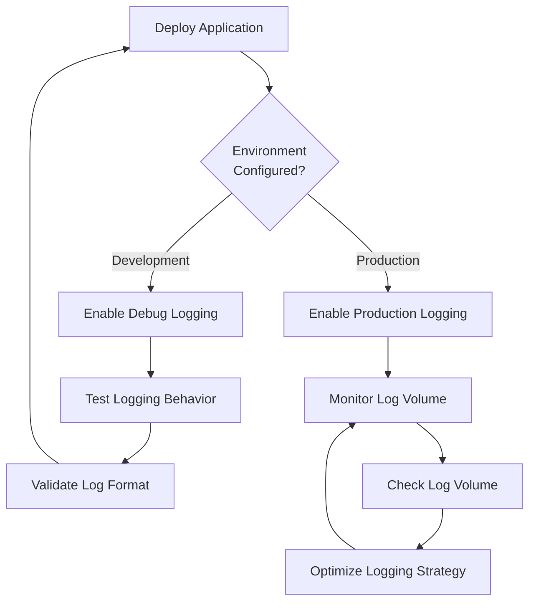
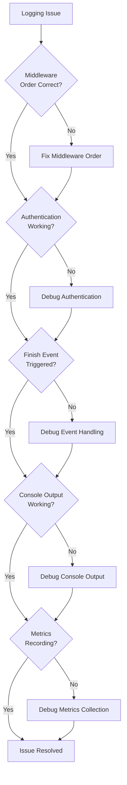

# Request Logging

<cite>
**Referenced Files in This Document**
- [requestLogger.ts](file://src/middleware/requestLogger.ts)
- [server.ts](file://src/server.ts)
- [metrics.ts](file://src/infra/metrics.ts)
- [auditLogger.ts](file://src/infra/auditLogger.ts)
- [auth.ts](file://src/middleware/auth.ts)
- [audit.ts](file://src/domain/audit.ts)
- [config.ts](file://src/config.ts)
- [product.md](file://product.md)
</cite>

## Table of Contents
1. [Introduction](#introduction)
2. [Architecture Overview](#architecture-overview)
3. [Request Logger Implementation](#request-logger-implementation)
4. [Log Payload Structure](#log-payload-structure)
5. [Integration with Metrics System](#integration-with-metrics-system)
6. [Authentication Context](#authentication-context)
7. [Response Event Handling](#response-event-handling)
8. [Log Output Examples](#log-output-examples)
9. [Log Aggregation and Monitoring](#log-aggregation-and-monitoring)
10. [Security and Privacy Considerations](#security-and-privacy-considerations)
11. [Performance Optimization](#performance-optimization)
12. [Best Practices](#best-practices)
13. [Troubleshooting](#troubleshooting)

## Introduction

The escrowgrid request logging mechanism provides comprehensive audit trails and performance monitoring for API requests. Built as a middleware component, it captures essential request metadata, computes response durations, and generates structured JSON logs that complement the metrics system while maintaining security and privacy standards.

This logging system serves multiple purposes:
- **Audit Trail**: Maintains a complete record of all API interactions for compliance and debugging
- **Performance Monitoring**: Tracks request durations and response patterns
- **Debugging Support**: Provides detailed request context for troubleshooting
- **Compliance**: Ensures regulatory requirements for transaction logging are met

## Architecture Overview

The request logging system integrates seamlessly with the Express.js middleware stack and works in conjunction with the metrics collection system.



**Diagram sources**
- [server.ts](file://src/server.ts#L19-L24)
- [requestLogger.ts](file://src/middleware/requestLogger.ts#L5-L28)

**Section sources**
- [server.ts](file://src/server.ts#L19-L24)
- [requestLogger.ts](file://src/middleware/requestLogger.ts#L5-L28)

## Request Logger Implementation

The request logger middleware is implemented as a pure Express middleware function that captures request timing and generates structured log output.

### Core Implementation Details

The middleware follows a sophisticated timing mechanism using Node.js high-resolution timers:



**Diagram sources**
- [requestLogger.ts](file://src/middleware/requestLogger.ts#L5-L28)

### Timing Precision and Accuracy

The implementation uses Node.js's high-resolution timer (`process.hrtime.bigint()`) for precise duration measurement:

- **Start Time Capture**: Records timestamp immediately upon middleware invocation
- **End Time Capture**: Uses the `'finish'` event to capture response completion
- **Duration Calculation**: Computes nanosecond precision and converts to milliseconds
- **Precision**: Achieves microsecond-level accuracy for performance monitoring

**Section sources**
- [requestLogger.ts](file://src/middleware/requestLogger.ts#L5-L28)

## Log Payload Structure

The request logger generates structured JSON payloads containing comprehensive request metadata:

| Field | Type | Description | Example |
|-------|------|-------------|---------|
| `type` | string | Log type identifier | `"request"` |
| `method` | string | HTTP method | `"GET"`, `"POST"`, `"PUT"`, `"DELETE"` |
| `path` | string | Request URL path | `"/api/v1/users"` |
| `status` | number | HTTP status code | `200`, `404`, `500` |
| `durationMs` | number | Request duration in milliseconds | `123.456` |
| `apiKeyId` | string \| null | Associated API key ID | `"api_key_123"` |
| `institutionId` | string \| null | Associated institution ID | `"inst_456"` |

### Log Payload Construction

The log payload is constructed dynamically based on the request context:



**Diagram sources**
- [requestLogger.ts](file://src/middleware/requestLogger.ts#L9-L24)

**Section sources**
- [requestLogger.ts](file://src/middleware/requestLogger.ts#L13-L21)

## Integration with Metrics System

The request logging system seamlessly integrates with the metrics collection infrastructure to provide dual-purpose data capture.

### Metrics Collection Flow



**Diagram sources**
- [requestLogger.ts](file://src/middleware/requestLogger.ts#L22-L23)
- [metrics.ts](file://src/infra/metrics.ts#L17-L25)

### Metrics Data Flow

The metrics system maintains several key counters and distributions:

- **Request Counters**: Track total requests and error occurrences
- **Status Distribution**: Categorize requests by HTTP status codes
- **Method Distribution**: Monitor request patterns by HTTP method
- **Duration Tracking**: Accumulate response times for performance analysis

**Section sources**
- [requestLogger.ts](file://src/middleware/requestLogger.ts#L22-L23)
- [metrics.ts](file://src/infra/metrics.ts#L17-L25)

## Authentication Context

The request logger leverages the authentication middleware to extract contextual information about the requesting entity.

### Authentication Integration



**Diagram sources**
- [auth.ts](file://src/middleware/auth.ts#L8-L12)
- [auth.ts](file://src/middleware/auth.ts#L14-L20)
- [requestLogger.ts](file://src/middleware/requestLogger.ts#L12-L21)

### Context Extraction Logic

The authentication context extraction follows a null-safe approach:

- **apiKeyId**: Retrieved from `req.auth?.apiKeyId` with fallback to `null`
- **institutionId**: Retrieved from `req.auth?.institutionId` with fallback to `null`
- **Graceful Degradation**: Handles missing authentication gracefully

**Section sources**
- [auth.ts](file://src/middleware/auth.ts#L8-L21)
- [requestLogger.ts](file://src/middleware/requestLogger.ts#L12-L21)

## Response Event Handling

The request logger utilizes the Node.js `'finish'` event to ensure logging occurs after response completion, regardless of the response type or status.

### Event-Driven Logging



**Diagram sources**
- [requestLogger.ts](file://src/middleware/requestLogger.ts#L9-L24)

### Event Lifecycle Management

The `'finish'` event ensures comprehensive coverage:

- **Successful Responses**: Logs after successful completion
- **Error Responses**: Captures error status codes
- **Streaming Responses**: Works with chunked transfer encoding
- **Timeout Handling**: Captures timeout scenarios
- **Connection Closure**: Handles client disconnections

**Section sources**
- [requestLogger.ts](file://src/middleware/requestLogger.ts#L9-L24)

## Log Output Examples

The request logger produces structured JSON output suitable for automated log processing systems.

### Standard Request Log

```json
{
  "type": "request",
  "method": "GET",
  "path": "/api/v1/institutions",
  "status": 200,
  "durationMs": 123.456,
  "apiKeyId": "api_key_123",
  "institutionId": "inst_456"
}
```

### Error Response Log

```json
{
  "type": "request",
  "method": "POST",
  "path": "/api/v1/assets",
  "status": 400,
  "durationMs": 89.123,
  "apiKeyId": "api_key_789",
  "institutionId": null
}
```

### Authentication-Only Request

```json
{
  "type": "request",
  "method": "GET",
  "path": "/health",
  "status": 200,
  "durationMs": 1.234,
  "apiKeyId": null,
  "institutionId": null
}
```

### High-Performance Request

```json
{
  "type": "request",
  "method": "GET",
  "path": "/api/v1/metrics",
  "status": 200,
  "durationMs": 0.123,
  "apiKeyId": "root_api_key",
  "institutionId": null
}
```

**Section sources**
- [requestLogger.ts](file://src/middleware/requestLogger.ts#L13-L21)

## Log Aggregation and Monitoring

The structured JSON output is designed for seamless integration with enterprise log aggregation and monitoring solutions.

### ELK Stack Integration

For Elasticsearch, Logstash, and Kibana deployments:

```json
{
  "@timestamp": "2024-01-15T10:30:45.123Z",
  "type": "request",
  "method": "POST",
  "path": "/api/v1/transactions",
  "status": 201,
  "durationMs": 156.789,
  "apiKeyId": "api_key_xyz",
  "institutionId": "inst_abc"
}
``### Splunk Integration

For Splunk deployments, the JSON structure enables powerful search and analytics:

```
index=api_logs type=request status=500 durationMs>1000
```

### Monitoring Dashboard Configuration

Key metrics for dashboard creation:

- **Request Volume**: Total requests per minute/hour/day
- **Response Times**: Average, median, and percentile response times
- **Error Rates**: Percentage of 4xx and 5xx responses
- **API Usage**: Requests by endpoint and method
- **Performance Trends**: Response time trends over time

### Log Retention Strategies

Based on regulatory requirements and storage costs:

| Environment | Retention Period | Storage Tier |
|-------------|------------------|--------------|
| Production | 365 days | Hot Storage |
| Staging | 90 days | Warm Storage |
| Development | 30 days | Cold Storage |
| Compliance | 730 days | Archive Storage |

**Section sources**
- [product.md](file://product.md#L87-L90)

## Security and Privacy Considerations

The request logging system implements several security measures to protect sensitive information and maintain privacy compliance.

### PII Protection

The current implementation avoids logging Personally Identifiable Information (PII):

- **No Body Content**: Request bodies are not logged
- **Minimal Path Info**: Sensitive parameters are not exposed
- **Token Masking**: API keys are not logged in plain text
- **Context Filtering**: Only necessary authentication context is captured

### Security Best Practices



**Diagram sources**
- [auth.ts](file://src/middleware/auth.ts#L35-L81)
- [requestLogger.ts](file://src/middleware/requestLogger.ts#L12-L21)

### Data Sanitization Guidelines

- **Remove Sensitive Headers**: Authorization tokens, cookies
- **Mask API Keys**: Only log key prefixes or identifiers
- **Sanitize Paths**: Remove sensitive parameters from URLs
- **Control Log Levels**: Adjust verbosity based on environment

**Section sources**
- [auth.ts](file://src/middleware/auth.ts#L35-L81)
- [requestLogger.ts](file://src/middleware/requestLogger.ts#L12-L21)

## Performance Optimization

The request logging system is designed for minimal performance impact while providing comprehensive monitoring capabilities.

### Performance Impact Analysis

| Operation | Cost | Optimization Strategy |
|-----------|------|----------------------|
| High-Res Timer | Low | Native Node.js implementation |
| JSON Serialization | Medium | Minimal payload size |
| Console Output | Low | Asynchronous I/O |
| Metrics Collection | Very Low | In-memory counters |

### Scalability Considerations



### Performance Tuning Recommendations

- **Sampling Rate**: Implement configurable sampling for high-volume endpoints
- **Buffering**: Batch log entries to reduce I/O overhead
- **Compression**: Enable gzip compression for log transmission
- **Async Processing**: Ensure logging doesn't block request processing
- **Resource Limits**: Set appropriate limits on log file sizes and rotation

**Section sources**
- [requestLogger.ts](file://src/middleware/requestLogger.ts#L5-L28)

## Best Practices

### Implementation Guidelines

1. **Middleware Order**: Place request logger after authentication but before rate limiting
2. **Environment Configuration**: Disable detailed logging in production environments
3. **Log Rotation**: Implement proper log rotation to prevent disk space issues
4. **Monitoring Integration**: Connect logs to monitoring dashboards for alerting
5. **Testing Coverage**: Include logging behavior in API test suites

### Operational Procedures



### Maintenance Tasks

- **Log Review**: Regular review of log patterns and anomalies
- **Retention Policy**: Update retention policies based on compliance changes
- **Performance Monitoring**: Monitor logging performance impact
- **Security Audits**: Review logging security measures periodically

**Section sources**
- [server.ts](file://src/server.ts#L22-L24)
- [config.ts](file://src/config.ts#L23-L38)

## Troubleshooting

### Common Issues and Solutions

| Issue | Symptoms | Solution |
|-------|----------|----------|
| Missing Authentication Context | `apiKeyId` and `institutionId` are null | Verify authentication middleware is properly configured |
| Inaccurate Timing | DurationMs shows unexpected values | Check for long-running synchronous operations |
| High Memory Usage | Application memory increases over time | Investigate log buffering and garbage collection |
| Missing Logs | Expected logs not appearing | Verify middleware order and error handling |

### Debugging Techniques



### Diagnostic Commands

For development and debugging:

```bash
# Check middleware registration
curl -X GET http://localhost:4000/health | jq .

# Monitor log output
tail -f /var/log/app/logs/application.log | grep "request"

# Verify metrics collection
curl -X GET http://localhost:4000/api/v1/metrics | jq .
```

**Section sources**
- [requestLogger.ts](file://src/middleware/requestLogger.ts#L5-L28)
- [metrics.ts](file://src/infra/metrics.ts#L28-L37)