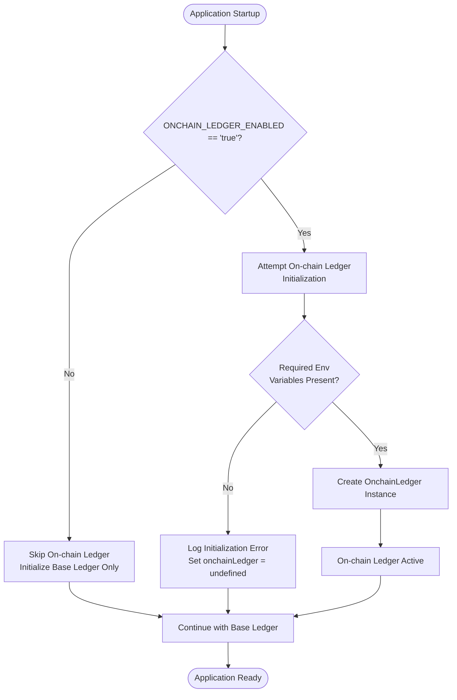
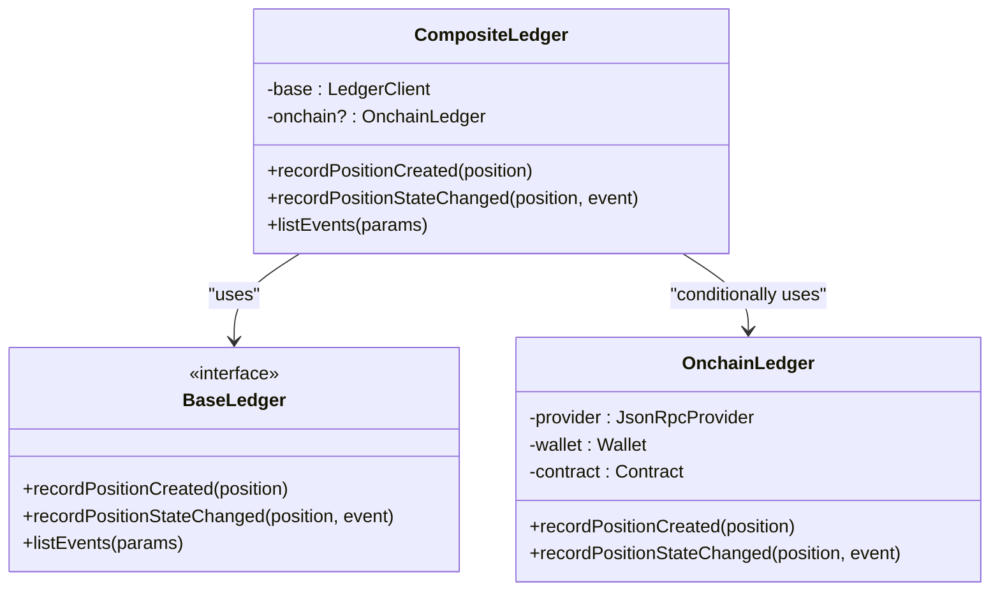
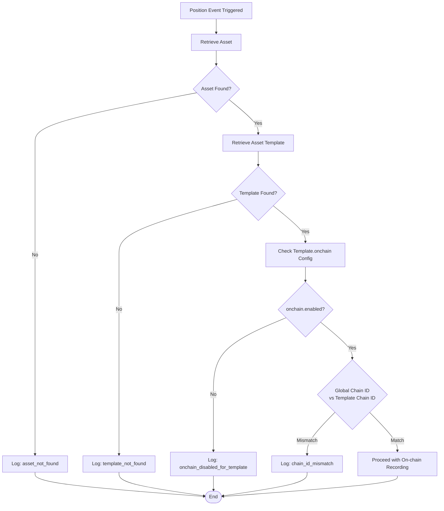

# Configuration

<cite>
**Referenced Files in This Document**
- [src/config.ts](file://src/config.ts)
- [src/infra/onchainLedger.ts](file://src/infra/onchainLedger.ts)
- [src/infra/ledgerClient.ts](file://src/infra/ledgerClient.ts)
- [docker-compose.yml](file://docker-compose.yml)
- [README.md](file://README.md)
- [product.md](file://product.md)
</cite>

## Table of Contents
1. [Introduction](#introduction)
2. [Environment Variables Configuration](#environment-variables-configuration)
3. [Global Feature Toggle](#global-feature-toggle)
4. [Ethereum Connection Setup](#ethereum-connection-setup)
5. [Chain ID Validation](#chain-id-validation)
6. [Asset Template Configuration](#asset-template-configuration)
7. [Error Handling and Logging](#error-handling-and-logging)
8. [Security Best Practices](#security-best-practices)
9. [Common Issues and Troubleshooting](#common-issues-and-troubleshooting)
10. [Practical Examples](#practical-examples)

## Introduction

EscrowGrid's on-chain integration enables real-time recording of financial position events on blockchain networks. This feature allows institutions to maintain immutable audit trails of their escrow positions, providing transparency and regulatory compliance capabilities. The on-chain ledger operates as an optional extension to the core platform, requiring specific environment variables and configuration to activate.

The on-chain integration follows a dual-layer approach: global feature toggling through environment variables and granular per-asset-template configuration. This design ensures flexibility while maintaining security and operational control.

## Environment Variables Configuration

### Core Environment Variables

The on-chain ledger functionality relies on four essential environment variables for Ethereum network connectivity:

| Variable | Description | Required | Example |
|----------|-------------|----------|---------|
| `ONCHAIN_LEDGER_ENABLED` | Global toggle for on-chain ledger feature | Yes | `true` |
| `ONCHAIN_RPC_URL` | Ethereum node RPC endpoint URL | Yes | `https://eth-mainnet.g.alchemy.com/v2/YOUR-KEY` |
| `ONCHAIN_PRIVATE_KEY` | Wallet private key for transaction signing | Yes | `0x1234...deadbeef` |
| `ONCHAIN_CONTRACT_ADDRESS` | Smart contract address for position event recording | Yes | `0x5678...f00d` |
| `ONCHAIN_CHAIN_ID` | Ethereum network chain identifier (optional) | No | `1` |

### Configuration Implementation

The configuration system parses environment variables and validates their presence during application startup. The [`config.ts`](file://src/config.ts#L28-L34) file demonstrates the environment variable parsing logic:

```typescript
export const config: AppConfig = {
  onchainLedgerEnabled: process.env.ONCHAIN_LEDGER_ENABLED === 'true',
  onchainRpcUrl: process.env.ONCHAIN_RPC_URL,
  onchainPrivateKey: process.env.ONCHAIN_PRIVATE_KEY,
  onchainContractAddress: process.env.ONCHAIN_CONTRACT_ADDRESS,
  onchainChainId: process.env.ONCHAIN_CHAIN_ID
    ? Number.parseInt(process.env.ONCHAIN_CHAIN_ID, 10)
    : undefined,
};
```

**Section sources**
- [src/config.ts](file://src/config.ts#L28-L34)

### Type Safety and Validation

The configuration system enforces type safety through TypeScript interfaces. The [`AppConfig`](file://src/config.ts#L3-L16) interface defines the shape of the configuration object, ensuring compile-time validation of environment variable types and presence requirements.

**Section sources**
- [src/config.ts](file://src/config.ts#L3-L16)

## Global Feature Toggle

### `onchainLedgerEnabled` Flag

The `ONCHAIN_LEDGER_ENABLED` environment variable serves as the primary switch for activating the on-chain ledger feature. When set to `true`, the system attempts to initialize the Ethereum connection and enable on-chain event recording.

### Initialization Process

The ledger client initialization process demonstrates the feature toggle mechanism:



**Diagram sources**
- [src/infra/ledgerClient.ts](file://src/infra/ledgerClient.ts#L48-L60)

### Composite Ledger Architecture

When the on-chain ledger is enabled, the system creates a composite ledger that combines both on-chain and base ledger functionality:



**Diagram sources**
- [src/infra/ledgerClient.ts](file://src/infra/ledgerClient.ts#L8-L37)

**Section sources**
- [src/infra/ledgerClient.ts](file://src/infra/ledgerClient.ts#L48-L60)

## Ethereum Connection Setup

### Provider Configuration

The Ethereum connection initialization occurs in the [`OnchainLedger`](file://src/infra/onchainLedger.ts#L16-L22) constructor. The system establishes connections using the `ethers` library with the following components:

1. **JsonRpcProvider**: Connects to the Ethereum node via the RPC URL
2. **Wallet**: Initializes with the private key and provider
3. **Contract**: Links to the smart contract using ABI and wallet

### Connection Validation

The constructor performs immediate validation of required environment variables:

```typescript
constructor() {
  if (!config.onchainRpcUrl || !config.onchainPrivateKey || !config.onchainContractAddress) {
    throw new Error('On-chain ledger requires ONCHAIN_RPC_URL, ONCHAIN_PRIVATE_KEY, and ONCHAIN_CONTRACT_ADDRESS');
  }
  this.provider = new ethers.JsonRpcProvider(config.onchainRpcUrl, config.onchainChainId);
  this.wallet = new ethers.Wallet(config.onchainPrivateKey, this.provider);
  this.contract = new ethers.Contract(config.onchainContractAddress, ledgerAbi, this.wallet);
}
```

### Network Compatibility

The system supports both mainnet and testnet configurations through the optional `ONCHAIN_CHAIN_ID` parameter. When provided, the chain ID is validated against the smart contract's network to prevent cross-network transactions.

**Section sources**
- [src/infra/onchainLedger.ts](file://src/infra/onchainLedger.ts#L16-L22)

## Chain ID Validation

### Multi-Level Validation

The chain ID validation occurs at two levels: global configuration and per-asset-template settings.

#### Global Chain ID Check

The global chain ID validation ensures consistency across all on-chain operations:



**Diagram sources**
- [src/infra/onchainLedger.ts](file://src/infra/onchainLedger.ts#L25-L82)

#### Template-Specific Chain ID

Each asset template can specify its own chain ID in the `config.onchain.chainId` field. This allows different templates to operate on different networks while sharing the same application instance.

### Validation Logic

The chain ID validation compares the global configuration with template-specific settings:

```typescript
if (
  config.onchainChainId !== undefined &&
  onchainConfig.chainId !== undefined &&
  onchainConfig.chainId !== config.onchainChainId
) {
  console.log(
    JSON.stringify({
      type: 'onchain_ledger_skip',
      reason: 'chain_id_mismatch',
      positionId: position.id,
      templateChainId: onchainConfig.chainId,
      configuredChainId: config.onchainChainId,
    })
  );
  return;
}
```

**Section sources**
- [src/infra/onchainLedger.ts](file://src/infra/onchainLedger.ts#L67-L81)

## Asset Template Configuration

### Per-Template On-chain Settings

Asset templates define on-chain behavior through the `config.onchain` JSON object. This configuration enables fine-grained control over which positions are recorded on-chain and on which networks.

### Configuration Schema

| Field | Type | Description | Required |
|-------|------|-------------|----------|
| `enabled` | boolean | Enables/disables on-chain recording for this template | No |
| `chainId` | number | Specifies target blockchain network | No |

### Template Creation Example

The following example demonstrates creating an asset template with on-chain enabled:

```json
{
  "code": "CONSTR_ESCROW_ONCHAIN",
  "name": "On-chain Construction Escrow",
  "vertical": "CONSTRUCTION",
  "region": "EU_UK",
  "config": {
    "currency": "USD",
    "onchain": {
      "enabled": true,
      "chainId": 11155111
    }
  }
}
```

### Template Validation Process

The system validates template configuration during position creation and state change events:

1. **Asset Lookup**: Retrieves the associated asset record
2. **Template Retrieval**: Fetches the asset template configuration
3. **Feature Toggle**: Checks if on-chain recording is enabled
4. **Network Validation**: Compares chain IDs between configuration and global settings

**Section sources**
- [README.md](file://README.md#L250-L274)
- [src/infra/onchainLedger.ts](file://src/infra/onchainLedger.ts#L52-L66)

## Error Handling and Logging

### Structured Logging System

The on-chain ledger implements a comprehensive logging system using structured JSON output. This approach enables centralized log aggregation and analysis.

### Error Types and Patterns

#### Initialization Errors

When the on-chain ledger fails to initialize, the system logs structured error information:

```json
{
  "type": "onchain_ledger_init_error",
  "error": "On-chain ledger requires ONCHAIN_RPC_URL, ONCHAIN_PRIVATE_KEY, and ONCHAIN_CONTRACT_ADDRESS"
}
```

#### Operation Skips

The system logs various reasons for skipping on-chain operations:

```json
{
  "type": "onchain_ledger_skip",
  "reason": "chain_id_mismatch",
  "positionId": "pos_123",
  "templateChainId": 11155111,
  "configuredChainId": 1
}
```

#### Transaction Errors

During position event recording, the system captures and logs transaction failures:

```json
{
  "type": "onchain_ledger_error",
  "operation": "recordPositionCreated",
  "positionId": "pos_123",
  "error": "Insufficient funds for transaction"
}
```

### Logging Categories

| Category | Purpose | Example Scenarios |
|----------|---------|-------------------|
| `onchain_ledger_init_error` | Initialization failures | Missing environment variables, RPC connectivity issues |
| `onchain_ledger_skip` | Skipped operations | Asset/template not found, feature disabled, chain ID mismatch |
| `onchain_ledger` | Successful operations | Position created/updated on-chain |
| `onchain_ledger_error` | Transaction failures | Gas estimation errors, contract revert |

**Section sources**
- [src/infra/onchainLedger.ts](file://src/infra/onchainLedger.ts#L110-L118)
- [src/infra/onchainLedger.ts](file://src/infra/onchainLedger.ts#L209-L217)
- [src/infra/ledgerClient.ts](file://src/infra/ledgerClient.ts#L52-L58)

## Security Best Practices

### Private Key Management

#### Environment Variable Storage

Private keys should never be hardcoded in source code. Instead, they should be stored in environment variables managed by a secrets management system:

```bash
# ❌ Bad practice - hardcoded private key
export ONCHAIN_PRIVATE_KEY="0x1234...deadbeef"

# ✅ Good practice - use secrets manager
export ONCHAIN_PRIVATE_KEY=$(vault kv get -field=private_key secret/escrowgrid/onchain)
```

#### Key Rotation Procedures

Regular key rotation is essential for security:

1. **Generate New Key Pair**: Create a new Ethereum wallet
2. **Update Environment Variables**: Deploy new private key to production
3. **Update Smart Contract**: Modify contract permissions if necessary
4. **Test Connectivity**: Verify new key works with the system
5. **Revoke Old Key**: Remove old key from secrets management

### Network Security

#### RPC Endpoint Security

Choose reliable RPC providers with proper rate limiting and DDoS protection:

```bash
# Use authenticated endpoints when available
export ONCHAIN_RPC_URL="https://eth-mainnet.g.alchemy.com/v2/YOUR-KEY"

# Consider multiple providers for redundancy
export ONCHAIN_RPC_URL="https://rpc-endpoint-1.example.com,https://rpc-endpoint-2.example.com"
```

#### Chain ID Verification

Always specify and verify chain IDs to prevent accidental transactions on wrong networks:

```typescript
// Global configuration
export const config = {
  onchainChainId: 1, // Mainnet
  // or
  onchainChainId: 11155111, // Sepolia Testnet
};
```

### Access Control

#### API Key Management

Separate API keys should be used for different environments and use cases:

```bash
# Production API key
export ROOT_API_KEY="prod_abc123def456"

# Staging API key  
export ROOT_API_KEY="staging_xyz789uvw012"
```

#### Rate Limiting

Enable rate limiting to prevent abuse and ensure fair resource usage:

```typescript
export const config = {
  rateLimitEnabled: true,
  rateLimitWindowMs: 60000,
  rateLimitMaxRequests: 1000,
};
```

**Section sources**
- [product.md](file://product.md#L63-L90)
- [docker-compose.yml](file://docker-compose.yml#L34-L38)

## Common Issues and Troubleshooting

### Initialization Failures

#### Missing Environment Variables

**Symptoms**: Application fails to start with initialization error messages

**Diagnosis**:
```bash
# Check environment variables
echo $ONCHAIN_LEDGER_ENABLED
echo $ONCHAIN_RPC_URL
echo $ONCHAIN_PRIVATE_KEY
echo $ONCHAIN_CONTRACT_ADDRESS
```

**Resolution**:
1. Verify all required environment variables are set
2. Check for typos or missing quotes around values
3. Ensure values are properly URL-encoded if containing special characters

#### Invalid RPC URLs

**Symptoms**: Connection timeouts or RPC endpoint errors

**Diagnosis**:
```bash
# Test RPC connectivity
curl -X POST "$ONCHAIN_RPC_URL" \
  -H "Content-Type: application/json" \
  -d '{"jsonrpc":"2.0","method":"eth_chainId","params":[],"id":1}'
```

**Resolution**:
1. Verify RPC URL is accessible and responding
2. Check firewall and network connectivity
3. Ensure RPC provider supports the required methods
4. Consider using multiple RPC endpoints for redundancy

### Configuration Mismatches

#### Chain ID Conflicts

**Symptoms**: Transactions fail with chain ID mismatch errors

**Diagnosis**:
```typescript
// Check global chain ID vs template chain ID
console.log('Global Chain ID:', config.onchainChainId);
console.log('Template Chain ID:', templateConfig.chainId);
```

**Resolution**:
1. Align global chain ID with template configuration
2. Update template chain ID to match global setting
3. Verify smart contract deployment matches intended network

#### Asset/Template Not Found

**Symptoms**: On-chain operations are silently skipped

**Diagnosis**:
```bash
# Check asset existence
curl -H "X-API-KEY: $API_KEY" \
  "http://localhost:4000/assets/$ASSET_ID"

# Check template existence  
curl -H "X-API-KEY: $API_KEY" \
  "http://localhost:4000/asset-templates/$TEMPLATE_ID"
```

**Resolution**:
1. Verify asset and template IDs are correct
2. Confirm template has on-chain configuration
3. Check for typos in position creation requests

### Transaction Failures

#### Insufficient Funds

**Symptoms**: Transaction errors indicating insufficient balance

**Resolution**:
1. Fund the wallet with sufficient ETH
2. Monitor gas price fluctuations
3. Implement automatic funding mechanisms if needed

#### Gas Estimation Issues

**Symptoms**: Transactions fail during gas estimation

**Resolution**:
1. Increase gas limit buffer
2. Monitor network congestion
3. Use gas price oracle for dynamic pricing

### Docker Deployment Issues

#### Port Conflicts

**Symptoms**: Container fails to start with port binding errors

**Diagnosis**:
```bash
# Check assigned ports
docker compose ps

# Verify port availability
netstat -tulpn | grep :4000
```

**Resolution**:
1. Use `docker compose down` to clean up previous deployments
2. Choose different host ports if conflicts persist
3. Configure port mapping in docker-compose.yml

**Section sources**
- [src/infra/onchainLedger.ts](file://src/infra/onchainLedger.ts#L16-L22)
- [src/infra/ledgerClient.ts](file://src/infra/ledgerClient.ts#L52-L58)

## Practical Examples

### Development Environment Setup

#### Local Development with Hardhat

```bash
# Start local Ethereum development network
npx hardhat node

# In another terminal, configure environment
export ONCHAIN_LEDGER_ENABLED=true
export ONCHAIN_RPC_URL=http://localhost:8545
export ONCHAIN_PRIVATE_KEY=0xac0974bec39a17e36ba4a6b4d238ff944bacb478cbed5efcae784d7bf4f2ff80
export ONCHAIN_CONTRACT_ADDRESS=0x5FbDB2315678afecb367f032d93F642f64180aa3
export ONCHAIN_CHAIN_ID=31337

# Start application
npm start
```

#### Docker Compose Configuration

```yaml
# docker-compose.yml - Production-ready configuration
services:
  api:
    environment:
      ONCHAIN_LEDGER_ENABLED: "true"
      ONCHAIN_RPC_URL: "${ONCHAIN_RPC_URL}"
      ONCHAIN_PRIVATE_KEY: "${ONCHAIN_PRIVATE_KEY}"
      ONCHAIN_CONTRACT_ADDRESS: "${ONCHAIN_CONTRACT_ADDRESS}"
      ONCHAIN_CHAIN_ID: "1"
```

### Production Deployment

#### Environment Variable Management

```bash
# Use secrets management system
vault kv put secret/escrowgrid/onchain \
  rpc_url="https://eth-mainnet.g.alchemy.com/v2/YOUR-KEY" \
  private_key="$(cat ~/.ethereum/mainnet.key)" \
  contract_address="0x..." \
  chain_id="1"

# Export to environment
export ONCHAIN_RPC_URL=$(vault kv get -field=rpc_url secret/escrowgrid/onchain)
export ONCHAIN_PRIVATE_KEY=$(vault kv get -field=private_key secret/escrowgrid/onchain)
export ONCHAIN_CONTRACT_ADDRESS=$(vault kv get -field=contract_address secret/escrowgrid/onchain)
export ONCHAIN_CHAIN_ID=$(vault kv get -field=chain_id secret/escrowgrid/onchain)
```

#### Asset Template Configuration

```bash
# Create on-chain enabled asset template
curl -X POST http://localhost:4000/asset-templates \
  -H "Content-Type: application/json" \
  -H "X-API-KEY: $INST_API_KEY" \
  -d '{
    "code": "FIN_ESCROW_ONCHAIN",
    "name": "Financial Escrow (On-chain)",
    "vertical": "FINANCE",
    "region": "US",
    "config": {
      "currency": "USD",
      "onchain": {
        "enabled": true,
        "chainId": 1
      }
    }
  }'
```

### Testing and Validation

#### Health Check Implementation

```bash
# Verify on-chain ledger functionality
curl -H "X-API-KEY: $API_KEY" \
  "http://localhost:4000/health" | jq '.onchain'

# Expected output:
# {
#   "status": "ok",
#   "timestamp": "2024-01-01T00:00:00.000Z",
#   "details": {
#     "onchainLedgerEnabled": true,
#     "onchainConnection": "connected",
#     "lastTestTimestamp": "2024-01-01T00:00:00.000Z"
#   }
# }
```

#### Log Analysis

```bash
# Monitor on-chain ledger logs
docker compose logs -f api | grep onchain_ledger

# Sample log entries:
# {"type":"onchain_ledger","kind":"POSITION_CREATED","positionId":"pos_123","txHash":"0x..."}
# {"type":"onchain_ledger_skip","reason":"chain_id_mismatch","positionId":"pos_456","templateChainId":11155111,"configuredChainId":1}
```

**Section sources**
- [docker-compose.yml](file://docker-compose.yml#L34-L38)
- [README.md](file://README.md#L250-L274)